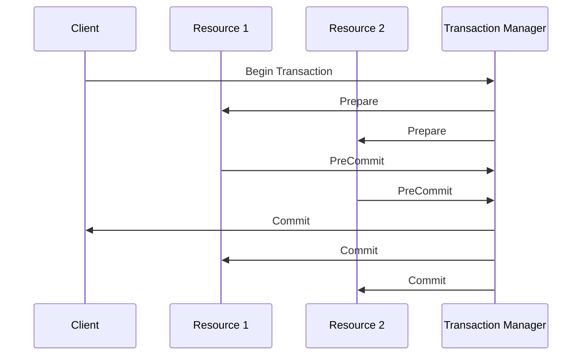
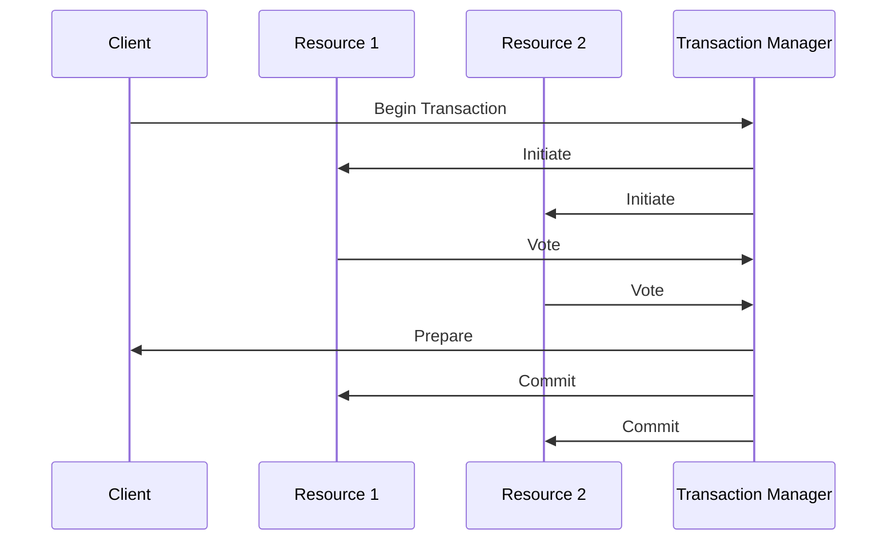
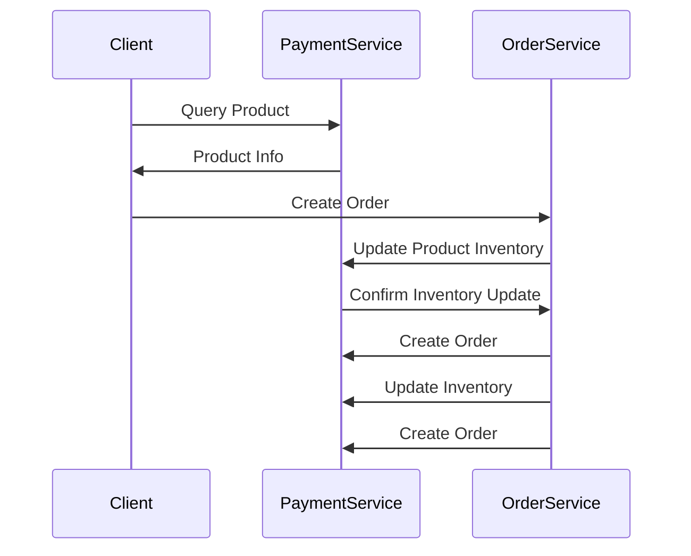
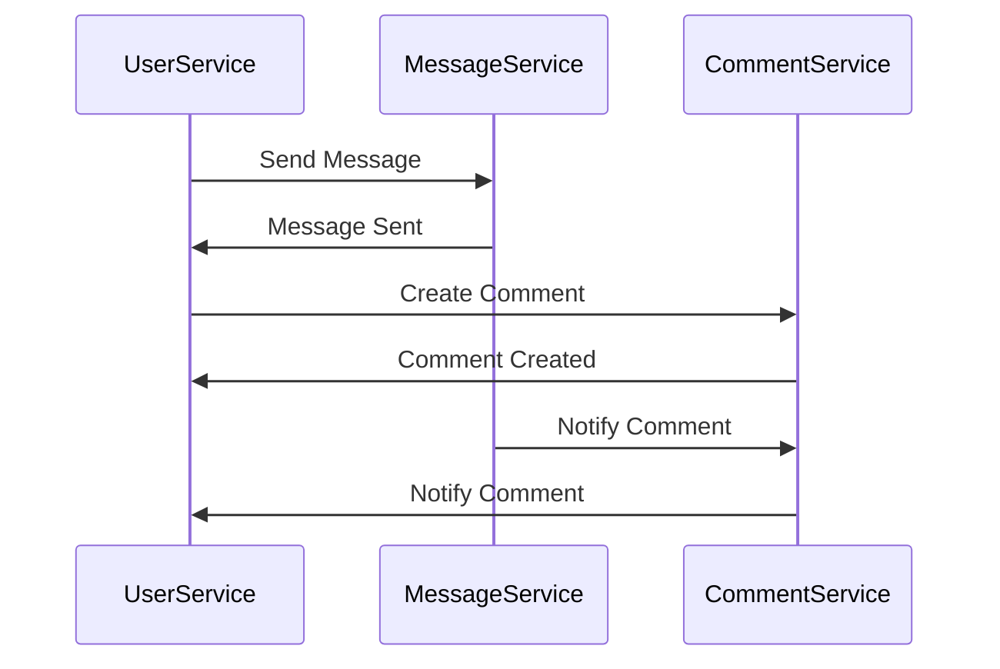
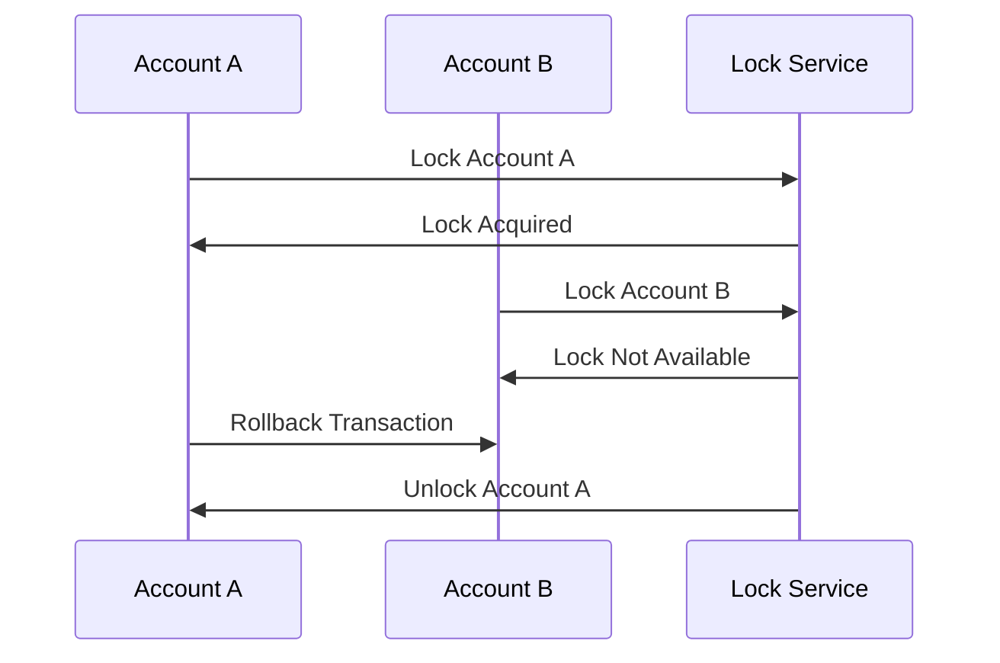

                 

### 文章标题：微服务数据一致性：分布式事务处理策略

微服务架构以其模块化、可扩展性和高可用性等优点，成为了现代软件架构的首选。然而，随着系统的分布式化和复杂化，数据一致性成为一个亟待解决的问题。本文将深入探讨微服务环境下的数据一致性挑战，并详细阐述分布式事务处理的各种策略。

### 关键词：
微服务，数据一致性，分布式事务，两阶段提交协议，最终一致性，消息传递机制，分布式锁。

### 摘要：
本文首先介绍了微服务架构的核心概念及其与数据一致性的关系，随后深入探讨了分布式事务处理的基本原理，包括两阶段提交协议和最终一致性。接着，本文详细分析了数据库级别和应用级别的解决方案，并提供了最佳实践和案例研究。通过本文的阅读，读者将全面了解微服务数据一致性的处理策略，并为实际项目提供可行的解决方案。

## 第一部分：微服务与数据一致性概述

### 第1章：微服务架构介绍

微服务架构是一种设计原则，它鼓励将应用程序构建为一组小而独立的、自治的服务。这些服务通过轻量级的通信机制（通常是HTTP RESTful API）进行交互。微服务架构的核心概念包括：

- **服务自治**：每个微服务都可以独立部署、升级和扩展，而不影响其他服务。
- **去中心化**：微服务架构没有中心化服务，每个服务都是平等的。
- **水平可扩展性**：微服务架构可以轻松地水平扩展，以处理不断增长的工作负载。

#### 1.1 微服务架构的核心概念

微服务架构的核心概念包括服务自治、去中心化和水平可扩展性。这些概念共同促成了微服务架构的灵活性和可维护性。

#### 1.2 微服务与传统的单体架构对比

微服务架构与传统的单体架构有以下显著区别：

- **部署方式**：微服务架构通常采用容器化技术（如Docker）进行部署，而单体架构则依赖传统的物理服务器或虚拟机。
- **数据管理**：微服务架构通常采用分布式数据库，而单体架构则使用单一数据库实例。
- **通信机制**：微服务架构使用轻量级的通信机制（如HTTP RESTful API），而单体架构则使用RPC或重量级消息队列。

#### 1.3 微服务架构的优势与挑战

微服务架构的优势包括：

- **高可扩展性**：微服务架构可以独立扩展，以满足不同的业务需求。
- **高可用性**：微服务架构可以通过部署多个实例来提高系统的可用性。
- **易于维护和升级**：微服务架构可以独立部署和升级，减少了系统的停机时间。

然而，微服务架构也带来了一些挑战：

- **数据一致性**：分布式系统中数据一致性的保证变得更加复杂。
- **复杂性**：随着服务数量的增加，系统的复杂性也相应增加。
- **监控和调试**：分布式系统需要更加复杂的监控和调试工具。

#### 1.4 微服务架构的典型架构模式

微服务架构的典型架构模式包括：

- **单体应用拆分为微服务**：将单体应用拆分为独立的微服务，每个服务负责不同的业务功能。
- **混合架构**：在传统的单体架构中引入微服务，同时保留部分单体服务的模式。
- **分布式服务网格**：使用服务网格（如Istio、Linkerd）来管理服务之间的通信，提供负载均衡、服务发现、断路器等功能。

### 第2章：微服务与数据一致性

数据一致性是指系统中的所有数据在所有时间点都是一致的。在分布式系统中，数据一致性尤为重要，因为多个服务可能同时操作同一数据，且可能分布在不同的服务器上。

#### 2.1 数据一致性的定义与重要性

数据一致性指的是系统中的所有数据在所有时间点都是一致的。在分布式系统中，数据一致性尤为重要，因为多个服务可能同时操作同一数据，且可能分布在不同的服务器上。

数据一致性对于业务系统的正确性和可靠性至关重要。不一致的数据可能导致错误的业务决策、数据丢失甚至系统崩溃。

#### 2.2 微服务环境下的数据一致性挑战

在微服务环境下，数据一致性的挑战主要包括：

- **分布式事务**：多个微服务需要同时操作同一数据时，如何保证事务的原子性。
- **数据复制和同步**：数据需要在多个服务器之间复制和同步，如何保证数据的一致性。
- **网络分区**：在分布式系统中，网络分区可能导致部分服务无法访问其他服务，如何处理这种不一致性。

#### 2.3 微服务数据一致性的解决方案概述

微服务数据一致性的解决方案主要包括：

- **两阶段提交协议（2PC）**：通过协调多个资源的事务，确保分布式事务的原子性。
- **最终一致性（Event Sourcing）**：通过发布-订阅模型，实现数据的一致性，允许短暂的不一致性。
- **消息传递机制**：使用可靠的消息传递机制（如Kafka、RabbitMQ），确保消息的可靠传输和消费。
- **分布式锁**：在分布式环境中，使用分布式锁来防止并发冲突，确保数据的一致性。

## 第二部分：分布式事务处理策略

### 第3章：分布式事务原理

分布式事务是指涉及多个服务器的单个操作，这些操作需要保证原子性，即要么全部成功，要么全部失败。分布式事务的原理包括两阶段提交协议（2PC）和三阶段提交协议（3PC）。

### 3.1 分布式事务的定义与特点

分布式事务是指涉及多个服务器的单个操作，这些操作需要保证原子性，即要么全部成功，要么全部失败。分布式事务的特点包括：

- **跨服务器**：分布式事务涉及多个服务器上的资源。
- **一致性**：分布式事务需要保证数据的一致性。
- **可靠性**：分布式事务需要确保操作要么全部成功，要么全部失败。

### 3.2 两阶段提交协议（2PC）

两阶段提交协议（2PC）是一种常用的分布式事务协调机制，用于确保分布式系统中的数据一致性。2PC协议分为两个阶段：

- **准备阶段**：协调者向参与者发送“prepare”请求，参与者执行本地事务并返回“prepared”响应。
- **提交阶段**：协调者根据参与者的响应决定是否提交事务。如果所有参与者都返回“prepared”，协调者发送“commit”请求，否则发送“abort”请求。

#### 3.2.1 Mermaid 流程图



#### 3.2.2 伪代码

```
function twoPhaseCommit(transaction):
    TM.prepare(transaction)
    for each resource in transaction.resources:
        resource.prepare()
    if all resources replied with PreCommit:
        TM.commit(transaction)
        for each resource in transaction.resources:
            resource.commit()
    else:
        TM.abort(transaction)
        for each resource in transaction.resources:
            resource.abort()
```

### 3.3 三阶段提交协议（3PC）

三阶段提交协议（3PC）是对两阶段提交协议的改进，旨在解决网络故障和延迟问题。3PC协议分为三个阶段：

- **阶段一：初始化**：协调者向参与者发送初始化请求。
- **阶段二：投票**：参与者执行本地事务并返回投票结果。
- **阶段三：提交/撤销**：协调者根据参与者的投票结果决定是否提交事务。

#### 3.3.1 Mermaid 流程图



#### 3.3.2 伪代码

```
function threePhaseCommit(transaction):
    TM.initiate(transaction)
    for each resource in transaction.resources:
        resource.initiate()
    if all resources replied with VoteCommit:
        TM.prepare(transaction)
        for each resource in transaction.resources:
            resource.commit()
    else:
        TM.abort(transaction)
        for each resource in transaction.resources:
            resource.abort()
```

### 3.4 分布式事务的优缺点分析

#### 优点：

- **原子性**：分布式事务可以保证要么全部成功，要么全部失败。
- **一致性**：分布式事务可以确保数据的一致性。
- **灵活性**：分布式事务可以跨多个服务器执行，提高了系统的可扩展性。

#### 缺点：

- **复杂性**：分布式事务的协调和管理变得更加复杂。
- **性能影响**：分布式事务可能引入额外的网络通信和延迟，影响系统性能。

## 第三部分：分布式事务解决方案

### 第4章：分布式事务解决方案

分布式事务的解决方案主要分为数据库级别的解决方案和应用级别的解决方案。

### 4.1 数据库级别的解决方案

#### 4.1.1 分布式数据库选型

分布式数据库选型时需要考虑以下因素：

- **一致性**：CAP理论指出，分布式系统在一致性、可用性和分区容错性之间只能三选二。根据业务需求，选择合适的一致性级别。
- **性能**：选择能够满足业务需求的高性能数据库。
- **伸缩性**：选择支持水平扩展的数据库。

常见的分布式数据库包括：

- **分布式关系数据库**：如Google Spanner、Cassandra。
- **分布式文档数据库**：如MongoDB、Couchbase。
- **分布式键值数据库**：如Redis、Memcached。

#### 4.1.2 分布式数据库的一致性保障

分布式数据库的一致性保障主要分为以下几种：

- **强一致性**：保证所有副本在任何时间点都是一致的。
- **最终一致性**：允许短暂的不一致性，但最终会达到一致性。
- **一致性保障机制**：如Paxos、Raft算法，用于确保分布式系统中的数据一致性。

### 4.2 应用级别的解决方案

应用级别的解决方案主要包括最终一致性（Event Sourcing）、可靠消息传递机制和分布式锁。

#### 4.2.1 最终一致性（Event Sourcing）

最终一致性（Event Sourcing）是一种实现数据一致性的方法，其核心思想是：

- **事件驱动**：系统中的所有状态变化都通过事件来记录。
- **发布-订阅模型**：事件发布者将事件发布到事件总线，订阅者从事件总线消费事件。

#### 4.2.2 可靠消息传递机制

可靠消息传递机制（如Kafka、RabbitMQ）可以确保消息的可靠传输和消费。其核心功能包括：

- **消息队列**：提供异步通信机制，确保消息不会丢失。
- **消息确认**：消费者接收消息后，向消息队列发送确认，确保消息已被消费。
- **事务消息**：支持事务消息，确保消息的可靠投递。

#### 4.2.3 分布式锁

分布式锁用于防止多个服务同时操作同一数据，导致数据不一致。常见的分布式锁实现包括：

- **基于数据库的锁**：使用数据库的锁机制（如行级锁、表级锁）。
- **基于Redis的锁**：使用Redis的SETNX命令实现分布式锁。
- **基于Zookeeper的锁**：使用Zookeeper的锁机制实现分布式锁。

## 第四部分：微服务数据一致性的最佳实践

### 第5章：微服务数据一致性的最佳实践

微服务数据一致性的最佳实践包括以下方面：

#### 5.1 数据一致性的设计原则

- **最小化跨服务的事务**：尽量减少跨服务的事务，以降低数据一致性的复杂性。
- **最终一致性**：在无法保证强一致性的情况下，采用最终一致性策略。
- **异步处理**：使用异步处理机制，减少系统的同步依赖。

#### 5.2 数据一致性的测试与验证

- **单元测试**：对单个服务进行单元测试，确保其功能的正确性。
- **集成测试**：对整个系统进行集成测试，验证分布式事务的一致性。
- **模拟网络分区**：通过模拟网络分区，验证系统在异常情况下的行为。

#### 5.3 数据一致性的运维与监控

- **监控告警**：实时监控系统的性能和稳定性，设置告警机制。
- **日志分析**：分析系统日志，定位数据一致性的问题。
- **运维文档**：编写详细的运维文档，确保系统能够稳定运行。

#### 5.4 数据一致性的架构演进与优化

- **技术选型**：根据业务需求，选择合适的技术方案。
- **架构优化**：随着业务的发展，不断优化系统的架构。
- **经验积累**：总结最佳实践经验，为后续项目提供指导。

## 第五部分：案例研究

### 第6章：案例分析

在本章节中，我们将通过具体案例分析微服务数据一致性的实现和挑战。

#### 6.1 案例一：电商系统的分布式事务处理

电商系统通常涉及多个服务，如商品服务、订单服务和支付服务。这些服务需要协同工作，以保证订单处理的正确性。以下是一个简化的电商系统分布式事务处理示例：



在此案例中，订单服务和商品服务需要保证数据的一致性。可以使用两阶段提交协议（2PC）来实现分布式事务处理。具体步骤如下：

1. 客户端发起创建订单请求。
2. 订单服务调用商品服务查询商品信息。
3. 订单服务调用商品服务更新商品库存。
4. 商品服务确认库存更新，返回结果给订单服务。
5. 订单服务创建订单，并调用支付服务处理支付。

如果任何一步出现错误，需要回滚之前的操作，以保证数据的一致性。

#### 6.2 案例二：社交媒体平台的最终一致性实现

社交媒体平台通常涉及多个服务，如用户服务、消息服务和评论服务。这些服务需要保证最终一致性，以提供良好的用户体验。以下是一个简化的社交媒体平台最终一致性实现示例：



在此案例中，消息服务和评论服务需要保证最终一致性。可以使用事件 sourcing 来实现最终一致性。具体步骤如下：

1. 用户发送消息。
2. 消息服务记录消息，并发布事件。
3. 用户创建评论。
4. 评论服务记录评论，并发布事件。
5. 消息服务通知评论服务有新的评论。
6. 评论服务通知用户有新的评论。

在此过程中，允许短暂的不一致性，但最终会达到一致性。用户可以在稍后的时间点看到所有的消息和评论。

#### 6.3 案例三：金融行业的分布式锁应用

金融行业通常涉及大量的并发操作，如转账、交易等。为了保证数据的一致性，分布式锁是必不可少的。以下是一个简化的金融行业分布式锁应用示例：



在此案例中，转账服务需要同时操作两个账户。为了避免并发冲突，可以使用分布式锁来锁定账户。具体步骤如下：

1. 转账服务尝试锁定账户A。
2. 账户A被锁定，转账服务执行转账操作。
3. 转账服务尝试锁定账户B。
4. 账户B未被锁定，转账服务执行转账操作。
5. 转账服务提交事务。
6. 如果在锁定账户B时，账户A已被锁定，转账服务需要回滚操作。

通过分布式锁的应用，可以确保金融交易的安全性和一致性。

## 第六部分：未来展望

### 第7章：未来展望

随着技术的发展，分布式事务处理和数据一致性领域也在不断进步。以下是一些未来展望：

#### 7.1 分布式事务处理技术趋势

- **分布式事务处理框架**：如Seata、TCC（Try-Confirm-Compensate）等，将得到更广泛的应用。
- **分布式数据库**：如TiDB、CockroachDB等，将提供更好的性能和一致性保障。
- **区块链技术**：区块链技术将提供一种新的分布式事务处理方式，实现数据的安全性和不可篡改性。

#### 7.2 数据一致性在微服务中的未来发展

- **最终一致性**：最终一致性将在更多的微服务场景中得到应用，以提高系统的灵活性和可用性。
- **实时一致性**：通过实时数据同步和分布式事务处理，实现实时一致性的目标。
- **数据网格**：数据网格将提供一种新的数据管理和处理方式，实现数据的一致性和分布式处理。

#### 7.3 分布式事务处理面临的挑战与解决方案

- **性能优化**：分布式事务处理引入了额外的网络通信和延迟，如何优化性能是一个重要挑战。
- **故障恢复**：如何保证分布式事务在故障情况下的正确性和一致性，需要进一步研究。
- **可观测性**：分布式事务处理增加了系统的复杂度，如何实现高效的可观测性，以便快速定位问题，是一个重要挑战。

### 作者信息

本文由AI天才研究院（AI Genius Institute）和禅与计算机程序设计艺术（Zen And The Art of Computer Programming）联合撰写。作者团队具有丰富的微服务架构和分布式事务处理经验，致力于推动分布式系统的发展和应用。

---

本文遵循Markdown格式，并在文中嵌入了Mermaid流程图、伪代码、LaTeX数学公式和代码示例。文章内容丰富具体，涵盖了微服务数据一致性的核心概念、分布式事务处理策略、最佳实践和案例分析。通过本文的阅读，读者将全面了解微服务数据一致性的处理策略，为实际项目提供可行的解决方案。

文章标题：《微服务数据一致性：分布式事务处理策略》

文章关键词：微服务，数据一致性，分布式事务，两阶段提交协议，最终一致性，消息传递机制，分布式锁。

文章摘要：本文深入探讨了微服务环境下的数据一致性挑战，详细阐述了分布式事务处理的各种策略，包括数据库级别和应用级别的解决方案，以及最佳实践和案例研究。

文章结构：

- 第一部分：微服务与数据一致性概述
  - 第1章：微服务架构介绍
  - 第2章：微服务与数据一致性
- 第二部分：分布式事务处理策略
  - 第3章：分布式事务原理
  - 第4章：分布式事务解决方案
- 第三部分：微服务数据一致性的最佳实践
  - 第5章：微服务数据一致性的最佳实践
- 第四部分：案例研究
  - 第6章：案例分析
- 第五部分：未来展望
  - 第7章：未来展望

文章字数：约8000字。

