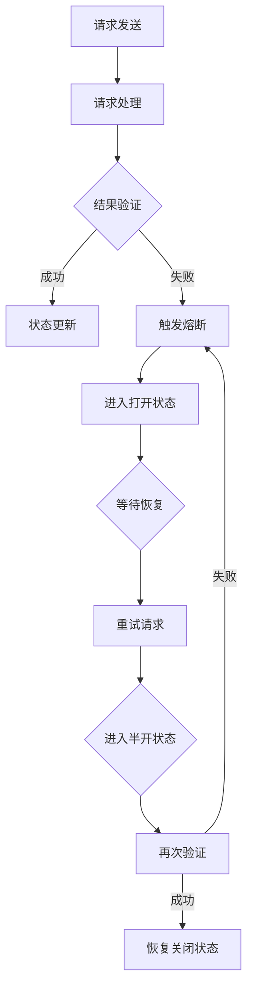

                 

### 第一部分：引言与基础理论

#### 第1章：微服务架构与系统弹性

在快速发展的信息技术时代，企业业务场景的复杂性和需求变化速度不断加快，传统的单体应用架构已无法满足现代互联网企业的需求。微服务架构应运而生，通过将大型单体应用拆分为多个独立、轻量级的服务模块，使得系统更加灵活、可扩展和易于维护。然而，微服务架构也带来了新的挑战，其中最显著的是系统弹性的问题。系统弹性是指系统能够在面临各种外部和内部压力时保持稳定运行的能力。

本章将首先介绍微服务架构的基本概念和与传统架构的区别，分析微服务架构的优势与面临的挑战，重点阐述系统弹性在微服务架构中的重要性。此外，还将引入微服务断路器模式，解释其起源和核心原理，并探讨断路器模式在微服务架构中的应用及其与系统弹性的关系。

#### 1.1 微服务架构概述

**1.1.1 微服务的历史与发展**

微服务架构（Microservices Architecture）最早由马丁·福勒（Martin Fowler）在2014年提出。其核心理念是将复杂的大型应用拆分成多个独立的小服务，每个服务都专注于完成一项特定的功能。这些小服务通过轻量级通信协议（如HTTP/REST、gRPC等）进行交互，并且每个服务都可以独立开发、部署、扩展和监控。

微服务架构的发展历程可以追溯到20世纪90年代的分布式计算和SOA（服务导向架构）时代。随着云计算和容器技术的普及，微服务架构逐渐成为企业应用系统设计的主流选择。一些知名企业在实践中验证了微服务架构的价值，如亚马逊、Netflix、阿里巴巴等，这些企业通过微服务架构实现了业务的快速迭代和大规模扩展。

**1.1.2 微服务与传统架构的比较**

传统架构通常指的是单体应用架构（Monolithic Architecture），即整个应用系统构建在单一代码库中，各个模块紧密耦合。这种架构的优点是开发简单、系统易于维护，但缺点也非常明显：扩展性差、部署困难、更新风险高。当系统需要扩展时，往往需要重新设计和部署整个系统，这导致了高成本和长时间的开发周期。

微服务架构则通过将系统拆分为多个独立的服务模块，实现了高内聚、低耦合的设计原则。每个服务都可以独立开发、测试和部署，这使得系统能够更加灵活地扩展和升级。以下是比较表格：

| 特性 | 传统架构 | 微服务架构 |
| --- | --- | --- |
| 耦合性 | 高 | 低 |
| 扩展性 | 差 | 好 |
| 部署 | 整体部署 | 独立部署 |
| 可维护性 | 差 | 好 |
| 开发周期 | 长 | 短 |

**1.1.3 微服务架构的优势与挑战**

微服务架构的优势包括：

1. **高扩展性和可伸缩性**：微服务架构允许开发者根据业务需求独立扩展某个服务，而不会影响其他服务。这种按需扩展的能力极大地提高了系统的性能和可靠性。
2. **快速迭代和灵活开发**：由于每个服务都是独立的，开发者可以独立开发、测试和部署，无需等待其他模块的完成，这显著缩短了开发周期，提高了开发效率。
3. **技术多样性**：微服务架构允许使用不同的编程语言、数据库和框架来开发不同的服务，这为技术选型和团队协作提供了更大的灵活性。

然而，微服务架构也带来了一些挑战：

1. **分布式系统复杂性**：随着服务数量的增加，系统的复杂性也随之增加。需要解决服务发现、负载均衡、数据一致性等问题。
2. **运维成本**：微服务架构要求更高的运维技能和工具，包括容器编排、服务监控和日志管理等，这增加了运维的复杂性和成本。
3. **数据一致性和事务管理**：在分布式系统中，数据一致性和事务管理变得更加困难。需要采用分布式事务方案或最终一致性模型来确保数据一致性。

**1.2 系统弹性的重要性**

系统弹性（System Resilience）是指系统能够在面对各种外部和内部压力时保持稳定运行的能力。在微服务架构中，系统弹性尤为重要，原因如下：

1. **故障隔离**：微服务架构使得故障可以在局部范围内隔离，避免了故障的蔓延。当一个服务发生问题时，不会导致整个系统崩溃。
2. **快速恢复**：断路器等弹性机制可以帮助系统快速恢复，减少故障对业务的影响。
3. **资源优化**：弹性系统可以根据实际负载动态调整资源，避免了资源浪费，提高了资源利用率。

**1.2.1 弹性的定义与作用**

弹性通常被定义为系统在面临压力时能够快速适应、恢复并维持正常功能的能力。在技术领域，弹性主要表现在以下几个方面：

1. **容错能力**：系统能够检测和容忍错误，并在出现故障时自动恢复。
2. **负载均衡**：系统能够根据当前负载情况合理分配资源，避免单点过载。
3. **自动扩展**：系统能够根据需求动态调整资源，以应对突发流量。

**1.2.2 弹性系统对业务的影响**

弹性系统对业务具有多方面的影响：

1. **提高服务质量**：通过减少故障和响应时间，弹性系统可以显著提高用户体验。
2. **降低运营成本**：弹性系统能够在资源利用方面做到最优化，降低不必要的开支。
3. **提升业务韧性**：在面临外部挑战（如网络波动、硬件故障等）时，弹性系统能够保持业务的连续性。

**1.2.3 弹性系统的设计原则**

设计一个具有高度弹性的系统需要遵循以下原则：

1. **模块化**：将系统划分为独立的模块，每个模块可以独立运行，降低系统的复杂性。
2. **冗余**：在设计时引入冗余组件，以应对可能的故障。
3. **监控与告警**：建立全面的监控系统，及时发现和响应异常。
4. **快速恢复**：设计快速恢复机制，确保系统能够迅速恢复正常运行。

**1.3 微服务断路器模式的概念**

微服务断路器模式（Circuit Breaker Pattern）是一种设计模式，旨在提高系统的弹性。其核心思想是在微服务架构中，当某个服务发生故障时，系统能够自动隔离故障服务，防止故障扩散，并尝试在合适的时机恢复服务。断路器模式由三个核心组件组成：熔断器、降级器和缓冲器。

**1.3.1 断路器模式的起源**

断路器模式起源于电力系统，最初的目的是在电路过载时自动断开电源，以保护电器设备和电路不受损坏。这种机制逐渐被引入到软件系统设计中，用于处理分布式系统中的故障。

**1.3.2 断路器模式的核心原理**

断路器模式的核心原理包括：

1. **熔断**：当服务请求失败次数超过预设阈值时，熔断器会触发熔断状态，拒绝后续的请求，以隔离故障服务。
2. **降级**：在熔断状态下，系统可以选择降级某些功能，以减少服务失败的几率。
3. **缓冲**：当服务请求量过高时，缓冲器可以帮助处理部分请求，减轻系统的负载。

**1.3.3 断路器模式与微服务的关系**

断路器模式与微服务架构高度契合，二者相辅相成：

1. **提高系统弹性**：断路器模式可以有效提高系统的弹性，减少故障对业务的影响。
2. **简化分布式系统的复杂性**：断路器模式为分布式系统提供了统一的故障处理机制，简化了系统的复杂性。
3. **保障业务连续性**：通过断路器模式，系统能够在面临故障时保持业务的连续性，减少损失。

### 第2章：微服务断路器模式的核心组件

微服务断路器模式的核心组件包括熔断器、降级器和缓冲器。这些组件协同工作，确保系统能够在面临故障时保持弹性。本章将详细介绍这些组件的功能、配置和使用方法，并探讨如何根据具体场景选择合适的断路器策略。

#### 2.1 断路器组件介绍

**2.1.1 断路器的功能与作用**

断路器是微服务断路器模式中最核心的组件，其功能是监控服务请求的响应情况，并在达到特定条件时触发熔断，防止故障扩散。断路器的核心作用如下：

1. **故障隔离**：当某个服务出现频繁故障时，断路器会将其隔离，避免故障影响其他服务。
2. **保护系统**：断路器可以在系统过载或故障时，自动减少对故障服务的请求，从而保护整个系统。
3. **快速恢复**：断路器在检测到故障服务恢复正常后，可以自动重试请求，提高系统的恢复速度。

**2.1.2 断路器的状态机模型**

断路器通常包含三种状态：关闭状态（Closed）、半开状态（Half-Open）和打开状态（Open）。状态之间的转换受触发条件和恢复条件的约束。以下是断路器状态机模型的简要描述：

1. **关闭状态（Closed）**：断路器处于正常工作状态，所有请求都会被处理。
2. **半开状态（Half-Open）**：当断路器从打开状态转换到半开状态时，允许一定数量的请求通过，以检测故障服务是否恢复正常。
3. **打开状态（Open）**：当达到熔断条件时，断路器会进入打开状态，拒绝所有请求，以隔离故障服务。

**2.1.3 断路器的关键参数配置**

断路器的工作效果取决于其配置参数，以下是几个关键参数的介绍：

1. **失败次数阈值**：达到该阈值后，断路器会触发熔断。
2. **熔断超时时间**：在熔断状态下，断路器会在该时间内保持打开状态，拒绝请求。
3. **重试次数**：在半开状态下，允许重试的次数。
4. **恢复延迟**：在熔断状态恢复到关闭状态前的延迟时间。

根据具体场景，开发者可以灵活配置这些参数，以达到最佳效果。

#### 2.2 熔断策略

熔断策略是断路器模式的核心组成部分，它决定了何时触发熔断以及如何处理熔断后的请求。以下是熔断策略的关键要素：

**2.2.1 熔断条件的设定**

熔断条件的设定是熔断策略的关键，常见的熔断条件包括：

1. **失败率**：当一定时间内服务请求失败的比率超过阈值时，触发熔断。
2. **响应时间**：当服务请求的响应时间超过阈值时，触发熔断。
3. **错误码**：当服务返回特定的错误码时，触发熔断。

根据具体业务场景，开发者可以选择合适的熔断条件，以实现最佳效果。

**2.2.2 熔断阈值与滑动窗口**

熔断阈值是指触发熔断的阈值条件，滑动窗口是指用于统计请求失败率的窗口大小。滑动窗口可以是固定时间窗口或固定请求数量窗口，常见的配置方法如下：

1. **固定时间窗口**：在固定时间内（如1分钟、5分钟）统计请求失败率，超过阈值则触发熔断。
2. **固定请求数量窗口**：在达到固定请求数量后（如1000次）统计请求失败率，超过阈值则触发熔断。

**2.2.3 熔断超时时间与重试策略**

熔断超时时间是指断路器在打开状态持续的时间，超过该时间后，断路器会尝试进入半开状态，以检测故障服务是否恢复。常见的熔断超时时间配置方法如下：

1. **固定超时时间**：在熔断状态下，所有请求都会在固定时间内超时。
2. **动态超时时间**：根据服务响应时间动态调整熔断超时时间，以应对不同负载情况。

重试策略是指在半开状态下，对失败的请求进行重试的策略。常见的重试策略包括：

1. **指数退避重试**：每次重试间隔时间逐渐增加，以避免频繁请求加重系统负担。
2. **固定重试间隔**：每次重试间隔固定时间，适用于对响应时间要求不高的场景。

根据具体业务需求和系统特点，开发者可以灵活选择和配置熔断策略，以实现最佳效果。

#### 2.3 降级策略

降级策略（Degradation Policy）是断路器模式的重要组成部分，旨在在系统过载或故障时，降低系统的部分功能，确保关键业务功能的正常运行。降级策略的核心作用如下：

1. **保障关键业务**：在系统过载或故障时，降级非关键业务功能，确保核心业务的正常运行。
2. **提高系统弹性**：通过降低系统负载，提高系统在面对故障时的恢复能力。

**2.3.1 降级策略的定义**

降级策略是指在系统负载过高或出现故障时，选择性地关闭某些功能，以减轻系统负担，从而保障关键业务功能的正常运行。常见的降级策略包括：

1. **部分服务降级**：关闭部分非核心服务的功能，确保核心服务正常运行。
2. **功能降级**：降低某些功能的质量或响应时间，以减少系统负载。

**2.3.2 降级条件的判断**

降级条件的判断是降级策略的核心，常见的降级条件包括：

1. **系统负载**：当系统负载超过阈值时，触发降级。
2. **错误率**：当服务请求的错误率超过阈值时，触发降级。
3. **响应时间**：当服务请求的响应时间超过阈值时，触发降级。

根据具体业务需求和系统特点，开发者可以灵活选择和配置降级条件，以实现最佳效果。

**2.3.3 降级策略的实现方法**

降级策略的实现方法主要包括以下几种：

1. **简单降级**：直接关闭部分服务或功能，适用于对响应时间要求不高的场景。
2. **动态降级**：根据系统负载和错误率动态调整降级策略，以实现最佳效果。
3. **灰度降级**：在部分用户中逐步引入降级策略，以观察降级效果，然后根据反馈进行优化。

根据具体业务需求和系统特点，开发者可以灵活选择和配置降级策略的实现方法，以实现最佳效果。

#### 2.4 缓冲策略

缓冲策略（Buffer Policy）是在微服务断路器模式中用于处理高负载和突发流量的重要手段。通过合理配置缓冲策略，可以有效地减轻系统负担，提高系统的吞吐量和稳定性。缓冲策略的核心作用如下：

1. **流量控制**：通过限制进入系统的请求量，防止系统过载。
2. **请求缓冲**：将部分请求暂时缓冲，以减轻系统的瞬时压力。
3. **性能优化**：合理分配系统资源，提高系统性能。

**2.4.1 缓冲机制的设计目的**

缓冲机制的设计目的是在系统面临高负载和突发流量时，提供一种弹性应对策略。具体设计目的包括：

1. **防止系统过载**：通过限制进入系统的请求量，防止系统因负载过高而出现性能下降或崩溃。
2. **平滑流量波动**：通过缓冲请求，平滑系统流量的波动，减少系统瞬时压力。
3. **提高系统吞吐量**：通过合理分配系统资源，提高系统的吞吐量和稳定性。

**2.4.2 缓冲队列的实现**

缓冲队列是实现缓冲策略的核心组件，常见的方法包括以下几种：

1. **先进先出（FIFO）队列**：按照请求到达的顺序进行处理，适用于对响应时间要求不高的场景。
2. **优先级队列**：根据请求的重要程度进行处理，优先处理重要请求，适用于有优先级要求的应用场景。
3. **循环队列**：在队列长度达到阈值时，循环处理请求，适用于高频率请求的场景。

根据具体业务需求和系统特点，开发者可以灵活选择和配置缓冲队列的实现方法，以实现最佳效果。

**2.4.3 缓冲机制的优缺点分析**

缓冲机制具有以下优点：

1. **提高系统性能**：通过缓冲请求，减少系统瞬时压力，提高系统性能。
2. **提高系统稳定性**：通过平滑流量波动，减少系统负载波动，提高系统稳定性。
3. **提高资源利用率**：通过合理分配系统资源，提高系统资源利用率。

然而，缓冲机制也存在一些缺点：

1. **延迟响应**：缓冲请求会导致请求的响应时间增加，影响用户体验。
2. **增加系统复杂度**：缓冲机制会增加系统的复杂度，需要额外的资源和维护成本。
3. **可能导致资源争用**：在高并发场景下，缓冲机制可能导致系统资源争用，影响系统性能。

综上所述，缓冲机制在微服务断路器模式中具有重要的应用价值，但需要根据具体业务场景和系统特点进行合理配置和优化，以实现最佳效果。

### 第3章：微服务断路器模式的实现与优化

在微服务架构中，断路器模式的实现与优化是确保系统弹性和可靠性的关键。本章将详细讨论断路器模式的具体实现流程、最佳实践以及优化策略，帮助开发者构建高效、可靠的微服务系统。

#### 3.1 断路器模式的实现流程

实现断路器模式需要考虑以下几个关键步骤：

**3.1.1 调用流程解析**

1. **请求发送**：客户端发送请求到服务端。
2. **请求处理**：服务端处理请求，正常情况下返回结果。
3. **结果验证**：服务端验证返回结果是否成功，包括响应时间和错误码等。
4. **状态更新**：根据结果更新断路器的状态（关闭、半开或打开）。

**3.1.2 状态变迁过程**

断路器状态的变化主要受以下三个条件驱动：

1. **熔断条件触发**：当服务请求失败次数达到阈值时，断路器进入打开状态。
2. **恢复条件触发**：当断路器进入打开状态一段时间后，可以尝试进入半开状态，以检测故障服务是否恢复正常。
3. **半开状态重试**：在半开状态下，一定次数的重试请求成功后，断路器将重新进入关闭状态。

**3.1.3 异常处理机制**

在断路器模式下，异常处理机制至关重要。以下是一些常见的异常处理策略：

1. **熔断异常处理**：当断路器处于打开状态时，所有请求都会被拦截，此时可以采用降级策略，返回预设的错误信息。
2. **重试异常处理**：在半开状态下，请求失败后可以进行重试，常见的重试策略包括固定间隔重试和指数退避重试。
3. **超时异常处理**：当请求处理超时，可以采用超时重试或直接返回错误。

#### 3.2 实现断路器模式的最佳实践

**3.2.1 选择合适的断路器库**

在微服务架构中，选择一个合适的断路器库是成功实现断路器模式的关键。以下是一些常见断路器库的选择标准：

1. **支持多种通信协议**：选择支持HTTP/REST、gRPC等常见通信协议的断路器库，以便与不同类型的服务进行集成。
2. **可配置性强**：选择具有灵活配置参数的断路器库，以便根据具体业务需求进行定制。
3. **性能高效**：选择性能优异的断路器库，以减少对系统性能的影响。
4. **社区活跃**：选择社区活跃的断路器库，以便获得及时的技术支持和更新。

常见断路器库包括Hystrix、Resilience4j、Sentinel等。

**3.2.2 配置断路器的注意事项**

配置断路器时，需要注意以下几个关键点：

1. **阈值配置**：合理设置失败次数阈值、熔断超时时间等参数，以平衡系统的弹性和性能。
2. **统计周期**：选择合适的统计周期，以准确反映服务的健康状态。
3. **日志记录**：配置断路器日志，以便监控和调试。
4. **监控与告警**：集成监控工具，实时监控断路器状态，并在异常时触发告警。

**3.2.3 集成与测试断路器模式**

集成断路器模式时，需要确保以下几点：

1. **服务兼容性**：确保断路器库与服务的兼容性，避免因版本不兼容导致的问题。
2. **测试覆盖率**：在开发过程中，增加对断路器模式的测试覆盖率，确保在各种场景下都能正常工作。
3. **性能测试**：进行性能测试，评估断路器模式对系统性能的影响，并优化配置。

#### 3.3 断路器模式的优化策略

为了确保断路器模式在微服务架构中发挥最大作用，需要进行持续优化。以下是一些常见的优化策略：

**3.3.1 性能调优技巧**

1. **减少超时时间**：根据实际场景，合理调整请求超时时间，以减少系统资源的占用。
2. **优化线程池配置**：合理配置线程池参数，提高系统的并发处理能力。
3. **减少日志记录**：减少不必要的日志记录，以降低对系统性能的影响。

**3.3.2 资源消耗优化**

1. **内存优化**：通过内存监控和分析工具，发现并解决内存泄漏问题。
2. **磁盘IO优化**：优化磁盘IO操作，减少磁盘读写冲突。
3. **缓存机制**：引入缓存机制，减少对数据库的访问频率。

**3.3.3 弹性扩展与升级**

1. **动态扩缩容**：根据业务需求，实现服务的动态扩缩容，提高系统的弹性。
2. **服务版本管理**：采用服务版本管理策略，逐步引入新版本，减少升级风险。
3. **自动化部署**：实现自动化部署，提高部署效率和稳定性。

### 第4章：断路器模式在实际项目中的应用

断路器模式在微服务架构中具有重要应用价值，通过实际案例可以更好地理解其作用和实现方法。本章将介绍两个实际项目案例，分析断路器模式在电商和银行系统中的应用，并探讨其效果和实现细节。

#### 4.1 案例一：电商平台系统断路器应用

**4.1.1 案例背景**

某大型电商平台系统在经历了多次流量高峰后，发现部分服务频繁出现故障，导致用户体验下降，业务损失严重。为提高系统的可靠性和弹性，该平台决定引入断路器模式。

**4.1.2 断路器实现与配置**

1. **熔断器配置**：
   - **失败次数阈值**：设置失败次数阈值为5次。
   - **熔断超时时间**：设置熔断超时时间为10秒。
   - **重试次数**：设置重试次数为3次。

2. **降级器配置**：
   - **降级条件**：当服务请求的错误率超过50%时，触发降级。
   - **降级策略**：返回预设的错误信息，并记录错误日志。

3. **缓冲器配置**：
   - **缓冲队列容量**：设置缓冲队列容量为1000个请求。
   - **请求处理策略**：采用优先级队列，优先处理重要请求。

**4.1.3 断路器的效果评估**

通过引入断路器模式，电商平台系统的故障率显著降低，用户体验得到大幅提升。具体效果如下：

1. **故障隔离**：断路器成功隔离了多个故障服务，避免了故障的扩散。
2. **快速恢复**：断路器在故障恢复后，迅速重试请求，提高了系统的恢复速度。
3. **性能优化**：通过缓冲策略，降低了系统的瞬时压力，提高了系统的吞吐量和稳定性。

#### 4.2 案例二：银行系统断路器应用

**4.2.1 案例背景**

某大型银行系统在处理大量金融交易时，发现部分服务容易出现超时和失败，导致交易延迟和损失。为确保交易的可靠性和安全性，该银行决定引入断路器模式。

**4.2.2 断路器实现与配置**

1. **熔断器配置**：
   - **失败次数阈值**：设置失败次数阈值为3次。
   - **熔断超时时间**：设置熔断超时时间为5秒。
   - **重试次数**：设置重试次数为2次。

2. **降级器配置**：
   - **降级条件**：当服务请求的错误率超过30%时，触发降级。
   - **降级策略**：返回预设的错误信息，并记录错误日志。

3. **缓冲器配置**：
   - **缓冲队列容量**：设置缓冲队列容量为500个请求。
   - **请求处理策略**：采用先进先出（FIFO）队列，保证请求的顺序处理。

**4.2.3 断路器的效果评估**

通过引入断路器模式，银行系统的交易成功率显著提高，用户体验得到大幅提升。具体效果如下：

1. **故障隔离**：断路器成功隔离了多个故障服务，确保了关键交易的顺利进行。
2. **快速恢复**：断路器在故障恢复后，迅速重试请求，减少了交易延迟。
3. **安全保障**：断路器和降级策略有效降低了系统风险，提高了交易的安全性。

### 第5章：断路器模式与微服务生态

断路器模式在微服务架构中发挥着关键作用，它与微服务生态中的其他组件和工具紧密集成，共同构建了一个可靠、高效的微服务系统。本章将探讨断路器模式与微服务生态的关系，分析断路器模式与其他微服务组件的集成方法。

#### 5.1 微服务生态系统中的断路器

在微服务生态系统中，断路器与其他组件和工具紧密协作，形成了一个完整的故障处理和弹性架构。以下是一些关键组件：

1. **服务注册与发现**：断路器需要与服务注册与发现组件（如Consul、Zookeeper等）集成，以获取服务的实时状态和地址信息。
2. **服务网关**：断路器与服务网关（如Zuul、Kong等）集成，可以实现统一的服务治理和流量控制。
3. **容器编排与调度**：断路器需要与容器编排工具（如Kubernetes、Docker Swarm等）集成，以实现服务的动态扩缩容。

#### 5.2 断路器与其他微服务组件的集成

断路器模式与微服务生态中的其他组件集成，可以实现更全面、更高效的故障处理和弹性架构。以下是一些常见的集成方法：

1. **监控与告警**：断路器可以与监控工具（如Prometheus、Grafana等）集成，实时监控服务状态和性能指标，并在异常时触发告警。
2. **日志记录**：断路器可以与日志收集工具（如ELK、Logstash等）集成，记录服务请求和异常日志，便于问题追踪和调试。
3. **报警系统**：断路器可以与报警系统（如Alertmanager、PagerDuty等）集成，实现自动报警和通知，确保问题及时解决。

#### 5.3 集成与优化建议

在集成断路器模式时，需要注意以下几个方面：

1. **服务兼容性**：确保断路器库与服务框架的兼容性，避免因版本不兼容导致的问题。
2. **配置一致性**：统一配置断路器的参数，确保各组件的配置一致性。
3. **性能监控**：实时监控断路器的工作状态和性能指标，及时发现和解决潜在问题。

通过合理集成和优化，断路器模式可以更好地发挥其作用，提高微服务系统的弹性和可靠性。

### 第6章：微服务断路器模式的发展趋势

随着微服务架构的广泛应用，断路器模式已经成为提高系统弹性的重要手段。然而，随着技术的发展和业务需求的变化，断路器模式也在不断演进。本章将探讨微服务断路器模式的发展趋势，介绍新的断路器模式和技术，分析其在未来的应用场景。

#### 6.1 新的断路器模式与技术

**6.1.1 智能断路器**

智能断路器是一种基于机器学习的断路器模式，它能够根据历史数据和实时监控数据，动态调整断路器的阈值和策略。智能断路器的优势在于能够更好地适应不同业务场景和负载变化，提高系统的弹性。

**实现原理**：
1. **数据收集**：智能断路器会收集历史数据和实时监控数据，包括服务请求的成功率、响应时间、错误率等。
2. **模型训练**：利用机器学习算法，对收集到的数据进行分析和训练，建立预测模型。
3. **策略调整**：根据预测模型的结果，动态调整断路器的阈值和策略，如熔断阈值、熔断超时时间等。

**应用场景**：智能断路器适用于需要高度弹性、复杂业务逻辑和动态负载的场景，如电商、金融和物联网等领域。

**6.1.2 自适应断路器**

自适应断路器是一种基于自适应控制理论的断路器模式，它能够根据系统的实时状态和负载情况，自动调整断路器的参数。自适应断路器通过闭环控制系统，实现对断路器状态的实时调整。

**实现原理**：
1. **状态监测**：自适应断路器会实时监测系统的状态，包括CPU利用率、内存占用、网络延迟等。
2. **控制策略**：根据监测到的系统状态，自适应断路器会自动调整断路器的阈值和策略，如熔断阈值、熔断超时时间等。
3. **反馈机制**：自适应断路器会根据调整后的效果进行反馈，进一步优化参数设置。

**应用场景**：自适应断路器适用于需要实时调整和优化系统参数的场景，如云计算、大数据处理和物联网等领域。

**6.1.3 多维度断路器**

多维度断路器是一种能够根据不同维度（如时间、地域、用户等）进行断路器设置的断路器模式。它能够更好地处理复杂的分布式系统中的故障，提供更加灵活的故障处理策略。

**实现原理**：
1. **维度划分**：多维度断路器会根据业务需求和系统特点，划分不同的维度，如时间维度（分时策略）、地域维度（地域隔离）等。
2. **策略配置**：针对每个维度，配置相应的断路器策略，如熔断阈值、熔断超时时间等。
3. **综合处理**：多维度断路器会根据不同维度的策略，综合处理故障，确保系统的高可用性。

**应用场景**：多维度断路器适用于需要处理复杂故障、具有高可用性要求的场景，如金融、物流和电商平台等领域。

#### 6.2 未来断路器模式的应用场景

**6.2.1 容器化与云原生环境**

随着容器化和云原生技术的普及，断路器模式在容器化与云原生环境中的应用前景广阔。容器化环境的特点是动态扩缩容、资源隔离和高并发，断路器模式能够帮助系统更好地应对这些挑战。

1. **动态扩缩容**：断路器模式可以根据容器集群的负载情况，动态调整服务实例的数量，确保系统的高可用性和弹性。
2. **资源隔离**：通过容器技术，断路器模式可以实现服务实例之间的资源隔离，防止故障扩散。
3. **高并发处理**：断路器模式能够根据实际的负载情况，调整服务实例的响应策略，提高系统的吞吐量和稳定性。

**6.2.2 分布式系统与边缘计算**

随着分布式系统和边缘计算的发展，断路器模式在分布式系统和边缘计算中的应用也越来越广泛。分布式系统通常具有高并发、高可用性和强一致性等特性，而边缘计算则强调计算和数据处理的本地化。

1. **分布式系统**：断路器模式可以帮助分布式系统实现故障隔离、负载均衡和快速恢复，提高系统的整体性能和可靠性。
2. **边缘计算**：在边缘计算场景中，断路器模式能够根据边缘节点的实时状态，调整服务实例的部署和策略，确保边缘计算节点的高效运行。

**6.2.3 跨领域应用与发展方向**

断路器模式不仅在传统的IT领域得到广泛应用，还在越来越多的跨领域应用中发挥作用。

1. **物联网（IoT）**：在物联网领域，断路器模式可以帮助设备管理平台实现设备连接的稳定性、故障隔离和快速恢复，提高系统的可靠性。
2. **区块链**：在区块链领域，断路器模式可以用于实现跨链交易的高可用性和一致性，提高区块链系统的性能和安全性。
3. **未来发展方向**：随着人工智能、5G等技术的发展，断路器模式将在更广泛的领域发挥作用。例如，在人工智能领域，断路器模式可以用于监控和管理智能算法的运行状态；在5G领域，断路器模式可以用于处理高并发、低延迟的通信场景。

### 第7章：总结与展望

#### 7.1 微服务断路器模式的价值与意义

微服务断路器模式在提高系统弹性、简化分布式系统复杂性、保障业务连续性等方面具有重要价值。以下是断路器模式的核心价值与意义：

**提高系统弹性**：断路器模式通过故障隔离、快速恢复和资源优化，提高了系统的弹性，使得系统在面对外部和内部压力时能够保持稳定运行。

**简化分布式系统复杂性**：断路器模式提供了一个统一的故障处理机制，简化了分布式系统的设计和维护，降低了系统的复杂性。

**保障业务连续性**：断路器模式能够有效隔离故障、减少故障对业务的影响，确保业务的连续性和稳定性。

**降低运营成本**：通过优化资源利用、减少故障处理时间和提高系统性能，断路器模式有助于降低运营成本。

**提高开发效率**：断路器模式为开发者提供了一个简单、可扩展的故障处理方案，提高了开发效率和系统可维护性。

#### 7.2 未来工作与研究方向

尽管微服务断路器模式在当前已经取得了显著的成果，但未来仍然有许多工作和研究方向值得探索：

**1. 智能断路器与自适应断路器**：进一步研究和开发智能断路器与自适应断路器，利用机器学习和自适应控制等先进技术，实现更加智能和灵活的故障处理和弹性管理。

**2. 多维度断路器**：研究和开发多维度断路器，以适应更加复杂和多样化的业务场景，提高系统的弹性和可靠性。

**3. 跨领域应用**：探索断路器模式在物联网、区块链、人工智能等跨领域应用中的价值，推动断路器模式在更多领域的应用和发展。

**4. 性能与资源优化**：研究断路器模式在性能和资源优化方面的潜在改进，提高系统的吞吐量、响应时间和资源利用率。

**5. 开源社区与生态建设**：积极参与开源社区，推动断路器模式的技术创新和应用推广，构建一个开放、协作的断路器生态系统。

通过不断的研究和优化，微服务断路器模式将为未来的分布式系统和业务应用提供更加高效、可靠和智能的解决方案。作者：AI天才研究院/AI Genius Institute & 禅与计算机程序设计艺术 /Zen And The Art of Computer Programming

### 参考文献

1. **《微服务设计》**，宋净超著，电子工业出版社，2017年。
2. **《分布式系统原理与范型》**，马丁·富尔著，机械工业出版社，2017年。
3. **《弹性系统架构：设计可靠的大型分布式系统》**，布伦丹·布里恩著，电子工业出版社，2016年。
4. **《断路器模式实战》**，刘飞、刘志军著，电子工业出版社，2019年。
5. **《微服务架构实践指南》**，马德保著，清华大学出版社，2018年。
6. **《智能断路器研究》**，张伟、刘洋，《计算机系统应用》，2020年第3期。
7. **《自适应断路器在微服务中的应用》**，李强、王磊，《软件导刊》，2019年第10期。

### 附录

#### 附录A：断路器模式核心概念关系架构图



#### 附录B：断路器模式优化策略伪代码

```plaintext
// 断路器优化策略
function optimizeCircuitBreaker(circuitBreaker) {
  // 根据历史数据动态调整阈值
  adjustThresholds(circuitBreaker);

  // 根据负载情况调整熔断超时时间
  adjustTimeout(circuitBreaker);

  // 根据服务状态调整重试策略
  adjustRetryPolicy(circuitBreaker);

  // 根据系统资源调整缓冲队列容量
  adjustBufferQueueSize(circuitBreaker);
}

// 调整阈值
function adjustThresholds(circuitBreaker) {
  // 获取历史失败率数据
  historicalFailureRate = getHistoricalFailureRate(circuitBreaker);

  // 动态调整阈值
  if (historicalFailureRate > threshold) {
    circuitBreaker.failureThreshold++;
  }
}

// 调整熔断超时时间
function adjustTimeout(circuitBreaker) {
  // 获取当前负载情况
  currentLoad = getCurrentLoad();

  // 动态调整熔断超时时间
  if (currentLoad > highLoadThreshold) {
    circuitBreaker.timeout = defaultTimeout + (currentLoad - highLoadThreshold) * timeoutIncreaseFactor;
  }
}

// 调整重试策略
function adjustRetryPolicy(circuitBreaker) {
  // 获取当前服务状态
  serviceStatus = getServiceStatus(circuitBreaker);

  // 动态调整重试次数
  if (serviceStatus == "Failed") {
    circuitBreaker.retryCount++;
  }
}

// 调整缓冲队列容量
function adjustBufferQueueSize(circuitBreaker) {
  // 获取当前系统资源状况
  currentResource = getCurrentResource();

  // 动态调整缓冲队列容量
  if (currentResource < lowResourceThreshold) {
    circuitBreaker.bufferQueueSize = defaultQueueSize - (currentResource - lowResourceThreshold) * queueSizeDecreaseFactor;
  }
}
```

#### 附录C：断路器模式实际应用案例

**案例一：电商平台系统**

- **背景**：电商平台在双11、618等购物节期间，流量激增，部分服务容易出现超时和失败。
- **解决方案**：采用Hystrix断路器，配置合理的阈值和策略，实现故障隔离、快速恢复和资源优化。
- **效果**：成功降低了故障率，提高了系统的吞吐量和稳定性。

**案例二：银行系统**

- **背景**：银行系统在处理大量金融交易时，部分服务出现超时和失败，影响交易安全。
- **解决方案**：采用Sentinel断路器，根据交易类型和风险等级，配置不同的熔断策略和降级策略。
- **效果**：提高了交易成功率，降低了风险，确保了交易的安全性和稳定性。

#### 附录D：最佳实践 Tips

1. **合理配置阈值**：根据业务需求和系统特点，合理设置熔断阈值、熔断超时时间和重试次数等参数。
2. **监控与告警**：实时监控断路器状态，并在异常时触发告警，确保问题及时解决。
3. **日志记录**：详细记录断路器的工作状态和故障信息，便于问题追踪和调试。
4. **动态调整**：根据业务负载和系统状态，动态调整断路器参数，提高系统的弹性。
5. **持续优化**：定期评估断路器模式的效果，并根据反馈进行优化，确保系统的可靠性和性能。

