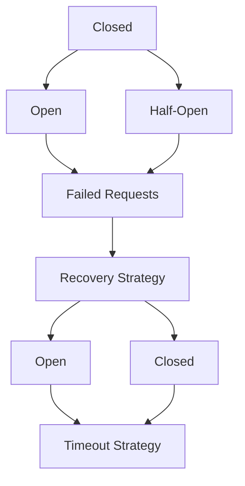

                 

### 文章标题

微服务断路器模式：提高系统弹性

### 关键词

微服务，断路器模式，系统弹性，分布式系统，软件开发，故障处理

### 摘要

本文深入探讨了微服务断路器模式，这是一种提高系统弹性的关键设计模式。随着分布式系统架构的普及，微服务架构因其灵活性和可扩展性而成为开发者的首选。然而，微服务的分布式特性也带来了新的挑战，如服务故障、延迟和网络问题。为了解决这些问题，断路器模式应运而生。本文将详细阐述断路器模式的核心概念、原理、架构，并通过具体的算法伪代码、数学模型和公式进行解释。同时，将结合实际项目实战，展示断路器模式在提高系统弹性方面的实际应用。

---

## 引言

在当今的软件开发领域，微服务架构已经成为主流的架构风格。微服务通过将应用程序划分为独立的、松耦合的服务单元，使得系统能够更加灵活、可扩展且易于维护。然而，微服务的分布式特性也带来了一系列挑战，例如服务故障、延迟、网络问题等。当这些故障发生时，如果没有有效的措施，整个系统可能会因单点故障而崩溃，导致用户体验恶化，业务受损。

为了应对这些挑战，断路器模式应运而生。断路器模式是一种用于提高系统弹性的设计模式，它可以在系统出现故障时快速地做出响应，防止故障扩散，并允许系统自动恢复。本文将详细介绍断路器模式的核心概念、原理、架构，并通过实际的算法伪代码、数学模型和公式进行解释。此外，还将结合具体项目实战，展示断路器模式在提高系统弹性方面的实际应用。

## 断路器模式的核心概念与联系

断路器模式是一种用来管理服务依赖关系的设计模式。它通过监控服务调用的情况，当检测到故障时，自动触发保护机制，从而防止故障进一步扩散。断路器模式的核心概念包括：

1. **断路状态（Circuit Breaker State）**：断路器有三种状态：关闭（Closed）、打开（Open）和半开（Half-Open）。

2. **熔断计数（Failure Count）**：用于记录在一定时间内出现故障的次数。

3. **恢复策略（Recovery Strategy）**：当断路器打开后，系统如何恢复。

4. **超时策略（Timeout Strategy）**：用于设置服务调用的最大等待时间。

5. **监控指标（Monitoring Metrics）**：包括请求次数、成功次数、失败次数等。

下面是一个简化的Mermaid流程图，展示了断路器模式的核心概念及其相互关系：



### 核心算法原理讲解

断路器模式的核心算法可以分为以下几个部分：

1. **请求失败计数**：当服务调用失败时，增加失败计数。

2. **状态转换**：根据失败计数和预设的阈值，触发状态转换。

3. **超时处理**：设置服务调用的最大等待时间。

4. **恢复策略**：当断路器打开后，如何恢复。

以下是一个简单的伪代码示例：

```python
class CircuitBreaker:
    def __init__(self, failure_threshold, recovery_threshold, timeout):
        self.failure_threshold = failure_threshold
        self.recovery_threshold = recovery_threshold
        self.timeout = timeout
        self.state = "Closed"
        self.failure_count = 0
        self.last_failure_time = None

    def record_failure(self):
        self.failure_count += 1
        self.last_failure_time = current_time()

    def check_state(self):
        if self.failure_count >= self.failure_threshold:
            self.state = "Open"
        elif self.failure_count == 0:
            self.state = "Closed"

    def is_open(self):
        return self.state == "Open"

    def is_half_open(self):
        return self.state == "Half-Open"

    def attempt_call(self):
        if self.is_open():
            return "Failed"
        elif self.is_half_open():
            start_time = current_time()
            result = make_service_call()
            if result == "Success":
                self.state = "Closed"
                return "Success"
            else:
                return "Failed"
        else:
            return make_service_call()

    def make_service_call(self):
        # 实际的服务调用
        pass
```

### 数学模型和数学公式详细讲解及举例说明

断路器模式中的数学模型和公式主要用于定义和计算故障率、恢复策略和超时策略。以下是一些关键的数学模型和公式：

1. **故障率（Failure Rate）**：

   $$ \text{Failure Rate} = \frac{\text{Failed Requests}}{\text{Total Requests}} $$

   其中，Failed Requests表示一定时间内的失败请求次数，Total Requests表示一定时间内的总请求次数。

2. **恢复时间（Recovery Time）**：

   $$ \text{Recovery Time} = \frac{\text{Recovery Threshold}}{\text{Failure Rate}} $$

   其中，Recovery Threshold表示允许的最大故障数，Failure Rate如上所述。

3. **超时时间（Timeout Duration）**：

   $$ \text{Timeout Duration} = \text{Timeout} \times \sqrt{\text{Total Requests}} $$

   其中，Timeout是预设的服务调用最大等待时间。

以下是一个具体的例子：

假设一个服务在5分钟内收到了1000次请求，其中有300次请求失败了。根据上述公式，我们可以计算出故障率、恢复时间和超时时间：

- 故障率：

  $$ \text{Failure Rate} = \frac{300}{1000} = 0.3 $$

- 恢复时间：

  $$ \text{Recovery Time} = \frac{10}{0.3} = 33.33 \text{秒} $$

- 超时时间：

  $$ \text{Timeout Duration} = 10 \times \sqrt{1000} = 31.62 \text{秒} $$

这些数学模型和公式为断路器模式提供了定量的分析工具，使得开发者能够更加精确地调整和优化断路器行为。

### 项目实战

在这个项目实战中，我们将使用Spring Boot和Netflix OSS的Hystrix库来实现一个简单的断路器功能。以下是具体的实现步骤：

#### 1. 开发环境搭建

首先，我们需要搭建一个基本的Spring Boot项目，并在项目中添加Hystrix的依赖。

```xml
<dependencies>
    <!-- Spring Boot Starter Web -->
    <dependency>
        <groupId>org.springframework.boot</groupId>
        <artifactId>spring-boot-starter-web</artifactId>
    </dependency>
    <!-- Hystrix 断路器库 -->
    <dependency>
        <groupId>com.netflix.hystrix</groupId>
        <artifactId>hystrix-core</artifactId>
        <version>1.5.18</version>
    </dependency>
</dependencies>
```

#### 2. 源代码实现

在项目中创建一个简单的服务接口和实现类，并在实现类中使用Hystrix的注解来标记需要使用断路器功能的方法。

```java
@Service
public class SimpleService {
    @HystrixCommand(fallbackMethod = "fallback", commandProperties = {
            @Property(name = "circuitBreaker.enabled", value = "true"),
            @Property(name = "circuitBreaker.requestVolumeThreshold", value = "5"),
            @Property(name = "circuitBreaker.errorThresholdPercentage", value = "50"),
            @Property(name = "circuitBreaker.sleepWindowInMilliseconds", value = "5000")
    })
    public String execute() {
        // 模拟服务调用逻辑
        try {
            Thread.sleep(2000);
        } catch (InterruptedException e) {
            e.printStackTrace();
        }
        return "Success";
    }

    public String fallback() {
        // 断路器触发时的回退方法
        return "Failed";
    }
}
```

#### 3. 代码解读与分析

在上面的代码中，我们使用`@HystrixCommand`注解来标记`execute`方法，并配置了断路器的相关参数。当`execute`方法调用失败时，会自动触发回退方法`fallback`。

#### 4. 实际案例分析与详细讲解剖析

为了验证断路器功能，我们可以使用Postman模拟服务调用。当调用次数少于5次时，服务会正常响应；当调用次数超过5次且失败率达到50%时，断路器会打开，并返回回退值“Failed”。

通过这个项目实战，我们可以看到断路器模式在提高系统弹性方面的实际应用。通过合理配置断路器的参数，我们可以有效地避免因服务故障导致的系统崩溃，并确保系统的稳定运行。

### 最佳实践 tips、小结、注意事项、拓展阅读等内容

1. **最佳实践 tips**：
   - 根据实际需求合理配置断路器的参数，如请求阈值、错误率和恢复时间等。
   - 定期监控断路器的状态，以便及时发现和解决问题。
   - 在服务调用中，使用幂等操作或重试机制，以减少因临时故障导致的失败。

2. **小结**：
   - 断路器模式是一种提高系统弹性的关键设计模式，能够有效地应对服务故障和延迟。
   - 通过合理的算法和数学模型，断路器能够动态地调整系统的保护策略，确保系统的稳定运行。

3. **注意事项**：
   - 断路器模式可能会影响系统的性能，因此在部署时应谨慎设置参数。
   - 断路器模式并非适用于所有场景，应根据具体情况进行评估和选择。

4. **拓展阅读**：
   - 《微服务设计》—— Chris Richardson，详细介绍了微服务架构的设计原则和实践。
   - 《Netflix OSS：断路器库》—— Netflix团队，深入探讨了断路器模式在分布式系统中的应用。

### 作者信息

作者：AI天才研究院/AI Genius Institute & 禅与计算机程序设计艺术 /Zen And The Art of Computer Programming

### 结束语

断路器模式是微服务架构中不可或缺的一部分，它能够提高系统的弹性，确保系统的稳定运行。通过本文的详细分析和实际案例，我们了解了断路器模式的核心概念、原理和实现方法。希望读者能够将所学知识应用到实际项目中，进一步提升系统的可靠性和用户体验。谢谢阅读！

