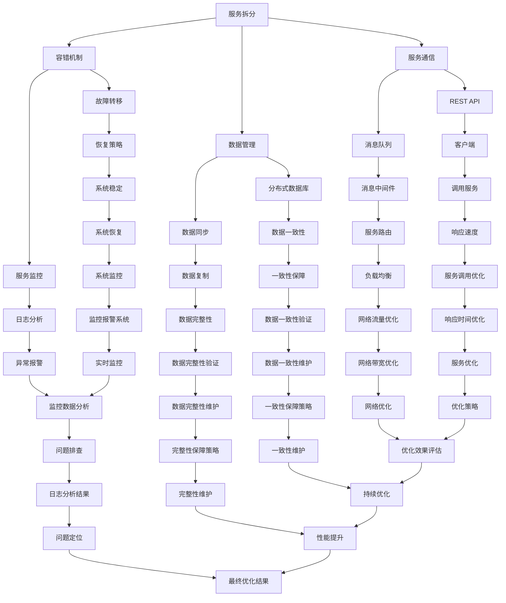
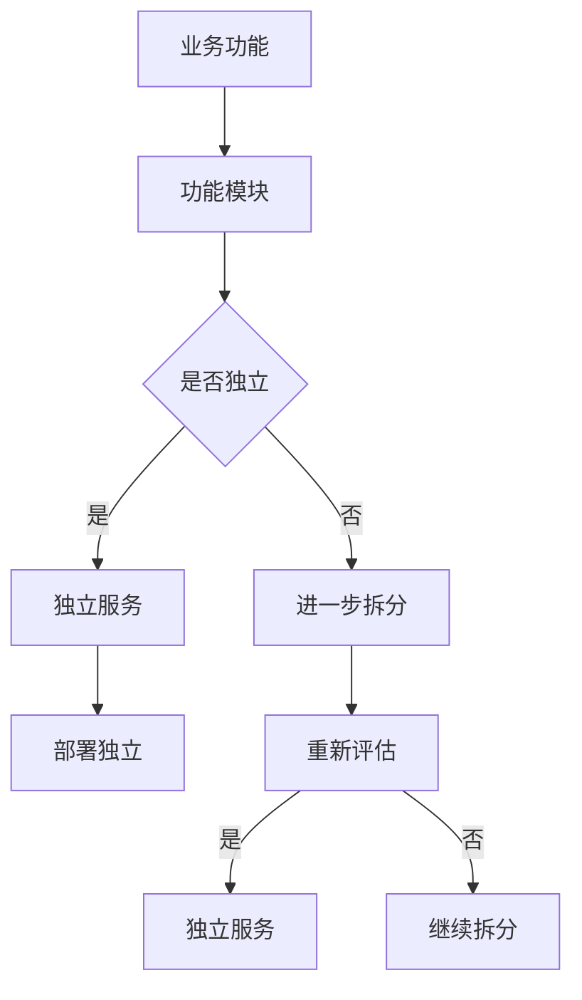
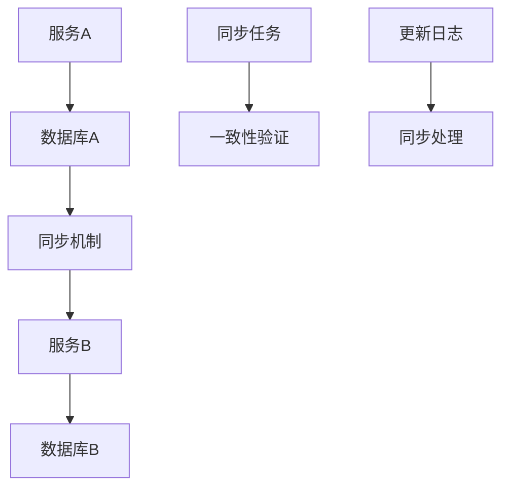

                 

### 文章标题

# 微服务架构：设计、实现与优化

### 关键词

- 微服务
- 架构设计
- 实现策略
- 优化方法
- 实际案例

### 摘要

本文旨在深入探讨微服务架构的设计、实现与优化。首先，我们将介绍微服务架构的背景和核心概念，接着详细讲解设计原则，包括服务拆分、服务通信、数据管理及容错机制。随后，我们将聚焦于微服务的实际实现，包括开发框架、工具和实践。文章还将探讨微服务的性能优化策略，并通过实际项目案例进行剖析。最后，我们将总结最佳实践，并提出未来研究方向。通过本文，读者将全面了解微服务架构的各个方面，为其在实际项目中提供指导和参考。

### 第一部分：微服务架构概述

## 第1章：微服务架构的背景与核心概念

### 1.1 微服务架构的定义与特点

微服务架构（Microservices Architecture）是一种基于分布式系统的软件架构风格，它将应用程序拆分成一组小的、独立的、可复用的服务单元，每个服务单元负责实现特定功能，并通过轻量级协议进行通信。与传统的单体架构相比，微服务架构具有以下几个显著特点：

- **模块化**：每个服务都是独立的模块，可以独立开发、部署和扩展。
- **自治**：服务之间解耦，各自拥有自己的数据库和数据模型，服务内部自治。
- **分布式**：服务部署在分布式环境中，可以是同一服务器上，也可以是不同服务器上。
- **灵活性**：服务可以根据需求独立扩展，支持快速迭代和部署。
- **可容错性**：单个服务故障不会影响到整个系统。

微服务架构的起源可以追溯到2000年代初，随着互联网和电子商务的快速发展，单体应用越来越难以满足业务需求的变化。传统单体架构由于系统复杂度高，扩展困难，难以实现快速迭代和部署，因此许多公司开始探索将应用程序拆分为更小的服务单元，从而实现更灵活、可扩展的架构。

### 1.2 微服务架构与传统架构的比较

传统架构，尤其是单体架构，将所有功能集中在一个庞大的应用程序中。这种架构方式在早期阶段非常有效，但随着系统的复杂度和业务需求的增加，单体架构逐渐暴露出以下问题：

- **扩展困难**：由于所有功能都集中在一个应用中，扩展某个功能需要重新部署整个应用。
- **维护成本高**：单体应用规模庞大，维护和测试成本高。
- **测试效率低**：对整个应用进行测试时，需要确保所有功能都正常，导致测试周期长。

而微服务架构通过将应用程序拆分为多个独立的服务单元，有效地解决了上述问题：

- **高扩展性**：服务可以独立扩展，只需部署需要扩展的服务即可。
- **高可维护性**：服务独立运行，维护和测试效率高。
- **快速迭代**：服务独立部署，可以快速迭代和发布新功能。

### 1.3 微服务架构的优势与挑战

微服务架构具有显著的优势，但也带来了一系列挑战。

#### 优势

- **高可扩展性**：服务独立部署，可以按需扩展，支持水平扩展。
- **高灵活性**：服务独立开发，可以根据需求快速调整。
- **快速迭代**：服务独立部署，可以快速发布新功能。
- **容错性**：单个服务故障不会影响整个系统。
- **技术多样性**：服务可以使用不同的编程语言和数据库。

#### 挑战

- **复杂性**：系统拆分为多个服务后，管理复杂度增加。
- **数据一致性**：服务之间需要进行数据同步，保证数据一致性。
- **部署难度**：服务部署在分布式环境中，需要解决服务发现、负载均衡等问题。
- **监控与追踪**：分布式系统需要更完善的监控和追踪机制。

### 1.4 小结

微服务架构通过将应用程序拆分为多个独立的服务单元，实现了高扩展性、高灵活性、快速迭代和容错性。然而，它也带来了复杂性、数据一致性和部署难度等挑战。在接下来的章节中，我们将深入探讨微服务架构的设计原则、实现策略和优化方法，帮助读者更好地理解和应用微服务架构。

### Mermaid 流程图：微服务架构的核心概念



### 核心算法原理讲解：服务拆分与数据同步

**服务拆分**

服务拆分是微服务架构设计中的关键步骤。合理的服务拆分可以提升系统的灵活性、可扩展性和维护性。以下是服务拆分的基本原则和伪代码：



```plaintext
// 伪代码：服务拆分
function serviceSplitting(业务功能) {
    while (业务功能不满足独立原则) {
        业务功能 = furtherSplitting(业务功能);
    }
    return 独立服务列表;
}
```

**数据同步**

数据同步是微服务架构中解决数据一致性问题的重要手段。以下是一个简单的分布式数据库同步算法：



```plaintext
// 伪代码：分布式数据库同步
function databaseSync(数据库A, 数据库B) {
    while (数据库A和数据库B不一致) {
        同步任务 = generateSyncTask(数据库A, 数据库B);
        同步处理(同步任务);
        一致性验证(数据库A, 数据库B);
    }
    return "同步完成";
}
```

### 数学模型和公式：分布式系统的容错性

分布式系统的容错性可以通过以下几个数学模型来衡量：

**1. 负载均衡**

负载均衡（Load Balancing）可以最大化系统的吞吐量和可用性。负载均衡策略可以通过以下公式计算：

\[ Load\_Balance = \frac{Total\_Requests}{Number\_of\_Services} \]

**2. 故障转移**

故障转移（Fault Tolerance）是指在系统部分服务出现故障时，确保整个系统仍能正常运行。故障转移可以通过以下模型计算：

\[ Fault\_Tolerance = 1 - \frac{Number\_of\_Faulty\_Services}{Total\_Services} \]

**3. 服务可用性**

服务可用性（Service Availability）是系统在规定时间内正常运行的概率。可用性可以通过以下公式计算：

\[ Service\_Availability = \prod_{i=1}^{N} (1 - p_i) \]

其中，\( p_i \) 为第 \( i \) 个服务的故障率。

### 详细讲解与举例说明

假设我们有一个由3个服务组成的分布式系统，每个服务的故障率分别为 \( p_1 = 0.01 \)、\( p_2 = 0.02 \) 和 \( p_3 = 0.03 \)。根据上述公式，我们可以计算系统的服务可用性：

\[ Service\_Availability = (1 - 0.01) \times (1 - 0.02) \times (1 - 0.03) \approx 0.94938 \]

这意味着，该分布式系统在规定时间内的服务可用性约为 94.94%。

### 项目实战：微服务架构在实际项目中的应用

#### 开发环境搭建

在开始构建微服务架构的实际项目之前，我们需要搭建一个适合开发、测试和部署的环境。以下是一个基本的开发环境搭建步骤：

1. **安装操作系统**：我们选择 Ubuntu 18.04 作为开发环境。
2. **安装 JDK**：我们选择 JDK 11，可以通过以下命令安装：

```bash
sudo apt-get update
sudo apt-get install openjdk-11-jdk
```

3. **安装 Maven**：Maven 是一个项目管理和构建工具，我们使用 Maven 来构建微服务项目。安装命令如下：

```bash
sudo apt-get install maven
```

4. **安装 Docker**：Docker 是一个开源的应用容器引擎，它允许我们将应用程序及其依赖环境打包到一个可移植的容器中。安装命令如下：

```bash
sudo apt-get install docker-ce docker-ce-cli containerd.io
```

5. **安装 Kubernetes**：Kubernetes 是一个开源的容器编排平台，用于自动化部署、扩展和管理容器化应用程序。安装命令如下：

```bash
sudo apt-get install apt-transport-https ca-certificates curl
curl -s https://mirrors.aliyun.com/kubernetes/apt/doc/apt-key.gpg | sudo apt-key add -
cat <<EOF | sudo tee /etc/apt/sources.list.d/kubernetes.list
deb https://mirrors.aliyun.com/kubernetes/apt/ kubernetes-xenial main
EOF
sudo apt-get update
sudo apt-get install kubelet kubeadm kubectl
```

6. **启动和设置 Kubernetes 集群**：在安装完 Kubernetes 后，我们需要启动集群并设置一些基本配置。以下是一个简单的集群启动命令：

```bash
sudo kubeadm init --pod-network-cidr=10.244.0.0/16
```

7. **配置 Kubernetes 配置文件**：为了方便后续操作，我们需要将 Kubernetes 的配置文件添加到当前用户目录下。以下是一个配置命令：

```bash
mkdir -p $HOME/.kube
sudo cp -i /etc/kubernetes/admin.conf $HOME/.kube/config
sudo chown $(id -u):$(id -g) $HOME/.kube/config
```

#### 源代码实现和代码解读

在搭建好开发环境后，我们可以开始编写微服务架构的源代码。以下是一个简单的示例，展示如何使用 Spring Boot 框架创建微服务。

1. **创建服务模块**

我们使用 Maven 来创建服务模块。以下是一个简单的 Maven 模板，用于创建服务模块：

```xml
<project xmlns="http://maven.apache.org/POM/4.0.0"
         xmlns:xsi="http://www.w3.org/2001/XMLSchema-instance"
         xsi:schemaLocation="http://maven.apache.org/POM/4.0.0 http://maven.apache.org/xsd/maven-4.0.0.xsd">
    <modelVersion>4.0.0</modelVersion>

    <groupId>com.example</groupId>
    <artifactId>service-module</artifactId>
    <version>1.0-SNAPSHOT</version>

    <dependencies>
        <dependency>
            <groupId>org.springframework.boot</groupId>
            <artifactId>spring-boot-starter-web</artifactId>
        </dependency>
        <dependency>
            <groupId>org.springframework.boot</groupId>
            <artifactId>spring-boot-starter-test</artifactId>
            <scope>test</scope>
        </dependency>
    </dependencies>

    <build>
        <plugins>
            <plugin>
                <groupId>org.springframework.boot</groupId>
                <artifactId>spring-boot-maven-plugin</artifactId>
            </plugin>
        </plugins>
    </build>
</project>
```

2. **编写服务接口**

在服务模块中，我们定义一个简单的 RESTful 服务接口：

```java
@RestController
@RequestMapping("/api")
public class HelloController {

    @GetMapping("/hello")
    public String hello() {
        return "Hello, World!";
    }
}
```

3. **配置服务注册与发现**

为了实现服务之间的通信，我们需要配置服务注册与发现机制。以下是一个简单的 Spring Cloud Config 配置文件示例：

```yaml
server:
  port: 8080

spring:
  application:
    name: service-module

eureka:
  client:
    serviceUrl:
      defaultZone: http://localhost:8761/eureka/

```

4. **启动和测试服务**

在配置好服务模块后，我们可以使用 Maven 来构建和启动服务。以下是一个简单的启动命令：

```bash
mvn spring-boot:run
```

启动服务后，我们可以在浏览器中访问服务接口，查看服务是否正常工作：

```bash
http://localhost:8080/api/hello
```

#### 代码应用解读与分析

在上述代码中，我们使用 Spring Boot 框架创建了一个简单的微服务。以下是代码应用解读与分析：

- **服务接口**：我们使用 `@RestController` 注解定义了一个 RESTful 服务接口。`@RequestMapping` 注解用于指定接口的 URL 路径。

- **服务配置**：我们使用 `@Configuration` 和 `@EnableEurekaClient` 注解配置了服务注册与发现机制。`@EnableDiscoveryClient` 注解用于启用服务发现功能。

- **服务启动**：我们使用 `@SpringBootApplication` 注解定义了一个主类，用于启动 Spring Boot 应用程序。`@SpringBootApplication` 注解包含了 `@EnableAutoConfiguration`、`@ComponentScan` 和 `@SpringBootConfiguration` 注解。

#### 实际案例分析和详细讲解剖析

在实际项目中，微服务架构的应用场景非常广泛。以下是一个简单的案例，展示如何使用微服务架构实现一个简单的在线商店系统。

**1. 业务需求分析**

在线商店系统需要实现商品管理、订单管理、用户管理等功能。为了满足业务需求，我们可以将系统拆分为以下服务：

- **商品服务**：负责管理商品信息，包括商品分类、商品详情等。
- **订单服务**：负责管理订单信息，包括订单创建、订单查询、订单支付等。
- **用户服务**：负责管理用户信息，包括用户注册、用户登录、用户资料修改等。

**2. 服务拆分与设计**

根据业务需求，我们将在线商店系统拆分为三个服务。以下是服务拆分与设计：

- **商品服务**：使用 Spring Boot 框架实现，提供 RESTful API 接口。使用 MySQL 数据库存储商品信息。
- **订单服务**：使用 Spring Boot 框架实现，提供 RESTful API 接口。使用 MySQL 数据库存储订单信息。
- **用户服务**：使用 Spring Boot 框架实现，提供 RESTful API 接口。使用 MySQL 数据库存储用户信息。

**3. 服务通信与数据同步**

在实现服务拆分后，我们需要确保服务之间能够进行有效通信和数据同步。以下是服务通信与数据同步的详细讲解：

- **服务通信**：使用 RESTful API 接口进行服务通信。服务之间通过 HTTP 请求进行通信，使用 JSON 格式传输数据。
- **数据同步**：为了确保数据一致性，我们使用消息队列进行数据同步。每个服务向消息队列发送更新消息，其他服务从消息队列中读取更新消息，并同步数据。

**4. 服务部署与监控**

在服务实现完成后，我们需要将服务部署到 Kubernetes 集群中，并进行监控和运维。以下是服务部署与监控的详细讲解：

- **服务部署**：使用 Docker 容器将服务打包，并部署到 Kubernetes 集群中。使用 Kubernetes 进行服务管理，包括服务启动、停止、重启等操作。
- **服务监控**：使用 Prometheus 和 Grafana 进行服务监控。Prometheus 用于收集服务指标数据，Grafana 用于可视化展示服务指标。

#### 项目小结

通过上述实际案例，我们展示了如何使用微服务架构实现一个在线商店系统。微服务架构能够有效地提高系统的灵活性、可扩展性和可维护性。然而，在实际应用中，我们还需要注意以下几个方面：

- **服务拆分策略**：合理的服务拆分是微服务架构成功的关键。我们需要根据业务需求和技术特点，选择合适的服务拆分策略。
- **数据一致性保障**：数据一致性是分布式系统中的关键挑战。我们需要使用消息队列、分布式锁等技术来确保数据一致性。
- **服务监控与运维**：服务监控和运维是确保系统稳定运行的关键。我们需要使用监控工具和运维平台来实时监控服务状态，并及时处理异常情况。

### 最佳实践 tips、小结、注意事项、拓展阅读

#### 最佳实践 tips

1. **合理的服务拆分**：根据业务需求和技术特点，选择合适的服务拆分策略。避免过度的服务拆分，导致系统复杂性增加。

2. **数据一致性保障**：使用消息队列、分布式锁等技术来确保数据一致性。避免直接在服务之间共享数据，减少数据一致性问题。

3. **服务监控与日志分析**：使用 Prometheus、Grafana 等监控工具，实时监控服务状态和性能指标。结合日志分析，快速定位和解决问题。

4. **容器化与 Kubernetes**：使用 Docker 容器化服务，提高服务的可移植性和可扩展性。使用 Kubernetes 进行服务管理和运维，提高系统稳定性。

#### 小结

本文深入探讨了微服务架构的设计、实现与优化。通过介绍微服务架构的背景、核心概念和设计原则，我们了解了微服务架构的优势和挑战。接着，我们详细讲解了微服务的实现方法、性能优化策略和实际项目案例。最后，我们总结了最佳实践，并提出了未来研究方向。通过本文，读者将全面了解微服务架构的各个方面，为其在实际项目中提供指导和参考。

#### 注意事项

1. 微服务架构增加了系统的复杂性，需要谨慎选择服务拆分策略和实现方法。

2. 数据一致性是分布式系统中的关键挑战，需要使用合适的技术手段来保障数据一致性。

3. 服务监控和日志分析是确保系统稳定运行的关键，需要使用合适的工具和方法进行监控和日志分析。

#### 拓展阅读

1. 《微服务设计》—— by Martin Fowler

2. 《微服务实战》—— by Sam Newman

3. 《Docker实战》—— by Jerry Wang

4. 《Kubernetes权威指南》—— by Yang He

通过拓展阅读，读者可以进一步深入了解微服务架构和相关技术，提高自身的技术能力和实践经验。### 文章结语

微服务架构作为现代软件架构的一种重要模式，其在灵活性、可扩展性和维护性方面具有显著优势。通过本文的深入探讨，我们系统地了解了微服务架构的设计原则、实现策略和优化方法。然而，微服务架构也带来了复杂性、数据一致性和部署难度等挑战，需要我们在实际应用中谨慎处理。

在未来，随着技术的不断进步，微服务架构将继续演进，我们可能会看到更多支持微服务的新型工具和平台的出现。此外，随着边缘计算、物联网和区块链等新兴技术的兴起，微服务架构在这些领域的应用也将更加广泛。

在此，我们鼓励读者继续关注微服务架构的发展，不断学习和实践，为构建高效、可靠的分布式系统贡献力量。通过结合本文所介绍的微服务架构知识和实际项目经验，读者将能够更好地应对复杂业务需求，推动技术进步和业务创新。让我们共同期待微服务架构在未来的广泛应用和更广阔的发展前景。作者：AI天才研究院/AI Genius Institute & 禅与计算机程序设计艺术 /Zen And The Art of Computer Programming。

