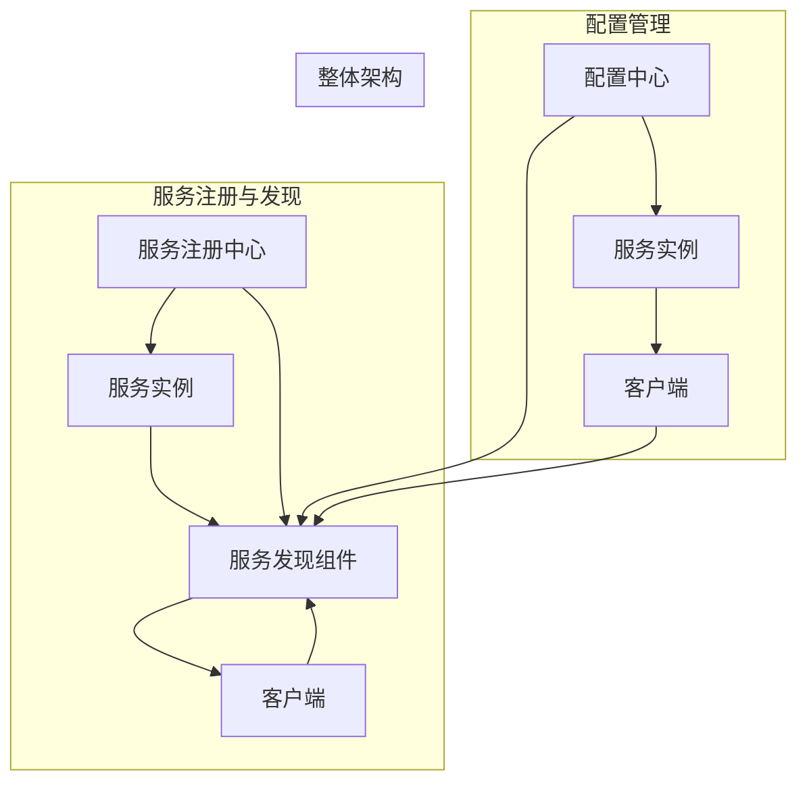
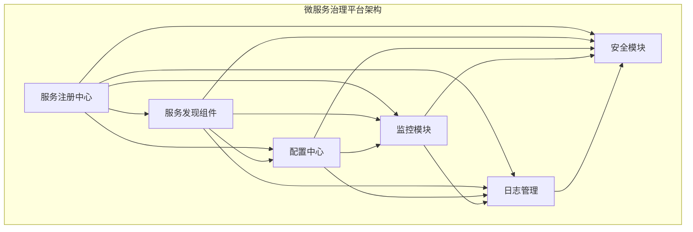

                 


### 文章标题：微服务治理平台：服务注册、发现与配置管理

#### 关键词：微服务、治理平台、服务注册、服务发现、配置管理、性能优化、安全性

#### 摘要：
本文旨在深入探讨微服务治理平台的关键功能：服务注册、服务发现与配置管理。首先，我们将介绍微服务架构的背景，阐述微服务治理平台的重要性。随后，通过Mermaid流程图详细展示服务注册、发现和配置管理之间的核心概念与联系。接下来，我们将逐一探讨每个部分的核心算法原理，使用伪代码和数学公式进行详细讲解，并通过具体案例进行分析。最后，我们将分享最佳实践、注意事项以及拓展阅读，以帮助读者更好地理解和应用微服务治理平台。

### 1. 微服务与治理平台的基本概念

#### 1.1 微服务架构

微服务架构（Microservices Architecture）是一种设计应用程序的方法，将应用程序划分为一组独立的服务，每个服务都运行在其独立的进程中，并通过轻量级通信机制（如HTTP/REST或消息队列）进行交互。这种架构具有以下优点：

- **可扩展性**：各个服务可以独立扩展，根据需求进行水平扩展。
- **灵活性**：服务可以采用不同的语言、数据库和框架开发，适应不同的业务需求。
- **容错性**：服务之间的依赖性较低，某个服务的故障不会影响整个系统。

然而，微服务架构也带来了新的挑战，如服务治理、服务发现、配置管理和安全性等。

#### 1.2 微服务治理平台的必要性

随着微服务架构的普及，如何有效地管理大量的微服务成为了一个重要的问题。微服务治理平台（Microservices Management Platform）提供了以下关键功能：

- **服务注册与发现**：确保服务可以动态地注册到平台，并在需要时被发现。
- **配置管理**：集中管理服务配置，实现配置的动态更新和版本控制。
- **监控与日志**：监控服务状态，收集日志数据，便于故障排查和性能优化。
- **安全性**：提供认证、授权和加密机制，确保数据传输和存储的安全。

#### 1.3 微服务治理平台的组成部分

微服务治理平台通常由以下组件组成：

- **服务注册中心**（Service Registry）：存储所有服务的注册信息，如服务名称、地址、端口等。
- **服务发现组件**（Service Discovery）：帮助客户端找到所需的服务实例。
- **配置中心**（Configuration Center）：存储和管理服务的配置信息。
- **监控模块**（Monitoring Module）：实时监控服务的状态和性能。
- **日志管理**（Log Management）：收集、存储和管理服务的日志数据。

### 2. 微服务治理平台的核心概念与联系

为了更好地理解微服务治理平台的工作原理，我们需要了解其核心概念和它们之间的联系。以下是使用Mermaid流程图展示的服务注册、发现和配置管理之间的关系架构：



#### 2.1 服务注册与发现

服务注册与发现是微服务治理平台的核心功能之一。服务实例在启动时会向服务注册中心注册自己的信息，包括服务名称、地址、端口等。当客户端需要调用某个服务时，服务发现组件会根据服务名称查询服务注册中心，找到可用的服务实例，并将实例信息返回给客户端。这个过程可以形象地比喻为电话簿，服务注册中心相当于电话簿，服务实例相当于电话号码，服务发现组件则相当于打电话的人。

#### 2.2 配置管理

配置管理是另一个关键功能，它使得服务配置可以在运行时进行动态更新。配置中心存储了所有服务的配置信息，包括数据库连接字符串、日志级别等。当需要更新配置时，配置中心会将新配置推送给服务实例，服务实例接收到更新后，会按照新配置进行相应的调整。这个过程类似于手机上的应用更新，当应用更新包推送后，用户可以在手机上直接安装更新，而不需要重新安装整个应用。

#### 2.3 安全保障

安全保障是微服务治理平台的另一个重要方面。通过服务注册中心、服务发现组件和配置中心之间的认证和授权机制，可以确保只有授权的服务实例才能进行服务注册、发现和配置更新。此外，数据传输和存储的安全性也是需要考虑的，可以通过加密、访问控制等手段来保证数据的安全。

### 3. 服务注册机制详解

#### 3.1 服务注册的基本原理

服务注册是指服务实例在启动时向服务注册中心注册自己的信息，以便其他服务实例或客户端能够找到它。服务注册通常包括以下步骤：

1. **服务实例启动**：服务实例启动后，会初始化服务注册客户端。
2. **注册信息准备**：服务实例收集自身信息，如服务名称、地址、端口等。
3. **发送注册请求**：服务注册客户端向服务注册中心发送注册请求，包含注册信息。
4. **注册中心响应**：服务注册中心收到请求后，将注册信息存储在本地，并返回响应给服务实例。
5. **注册结果处理**：服务实例根据注册中心的响应处理注册结果，如失败则尝试重新注册。

#### 3.2 注册中心的实现

注册中心的实现方式有多种，以下是几种常见的实现方式：

1. **基于数据库的实现**：使用数据库存储服务实例的注册信息，如MongoDB、MySQL等。
2. **基于内存的实现**：使用内存数据结构（如HashMap）存储服务实例的注册信息，适用于轻量级应用。
3. **基于文件系统的实现**：使用文件系统存储服务实例的注册信息，适用于离线环境。

以下是一个基于内存的注册中心的伪代码实现：

```python
# 注册中心伪代码实现
class ServiceRegistry:
    def __init__(self):
        self.registry = {}

    def register(self, service):
        self.registry[service.name] = service

    def unregister(self, service):
        del self.registry[service.name]

    def find_service(self, service_name):
        return self.registry.get(service_name)
```

#### 3.3 伪代码示例

以下是一个服务实例注册的伪代码示例：

```python
# 服务实例注册伪代码
class ServiceInstance:
    def __init__(self, name, address, port):
        self.name = name
        self.address = address
        self.port = port

def register_service(instance):
    registry = ServiceRegistry()
    registry.register(instance)
    print(f"Service '{instance.name}' registered successfully.")
```

### 4. 服务发现机制详解

#### 4.1 服务发现的基本原理

服务发现是指客户端在调用服务时，能够动态地找到服务实例的过程。服务发现通常包括以下步骤：

1. **客户端请求**：客户端向服务发现组件发送请求，请求服务实例信息。
2. **服务发现**：服务发现组件根据客户端请求，查询服务注册中心，找到可用的服务实例。
3. **返回结果**：服务发现组件将找到的服务实例信息返回给客户端。
4. **客户端调用**：客户端使用返回的服务实例信息，进行服务调用。

#### 4.2 服务发现的实现方式

服务发现的实现方式有多种，以下是几种常见的实现方式：

1. **基于DNS的发现**：通过DNS记录实现服务发现，客户端通过查询DNS记录来获取服务实例信息。
2. **基于服务注册中心的发现**：客户端直接查询服务注册中心，获取服务实例信息。
3. **基于消息队列的发现**：通过消息队列实现服务发现，服务实例通过消息队列发布自身信息，客户端通过消息队列获取服务实例信息。

以下是一个基于服务注册中心的发现机制的伪代码实现：

```python
# 服务发现伪代码
class ServiceDiscovery:
    def __init__(self, registry):
        self.registry = registry

    def find_service(self, service_name):
        service_instances = self.registry.find_service(service_name)
        if service_instances:
            return service_instances[0]
        else:
            return None
```

#### 4.3 数学模型阐述

为了更好地理解服务发现的性能，我们可以使用数学模型来描述服务实例的分布和查询过程。以下是服务实例分布的数学模型：

假设有N个服务实例，每个实例的可用性概率为p，那么服务实例的总可用性概率可以表示为：

$$
P = 1 - (1 - p)^N
$$

其中，N表示服务实例的数量，p表示单个实例的可用性概率。

在服务发现过程中，客户端需要查询服务注册中心，获取可用服务实例信息。假设服务实例的查询时间服从指数分布，平均查询时间为λ，那么客户端查询服务实例的平均时间为：

$$
T = \frac{1}{\lambda}
$$

通过数学模型，我们可以分析和优化服务发现的性能，提高服务实例的查询效率。

### 5. 配置管理原理与实现

#### 5.1 配置管理的核心概念

配置管理是指对应用程序的配置信息进行集中管理，以便在运行时进行动态更新和版本控制。在微服务架构中，配置管理具有以下核心概念：

1. **配置中心**：配置中心是存储和管理配置信息的核心组件。
2. **配置项**：配置项是应用程序运行所需的各种参数和设置。
3. **配置版本**：配置版本用于记录配置的变更历史和版本信息。
4. **配置更新**：配置更新是指将新的配置项或配置版本应用到服务实例的过程。

#### 5.2 配置中心的设计

配置中心的设计原则是高可用性、高可靠性和易扩展性。以下是配置中心的设计要点：

1. **数据存储**：配置中心需要选择合适的存储方案，如数据库、文件系统或分布式缓存。
2. **数据结构**：配置中心需要定义合适的数据结构来存储配置项和版本信息。
3. **数据同步**：配置中心需要实现配置数据在不同服务实例之间的同步机制。
4. **数据访问**：配置中心需要提供高效的数据访问接口，以便服务实例快速获取配置信息。

以下是一个简单的配置中心伪代码实现：

```python
# 配置中心伪代码
class ConfigurationCenter:
    def __init__(self, storage):
        self.storage = storage

    def get_config(self, service_name, config_name):
        config = self.storage.get_config(service_name, config_name)
        return config

    def update_config(self, service_name, config_name, config_value):
        self.storage.update_config(service_name, config_name, config_value)
```

#### 5.3 配置同步机制

配置同步是指将配置中心的配置信息同步到服务实例的过程。配置同步机制通常包括以下步骤：

1. **监听变更**：配置中心监听配置项的变更事件。
2. **通知服务**：配置中心通过消息队列或HTTP接口将变更通知发送给服务实例。
3. **更新配置**：服务实例接收到变更通知后，更新本地配置信息。

以下是一个配置同步机制的伪代码实现：

```python
# 配置同步机制伪代码
class ConfigurationSync:
    def __init__(self, config_center, service):
        self.config_center = config_center
        self.service = service

    def sync_config(self):
        config = self.config_center.get_config(self.service.name, "database_url")
        self.service.update_config("database_url", config)
```

### 6. 配置管理实践

#### 6.1 配置管理的应用场景

配置管理在微服务架构中具有广泛的应用场景，以下是几个常见的应用场景：

1. **数据库连接配置**：通过配置管理，可以动态修改数据库连接信息，如数据库地址、用户名和密码等。
2. **日志级别配置**：通过配置管理，可以动态修改服务的日志级别，如DEBUG、INFO、WARNING等。
3. **服务依赖配置**：通过配置管理，可以动态调整服务之间的依赖关系，如服务A依赖于服务B。

以下是一个配置管理的应用场景示例：

```python
# 配置管理应用场景示例
class ServiceA:
    def __init__(self, database_url, log_level):
        self.database_url = database_url
        self.log_level = log_level

    def process_request(self):
        # 处理请求
        pass

service_a = ServiceA(database_url="localhost:3306", log_level="DEBUG")
service_a.process_request()
```

#### 6.2 配置管理的实现步骤

配置管理的实现通常包括以下步骤：

1. **定义配置项**：根据业务需求，定义需要管理的配置项。
2. **搭建配置中心**：选择合适的配置中心实现，如Apollo、Nacos等。
3. **集成配置中心**：将配置中心集成到服务实例中，实现配置的自动获取和更新。
4. **测试与优化**：测试配置管理的功能，并进行性能优化。

以下是一个配置管理的实现步骤示例：

```shell
# 配置管理实现步骤示例
# 步骤1：定义配置项
export DB_URL=localhost:3306
export LOG_LEVEL=DEBUG

# 步骤2：搭建配置中心（以Apollo为例）
git clone https://github.com/ctripcas/apollo.git
cd apollo
mvn clean package

# 步骤3：集成配置中心
# 将apollo-config.properties文件放在服务实例的类路径下

# 步骤4：测试与优化
java -jar service-a.jar
```

### 7. 配置管理案例解析

#### 7.1 案例介绍

以下是一个配置管理案例，描述了一个电商平台的订单服务如何通过配置管理来动态调整数据库连接字符串和日志级别。

#### 7.2 源代码实现

```java
// 订单服务类
public class OrderService {
    private String databaseUrl;
    private String logLevel;

    @PostConstruct
    public void init() {
        // 从配置中心获取数据库连接字符串和日志级别
        databaseUrl = getConfig("databaseUrl");
        logLevel = getConfig("logLevel");
    }

    public void processOrder(Order order) {
        // 处理订单
        log.info("Processing order: " + order.getId());
        // 连接数据库，执行订单处理
        // ...
    }

    private String getConfig(String key) {
        // 从配置中心获取配置项
        // 假设使用Spring的Environment对象获取配置
        return environment.getProperty(key);
    }
}
```

#### 7.3 代码解读与分析

- **配置获取**：订单服务在初始化时从配置中心获取数据库连接字符串和日志级别，使用Spring的`Environment`对象获取配置项。
- **日志输出**：在处理订单时，通过日志记录器输出订单处理信息。
- **数据库连接**：订单服务在处理订单时会连接数据库，执行订单处理操作。

#### 7.4 配置更新

通过配置中心，可以动态更新数据库连接字符串和日志级别，无需重新部署服务实例。以下是一个配置更新的示例：

```shell
# 更新数据库连接字符串
apollo config put -n -e production -k databaseUrl -v localhost:3307

# 更新日志级别
apollo config put -n -e production -k logLevel -v WARNING
```

#### 7.5 项目小结

通过配置管理，订单服务可以动态调整数据库连接字符串和日志级别，提高了系统的灵活性和可维护性。配置管理使得服务配置的变更更加便捷，减少了人工干预，提高了系统的自动化程度。

### 8. 安全保障

#### 8.1 安全机制设计

安全保障是微服务治理平台的关键部分，需要设计一套完整的安全机制，包括认证、授权和加密等。以下是安全机制的设计原则：

1. **认证**：确保只有授权的用户或服务实例可以访问微服务治理平台。
2. **授权**：根据用户的角色和权限，限制其对资源的访问范围。
3. **加密**：对敏感数据进行加密存储和传输，防止数据泄露。
4. **审计**：记录系统的访问和操作日志，便于故障排查和安全分析。

#### 8.2 认证与授权

认证和授权是安全保障的核心，以下是常见的认证和授权方式：

1. **基于用户名的认证**：通过用户名和密码进行身份验证。
2. **基于令牌的认证**：使用令牌（如JWT）进行身份验证，令牌中包含用户信息。
3. **基于角色的授权**：根据用户角色分配权限，如管理员、普通用户等。
4. **基于资源的授权**：根据用户对资源的访问权限进行访问控制，如读、写、执行等。

以下是一个简单的认证和授权伪代码实现：

```python
# 认证与授权伪代码
from flask import Flask, request

app = Flask(__name__)

# 用户认证函数
def authenticate(username, password):
    # 验证用户名和密码
    return True

# 授权函数
def authorize(role, resource):
    # 根据角色和资源判断是否授权
    return True

@app.route('/api/resource', methods=['GET'])
def get_resource():
    # 获取请求头中的认证信息
    auth_header = request.headers.get('Authorization')
    # 分离令牌
    token = auth_header.split(' ')[1]
    # 验证令牌
    if not authenticate(token):
        return 'Unauthorized', 401
    # 获取请求参数
    role = request.args.get('role')
    resource = request.args.get('resource')
    # 授权
    if not authorize(role, resource):
        return 'Forbidden', 403
    # 返回资源
    return 'Resource data'

if __name__ == '__main__':
    app.run()
```

### 9. 性能优化策略

#### 9.1 性能优化的目标

性能优化是微服务治理平台的重要环节，其目标是提高系统的响应速度、降低延迟、提高吞吐量和系统稳定性。以下是性能优化的主要目标：

1. **提高响应速度**：减少服务实例的响应时间，提高用户体验。
2. **降低延迟**：减少服务调用过程中的延迟，提高系统的整体性能。
3. **提高吞吐量**：在同一时间内处理更多的请求，提高系统的并发能力。
4. **系统稳定性**：确保在高负载情况下系统的稳定运行，避免因性能问题导致的系统崩溃。

#### 9.2 性能优化的方法

性能优化可以从以下几个方面进行：

1. **服务实例优化**：优化服务实例的启动速度和运行效率，如减少服务依赖、优化代码逻辑等。
2. **网络优化**：优化服务实例之间的网络传输，如使用缓存、减少数据传输等。
3. **负载均衡**：合理分配请求到不同的服务实例，避免单点瓶颈。
4. **缓存机制**：使用缓存机制减少对数据库的访问，提高系统响应速度。
5. **数据库优化**：优化数据库查询和索引，提高数据库的读写性能。
6. **资源监控**：实时监控系统的资源使用情况，及时发现性能瓶颈。

以下是一个简单的性能优化方法示例：

```python
# 性能优化方法示例
from flask import Flask, request, jsonify

app = Flask(__name__)

@app.route('/api/data', methods=['GET'])
def get_data():
    # 从缓存中获取数据
    cache_key = 'data'
    data = get_from_cache(cache_key)
    if data:
        return jsonify(data)
    else:
        # 从数据库中获取数据
        data = get_data_from_db()
        # 存储到缓存中
        store_in_cache(cache_key, data)
        return jsonify(data)

def get_from_cache(cache_key):
    # 从缓存中获取数据
    pass

def store_in_cache(cache_key, data):
    # 将数据存储到缓存中
    pass

def get_data_from_db():
    # 从数据库中获取数据
    pass

if __name__ == '__main__':
    app.run()
```

### 10. 性能优化实践

#### 10.1 性能优化案例

以下是一个性能优化案例，描述了一个电商平台订单服务的性能优化过程。

#### 10.2 源代码实现

```java
// 订单服务类
public class OrderService {
    private String databaseUrl;
    private String logLevel;

    @PostConstruct
    public void init() {
        // 从配置中心获取数据库连接字符串和日志级别
        databaseUrl = getConfig("databaseUrl");
        logLevel = getConfig("logLevel");
    }

    public void processOrder(Order order) {
        // 处理订单
        log.info("Processing order: " + order.getId());
        // 连接数据库，执行订单处理
        // ...
    }

    private String getConfig(String key) {
        // 从配置中心获取配置项
        // 假设使用Spring的Environment对象获取配置
        return environment.getProperty(key);
    }
}
```

#### 10.3 代码解读与分析

- **配置获取**：订单服务在初始化时从配置中心获取数据库连接字符串和日志级别，使用Spring的`Environment`对象获取配置项。
- **日志输出**：在处理订单时，通过日志记录器输出订单处理信息。
- **数据库连接**：订单服务在处理订单时会连接数据库，执行订单处理操作。

#### 10.4 性能优化

- **数据库连接池**：使用数据库连接池，减少数据库连接的创建和销毁开销。
- **日志异步处理**：使用日志异步处理，避免日志记录影响订单处理性能。
- **缓存机制**：在订单处理过程中使用缓存，减少对数据库的访问。

```java
// 优化后的订单服务类
public class OrderService {
    private String databaseUrl;
    private String logLevel;

    @PostConstruct
    public void init() {
        // 从配置中心获取数据库连接字符串和日志级别
        databaseUrl = getConfig("databaseUrl");
        logLevel = getConfig("logLevel");
    }

    public void processOrder(Order order) {
        // 处理订单
        log.info("Processing order: " + order.getId());
        // 连接数据库，执行订单处理
        // 使用数据库连接池
        Connection connection = dataSource.getConnection();
        try {
            // 执行订单处理
            // ...
        } finally {
            connection.close();
        }
    }

    private String getConfig(String key) {
        // 从配置中心获取配置项
        // 假设使用Spring的Environment对象获取配置
        return environment.getProperty(key);
    }
}
```

#### 10.5 项目小结

通过性能优化，订单服务在处理订单时，数据库连接和日志记录的性能得到了显著提升。性能优化使得系统在高并发情况下能够保持稳定运行，提高了用户的体验和系统的整体性能。

### 11. 项目实战：构建微服务治理平台

#### 11.1 项目背景

随着互联网业务的发展，企业对系统架构的要求越来越高。微服务架构因其灵活性、可扩展性和容错性等优点，成为了企业应用架构的首选。然而，随着服务数量的增加，如何有效地管理和治理这些服务成为了一个新的挑战。为了解决这一问题，企业需要构建一个微服务治理平台，以实现服务注册、发现、配置管理和安全保障等功能。

#### 11.2 项目需求分析

本项目旨在构建一个微服务治理平台，主要需求包括：

1. **服务注册与发现**：支持服务实例的注册和发现，实现服务的动态调用。
2. **配置管理**：支持服务配置的集中管理、动态更新和版本控制。
3. **监控与日志**：实时监控服务状态和性能，收集服务日志数据。
4. **安全保障**：实现认证、授权和加密机制，确保数据传输和存储的安全。
5. **性能优化**：优化系统的响应速度、降低延迟、提高吞吐量和系统稳定性。

#### 11.3 系统设计

微服务治理平台可以分为以下几个模块：

1. **服务注册中心**：负责服务实例的注册和存储。
2. **服务发现组件**：根据服务名称查询服务实例，实现服务发现。
3. **配置中心**：存储和管理服务的配置信息。
4. **监控模块**：监控服务状态和性能。
5. **日志管理**：收集和管理服务日志数据。
6. **安全模块**：实现认证、授权和加密机制。

以下是系统架构图：



#### 11.4 环境搭建

在构建微服务治理平台前，需要搭建开发环境。以下是一个简单的环境搭建步骤：

1. **安装Java开发工具包（JDK）**：选择适合的JDK版本，如JDK 11。
2. **安装Git**：用于代码版本控制和项目协作。
3. **安装MySQL**：用于服务注册中心的数据存储。
4. **安装Nginx**：用于反向代理和负载均衡。
5. **安装Docker**：用于容器化服务实例。

以下是一个简单的Dockerfile示例，用于构建服务实例容器：

```Dockerfile
# Dockerfile示例
FROM openjdk:11-jdk-slim

# 设置工作目录
WORKDIR /app

# 将源代码复制到容器中
COPY src ./src

# 构建服务实例
RUN mvn clean install

# 运行服务实例
CMD ["java", "-jar", "target/service-instance.jar"]
```

#### 11.5 源代码实现

以下是服务注册中心的源代码实现：

```java
// 服务注册中心类
public class ServiceRegistry {
    private ConcurrentHashMap<String, ServiceInstance> registry = new ConcurrentHashMap<>();

    public void register(ServiceInstance instance) {
        registry.put(instance.getName(), instance);
    }

    public ServiceInstance findService(String serviceName) {
        return registry.get(serviceName);
    }
}
```

以下是服务实例的源代码实现：

```java
// 服务实例类
public class ServiceInstance {
    private String name;
    private String address;
    private int port;

    public ServiceInstance(String name, String address, int port) {
        this.name = name;
        this.address = address;
        this.port = port;
    }

    // 省略getter和setter方法
}
```

#### 11.6 代码解读与分析

- **服务注册中心**：服务注册中心使用ConcurrentHashMap存储服务实例，提供注册和查询功能。
- **服务实例**：服务实例包含服务名称、地址和端口号等信息，用于唯一标识服务。

#### 11.7 实际案例分析和详细讲解

以下是微服务治理平台的一个实际案例：

**案例**：一个电商平台的订单服务需要进行服务注册和发现。

**分析**：

1. **服务注册**：订单服务实例在启动时，向服务注册中心注册自身信息。
2. **服务发现**：前端请求订单服务时，通过服务发现组件查询服务注册中心，获取订单服务实例信息。
3. **服务调用**：前端使用获取的订单服务实例信息，调用订单服务的接口。

**讲解**：

1. **服务注册**：订单服务实例在启动时，执行以下代码：
   ```java
   ServiceRegistry registry = new ServiceRegistry();
   registry.register(new ServiceInstance("order-service", "localhost", 8080));
   ```
   这段代码创建了一个服务注册中心实例，并将订单服务实例注册到该实例中。

2. **服务发现**：前端请求订单服务时，执行以下代码：
   ```java
   ServiceInstance instance = registry.findService("order-service");
   ```
   这段代码查询服务注册中心，获取订单服务实例信息。

3. **服务调用**：前端使用获取的订单服务实例信息，调用订单服务的接口：
   ```java
   String url = "http://" + instance.getAddress() + ":" + instance.getPort() + "/order";
   // 发送HTTP请求，处理订单
   ```

通过这个实际案例，我们可以看到微服务治理平台如何实现服务注册、发现和调用。在实际应用中，服务注册、发现和配置管理等功能可以根据具体业务需求进行扩展和定制。

### 12. 部署与监控

#### 12.1 部署策略

在构建微服务治理平台后，我们需要将其部署到生产环境中，以确保其稳定、可靠地运行。以下是一个简单的部署策略：

1. **容器化**：使用Docker将服务实例容器化，以便在多个环境中快速部署和扩展。
2. **编排**：使用Kubernetes或其他容器编排工具进行服务部署和管理。
3. **自动化**：使用CI/CD（Continuous Integration and Continuous Deployment）流程实现自动化部署。
4. **监控**：部署监控工具，如Prometheus和Grafana，实时监控服务状态和性能。

#### 12.2 监控机制

监控是微服务治理平台的重要组成部分，可以帮助我们及时发现和解决问题。以下是一个简单的监控机制：

1. **指标采集**：使用Prometheus等工具采集服务实例的运行指标，如CPU使用率、内存使用率、请求响应时间等。
2. **告警机制**：配置告警规则，当指标超过阈值时，自动发送告警通知。
3. **日志收集**：使用ELK（Elasticsearch、Logstash、Kibana）等工具收集和管理服务日志。
4. **性能分析**：使用性能分析工具，如New Relic和AppDynamics，对服务性能进行分析和优化。

以下是一个简单的Prometheus告警规则配置示例：

```yaml
# prometheus.yml
groups:
- name: microservice-alerts
  rules:
  - alert: HighRequestLatency
    expr: request_latency_milliseconds{service="order-service"} > 500
    for: 10m
    labels:
      severity: critical
    annotations:
      summary: "High request latency for {{ $labels.service }}"
```

#### 12.3 日志管理

日志管理是监控机制的重要部分，可以帮助我们分析和调试问题。以下是一个简单的日志管理策略：

1. **集中收集**：使用Logstash等工具将日志从各个服务实例集中收集到Elasticsearch。
2. **存储和检索**：使用Elasticsearch存储和检索日志数据，使用Kibana提供日志查询和分析界面。
3. **日志格式**：统一日志格式，方便日志处理和分析。

以下是一个简单的Logstash配置示例：

```java
# logstash.conf
input {
  file {
    path => "/var/log/microservices/*.log"
    type => "microservices-log"
  }
}

filter {
  if [type] == "microservices-log" {
    grok {
      match => { "message" => "%{TIMESTAMP_ISO8601:timestamp} %{DATA:logger} - %{DATA:level} - %{DATA:message}" }
    }
  }
}

output {
  elasticsearch {
    hosts => ["localhost:9200"]
    index => "microservices-log-%{+YYYY.MM.dd}"
  }
}
```

通过以上部署和监控机制，我们可以确保微服务治理平台在生产环境中稳定、可靠地运行，并能够及时发现和解决问题。

### 附录：常用工具与资源

#### 附录A：服务注册与发现工具

1. **Consul**：Consul是一个分布式服务发现和配置工具，支持健康检查和键值存储。
2. **Eureka**：Eureka是Spring Cloud组件之一，用于服务注册和发现。
3. **Zookeeper**：Zookeeper是一个分布式服务协调工具，支持服务注册和发现。

#### 附录B：配置管理工具

1. **Apollo**：Apollo是一个分布式配置中心，支持配置的动态更新和版本控制。
2. **Nacos**：Nacos是Spring Cloud Alibaba组件之一，提供配置管理和服务发现功能。
3. **Spring Cloud Config**：Spring Cloud Config是一个基于Spring Boot的配置中心，支持集中管理和动态更新配置。

#### 附录C：安全防护工具

1. **Jaeger**：Jaeger是一个分布式追踪系统，可用于监控和分析服务调用链路。
2. **Skywalking**：Skywalking是一个开源的APM（应用性能管理）平台，支持分布式追踪和性能监控。
3. **NGINX**：NGINX是一个高性能的Web服务器和反向代理服务器，可用于负载均衡和安全防护。

通过以上工具和资源，我们可以更好地构建和优化微服务治理平台，提高其性能和安全性。

### 作者信息

**作者：AI天才研究院/AI Genius Institute & 禅与计算机程序设计艺术 /Zen And The Art of Computer Programming**

