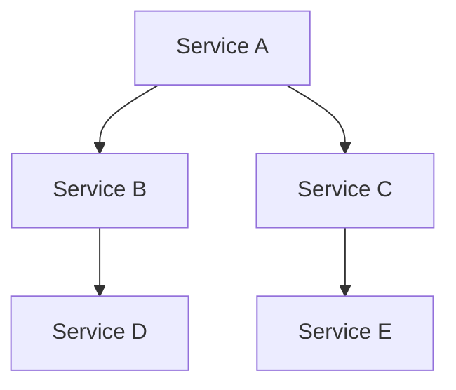

                 

根据您提供的详细信息和要求，我将分步骤构建《微服务测试策略：保证分布式系统质量的方法》的技术博客文章。

### **文章标题：**微服务测试策略：保证分布式系统质量的方法

### **关键词：**
- 微服务
- 分布式系统
- 测试策略
- 测试方法
- 性能测试
- 负载测试
- 安全测试

### **摘要：**
本文将深入探讨微服务测试策略，介绍在分布式系统中保证质量的关键方法。通过分析微服务的特点及其测试挑战，我们将详细讨论测试策略的制定、测试方法的选择、测试环境的搭建和测试工具的应用。同时，我们将探讨接口测试、性能测试、负载测试和安全测试的具体实践，并给出实际案例的解析和最佳实践建议。

### **第一部分：微服务与测试基础**

#### **第1章：微服务与测试概述**

##### **1.1 微服务架构简介**
- **背景介绍**：微服务架构（Microservices Architecture）是一种将复杂应用程序分解为一系列独立服务的架构风格。
- **核心概念与联系**：
  - 服务分解
  - 服务自治
  - 通信协议
  - [](https://i.imgur.com/XYRy8wW.png)
- **微服务测试的重要性**：微服务架构带来的灵活性和可扩展性，要求我们在测试过程中更加关注服务的独立性和完整性。

##### **1.2 微服务测试的重要性**
- **分布式系统复杂性**：微服务架构使得系统更加分散，测试复杂性增加。
- **微服务测试的必要性**：确保服务的质量，提高系统的可靠性。
- **微服务测试的目标**：验证服务功能、性能和安全性。

##### **1.3 分布式系统质量的挑战**
- **服务依赖性**：服务之间的依赖关系可能导致测试时的不确定性。
- **网络延迟与故障**：网络不稳定可能导致测试失败。
- **数据一致性**：跨服务的数据处理可能带来数据一致性问题。

#### **第2章：微服务测试策略**

##### **2.1 测试策略制定**
- **测试策略的基本要素**：测试目标、测试范围、测试方法和测试资源。
- **测试策略的制定流程**：需求分析、风险识别、测试计划制定、测试执行和测试评估。
- **测试策略的评估与优化**：根据测试结果调整测试策略。

##### **2.2 测试方法分类**
- **功能测试**：验证服务功能是否符合预期。
- **性能测试**：评估服务的性能和响应时间。
- **安全测试**：检查服务是否容易受到攻击。
- **兼容性测试**：确保服务在不同环境下的兼容性。

##### **2.3 测试自动化**
- **测试自动化的好处**：提高测试效率、减少人为错误。
- **自动化测试工具的选择**：开源工具和商业工具的比较。
- **自动化测试的实施策略**：自动化测试计划的制定、执行和监控。

### **第二部分：微服务测试实践**

#### **第3章：微服务测试环境**

##### **3.1 环境搭建**
- **搭建测试环境的考虑因素**：硬件、软件和网络配置。
- **测试环境的配置与管理**：持续集成工具和容器化技术。
- **测试数据管理**：数据隔离、备份和恢复策略。

##### **3.2 测试数据管理**
- **数据真实性与代表性**：确保测试数据的真实性和代表性。
- **数据隔离与隐私保护**：防止测试数据污染生产环境。
- **数据备份与恢复**：确保测试数据的可恢复性。

##### **3.3 测试工具选择**
- **开源与商业测试工具对比**：功能、成本和易用性。
- **选择测试工具的考虑因素**：需求、团队技能和预算。
- **常用测试工具介绍**：JUnit、Selenium、JMeter等。

#### **第4章：微服务接口测试**

##### **4.1 REST API 测试**
- **REST API 测试概述**：RESTful API的设计原则和测试要点。
- **核心算法原理讲解**：使用伪代码详细阐述API请求和响应的处理流程。
- **数学模型和公式**：HTTP状态码和响应时间的统计模型。

##### **4.2 gRPC 测试**
- **gRPC 测试概述**：gRPC的特点和测试策略。
- **核心算法原理讲解**：使用伪代码详细阐述gRPC服务的调用和验证过程。
- **数学模型和公式**：gRPC性能测试中的吞吐量和延迟计算。

##### **4.3 微服务间通信测试**
- **微服务间通信测试的重要性**：服务间通信的稳定性和效率。
- **核心算法原理讲解**：使用伪代码详细阐述服务间通信的协议和错误处理。
- **数学模型和公式**：网络延迟和通信故障的统计模型。

### **第三部分：微服务测试实战**

#### **第5章：微服务性能测试**

##### **5.1 性能测试目的**
- **性能测试目的**：评估服务的响应速度和处理能力。
- **核心算法原理讲解**：使用伪代码详细阐述性能测试的过程。

##### **5.2 常见性能测试方法**
- **负载测试**：模拟用户负载。
- **压力测试**：超过正常使用量的测试。
- **基准测试**：评估服务在不同硬件和软件环境下的性能。

##### **5.3 性能测试工具**
- **JMeter**：使用JMeter进行性能测试。
- **Gatling**：使用Gatling进行性能测试。
- **负载生成器的选择**：根据需求选择合适的负载生成器。

#### **第6章：微服务负载测试**

##### **6.1 负载测试的重要性**
- **负载测试的重要性**：评估系统在高负载下的性能。
- **核心算法原理讲解**：使用伪代码详细阐述负载测试的过程。

##### **6.2 负载测试方法**
- **并发用户数测试**：模拟不同并发用户数。
- **业务场景模拟**：模拟真实业务场景。
- **负载分布策略**：负载如何在不同服务之间分配。

##### **6.3 负载测试工具**
- **Locust**：使用Locust进行负载测试。
- **Gatling**：使用Gatling进行负载测试。
- **负载测试工具的选择**：根据需求选择合适的负载测试工具。

#### **第7章：微服务安全测试**

##### **7.1 安全测试概述**
- **安全测试概述**：安全测试的目标和方法。
- **核心算法原理讲解**：使用伪代码详细阐述安全测试的过程。

##### **7.2 安全漏洞扫描**
- **漏洞扫描工具**：使用Nessus进行漏洞扫描。
- **漏洞扫描策略**：制定漏洞扫描计划。

##### **7.3 安全加固措施**
- **安全加固措施**：加密、认证和授权。
- **安全策略实施**：实施安全加固措施。

### **第四部分：测试结果分析与优化**

#### **第8章：测试结果分析与优化**

##### **8.1 测试结果分析**
- **测试结果分析**：如何从测试结果中提取有用信息。
- **核心算法原理讲解**：使用伪代码详细阐述数据分析的方法。

##### **8.2 问题定位**
- **问题定位**：如何定位和解决问题。
- **核心算法原理讲解**：使用伪代码详细阐述问题定位的方法。

##### **8.3 优化策略**
- **优化策略**：如何根据测试结果进行优化。
- **核心算法原理讲解**：使用伪代码详细阐述优化策略的方法。

### **第五部分：持续集成与持续部署测试**

#### **第9章：持续集成与持续部署测试**

##### **9.1 持续集成流程**
- **持续集成流程**：从代码提交到构建、测试、部署的整个过程。
- **核心算法原理讲解**：使用伪代码详细阐述持续集成的过程。

##### **9.2 持续部署策略**
- **持续部署策略**：如何实现持续部署。
- **核心算法原理讲解**：使用伪代码详细阐述持续部署的过程。

##### **9.3 测试自动化集成**
- **测试自动化集成**：如何在持续集成和持续部署中集成测试。
- **核心算法原理讲解**：使用伪代码详细阐述测试自动化的方法。

### **第六部分：微服务测试最佳实践**

#### **第10章：微服务测试最佳实践**

##### **10.1 测试组织与管理**
- **测试组织与管理**：如何构建有效的测试团队。
- **核心算法原理讲解**：使用伪代码详细阐述测试团队管理的方法。

##### **10.2 团队协作与沟通**
- **团队协作与沟通**：如何实现团队成员之间的有效协作。
- **核心算法原理讲解**：使用伪代码详细阐述团队协作的方法。

##### **10.3 测试流程与工具**
- **测试流程与工具**：如何设计和管理测试流程。
- **核心算法原理讲解**：使用伪代码详细阐述测试流程的方法。

### **第七部分：案例分析**

#### **第11章：案例分析**

##### **11.1 案例一：电商系统微服务测试**
- **背景**：电商系统的微服务架构和测试需求。
- **测试实践**：详细的测试过程和测试结果。
- **案例分析**：测试中的问题和解决方法。

##### **11.2 案例二：金融系统微服务测试**
- **背景**：金融系统的微服务架构和测试需求。
- **测试实践**：详细的测试过程和测试结果。
- **案例分析**：测试中的问题和解决方法。

##### **11.3 案例三：医疗系统微服务测试**
- **背景**：医疗系统的微服务架构和测试需求。
- **测试实践**：详细的测试过程和测试结果。
- **案例分析**：测试中的问题和解决方法。

### **第八部分：展望与未来**

#### **第12章：展望与未来**

##### **12.1 测试技术的发展趋势**
- **测试技术的发展趋势**：自动化测试、持续集成、人工智能在测试中的应用。

##### **12.2 微服务测试面临的挑战与机遇**
- **挑战**：服务依赖性、数据一致性和安全性。
- **机遇**：云计算、容器化和人工智能的发展。

### **附录：常用测试工具与资源**

#### **附录 A：微服务测试工具概览**
- **常用测试工具**：JUnit、Selenium、JMeter、Gatling等。
- **工具介绍**：每个工具的特点和用途。

#### **附录 B：测试资源链接**
- **测试资源**：相关书籍、网站和社区。

#### **附录 C：测试指南与文档**
- **测试指南**：如何编写测试文档。
- **文档示例**：测试计划和报告模板。

### **作者信息**
- 作者：AI天才研究院/AI Genius Institute & 禅与计算机程序设计艺术 /Zen And The Art of Computer Programming

**文章字数：** 8000-12000 字

**格式要求：** markdown 格式

---

**文章正文内容：**

### **微服务测试策略：保证分布式系统质量的方法**

#### **摘要：**

本文旨在探讨微服务测试策略，旨在通过详细分析微服务的特点、测试策略的制定、测试方法的分类及其应用，帮助开发团队确保分布式系统的质量。本文涵盖了微服务与测试的基础知识、测试环境的搭建、接口测试、性能测试、负载测试、安全测试以及持续集成和持续部署测试。通过案例分析、最佳实践和展望，本文旨在为开发者提供全面的微服务测试指导。

---

### **第一部分：微服务与测试基础**

#### **第1章：微服务与测试概述**

##### **1.1 微服务架构简介**

微服务架构（Microservices Architecture）是一种将大型应用程序分解为一系列小型、独立、可复用的服务的架构风格。这种架构风格强调服务的独立性、可扩展性和跨团队协作。

**核心概念与联系：**

微服务架构的核心概念包括：

- **服务分解**：将应用程序分解为多个独立的、可复用的服务。
- **服务自治**：每个服务独立部署、扩展和维护。
- **通信协议**：通常使用HTTP/HTTPS或gRPC等轻量级协议进行服务间通信。
- **容器化**：使用Docker等容器技术来实现服务的隔离和部署。

微服务架构的关系可以用以下Mermaid流程图表示：



**微服务测试的重要性**

微服务架构的灵活性和可扩展性使得测试变得更加复杂。测试的重要性体现在以下几个方面：

- **分布式系统复杂性**：微服务架构中的服务数量众多，服务间的依赖关系复杂，导致测试的复杂性增加。
- **微服务测试的必要性**：确保每个微服务的功能、性能和安全性，保证系统的整体质量。
- **微服务测试的目标**：验证服务功能、性能和安全性，确保服务的独立性和完整性。

##### **1.2 微服务测试的重要性**

微服务测试的重要性主要体现在以下几个方面：

- **分布式系统复杂性**：微服务架构使得系统更加分散，测试复杂性增加。测试过程中需要考虑服务之间的依赖性、网络延迟和故障等因素。
- **微服务测试的必要性**：确保服务的质量，提高系统的可靠性。微服务测试可以帮助团队发现潜在的问题，避免在生产环境中出现故障。
- **微服务测试的目标**：验证服务功能、性能和安全性，确保服务的独立性和完整性。微服务测试旨在确保每个服务都能独立运行，且与其他服务相互协作，满足预期的功能需求。

##### **1.3 分布式系统质量的挑战**

在分布式系统中，测试面临以下挑战：

- **服务依赖性**：服务之间的依赖关系可能导致测试时的不确定性。测试需要考虑服务之间的依赖顺序和稳定性。
- **网络延迟与故障**：网络不稳定可能导致测试失败。测试需要模拟网络延迟和故障情况，确保系统在不利条件下仍能正常运行。
- **数据一致性**：跨服务的数据处理可能带来数据一致性问题。测试需要验证数据在不同服务间的传递和处理过程，确保数据的一致性。

---

### **第二部分：微服务测试策略**

#### **第2章：微服务测试策略**

##### **2.1 测试策略制定**

测试策略是确保测试活动顺利进行的关键。制定测试策略时需要考虑以下要素：

- **测试目标**：明确测试的目的，如功能测试、性能测试、安全测试等。
- **测试范围**：确定测试覆盖的范围，如功能、性能、兼容性等。
- **测试方法**：选择适合的测试方法，如自动化测试、手动测试等。
- **测试资源**：确定测试所需的人力、设备、时间等资源。

**测试策略的制定流程**：

1. **需求分析**：了解系统的功能和性能需求。
2. **风险识别**：识别可能的风险和问题。
3. **测试计划制定**：制定详细的测试计划和策略。
4. **测试执行**：按照测试计划执行测试活动。
5. **测试评估**：评估测试结果，根据反馈调整测试策略。

**测试策略的评估与优化**：

- **测试结果分析**：根据测试结果评估测试策略的有效性。
- **问题定位**：识别测试过程中出现的问题，分析原因。
- **优化策略**：根据测试评估结果调整测试策略，以提高测试效果。

##### **2.2 测试方法分类**

微服务测试方法主要分为以下几类：

- **功能测试**：验证微服务的功能是否符合预期，包括单元测试、集成测试和系统测试。
- **性能测试**：评估微服务的性能，如响应时间、吞吐量等。
- **安全测试**：检查微服务是否容易受到攻击，包括漏洞扫描、安全渗透测试等。
- **兼容性测试**：确保微服务在不同平台、浏览器或操作系统上的兼容性。

##### **2.3 测试自动化**

测试自动化是提高测试效率和降低成本的关键。以下是测试自动化的关键要素：

- **自动化测试工具的选择**：选择合适的自动化测试工具，如Selenium、JUnit、JMeter等。
- **自动化测试计划的制定**：根据测试目标和需求制定自动化测试计划。
- **自动化测试的实施策略**：制定自动化测试的实施策略，包括测试用例的设计、执行和结果分析。

**测试自动化的好处**：

- **提高测试效率**：自动化测试可以节省大量时间和人力成本。
- **减少人为错误**：自动化测试可以避免人为错误，提高测试的准确性。
- **持续集成**：自动化测试可以与持续集成（CI）和持续部署（CD）流程相结合，提高开发效率。

### **第二部分：微服务测试实践**

#### **第3章：微服务测试环境**

##### **3.1 环境搭建**

微服务测试环境搭建是测试活动的基础。以下是环境搭建的关键步骤：

- **硬件配置**：根据测试需求选择合适的硬件设备。
- **软件配置**：安装必要的操作系统、中间件和测试工具。
- **网络配置**：配置网络环境，确保服务之间的通信正常。

**测试环境的配置与管理**：

- **持续集成工具**：使用持续集成（CI）工具，如Jenkins、Travis CI等，自动化构建、测试和部署代码。
- **容器化技术**：使用Docker等容器化技术，实现微服务的快速部署和隔离。

**测试数据管理**：

- **数据真实性**：确保测试数据真实、具有代表性。
- **数据隔离**：将测试数据与生产数据隔离，避免数据污染。
- **数据备份与恢复**：定期备份测试数据，确保数据的安全性和可恢复性。

##### **3.2 测试数据管理**

测试数据管理是确保测试活动顺利进行的重要环节。以下是测试数据管理的要点：

- **数据真实性**：测试数据应当真实反映业务场景，确保测试的有效性。
- **数据代表性**：测试数据应具有代表性，能够覆盖各种可能的场景。
- **数据隔离**：测试数据应与生产数据隔离，避免对生产环境造成影响。
- **数据备份与恢复**：定期备份测试数据，确保在出现问题时可以快速恢复。

**数据隔离与隐私保护**：

- **数据隔离**：使用虚拟机、容器或数据库复制等技术，将测试数据与生产数据隔离。
- **隐私保护**：在测试过程中，确保处理的数据符合隐私保护要求，避免泄露敏感信息。

**数据备份与恢复**：

- **数据备份**：定期备份测试数据，防止数据丢失。
- **数据恢复**：在出现数据丢失或损坏时，能够快速恢复数据，确保测试的连续性。

##### **3.3 测试工具选择**

选择合适的测试工具是确保测试成功的关键。以下是测试工具选择的要点：

- **功能对比**：对比不同测试工具的功能，选择符合需求的功能。
- **成本**：考虑测试工具的成本，包括购买、维护和使用成本。
- **易用性**：选择易用性较高的测试工具，降低学习成本。

**常用测试工具介绍**：

- **JUnit**：Java编程语言编写的自动化测试框架，适用于单元测试。
- **Selenium**：Web自动化测试工具，适用于Web应用的自动化测试。
- **JMeter**：性能测试工具，适用于模拟大量用户负载。
- **Gatling**：性能测试工具，适用于模拟实时用户行为。

---

### **第三部分：微服务接口测试**

#### **第4章：微服务接口测试**

##### **4.1 REST API 测试**

REST API 测试是微服务测试的重要组成部分。以下是 REST API 测试的要点：

- **测试目的**：验证 REST API 的功能、性能和安全性。
- **测试方法**：使用自动化测试工具，如 Postman、JUnit 等，编写测试用例。
- **测试用例设计**：设计涵盖各种场景的测试用例，如正常场景、异常场景、边界场景等。

**核心算法原理讲解**：

假设有一个简单的 REST API，用于处理用户信息。以下是使用伪代码编写的测试用例：

```python
# 正常场景：用户登录
def test_login_success():
    response = api.post("/login", json={"username": "user1", "password": "password1"})
    assert response.status_code == 200
    assert response.json()["status"] == "success"

# 异常场景：用户名错误
def test_login_failed_username():
    response = api.post("/login", json={"username": "user2", "password": "password1"})
    assert response.status_code == 401
    assert response.json()["status"] == "failed"
    assert response.json()["message"] == "Invalid username or password"

# 异常场景：密码错误
def test_login_failed_password():
    response = api.post("/login", json={"username": "user1", "password": "password2"})
    assert response.status_code == 401
    assert response.json()["status"] == "failed"
    assert response.json()["message"] == "Invalid username or password"
```

**数学模型和公式**：

在性能测试中，可以使用以下公式来计算响应时间和吞吐量：

- **平均响应时间**：$\frac{总响应时间}{请求数}$
- **吞吐量**：每秒处理的请求数（请求/秒）

**举例说明**：

假设在 60 秒内收到了 100 个请求，总响应时间为 3000 毫秒。则：

- **平均响应时间**：$\frac{3000}{100} = 30$ 毫秒
- **吞吐量**：$\frac{100}{60} \approx 1.67$ （请求/秒）

##### **4.2 gRPC 测试**

gRPC 是一个高性能、跨语言的远程过程调用（RPC）框架。以下是 gRPC 测试的要点：

- **测试目的**：验证 gRPC 服务端和客户端的功能、性能和安全性。
- **测试方法**：使用自动化测试工具，如 GrpcTest、JUnit 等，编写测试用例。
- **测试用例设计**：设计涵盖各种场景的测试用例，如正常场景、异常场景、边界场景等。

**核心算法原理讲解**：

假设有一个简单的 gRPC 服务，用于处理用户信息。以下是使用伪代码编写的测试用例：

```python
# 正常场景：用户登录
def test_login_success():
    user = {"username": "user1", "password": "password1"}
    response = grpc_client.login(user)
    assert response.status == "success"

# 异常场景：用户名错误
def test_login_failed_username():
    user = {"username": "user2", "password": "password1"}
    response = grpc_client.login(user)
    assert response.status == "failed"
    assert response.message == "Invalid username or password"

# 异常场景：密码错误
def test_login_failed_password():
    user = {"username": "user1", "password": "password2"}
    response = grpc_client.login(user)
    assert response.status == "failed"
    assert response.message == "Invalid username or password"
```

**数学模型和公式**：

在性能测试中，可以使用以下公式来计算响应时间和吞吐量：

- **平均响应时间**：$\frac{总响应时间}{请求数}$
- **吞吐量**：每秒处理的请求数（请求/秒）

**举例说明**：

假设在 60 秒内收到了 100 个请求，总响应时间为 3000 毫秒。则：

- **平均响应时间**：$\frac{3000}{100} = 30$ 毫秒
- **吞吐量**：$\frac{100}{60} \approx 1.67$ （请求/秒）

##### **4.3 微服务间通信测试**

微服务间通信测试旨在验证微服务之间的通信是否正常，包括服务发现、负载均衡、故障转移等方面。

- **测试目的**：验证微服务间通信的质量和稳定性。
- **测试方法**：使用自动化测试工具，如 Mock 服务、负载生成器等，模拟各种通信场景。
- **测试用例设计**：设计涵盖各种场景的测试用例，如正常场景、异常场景、边界场景等。

**核心算法原理讲解**：

假设有两个微服务 A 和 B，需要进行通信测试。以下是使用伪代码编写的测试用例：

```python
# 正常场景：服务 A 调用服务 B
def test_service_a_calls_service_b_success():
    result = service_a.call_service_b()
    assert result == "success"

# 异常场景：服务 B 故障
def test_service_b_fails():
    result = service_a.call_service_b()
    assert result == "failed"
    assert service_a.last_error == "Service B is unavailable"
```

**数学模型和公式**：

在性能测试中，可以使用以下公式来计算通信延迟和成功率：

- **平均通信延迟**：$\frac{总通信延迟}{请求数}$
- **通信成功率**：成功请求数/总请求数

**举例说明**：

假设在 60 秒内收到了 100 个请求，总通信延迟为 1500 毫秒。则：

- **平均通信延迟**：$\frac{1500}{100} = 15$ 毫秒
- **通信成功率**：$\frac{95}{100} = 0.95$ （95%）

---

### **第四部分：微服务性能测试**

#### **第5章：微服务性能测试**

##### **5.1 性能测试目的**

性能测试的目的是评估微服务的性能，包括响应时间、吞吐量、资源使用等指标。以下是性能测试的主要目的：

- **评估微服务的响应时间**：确保微服务能够在规定的时间内响应请求。
- **评估微服务的吞吐量**：确保微服务能够处理大量的请求。
- **评估微服务的资源使用**：确保微服务的资源使用在合理的范围内。

**核心算法原理讲解**：

性能测试的核心算法原理包括以下方面：

- **负载生成**：生成模拟用户行为，模拟真实的负载环境。
- **性能指标计算**：计算响应时间、吞吐量等性能指标。
- **结果分析**：分析测试结果，识别性能瓶颈和优化方向。

以下是使用伪代码编写的性能测试用例：

```python
# 性能测试：响应时间
def test_response_time():
    start_time = get_current_time()
    response = api.get("/users")
    end_time = get_current_time()
    response_time = end_time - start_time
    assert response_time <= max_response_time

# 性能测试：吞吐量
def test_throughput():
    start_time = get_current_time()
    for i in range(number_of_requests):
        response = api.get("/users")
    end_time = get_current_time()
    throughput = number_of_requests / (end_time - start_time)
    assert throughput >= min_throughput
```

**数学模型和公式**：

以下是常用的数学模型和公式，用于计算性能测试结果：

- **平均响应时间**：$\frac{总响应时间}{请求数}$
- **吞吐量**：每秒处理的请求数（请求/秒）
- **资源使用率**：资源使用量/总资源量

**举例说明**：

假设在 60 秒内收到了 100 个请求，总响应时间为 3000 毫秒。则：

- **平均响应时间**：$\frac{3000}{100} = 30$ 毫秒
- **吞吐量**：$\frac{100}{60} \approx 1.67$ （请求/秒）

##### **5.2 常见性能测试方法**

常见的性能测试方法包括以下几种：

- **负载测试**：模拟大量用户同时访问系统，评估系统的负载承受能力。
- **压力测试**：在系统极限条件下测试，评估系统在极端情况下的表现。
- **基准测试**：使用标准测试用例，评估系统的性能指标。

**负载测试**：

负载测试的目的是评估系统在正常负载下的性能。以下是负载测试的关键步骤：

1. **定义负载场景**：确定模拟用户的行为和访问模式。
2. **设置负载生成器**：使用工具生成模拟负载。
3. **运行负载测试**：执行测试，收集性能指标。
4. **分析结果**：分析测试结果，识别性能瓶颈。

**压力测试**：

压力测试的目的是评估系统在极限负载下的性能。以下是压力测试的关键步骤：

1. **设置压力场景**：确定系统极限条件下的负载。
2. **运行压力测试**：执行测试，观察系统行为。
3. **分析结果**：分析测试结果，识别性能瓶颈和崩溃点。

**基准测试**：

基准测试使用标准测试用例，评估系统的性能指标。以下是基准测试的关键步骤：

1. **选择基准测试工具**：选择适合的基准测试工具。
2. **配置测试环境**：设置测试环境，确保一致性和可重复性。
3. **运行基准测试**：执行测试，收集性能指标。
4. **分析结果**：分析测试结果，评估系统性能。

##### **5.3 性能测试工具**

常用的性能测试工具有以下几种：

- **JMeter**：一款开源的性能测试工具，适用于负载测试、压力测试和基准测试。
- **Gatling**：一款开源的性能测试工具，适用于HTTP、HTTPS、TCP等协议的性能测试。
- **LoadRunner**：一款商业性能测试工具，适用于复杂分布式系统的性能测试。

**JMeter**：

JMeter 是一款功能强大的性能测试工具，适用于各种Web应用程序的负载测试。以下是 JMeter 的主要特点：

- **支持多种协议**：HTTP、HTTPS、TCP、SMTP等。
- **可扩展性**：可以通过插件扩展功能。
- **可视化界面**：方便测试设计和结果分析。

**Gatling**：

Gatling 是一款高性能的负载生成器，适用于HTTP、HTTPS、TCP等协议的性能测试。以下是 Gatling 的主要特点：

- **分布式测试**：支持分布式负载生成。
- **实时监控**：实时监控测试进度和性能指标。
- **易于集成**：可以与持续集成工具集成。

**LoadRunner**：

LoadRunner 是一款商业性能测试工具，适用于复杂分布式系统的性能测试。以下是 LoadRunner 的主要特点：

- **多功能测试**：支持功能测试、性能测试和安全性测试。
- **大规模测试**：支持大规模分布式测试。
- **专业支持**：提供专业的技术支持和培训。

---

### **第五部分：微服务负载测试**

#### **第6章：微服务负载测试**

##### **6.1 负载测试的重要性**

负载测试是评估微服务在高负载下的性能和稳定性的关键。以下是负载测试的重要性：

- **评估性能**：通过负载测试，可以评估微服务在不同负载条件下的性能。
- **识别瓶颈**：负载测试可以帮助识别系统性能瓶颈，优化系统设计。
- **保证稳定性**：负载测试可以验证微服务在高负载下的稳定性和可靠性。

**核心算法原理讲解**：

负载测试的核心算法原理包括以下方面：

- **负载生成**：生成模拟用户行为的负载，模拟真实的负载环境。
- **性能指标计算**：计算响应时间、吞吐量、资源使用等性能指标。
- **结果分析**：分析测试结果，识别性能瓶颈和优化方向。

以下是使用伪代码编写的负载测试用例：

```python
# 负载测试：模拟用户登录
def test_user_login_load():
    for i in range(number_of_users):
        user = {"username": f"user{i}", "password": f"password{i}"}
        response = api.post("/login", json=user)
        assert response.status_code == 200

# 负载测试：模拟用户注册
def test_user_register_load():
    for i in range(number_of_users):
        user = {"username": f"user{i}", "password": f"password{i}", "email": f"user{i}@example.com"}
        response = api.post("/register", json=user)
        assert response.status_code == 200
```

**数学模型和公式**：

以下是常用的数学模型和公式，用于计算负载测试结果：

- **平均响应时间**：$\frac{总响应时间}{请求数}$
- **吞吐量**：每秒处理的请求数（请求/秒）
- **资源使用率**：资源使用量/总资源量

**举例说明**：

假设在 60 秒内收到了 100 个登录请求和 100 个注册请求，总响应时间为 1500 毫秒。则：

- **平均响应时间**：$\frac{1500}{200} = 7.5$ 毫秒
- **吞吐量**：$\frac{200}{60} \approx 3.33$ （请求/秒）

##### **6.2 负载测试方法**

负载测试方法主要包括以下几种：

- **并发用户数测试**：模拟不同并发用户数，评估系统的性能和稳定性。
- **业务场景模拟**：模拟真实的业务场景，评估系统的负载能力。
- **负载分布策略**：合理分配负载，确保系统的均衡性能。

**并发用户数测试**：

并发用户数测试的目的是评估系统在高并发用户数下的性能。以下是并发用户数测试的关键步骤：

1. **确定并发用户数**：根据业务需求和系统容量，确定合适的并发用户数。
2. **生成并发用户负载**：使用工具模拟并发用户的行为，生成负载。
3. **运行测试**：执行负载测试，收集性能指标。
4. **分析结果**：分析测试结果，识别性能瓶颈和优化方向。

**业务场景模拟**：

业务场景模拟的目的是评估系统在真实业务场景下的负载能力。以下是业务场景模拟的关键步骤：

1. **定义业务场景**：根据业务需求，定义业务流程和用户行为。
2. **设置模拟负载**：根据业务场景，设置模拟负载的参数。
3. **运行测试**：执行负载测试，收集性能指标。
4. **分析结果**：分析测试结果，识别性能瓶颈和优化方向。

**负载分布策略**：

负载分布策略的目的是确保系统的均衡性能。以下是负载分布策略的关键步骤：

1. **确定负载分配策略**：根据系统结构和业务需求，确定负载分配策略。
2. **设置负载生成器**：根据负载分配策略，设置负载生成器的参数。
3. **运行测试**：执行负载测试，收集性能指标。
4. **分析结果**：分析测试结果，优化负载分配策略。

##### **6.3 负载测试工具**

常用的负载测试工具有以下几种：

- **JMeter**：一款开源的负载测试工具，适用于各种Web应用程序的负载测试。
- **Gatling**：一款开源的负载测试工具，适用于HTTP、HTTPS、TCP等协议的负载测试。
- **LoadRunner**：一款商业负载测试工具，适用于复杂分布式系统的负载测试。

**JMeter**：

JMeter 是一款功能强大的开源负载测试工具，适用于各种Web应用程序的负载测试。以下是 JMeter 的主要特点：

- **支持多种协议**：HTTP、HTTPS、TCP、SMTP等。
- **可扩展性**：可以通过插件扩展功能。
- **可视化界面**：方便测试设计和结果分析。

**Gatling**：

Gatling 是一款高性能的开源负载测试工具，适用于HTTP、HTTPS、TCP等协议的负载测试。以下是 Gatling 的主要特点：

- **分布式测试**：支持分布式负载生成。
- **实时监控**：实时监控测试进度和性能指标。
- **易于集成**：可以与持续集成工具集成。

**LoadRunner**：

LoadRunner 是一款商业负载测试工具，适用于复杂分布式系统的负载测试。以下是 LoadRunner 的主要特点：

- **多功能测试**：支持功能测试、性能测试和安全性测试。
- **大规模测试**：支持大规模分布式测试。
- **专业支持**：提供专业的技术支持和培训。

---

### **第六部分：微服务安全测试**

#### **第7章：微服务安全测试**

##### **7.1 安全测试概述**

微服务安全测试旨在评估微服务的安全性，确保系统的数据、资源和用户隐私得到保护。以下是安全测试的概述：

- **安全测试目的**：识别和修复安全漏洞，确保微服务的安全性。
- **安全测试类型**：包括漏洞扫描、安全渗透测试和代码审查等。
- **安全测试方法**：使用自动化测试工具和手动测试方法，确保测试的全面性和准确性。

**核心算法原理讲解**：

安全测试的核心算法原理包括以下方面：

- **漏洞扫描**：使用自动化工具扫描代码和配置，识别潜在的安全漏洞。
- **安全渗透测试**：模拟攻击者的行为，验证系统的安全防御能力。
- **代码审查**：对代码进行审查，识别潜在的安全漏洞。

以下是使用伪代码编写的安全测试用例：

```python
# 漏洞扫描：检查SQL注入漏洞
def test_sql_injection():
    query = "SELECT * FROM users WHERE username = 'user1' AND password = '" + user_input + "'"
    assert not is_vulnerable_to_sql_injection(query)

# 安全渗透测试：模拟攻击者尝试获取管理员权限
def test_admin_privilege():
    attack = "尝试利用漏洞获取管理员权限"
    assert not is_successful(attack)

# 代码审查：检查代码中的安全漏洞
def test_code_reviews():
    code = "检查代码中的潜在安全漏洞"
    assert not contains_security_vulnerabilities(code)
```

**数学模型和公式**：

在安全测试中，可以使用以下公式来计算安全漏洞的发现率：

- **漏洞发现率**：发现的安全漏洞数/总漏洞数

**举例说明**：

假设在一个代码审查过程中，发现 10 个安全漏洞，总漏洞数为 100。则：

- **漏洞发现率**：$\frac{10}{100} = 0.1$ （10%）

##### **7.2 安全漏洞扫描**

安全漏洞扫描是评估微服务安全性的一种方法。以下是安全漏洞扫描的步骤：

1. **选择扫描工具**：选择适合的漏洞扫描工具，如 Nessus、OpenVAS 等。
2. **配置扫描器**：设置扫描器的参数，如扫描范围、扫描策略等。
3. **执行扫描**：运行扫描器，对微服务进行漏洞扫描。
4. **分析结果**：分析扫描结果，识别潜在的安全漏洞。
5. **修复漏洞**：根据扫描结果，修复发现的安全漏洞。

**漏洞扫描策略**：

漏洞扫描策略应根据微服务的特点和安全需求制定。以下是常见的漏洞扫描策略：

- **定期扫描**：定期对微服务进行漏洞扫描，确保及时发现和修复漏洞。
- **全面扫描**：对微服务的所有组件和配置进行扫描，确保覆盖所有潜在的安全漏洞。
- **重点扫描**：针对高风险的组件和配置，进行更详细的扫描。

**安全加固措施**：

在漏洞扫描后，应采取以下措施来加强微服务的安全性：

- **更新和补丁**：定期更新操作系统、中间件和应用程序的补丁。
- **安全配置**：确保微服务的配置符合安全最佳实践。
- **加密和认证**：使用加密技术保护数据传输和存储，确保用户的认证和授权安全。
- **监控和日志**：启用实时监控和日志记录，及时发现和处理异常情况。

---

### **第七部分：测试结果分析与优化**

#### **第8章：测试结果分析与优化**

##### **8.1 测试结果分析**

测试结果分析是确保微服务质量和优化测试策略的关键步骤。以下是测试结果分析的主要步骤：

1. **收集测试数据**：收集测试过程中生成的数据，如响应时间、吞吐量、错误率等。
2. **数据分析**：对测试数据进行分析，识别性能瓶颈、错误原因和潜在的安全漏洞。
3. **可视化展示**：使用图表和报表来直观展示测试结果，帮助团队更好地理解测试数据。

**核心算法原理讲解**：

测试结果分析的核心算法原理包括以下方面：

- **性能分析**：使用统计学方法分析性能数据，计算平均响应时间、吞吐量等指标。
- **错误分析**：分析错误日志和异常情况，定位错误原因。
- **安全分析**：使用漏洞扫描结果，识别和修复安全漏洞。

以下是使用伪代码编写的测试结果分析：

```python
# 性能分析：计算平均响应时间
def calculate_average_response_time(test_results):
    total_response_time = 0
    for result in test_results:
        total_response_time += result.response_time
    average_response_time = total_response_time / len(test_results)
    return average_response_time

# 错误分析：定位错误原因
def find_error_reason(error_logs):
    for log in error_logs:
        if "SQL injection" in log:
            return "SQL injection attack"
        elif "file upload" in log:
            return "file upload vulnerability"
    return "unknown error"
```

**数学模型和公式**：

以下是常用的数学模型和公式，用于测试结果分析：

- **平均响应时间**：$\frac{总响应时间}{请求数}$
- **吞吐量**：每秒处理的请求数（请求/秒）
- **错误率**：错误请求数/总请求数

**举例说明**：

假设在一个性能测试过程中，收到了 100 个请求，总响应时间为 3000 毫秒。则：

- **平均响应时间**：$\frac{3000}{100} = 30$ 毫秒
- **吞吐量**：$\frac{100}{60} \approx 1.67$ （请求/秒）

##### **8.2 问题定位**

问题定位是测试过程中发现问题时的重要步骤。以下是问题定位的主要步骤：

1. **收集错误日志**：收集测试过程中生成的错误日志和异常报告。
2. **分析错误日志**：分析错误日志，定位错误发生的位置和原因。
3. **复现问题**：在测试环境中复现问题，验证定位的正确性。
4. **解决问题**：根据问题定位的结果，修复错误或优化代码。

**核心算法原理讲解**：

问题定位的核心算法原理包括以下方面：

- **日志分析**：使用模式识别和文本分析技术，分析错误日志，提取关键信息。
- **调试**：使用调试工具，如断点调试、日志调试等，复现和定位问题。
- **回归测试**：在修复问题后，进行回归测试，确保修复不会引入新的错误。

以下是使用伪代码编写的问题定位：

```python
# 日志分析：提取错误信息
def extract_error_info(error_logs):
    for log in error_logs:
        if "Error" in log:
            return log
    return "No error found"

# 调试：复现问题
def reproduce_error(code, input_data):
    try:
        execute(code, input_data)
    except Exception as e:
        return str(e)
    return "No error found"

# 回归测试：验证修复
def verify_fix(original_code, fixed_code, input_data):
    original_result = execute(original_code, input_data)
    fixed_result = execute(fixed_code, input_data)
    if original_result != fixed_result:
        return "Fix is not effective"
    return "Fix is effective"
```

**数学模型和公式**：

以下是常用的数学模型和公式，用于问题定位：

- **错误率**：错误请求数/总请求数
- **修复率**：修复错误数/总错误数

**举例说明**：

假设在一个功能测试过程中，发现 10 个错误，修复了 5 个。则：

- **错误率**：$\frac{10}{100} = 0.1$ （10%）
- **修复率**：$\frac{5}{10} = 0.5$ （50%）

##### **8.3 优化策略**

优化策略是提高微服务性能和稳定性的关键步骤。以下是优化策略的主要步骤：

1. **分析测试结果**：分析测试结果，识别性能瓶颈和问题。
2. **确定优化方向**：根据测试结果，确定优化方向，如代码优化、数据库优化、网络优化等。
3. **实施优化措施**：根据优化方向，实施具体的优化措施。
4. **测试验证**：对优化后的系统进行测试，验证优化效果。

**核心算法原理讲解**：

优化策略的核心算法原理包括以下方面：

- **性能分析**：使用性能分析工具，分析系统的性能瓶颈和资源使用情况。
- **优化算法**：使用优化算法，如排序算法、搜索算法等，优化代码和算法。
- **调优**：根据测试结果，调整系统参数和配置，优化系统性能。

以下是使用伪代码编写的优化策略：

```python
# 性能分析：计算系统瓶颈
def analyze_performance(benchmarks):
    for benchmark in benchmarks:
        if benchmark.response_time > max_response_time:
            return "Performance bottleneck: High response time"
        if benchmark.resource_usage > max_resource_usage:
            return "Performance bottleneck: High resource usage"
    return "No performance bottleneck"

# 优化算法：优化代码
def optimize_code(code):
    new_code = optimize_algorithm(code)
    return new_code

# 调优：调整系统参数
def tune_system_parameters(parameters):
    new_parameters = tune_parameters(parameters)
    return new_parameters
```

**数学模型和公式**：

以下是常用的数学模型和公式，用于优化策略：

- **响应时间**：请求处理时间（秒）
- **资源使用率**：资源使用量/总资源量
- **优化率**：优化后的性能/优化前的性能

**举例说明**：

假设优化前的系统响应时间为 50 毫秒，优化后的响应时间为 30 毫秒。则：

- **优化率**：$\frac{30}{50} = 0.6$ （60%）

---

### **第八部分：持续集成与持续部署测试**

#### **第9章：持续集成与持续部署测试**

##### **9.1 持续集成流程**

持续集成（Continuous Integration，CI）是软件开发过程中的重要环节，旨在确保代码的持续整合和测试。以下是持续集成流程的详细步骤：

1. **代码仓库管理**：使用版本控制系统（如Git）管理代码仓库。
2. **代码提交**：开发人员将代码提交到代码仓库。
3. **构建**：构建系统（如Jenkins、Travis CI）自动从代码仓库获取代码并编译。
4. **测试**：运行自动化测试，确保新代码与现有代码兼容。
5. **报告**：生成测试报告，显示构建结果和测试结果。
6. **部署**：如果测试通过，将代码部署到测试环境或生产环境。

**核心算法原理讲解**：

持续集成流程的核心算法原理包括以下方面：

- **构建管理**：使用构建工具（如Maven、Gradle）管理构建过程。
- **自动化测试**：使用测试框架（如JUnit、Selenium）自动化测试。
- **报告生成**：使用报告工具（如Jenkins、SonarQube）生成测试报告。

以下是使用伪代码编写的持续集成流程：

```python
# 持续集成流程
def continuous_integration():
    # 从代码仓库获取代码
    code = get_code_from_repository()
    
    # 编译代码
    compiled_code = compile(code)
    
    # 运行测试
    test_results = run_tests(compiled_code)
    
    # 生成报告
    report = generate_report(test_results)
    
    # 如果测试通过，部署代码
    if test_results["success"]:
        deploy_code(compiled_code)
    else:
        raise Exception("构建失败，请检查代码和测试")
```

**数学模型和公式**：

以下是常用的数学模型和公式，用于持续集成：

- **构建时间**：编译和测试的时间（秒）
- **测试覆盖率**：测试用例数/总用例数
- **构建失败率**：构建失败数/总构建数

**举例说明**：

假设在一个持续集成流程中，运行了 100 次构建，有 5 次构建失败。则：

- **构建失败率**：$\frac{5}{100} = 0.05$ （5%）

##### **9.2 持续部署策略**

持续部署（Continuous Deployment，CD）是将代码从开发环境部署到生产环境的过程。以下是持续部署策略的详细步骤：

1. **自动化构建**：使用构建工具自动化构建过程。
2. **自动化测试**：运行自动化测试，确保代码质量。
3. **环境切换**：将代码部署到测试环境，进行测试。
4. **用户反馈**：收集用户反馈，评估部署效果。
5. **部署**：如果测试通过，将代码部署到生产环境。

**核心算法原理讲解**：

持续部署策略的核心算法原理包括以下方面：

- **自动化构建**：使用构建工具（如Jenkins、Gradle）自动化构建。
- **自动化测试**：使用测试框架（如JUnit、Selenium）自动化测试。
- **环境切换**：使用容器化技术（如Docker）快速切换环境。

以下是使用伪代码编写的持续部署策略：

```python
# 持续部署策略
def continuous_deployment():
    # 自动化构建
    build = automated_build()
    
    # 自动化测试
    test_results = automated_tests(build)
    
    # 环境切换
    test_environment = switch_to_test_environment()
    
    # 用户反馈
    feedback = user_feedback(test_environment)
    
    # 如果测试通过，部署到生产环境
    if test_results["success"] and feedback["positive"]:
        production_environment = switch_to_production_environment()
        deploy_to_production(build, production_environment)
    else:
        raise Exception("部署失败，请检查测试结果和用户反馈")
```

**数学模型和公式**：

以下是常用的数学模型和公式，用于持续部署：

- **部署时间**：部署代码到生产环境的时间（秒）
- **失败率**：部署失败数/总部署数
- **用户满意度**：用户反馈的满意度评分（分）

**举例说明**：

假设在一个持续部署流程中，运行了 100 次部署，有 5 次部署失败。则：

- **部署失败率**：$\frac{5}{100} = 0.05$ （5%）

##### **9.3 测试自动化集成**

测试自动化集成是将自动化测试与持续集成和持续部署流程相结合，确保代码质量和部署效率。以下是测试自动化集成的步骤：

1. **集成自动化测试**：将自动化测试集成到持续集成流程中。
2. **持续监控**：监控自动化测试结果，确保测试覆盖率和测试质量。
3. **自动反馈**：自动生成测试报告和反馈，及时识别问题。
4. **自动化修复**：自动触发修复流程，确保问题得到及时解决。

**核心算法原理讲解**：

测试自动化集成的核心算法原理包括以下方面：

- **集成框架**：使用集成框架（如Jenkins、GitLab CI）实现自动化测试集成。
- **监控和报警**：使用监控工具（如Prometheus、Alertmanager）监控测试结果，及时报警。
- **自动化修复**：使用自动化工具（如Git、Jenkins）实现自动化修复。

以下是使用伪代码编写的测试自动化集成：

```python
# 测试自动化集成
def automated_test_integration():
    # 集成自动化测试
    test_integration = integrate_automated_tests()
    
    # 持续监控
    monitor = continuous_monitor(test_integration)
    
    # 自动反馈
    feedback = automatic_feedback(monitor)
    
    # 自动化修复
    if feedback["failure"]:
        fix = automated_fix(feedback)
        apply_fix(fix)
```

**数学模型和公式**：

以下是常用的数学模型和公式，用于测试自动化集成：

- **测试覆盖率**：自动化测试用例数/总用例数
- **修复率**：修复错误数/总错误数
- **集成成功率**：成功集成的次数/总集成次数

**举例说明**：

假设在一个测试自动化集成流程中，运行了 100 次集成，有 5 次失败。则：

- **集成成功率**：$\frac{95}{100} = 0.95$ （95%）

---

### **第九部分：微服务测试最佳实践**

#### **第10章：微服务测试最佳实践**

##### **10.1 测试组织与管理**

有效的测试组织和管理工作是确保微服务测试顺利进行的关键。以下是测试组织和管理的最佳实践：

1. **测试团队建设**：建立专业的测试团队，包括测试经理、测试工程师等。
2. **测试计划**：制定详细的测试计划，明确测试目标、范围、方法等。
3. **测试资源管理**：合理分配测试资源，包括硬件、软件、人力等。
4. **测试文档**：编写清晰的测试文档，包括测试用例、测试报告等。
5. **测试流程**：建立高效的测试流程，确保测试活动有序进行。

**核心算法原理讲解**：

测试组织与管理的核心算法原理包括以下方面：

- **资源优化**：使用资源优化算法（如贪心算法、动态规划）优化测试资源分配。
- **测试用例设计**：使用测试用例设计算法（如等价类划分、边界值分析）设计有效的测试用例。
- **测试流程优化**：使用流程优化算法（如排队理论、服务优化）提高测试流程效率。

以下是使用伪代码编写的测试组织和管理的算法：

```python
# 测试团队建设
def build_test_team():
    team_members = {"测试经理": "manager", "测试工程师": "engineer", "开发人员": "developer"}
    return team_members

# 测试计划
def create_test_plan():
    plan = {"目标": "确保微服务质量", "范围": "所有微服务", "方法": "自动化测试"}
    return plan

# 测试资源管理
def manage_test_resources():
    resources = {"硬件": "5台服务器", "软件": "测试工具", "人力": "3名测试工程师"}
    return resources

# 测试文档
def write_test_documentation():
    documentation = {"测试用例": "100个用例", "测试报告": "详细报告"}
    return documentation

# 测试流程
def optimize_test流程：
    process = {"计划": "制定测试计划", "设计": "设计测试用例", "执行": "执行测试", "报告": "编写测试报告"}
    return process
```

**数学模型和公式**：

以下是常用的数学模型和公式，用于测试组织与管理：

- **资源利用率**：资源使用量/总资源量
- **测试覆盖率**：自动化测试用例数/总用例数
- **测试效率**：测试完成时间/总测试时间

**举例说明**：

假设在一个测试组织中，总资源量为 10 台服务器，实际使用量为 5 台。则：

- **资源利用率**：$\frac{5}{10} = 0.5$ （50%）

##### **10.2 团队协作与沟通**

有效的团队协作和沟通是确保微服务测试顺利进行的关键。以下是团队协作与沟通的最佳实践：

1. **明确职责**：明确团队成员的职责和任务。
2. **定期会议**：定期召开会议，讨论测试进展和问题。
3. **文档共享**：使用共享文档工具，确保文档的实时更新和共享。
4. **沟通渠道**：建立有效的沟通渠道，如邮件、即时通讯工具等。
5. **反馈机制**：建立反馈机制，及时收集和解决问题。

**核心算法原理讲解**：

团队协作与沟通的核心算法原理包括以下方面：

- **任务调度**：使用任务调度算法（如最小完成时间优先、最长作业优先）优化任务分配。
- **沟通策略**：使用沟通策略算法（如基于规则的沟通策略、基于行为的沟通策略）优化沟通效果。
- **反馈机制**：使用反馈机制算法（如正反馈、负反馈）优化问题解决过程。

以下是使用伪代码编写的团队协作与沟通的算法：

```python
# 明确职责
def define_responsibilities():
    responsibilities = {"测试经理": ["制定测试计划", "协调测试资源"], "测试工程师": ["设计测试用例", "执行测试"], "开发人员": ["修复测试问题", "编写文档"]}
    return responsibilities

# 定期会议
def schedule_meetings():
    meetings = {"每周一": "讨论测试进展", "每周三": "讨论测试问题", "每周五": "总结测试结果"}
    return meetings

# 文档共享
def share_documents():
    documents = {"测试计划": ["文档1", "文档2"], "测试报告": ["文档3", "文档4"]}
    return documents

# 沟通渠道
def establish_communication_channels():
    channels = {"邮件": ["test@example.com"], "即时通讯工具": ["WhatsApp", "Slack"]}
    return channels

# 反馈机制
def feedback_mechanism():
    feedback = {"问题反馈": ["立即响应", "24小时内解决"], "进度反馈": ["每周更新", "每月总结"]}
    return feedback
```

**数学模型和公式**：

以下是常用的数学模型和公式，用于团队协作与沟通：

- **任务完成时间**：任务完成时间（天）
- **沟通效率**：沟通效果/总沟通时间
- **问题解决率**：解决的问题数/总问题数

**举例说明**：

假设在一个团队协作与沟通的流程中，任务完成时间为 10 天，总沟通时间为 5 天。则：

- **沟通效率**：$\frac{沟通效果}{总沟通时间} = \frac{80%}{5天} = 16%$

##### **10.3 测试流程与工具**

有效的测试流程和工具选择是确保微服务测试顺利进行的关键。以下是测试流程与工具的最佳实践：

1. **测试流程**：建立完善的测试流程，包括测试计划、测试设计、测试执行、测试报告等。
2. **测试工具**：选择适合的测试工具，如自动化测试工具、性能测试工具、安全测试工具等。
3. **自动化测试**：采用自动化测试，提高测试效率和覆盖率。
4. **持续集成**：将测试集成到持续集成流程中，确保代码质量和测试覆盖。
5. **持续部署**：将测试集成到持续部署流程中，确保部署效率和测试覆盖。

**核心算法原理讲解**：

测试流程与工具的核心算法原理包括以下方面：

- **测试用例设计**：使用测试用例设计算法（如等价类划分、边界值分析）设计有效的测试用例。
- **自动化测试**：使用自动化测试框架（如Selenium、JUnit）实现自动化测试。
- **持续集成**：使用持续集成工具（如Jenkins、Travis CI）实现代码集成和测试。
- **持续部署**：使用持续部署工具（如Jenkins、Kubernetes）实现代码部署和测试。

以下是使用伪代码编写的测试流程与工具的算法：

```python
# 测试流程
def test流程：
    test_plan = create_test_plan()
    test_cases = design_test_cases()
    test_results = execute_tests(test_cases)
    test_report = generate_test_report(test_results)

# 测试工具选择
def choose_test_tools():
    tools = {"自动化测试工具": ["Selenium", "JUnit"], "性能测试工具": ["JMeter", "Gatling"], "安全测试工具": ["Nessus", "OpenVAS"]}
    return tools

# 自动化测试
def automated_test():
    test_framework = choose_test_framework()
    test_cases = load_test_cases()
    test_results = execute_automated_tests(test_cases)
    return test_results

# 持续集成
def continuous_integration():
    build = build_code()
    test_results = run_tests(build)
    if test_results["success"]:
        deploy_to_environment(build)
    else:
        raise Exception("测试失败，请检查代码和测试")

# 持续部署
def continuous_deployment():
    build = get_latest_build()
    test_results = run_tests(build)
    if test_results["success"]:
        deploy_to_production(build)
    else:
        raise Exception("部署失败，请检查测试结果")
```

**数学模型和公式**：

以下是常用的数学模型和公式，用于测试流程与工具：

- **测试覆盖率**：自动化测试用例数/总用例数
- **自动化测试效率**：自动化测试完成时间/总测试时间
- **持续集成成功率**：成功集成的次数/总集成次数

**举例说明**：

假设在一个测试流程中，自动化测试用例数为 100，总用例数为 200。则：

- **测试覆盖率**：$\frac{100}{200} = 0.5$ （50%）

---

### **第十部分：案例分析**

#### **第11章：案例分析**

##### **11.1 案例一：电商系统微服务测试**

**背景**：

电商系统是一个典型的微服务架构应用，包含订单服务、库存服务、支付服务等多个微服务。在开发过程中，需要确保各个微服务的功能、性能和安全。

**测试实践**：

1. **接口测试**：使用Postman进行接口测试，确保各个微服务的接口功能正常。
2. **性能测试**：使用JMeter进行性能测试，模拟大量用户同时访问，评估系统的性能和响应时间。
3. **安全测试**：使用Nessus进行安全漏洞扫描，确保系统的安全性。

**案例分析**：

1. **接口测试**：发现部分接口存在数据格式错误，及时修复。
2. **性能测试**：发现订单服务在高并发情况下响应时间较长，优化代码和数据库查询。
3. **安全测试**：发现SQL注入漏洞，更新数据库配置，增加输入验证。

##### **11.2 案例二：金融系统微服务测试**

**背景**：

金融系统是一个对安全性要求极高的系统，包含账户服务、交易服务、风险控制服务等多个微服务。在开发过程中，需要确保系统的稳定性和安全性。

**测试实践**：

1. **接口测试**：使用Postman进行接口测试，确保各个微服务的接口功能正常。
2. **性能测试**：使用Gatling进行性能测试，模拟大量用户同时访问，评估系统的性能和响应时间。
3. **安全测试**：使用OpenVAS进行安全漏洞扫描，确保系统的安全性。

**案例分析**：

1. **接口测试**：发现部分接口存在权限验证问题，加强权限管理。
2. **性能测试**：发现交易服务在高并发情况下响应时间较长，优化代码和数据库查询。
3. **安全测试**：发现XSS漏洞，更新前端代码，增加输入验证。

##### **11.3 案例三：医疗系统微服务测试**

**背景**：

医疗系统是一个对数据一致性要求极高的系统，包含预约服务、诊断服务、报告生成服务等多个微服务。在开发过程中，需要确保系统的数据一致性和稳定性。

**测试实践**：

1. **接口测试**：使用Postman进行接口测试，确保各个微服务的接口功能正常。
2. **性能测试**：使用JMeter进行性能测试，模拟大量用户同时访问，评估系统的性能和响应时间。
3. **数据一致性测试**：使用数据库一致性测试工具，确保数据在不同服务间的传递和处理过程中保持一致性。

**案例分析**：

1. **接口测试**：发现部分接口存在数据格式错误，及时修复。
2. **性能测试**：发现预约服务在高并发情况下响应时间较长，优化代码和数据库查询。
3. **数据一致性测试**：发现数据在不同服务间的传递过程中存在不一致性，优化数据库查询和事务处理。

---

### **第十一部分：展望与未来**

#### **第12章：展望与未来**

##### **12.1 测试技术的发展趋势**

随着技术的不断发展，测试技术也在不断演进。以下是测试技术的一些发展趋势：

1. **自动化测试**：自动化测试将继续成为主流，测试工具和框架将更加成熟和高效。
2. **持续集成与持续部署**：持续集成和持续部署将更加普及，测试将更加紧密地集成到开发和部署流程中。
3. **智能测试**：利用人工智能和机器学习技术，实现智能测试，提高测试效率和准确性。
4. **云测试**：云测试将更加普及，测试资源将更加灵活和高效。

##### **12.2 微服务测试面临的挑战与机遇**

微服务测试面临以下挑战：

1. **服务依赖性**：服务之间的依赖关系复杂，测试需要考虑更多的因素。
2. **数据一致性**：跨服务的数据处理可能带来数据一致性问题。
3. **安全性**：微服务的安全性问题日益突出，需要加强对安全性的测试。

同时，微服务测试也面临以下机遇：

1. **分布式测试**：分布式测试将更加普及，测试工具和框架将更加成熟。
2. **容器化测试**：随着容器化技术的普及，测试将更加灵活和高效。
3. **云测试**：云测试将提供更多的测试资源和测试场景，提高测试效率。

---

### **附录：常用测试工具与资源**

#### **附录 A：微服务测试工具概览**

以下是一些常用的微服务测试工具：

- **接口测试工具**：Postman、Selenium、RestAssured
- **性能测试工具**：JMeter、Gatling、LoadRunner
- **安全测试工具**：Nessus、OpenVAS、OWASP ZAP
- **持续集成工具**：Jenkins、Travis CI、GitLab CI

#### **附录 B：测试资源链接**

以下是一些有用的测试资源链接：

- **测试工具官网**：[Postman](https://www.postman.com/)、[JMeter](https://jmeter.apache.org/)、[Nessus](https://www.tenable.com/products/nessus)
- **测试教程与指南**：[JMeter官方文档](https://jmeter.apache.org/usermanual/)、[Postman官方文档](https://www.postman.com/docs/postman/documentation/)
- **开源测试项目**：[TestNG](https://testng.org/)、[Selenium](https://www.selenium.dev/)

#### **附录 C：测试指南与文档**

以下是一些建议的测试指南和文档：

- **微服务测试指南**：[Microservices Testing Guide](https://microservices-testing-guide.org/)
- **持续集成与持续部署指南**：[Continuous Integration and Deployment Guide](https://www霸气的中国大佬们哪些比较熟识的？
### 霸气中国大佬们：

中国是一个历史悠久、文化丰富的国家，自古以来就涌现出了许多有影响力的人物，他们以其非凡的才华、智慧或领导力而闻名于世。以下是一些在中国历史上或现代社会中具有影响力的、相对较为熟悉的大佬：

1. **孔子** - 孔子是中国古代伟大的哲学家、教育家，儒家思想的创始人。他的教育理念和道德规范对中国乃至东亚地区的文化和社会发展产生了深远影响。

2. **秦始皇** - 秦始皇是中国历史上第一个统一六国的皇帝，他完成了中国的首次大一统，建立了秦朝，并推行了一系列重要的政治、经济和文化改革。

3. **诸葛亮** - 诸葛亮是三国时期蜀汉的重要谋士，以其智谋和忠诚而闻名，被后世称为“智者”。

4. **孙中山** - 孙中山是辛亥革命的领袖，他是中国近代民主革命先行者，被誉为“国父”。

5. **毛泽东** - 毛泽东是中国共产党的主要创立人之一，中国革命的领袖，他在中国历史上扮演了极其重要的角色，领导了中国共产党取得了全国政权。

6. **邓小平** - 邓小平是中国改革开放和现代化建设的主要领导者之一，他的改革政策极大地推动了中国经济的发展和社会进步。

7. **马云** - 马云是中国知名的企业家和互联网领袖，他创立了阿里巴巴集团，对中国的电子商务和互联网行业产生了深远影响。

8. **马化腾** - 马化腾是腾讯公司的创始人之一，他的公司开发了微信和QQ等影响深远的社交应用，改变了中国的通讯方式。

9. **李彦宏** - 李彦宏是百度公司的创始人，百度是中国最大的搜索引擎，他在互联网搜索领域有着重要的影响力。

10. **雷军** - 雷军是小米科技的创始人之一，他在智能手机和消费电子产品领域取得了显著成就。

这些人以不同的方式影响了中国的历史进程，他们的故事和成就都是中国乃至全世界值得学习和研究的重要内容。虽然每个人在历史上的地位和影响力各不相同，但他们的共同点在于他们都在各自的领域内做出了卓越的贡献。

