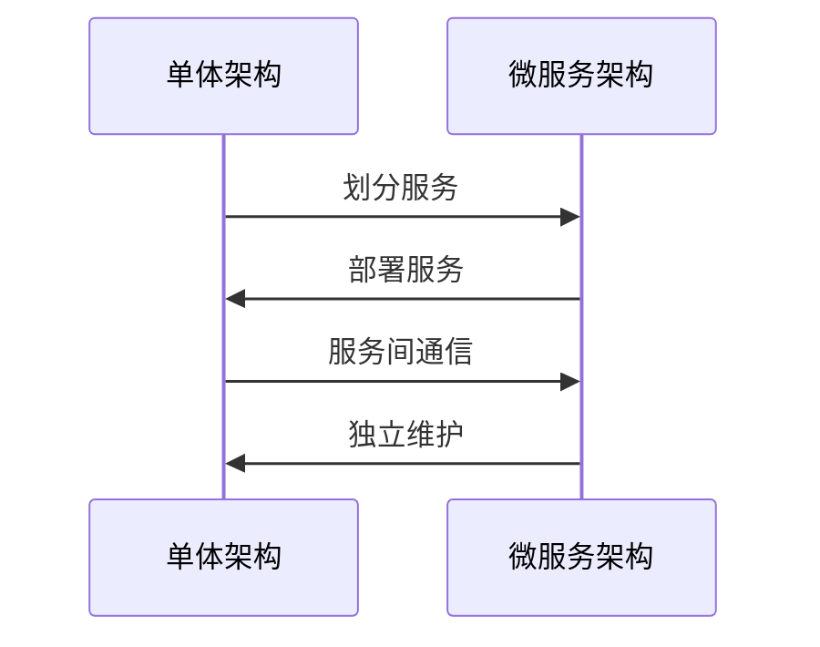
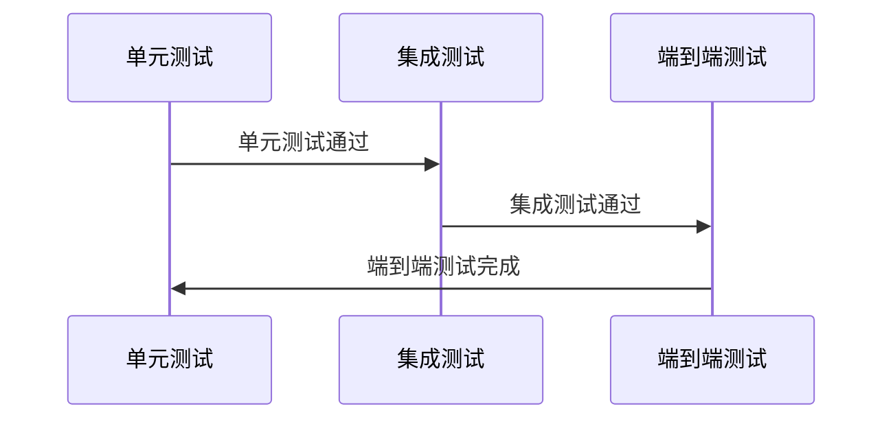
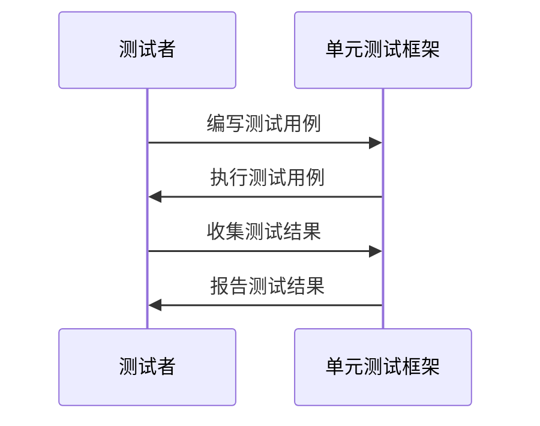
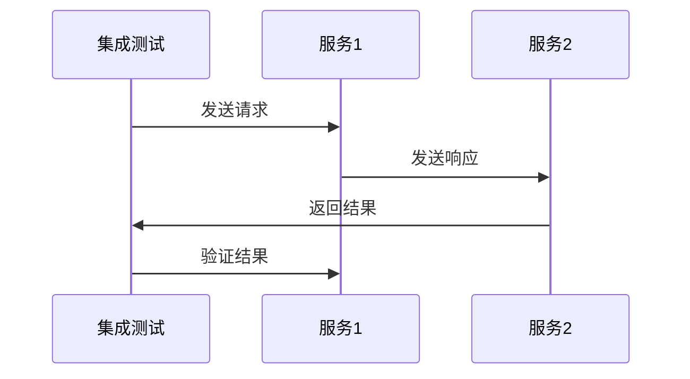
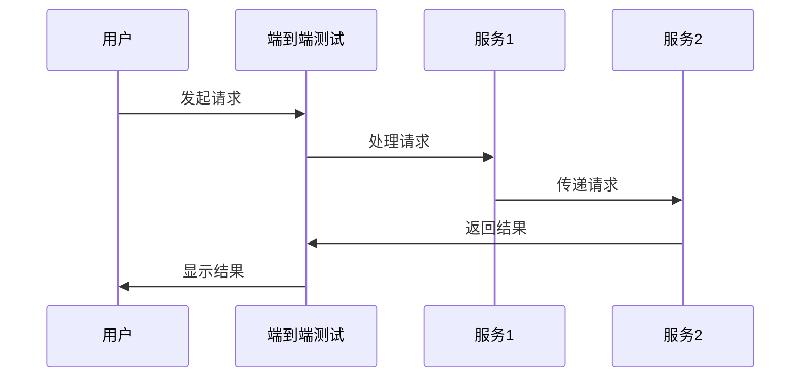

                 

### 文章标题：《微服务测试策略：单元测试到端到端测试》

在当今的软件工程实践中，微服务架构因其灵活性和可伸缩性而受到越来越多的青睐。然而，微服务架构也带来了测试上的挑战。测试策略的合理制定和执行是确保微服务系统可靠性和性能的关键。本文将系统地探讨微服务测试策略，从单元测试到端到端测试，帮助开发者理解和实施有效的测试策略。

### 关键词

- 微服务架构
- 单元测试
- 集成测试
- 端到端测试
- 测试策略
- 测试覆盖率

### 摘要

本文首先介绍了微服务架构的基本概念和特点，随后详细分析了在微服务环境中实施测试的挑战和重要性。文章重点讨论了测试策略的制定和实施过程，包括单元测试、集成测试和端到端测试的不同类型、执行流程以及测试环境的搭建。通过具体的算法原理讲解、数学模型分析和项目实战案例，本文为开发者提供了微服务测试的全方位指南。

## 第一部分：微服务测试基础

### 第1章：微服务测试概述

微服务架构是一种基于分布式系统的软件架构风格，它将应用程序划分为多个独立的小服务，每个服务负责完成特定的业务功能。这种架构方式能够提高系统的可伸缩性、可靠性和维护性。

在微服务架构中，每个服务都是独立部署和运行的，这意味着传统的单体架构中的全局状态和共享资源不再适用。因此，测试微服务系统时面临以下挑战：

1. **服务之间的高耦合性**：由于微服务之间的通信是通过网络进行的，因此任何一个服务的故障都可能影响到其他服务。
2. **分布式环境**：测试需要在多个服务实例之间进行通信，这要求测试环境必须能够模拟真实的生产环境。
3. **测试数据的一致性**：在分布式环境中，测试数据的一致性是一个难题，需要设计特殊的测试数据管理策略。

测试微服务系统的核心目标包括：

1. **确保每个服务功能的正确性**：通过单元测试验证服务内部功能的正确性。
2. **确保服务之间的协作**：通过集成测试验证服务之间的交互是否符合预期。
3. **确保整个系统的可靠性**：通过端到端测试验证整个系统的功能性和性能。

### 第2章：微服务架构与测试

微服务架构与传统单体架构有着本质的不同。在单体架构中，所有功能都集中在一个单一的代码库中，而微服务架构则将应用程序分解为多个独立的服务。每个服务都是独立开发、部署和扩展的。

#### 2.1.1 单体架构与微服务架构对比

在单体架构中，所有的功能都集中在单个应用程序中，这使得代码库庞大且难以维护。而微服务架构则通过将应用程序划分为多个独立的服务，使得每个服务都能够独立开发、测试和部署。

**Mermaid 流程图**：下面是一个简单的流程图，展示了从单体架构迁移到微服务架构的过程。



#### 2.1.2 微服务架构的组成与特点

微服务架构的组成包括以下几个方面：

1. **服务实例**：每个服务可以有一个或多个实例，这些实例可以是同一台服务器上的进程，也可以是不同服务器上的进程。
2. **服务注册与发现**：服务实例在启动时会注册到服务注册中心，客户端可以通过服务注册中心发现可用服务实例。
3. **负载均衡**：负载均衡器负责将请求分配到不同的服务实例上，确保系统的稳定性和性能。
4. **数据存储**：微服务通常有自己的数据存储，可以是关系型数据库、NoSQL数据库或文件系统。
5. **通信协议**：微服务之间通常使用HTTP/HTTPS、gRPC或RESTful API进行通信。

微服务架构的特点包括：

1. **独立性**：每个服务都可以独立开发、部署和扩展。
2. **高可伸缩性**：通过水平扩展服务实例，可以轻松应对高并发和大数据量的场景。
3. **高可用性**：服务故障不会导致整个系统瘫痪，其他服务可以继续运行。
4. **灵活性和可维护性**：模块化的设计使得系统的维护和升级变得更加容易。

### 第3章：测试策略与流程

测试策略是确保软件质量的关键，尤其在微服务架构中，由于系统的复杂性增加，测试策略的制定显得尤为重要。

#### 3.1 测试策略概述

测试策略包括以下几个方面：

1. **测试目标**：明确测试的目标，例如确保功能的正确性、性能的稳定性和安全性的可靠性。
2. **测试类型**：根据需求选择合适的测试类型，包括单元测试、集成测试和端到端测试。
3. **测试覆盖**：制定测试覆盖策略，确保关键功能和关键路径得到充分的测试。
4. **测试环境**：准备测试环境，包括服务注册中心、负载均衡器、数据库等。

**伪代码**：下面是一个简单的伪代码，用于描述测试策略的制定过程。

```python
def define_test_strategy():
    set_test_goals()
    select_test_types()
    define_test_coverage()
    prepare_test_environment()
    return strategy
```

#### 3.2 测试流程

测试流程通常包括以下步骤：

1. **单元测试**：针对单个服务进行功能测试，确保服务内部功能的正确性。
2. **集成测试**：将多个服务组合在一起进行测试，确保服务之间的协作符合预期。
3. **端到端测试**：在模拟的真实环境中测试整个系统，确保系统的功能性和性能。

**测试流程**：



### 第4章：测试环境搭建

测试环境的搭建是微服务测试的重要环节，它需要模拟真实的生产环境，确保测试结果的可信度。

#### 4.1 测试环境需求分析

测试环境的需求分析包括以下几个方面：

1. **服务实例数量**：根据测试需求确定需要启动多少个服务实例。
2. **网络配置**：配置合理的网络拓扑，模拟真实的生产网络环境。
3. **负载均衡器**：配置负载均衡器，确保请求能够均匀地分配到各个服务实例上。
4. **数据库**：根据测试需求配置相应的数据库实例。

**LaTeX 公式**：下面是一个简单的公式，用于描述测试环境资源需求。

$$
R = n \times (C + B + L)
$$

其中，$R$ 是总资源需求，$n$ 是服务实例数量，$C$ 是计算资源需求，$B$ 是存储资源需求，$L$ 是网络资源需求。

#### 4.2 测试环境配置

测试环境的配置包括以下步骤：

1. **服务注册中心**：配置服务注册中心，例如使用Eureka、Consul或Zookeeper。
2. **负载均衡器**：配置负载均衡器，例如使用Nginx、HAProxy或AWS Load Balancer。
3. **数据库**：配置数据库实例，例如使用MySQL、PostgreSQL或MongoDB。
4. **持续集成环境**：配置持续集成环境，例如使用Jenkins、GitLab CI或GitHub Actions。

**测试环境配置示例**：

```shell
# 配置服务注册中心
docker run -d --name eureka -p 8761:8761 eureka

# 配置负载均衡器
docker run -d --name lb -p 80:80 nginx

# 配置数据库
docker run -d --name mysql -p 3306:3306 -e MYSQL_ROOT_PASSWORD=root mysql
```

## 第二部分：微服务单元测试

### 第5章：微服务单元测试原理

单元测试是微服务测试的基础，它主要针对单个服务进行功能测试，确保服务内部功能的正确性。

#### 5.1 单元测试概述

单元测试的目的是验证服务内部功能的正确性，包括以下方面：

1. **功能正确性**：确保服务能够按照预期执行特定的功能。
2. **边界条件**：测试服务在边界条件下的行为，例如输入参数的范围。
3. **异常处理**：测试服务在遇到异常情况时的处理能力。

**Mermaid 流程图**：下面是一个简单的流程图，描述了单元测试的执行流程。



#### 5.2 单元测试框架

常见的单元测试框架包括JUnit、TestNG和Mock框架。这些框架提供了丰富的测试功能，使得编写和执行单元测试变得简单高效。

**JUnit**：JUnit是Java编程语言的一个单元测试框架。它提供了丰富的注解和断言方法，用于编写和执行单元测试。

**TestNG**：TestNG是JUnit的一个增强版本，它提供了更多的测试功能，例如并行测试、依赖测试和数据驱动测试。

**Mock框架**：Mock框架用于模拟服务实例的行为，以便在单元测试中隔离被测试的服务。常见的Mock框架包括Mockito和PowerMock。

### 第6章：微服务单元测试实践

单元测试实践包括测试用例的设计和执行。

#### 6.1 单元测试用例设计

单元测试用例的设计应该覆盖服务的所有功能点，包括以下方面：

1. **正常情况**：测试服务在正常情况下的行为。
2. **边界条件**：测试服务在边界条件下的行为，例如输入参数的最小值和最大值。
3. **异常情况**：测试服务在遇到异常情况时的处理能力，例如输入参数错误或系统故障。

**伪代码**：下面是一个简单的伪代码，用于描述单元测试用例的设计原则。

```java
class UserServiceTest {
    @Test
    void testLoginSuccess() {
        // 测试正常情况
        // ...
    }

    @Test
    void testLoginFailure() {
        // 测试异常情况
        // ...
    }

    @Test
    void testGetUserById() {
        // 测试边界条件
        // ...
    }
}
```

#### 6.2 单元测试实现

单元测试的实现包括编写测试代码、执行测试用例和收集测试结果。

**单元测试代码实现示例**：

```java
@Test
void testLoginSuccess() {
    String username = "testUser";
    String password = "testPass";
    boolean result = userService.login(username, password);
    assertTrue(result);
}

@Test
void testLoginFailure() {
    String username = "invalidUser";
    String password = "invalidPass";
    boolean result = userService.login(username, password);
    assertFalse(result);
}
```

**单元测试结果分析**：

执行单元测试后，测试框架会生成测试报告，显示每个测试用例的执行结果。通过分析测试结果，可以判断服务的功能是否正确。

## 第三部分：微服务集成测试

### 第7章：微服务集成测试原理

集成测试是微服务测试的关键环节，它旨在验证多个服务之间的协作是否符合预期。

#### 7.1 集成测试概述

集成测试的目的是验证不同服务之间的交互是否符合设计，包括以下方面：

1. **接口测试**：验证服务接口的响应是否符合预期。
2. **数据交换**：验证服务之间的数据交换是否正确。
3. **错误处理**：验证服务在遇到错误时的处理能力。

**Mermaid 流程图**：下面是一个简单的流程图，描述了集成测试的执行流程。



#### 7.2 集成测试策略

集成测试策略包括以下方面：

1. **逐步集成**：先测试单个服务的接口，再逐步将多个服务组合在一起进行集成测试。
2. **并行集成**：同时测试多个服务，提高测试效率。
3. **数据一致性**：确保服务之间的数据交换一致，避免数据冲突。

### 第8章：微服务集成测试实践

集成测试实践包括集成测试环境的搭建、测试用例的设计和测试执行。

#### 8.1 集成测试环境搭建

集成测试环境搭建包括以下步骤：

1. **服务注册中心**：配置服务注册中心，例如使用Eureka、Consul或Zookeeper。
2. **负载均衡器**：配置负载均衡器，例如使用Nginx、HAProxy或AWS Load Balancer。
3. **数据库**：配置数据库实例，例如使用MySQL、PostgreSQL或MongoDB。

**集成测试环境搭建示例**：

```shell
# 配置服务注册中心
docker run -d --name eureka -p 8761:8761 eureka

# 配置负载均衡器
docker run -d --name lb -p 80:80 nginx

# 配置数据库
docker run -d --name mysql -p 3306:3306 -e MYSQL_ROOT_PASSWORD=root mysql
```

#### 8.2 集成测试用例设计

集成测试用例设计应该覆盖服务之间的所有交互点，包括以下方面：

1. **正常情况**：测试服务在正常情况下的交互。
2. **边界条件**：测试服务在边界条件下的交互。
3. **异常情况**：测试服务在遇到异常情况时的交互。

**伪代码**：下面是一个简单的伪代码，用于描述集成测试用例的设计原则。

```java
class UserServiceIntegrationTest {
    @Test
    void testLoginSuccess() {
        // 测试正常情况
        // ...
    }

    @Test
    void testLoginFailure() {
        // 测试异常情况
        // ...
    }

    @Test
    void testGetUserById() {
        // 测试边界条件
        // ...
    }
}
```

#### 8.3 集成测试执行

集成测试执行包括以下步骤：

1. **启动服务**：启动所有参与集成测试的服务。
2. **发送请求**：模拟客户端向服务发送请求。
3. **验证结果**：检查服务响应是否符合预期。

**集成测试执行示例**：

```java
@Test
void testLoginSuccess() {
    String username = "testUser";
    String password = "testPass";
    ResponseEntity<String> response = restTemplate.postForEntity("/user/login", new LoginRequest(username, password), String.class);
    assertEquals(HttpStatus.OK, response.getStatusCode());
    assertEquals("Success", response.getBody());
}
```

### 第9章：微服务端到端测试原理

端到端测试是微服务测试的最终环节，它旨在验证整个系统的功能性和性能。

#### 9.1 端到端测试概述

端到端测试的目的是验证整个系统的功能性和性能，包括以下方面：

1. **功能测试**：验证系统的各个功能点是否正常工作。
2. **性能测试**：验证系统的性能指标，如响应时间和吞吐量。
3. **可靠性测试**：验证系统的稳定性和故障恢复能力。

**Mermaid 流程图**：下面是一个简单的流程图，描述了端到端测试的执行流程。



#### 9.2 端到端测试策略

端到端测试策略包括以下方面：

1. **逐步测试**：先测试单个服务，再逐步测试多个服务的组合。
2. **全面覆盖**：覆盖所有功能点和关键路径。
3. **负载测试**：模拟高并发场景，验证系统的性能。

### 第10章：微服务端到端测试实践

端到端测试实践包括端到端测试环境的搭建、测试用例的设计和测试执行。

#### 10.1 端到端测试环境搭建

端到端测试环境搭建包括以下步骤：

1. **服务注册中心**：配置服务注册中心，例如使用Eureka、Consul或Zookeeper。
2. **负载均衡器**：配置负载均衡器，例如使用Nginx、HAProxy或AWS Load Balancer。
3. **数据库**：配置数据库实例，例如使用MySQL、PostgreSQL或MongoDB。

**端到端测试环境搭建示例**：

```shell
# 配置服务注册中心
docker run -d --name eureka -p 8761:8761 eureka

# 配置负载均衡器
docker run -d --name lb -p 80:80 nginx

# 配置数据库
docker run -d --name mysql -p 3306:3306 -e MYSQL_ROOT_PASSWORD=root mysql
```

#### 10.2 端到端测试用例设计

端到端测试用例设计应该覆盖系统的所有功能点，包括以下方面：

1. **正常情况**：测试系统在正常情况下的行为。
2. **边界条件**：测试系统在边界条件下的行为。
3. **异常情况**：测试系统在遇到异常情况时的行为。

**伪代码**：下面是一个简单的伪代码，用于描述端到端测试用例的设计原则。

```java
class UserServiceE2ETest {
    @Test
    void testLoginSuccess() {
        // 测试正常情况
        // ...
    }

    @Test
    void testLoginFailure() {
        // 测试异常情况
        // ...
    }

    @Test
    void testGetUserById() {
        // 测试边界条件
        // ...
    }
}
```

#### 10.3 端到端测试执行

端到端测试执行包括以下步骤：

1. **启动服务**：启动所有参与端到端测试的服务。
2. **发送请求**：模拟客户端向系统发送请求。
3. **验证结果**：检查系统响应是否符合预期。

**端到端测试执行示例**：

```java
@Test
void testLoginSuccess() {
    String username = "testUser";
    String password = "testPass";
    ResponseEntity<String> response = restTemplate.postForEntity("/user/login", new LoginRequest(username, password), String.class);
    assertEquals(HttpStatus.OK, response.getStatusCode());
    assertEquals("Success", response.getBody());
}
```

## 总结

微服务测试策略是确保微服务系统可靠性和性能的关键。本文从单元测试到端到端测试，系统地探讨了微服务测试的不同类型和策略。通过详细的讲解和实战案例，开发者可以更好地理解和实施微服务测试，从而提高软件质量和开发效率。

### 最佳实践 tips

1. **尽早开始测试**：尽早开始测试可以及早发现问题，降低修复成本。
2. **持续集成**：将测试集成到持续集成流程中，确保每次代码提交都经过全面测试。
3. **自动化测试**：尽可能实现自动化测试，提高测试效率和覆盖率。
4. **测试覆盖策略**：根据业务需求设计合理的测试覆盖策略，确保关键功能得到充分测试。

### 注意事项

1. **测试环境与生产环境保持一致**：确保测试环境与生产环境尽可能一致，以便准确测试系统的性能和稳定性。
2. **隔离测试**：在测试过程中，尽量隔离服务，避免服务之间的相互干扰。
3. **监控和日志**：使用监控和日志工具，实时跟踪测试过程中的异常和错误。

### 拓展阅读

1. **《微服务设计》**：马丁·福勒（Martin Fowler）的这本经典著作详细介绍了微服务架构的原理和实践。
2. **《Effective Testing with TestNG》**：由Eric Martins撰写的这本书提供了丰富的TestNG测试框架的最佳实践。
3. **《API 设计指南》**：由Rick CI穂ner和Michael Stutz编写的这本书详细介绍了如何设计优秀的API。

### 作者信息

**作者：AI天才研究院/AI Genius Institute & 禅与计算机程序设计艺术 /Zen And The Art of Computer Programming** 

---
本博客文章旨在提供关于微服务测试策略的全面指导。文章内容仅供参考，实际应用时请结合具体项目需求和实际情况进行调整。本文作者拥有相关领域的丰富经验和深厚的学术背景，但不对本文内容的准确性或完整性提供任何保证。如需进一步学习和了解相关技术，请参考专业书籍和官方文档。**

