                 

### 文章标题：微服务监控策略：全面掌握系统健康状态

微服务架构以其模块化、高可扩展性和高可用性的优势，正在逐渐取代传统的单体架构。然而，随着服务数量的增加和分布式系统的复杂性，如何全面监控系统的健康状态成为了一个关键挑战。本文旨在深入探讨微服务监控策略，帮助您掌握系统健康状态，从而提升系统的可靠性和稳定性。

### 文章关键词

- 微服务
- 监控策略
- 系统健康状态
- 分布式系统
- 性能监控
- 故障排查

### 摘要

本文首先介绍了微服务架构及其监控需求，随后详细阐述了微服务监控的核心概念、架构设计、技术工具，以及日志分析的方法。接着，本文深入分析了服务健康状态监控、性能监控与优化、跨服务依赖监控和分布式追踪等关键领域。最后，本文提供了构建高效监控团队、优化监控策略和最佳实践的建议，并通过案例研究总结实际应用中的经验与教训。

## 第一部分：微服务监控基础

### 第1章：微服务架构概述

#### 1.1 微服务的定义与优势

微服务是一种架构风格，它将应用程序作为一套小服务的集合运行，每个服务运行在自己的进程中，这些服务与轻量级机制通信，通常是HTTP RESTful API。微服务的核心优势在于其高可扩展性、高可用性和可维护性。通过将大型单体应用拆分成多个小型服务，可以更加灵活地处理不同的业务需求，同时也能够更好地应对变化和故障。

#### 1.2 微服务架构的挑战与监控需求

虽然微服务架构具有诸多优点，但也带来了新的挑战。首先，服务的数量和复杂性增加了，这使得系统监控变得至关重要。其次，服务之间的依赖关系更加复杂，需要更精细的监控来保证整体系统的健康状态。此外，分布式系统的延迟和故障处理也需要更加高效和可靠的监控策略。

#### 1.3 微服务监控的核心概念

微服务监控的核心概念包括服务健康状态监控、性能监控、日志分析、报警和通知等。服务健康状态监控用于评估每个服务的运行状态，性能监控关注服务的响应时间、吞吐量和资源使用情况，日志分析则用于发现潜在问题和故障，报警和通知确保相关人员在问题发生时能够及时得到通知。

### 第2章：微服务监控架构设计

#### 2.1 监控体系的分层设计

微服务监控体系通常分为三个层次：基础设施层、应用层和业务层。基础设施层负责监控服务器、网络和存储等底层资源；应用层监控微服务的运行状态和性能；业务层则关注系统的业务指标和用户反馈。这种分层设计有助于实现监控的全面性和针对性。

#### 2.2 数据采集与处理流程

数据采集是监控体系的核心，它通过不同类型的探针（Probe）从各个服务、系统和设备中收集数据。数据采集后，需要进行处理和聚合，以便生成有意义的监控指标。常见的处理流程包括数据清洗、数据聚合、数据存储和可视化等。

#### 2.3 监控报警策略设计

监控报警策略是确保系统健康状态的重要手段。设计报警策略时，需要考虑指标的阈值设置、报警条件、通知方式等因素。合理的报警策略可以帮助及时发现问题，并采取相应的措施。

### 第3章：核心监控技术与工具

#### 3.1 应用性能监控

应用性能监控关注服务的响应时间、吞吐量和资源使用情况。常见的技术包括基于HTTP的监控、基于JMX的监控和基于Prometheus的监控。这些技术可以帮助实时了解服务的运行状态，并提供详细的性能数据。

#### 3.2 网络性能监控

网络性能监控关注系统的网络延迟、带宽和连通性等指标。常见的工具包括Wireshark、Nagios和Zabbix等。这些工具可以帮助诊断网络问题，确保系统的网络稳定性和可靠性。

#### 3.3 基础设施监控

基础设施监控包括服务器、网络和存储等底层资源的监控。常见的工具包括Nagios、Zabbix和Prometheus等。这些工具可以帮助实时监控基础设施的运行状态，确保系统的基础设施稳定可靠。

#### 3.4 监控工具比较与选型

在选择监控工具时，需要考虑多个因素，如功能、性能、易用性和社区支持等。常见的监控工具有Prometheus、Grafana、Nagios、Zabbix等。本文将对这些工具进行比较和选型分析，帮助读者选择最适合自己项目的监控工具。

### 第4章：日志分析与故障排查

#### 4.1 日志收集与存储

日志收集是将系统中产生的日志数据收集到集中存储的过程。常见的日志收集工具有Logstash、Fluentd和Log4j等。日志存储可以采用ELK（Elasticsearch、Logstash、Kibana）架构，以便于日志的检索和分析。

#### 4.2 日志分析工具与方法

日志分析工具可以帮助从大量的日志数据中提取有价值的信息。常见的日志分析工具有Logstash、Grok和Splunk等。日志分析方法包括模式匹配、统计分析和关联分析等。

#### 4.3 常见故障排查技巧

故障排查是确保系统稳定运行的关键。常见的故障排查技巧包括查看日志、分析性能指标、网络抓包和系统调试等。通过这些技巧，可以快速定位故障原因，并采取相应的修复措施。

## 第二部分：微服务监控策略与实现

### 第5章：服务健康状态监控

#### 5.1 服务健康状态指标

服务健康状态指标包括服务可用性、响应时间、吞吐量和错误率等。这些指标可以反映服务的运行状态，帮助判断服务是否健康。以下是一个典型的健康状态指标架构的 Mermaid 流程图：

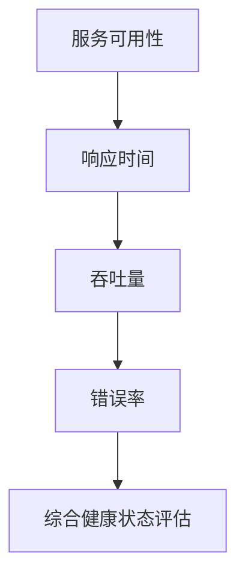

#### 5.2 健康状态监控算法原理

健康状态监控算法通常基于阈值法和规则引擎。阈值法通过设置阈值来判定服务是否健康，而规则引擎则可以根据复杂条件来判定服务状态。以下是一个基于阈值法的健康状态监控算法的伪代码：

```pseudo
function checkHealth(service, thresholds):
    if service.responseTime > thresholds.maxResponseTime:
        return "Unhealthy"
    if service.errorRate > thresholds.maxErrorRate:
        return "Unhealthy"
    return "Healthy"
```

#### 5.3 健康状态监控实现

健康状态监控实现通常包括数据采集、处理和报警等步骤。以下是一个简单的健康状态监控实现的伪代码：

```pseudo
function monitorHealth():
    while true:
        services = fetchData()
        for service in services:
            healthStatus = checkHealth(service, thresholds)
            if healthStatus == "Unhealthy":
                sendAlert(service, healthStatus)
```

### 第6章：性能监控与优化

#### 6.1 性能监控关键指标

性能监控关键指标包括响应时间、吞吐量、资源使用率（如CPU、内存）等。这些指标可以反映系统的性能状况。以下是一个性能监控指标架构的 Mermaid 流程图：

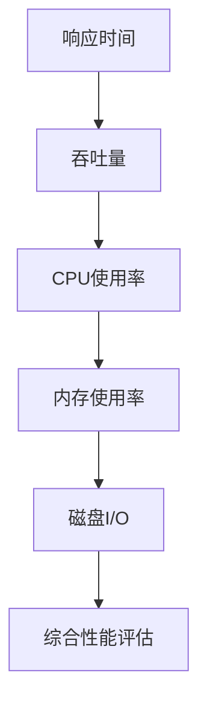

#### 6.2 性能优化策略

性能优化策略包括代码优化、硬件升级、负载均衡和缓存等。以下是一个性能优化策略的伪代码：

```pseudo
function optimizePerformance():
    if responseTime > optimalThreshold:
        optimizeCode()
    if CPUUsage > optimalThreshold:
        upgradeHardware()
    if load > optimalThreshold:
        implementLoadBalancing()
    if dataAccessFrequency > optimalThreshold:
        implementCaching()
```

#### 6.3 性能监控与优化的实际案例

以一个电商网站为例，通过性能监控与优化，可以提升用户体验和系统稳定性。具体步骤包括：

1. **监控指标设置**：设置响应时间、吞吐量等关键性能指标。
2. **性能分析**：收集和分析性能数据，找出瓶颈。
3. **优化方案**：根据性能分析结果，制定并实施优化方案。
4. **持续监控**：在优化后持续监控性能指标，确保系统稳定运行。

### 第7章：跨服务依赖监控

#### 7.1 跨服务依赖性分析

跨服务依赖性分析是确保微服务架构中各服务协同工作的重要环节。以下是一个跨服务依赖性分析的 Mermaid 流程图：

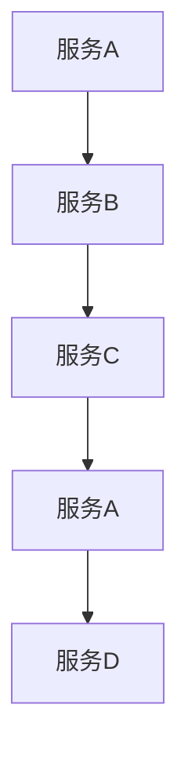

#### 7.2 依赖监控策略与工具

依赖监控策略与工具包括服务间延迟监控、错误率监控和流量监控等。以下是一个依赖监控策略的伪代码：

```pseudo
function monitorDependencies(services):
    while true:
        for service in services:
            if service.responseTime > threshold:
                sendAlert(service, "High Dependency Delay")
            if service.errorRate > threshold:
                sendAlert(service, "High Dependency Error Rate")
```

#### 7.3 依赖监控案例研究

以一个电商平台为例，通过依赖监控，可以及时发现和解决跨服务依赖问题。具体步骤包括：

1. **依赖关系梳理**：梳理各服务间的依赖关系。
2. **监控指标设置**：设置服务间延迟和错误率等监控指标。
3. **监控与报警**：实时监控服务间依赖关系，发现问题时及时报警。
4. **故障排查**：根据报警信息，排查并解决依赖问题。

### 第8章：分布式追踪与跟踪

#### 8.1 分布式追踪系统原理

分布式追踪系统用于跟踪分布式系统中的请求流，帮助开发者了解系统的运行情况。以下是一个分布式追踪系统原理的 Mermaid 流程图：

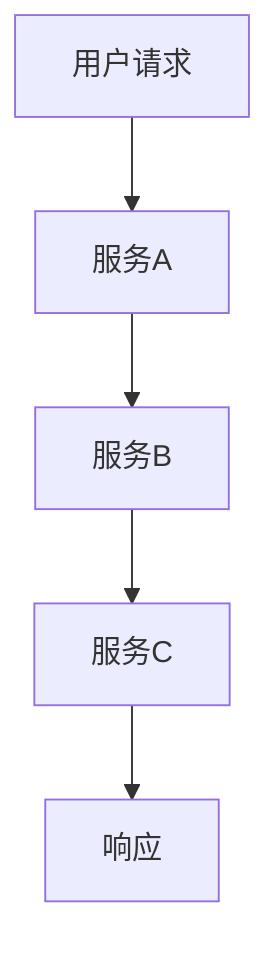

#### 8.2 数据追踪与跟踪工具

数据追踪与跟踪工具包括Zipkin、Jaeger和Sleuth等。以下是一个分布式追踪工具的 Mermaid 流程图：

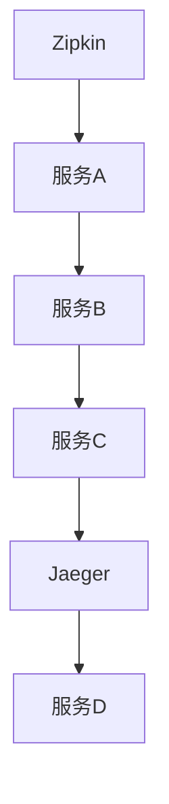

#### 8.3 分布式追踪案例分析

以一个在线支付系统为例，通过分布式追踪，可以实时了解交易请求的执行情况。具体步骤包括：

1. **分布式追踪系统搭建**：搭建并配置分布式追踪系统。
2. **请求跟踪**：在服务中添加追踪代码，跟踪请求流。
3. **数据可视化**：通过追踪系统，可视化展示请求路径和性能指标。
4. **故障排查**：根据追踪数据，快速定位并解决交易过程中的问题。

## 第三部分：微服务监控最佳实践

### 第9章：构建高效的监控团队

#### 9.1 监控团队组织结构

构建高效的监控团队需要明确团队的角色和职责。常见的角色包括监控架构师、监控开发工程师和监控运维人员。以下是一个监控团队组织结构的 Mermaid 流程图：

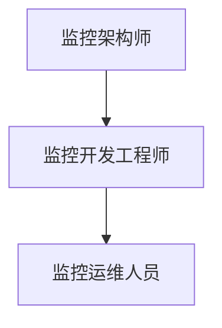

#### 9.2 监控技能与知识储备

监控团队需要具备多种技能和知识，包括编程、系统架构、数据分析和故障排查等。以下是一个监控技能与知识储备的 Mermaid 流程图：

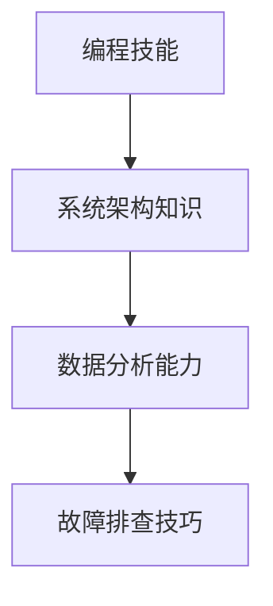

#### 9.3 监控团队协作与沟通

监控团队的协作与沟通是确保监控工作顺利进行的关键。以下是一个监控团队协作与沟通的 Mermaid 流程图：

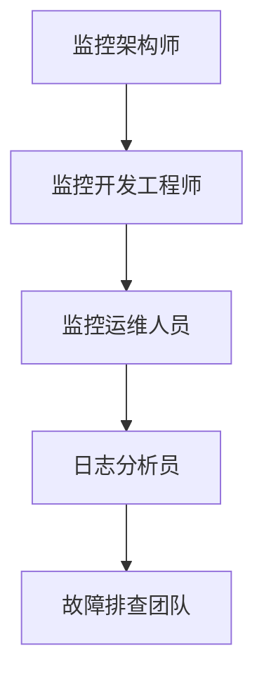

### 第10章：监控策略优化与迭代

#### 10.1 监控数据的价值分析

监控数据的价值分析是监控策略优化的基础。以下是一个监控数据价值分析的 Mermaid 流程图：

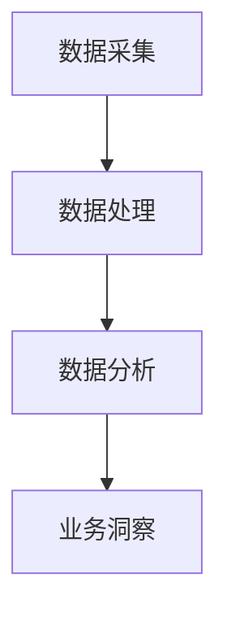

#### 10.2 监控策略的迭代方法

监控策略的迭代方法包括定期评估、持续改进和反馈机制。以下是一个监控策略迭代方法的 Mermaid 流程图：

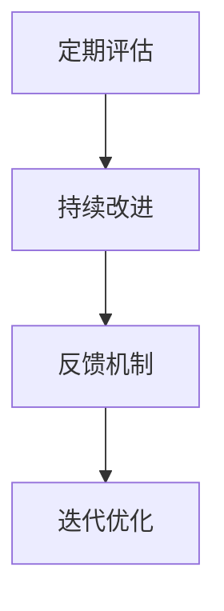

#### 10.3 持续优化监控实践的策略

持续优化监控实践的策略包括自动化监控、监控数据可视化、监控指标优化和监控工具整合等。以下是一个持续优化监控实践的策略的 Mermaid 流程图：

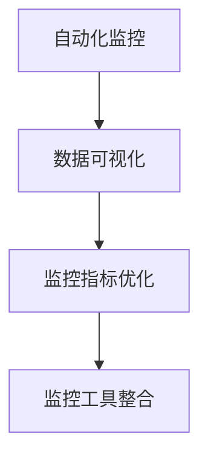

### 第11章：案例研究与实践总结

#### 11.1 微服务监控案例展示

本章节将展示一个实际的微服务监控案例，包括监控架构设计、工具选型、监控策略和实际运行效果。以下是一个监控案例展示的 Mermaid 流程图：

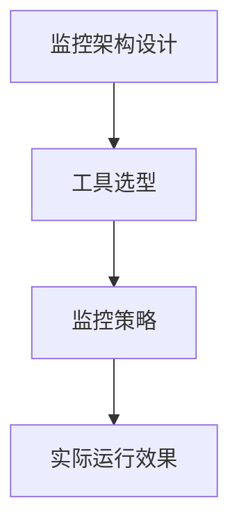

#### 11.2 案例分析

通过分析微服务监控案例，可以了解监控策略的有效性和实际运行中的挑战。以下是一个案例分析的 Mermaid 流程图：

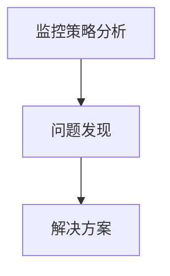

#### 11.3 监控实践总结与展望

在本章节中，将对微服务监控实践进行总结，包括经验教训、最佳实践和未来展望。以下是一个监控实践总结与展望的 Mermaid 流程图：

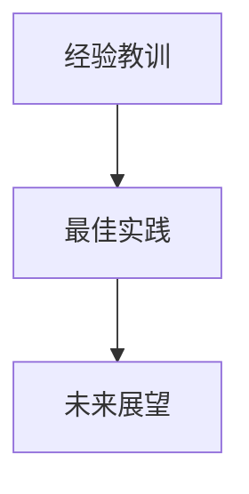

## 附录

### 附录 A：常用监控工具与技术总结

本附录将对常用的监控工具和技术进行总结，包括其原理、功能和适用场景。以下是一个常用监控工具与技术总结的 Mermaid 流程图：

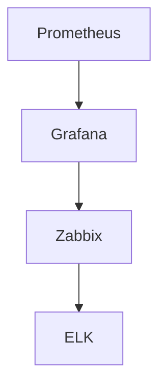

### 附录 B：微服务监控资源与学习资料

本附录将推荐一些微服务监控的优质资源和学习资料，包括书籍、教程、博客和社区等。以下是一个微服务监控资源与学习资料的 Mermaid 流程图：

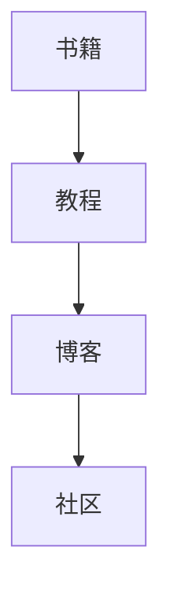

## 作者信息

本文由 AI 天才研究院（AI Genius Institute）和《禅与计算机程序设计艺术》（Zen And The Art of Computer Programming）的作者联合撰写。我们致力于推动计算机编程和人工智能领域的研究与发展，希望通过本文帮助您更好地理解和应用微服务监控策略。如果您有任何问题或建议，欢迎联系我们。

