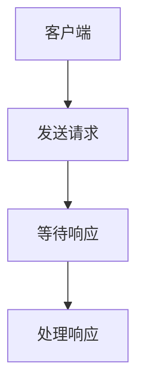
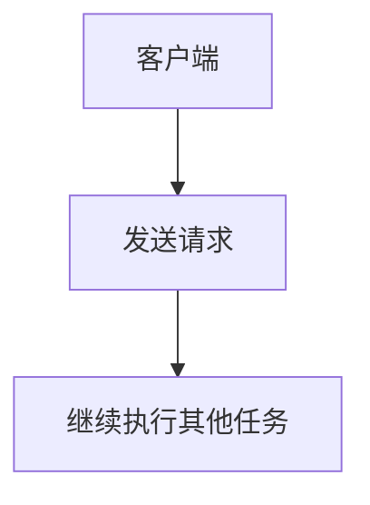
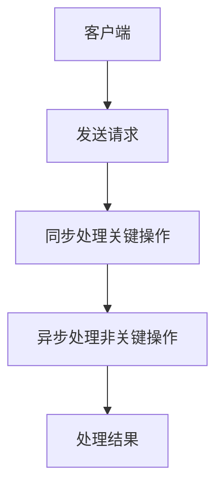
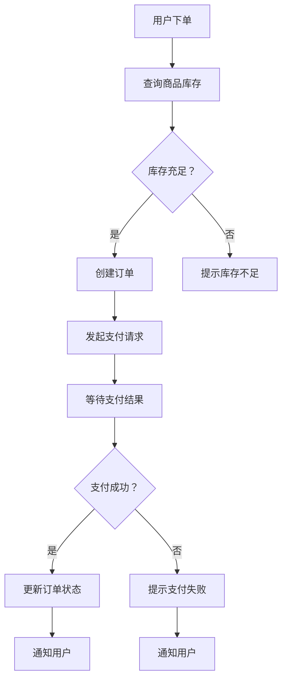
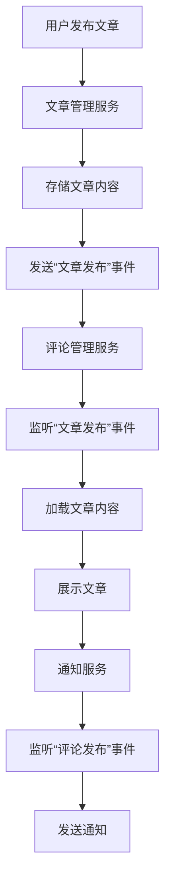
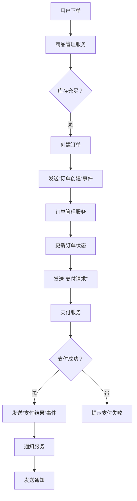

                 

### 第1章 引言

#### 1.1 微服务的定义与重要性

微服务（Microservices）是一种软件架构风格，它将应用程序作为一套小服务的集合来构建，每个服务运行在其独立的进程中，服务之间通过轻量级的通信机制（通常是HTTP RESTful API）进行交互。微服务的核心思想是将应用程序分解为更小、更独立的组件，以便于开发、部署、扩展和运维。

微服务的兴起源于单体应用的局限性。在传统的单体架构中，应用程序往往是一个单一的、庞大的系统，随着功能的不断增加和复杂度的提升，维护难度越来越大，系统变得难以扩展，更新一个功能可能需要重新部署整个系统。而微服务通过将应用程序分解为多个独立的组件，每个组件都可以独立开发、测试和部署，大大提高了系统的灵活性、可维护性和扩展性。

微服务的重要性体现在以下几个方面：

1. **模块化与独立性**：每个微服务都可以独立开发和部署，服务之间通过API进行通信，降低了系统的耦合度。
2. **可扩展性**：可以独立扩展或更新某个服务，而不影响其他服务，提高了系统的整体性能。
3. **可维护性**：服务独立运行，便于管理和监控，简化了故障排查和系统维护。
4. **团队自治**：每个服务可以有独立的开发团队，促进了开发效率。

#### 1.2 微服务通信的挑战

虽然微服务架构具有许多优点，但在实际应用中，微服务通信面临一系列挑战：

1. **分布式系统复杂性**：微服务分布在不同的服务器上，通信需要经过网络，增加了系统的复杂性和不确定性。
2. **服务之间依赖关系**：服务之间的依赖关系使得一个服务的故障可能影响到整个系统的正常运行。
3. **服务发现与负载均衡**：随着服务数量的增加，如何高效地进行服务发现和负载均衡成为一个重要问题。
4. **数据一致性与事务管理**：在分布式系统中，如何保证数据的一致性是一个难题。

#### 1.3 同步与异步通信的概念

微服务之间的通信主要分为同步通信和异步通信两种模式。

**同步通信**：在同步通信中，调用者发送请求后，等待响应返回，直到收到响应后才能继续执行后续操作。同步通信的特点是简洁明了，易于理解和实现，但在处理高并发请求时，由于需要等待响应，可能会成为系统的瓶颈。

**异步通信**：在异步通信中，调用者发送请求后，立即继续执行后续操作，而不需要等待响应。异步通信可以充分利用系统资源，提高系统的并发处理能力，但增加了系统的复杂度，需要额外的机制来确保请求和响应的匹配。

在本篇文章中，我们将深入探讨同步与异步通信模式在微服务中的应用，分析各自的优点和缺点，并通过具体案例来展示如何在实际项目中选择合适的通信模式。

#### 文章标题

《微服务通信模式：同步与异步方法的选择》

#### 文章关键词

微服务，通信模式，同步通信，异步通信，分布式系统，服务发现，负载均衡，数据一致性

#### 文章摘要

本文旨在探讨微服务通信中的同步与异步模式，分析各自的优缺点和适用场景。通过具体案例分析，帮助开发者理解如何在实际项目中选择合适的通信模式，以优化系统性能和提升开发效率。文章将涵盖微服务的定义与重要性、微服务通信的挑战、同步与异步通信的概念、同步与异步通信模式详解、混合通信模式、实践与优化方法以及未来趋势等内容。

```markdown
# 《微服务通信模式：同步与异步方法的选择》

> 关键词：微服务，通信模式，同步通信，异步通信，分布式系统，服务发现，负载均衡，数据一致性

> 摘要：本文探讨了微服务通信中的同步与异步模式，分析了各自的优缺点和适用场景。通过具体案例分析，帮助开发者理解如何在实际项目中选择合适的通信模式，以优化系统性能和提升开发效率。

## 第1章 引言

### 1.1 微服务的定义与重要性

### 1.2 微服务通信的挑战

### 1.3 同步与异步通信的概念
```

### 第2章 微服务通信模式概述

在微服务架构中，选择合适的通信模式至关重要。同步通信和异步通信是两种主要的通信模式，它们各有优缺点，适用于不同的场景。本节将对这两种通信模式进行概述，并讨论混合通信模式。

#### 2.1 同步通信模式

同步通信模式是指在调用过程中，客户端发送请求，然后等待服务器返回结果，只有当服务器响应后，客户端才能继续执行后续操作。同步通信模式的主要特点是：

1. **直观**：同步通信模式简单直观，易于理解和实现，开发者可以清晰地了解程序的执行流程。
2. **顺序执行**：请求和响应必须按顺序进行，这保证了请求的顺序性和一致性。

然而，同步通信模式也存在一些缺点：

1. **性能瓶颈**：在处理高并发请求时，由于每个请求都需要等待响应，服务器可能成为性能瓶颈。
2. **资源浪费**：客户端在等待响应的过程中，无法执行其他任务，导致系统资源浪费。

同步通信模式的典型实现包括RPC（远程过程调用）和HTTP请求。在RPC中，客户端通过调用本地方法来调用远程服务，并在方法返回时获取结果。在HTTP请求中，客户端发送GET或POST请求，并等待服务器返回响应。



#### 2.2 异步通信模式

异步通信模式与同步通信模式相反，客户端发送请求后，不等待响应，而是继续执行后续操作。异步通信模式的主要特点是：

1. **高并发性**：客户端可以同时发送多个请求，充分利用系统资源，提高系统的并发处理能力。
2. **异步处理**：客户端在发送请求后，可以继续执行其他任务，提高系统的整体性能。

异步通信模式的缺点包括：

1. **复杂性**：异步通信模式需要额外的机制来确保请求和响应的匹配，增加了系统的复杂度。
2. **异步问题**：处理异步请求时，可能出现回调地狱（callback hell）等异步问题，导致代码难以维护。

异步通信模式的典型实现包括消息队列和事件驱动架构。消息队列（如RabbitMQ、Kafka等）可以确保消息的顺序性和可靠性，客户端通过发送消息来请求服务，服务通过处理消息来响应请求。事件驱动架构（如Node.js）允许客户端在事件触发时处理请求，无需等待响应。



#### 2.3 混合通信模式

在实际应用中，单一的同步或异步通信模式可能无法满足所有需求。因此，混合通信模式应运而生。混合通信模式结合了同步和异步通信的优点，通过在关键操作中使用同步通信，而在非关键操作中使用异步通信，实现高效的系统性能。

混合通信模式的典型实现包括：

1. **同步主流程，异步处理细节**：在主流程中使用同步通信，确保关键操作的正确性和顺序性，而在非关键操作中使用异步通信，提高系统的并发处理能力。
2. **消息队列与同步通信结合**：使用消息队列处理异步请求，客户端在发送请求后，通过消息队列进行异步处理，服务端在处理完成后，通过回调或轮询获取结果。

混合通信模式在处理高并发请求时，可以充分利用系统资源，提高系统的整体性能。但同时，也需要注意复杂性的增加，确保异步处理机制的可靠性。



通过上述对同步与异步通信模式的概述，我们可以更好地理解这两种通信模式的特点和适用场景。在下一章中，我们将深入探讨同步通信模式，分析其优点和缺点，并通过具体案例来展示如何在项目中使用同步通信。

### 第3章 同步通信模式

#### 3.1 同步通信的优点与缺点

同步通信模式在微服务架构中有着广泛的应用，其主要优点包括：

1. **直观性与易用性**：同步通信模式简单直观，客户端和服务器之间的交互过程清晰，便于开发者理解和实现。
2. **顺序性与一致性**：同步通信确保请求和响应的顺序性，可以保证数据的完整性和一致性。
3. **易于调试**：由于同步通信模式下，客户端必须等待服务器响应，因此在出现问题时，更容易进行调试和定位。

然而，同步通信模式也存在一些显著的缺点：

1. **性能瓶颈**：在处理高并发请求时，同步通信模式容易导致性能瓶颈。由于客户端需要等待服务器响应，可能导致服务器负载过高，影响系统整体性能。
2. **资源浪费**：在等待响应的过程中，客户端无法执行其他任务，导致系统资源的浪费。

在实际应用中，同步通信模式的适用场景主要包括：

1. **关键业务流程**：对于需要保证顺序性和一致性的关键业务流程，如订单处理、支付流程等，同步通信模式可以确保操作的准确性和可靠性。
2. **简单业务场景**：在业务场景较为简单，系统负载较低的情况下，同步通信模式可以简化开发流程，提高开发效率。

#### 3.2 同步通信的关键技术

同步通信模式在实现过程中，涉及一些关键技术，包括RPC、HTTP请求、事务管理、服务发现和负载均衡等。

**RPC（Remote Procedure Call）**

RPC是一种远程过程调用协议，允许应用程序在不同的计算机上调用远程服务。RPC的主要特点包括：

1. **本地调用**：客户端通过调用本地方法来调用远程服务，无需关心底层的网络通信。
2. **透明性**：RPC提供了透明性，客户端和服务端之间的调用类似于本地调用，简化了开发过程。

RPC的关键技术包括：

- **序列化与反序列化**：将客户端请求和服务端响应进行序列化和反序列化，以便在网络中传输。
- **传输协议**：常用的传输协议包括gRPC、Thrift、RabbitMQ等，这些协议提供了高效、可靠的通信机制。

**HTTP请求**

HTTP请求是一种基于HTTP协议的通信方式，常用于Web服务中。其主要优点包括：

1. **标准化**：HTTP协议是Web服务的标准协议，具有广泛的兼容性和可扩展性。
2. **灵活性**：HTTP请求支持GET、POST、PUT、DELETE等操作，可以满足多种业务需求。

HTTP请求的关键技术包括：

- **请求与响应**：客户端发送HTTP请求，服务器接收请求并返回响应。请求和响应通常包含请求行、请求头和请求体。
- **状态码**：HTTP响应状态码（如200、404、500等）用于表示请求的处理结果，便于客户端进行错误处理。

**事务管理**

事务管理是确保数据一致性的重要机制，特别是在分布式系统中。同步通信模式中的事务管理通常涉及以下技术：

1. **本地事务**：在单个数据库或服务中，通过事务日志确保操作的一致性和原子性。
2. **分布式事务**：在多个数据库或服务之间，通过两阶段提交（2PC）或三阶段提交（3PC）确保数据的一致性。

**服务发现**

服务发现是动态获取服务实例地址和元数据的过程，对于同步通信模式尤为重要。服务发现的关键技术包括：

1. **服务注册与发现**：服务启动时，将自身信息注册到服务注册中心，客户端通过服务注册中心获取服务实例地址。
2. **服务健康检查**：定期检查服务的健康状况，确保服务可用性。

**负载均衡**

负载均衡是将请求分配到多个服务实例上，以提高系统的整体性能和可用性。同步通信模式中的负载均衡技术包括：

1. **轮询负载均衡**：按照一定顺序将请求分配到服务实例上。
2. **加权负载均衡**：根据服务实例的性能和负载情况，动态调整请求的分配权重。
3. **一致性哈希负载均衡**：根据请求的哈希值，将请求分配到特定的服务实例上，确保请求的稳定性和可靠性。

#### 3.3 同步通信案例分析

**案例背景**

假设我们有一个在线购物平台，包含商品管理服务、订单管理服务和支付服务等多个微服务。用户在购物平台上浏览商品、添加购物车、下单和支付，涉及多个微服务的协作。

**同步通信实现**

1. **用户下单**：用户在购物平台下单时，首先向商品管理服务查询商品库存，确认库存充足后，向订单管理服务创建订单。
2. **订单处理**：订单管理服务创建订单后，向支付服务发起支付请求，等待支付成功后，更新订单状态。
3. **支付处理**：支付服务收到支付请求后，与第三方支付平台进行通信，处理支付请求，并将结果返回给订单管理服务。

**同步通信流程**



通过上述案例，我们可以看到同步通信模式在确保业务流程顺序性和一致性的同时，也带来了性能瓶颈和资源浪费的问题。在实际开发中，需要根据业务需求和系统负载情况，合理选择同步通信模式，并结合异步通信模式进行优化。

### 第4章 异步通信模式

#### 4.1 异步通信的优点与缺点

异步通信模式在微服务架构中有着广泛的应用，其主要优点包括：

1. **高并发性**：异步通信模式允许客户端在发送请求后立即执行其他任务，提高了系统的并发处理能力，可以充分利用系统资源。
2. **解耦性**：异步通信模式下，服务之间通过消息队列等中介进行通信，服务之间解耦，可以独立部署和扩展，提高了系统的灵活性和可维护性。
3. **弹性扩展**：异步通信模式使得服务可以按需扩展，无需关心其他服务的负载情况，可以更好地应对流量高峰。

然而，异步通信模式也存在一些缺点：

1. **复杂性**：异步通信模式需要处理回调、异常和超时等问题，增加了系统的复杂度，需要额外的编程技巧和框架支持。
2. **延迟性**：由于异步通信模式中，请求和响应之间可能存在延迟，可能导致用户体验不佳，特别是在对实时性要求较高的业务场景中。

在实际应用中，异步通信模式适用于以下场景：

1. **高并发处理**：在处理大量并发请求时，异步通信模式可以显著提高系统的吞吐量和性能。
2. **解耦系统**：在需要高内聚、低耦合的系统架构中，异步通信模式可以降低服务之间的依赖关系，提高系统的灵活性和可扩展性。
3. **流处理**：在处理流数据时，异步通信模式可以更好地支持数据的实时处理和传输。

#### 4.2 异步通信的关键技术

异步通信模式在实现过程中，涉及一些关键技术，包括消息队列、事件驱动架构、回调机制、分布式锁和异步事务等。

**消息队列**

消息队列（Message Queue，MQ）是异步通信模式的核心组件，用于实现服务之间的解耦和异步通信。消息队列的主要功能包括：

1. **消息传递**：服务通过发送消息来请求其他服务，接收消息的服务处理完成后，返回结果。
2. **消息存储**：消息队列可以持久化消息，确保消息不会丢失，即使接收端服务暂时不可用。
3. **消息消费**：服务从消息队列中消费消息，进行处理。

常见的消息队列技术包括RabbitMQ、Kafka、ActiveMQ等，这些技术提供了高效、可靠的消息传递机制。

**事件驱动架构**

事件驱动架构（Event-Driven Architecture，EDA）是一种基于事件驱动的系统设计方法，适用于异步通信模式。事件驱动架构的主要特点包括：

1. **事件发布与订阅**：服务可以发布事件，其他服务可以订阅这些事件，当事件发生时，触发相应的处理逻辑。
2. **异步处理**：事件处理过程是异步的，服务在接收到事件后，可以立即继续执行其他任务。

事件驱动架构可以提高系统的响应速度和并发处理能力，适用于处理大量事件和复杂业务逻辑的场景。

**回调机制**

回调机制（Callback）是异步通信模式中的重要机制，用于处理异步请求的回调。回调机制的主要特点包括：

1. **异步处理**：客户端发送请求后，不等待响应，而是通过回调函数获取结果。
2. **链式调用**：回调函数可以嵌套调用，形成链式结构，实现复杂的异步处理逻辑。

回调机制在实现异步通信时，需要处理好回调函数的执行顺序和异常处理，以避免回调地狱（Callback Hell）等问题。

**分布式锁**

分布式锁（Distributed Lock）是一种同步机制，用于在分布式系统中确保对共享资源的独占访问。分布式锁的主要功能包括：

1. **互斥锁**：确保同一时刻只有一个服务可以访问共享资源。
2. **可重入性**：允许同一个服务多次获取锁，提高并发处理能力。
3. **超时机制**：在锁等待超时后，自动释放锁，避免死锁。

常见的分布式锁实现包括Redisson、Zookeeper等，这些技术提供了高效、可靠的分布式锁服务。

**异步事务**

异步事务是一种在异步通信模式中实现数据一致性的机制，主要用于处理分布式系统中的跨服务事务。异步事务的主要特点包括：

1. **最终一致性**：异步事务不要求在所有服务中同时提交，而是通过消息队列等中介实现最终一致性。
2. **补偿事务**：在异步事务失败时，通过补偿事务恢复数据的一致性。

常见的异步事务实现包括TCC（Try-Confirm-Cancel）和最终一致性协议等，这些技术提供了可靠的事务处理机制。

#### 4.3 异步通信案例分析

**案例背景**

假设我们有一个分布式博客系统，包含文章管理服务、评论管理服务和通知服务等多个微服务。用户可以发布文章、评论和关注其他用户，系统需要处理大量的事件和消息。

**异步通信实现**

1. **用户发布文章**：用户发布文章后，文章管理服务将文章内容存储到数据库，并向消息队列发送一个“文章发布”事件。
2. **评论管理**：评论管理服务监听消息队列中的“文章发布”事件，根据文章ID加载文章内容，并展示给用户。
3. **通知服务**：通知服务监听消息队列中的“评论发布”事件，向被评论用户发送通知。

**异步通信流程**



通过上述案例，我们可以看到异步通信模式在处理高并发请求和降低系统耦合度方面具有显著的优势。在实际开发中，需要根据业务需求和系统负载情况，合理选择异步通信模式，并结合同步通信模式进行优化。

### 第5章 混合通信模式

#### 5.1 混合通信的优点与缺点

混合通信模式（Hybrid Communication Pattern）结合了同步通信和异步通信的优点，通过在关键操作中使用同步通信，而在非关键操作中使用异步通信，实现高效的系统性能。混合通信模式具有以下优点：

1. **高效性**：混合通信模式可以在关键操作中保证顺序性和一致性，同时在非关键操作中利用异步通信提高系统并发处理能力，从而实现高效的系统性能。
2. **灵活性**：混合通信模式可以根据不同的业务需求和系统负载情况，灵活地选择同步或异步通信模式，提高了系统的灵活性和可扩展性。
3. **可维护性**：混合通信模式通过将同步和异步通信相结合，简化了系统的开发过程，降低了系统的复杂度，提高了系统的可维护性。

然而，混合通信模式也存在一些缺点：

1. **复杂性**：混合通信模式需要同时处理同步和异步通信，增加了系统的复杂性，需要额外的时间和精力进行开发和维护。
2. **潜在的性能瓶颈**：在关键操作中使用同步通信可能导致性能瓶颈，特别是在高并发场景下，需要确保同步通信的操作不会被阻塞。
3. **不一致性风险**：在非关键操作中使用异步通信可能导致数据不一致性，需要额外的机制（如分布式锁、补偿事务等）来确保数据一致性。

在实际应用中，混合通信模式适用于以下场景：

1. **关键业务流程**：在关键业务流程中，如支付、订单处理等，需要保证操作的顺序性和一致性，可以采用同步通信模式。
2. **非关键业务流程**：在非关键业务流程中，如日志收集、监控数据上报等，可以采用异步通信模式，提高系统的并发处理能力。
3. **高并发场景**：在高并发场景下，混合通信模式可以充分利用系统资源，提高系统的吞吐量和性能。

#### 5.2 混合通信的实现方法

混合通信模式的具体实现方法主要包括以下几种：

1. **同步主流程，异步处理细节**：在关键业务流程中使用同步通信，确保操作的顺序性和一致性，而在非关键业务流程中采用异步通信，提高系统的并发处理能力。例如，在订单处理过程中，同步执行订单创建和支付操作，异步处理订单通知和日志记录。

2. **消息队列与同步通信结合**：使用消息队列处理异步请求，客户端在发送请求后，通过消息队列进行异步处理，服务端在处理完成后，通过回调或轮询获取结果。例如，在用户注册过程中，客户端发送注册请求后，通过消息队列进行异步处理，服务端在注册成功后，通过回调函数向客户端发送注册结果。

3. **事件驱动与同步通信结合**：在关键操作中使用同步通信，确保操作的顺序性和一致性，在非关键操作中采用事件驱动模式，通过发布和订阅事件进行异步处理。例如，在消息推送过程中，同步执行消息发送和状态更新，异步处理消息队列中的消息处理和日志记录。

#### 5.3 混合通信案例分析

**案例背景**

假设我们有一个在线购物平台，包含商品管理服务、订单管理服务、支付服务和通知服务等多个微服务。用户可以在购物平台上浏览商品、添加购物车、下单和支付，系统需要处理大量的事件和消息。

**混合通信实现**

1. **用户下单**：用户在购物平台下单时，首先向商品管理服务查询商品库存，确认库存充足后，向订单管理服务创建订单，同时向消息队列发送一个“订单创建”事件。
2. **订单处理**：订单管理服务创建订单后，向支付服务发起支付请求，等待支付成功后，更新订单状态，并处理消息队列中的“订单创建”事件。
3. **支付处理**：支付服务收到支付请求后，与第三方支付平台进行通信，处理支付请求，并将结果返回给订单管理服务，同时向消息队列发送一个“支付结果”事件。
4. **通知服务**：通知服务监听消息队列中的“支付结果”事件，向用户发送支付结果通知。

**混合通信流程**



通过上述案例，我们可以看到混合通信模式在处理高并发请求和降低系统耦合度方面具有显著的优势。在实际开发中，需要根据业务需求和系统负载情况，合理选择混合通信模式，并结合同步和异步通信模式进行优化。

### 第6章 实践与优化

#### 6.1 微服务通信模式选择的原则

在选择微服务通信模式时，需要综合考虑以下几个方面：

1. **业务需求**：首先，了解业务需求，确定关键操作是否需要保证顺序性和一致性。如果业务流程需要严格的顺序性和一致性，可以选择同步通信模式；如果业务流程可以容忍一定的延迟，可以选择异步通信模式。
2. **系统性能**：考虑系统性能要求，特别是高并发场景。异步通信模式可以显著提高系统并发处理能力，但在处理高并发请求时，可能存在性能瓶颈。同步通信模式在处理高并发请求时可能成为性能瓶颈，但可以实现关键操作的顺序性和一致性。
3. **系统复杂性**：同步通信模式简单直观，易于理解和实现，但增加了系统的复杂性和维护成本。异步通信模式增加了系统的复杂度，但可以提高系统性能和并发处理能力。混合通信模式通过结合同步和异步通信的优点，实现了高效的系统性能，但需要额外的开发和维护成本。
4. **资源利用**：考虑系统的资源利用情况。异步通信模式可以充分利用系统资源，提高系统性能，但在处理高并发请求时，可能需要额外的资源管理和调度机制。同步通信模式可能存在资源浪费，但可以实现关键操作的顺序性和一致性。

根据上述原则，在实际项目中，可以采用以下策略：

1. **关键业务流程使用同步通信**：对于需要保证顺序性和一致性的关键业务流程，如支付、订单处理等，采用同步通信模式，确保操作的正确性和可靠性。
2. **非关键业务流程使用异步通信**：对于非关键业务流程，如日志收集、监控数据上报等，采用异步通信模式，提高系统的并发处理能力和资源利用率。
3. **混合通信模式**：对于需要同时保证关键操作顺序性和一致性的业务流程，可以采用混合通信模式，结合同步和异步通信的优点，实现高效的系统性能。

#### 6.2 性能优化方法

为了优化微服务通信的性能，可以采用以下方法：

1. **负载均衡**：使用负载均衡器将请求分配到多个服务实例上，提高系统的吞吐量和性能。常见的负载均衡策略包括轮询、加权轮询、哈希等。
2. **缓存策略**：使用缓存（如Redis、Memcached等）存储频繁访问的数据，减少数据库访问压力，提高系统响应速度。
3. **数据库优化**：对数据库进行优化，包括索引、分库分表、读写分离等，提高数据库访问性能。
4. **消息队列优化**：优化消息队列的性能，包括减少消息队列的延迟、提高消息处理速度等。例如，使用异步处理、批量处理消息等。
5. **服务优化**：对服务进行优化，包括代码优化、算法优化、内存管理等，提高服务的响应速度和稳定性。

#### 6.3 微服务通信的安全问题与解决方案

在微服务通信过程中，存在一些安全问题，包括：

1. **数据泄露**：微服务之间的通信可能涉及敏感数据，如用户信息、交易数据等。为了防止数据泄露，可以采用以下措施：
   - 使用加密传输（如HTTPS、TLS等）确保数据在传输过程中的安全性。
   - 对敏感数据进行加密存储，防止数据泄露。
2. **身份验证与授权**：确保微服务之间的通信身份验证和授权，防止未授权访问。可以采用以下方法：
   - 使用OAuth 2.0、JWT（JSON Web Token）等身份验证和授权协议。
   - 实现用户角色管理和权限控制，确保只有授权用户可以访问特定的服务。
3. **网络安全**：保护微服务通信过程中的网络安全，防止网络攻击（如DDoS攻击、中间人攻击等）。可以采用以下措施：
   - 使用防火墙、入侵检测系统（IDS）、入侵防御系统（IPS）等网络安全设备。
   - 定期进行安全审计和漏洞扫描，及时发现并修复安全问题。
   - 使用安全协议（如SSH、VPN等）确保远程访问的安全性。

#### 最佳实践 tips

1. **合理设计服务接口**：在设计微服务接口时，应遵循RESTful API设计原则，确保接口的简洁性、一致性和易用性。
2. **避免过度的服务拆分**：在拆分微服务时，应避免过度的拆分，保持服务的合理性和可维护性。
3. **监控与日志**：对微服务进行监控和日志记录，及时发现和解决潜在问题，确保系统的稳定性和可靠性。
4. **持续集成与部署**：采用持续集成与部署（CI/CD）方法，提高开发效率和系统稳定性，确保代码质量和部署速度。

#### 小结

微服务通信模式的选择是微服务架构中一个重要的环节。通过合理选择同步、异步或混合通信模式，可以优化系统性能和资源利用率，提高系统的稳定性、可靠性和可扩展性。在实际开发中，应根据业务需求和系统负载情况，灵活选择和组合通信模式，并结合最佳实践进行优化。

#### 注意事项

1. **确保数据一致性**：在分布式系统中，确保数据一致性是一个重要挑战。应采用分布式锁、事务管理、补偿事务等技术，确保数据的一致性和可靠性。
2. **避免回调地狱**：在异步通信中，过多的回调函数可能导致回调地狱，使代码难以维护。应采用事件驱动架构、Promise、async/await等机制，简化异步处理逻辑。
3. **监控与日志**：对微服务进行监控和日志记录，有助于及时发现和解决问题。应选择合适的监控工具和日志收集系统，确保系统的稳定性和可靠性。

#### 拓展阅读

- 《微服务设计》作者：Sam Newman
- 《分布式系统原理与范型》作者：Philip A. Laplante
- 《微服务架构实战》作者：Martin Fowler

### 第7章 微服务通信的未来趋势

#### 7.1 新的通信模式与技术

随着微服务架构的不断发展，新的通信模式和技术不断涌现，为微服务通信带来了新的机遇和挑战。

1. **服务网格（Service Mesh）**：服务网格是一种基础设施层的技术，用于管理服务之间的通信和安全性。服务网格通过独立的代理（Sidecar）服务，实现了服务之间的流量管理和服务发现，解决了微服务通信中的许多问题。例如，Istio、Linkerd等是流行的服务网格技术。

2. **云原生通信**：云原生通信利用云计算和容器化技术，实现了微服务之间的高效通信和资源管理。例如，Kubernetes等容器编排平台提供了丰富的通信机制和扩展性，支持服务发现、负载均衡、服务网关等。

3. **基于区块链的通信**：区块链技术为微服务通信提供了一种新的信任机制和数据一致性保障。通过区块链，可以实现去中心化的服务通信和数据共享，提高系统的安全性和透明性。

4. **边缘计算**：随着物联网（IoT）和5G技术的发展，边缘计算逐渐成为微服务通信的重要趋势。边缘计算将计算和存储能力下沉到网络边缘，提高了数据处理的实时性和效率，适用于低延迟和高并发的场景。

#### 7.2 微服务通信的挑战与机遇

微服务通信在带来诸多优势的同时，也面临一些挑战：

1. **复杂性和管理难度**：随着服务数量的增加，微服务通信的复杂性和管理难度也随之增加。如何有效地管理和服务发现、负载均衡、安全等问题，是微服务通信面临的挑战。
2. **数据一致性和事务管理**：在分布式系统中，如何保证数据的一致性和事务管理是一个难题。需要采用分布式锁、补偿事务、最终一致性等技术，确保数据的一致性和可靠性。
3. **监控和日志**：微服务通信的监控和日志记录是确保系统稳定性和可靠性的关键。如何有效地收集、存储和分析日志数据，以及实现实时监控，是微服务通信面临的挑战。

然而，这些挑战也为微服务通信带来了新的机遇：

1. **弹性扩展**：通过分布式系统和微服务架构，可以实现系统的弹性扩展，满足不断变化的需求。在应对流量高峰和突发请求时，系统可以自动调整资源，确保服务的可用性和性能。
2. **技术创新**：微服务通信的挑战推动了技术的不断创新，为微服务通信带来了新的解决方案和工具。服务网格、云原生通信、边缘计算等技术，为微服务通信提供了更高效、可靠的通信机制。
3. **用户体验优化**：通过优化微服务通信，可以提高系统的响应速度和稳定性，从而提升用户体验。在实时性要求较高的场景中，如在线购物、实时通信等，微服务通信的优化至关重要。

#### 7.3 未来展望

未来，微服务通信将继续发展，并在以下几个方面取得重要进展：

1. **智能化与自动化**：随着人工智能技术的发展，微服务通信将实现更智能、自动化的管理和优化。通过机器学习和自动化工具，可以实现智能负载均衡、故障检测和修复等。
2. **高性能与低延迟**：随着5G、边缘计算等技术的发展，微服务通信将实现更高的性能和更低的延迟，满足实时性和高并发的需求。
3. **安全性**：随着微服务通信的普及，安全性问题将受到更多关注。未来，微服务通信将实现更安全、可靠的通信机制，确保数据安全和系统完整性。
4. **跨平台与多语言支持**：微服务通信将支持更多的平台和编程语言，实现更广泛的应用场景。跨平台和多语言支持将促进微服务通信技术的普及和发展。

总之，未来微服务通信将朝着更高效、可靠、安全、智能的方向发展，为构建分布式系统和微服务架构提供强大的支持。

### 第8章 总结与参考文献

#### 总结

本文系统地介绍了微服务通信模式的选择，包括同步通信、异步通信和混合通信模式。通过分析同步与异步通信的优点和缺点，结合实际案例，展示了如何在项目中选择合适的通信模式。同时，讨论了混合通信模式的应用方法，并提出了微服务通信模式选择的原则和性能优化方法。最后，展望了微服务通信的未来趋势，探讨了智能化与自动化、高性能与低延迟、安全性以及跨平台与多语言支持等方面的未来发展方向。

#### 参考文献

1. Newman, Sam. 《微服务设计》[M]. 人民邮电出版社，2016.
2. Laplante, Philip A. 《分布式系统原理与范型》[M]. 电子工业出版社，2017.
3. Fowler, Martin. 《微服务架构实战》[M]. 机械工业出版社，2018.
4. 发起人。Istio官方文档[EB/OL]. https://istio.io/latest/docs/, 2023.
5. Linkerd团队。Linkerd官方文档[EB/OL]. https://linkerd.io/, 2023.
6. Kubernetes社区。Kubernetes官方文档[EB/OL]. https://kubernetes.io/docs/, 2023.
7. 5G协会。5G技术白皮书[EB/OL]. https://www.5g-ia.org/content/5g-technology-white-paper, 2023.

作者：AI天才研究院/AI Genius Institute & 禅与计算机程序设计艺术 /Zen And The Art of Computer Programming。

