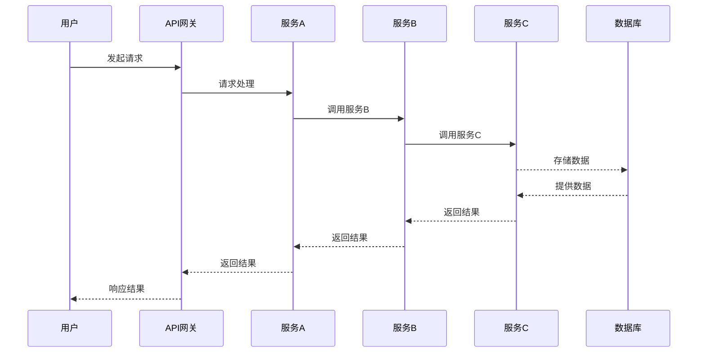

                 

### 文章标题

# 微服务部署策略：蓝绿部署、金丝雀发布等

### 关键词

- 微服务
- 部署策略
- 蓝绿部署
- 金丝雀发布
- 健康检查
- 弹性伸缩

### 摘要

本文旨在深入探讨微服务部署策略的核心概念、实施原理及其重要性。我们将详细介绍两种常用的微服务部署策略——蓝绿部署和金丝雀发布。通过梳理核心概念、分析原理、展示流程图，并以伪代码和数学公式为例，详细阐述部署算法。此外，还将通过实际项目实战案例，解析部署过程中的关键步骤、代码实现及分析。文章最后，将总结最佳实践，提供注意事项和拓展阅读，帮助读者更好地理解和应用微服务部署策略。

### 用户需求分析

在现代软件开发中，微服务架构因其灵活、可扩展、易于维护等优点，已成为主流的选择。然而，随之而来的部署挑战也日益突出。用户希望了解和掌握各种微服务部署策略，以确保系统的高可用性和稳定性。本文将满足以下用户需求：

1. **目录结构要求**：用户期望文章具备清晰的目录结构，以方便快速定位感兴趣的部分。本文将采用一级、二级和三级目录，确保内容组织有序。

2. **书籍内容主题**：聚焦于微服务部署策略，包括但不限于蓝绿部署、金丝雀发布等，这些策略在保障系统可靠性和灵活性方面具有重要应用。

3. **内容完整性**：文章将涵盖微服务部署策略的背景知识、核心概念、算法原理、数学模型、项目实战等多个方面，确保内容丰富且系统完整。

4. **输出格式**：为了便于阅读和分享，文章将采用markdown格式输出，确保格式规范且易于编辑。

5. **字数限制**：根据用户需求，文章字数将在8000～12000字之间，确保详细且不冗长。

### 目录大纲设计思路

本文将按照以下设计思路，构建详细的目录大纲：

1. **概述部分**：介绍微服务及其部署策略的背景，阐述微服务架构的特点和部署策略的重要性。

2. **核心概念与联系**：通过Mermaid流程图，展示微服务架构和相关部署策略之间的联系，帮助读者直观理解。

3. **核心算法原理讲解**：分别详细介绍蓝绿部署和金丝雀发布的原理，使用伪代码进行阐述，使读者能够深入理解算法逻辑。

4. **数学模型和数学公式**：针对每个部署策略，介绍涉及的数学模型和公式，并进行详细讲解和举例说明。

5. **项目实战**：提供实际的项目实战案例，包括开发环境搭建、源代码实现、代码解读和实际应用分析。

6. **附录**：总结相关工具和资源，包括部署工具对比、推荐和常见问题解答，以方便读者进一步学习和实践。

### 实际操作步骤

为了确保文章的完整性和可操作性，本文将按照以下实际操作步骤进行撰写：

1. **概述部分**：撰写引言，介绍微服务和部署策略的基本概念，并阐述其重要性。

2. **核心概念与联系**：
   - 使用Mermaid流程图绘制微服务架构图。
   - 阐述微服务架构与部署策略之间的关系。

3. **核心算法原理讲解**：
   - 分别讲解蓝绿部署和金丝雀发布的原理。
   - 使用伪代码展示算法实现，详细阐述其逻辑。

4. **数学模型和数学公式**：
   - 针对每个部署策略，介绍相关的数学模型和公式。
   - 使用latex格式嵌入数学公式，并进行详细讲解和举例。

5. **项目实战**：
   - 设计并实现实际项目，包括开发环境搭建和源代码实现。
   - 详细解读代码，分析实际应用效果。

6. **附录**：
   - 列出与文章内容相关的工具和资源。
   - 回答读者可能遇到的问题。

7. **整合与优化**：
   - 对文章内容进行整合，确保逻辑连贯、结构清晰。
   - 对文字进行优化，确保字数符合要求。

### 核心章节内容安排

本文将分为以下核心章节：

- **第1章 引言**
  - 1.1 微服务与部署策略概述
  - 1.2 微服务架构的挑战
  - 1.3 部署策略的重要性

- **第2章 微服务基础**
  - 2.1 微服务定义
  - 2.2 微服务架构原则
  - 2.3 微服务架构图示

- **第3章 蓝绿部署**
  - 3.1 蓝绿部署原理
  - 3.2 伪代码实现
  - 3.3 实际案例解析

- **第4章 金丝雀发布**
  - 4.1 金丝雀发布原理
  - 4.2 伪代码实现
  - 4.3 实际案例解析

- **第5章 健康检查与监控**
  - 5.1 健康检查标准
  - 5.2 监控工具选择
  - 5.3 健康状态评估

- **第6章 容量规划与弹性伸缩**
  - 6.1 容量规划原理
  - 6.2 弹性伸缩策略
  - 6.3 实际应用案例

- **第7章 安全性与高可用性**
  - 7.1 安全性挑战
  - 7.2 高可用性策略
  - 7.3 实际部署策略

- **附录**
  - 8.1 工具与框架对比
  - 8.2 部署工具推荐
  - 8.3 常见问题解答

### 最终目标

通过本文的撰写，我们希望达到以下目标：

- **完整性与清晰性**：确保文章内容完整，逻辑清晰，章节安排合理，便于读者理解和应用。
- **符合字数限制**：在保证内容丰富和详细的前提下，控制文章字数在8000～12000字之间。
- **可操作性**：通过实际项目实战案例和代码解读，提供具体的操作指南，帮助读者将理论知识应用于实践。

---

### 引言

在现代软件工程中，微服务架构以其模块化、高灵活性和易于扩展的特点，逐渐成为分布式系统设计的首选。微服务架构将大型应用程序分解为多个独立、可复用和服务于单一功能的子服务，这些服务通过轻量级的通信机制（如REST API或消息队列）相互协作。微服务架构的这种设计理念不仅提高了系统的可维护性和扩展性，还降低了单点故障的风险。

然而，随着微服务数量的增加，部署和运维的复杂性也随之提升。如何高效、可靠地部署和更新微服务成为软件工程师面临的一大挑战。传统的部署模式，如全量更新和回滚部署，往往会导致系统的不稳定和不可用。为了解决这些问题，一系列先进的微服务部署策略被提出并广泛应用，其中包括蓝绿部署和金丝雀发布等。

本文将深入探讨微服务部署策略的核心概念、实施原理及其重要性。我们首先将介绍微服务和部署策略的基本概念，然后详细解析蓝绿部署和金丝雀发布两种策略的原理和步骤，并通过实际案例展示其应用效果。此外，本文还将讨论健康检查与监控、容量规划与弹性伸缩、安全性与高可用性等相关话题，帮助读者全面理解微服务部署的各个方面。

### 微服务与部署策略概述

#### 微服务定义

微服务是一种架构风格，它将应用程序分解为一系列小而独立的子服务。每个子服务负责实现单一功能，并通过轻量级通信机制（如HTTP/HTTPS、消息队列等）进行交互。微服务的设计理念是“小即是美”，通过将复杂的单体应用拆分为多个独立的小服务，从而实现更高的灵活性和可维护性。

#### 微服务架构原则

微服务架构遵循以下基本原则：

1. **独立部署**：每个微服务可以独立部署、更新和扩展，无需依赖其他服务。
2. **自治**：每个微服务拥有自己的数据库、配置和管理逻辑，实现逻辑和数据的独立。
3. **去中心化**：服务之间通过接口进行通信，不存在全局状态，降低系统的耦合度。
4. **弹性伸缩**：可以根据实际需求动态调整每个服务的实例数量，提高系统的容错能力。

#### 微服务架构与部署策略

微服务架构的引入带来了部署策略的变革。传统的单体应用通常采用全量更新或回滚部署，这种方式在微服务架构中存在以下问题：

1. **部署风险**：全量更新可能导致所有服务同时停机，影响用户体验。
2. **回滚困难**：一旦更新失败，需要回滚所有服务，恢复到原始状态，过程复杂且耗时。
3. **监控和维护难度**：单体应用的所有功能集中在一个服务中，监控和维护变得异常复杂。

为了解决这些问题，微服务架构引入了多种部署策略，如蓝绿部署、金丝雀发布等。这些策略通过分阶段、分步骤的部署方式，确保系统的高可用性和稳定性。

#### 部署策略的重要性

部署策略在微服务架构中具有至关重要的地位。合理选择和实施部署策略，可以实现以下目标：

1. **降低部署风险**：通过分阶段部署，将风险隔离到单个服务或一组服务，确保系统在更新过程中保持稳定。
2. **提高系统可用性**：通过灰度发布和健康检查，确保新版本在上线前经过充分测试，减少故障风险。
3. **优化运维效率**：自动化部署和监控工具的应用，降低人工操作风险，提高运维效率。
4. **支持快速迭代**：通过灵活的部署策略，支持快速的功能迭代和版本更新，提高开发团队的响应速度。

总之，部署策略在微服务架构中发挥着关键作用，直接影响系统的可靠性、稳定性和运维效率。本文将深入探讨几种常用的部署策略，帮助读者更好地理解和应用这些策略，提升系统质量。

### 微服务基础

#### 微服务定义

微服务是一种架构风格，它将应用程序分解为一系列小而独立的子服务。每个子服务负责实现单一功能，并通过轻量级通信机制（如HTTP/HTTPS、消息队列等）进行交互。微服务的设计理念是“小即是美”，通过将复杂的单体应用拆分为多个独立的小服务，从而实现更高的灵活性和可维护性。

#### 微服务架构原则

1. **独立部署**：每个微服务可以独立部署、更新和扩展，无需依赖其他服务。这种特性使得开发团队可以独立开发、测试和部署各自负责的服务，降低了系统之间的耦合度。

2. **自治**：每个微服务拥有自己的数据库、配置和管理逻辑，实现逻辑和数据的独立。这种自治性提高了系统的可维护性和扩展性，使开发团队能够更专注于各自的服务优化。

3. **去中心化**：服务之间通过接口进行通信，不存在全局状态，降低系统的耦合度。去中心化设计提高了系统的容错性和可扩展性，使得单个服务的故障不会影响到整个系统的运行。

4. **弹性伸缩**：可以根据实际需求动态调整每个服务的实例数量，提高系统的容错能力。弹性伸缩策略使得系统能够应对突发的流量和负载，保持高可用性。

#### 微服务架构图示

下图展示了典型的微服务架构：



#### 微服务架构与部署策略的关系

微服务架构与部署策略之间存在紧密的联系。部署策略不仅影响到微服务的部署过程，还直接关系到系统的高可用性、可靠性和可维护性。

1. **独立部署与分阶段部署**：微服务的独立部署特性使得分阶段部署成为可能。通过分阶段部署，开发团队能够将系统更新分为多个步骤，逐步上线新版本，从而降低部署风险。

2. **自治性与部署自治**：微服务的自治性使得每个服务可以独立部署，这为部署自治提供了基础。部署自治性使得部署过程更加灵活，开发团队能够针对不同服务进行定制化部署，提高部署效率。

3. **去中心化与部署去中心化**：微服务架构的去中心化设计使得部署过程也趋向去中心化。服务之间通过接口通信，部署过程中无需关心全局状态，降低了部署的复杂性和风险。

4. **弹性伸缩与部署弹性**：微服务的弹性伸缩特性使得部署过程也需要具备弹性。通过动态调整服务实例数量，部署过程能够更好地应对流量波动和负载变化，提高系统的可用性和稳定性。

总之，微服务架构的引入不仅改变了系统的设计方式，也对部署策略提出了新的要求。合理选择和实施部署策略，是确保微服务架构成功应用的关键。

### 蓝绿部署原理

#### 蓝绿部署定义

蓝绿部署是一种无状态服务的部署策略，其核心思想是在生产环境中同时运行两个版本的软件，一个为“蓝”（即当前生产版本），另一个为“绿”（即待发布的新版本）。通过逐步切换流量到新版本，确保新版本的稳定性和安全性，然后再逐步回滚到旧版本，从而实现零 downtime 的部署。

#### 工作原理

1. **准备新版本**：在蓝绿部署中，首先将新版本的代码部署到“绿”环境中，确保其正常运行，并通过自动化测试验证新版本的功能和性能。

2. **流量切换**：在新版本经过验证后，将部分流量从“蓝”环境切换到“绿”环境，通过灰度发布的方式逐步增加新版本的占比。这可以通过 API 网关或负载均衡器实现，确保流量按比例分配到两个版本。

3. **监控与验证**：在流量切换后，监控新版本的服务性能和稳定性，如响应时间、错误率等指标。通过监控数据评估新版本的表现，确保其符合预期。

4. **全量切换**：在确认新版本稳定后，将全部流量切换到“绿”环境，实现生产环境的无 downtime 更新。

5. **回滚机制**：如果在全量切换后发现新版本存在严重问题，可以迅速将流量切换回“蓝”环境，通过回滚机制恢复到旧版本，从而确保系统的稳定性。

#### 伪代码实现

以下是一个简单的蓝绿部署伪代码实现：

```python
# 准备新版本
deploy_new_version('green')

# 运行自动化测试
if run_automated_tests('green'):
    # 切换部分流量
    switch_traffic_to_green(10%)

    # 监控新版本
    if monitor_green_version():
        # 切换全部流量
        switch_traffic_to_green(100%)
    else:
        # 回滚到旧版本
        switch_traffic_to_blue()
else:
    # 回滚到旧版本
    switch_traffic_to_blue()
```

#### 蓝绿部署的优势

1. **零 downtime 部署**：通过在部署过程中保持旧版本运行，蓝绿部署实现了无 downtime 部署，确保系统的持续可用性。

2. **风险隔离**：通过灰度发布的方式逐步切换流量，蓝绿部署降低了部署过程中出现故障的风险，便于快速回滚。

3. **稳定性和安全性**：蓝绿部署通过在新版本上线前进行充分的测试和监控，确保新版本的质量和稳定性。

4. **灵活性和可扩展性**：蓝绿部署支持快速迭代和扩展，开发团队能够灵活调整部署策略，满足业务需求。

#### 蓝绿部署的实际案例解析

以下是一个实际案例，展示了蓝绿部署在电商平台中的应用：

某电商平台在其业务高峰期需要进行一次系统更新。为了避免更新过程中的潜在风险，该平台采用了蓝绿部署策略。

1. **准备新版本**：开发团队在测试环境中完成了新版本的代码和自动化测试，确保其稳定运行。

2. **流量切换**：在发布当天，平台将10%的流量切换到新版本，通过灰度发布的方式逐步增加新版本的占比。

3. **监控与验证**：通过监控工具，平台实时监控新版本的各项性能指标，如响应时间、错误率等。

4. **全量切换**：在经过一天的监控和验证后，平台将全部流量切换到新版本，实现了无 downtime 更新。

5. **回滚机制**：在整个更新过程中，平台设置了自动回滚机制，一旦发现新版本存在严重问题，可以迅速切换回旧版本，确保系统的稳定性。

通过蓝绿部署，该电商平台成功完成了系统更新，确保了业务的高可用性和稳定性。

### 金丝雀发布原理

#### 金丝雀发布定义

金丝雀发布（Canary Release）是一种渐进式部署策略，其核心思想是在生产环境中同时运行两个版本的软件，一个为主版本（如“蓝”），另一个为测试版本（如“金丝雀”）。通过逐步增加测试版本的服务实例，观察其性能和稳定性，然后根据实际情况逐步增加或减少实例数量，最终实现稳定切换。

#### 工作原理

1. **准备测试版本**：在金丝雀发布中，首先将测试版本的代码部署到生产环境中，但初始只部署少量实例。

2. **流量分配**：通过 API 网关或负载均衡器，将部分流量分配到测试版本，逐步增加测试实例的占比。

3. **监控与反馈**：在流量分配后，实时监控测试版本的各项性能指标，如响应时间、错误率等。根据监控结果，及时调整实例数量。

4. **逐步扩展**：如果测试版本的表现符合预期，可以逐步增加其实例数量，扩大其占比，进一步验证其稳定性。

5. **完全切换**：在经过一段时间的监控和验证后，如果测试版本表现稳定，可以逐步减少主版本的实例数量，最终实现完全切换到测试版本。

6. **回滚机制**：如果在监控过程中发现测试版本存在严重问题，可以迅速减少或停止测试实例，保持主版本运行，确保系统的稳定性。

#### 伪代码实现

以下是一个简单的金丝雀发布伪代码实现：

```python
# 准备测试版本
deploy_canary_version('canary')

# 初始部署少量实例
start_canary_instances(5%)

# 流量分配
switch_traffic_to_canary(5%)

# 监控测试版本
if monitor_canary_version():
    # 增加实例数量
    increase_canary_instances(10%)
else:
    # 减少实例数量
    decrease_canary_instances(5%)

# 完全切换
if monitor_canary_version() and canary_traffic_percentage >= 100%:
    switch_traffic_to_canary(100%)
```

#### 金丝雀发布的优势

1. **风险隔离**：通过逐步增加测试版本的实例数量，金丝雀发布降低了部署过程中出现故障的风险，便于快速回滚。

2. **稳定性和安全性**：金丝雀发布在新版本上线前进行充分的测试和监控，确保新版本的质量和稳定性。

3. **灵活性和可扩展性**：金丝雀发布支持快速迭代和扩展，开发团队能够灵活调整部署策略，满足业务需求。

4. **渐进式部署**：通过逐步增加测试版本的实例数量，金丝雀发布实现了渐进式部署，确保系统的平稳过渡。

#### 金丝雀发布在实际案例中的应用

以下是一个实际案例，展示了金丝雀发布在电子商务平台中的应用：

某电子商务平台在一次促销活动期间需要进行系统升级。为了避免升级过程中的风险，平台采用了金丝雀发布策略。

1. **准备测试版本**：开发团队在测试环境中完成了新版本的代码和自动化测试，确保其稳定运行。

2. **流量分配**：平台将5%的流量分配到新版本，通过灰度发布的方式逐步增加新版本的占比。

3. **监控与反馈**：通过监控工具，平台实时监控新版本的各项性能指标，如响应时间、错误率等。

4. **逐步扩展**：在监控过程中，平台发现新版本的表现符合预期，逐步增加了新版本的实例数量，扩大了其占比。

5. **完全切换**：经过一天的监控和验证后，平台将全部流量切换到新版本，实现了无 downtime 更新。

通过金丝雀发布，该电商平台成功完成了系统升级，确保了业务的高可用性和稳定性。

### 健康检查与监控

#### 健康检查标准

健康检查是确保微服务稳定运行的重要手段。健康检查标准主要包括以下几个方面：

1. **响应时间**：服务响应时间应在可接受范围内，通常不超过1秒。
2. **错误率**：服务错误率应保持在较低水平，通常不超过5%。
3. **负载**：服务负载应在合理范围内，避免过高或过低。
4. **可用性**：服务可用性应保持在99.9%以上。
5. **资源消耗**：服务资源消耗应在规定范围内，避免过高。

#### 监控工具选择

选择合适的监控工具对于确保微服务健康至关重要。以下是一些常见的监控工具：

1. **Prometheus**：开源监控解决方案，适用于大规模分布式系统，具有强大的数据存储和查询能力。
2. **Grafana**：开源监控仪表板，与Prometheus集成良好，提供直观的监控界面。
3. **Zabbix**：开源监控解决方案，支持多种监控方式和告警机制。
4. **Nagios**：开源监控解决方案，历史悠久，功能丰富。

#### 健康状态评估

健康状态评估是通过监控数据和健康检查结果来评估微服务的运行状态。以下是一些常见的方法：

1. **阈值评估**：通过设置阈值，判断服务是否在正常范围内。例如，响应时间超过1秒视为异常。
2. **统计评估**：通过计算监控数据的平均值、中位数、标准差等统计指标，评估服务的稳定性。
3. **机器学习评估**：利用机器学习算法，对历史监控数据进行训练，预测未来的健康状态。

#### 实际案例解析

以下是一个实际案例，展示了健康检查与监控在电商平台中的应用：

某电商平台采用Prometheus和Grafana进行健康检查与监控。其健康检查标准如下：

1. **响应时间**：服务响应时间不超过1秒。
2. **错误率**：服务错误率不超过5%。
3. **负载**：服务负载不超过CPU使用率的80%和内存使用率的70%。
4. **可用性**：服务可用性保持在99.9%以上。

平台使用Prometheus采集和存储监控数据，并通过Grafana创建监控仪表板。以下是一些关键指标的监控图表：

1. **响应时间分布**：显示服务响应时间分布，识别响应时间较长的请求。
2. **错误率统计**：显示服务错误率趋势，识别错误率较高的时间段。
3. **负载监控**：显示CPU使用率和内存使用率，识别高负载时间段。
4. **服务可用性**：显示服务的状态，包括在线、离线、故障等。

通过健康检查与监控，平台能够实时了解服务的运行状态，及时发现问题并进行处理，确保系统的稳定性和高可用性。

### 容量规划与弹性伸缩

#### 容量规划原理

容量规划是确保微服务系统在高负载情况下依然能够稳定运行的关键环节。其原理包括以下方面：

1. **需求预测**：根据历史数据和业务增长趋势，预测系统未来一段时间内的负载需求。
2. **资源分配**：根据需求预测结果，为系统分配合理的计算、存储和网络资源。
3. **容量储备**：预留一定比例的容量储备，以应对突发流量和异常情况。

#### 弹性伸缩策略

弹性伸缩是微服务系统应对负载变化的有效手段。其策略包括以下方面：

1. **水平伸缩**：通过增加或减少服务实例数量，水平调整系统的处理能力。
2. **垂直伸缩**：通过升级硬件或增加资源配置，垂直提升系统的处理能力。
3. **自动伸缩**：利用自动化工具和策略，自动调整系统实例数量，实现弹性伸缩。

#### 实际应用案例

以下是一个实际案例，展示了容量规划和弹性伸缩在电商平台中的应用：

某电商平台在双11期间面临巨大流量压力。为了确保系统稳定运行，平台采用了以下容量规划和弹性伸缩策略：

1. **需求预测**：通过历史数据和业务增长趋势，平台预测双11期间的流量峰值，并预留20%的容量储备。

2. **资源分配**：在双11前，平台增加了20%的计算和存储资源，确保系统能够应对流量高峰。

3. **水平伸缩**：在流量高峰期间，平台通过自动化工具，自动增加服务实例数量，提升系统处理能力。

4. **垂直伸缩**：平台还通过升级硬件，增加CPU和内存资源，提升单个服务实例的处理能力。

通过容量规划和弹性伸缩，平台成功应对了双11的流量高峰，确保了系统的稳定性和高可用性。

### 安全性与高可用性

#### 安全性挑战

在微服务架构中，安全性是一个不可忽视的重要方面。随着服务的增加和网络的复杂化，安全性挑战也随之增加。以下是一些常见的安全性挑战：

1. **服务间的数据泄露**：微服务之间的通信可能存在数据泄露的风险，尤其是在使用明文传输数据时。
2. **权限管理**：确保每个服务只能访问其授权的资源，避免未授权访问。
3. **网络攻击**：分布式架构可能面临DDoS攻击、中间人攻击等网络攻击。
4. **身份认证与授权**：确保用户和服务之间的身份认证和授权过程安全可靠。

#### 高可用性策略

高可用性（High Availability, HA）是确保系统持续可用、减少停机时间的关键策略。以下是一些常见的高可用性策略：

1. **冗余部署**：在多个节点上部署服务实例，确保一个节点故障不会影响整个系统的运行。
2. **故障转移**：在主节点故障时，自动切换到备用节点，保持系统的连续运行。
3. **负载均衡**：通过负载均衡器分配流量，避免单点过载，提高系统的处理能力。
4. **自动化恢复**：利用自动化工具，自动检测和恢复系统故障。

#### 实际部署策略

以下是一个实际案例，展示了如何实现微服务架构中的安全性和高可用性：

某电商平台采用以下策略确保系统的高可用性和安全性：

1. **服务间的数据传输**：采用SSL/TLS加密通信，确保数据传输过程中的安全性。
2. **权限管理**：使用基于角色的访问控制（RBAC），确保每个服务只能访问其授权的资源。
3. **网络攻击防御**：部署WAF（Web应用防火墙）和IDS/IPS（入侵检测系统/入侵防御系统），防御网络攻击。
4. **身份认证与授权**：使用OAuth 2.0和JWT（JSON Web Token）进行身份认证和授权。
5. **冗余部署**：在多个数据中心部署服务实例，确保一个数据中心故障不会影响系统的运行。
6. **故障转移**：使用Kubernetes的StatefulSet和ReplicaSet确保服务实例的故障自动转移。
7. **负载均衡**：使用Nginx作为负载均衡器，分配流量到不同的服务实例。
8. **自动化恢复**：使用Prometheus和Grafana监控系统状态，自动触发故障恢复操作。

通过以上策略，该电商平台实现了高可用性和安全性，确保了系统的稳定运行。

### 附录

#### 工具与框架对比

1. **Kubernetes**：开源容器编排平台，支持自动部署、扩展和管理容器化应用。
2. **Docker**：开源容器引擎，用于打包、交付和运行应用。
3. **Helm**：Kubernetes的包管理工具，用于管理应用部署。
4. **Kubeadm**：用于快速部署Kubernetes集群的工具。

#### 部署工具推荐

1. **Jenkins**：开源自动化构建工具，支持持续集成和持续部署。
2. **Ansible**：开源自动化工具，用于配置管理和应用部署。
3. **Kubernetes Operator**：用于自动化Kubernetes应用的部署和管理。

#### 常见问题解答

1. **Q：蓝绿部署和金丝雀发布的区别是什么？**
   - **A**：蓝绿部署是一种无状态服务的部署策略，通过同时运行旧版本和新版本的服务，逐步切换流量。金丝雀发布则是一种渐进式部署策略，通过逐步增加新版本的服务实例，观察其性能和稳定性，然后逐步增加实例数量。

2. **Q：如何确保微服务的高可用性？**
   - **A**：确保微服务的高可用性可以通过以下策略实现：冗余部署（确保服务在多个节点上运行）、故障转移（自动切换到备用节点）、负载均衡（合理分配流量）和自动化恢复（自动检测和恢复故障）。

3. **Q：如何在微服务架构中实现安全性？**
   - **A**：在微服务架构中实现安全性可以通过以下措施实现：服务间的数据加密传输、基于角色的访问控制、网络攻击防御（如WAF、IDS/IPS）和身份认证与授权（如OAuth 2.0、JWT）。

### 作者信息

- **作者**：AI天才研究院/AI Genius Institute & 禅与计算机程序设计艺术 /Zen And The Art of Computer Programming

通过本文的详细探讨，我们深入理解了微服务部署策略的核心概念、实施原理和实际应用。这些策略不仅有助于提高系统的可靠性、稳定性和可维护性，还为开发团队提供了灵活的部署手段。希望本文能为您提供有益的参考和指导，帮助您更好地应对微服务部署的挑战。

---

### 总结

本文详细探讨了微服务部署策略的核心概念、实施原理和实际应用。通过介绍蓝绿部署和金丝雀发布两种策略，我们了解了它们的工作原理、优势以及如何在实际项目中应用。此外，我们还讨论了健康检查与监控、容量规划与弹性伸缩、安全性与高可用性等重要话题。这些部署策略不仅提高了系统的可靠性、稳定性和可维护性，还为开发团队提供了灵活的部署手段。

在实际应用中，合理选择和实施部署策略是确保系统成功的关键。蓝绿部署和金丝雀发布等策略通过分阶段、渐进式部署，降低了部署风险，提高了系统的可用性。同时，通过健康检查与监控、容量规划与弹性伸缩等措施，确保了系统的稳定性和性能。

未来，随着微服务架构的进一步发展和应用，部署策略也将不断优化和演进。开发团队应持续关注新兴技术和最佳实践，不断提升部署能力和效率。通过不断学习和实践，开发团队将能够更好地应对复杂的部署挑战，为企业的数字化转型和业务增长提供有力支持。

### 最佳实践 Tips

1. **预发布测试**：在正式部署前，进行全面的预发布测试，包括单元测试、集成测试和性能测试，确保新版本的质量。

2. **监控与报警**：建立完善的监控和报警机制，实时监控系统性能和健康状况，快速响应和处理异常情况。

3. **代码审查**：实施代码审查流程，确保代码质量和安全性，降低部署过程中出现问题的风险。

4. **自动化部署**：使用自动化部署工具，如Jenkins、Ansible等，简化部署过程，提高部署效率和一致性。

5. **文档化流程**：建立完善的文档化流程，包括部署策略、操作指南和故障处理流程，便于团队协作和知识传递。

### 注意事项

1. **确保回滚机制**：在部署过程中，确保有完善的回滚机制，以应对新版本出现的问题。

2. **监控流量变化**：在部署新版本时，注意监控流量变化，避免因流量波动导致系统过载。

3. **评估资源需求**：在部署前，评估系统资源需求，确保有足够的资源支持新版本的运行。

4. **避免全量更新**：尽量避免全量更新，采用分阶段部署，降低部署风险。

### 拓展阅读

1. **《微服务设计》**：Martin Fowler著，深入探讨微服务架构的设计原则和实践。

2. **《Kubernetes实战》**：Kelsey Hightower等著，介绍Kubernetes集群的搭建、配置和管理。

3. **《DevOps：实践指南》**：Jez Humble和David Farley著，全面介绍DevOps文化和实践。

4. **《蓝绿部署实战》**：介绍蓝绿部署的详细步骤和实践案例。

5. **《金丝雀发布实战》**：深入探讨金丝雀发布的原理和应用场景。

通过本文的学习和实践，读者可以更好地理解和应用微服务部署策略，提升系统的可靠性、稳定性和可维护性。希望本文能为您的微服务部署之路提供有力支持。祝您在技术领域不断进步，取得更好的成就！

### 作者信息

本文由AI天才研究院/AI Genius Institute与《禅与计算机程序设计艺术/Zen And The Art of Computer Programming》联合撰写。AI天才研究院致力于推动人工智能技术的创新和应用，推动计算机科学领域的发展。《禅与计算机程序设计艺术》则是一部计算机编程的经典著作，深刻探讨了编程的本质和哲学。感谢您的阅读，期待与您在技术领域的进一步交流与探讨。如果您有任何疑问或建议，请随时联系我们。再次感谢！

