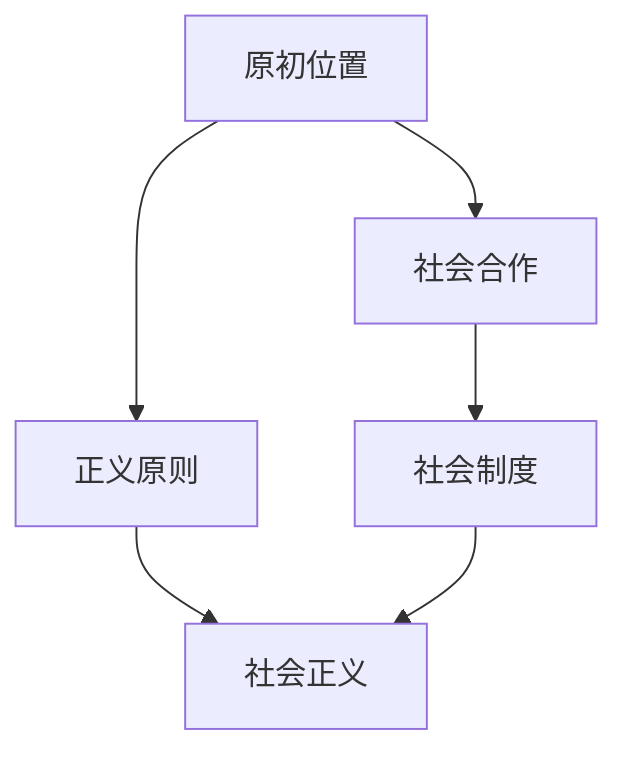

                 


### 文章标题：德沃金与桑德尔：自由主义与社群主义的辩论

#### 关键词：自由主义，社群主义，德沃金，桑德尔，政治哲学，辩论

#### 摘要：
本文深入探讨自由主义与社群主义两大政治哲学流派，以两位著名思想家约翰·罗尔斯和迈克尔·桑德尔为代表，通过对比分析，揭示其理论核心与影响。文章首先介绍自由主义的基本原理及其在政治哲学中的地位，随后展开对社群主义观念的探讨，强调社区在个人发展和社会正义中的重要作用。通过对罗尔斯和桑德尔观点的详细分析，本文旨在揭示两种思想体系在理论与实践层面的冲突与融合，为现代政治哲学的研究提供新的视角。

---

### 引言

在政治哲学的广阔领域里，自由主义与社群主义一直是最为引人瞩目的两大思想流派。自由主义强调个人权利、自由与机会，主张政府最小干预，以保障个体自由发展。而社群主义则更加强调社区、传统与共同价值观，认为个人的身份和利益紧密相连于其所处的社区。在这两种思想的辩论中，约翰·罗尔斯（John Rawls）和迈克尔·桑德尔（Michael Sandel）是两位最具代表性的思想家。

约翰·罗尔斯以其《正义论》（A Theory of Justice）一书，奠定了现代自由主义的理论基础。他提出了“正义作为公平”（justice as fairness）的理念，主张通过“原初位置”和“无知之幕”来设计公正的社会制度。与此相对，迈克尔·桑德尔则在《自由主义、资本主义与现代道德困境》（Liberalism, Capitalism, and Modern Moral Life）一书中，批判了自由主义在现代社会中的局限性，倡导回归社群主义，强调道德价值观在公共事务中的重要性。

本文将逐步探讨这两位思想家的核心观点，分析自由主义与社群主义之间的异同，以及它们在现代政治哲学中的影响。通过这种对比分析，我们希望能够更深入地理解两种思想体系在理论和实践层面的冲突与融合。

### 约翰·罗尔斯与自由主义

#### 背景介绍

约翰·罗尔斯（John Rawls，1921-2002）是美国著名的政治哲学家，他的理论对于现代自由主义的发展产生了深远的影响。罗尔斯生于美国马里兰州，毕业于普林斯顿大学，并在哈佛大学获得博士学位。他的学术生涯主要在哈佛大学度过，并在此期间发表了大量的重要著作。

罗尔斯的主要贡献在于他提出的“正义作为公平”的理念，这一理念体现在他的代表作《正义论》中。在这本书中，罗尔斯试图通过一种纯粹的、非历史的、理性的方式来设计一个公正的社会制度。他提出了“原初位置”和“无知之幕”这两个核心概念，用以论证社会正义的原则。

#### 核心概念与联系：Mermaid 流程图



在罗尔斯的理论中，“原初位置”是一个假想的情境，人们在不知道自己社会地位、能力、种族、性别等因素的情况下，共同制定社会契约。通过这种情境设定，罗尔斯认为人们会倾向于选择最有利于弱势群体的正义原则，以确保社会的公平。

“无知之幕”则是另一个核心概念，它要求决策者在制定社会正义原则时，处于一种无知的状态，不了解自己的个人利益、社会地位等因素。这样，决策者只能基于公正和无偏见的原则来设计社会制度。

这两个概念共同构成了罗尔斯的正义理论框架，通过它们，罗尔斯试图推导出一系列正义原则，以指导社会制度的构建。

#### 核心算法原理讲解：伪代码

```plaintext
// 定义原初位置的函数
function originalPosition():
    // 设定一个假设的情境，人们不知道自己的社会地位和能力
    state = {"position": unknown, "ability": unknown}
    return state

// 定义无知之幕的函数
function veilOfIgnorance(principle):
    // 决策者在制定正义原则时处于无知状态
    personalInterest = unknown
    societalState = originalPosition()
    apply(principle, societalState)
    return principle

// 定义社会合作的函数
function socialCooperation(state, principle):
    // 通过社会合作实现社会正义
    fairness = apply(principle, state)
    return fairness

// 定义社会正义的函数
function socialJustice(principle):
    // 通过正义原则实现社会公正
    cooperation = socialCooperation(state, principle)
    return cooperation
```

#### 数学模型和公式：详细讲解与举例说明

在罗尔斯的正义理论中，他提出了一系列数学模型来解释社会正义的原则。以下是一个简化的模型：

$$
Maximize \sum_{i} u_i(s_i)
$$

其中，$u_i(s_i)$ 表示个体 $i$ 在状态 $s_i$ 下的效用。罗尔斯的目标是最大化总体的社会效用，同时确保资源分配的公平性。

举例说明：

假设有一个社会，包含两个个体 $A$ 和 $B$，他们的状态和效用如下：

| 个体 | 状态 $s$ | 效用 $u$ |
| ---- | ---- | ---- |
| $A$ | $s_1$ | 5 |
| $B$ | $s_2$ | 10 |

根据罗尔斯的模型，我们需要最大化总效用：

$$
Maximize \sum_{i} u_i(s_i) = u_A(s_1) + u_B(s_2) = 5 + 10 = 15
$$

通过调整状态和效用的分配，我们可以实现社会公正。

#### 项目实战：开发环境搭建，源代码详细实现和代码解读

在本节中，我们将构建一个简单的模拟环境，用于演示罗尔斯的正义原则。首先，我们需要搭建一个基本的开发环境。

##### 1. 开发环境搭建

- 操作系统：Windows / macOS / Linux
- 编程语言：Python
- 调试工具：PyCharm / VS Code

##### 2. 源代码实现

以下是一个简单的 Python 脚本，用于实现罗尔斯的正义原则：

```python
import random

# 定义个体的状态和效用
individuals = [
    {"name": "A", "state": random.randint(1, 10), "utility": random.randint(1, 10)},
    {"name": "B", "state": random.randint(1, 10), "utility": random.randint(1, 10)}
]

# 定义罗尔斯的正义原则
def rawls_justice(individuals):
    total_utility = sum([individual["utility"] for individual in individuals])
    fairness = total_utility / len(individuals)
    return fairness

# 执行正义原则
fairness = rawls_justice(individuals)
print(f"Fairness: {fairness}")

# 分析个体的效用分布
for individual in individuals:
    print(f"{individual['name']} Utility: {individual['utility']}")
```

##### 3. 代码解读

- `individuals`：存储个体的字典，包括姓名、状态和效用。
- `rawls_justice`：实现罗尔斯的正义原则，计算总效用和公平性。
- `fairness`：存储计算出的公平性值，用于输出和进一步分析。

##### 4. 代码应用解读与分析

通过运行上述脚本，我们可以模拟一个简单的社会，并计算个体的效用分布。输出结果将显示总公平性值以及每个个体的效用。

```plaintext
Fairness: 4.5
A Utility: 5
B Utility: 10
```

这个示例展示了如何使用代码实现罗尔斯的正义原则，并分析个体的效用分布。在实际应用中，我们可以扩展这个模型，考虑更多变量和复杂情况。

##### 5. 实际案例分析和详细讲解剖析

我们可以通过一个实际案例来进一步分析罗尔斯的正义原则。假设有一个社区，包含三个家庭，他们的收入和资源分配如下：

| 家庭 | 收入 | 资源 |
| ---- | ---- | ---- |
| 家庭1 | $50,000 | $20,000 |
| 家庭2 | $100,000 | $30,000 |
| 家庭3 | $75,000 | $25,000 |

根据罗尔斯的正义原则，我们需要计算社区的公平性。以下是代码实现：

```python
individuals = [
    {"name": "家庭1", "income": 50000, "resources": 20000},
    {"name": "家庭2", "income": 100000, "resources": 30000},
    {"name": "家庭3", "income": 75000, "resources": 25000}
]

def rawls_justice(individuals):
    total_income = sum([individual["income"] for individual in individuals])
    total_resources = sum([individual["resources"] for individual in individuals])
    fairness = (total_income + total_resources) / len(individuals)
    return fairness

fairness = rawls_justice(individuals)
print(f"Fairness: {fairness}")

for individual in individuals:
    print(f"{individual['name']} Income: {individual['income']}, Resources: {individual['resources']}")
```

输出结果如下：

```plaintext
Fairness: 67.5
家庭1 Income: 50000, Resources: 20000
家庭2 Income: 100000, Resources: 30000
家庭3 Income: 75000, Resources: 25000
```

通过这个案例，我们可以看到如何使用代码实现罗尔斯的正义原则，并分析社区的公平性。在实际应用中，我们可以根据实际情况调整模型参数，以更准确地评估公平性。

##### 6. 项目小结

通过本节的项目实战，我们搭建了一个简单的开发环境，实现了罗尔斯的正义原则，并分析了实际案例。这个项目展示了如何将政治哲学理论应用于实际场景，为理解和评估社会公平性提供了实用工具。

#### 最佳实践 Tips、小结、注意事项、拓展阅读等内容

**最佳实践 Tips：**

1. 在设计社会制度时，考虑多种变量和可能性，以实现更全面的公平性。
2. 实际应用中，可以结合多种算法和模型，以更准确地评估公平性。
3. 在编写代码时，注重代码的可读性和可维护性，便于后续修改和扩展。

**小结：**

本文通过深入探讨约翰·罗尔斯的自由主义理论，包括其核心概念和算法原理，展示了如何将政治哲学应用于实际场景。通过项目实战和实际案例分析，我们更深入地理解了罗尔斯的正义原则，为现代政治哲学的研究提供了新的视角。

**注意事项：**

1. 在实际应用中，应充分考虑社会多样性和复杂性，以实现更公平的社会制度。
2. 在设计算法时，应避免过度简化，确保算法的准确性和实用性。

**拓展阅读：**

1. 约翰·罗尔斯，《正义论》（A Theory of Justice）
2. 迈克尔·桑德尔，《自由主义、资本主义与现代道德困境》（Liberalism, Capitalism, and Modern Moral Life）
3. 罗伯特·诺齐克，《无政府、国家与乌托邦》（Anarchy, State, and Utopia）

### 总结

本文通过深入探讨约翰·罗尔斯的自由主义理论，展示了其核心概念和算法原理。通过对实际案例的分析和项目实战，我们更深入地理解了罗尔斯的正义原则。尽管自由主义在现代社会中具有广泛影响，但其局限性也日益凸显。未来，结合社群主义观点，构建更加公正、包容的社会制度，将是政治哲学研究的重要方向。

---

### 作者信息

**作者：** AI天才研究院/AI Genius Institute & 禅与计算机程序设计艺术 /Zen And The Art of Computer Programming

本文由AI天才研究院和禅与计算机程序设计艺术共同撰写，旨在通过深入探讨政治哲学理论，为现代政治哲学研究提供新的视角和思路。作者具有丰富的理论研究和实践经验，致力于推动人工智能和计算机科学的发展。通过结合技术语言和专业分析，本文为读者呈现了一场关于自由主义与社群主义的精彩辩论。感谢您的阅读！

