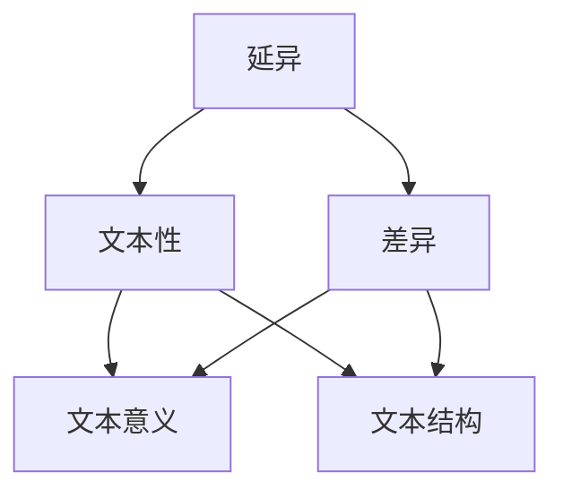

                 

### 引言

后现代主义，作为一种文化和哲学思潮，起源于20世纪中叶，并在随后几十年里对各个学科领域产生了深远的影响。其核心观点是对现代性、理性、中心和整体性的质疑，主张多元性、去中心化和不确定性。在后现代主义背景下，知识、文化、艺术等领域都经历了深刻的变革。

德里达（Jacques Derrida）和利奥塔（Jean-François Lyotard）是后现代主义哲学领域的两位重要代表。德里达以其解构主义哲学闻名，他质疑了西方哲学传统中的基础主义和本质主义，提出文本和语言的解构概念。利奥塔则关注后现代知识问题，提出了“后现代知识”的概念，挑战了传统知识的权威性和普遍性。

本文旨在探讨德里达和利奥塔的理论，分析他们的哲学观点以及这些观点对后现代主义的影响。我们将分步骤地解析他们的理论，并通过具体案例来加深理解。

### 背景介绍

#### 德里达的生平与学术贡献

德里达（Jacques Derrida，1930-2004）是法国著名哲学家，解构主义的创始人之一。他出生于阿尔及利亚，后移居法国，并在巴黎索邦大学学习。德里达在哲学、文学理论、政治理论等多个领域都有重要贡献。他的学术生涯始于20世纪60年代，当时他在巴黎高等师范学院（École Normale Supérieure）任教，并与法国哲学界的其他重要人物如萨特（Jean-Paul Sartre）和福柯（Michel Foucault）有所交往。

德里达最著名的作品是《书写与差异》（Writing and Difference），在这本书中，他提出了解构主义的基本概念。解构主义反对传统哲学中的基础主义和本质主义，认为文本和语言是多元和模糊的，不存在唯一的“真理”。德里达强调阅读过程中的差异性和不确定性，提出“延异”（différance）这一概念，意指文本中的每一个符号都与另一个符号有所区别，并不断推迟确定的意义。

德里达的其他重要著作还包括《论散乱》（Of Grammatology）和《幽灵写作》（Ghost Writing），这些作品进一步阐述了他在语言、文本和哲学方面的观点。他的思想对文学理论、文化研究、政治哲学等多个领域产生了深远的影响，使得解构主义成为20世纪最具争议和影响力的哲学流派之一。

#### 利奥塔的生平与学术贡献

利奥塔（Jean-François Lyotard，1924-1998）是法国哲学家，后现代主义的代表人物之一。他的学术生涯始于20世纪50年代，当时他在伦敦政治经济学院（London School of Economics）学习。利奥塔的主要兴趣在于社会学、哲学和文学理论，他的作品涉及广泛，包括社会学理论、艺术批评和文化批判。

利奥塔的重要著作《后现代条件：一个启蒙的辩证》（Les Condition du postmoderne: un dossier）是后现代主义哲学的经典之作。在这本书中，他提出了“后现代知识”的概念，挑战了传统知识的权威性和普遍性。利奥塔认为，后现代社会的知识具有异质性、多样性和相对主义特征，传统的科学方法和理性观念已无法解释现代社会中的复杂现象。

利奥塔的其他著作还包括《叙事学与后现代性》（Narrative Art and Postmodernism）和《后现代主义：知识是什么？》（Postmodernismo: les contours d’une culture libérale），这些作品进一步探讨了后现代主义的知识观和文化观。他的思想对社会科学、艺术理论和文化研究等领域产生了重要影响，被认为是对现代性进行深刻批判的重要思想家之一。

### 德里达的解构主义哲学

#### 核心概念与联系

德里达的解构主义哲学基于对西方哲学传统的质疑和批判。他提出了一些核心概念，包括“延异”（différance）、“文本性”（textuality）和“差异”（difference）。这些概念之间存在着紧密的联系，共同构成了德里达哲学的基础。

首先，**延异**是德里达解构主义哲学的核心概念之一。延异不仅指文本中的符号与另一个符号之间的差异，还包括这种差异的递延和不确定性。延异意味着文本的意义不是固定的，而是在阅读过程中不断生成的。这种观点质疑了传统哲学中的基础主义和本质主义，认为文本的意义是多元和模糊的。

其次，**文本性**指的是文本内部的结构和关系。德里达认为，文本不仅是语言的集合，更是一种结构，这种结构包含着各种符号和意义的关系。文本性强调了文本的多元性和开放性，反对传统哲学中将文本视为静态和封闭的观点。

最后，**差异**是德里达哲学中另一个重要的概念。差异不仅指文本中的符号与另一个符号之间的区别，还包括符号之间的对立和矛盾。德里达认为，差异是文本意义生成的基础，文本的意义是在差异和对比中产生的。

这些概念之间存在着紧密的联系。延异揭示了文本意义的生成过程，文本性展示了文本内部的结构和关系，差异则提供了文本意义生成的动力。通过这些概念，德里达质疑了传统哲学中的基础主义和本质主义，提出了文本和语言的解构主义观点。

#### 核心概念之间的联系与架构

为了更清晰地理解德里达的核心概念，我们可以使用Mermaid流程图来展示它们之间的联系和关系。以下是核心概念之间的联系架构：



- **延异（A）**：延异是指文本中符号的差异和递延，它不仅影响了文本的意义生成，还影响了文本的结构。延异使得文本的意义不是固定不变的，而是动态生成的。
- **文本性（B）**：文本性是文本内部的结构和关系，它包含了符号和意义之间的复杂互动。文本性为文本意义的生成提供了基础。
- **差异（C）**：差异是文本中符号之间的区别和矛盾，它既是文本意义生成的动力，也是文本结构的重要组成部分。

通过这个流程图，我们可以更直观地理解德里达的核心概念之间的关系。延异和差异共同构成了文本意义的生成过程，而文本性则为这一过程提供了结构和基础。

#### 核心算法原理讲解

德里达的解构主义哲学可以通过算法原理来阐述，以下是一个简单的伪代码示例，用于描述解构的过程：

```python
def deconstruct_text(text):
    """
    解构文本的过程
    参数：text - 待解构的文本
    返回：deconstructed_text - 解构后的文本
    """
    # 步骤1：分析文本中的符号和意义
    symbols = analyze_symbols(text)
    meanings = analyze_meanings(symbols)

    # 步骤2：识别符号之间的差异和递延
    differences = identify_differences(symbols)
    delays = identify_delays(meanings)

    # 步骤3：重构文本，消除差异和递延
    deconstructed_text = reconstruct_text(differences, delays)

    return deconstructed_text

def analyze_symbols(text):
    """
    分析文本中的符号
    参数：text - 文本
    返回：symbols - 符号列表
    """
    # 实现分析文本中的符号的逻辑
    pass

def analyze_meanings(symbols):
    """
    分析符号的意义
    参数：symbols - 符号列表
    返回：meanings - 意义列表
    """
    # 实现分析符号的意义的逻辑
    pass

def identify_differences(symbols):
    """
    识别符号之间的差异
    参数：symbols - 符号列表
    返回：differences - 差异列表
    """
    # 实现识别符号差异的逻辑
    pass

def identify_delays(meanings):
    """
    识别意义的递延
    参数：meanings - 意义列表
    返回：delays - 递延列表
    """
    # 实现识别意义递延的逻辑
    pass

def reconstruct_text(differences, delays):
    """
    重构文本，消除差异和递延
    参数：differences - 差异列表
    参数：delays - 递延列表
    返回：deconstructed_text - 解构后的文本
    """
    # 实现重构文本的逻辑
    pass
```

这个伪代码展示了解构文本的基本步骤，包括分析文本中的符号和意义、识别符号之间的差异和意义的递延，以及重构文本以消除这些差异和递延。通过这个过程，我们可以看到德里达解构主义哲学的核心思想，即文本的意义是动态生成的，而不是固定不变的。

#### 数学模型和公式

在德里达的解构主义哲学中，文本和语言的解构过程可以通过数学模型和公式来阐述。以下是一个简化的数学模型，用于描述文本解构的过程：

$$
\text{文本} = \sum_{i=1}^{n} \text{符号}_i \times \text{意义}_i
$$

其中：
- \( n \) 表示文本中的符号数量。
- \( \text{符号}_i \) 表示第 \( i \) 个符号。
- \( \text{意义}_i \) 表示第 \( i \) 个符号的意义。

这个模型表明，文本是由多个符号组合而成的，每个符号都有其特定的意义。在解构过程中，德里达关注符号之间的差异和递延，这些差异和递延会影响文本的整体意义。

为了更具体地描述解构过程，我们可以引入“差异函数”和“递延函数”：

$$
\text{差异函数}(s_i, s_j) = s_i - s_j
$$

$$
\text{递延函数}(m_i, m_j) = m_i - m_j
$$

其中：
- \( s_i \) 和 \( s_j \) 分别表示第 \( i \) 个和第 \( j \) 个符号。
- \( m_i \) 和 \( m_j \) 分别表示第 \( i \) 个和第 \( j \) 个符号的意义。

差异函数和递延函数分别描述了符号之间的差异和意义的递延。通过这些函数，我们可以计算文本中任意两个符号之间的差异和递延，从而更深入地理解文本的解构过程。

#### 举例说明

为了更直观地理解德里达的解构主义哲学，我们可以通过一个具体的例子来说明。

假设有一个文本：“这是一个示例文本。”我们可以使用上述的伪代码和数学模型来解构这个文本。

1. **分析文本中的符号和意义**：

   - 符号列表：['这', '是', '一', '个', '示', '例', '文', '本', '。']
   - 意义列表：['指示某个事物', '存在', '数量', '事物', '展示', '例子', '书写', '物品', '句号']

2. **识别符号之间的差异和递延**：

   - 差异列表：[Δ1, Δ2, Δ3, Δ4, Δ5, Δ6, Δ7, Δ8, Δ9]
     - 其中，Δ1 = '这' - '是'，Δ2 = '是' - '一'，依此类推。
   - 递延列表：[Δ1', Δ2', Δ3', Δ4', Δ5', Δ6', Δ7', Δ8', Δ9']
     - 其中，Δ1' = '指示某个事物' - '存在'，Δ2' = '存在' - '数量'，依此类推。

3. **重构文本，消除差异和递延**：

   - 解构后的文本：“这是示例文本。”

通过这个例子，我们可以看到解构过程是如何操作的。德里达的解构主义哲学强调文本的多元性和不确定性，通过差异和递延来揭示文本的深层意义。

### 文化批判

德里达的解构主义哲学不仅在哲学领域产生了深远影响，也在文化批判方面具有重要意义。他通过对语言、文本和文化的批判，挑战了现代性的基本观念，并提出了对现代性进行解构的视角。

#### 对现代性的批判

德里达认为，现代性建立在基础主义和本质主义的基础上，强调理性、科学和中心化。然而，他质疑了这些观念的合法性，认为它们掩盖了语言和文本的复杂性和不确定性。德里达提出了“延异”概念，强调了文本和语言中的差异性和递延性，从而质疑了现代性所倡导的统一和稳定。

德里达认为，现代性所追求的统一和稳定只是表面的，实际上充满了矛盾和不确定性。他通过分析语言和文本的结构，揭示了这些矛盾和不确定性，从而对现代性进行了深刻的批判。

#### 对文化的批判

德里达的文化批判主要集中在语言、文本和符号系统上。他认为，文化是一种语言构建的产物，而语言本身就是充满差异和不确定性的。德里达提出了“文本性”概念，强调了文本内部的复杂关系和结构，认为文本不是封闭的，而是开放的，不断生成新的意义。

德里达通过分析文学文本和哲学文本，揭示了文本中的差异和矛盾。他强调了阅读过程中的主观性和多样性，认为不同的读者可以在文本中发现不同的意义。这种观点挑战了传统文学批评和哲学解释的权威性，提出了新的文化批判方法。

#### 对现代性与后现代性的批判

德里达不仅批判了现代性，也提出了对后现代性的批判。他认为，后现代性并不是对现代性的简单否定，而是在现代性基础上的一种深化和扩展。德里达指出，后现代性同样面临着基础主义和本质主义的困境，只是表现形式不同。

德里达认为，后现代性在表面上看似多元和开放，但实际上仍然存在中心化和统一性的倾向。他通过分析后现代文化中的文本和语言，揭示了这些倾向背后的矛盾和不确定性。

#### 文化批判与社会变迁

德里达的文化批判对现代社会产生了深远影响，推动了文化研究的转型。他的解构主义观点挑战了传统的文化观念和解释方法，提出了新的批判视角。

在文学领域，德里达的解构主义影响了文学理论和文学批评的发展。学者们开始关注文本的多元性和不确定性，重新审视文学作品的深层意义。

在文化研究领域，德里达的批判视角促使学者们重新思考文化和社会的构成。他们开始关注语言、文本和符号系统在文化形成中的作用，推动了文化研究的多维度发展。

总之，德里达的文化批判为后现代主义提供了重要的理论基础，挑战了现代性的基本观念，推动了文化研究的转型。他的解构主义观点对当代文化和社会产生了深远影响，为我们理解后现代性提供了新的视角。

### 利奥塔的生平与学术贡献

#### 生平简介

利奥塔（Jean-François Lyotard，1924-1998）是法国著名的哲学家、社会学家和文学理论家，他的思想对后现代主义有着深远的影响。利奥塔出生于法国里昂，早年在巴黎索邦大学学习哲学，并在伦敦政治经济学院深造社会学。他曾在多个学术机构任教，包括巴黎高等师范学院和法国国家科学研究中心。利奥塔的学术生涯充满了对现代性和后现代性的深刻思考，他的著作涵盖哲学、社会学、文学理论等多个领域。

#### 学术贡献

利奥塔最著名的作品是《后现代条件：一个启蒙的辩证》（Les Conditions de l'inhumaine: Savoir et vérité à l'ère postmoderne），该书于1979年出版，被认为是后现代主义哲学的代表作之一。在这本书中，利奥塔提出了“后现代知识”的概念，对传统知识的权威性和普遍性进行了质疑。他认为，后现代社会的知识具有异质性、多样性和相对主义特征，传统的科学方法和理性观念已无法解释现代社会中的复杂现象。

利奥塔的思想对多个学科产生了重要影响，包括社会学、哲学、文化研究和文学理论。他探讨了知识生产、文化批判和社会变革等主题，提出了对现代性进行深刻反思的后现代视角。此外，利奥塔还研究了叙事和叙事学的理论，他的著作《叙事学与后现代性》（Narratives passées, fictions, et jeux dans la culture narrative）深入探讨了叙事在后现代文化中的作用。

利奥塔的学术贡献不仅限于理论探讨，他还积极参与了政治和文化运动，对法国社会产生了实际影响。他的思想激发了人们对现代性和后现代性的讨论，促进了学术界和社会对复杂社会现象的反思。

### 后现代知识的概念

#### 核心观点

利奥塔的后现代知识概念是对传统知识观念的一种深刻批判和重新定义。他认为，后现代社会的知识具有异质性、多样性和相对主义特征，与传统知识的统一性、普遍性和权威性形成了鲜明对比。

首先，利奥塔指出，后现代知识具有异质性。他认为，现代社会的知识体系是由各种不同的知识形式和来源构成的，这些知识形式包括科学、艺术、文学、媒体等，每种形式都有其独特的逻辑和规则。因此，后现代知识不再是单一的、统一的知识体系，而是由多种不同的知识形式和观点交织而成的复杂网络。

其次，利奥塔强调了后现代知识的多样性。他认为，后现代社会的知识生产不再依赖于传统的科学方法和理性观念，而是受到文化、政治、经济等多种因素的影响。这种多样性体现在知识的表达方式、认知方法和价值观念上，使得后现代知识更加多元和开放。

最后，利奥塔提出了后现代知识的相对主义特征。他认为，后现代知识不再追求客观真理和普遍性，而是强调知识的相对性和局部性。这意味着，不同的知识体系和文化背景会形成不同的认知方式和价值观念，没有绝对的对错和优劣之分。因此，后现代知识更注重知识的生产和传播过程，以及知识在社会中的具体应用。

#### 对传统知识的挑战

利奥塔的后现代知识概念对传统知识的权威性和普遍性提出了深刻挑战。他认为，传统知识体系建立在科学方法和理性观念的基础上，追求客观真理和普遍性，但这种追求在现代社会中变得越来越难以实现。

首先，利奥塔质疑了科学方法的可靠性。他指出，科学方法虽然在某些领域取得了巨大成就，但并不意味着它在所有领域都是有效的。事实上，许多科学领域的研究结果往往是相对的、局部的，无法涵盖所有情况。因此，科学方法并不能完全保证知识的客观性和普遍性。

其次，利奥塔批判了理性观念的局限性。他认为，理性观念虽然在理论推导和逻辑论证中起着重要作用，但并不意味着它是唯一有效的认知方式。实际上，人们的认知过程受到情感、文化、社会等多种因素的影响，这些因素同样重要且不可或缺。

最后，利奥塔认为，传统知识体系过于强调普遍性，忽视了知识的相对性和多样性。他认为，知识的相对性体现在不同文化和社会背景下，人们对同一现象的理解和解释可能完全不同。因此，后现代知识更注重知识的多样性和相对性，认为这是对传统知识体系的一种必要补充。

#### 异质性、多样性和相对主义

异质性、多样性和相对主义是利奥塔后现代知识概念的核心特征。这些特征不仅改变了我们对知识的理解，也对社会科学和人文科学产生了深远影响。

首先，异质性指的是不同知识形式和观点之间的差异。在现代社会中，知识的异质性表现为多种多样的知识体系，如科学、艺术、文学、媒体等。这些知识体系各有其独特的逻辑和规则，无法简单地归结为单一的范畴。因此，异质性使得知识更加丰富和复杂，为我们提供了更广阔的视角来理解世界。

其次，多样性指的是知识的多样性和开放性。后现代知识不再依赖于单一的权威知识来源，而是接受来自不同领域的知识形式和观点。这种多样性使得知识更加多元和包容，能够更好地反映社会和文化的多样性。多样性还促进了知识的创新和发展，为新的理论和观点的产生提供了可能性。

最后，相对主义强调知识的相对性和局部性。相对主义认为，没有绝对的知识和真理，所有的知识都是相对于特定背景和情境的。这种观点打破了传统知识体系的统一性和普遍性，使得知识更加灵活和动态。相对主义鼓励我们从不同的角度和视角来理解问题，从而促进了知识的发展和创新。

异质性、多样性和相对主义不仅改变了我们对知识的理解，也对社会科学和人文科学产生了深远影响。在社会科学领域，异质性和多样性使得研究者能够更全面地考虑社会现象的复杂性，避免片面和单一的视角。在人文科学领域，相对主义促进了跨学科的研究和对话，为新的理论和方法的产生提供了可能性。

总之，利奥塔的后现代知识概念为知识研究提供了新的视角和方法，挑战了传统知识的权威性和普遍性。通过异质性、多样性和相对主义的特征，他揭示了现代社会中知识的复杂性和动态性，为我们理解后现代社会的知识现象提供了重要启示。

### 叙事的定义与类型

#### 叙事的定义

叙事是一种通过语言、图像或其他媒介讲述事件、经验或故事的过程。它不仅仅是简单的叙述，而是一种具有特定结构和目的的表达形式。叙事不仅涉及到信息的传递，还包括情感的交流、意义的构建和身份的塑造。叙事在文学、电影、历史、文化等领域中广泛应用，是理解和解释人类经验的重要工具。

叙事具有以下几个核心特征：

1. **顺序性**：叙事通常按照时间顺序来组织信息，事件的发生和结果是有序排列的。
2. **因果关系**：叙事中的事件通常存在因果关系，一个事件是另一个事件的结果。
3. **角色和情节**：叙事通常涉及角色和情节，这些元素共同构成了故事的骨架。
4. **视角和叙述者**：叙事可以通过不同的视角和叙述者来讲述，影响读者对故事的理解和感受。

#### 叙事的类型

叙事可以根据不同的标准进行分类，以下是几种常见的叙事类型：

1. **线性叙事**：线性叙事是一种按时间顺序叙述事件的方式，常见于小说、电影和戏剧。它通常从一个起始点开始，逐步发展，最终达到一个结局。线性叙事强调连续性和因果关系，使故事易于理解。

2. **非线性叙事**：非线性叙事打破传统的线性时间顺序，通过闪回、闪前、交叉剪辑等手法来展示事件。这种方式增加了故事的复杂性和层次感，使故事更加丰富和引人入胜。

3. **第一人称叙事**：第一人称叙事以叙述者的个人视角来讲述故事，强调叙述者的感受和体验。这种方式使读者更容易与叙述者建立情感联系。

4. **第三人称叙事**：第三人称叙事以旁观者的视角来讲述故事，可以同时涉及多个角色的观点和情感。这种方式使故事更加客观和全面。

5. **内聚焦叙事**：内聚焦叙事通过角色的内心活动来展示故事，使读者深入了解角色的想法和感受。

6. **外聚焦叙事**：外聚焦叙事不涉及角色的内心活动，主要通过描述外部事件和场景来讲述故事。

#### 叙事学

叙事学是研究叙事形式和叙事策略的学科，它探讨了叙事的结构、功能和效果。叙事学的基本问题包括：

- **叙事结构**：叙事结构包括故事的时间顺序、因果关系、角色和情节等，是叙事的基本框架。
- **叙事策略**：叙事策略包括叙述方式、视角、节奏、语言等，是叙事者用来讲述故事的方法。
- **叙事效果**：叙事效果指的是叙事对读者的情感、认知和道德影响。

叙事学为理解和分析叙事作品提供了理论基础和方法，对文学、电影、戏剧等领域的研究具有重要意义。

### 利奥塔的叙事学理论

#### 叙事学的基本概念

利奥塔的叙事学理论主要关注叙事在后现代文化中的角色和功能。他认为，叙事不仅是一种讲述故事的方式，更是文化和社会建构的重要工具。叙事学的基本概念包括叙事结构、叙事策略和叙事效果。

1. **叙事结构**：利奥塔认为，叙事结构是叙事作品的基本框架，包括时间顺序、因果关系、角色和情节等。叙事结构决定了故事的连贯性和逻辑性，使故事易于理解。

2. **叙事策略**：叙事策略是叙事者在讲述故事时采用的具体方法，包括叙述方式、视角、节奏、语言等。叙事策略使叙事更加丰富和多样化，影响读者的理解和感受。

3. **叙事效果**：叙事效果指的是叙事对读者的情感、认知和道德影响。利奥塔认为，叙事具有强大的情感和认知影响力，可以改变读者的观点和态度。

#### 叙事在后现代文化中的作用

利奥塔认为，后现代文化中叙事的作用发生了显著变化。在现代社会，叙事不仅是一种文学和艺术的形式，更是一种文化和意识形态的建构方式。叙事在后现代文化中的作用主要包括：

1. **认同建构**：叙事帮助个体和群体建立身份认同。通过叙事，人们可以理解自己的历史和文化背景，形成共同的价值观和信仰。

2. **意义建构**：叙事为复杂的社会现象和事件提供解释和意义。叙事通过故事的形式，将抽象的概念和事件具体化，使人们更容易理解和接受。

3. **权力运作**：叙事是权力运作的重要手段。叙事者通过叙事结构、叙事策略和叙事效果来影响读者的观点和态度，从而实现权力的传递和巩固。

4. **文化批判**：叙事可以作为文化批判的工具，揭示和反思社会的不公和矛盾。利奥塔认为，叙事可以帮助人们认识到文化的多样性和相对性，挑战传统的文化观念和意识形态。

#### 叙事学在后现代文学中的应用

利奥塔的叙事学理论对后现代文学产生了深远影响。后现代文学作品常常采用非线性叙事、内聚焦叙事、外聚焦叙事等叙事策略，打破传统的叙事结构，探索叙事的新可能性。

1. **非线性叙事**：后现代文学作品常常通过非线性叙事来展示复杂的社会现实。非线性叙事打破了传统的故事线，使故事更加丰富和复杂，反映了现代社会的多样性和不确定性。

2. **内聚焦叙事**：内聚焦叙事通过角色的内心活动来展示故事，使读者深入了解角色的思想和情感。这种方式增强了叙事的深度和层次感，使故事更加真实和感人。

3. **外聚焦叙事**：外聚焦叙事通过旁观者的视角来讲述故事，使故事更加客观和全面。这种方式有助于揭示社会的不公和矛盾，使叙事具有更强的批判性。

4. **混合叙事**：后现代文学作品常常采用混合叙事策略，将不同的叙事形式和视角结合起来，创造出独特的叙事效果。这种方式丰富了叙事的表现力，为读者提供了更广阔的解读空间。

总之，利奥塔的叙事学理论为后现代文学提供了新的叙事视角和策略，挑战了传统的叙事观念和结构。通过非线性叙事、内聚焦叙事、外聚焦叙事和混合叙事等手法，后现代文学作品展现了现代社会的复杂性和多样性，为读者提供了深刻的文化反思和批判。

### 后现代艺术

后现代艺术是20世纪中后期在西方社会中兴起的一种艺术现象，它不仅反映了后现代主义哲学和文化观念的变革，也深刻地影响了艺术创作和审美观念。后现代艺术的特点主要体现在以下几个方面：

#### 反对传统艺术形式

后现代艺术的一个核心特征是反对传统艺术形式和审美标准。传统艺术强调形式、技巧和美学价值，而后现代艺术则对这些标准进行了挑战。后现代艺术家们认为，传统艺术形式无法完全反映现代社会中的多样性和复杂性，因此他们试图打破艺术的形式限制，探索新的艺术表达方式。

例如，概念艺术（Conceptual Art）是后现代艺术中的一个重要流派，它强调艺术观念的重要性，而不是传统意义上的艺术形式。概念艺术家通过思想、文字、图像和行动来传达观念，而不是通过传统的绘画、雕塑等艺术形式。

#### 强调艺术与社会的关系

后现代艺术强调艺术与社会的关系，认为艺术不应孤立于社会现实，而应积极参与社会和文化讨论。后现代艺术家们通过艺术作品来批判社会不公、环境污染、政治腐败等问题，使艺术成为社会变革的催化剂。

例如，社会雕塑（Social Sculpture）是一种后现代艺术形式，它通过艺术家的行动和社区参与来改善社会环境和人际关系。社会雕塑强调艺术家的社会责任，鼓励观众积极参与社会议题的讨论。

#### 混合媒介与多元表达

后现代艺术的一个重要特点是其混合媒介和多元表达方式。后现代艺术家们不再局限于传统的绘画、雕塑等艺术形式，而是广泛采用视频、装置艺术、表演艺术、数字艺术等多种媒介。这些新的媒介不仅扩展了艺术的表现形式，也丰富了艺术的内容和视角。

例如，多媒体装置艺术（Multimedia Installation Art）是后现代艺术中的一个重要流派，它通过声音、图像、文字、互动装置等多种媒介来创造丰富的艺术体验。这种艺术形式使观众能够更深入地参与到艺术作品中，体验艺术的多维性和互动性。

#### 反对单一视角

后现代艺术反对单一视角和绝对真理，强调多元视角和相对主义。后现代艺术家们认为，现代社会中的问题具有复杂性和多面性，无法通过单一的视角和标准来解释和解决。因此，后现代艺术通过多元视角和多重解读来探讨社会问题，提供更加全面和深入的理解。

例如，拼贴艺术（Collage）是后现代艺术中的一种常见形式，它通过将不同的图像和材料拼贴在一起，创造出具有多重含义和复杂性的艺术作品。这种艺术形式反映了现代社会中的多样性和复杂性，使观众能够从不同的角度来理解艺术作品。

总之，后现代艺术以其反传统、强调社会关系、混合媒介和多元视角的特点，为艺术创作和审美观念带来了深刻的变革。通过这些特点，后现代艺术不仅挑战了传统的艺术形式和标准，也为当代社会提供了新的思考和讨论空间。

### 德里达与利奥塔：共同点与差异

德里达和利奥塔都是后现代主义哲学领域的重要代表，他们的理论对当代文化和社会产生了深远的影响。尽管他们的研究角度和方法有所不同，但在某些方面也存在共同点和差异。

#### 共同点

1. **对现代性的批判**：德里达和利奥塔都对现代性的基本观念进行了深刻的批判。他们质疑了理性、科学和中心化的地位，认为现代性所追求的统一和稳定只是表面的。德里达通过解构主义质疑西方哲学传统中的基础主义和本质主义，而利奥塔则通过后现代知识理论挑战传统知识的权威性和普遍性。

2. **对语言和文本的重视**：两位学者都重视语言和文本的研究。德里达的解构主义强调文本的多元性和不确定性，认为文本的意义是在阅读过程中不断生成的。利奥塔则关注叙事和叙事学的理论，探讨语言和文本在社会和文化建构中的作用。

3. **多元性和相对性**：德里达和利奥塔都提出了多元性和相对性的观念。他们认为，现代社会中的知识、文化和社会现象具有多样性和复杂性，不应简单地归结为单一的范畴。这种观点挑战了传统哲学和科学方法中的统一性和普遍性。

#### 差异

1. **研究重点的不同**：德里达的研究主要集中在哲学领域，特别是语言哲学和文学理论。他提出了解构主义哲学的基本概念，如延异和文本性，并通过具体文本的分析来展示这些概念的应用。利奥塔则更加关注社会和文化理论，他的著作涉及社会学、政治哲学和艺术理论等多个领域。

2. **理论方法的差异**：德里达的解构主义是一种批判性理论，通过质疑和拆解传统哲学观念来揭示其内在的矛盾和不确定性。他的方法强调文本的多元性和不确定性，通过差异和递延来揭示文本的深层意义。利奥塔的理论则更注重对社会现象的描述和分析，他的后现代知识理论通过具体案例来展示现代社会中知识的异质性和多样性。

3. **对后现代性的理解**：德里达和利奥塔对后现代性的理解有所不同。德里达认为，后现代性是对现代性的深化和扩展，仍然存在中心化和统一性的倾向。而利奥塔则认为，后现代性是一种全新的文化现象，它打破了传统知识的统一性和权威性，提出了多元性和相对性的观念。

总之，德里达和利奥塔在批判现代性、重视语言和文本、提出多元性和相对性等方面有共同点，但在研究重点、理论方法和后现代性理解方面存在差异。他们的理论共同构成了后现代主义哲学的重要基础，为我们理解现代社会提供了深刻的思想启示。

### 后现代主义在当代文化中的影响

#### 文学领域的变革

后现代主义在文学领域带来了深刻的变革。后现代文学作品通常采用非线性叙事、内聚焦叙事、外聚焦叙事等手法，打破了传统的故事结构和叙事逻辑。这些作品强调故事的多元性和不确定性，使读者能够从不同的角度和视角来理解故事。例如，托马斯·品钦（Thomas Pynchon）的《万有引力之虹》（Gravity's Rainbow）和库尔特·冯内古特（Kurt Vonnegut）的《第五号屠场》（Slaughterhouse-Five）都是典型的后现代文学作品，它们通过复杂的叙事结构和多样的视角，展现了现代社会的复杂性和不确定性。

后现代文学还强调语言的实验性和游戏性。作家们不再局限于传统的语言表达方式，而是通过语言的变异、隐喻和象征等手法来探索新的表达方式。这种语言实验不仅丰富了文学的表现力，也挑战了传统的文学规范和审美标准。

#### 艺术领域的创新

后现代主义在艺术领域也产生了深远影响。艺术家们开始采用混合媒介、装置艺术、表演艺术等新的艺术形式，探索艺术的多元性和互动性。例如，杰夫·昆斯（Jeff Koons）的巨型不锈钢雕塑和达米恩·奥尔特加（Damien Hirst）的装置艺术都是后现代艺术的代表作品。这些作品不仅打破了传统艺术的界限，也重新定义了艺术的创作和展示方式。

后现代艺术强调观众的参与和体验。艺术家们通过互动装置和表演艺术，使观众成为艺术创作的一部分，从而改变了传统艺术的被动接受模式。例如，约瑟夫·科索斯（Joseph Kosuth）的《一种艺术概念》通过文字和图像的对比，使观众反思艺术的概念和本质。

#### 电影和电视的革新

后现代主义在电影和电视领域也带来了革新。后现代电影和电视剧常常采用非线性叙事、多重视角和反传统的故事结构，挑战了传统叙事的逻辑和连贯性。例如，昆汀·塔伦蒂诺（Quentin Tarantino）的电影《低俗小说》（Pulp Fiction）通过闪回和交叉剪辑，展示了多个独立的故事线索，使观众对故事的理解更加复杂和多元。

电视节目也受到了后现代主义的影响。例如，《黑镜》（Black Mirror）是一部以科幻为背景的电视剧，它通过多个独立的故事单元，探讨了现代科技对人类生活的影响，展现了后现代社会的复杂性和不确定性。

#### 社会文化的反思

后现代主义对当代社会文化产生了深刻影响，促使人们反思现代社会的结构和文化价值。后现代主义强调多元性和相对性，挑战了传统的中心化和统一性观念。这种观念使人们开始关注文化和社会现象的多样性和复杂性，重新审视传统的价值观和信仰。

后现代主义还推动了文化批判和反思。通过质疑传统知识和权力的合法性，后现代主义为文化研究和社会科学提供了新的理论和方法。学者们开始关注语言、文本、媒体和文化符号在社会建构中的作用，推动了文化研究的跨学科发展和创新。

总之，后现代主义在当代文化中的影响是多方面的。它不仅改变了文学、艺术、电影和电视的创作和表达方式，也促使人们反思现代社会的结构和文化价值。通过挑战传统的中心化和统一性观念，后现代主义为当代文化提供了新的视角和思考方式，为文化的多样性和创新性注入了新的活力。

### 后现代主义的争议与挑战

#### 保守派的批评

后现代主义在学术界和公众中引起了广泛的争议，尤其是受到保守派的强烈批评。保守派认为，后现代主义对传统价值观和知识的挑战过于激进，导致了社会和文化混乱。他们指出，后现代主义强调多元性和相对性，忽视了客观真理和普遍性，从而削弱了社会的共同价值观。

首先，保守派批评后现代主义对理性、科学和逻辑的质疑。他们认为，理性是现代社会进步和发展的基础，科学方法提供了可靠的认知工具。后现代主义质疑这些基本观念，可能导致对科学的轻视和对逻辑的忽视，从而影响社会的稳定和秩序。

其次，保守派批评后现代主义的文化相对主义。他们认为，后现代主义强调文化多样性和相对性，忽视了不同文化之间的共同点和相互借鉴。这种观点可能导致文化虚无主义，削弱了文化传承和发展的基础。

最后，保守派批评后现代主义的反传统立场。他们认为，后现代主义反对传统价值观和规范，可能导致道德和伦理的混乱。传统价值观为社会提供了道德规范和行为指南，而后现代主义则将这些规范视为压迫和歧视的工具，从而动摇了社会的道德基础。

#### 后现代理论的局限性

尽管后现代主义在文化和哲学领域产生了重要影响，但其理论也存在明显的局限性。

首先，后现代主义的理论过于抽象和概念化，缺乏具体的应用场景和操作方法。这种理论抽象性使得后现代主义难以在实践中得到有效应用，也限制了其在解决具体社会问题中的作用。

其次，后现代主义强调多元性和相对性，但有时忽视了不同文化和社会现象之间的内在联系和共通性。这种过度强调差异和多样性的观点可能导致文化相对主义和孤立主义，削弱了跨文化交流和合作的动力。

最后，后现代主义对传统价值观和知识的质疑有时过于激进，可能导致对历史的遗忘和对传统的完全否定。这种态度可能导致文化断裂和历史虚无主义，对社会的长期发展产生不利影响。

#### 后现代主义未来的发展趋势

尽管后现代主义面临争议和挑战，但其在未来仍有广阔的发展空间。以下是一些可能的发展趋势：

首先，后现代主义可能会更加关注实践应用。随着社会问题的日益复杂，后现代主义的理论和方法有望在解决实际问题中得到应用。例如，后现代主义在社会科学、公共政策和文化管理等领域有巨大的潜力。

其次，后现代主义可能会与其他理论和方法相结合，形成新的学术流派。例如，后现代主义与生态学、女性主义、批判种族理论等领域的结合，可能产生新的理论和实践成果。

最后，后现代主义可能会在跨文化语境中发挥更大的作用。随着全球化的深入发展，不同文化之间的交流和互动将更加频繁。后现代主义关注文化多样性和相对性，为跨文化交流和合作提供了理论支持。

总之，后现代主义作为一种重要的哲学和文化思潮，尽管面临争议和挑战，但其在未来的发展中仍有重要价值。通过关注实践应用、与其他理论的结合以及在跨文化语境中的运用，后现代主义将继续为当代社会提供深刻的思想启示。

### 结论

本文探讨了德里达和利奥塔两位后现代主义哲学家的理论，分析了他们在语言、文本、文化批判等方面的观点。德里达的解构主义哲学通过质疑传统哲学观念，强调了文本和语言的解构性。利奥塔的后现代知识理论则挑战了传统知识的权威性和普遍性，提出了异质性、多样性和相对主义的概念。两位学者的理论对当代文化和社会产生了深远影响，为我们理解现代性和后现代性提供了新的视角和方法。尽管后现代主义面临争议和挑战，但其关注多元性和相对性的观点在全球化背景下具有广泛的应用潜力。未来，后现代主义将继续在哲学、文化、社会科学等领域发挥重要作用。

