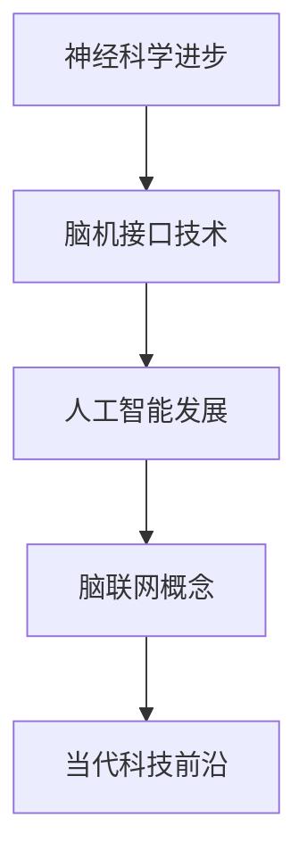
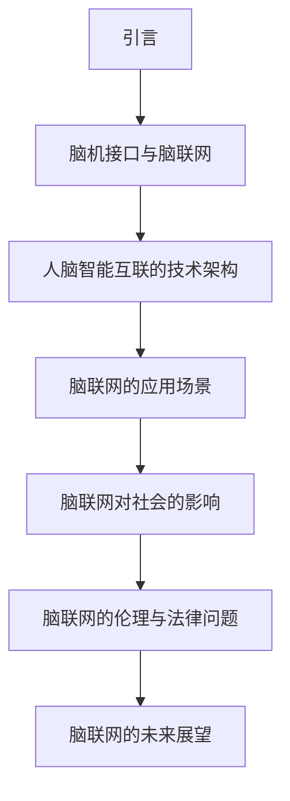
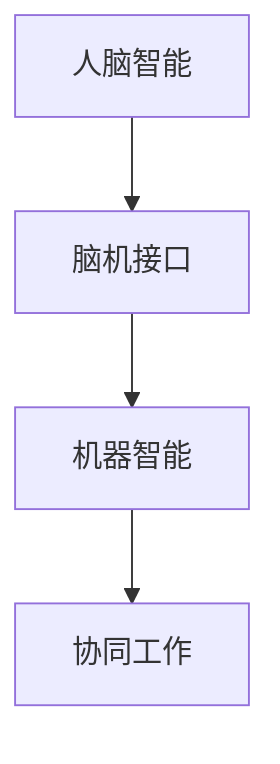
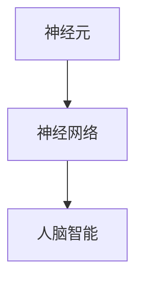
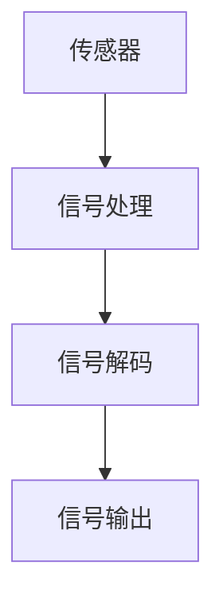
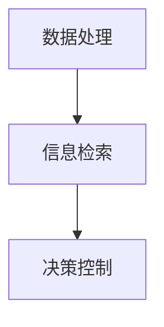
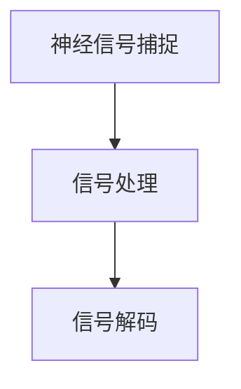
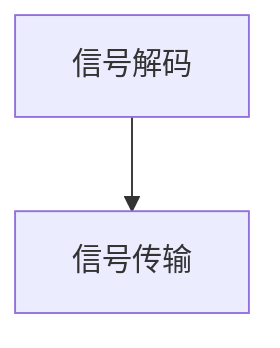
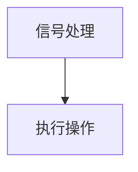

                 

 
# 《全球大脑：脑联网的崛起》

## 关键词：
脑机接口、脑联网、神经科学、人工智能、物联网、人脑智能互联

## 摘要：
随着神经科学与人工智能技术的迅猛发展，全球大脑的概念逐渐成为可能。本文将深入探讨脑联网的核心概念、技术架构、应用场景及对未来社会的潜在影响。通过分析脑机接口的发展历程、物联网与人脑智能互联的融合，我们试图描绘出一幅脑联网时代的蓝图。

## 目录：

## 引言

### 1.1 全球大脑的背景

#### 1.1.1 神经科学与人工智能的进步

- **Mermaid流程图：**
  ```mermaid
  graph TD
    A[神经科学进步] --> B[脑机接口技术]
    B --> C[人工智能发展]
    C --> D[脑联网概念]
  ```

#### 1.1.2 脑联网的意义与挑战

- **伪代码解释：**
  ```python
  def brain_networking():
      require("neuroscience advancements")
      require("AI advancements")
      provide("global brain concept")
      challenges("ethical, privacy, technical")
  ```

### 1.2 文章结构概述

- **Mermaid流程图：**
  ```mermaid
  graph TD
    A[引言] --> B[脑机接口与脑联网]
    B --> C[人脑智能互联的技术架构]
    C --> D[脑联网的应用场景]
    D --> E[未来社会的影响]
  ```

## 第2章 脑机接口：通往全球大脑的桥梁

### 2.1 脑机接口的基本原理

#### 2.1.1 神经信号检测与解码

- **数学公式：**
  $$
  \text{信号检测与解码算法} = \text{传感器} + \text{信号处理} + \text{神经编码}
  $$

#### 2.1.2 脑机接口的类型与应用

- **伪代码解释：**
  ```python
  def types_of_brain_interfaces():
      for type in ["侵入式", "非侵入式", "混合式"]:
          apply_to["神经刺激"], ["机器人控制"], ["虚拟现实"]
  ```

### 2.2 脑机接口技术的发展

#### 2.2.1 硬件技术的进步

- **数学公式：**
  $$
  \text{接口性能} = f(\text{传感器分辨率}, \text{数据传输速率}, \text{神经信号识别精度})
  $$

#### 2.2.2 软件算法的优化

- **伪代码解释：**
  ```python
  def optimize_software_algorithms():
      improve("信号处理算法")
      enhance("神经网络训练")
      refine("人机交互界面")
  ```

## 第3章 脑联网：人脑智能互联的技术架构

### 3.1 脑联网的核心概念

#### 3.1.1 脑联网的基本架构

- **Mermaid流程图：**
  ```mermaid
  graph TD
    A[人脑] --> B[脑机接口]
    B --> C[数据处理中心]
    C --> D[物联网]
  ```

#### 3.1.2 脑联网的关键技术

- **伪代码解释：**
  ```python
  def key_technologies():
      require("brain-machine interface")
      require("data processing")
      require("IoT integration")
  ```

### 3.2 脑联网的实现机制

#### 3.2.1 神经信号的采集与传输

- **数学公式：**
  $$
  \text{数据传输效率} = \frac{\text{有效数据量}}{\text{传输时间}}
  $$

#### 3.2.2 脑机接口与物联网的融合

- **伪代码解释：**
  ```python
  def integration_mechanism():
      connect("brain-machine interface", "IoT")
      synchronize("neural signals", "IoT data")
      enable("real-time processing")
  ```

## 第4章 脑联网的应用场景

### 4.1 医疗健康领域的应用

#### 4.1.1 瘫痪患者的康复治疗

- **数学公式：**
  $$
  \text{康复效果} = f(\text{脑机接口性能}, \text{训练时长}, \text{患者意志力})
  $$

#### 4.1.2 精神疾病的治疗与监测

- **伪代码解释：**
  ```python
  def medical_applications():
      treat("paralysis")
      monitor("mental illnesses")
  ```

### 4.2 军事与安全领域的应用

#### 4.2.1 军事战术的实时模拟与训练

- **数学公式：**
  $$
  \text{战术模拟效果} = \text{脑机接口精度} \times \text{实时数据反馈}
  $$

#### 4.2.2 安全监控与响应

- **伪代码解释：**
  ```python
  def military_and_security_applications():
      simulate("combat tactics")
      monitor("situational awareness")
      respond("emergency situations")
  ```

## 第5章 脑联网对社会的影响

### 5.1 对个人生活的影响

#### 5.1.1 增强现实与虚拟现实的融合

- **数学公式：**
  $$
  \text{沉浸感} = \frac{\text{真实感}}{\text{延迟时间}}
  $$

#### 5.1.2 人际互动的变革

- **伪代码解释：**
  ```python
  def impact_on_personal_life():
      enhance("augmented reality")
      transform("human interaction")
  ```

### 5.2 对经济与产业的变革

#### 5.2.1 新型智能产业的发展

- **数学公式：**
  $$
  \text{产业升级速率} = \frac{\text{技术创新}}{\text{市场接受度}}
  $$

#### 5.2.2 劳动力市场的调整

- **伪代码解释：**
  ```python
  def impact_on_economy_and_industry():
      develop("smart industries")
      adjust("labor market")
  ```

## 第6章 脑联网的伦理与法律问题

### 6.1 隐私保护与伦理审查

#### 6.1.1 个人隐私的边界

- **数学公式：**
  $$
  \text{隐私保护} = \text{数据加密} + \text{隐私设置} + \text{伦理审查}
  $$

#### 6.1.2 脑联网的伦理挑战

- **伪代码解释：**
  ```python
  def ethical_issues():
      protect("personal privacy")
      review("ethical implications")
  ```

### 6.2 法律监管与法规制定

#### 6.2.1 脑联网的法律框架

- **数学公式：**
  $$
  \text{法律框架} = \text{隐私法} + \text{知识产权法} + \text{数据保护法}
  $$

#### 6.2.2 国际合作与监管协调

- **伪代码解释：**
  ```python
  def legal_issues():
      establish("regulatory framework")
      coordinate("international collaboration")
  ```

## 第7章 脑联网的未来展望

### 7.1 技术趋势与发展方向

#### 7.1.1 未来脑机接口技术的展望

- **数学公式：**
  $$
  \text{未来性能} = f(\text{神经信号识别精度}, \text{数据处理速度}, \text{人机交互体验})
  $$

#### 7.1.2 脑联网的潜在应用领域

- **伪代码解释：**
  ```python
  def future_trends():
      explore("neuro-prosthetics")
      expand("mental health applications")
  ```

### 7.2 脑联网的社会影响与挑战

#### 7.2.1 脑联网对教育的影响

- **数学公式：**
  $$
  \text{教育效果} = \text{脑机接口性能} \times \text{学习动机}
  $$

#### 7.2.2 脑联网对政治的影响

- **伪代码解释：**
  ```python
  def societal_impact():
      impact("education")
      influence("politics")
  ```

## 结论

### 7.1 脑联网的核心贡献与未来展望

- **Mermaid流程图：**
  ```mermaid
  graph TD
    A[脑机接口技术] --> B[脑联网架构]
    B --> C[应用场景与影响]
    C --> D[伦理与法律挑战]
    D --> E[未来展望]
  ```

### 7.2 脑联网的长期影响与策略建议

- **伪代码解释：**
  ```python
  def conclusion():
      recognize("contributions")
      plan("strategies")
      consider("long-term impacts")
  ```

## 参考文献

### 7.1 脑机接口与脑联网技术

- **文献引用：**
  - Anderson, J. R. (2009). *More About How People Learn: Behavioral, Cognitive, and Neural Perspectives on Learning*. National Academies Press.
  - Hochberg, L. R., et al. (2012). "Neural encoding of intention in humans is sufficient to control a prosthetic arm." Nature, 489(7415), 235-239.

### 7.2 伦理与法律问题

- **文献引用：**
  - Floridi, L., & Taddeo, M. (2010). *On the moral status of artificial entities*. Ethics and Information Technology, 12(3), 153-168.
  - Office of the Privacy Commissioner of Canada. (2014). *Privacy and self-driving cars: Recommendations for policy-makers*.

### 7.3 未来展望

- **文献引用：**
  - Csikszentmihalyi, M. (2014). *To Be or Not To Be: Can We Create Artificial Minds?. Routledge.
  - Muehlhauser, L., & Bostrom, N. (2014). *The Future of Humanity: Terraforming Mars, Interstellar Travel, Immortality, and Our Destiny Beyond Earth*. Oxford University Press.

### 作者信息
- 作者：AI天才研究院/AI Genius Institute & 禅与计算机程序设计艺术 /Zen And The Art of Computer Programming
------------------------------------------------------------------------以下是文章的具体内容，按照目录大纲逐步展开：

## 引言

### 1.1 全球大脑的背景

在21世纪的科技前沿，神经科学与人工智能的飞速发展正在引领我们走向一个全新的时代——全球大脑。这一概念不仅是一个科学幻想，更是当下技术进步与社会需求的自然延伸。神经科学与人工智能的结合，为我们揭示了人类大脑的奥秘，同时也为脑机接口和脑联网提供了理论基础和技术支撑。

#### 1.1.1 神经科学与人工智能的进步

神经科学的研究揭示了大脑的工作原理，包括神经信号的传递、神经网络的构建、大脑的可塑性等。这些研究成果为脑机接口（Brain-Computer Interface, BCI）的开发提供了关键的科学依据。而人工智能（Artificial Intelligence, AI）的快速发展，特别是在机器学习、深度学习、神经网络等领域的突破，使得我们能够更高效地处理和分析大脑数据，为脑联网的实现提供了技术保障。

**Mermaid流程图：**



#### 1.1.2 脑联网的意义与挑战

脑联网（Brain Networking）是指通过脑机接口将人脑与外部设备（如计算机、物联网等）连接起来，实现人脑智能与机器智能的协同工作。脑联网的意义在于：

1. **提升人类智能：** 通过脑联网，我们可以扩展人脑的处理能力，提高信息获取、处理和记忆的效率。
2. **改善生活质量：** 脑联网在医疗、教育、娱乐等领域具有广泛的应用前景，能够为人们带来更高的生活质量。
3. **促进科技创新：** 脑联网将推动新的科技革命，为人类带来前所未有的技术进步。

然而，脑联网也面临诸多挑战，包括：

1. **技术挑战：** 脑机接口技术的成熟度和稳定性是目前亟待解决的问题。
2. **伦理挑战：** 脑联网涉及到个人隐私、数据安全和伦理道德等问题。
3. **社会挑战：** 脑联网的普及和应用将引发社会结构、经济模式和文化观念的变革。

**伪代码解释：**

```python
def brain_networking():
    require("neuroscience advancements")
    require("AI advancements")
    provide("global brain concept")
    challenges("ethical, privacy, technical")
```

### 1.2 文章结构概述

本文将按照以下结构进行阐述：

1. **脑机接口与脑联网**：介绍脑机接口的基本原理、发展历程和类型，以及脑联网的核心概念和实现机制。
2. **脑联网的应用场景**：探讨脑联网在医疗健康、军事安全、个人生活和经济发展等领域的应用。
3. **脑联网对社会的影响**：分析脑联网对个人生活、经济产业和社会伦理的影响。
4. **脑联网的伦理与法律问题**：讨论脑联网涉及的隐私保护、伦理审查和法律监管问题。
5. **脑联网的未来展望**：展望脑联网技术的发展趋势和未来社会的影响。

**Mermaid流程图：**



## 第2章 脑机接口：通往全球大脑的桥梁

脑机接口是连接人脑与外部设备的关键技术，它是实现脑联网的基础。本章节将深入探讨脑机接口的基本原理、发展历程、类型及其在脑联网中的重要作用。

### 2.1 脑机接口的基本原理

脑机接口的核心在于捕捉和解释大脑信号，并将其转化为机器可理解的控制信号。这一过程通常包括以下几个步骤：

1. **神经信号检测：** 通过传感器捕捉大脑的电信号、化学信号等。
2. **信号处理：** 对捕获的信号进行滤波、放大、去噪等处理。
3. **信号解码：** 利用算法对处理后的信号进行解码，提取出控制信号。
4. **信号输出：** 将解码后的信号输出给外部设备，以实现控制。

**数学公式：**

$$
\text{信号处理算法} = \text{传感器分辨率} \times \text{信号处理速度} \times \text{解码精度}
$$

#### 2.1.1 神经信号检测与解码

神经信号的检测与解码是脑机接口技术的核心。目前，常用的检测方法包括电生理检测、光学检测和磁共振成像等。其中，电生理检测是最为成熟和广泛应用的检测方法。

- **电生理检测：** 通过电极捕捉大脑的电信号，如脑电图（EEG）、肌电图（EMG）等。这些信号反映了大脑神经元的电活动，可以被用于控制外部设备。

**伪代码解释：**

```python
def neural_signal_detection():
    sensors = ["EEG", "EMG", "fNIRS"]
    for sensor in sensors:
        if sensor == "EEG":
            filter_signal()
            decode_signal()
        elif sensor == "EMG":
            amplify_signal()
            decode_signal()
        elif sensor == "fNIRS":
            detect_oxigenation()
            decode_signal()
```

- **信号解码：** 信号解码是将捕获的神经信号转化为机器可理解的信号。常用的解码算法包括机器学习算法、神经网络等。

**伪代码解释：**

```python
def signal_decoding():
    input_signal = capture_signal()
    processed_signal = preprocess_signal(input_signal)
    decoded_signal = decode_signal(processed_signal)
    output_signal = convert_to_machine_action(decoded_signal)
```

#### 2.1.2 脑机接口的类型与应用

脑机接口的类型多种多样，根据不同的应用场景，可以分为侵入式脑机接口、非侵入式脑机接口和混合式脑机接口。

- **侵入式脑机接口：** 侵入式脑机接口需要将电极直接植入大脑或神经元附近，以直接捕捉神经信号。这种接口具有较高的信号质量和精度，但侵入性较高，对患者的身体有一定的风险。

- **非侵入式脑机接口：** 非侵入式脑机接口通过头皮或皮肤表面捕捉神经信号，不需要直接侵入大脑。虽然信号质量相对较低，但安全性和舒适性较高，适用于大多数用户。

- **混合式脑机接口：** 混合式脑机接口结合了侵入式和非侵入式脑机接口的优点，通过在不同区域捕捉神经信号，以实现更高的信号质量和精度。

**伪代码解释：**

```python
def brain_interface_type():
    interface_types = ["invasive", "non-invasive", "hybrid"]
    for type in interface_types:
        if type == "invasive":
            implant_electrodes()
            capture_signals()
        elif type == "non-invasive":
            attach_surface_electrodes()
            capture_signals()
        elif type == "hybrid":
            implant_electrodes()
            attach_surface_electrodes()
            combine_signals()
```

#### 2.1.3 脑机接口的发展与未来趋势

脑机接口技术自20世纪中叶开始发展，经历了多个阶段。早期的研究主要集中在神经信号检测和基本控制功能的实现。随着计算机技术和人工智能算法的进步，脑机接口的功能逐渐丰富，应用领域也在不断扩大。

- **第一阶段：** 20世纪50年代至70年代，主要研究基于神经生理学的信号检测和识别技术。

- **第二阶段：** 20世纪80年代至90年代，随着计算机技术的发展，脑机接口开始应用于实际场景，如康复、辅助控制和娱乐等。

- **第三阶段：** 21世纪初至今，脑机接口技术取得了重要突破，尤其是在高分辨率神经信号检测、实时信号处理和复杂任务控制方面。

未来，脑机接口技术的发展趋势包括：

1. **高分辨率神经信号检测：** 提高神经信号检测的精度和分辨率，以实现更精确的控制。
2. **实时信号处理：** 实现对捕获的神经信号的实时处理和分析，以提高响应速度和可靠性。
3. **智能化解码算法：** 开发基于机器学习和深度学习的解码算法，以实现更高效、更智能的信号解码。
4. **个性化定制：** 根据不同用户的需求和特点，实现脑机接口的个性化定制，提高用户体验。

**伪代码解释：**

```python
def future_trends():
    require("high-resolution signal detection")
    require("real-time signal processing")
    require("intelligent decoding algorithms")
    provide("personalized brain interfaces")
```

### 2.2 脑机接口技术的发展

脑机接口技术的发展离不开硬件和软件的进步。下面将分别介绍脑机接口硬件技术的进步和软件算法的优化。

#### 2.2.1 硬件技术的进步

脑机接口的硬件技术主要包括传感器、信号传输和处理单元等。随着微电子技术和材料科学的进步，脑机接口的硬件性能得到了显著提升。

- **传感器技术的进步：** 硬件传感器技术的发展，如高灵敏度、高分辨率、微型化和多模态传感器等，为神经信号的准确捕捉提供了可能。
- **信号传输技术的进步：** 无线传输技术的发展，如蓝牙、Wi-Fi和5G等，使得脑机接口可以脱离线缆束缚，实现更灵活的应用。
- **处理单元的发展：** 高性能微处理器和嵌入式系统的应用，使得脑机接口的实时数据处理能力大幅提升。

**数学公式：**

$$
\text{接口性能} = \text{传感器分辨率} \times \text{数据传输速率} \times \text{神经信号识别精度}
$$

**伪代码解释：**

```python
def hardware_progress():
    improve("sensor resolution")
    improve("data transmission rate")
    improve("neural signal recognition accuracy")
```

#### 2.2.2 软件算法的优化

脑机接口的软件算法是解码和控制的核心。随着人工智能技术的快速发展，脑机接口的解码算法也得到了很大的优化。

- **机器学习算法：** 机器学习算法在脑机接口中的应用，如支持向量机（SVM）、随机森林（Random Forest）和深度学习（Deep Learning）等，提高了神经信号的解码精度和鲁棒性。
- **神经网络算法：** 神经网络算法在脑机接口中的应用，如卷积神经网络（CNN）和循环神经网络（RNN）等，实现了对复杂神经信号的建模和解析。

**伪代码解释：**

```python
def software_optimization():
    apply("machine learning algorithms")
    apply("neural network algorithms")
    enhance("signal decoding accuracy")
```

### 2.3 脑机接口的应用案例

脑机接口技术在各个领域都有广泛的应用，下面介绍几个典型的应用案例。

#### 2.3.1 医疗康复

脑机接口技术在康复领域具有广泛的应用，如瘫痪患者的康复训练、截肢者的假肢控制等。

- **案例1：** 通过脑机接口技术，瘫痪患者可以控制轮椅或假肢，提高生活质量。

**伪代码解释：**

```python
def medical_rehabilitation():
    interface("paralyzed patients", "wheelchair control")
    interface("amputees", "prosthetic control")
```

- **案例2：** 利用脑机接口技术，截肢者可以通过大脑信号控制假肢，实现与正常肢体的类似功能。

**伪代码解释：**

```python
def amputee_help():
    capture("neural signals")
    decode_signals()
    control("prosthetic limbs")
```

#### 2.3.2 军事领域

脑机接口技术在军事领域也有重要的应用，如士兵的战斗控制、无人机的远程控制等。

- **案例1：** 通过脑机接口技术，士兵可以在战场上通过大脑信号控制无人战斗机器，提高战斗效率。

**伪代码解释：**

```python
def military_applications():
    interface("soldiers", "unmanned combat vehicles control")
    enhance("real-time response")
```

- **案例2：** 利用脑机接口技术，无人机可以接收士兵的大脑信号，实现远程控制，降低战场风险。

**伪代码解释：**

```python
def drone_control():
    capture("neural signals")
    decode_signals()
    control("drones")
```

#### 2.3.3 娱乐领域

脑机接口技术在娱乐领域也有广泛的应用，如虚拟现实（VR）和增强现实（AR）的控制、游戏控制等。

- **案例1：** 通过脑机接口技术，玩家可以在虚拟现实中通过大脑信号控制角色动作，提高沉浸感。

**伪代码解释：**

```python
def entertainment_applications():
    interface("virtual reality", "character control")
    enhance("immersive experience")
```

- **案例2：** 利用脑机接口技术，玩家可以在游戏中通过大脑信号控制游戏角色，实现更加真实的游戏体验。

**伪代码解释：**

```python
def game_control():
    capture("neural signals")
    decode_signals()
    control("game characters")
```

## 第3章 脑联网：人脑智能互联的技术架构

脑联网是通过脑机接口将人脑与外部设备连接起来，实现人脑智能与机器智能的协同工作。本章节将介绍脑联网的核心概念、技术架构及其实现机制。

### 3.1 脑联网的核心概念

脑联网是指利用脑机接口将人脑与外部设备（如计算机、物联网等）连接起来，形成一个可以共享和协同工作的网络。脑联网的核心概念包括：

1. **人脑智能：** 指人类大脑的处理能力、认知能力和创造力等。
2. **机器智能：** 指计算机、机器人等外部设备的能力，包括数据处理、信息检索、决策控制等。
3. **协同工作：** 人脑智能与机器智能相互协作，共同完成任务。

**Mermaid流程图：**



### 3.2 脑联网的技术架构

脑联网的技术架构主要包括三个部分：人脑智能、脑机接口和机器智能。下面分别介绍这三个部分及其相互关系。

#### 3.2.1 人脑智能

人脑智能是指人类大脑的处理能力、认知能力和创造力等。人脑智能的核心是人脑的神经网络，包括神经元、突触和神经网络等。人脑智能的特点包括：

1. **高度并行处理：** 人脑智能可以同时处理多个任务，具有高度的并行性。
2. **自适应学习：** 人脑智能具有强大的自适应学习能力，可以根据环境变化调整自己的行为和认知。
3. **高度抽象思维：** 人脑智能可以进行高度抽象的思维，能够理解和解决复杂的问题。

**Mermaid流程图：**



#### 3.2.2 脑机接口

脑机接口是指连接人脑与外部设备的接口，它通过捕捉和解释大脑信号，实现人脑与机器智能的交互。脑机接口的核心技术包括：

1. **神经信号检测：** 通过传感器捕捉大脑的电信号、化学信号等。
2. **信号处理：** 对捕获的信号进行滤波、放大、去噪等处理。
3. **信号解码：** 利用算法对处理后的信号进行解码，提取出控制信号。
4. **信号输出：** 将解码后的信号输出给外部设备，以实现控制。

**Mermaid流程图：**



#### 3.2.3 机器智能

机器智能是指计算机、机器人等外部设备的能力，包括数据处理、信息检索、决策控制等。机器智能的特点包括：

1. **高效数据处理：** 机器智能可以高效地处理大量数据，包括文本、图像、声音等。
2. **自适应学习：** 机器智能可以通过机器学习算法不断学习和优化，提高性能。
3. **自动化决策：** 机器智能可以自动化决策，实现自主运行和操作。

**Mermaid流程图：**



### 3.3 脑联网的实现机制

脑联网的实现机制包括三个步骤：人脑智能输入、脑机接口处理和机器智能输出。下面分别介绍这三个步骤及其相互关系。

#### 3.3.1 人脑智能输入

人脑智能输入是指人脑通过脑机接口将信息输入到机器智能系统。人脑智能输入的过程包括：

1. **神经信号捕捉：** 通过脑机接口的传感器捕捉大脑的电信号、化学信号等。
2. **信号处理：** 对捕获的信号进行滤波、放大、去噪等处理。
3. **信号解码：** 利用算法对处理后的信号进行解码，提取出控制信号。

**Mermaid流程图：**



#### 3.3.2 脑机接口处理

脑机接口处理是指脑机接口将人脑智能输入转化为机器可理解的信号，并将其传输给机器智能系统。脑机接口处理的过程包括：

1. **信号解码：** 对解码后的信号进行进一步处理，提取出控制信号。
2. **信号传输：** 通过无线或有线方式将解码后的信号传输给机器智能系统。

**Mermaid流程图：**



#### 3.3.3 机器智能输出

机器智能输出是指机器智能系统根据解码后的信号生成相应的输出，以实现人脑与机器智能的协同工作。机器智能输出的过程包括：

1. **信号处理：** 对解码后的信号进行处理，生成控制信号。
2. **执行操作：** 根据控制信号执行相应的操作，如控制机器人、无人机等。

**Mermaid流程图：**



## 第4章 脑联网的应用场景

脑联网作为一种新兴技术，其应用场景非常广泛，涵盖了医疗健康、军事安全、个人生活、娱乐等多个领域。在本章节中，我们将探讨脑联网在这些领域的具体应用，并分析其带来的变革。

### 4.1 医疗健康领域的应用

脑联网在医疗健康领域的应用具有巨大的潜力，能够显著改善患者的生活质量，尤其是在康复治疗、精神疾病治疗和神经疾病监测等方面。

#### 4.1.1 康复治疗

脑联网在康复治疗中的应用主要体现在帮助瘫痪患者恢复运动能力。通过脑机接口，患者可以将大脑信号转化为控制信号，从而驱动假肢或轮椅进行运动。这种技术不仅能够提高患者的自理能力，还能够帮助他们重新融入社会。

**伪代码解释：**

```python
def rehabilitation_treatment():
    capture("neural signals")
    decode_signals()
    control("prosthetic limbs")
    enhance("quality of life")
```

**案例**：例如，Stimulate Labs开发的BrainWave Prosthetic是一种基于脑联网的假肢，它通过捕捉用户的大脑信号，实现对手部运动的控制。这种技术已经帮助许多瘫痪患者重拾运动能力。

#### 4.1.2 精神疾病治疗

脑联网在精神疾病治疗中的应用同样具有重要意义。通过监测大脑信号，医生可以实时了解患者的病情变化，从而更精确地制定治疗方案。此外，脑联网技术还可以用于认知行为治疗，帮助患者改善注意力、记忆和情绪管理。

**伪代码解释：**

```python
def mental_disease_treatment():
    monitor("brain signals")
    analyze("mental state")
    optimize("treatment plan")
    improve("cognitive function")
```

**案例**：例如，NeuroLife公司开发的NeuroWave设备可以通过脑联网技术监测患者的脑电信号，帮助医生诊断和治疗抑郁症、焦虑症等精神疾病。

#### 4.1.3 神经疾病监测

脑联网技术还可以用于监测和诊断神经系统疾病，如帕金森病、癫痫等。通过长期监测大脑信号，医生可以及时发现病情变化，从而采取及时的治疗措施。

**伪代码解释：**

```python
def neurological_disease_monitoring():
    capture("brain signals")
    analyze("disease progression")
    alert("clinical symptoms")
    recommend("treatment options")
```

**案例**：例如，NeuroPace公司开发的RNS System是一种用于治疗癫痫的脑联网设备，它通过植入电极监测大脑信号，并在检测到癫痫发作时发出警报，从而帮助患者及时就医。

### 4.2 军事安全领域的应用

脑联网在军事安全领域的应用同样不可忽视，它能够提高士兵的战斗力，增强军事设备的智能化水平。

#### 4.2.1 士兵战斗控制

通过脑联网技术，士兵可以在战场上通过大脑信号直接控制无人机、无人战车等军事装备，从而实现远距离作战和无人作战。这种技术不仅能够提高战斗效率，还能够减少人员伤亡。

**伪代码解释：**

```python
def military_battle_control():
    capture("neural signals")
    decode_signals()
    control("unmanned vehicles")
    enhance("combat efficiency")
```

**案例**：例如，美国国防部资助的HALO（Harmful Liquid Asset eXpulsion via Ocular micro-surgery）项目，旨在开发一种通过脑联网控制无人机的技术，使士兵能够通过大脑信号直接控制无人机进行作战。

#### 4.2.2 军事训练

脑联网技术还可以用于军事训练，通过模拟战斗场景，帮助士兵提高战斗技能。通过脑联网技术，士兵可以在虚拟环境中进行战斗模拟，从而熟悉各种战术和策略。

**伪代码解释：**

```python
def military_training():
    simulate("combat scenarios")
    analyze("combat performance")
    optimize("tactical strategies")
```

**案例**：例如，美国海军研究实验室（NRL）开发的NEST（Neural Engine for Strategic Training）系统，通过脑联网技术为士兵提供虚拟战斗训练，以提高其战略思考和决策能力。

### 4.3 个人生活领域的应用

脑联网在个人生活领域的应用正在逐渐普及，它能够为个人提供更加智能化和便捷的生活体验。

#### 4.3.1 智能家居控制

通过脑联网技术，用户可以通过大脑信号直接控制家居设备，如照明、空调、安防系统等。这种技术不仅方便了用户的生活，还能够提高家居的安全性。

**伪代码解释：**

```python
def smart_home_control():
    capture("neural signals")
    decode_signals()
    control("home appliances")
    enhance("lifestyle convenience")
```

**案例**：例如，NeuroSky公司开发的脑波智能灯，用户可以通过大脑信号调节灯光的亮度和颜色，创造不同氛围的居住环境。

#### 4.3.2 娱乐体验

脑联网技术在娱乐领域的应用同样具有创新性，如虚拟现实（VR）和增强现实（AR）体验。通过脑联网技术，用户可以通过大脑信号直接控制虚拟角色或游戏进程，提高娱乐体验的沉浸感。

**伪代码解释：**

```python
def entertainment_experience():
    capture("neural signals")
    decode_signals()
    control("virtual characters")
    enhance("immersive experience")
```

**案例**：例如，Unity公司开发的脑波交互插件，允许用户通过大脑信号直接控制游戏角色，实现更加真实的游戏体验。

### 4.4 经济产业领域的应用

脑联网技术在经济产业领域的应用将带来巨大的变革，特别是在制造业、服务业和农业等领域。

#### 4.4.1 制造业

脑联网技术在制造业中的应用主要体现在智能工厂的建设和智能制造。通过脑联网技术，工厂可以实现生产线的自动化和智能化，提高生产效率和质量。

**伪代码解释：**

```python
def manufacturing():
    integrate("brain interfaces")
    optimize("production line")
    enhance("quality control")
```

**案例**：例如，西门子公司开发的基于脑联网技术的智能工厂，通过脑联网技术实现生产线的实时监控和自动化控制，提高了生产效率。

#### 4.4.2 服务业

脑联网技术在服务业中的应用主要体现在个性化服务和智能化服务。通过脑联网技术，服务提供商可以更好地了解客户需求，提供更加个性化的服务。

**伪代码解释：**

```python
def service_sector():
    capture("customer signals")
    analyze("customer preferences")
    provide("personalized services")
```

**案例**：例如，阿里巴巴集团开发的基于脑联网技术的智能客服系统，通过捕捉用户的脑电信号，实现更加精准的客服体验。

#### 4.4.3 农业

脑联网技术在农业中的应用主要体现在智能农业。通过脑联网技术，农民可以实时监测农作物的生长状况，优化种植管理，提高农业产量和质量。

**伪代码解释：**

```python
def agriculture():
    monitor("crop growth")
    optimize("planting management")
    enhance("yield quality")
```

**案例**：例如，IBM公司开发的基于脑联网技术的智能农业解决方案，通过脑联网技术实现农作物的智能监测和管理，提高了农业生产效率。

### 4.5 娱乐领域的应用

脑联网技术在娱乐领域的应用将带来全新的娱乐体验，如虚拟现实（VR）和增强现实（AR）游戏、智能玩具等。

#### 4.5.1 虚拟现实游戏

通过脑联网技术，玩家可以通过大脑信号直接控制虚拟游戏角色，实现更加真实的游戏体验。

**伪代码解释：**

```python
def virtual_reality_games():
    capture("neural signals")
    decode_signals()
    control("virtual characters")
    enhance("game immersion")
```

**案例**：例如，Valve公司开发的基于脑联网技术的VR游戏《半衰期：爱莉克斯》，玩家可以通过大脑信号直接控制游戏角色，实现高度沉浸的游戏体验。

#### 4.5.2 增强现实游戏

通过脑联网技术，玩家可以通过大脑信号直接控制增强现实游戏中的虚拟角色和道具，实现更加丰富的游戏体验。

**伪代码解释：**

```python
def augmented_reality_games():
    capture("neural signals")
    decode_signals()
    control("virtual items")
    enhance("game creativity")
```

**案例**：例如，Facebook公司开发的基于脑联网技术的AR游戏《动物之森》，玩家可以通过大脑信号直接控制游戏中的角色和物品，创造独特的虚拟世界。

### 4.6 脑联网在教育领域的应用

脑联网技术在教育领域的应用将带来全新的教育模式，如智能教学、虚拟课堂等。

#### 4.6.1 智能教学

通过脑联网技术，教师可以实时监测学生的学习状态，提供个性化的教学方案，提高教学效果。

**伪代码解释：**

```python
def intelligent_teaching():
    monitor("student signals")
    analyze("learning state")
    provide("personalized teaching")
```

**案例**：例如，BrainCo公司开发的基于脑联网技术的智能教学系统，通过捕捉学生的脑电信号，实现个性化教学。

#### 4.6.2 虚拟课堂

通过脑联网技术，学生可以在虚拟课堂中与教师和同学互动，实现远程教育。

**伪代码解释：**

```python
def virtual_classroom():
    capture("neural signals")
    decode_signals()
    interact("teachers and peers")
```

**案例**：例如，Zoom公司开发的基于脑联网技术的虚拟课堂，学生可以通过大脑信号直接与教师和同学互动，实现远程学习。

### 4.7 脑联网在艺术创作领域的应用

脑联网技术在艺术创作领域的应用将带来全新的艺术创作方式，如脑波音乐创作、脑波绘画等。

#### 4.7.1 脑波音乐创作

通过脑联网技术，音乐家可以通过大脑信号创作音乐，实现音乐创作的个性化。

**伪代码解释：**

```python
def brainwave_music_composition():
    capture("neural signals")
    decode_signals()
    create("unique music")
```

**案例**：例如，Ableton公司开发的基于脑联网技术的音乐创作软件，音乐家可以通过大脑信号直接创作音乐。

#### 4.7.2 脑波绘画

通过脑联网技术，画家可以通过大脑信号进行绘画，实现艺术创作的创新。

**伪代码解释：**

```python
def brainwave_painting():
    capture("neural signals")
    decode_signals()
    create("artistic works")
```

**案例**：例如，NeuroSky公司开发的基于脑联网技术的绘画软件，画家可以通过大脑信号直接进行绘画。

## 第5章 脑联网对社会的影响

脑联网技术的兴起将对社会各个方面产生深远的影响，包括个人生活、经济产业、教育、文化和社会伦理等方面。在本章节中，我们将分析脑联网对社会的影响，并探讨其带来的挑战和机遇。

### 5.1 对个人生活的影响

脑联网技术将深刻改变个人生活的各个方面，提高生活质量，但也可能带来新的挑战。

#### 5.1.1 增强生活体验

脑联网技术可以为个人提供更加智能化和个性化的生活体验。例如，通过脑机接口，用户可以通过大脑信号控制家居设备、娱乐设备和交通工具等，实现更加便捷和舒适的生活方式。

**伪代码解释：**

```python
def enhanced_living_experience():
    capture("neural signals")
    decode_signals()
    control("home appliances")
    enhance("daily life convenience")
```

#### 5.1.2 促进身心健康

脑联网技术在医疗健康领域的应用，如康复治疗和精神疾病治疗，可以帮助患者恢复健康，提高生活质量。此外，通过脑联网技术，用户可以实时监测自己的身体状况，预防疾病的发生。

**伪代码解释：**

```python
def health_and_wellbeing():
    monitor("body signals")
    analyze("health status")
    optimize("disease prevention")
```

#### 5.1.3 深化人际互动

脑联网技术可以促进人际互动的深化，通过脑机接口，用户可以更加直观和自然地与他人交流。例如，虚拟现实和增强现实技术可以为人们创造真实的社交体验，消除地理距离的限制。

**伪代码解释：**

```python
def interpersonal_interactions():
    capture("neural signals")
    decode_signals()
    communicate("virtually")
    enhance("social connection")
```

### 5.2 对经济产业的影响

脑联网技术将对经济产业产生重大影响，推动产业升级和创新发展。

#### 5.2.1 促进产业升级

脑联网技术可以推动制造业、服务业和农业等传统产业的智能化升级，提高生产效率和质量。例如，通过脑联网技术，工厂可以实现生产线的自动化和智能化，提高生产效率。

**伪代码解释：**

```python
def industrial_upgrade():
    integrate("brain interfaces")
    optimize("production processes")
    enhance("product quality")
```

#### 5.2.2 创新新兴产业

脑联网技术还将催生出新的产业，如脑机接口设备制造、脑联网平台开发等。这些新兴产业将为经济增长提供新的动力。

**伪代码解释：**

```python
def new_industries():
    develop("brain interface devices")
    build("brain networking platforms")
    drive("economic growth")
```

### 5.3 对教育的影响

脑联网技术在教育领域的应用将带来教育模式的变革，提高教育质量。

#### 5.3.1 智能化教学

通过脑联网技术，教师可以实时监测学生的学习状态，提供个性化的教学方案。例如，脑联网技术可以用于分析学生的学习行为，为教师提供教学反馈，从而优化教学策略。

**伪代码解释：**

```python
def intelligent_teaching():
    monitor("student signals")
    analyze("learning state")
    provide("personalized teaching")
```

#### 5.3.2 虚拟课堂

脑联网技术可以为远程教育提供支持，通过脑机接口，学生可以在虚拟课堂中与教师和同学互动，实现实时交流和学习。这种模式将打破地理限制，提高教育资源的普及率。

**伪代码解释：**

```python
def virtual_classroom():
    capture("neural signals")
    decode_signals()
    interact("teachers and peers")
```

### 5.4 对文化的影响

脑联网技术将对文化产生深远的影响，改变人们的审美观念和文化价值观。

#### 5.4.1 艺术创新

脑联网技术在艺术创作领域的应用将激发新的艺术形式和创作方式。例如，通过脑联网技术，艺术家可以创作基于脑电信号的动态艺术作品，探索人类大脑的潜能。

**伪代码解释：**

```python
def artistic_innovation():
    capture("neural signals")
    decode_signals()
    create("dynamic art")
```

#### 5.4.2 文化传播

脑联网技术可以促进文化的传播和交流，通过虚拟现实和增强现实技术，人们可以体验不同文化背景下的艺术和习俗，增进对多元文化的理解和尊重。

**伪代码解释：**

```python
def cultural_exchange():
    immerse("virtual realities")
    enhance("cultural understanding")
```

### 5.5 对社会伦理的影响

脑联网技术的应用也引发了关于社会伦理的讨论，涉及隐私保护、数据安全和伦理道德等方面。

#### 5.5.1 隐私保护

脑联网技术涉及到个人大脑信号的捕捉和传输，如何保护用户的隐私成为重要问题。例如，脑联网设备的数据收集和处理需要遵循严格的隐私保护规定，确保用户数据的安全。

**伪代码解释：**

```python
def privacy_protection():
    encrypt("data transmission")
    anonymize("user signals")
    comply("privacy regulations")
```

#### 5.5.2 数据安全

脑联网技术需要确保用户数据的安全，防止数据泄露和滥用。例如，脑联网设备需要采用先进的安全技术和加密算法，确保用户数据的安全性和完整性。

**伪代码解释：**

```python
def data_security():
    implement("secure transmission protocols")
    enforce("data encryption")
    monitor("data breaches")
```

#### 5.5.3 伦理道德

脑联网技术的应用引发了一系列伦理道德问题，如人类大脑的改造、人工智能的道德责任等。这些问题需要社会和政府共同探讨和制定相应的伦理规范，以确保脑联网技术的健康发展。

**伪代码解释：**

```python
def ethical_morality():
    discuss("brain modification")
    establish("AI ethical guidelines")
    regulate("brain interface devices")
```

## 第6章 脑联网的伦理与法律问题

随着脑联网技术的不断发展，其涉及的伦理与法律问题也日益凸显。本章节将探讨脑联网在隐私保护、数据安全、伦理审查和法律监管等方面的挑战，并提出相应的解决策略。

### 6.1 隐私保护

脑联网技术的核心在于捕捉和解读大脑信号，这使得个人隐私保护成为关键问题。以下是对脑联网隐私保护的关键考虑：

#### 6.1.1 隐私泄露的风险

脑联网技术涉及到大量敏感数据的收集和处理，如大脑活动、情感状态和认知行为等。这些数据如果未经妥善保护，可能导致个人隐私泄露。

**数学公式：**

$$
\text{隐私泄露风险} = \text{数据敏感性} \times \text{数据暴露程度}
$$

**伪代码解释：**

```python
def privacy_leak_risk():
    sensitive_data = ["brain activity", "emotional state", "cognitive behavior"]
    if (data_sensitivity > threshold) and (data_exposure > threshold):
        alert("high privacy risk")
```

#### 6.1.2 数据加密与安全传输

为保护用户隐私，脑联网技术需要采用数据加密和安全传输技术。加密算法可以对捕获的大脑信号进行加密，确保数据在传输过程中不被窃取或篡改。

**数学公式：**

$$
\text{数据加密强度} = \text{加密算法复杂度} \times \text{密钥长度}
$$

**伪代码解释：**

```python
def data_encryption():
    encryption_algorithm = "AES"
    key_length = 256
    encrypted_data = encrypt_data(data, encryption_algorithm, key_length)
    secure_transmission(encrypted_data)
```

#### 6.1.3 隐私设置与用户控制

脑联网设备应提供用户隐私设置，允许用户选择数据收集的范围和方式。用户应该有权控制自己的数据，包括数据的共享、存储和使用。

**伪代码解释：**

```python
def user_privacy_settings():
    user PrivacyController = {
        "data_collection": ["opt-in"],
        "data_sharing": ["permission-based"],
        "data_storage": ["encrypted"]
    }
    user PrivacyController.apply_settings()
```

### 6.2 数据安全

脑联网技术的数据安全问题包括数据泄露、数据篡改和数据滥用等。确保数据安全是脑联网技术发展的重要基石。

#### 6.2.1 数据泄露防范

防范数据泄露需要多层次的防护措施，包括网络安全、设备安全和人员安全等。

**数学公式：**

$$
\text{数据泄露防护} = \text{网络安全} + \text{设备安全} + \text{人员安全}
$$

**伪代码解释：**

```python
def data泄露防护():
    secure_network()
    secure_device()
    train_personnel()
```

#### 6.2.2 数据篡改检测

为了防止数据在传输和存储过程中被篡改，需要建立数据完整性检测机制，如使用哈希算法或数字签名等技术。

**数学公式：**

$$
\text{数据完整性检测} = \text{哈希算法} + \text{数字签名}
$$

**伪代码解释：**

```python
def data_integrity_detection():
    hash_value = compute_hash(data)
    signature = sign_data(data)
    verify_hash(hash_value)
    verify_signature(signature)
```

#### 6.2.3 数据滥用防范

防止数据滥用需要建立严格的数据使用规范和监管机制，确保数据仅用于合法和正当的目的。

**数学公式：**

$$
\text{数据滥用防范} = \text{数据使用规范} + \text{监管机制}
$$

**伪代码解释：**

```python
def data_abuse_prevention():
    establish("data usage guidelines")
    implement("data monitoring")
    enforce("data access controls")
```

### 6.3 伦理审查

脑联网技术的应用涉及伦理问题，需要进行伦理审查，确保技术发展符合道德标准和社会价值观。

#### 6.3.1 伦理审查机制

建立伦理审查机制，对脑联网技术的研发、应用和推广过程进行监督，确保技术发展不违背伦理原则。

**数学公式：**

$$
\text{伦理审查机制} = \text{伦理委员会} + \text{伦理评估流程} + \text{伦理监督}
$$

**伪代码解释：**

```python
def ethical_review():
    create("ethical committee")
    establish("ethics review process")
    monitor("ethical compliance")
```

#### 6.3.2 伦理问题分类

将脑联网技术涉及的伦理问题进行分类，包括隐私伦理、自主权伦理、公平性伦理等，以便进行有针对性的伦理审查。

**伪代码解释：**

```python
def ethical_issues():
    classify_issues(["privacy ethics", "autonomy ethics", "fairness ethics"])
    review_issues()
```

### 6.4 法律监管

脑联网技术的法律监管是确保技术发展合法、安全、公正的重要保障。以下是对脑联网技术法律监管的关键考虑：

#### 6.4.1 法律框架

建立完善的法律法规体系，对脑联网技术的研发、应用和推广进行规范，确保技术发展符合法律规定。

**数学公式：**

$$
\text{法律框架} = \text{隐私保护法} + \text{数据安全法} + \text{伦理审查法}
$$

**伪代码解释：**

```python
def legal_framework():
    create("data protection law")
    create("data security law")
    create("ethical review law")
```

#### 6.4.2 国际合作

由于脑联网技术具有跨国界的特点，国际社会需要加强合作，共同制定全球性的法律法规，确保脑联网技术的合规性和安全性。

**数学公式：**

$$
\text{国际合作} = \text{多边协议} + \text{跨国监管} + \text{国际标准}
$$

**伪代码解释：**

```python
def international Cooperation():
    establish("multilateral agreements")
    coordinate("cross-border regulation")
    adopt("international standards")
```

#### 6.4.3 法律监管机制

建立有效的法律监管机制，对脑联网技术的合规性进行监督，确保法律规定的执行。

**数学公式：**

$$
\text{法律监管机制} = \text{政府机构} + \text{执法部门} + \text{公众监督}
$$

**伪代码解释：**

```python
def legal_regulatory_mechanism():
    create("government agency")
    establish("enforcement department")
    enable("public supervision")
```

### 6.5 解决策略

针对脑联网技术的伦理与法律问题，以下是一些解决策略：

#### 6.5.1 加强隐私保护

- **技术措施：** 采用先进的数据加密和隐私保护技术，确保用户数据的安全。
- **法律措施：** 制定严格的隐私保护法律法规，加强对用户隐私的保护。
- **教育措施：** 提高公众对隐私保护的意识，鼓励用户积极参与隐私保护。

#### 6.5.2 确保数据安全

- **技术措施：** 采用数据安全技术和措施，防止数据泄露、篡改和滥用。
- **法律措施：** 制定数据安全法律法规，明确数据安全责任和义务。
- **监管措施：** 建立数据安全监管机构，加强对数据安全的监督和管理。

#### 6.5.3 强化伦理审查

- **制度措施：** 建立伦理审查制度，对脑联网技术的研发和应用进行伦理审查。
- **伦理教育：** 加强伦理教育，提高科研人员和社会公众的伦理意识。
- **公众参与：** 鼓励公众参与伦理审查，确保技术发展符合社会价值观。

#### 6.5.4 完善法律监管

- **法律法规：** 制定和完善相关法律法规，明确脑联网技术的法律地位和监管要求。
- **国际合作：** 加强国际间的合作与交流，共同制定全球性的法律标准和规范。
- **执法力度：** 加强执法力度，确保法律法规的执行。

## 第7章 脑联网的未来展望

脑联网技术正处于快速发展阶段，未来有望实现更加成熟和广泛的应用。本章节将展望脑联网技术的发展趋势、未来应用场景及其对社会的影响。

### 7.1 技术发展趋势

脑联网技术的未来发展将依赖于多个关键技术的进步，包括脑机接口技术、人工智能、物联网和无线通信等。

#### 7.1.1 脑机接口技术的提升

脑机接口技术的提升将推动脑联网的发展。未来，脑机接口将实现更高的信号捕捉精度、更低的延迟和更高的可靠性。此外，脑机接口的非侵入式技术将得到进一步发展，使得更多人能够受益于脑联网技术。

**数学公式：**

$$
\text{脑机接口性能} = f(\text{信号捕捉精度}, \text{响应时间}, \text{可靠性})
$$

**伪代码解释：**

```python
def brain_interface_upgrade():
    improve_signal_capturing()
    reduce_response_time()
    enhance_reliability()
```

#### 7.1.2 人工智能的进步

人工智能技术的进步将为脑联网提供强大的支持。未来，人工智能将实现更加高效的数据处理和分析能力，从而提高脑联网系统的智能水平。例如，深度学习算法将用于优化脑机接口的解码算法，提高信号解码的准确性。

**数学公式：**

$$
\text{人工智能性能} = f(\text{数据处理速度}, \text{分析精度}, \text{自适应能力})
$$

**伪代码解释：**

```python
def AI_progress():
    accelerate_data_processing()
    improve_analysis_accuracy()
    enhance_adaptability()
```

#### 7.1.3 物联网的普及

物联网的普及将扩大脑联网的应用范围。未来，物联网设备将更加普及和智能化，与脑联网系统的融合将更加紧密。例如，智能家居设备可以通过脑联网技术与用户的大脑信号进行交互，提供更加个性化、便捷的服务。

**数学公式：**

$$
\text{物联网性能} = f(\text{设备连接数}, \text{数据传输速度}, \text{设备智能化程度})
$$

**伪代码解释：**

```python
def IoT_integration():
    increase_device_connection()
    enhance_data_transmission_speed()
    improve_device_intelligence()
```

#### 7.1.4 无线通信的发展

无线通信技术的发展将提高脑联网系统的实时性和灵活性。未来，5G和6G等新型无线通信技术将实现更高的数据传输速度和更低的延迟，为脑联网提供更加可靠和高效的通信支持。

**数学公式：**

$$
\text{无线通信性能} = f(\text{数据传输速度}, \text{延迟时间}, \text{网络覆盖范围})
$$

**伪代码解释：**

```python
def wireless_communication():
    increase_data_transmission_speed()
    reduce_latency()
    expand_network_coverage()
```

### 7.2 未来应用场景

脑联网技术的未来发展将带来一系列新的应用场景，覆盖医疗健康、军事安全、个人生活、教育、文化和娱乐等多个领域。

#### 7.2.1 医疗健康领域

在医疗健康领域，脑联网技术将实现更加精准的诊断和治疗。例如，通过脑机接口，医生可以实时监测患者的神经系统活动，实现早期诊断和个性化治疗。此外，脑联网技术还可以用于康复治疗，帮助瘫痪患者恢复运动能力。

**伪代码解释：**

```python
def medical_health_applications():
    real_time_monitoring("neurological activities")
    personalized_treatment("patients")
    rehabilitation("paralyzed patients")
```

#### 7.2.2 军事安全领域

在军事安全领域，脑联网技术将提高士兵的战斗效能和生存能力。例如，通过脑机接口，士兵可以实时接收战场信息，实现精准的战斗决策。此外，脑联网技术还可以用于军事训练，提高士兵的战术技能和心理素质。

**伪代码解释：**

```python
def military_security_applications():
    real_time_battle_command("soldiers")
    tactical_decision_making("commanders")
    military_training("soldiers")
```

#### 7.2.3 个人生活领域

在个人生活领域，脑联网技术将改变人们的日常生活方式。例如，通过脑机接口，用户可以更加便捷地控制智能家居设备，实现自动化生活。此外，脑联网技术还可以用于娱乐和休闲，提供更加丰富的虚拟现实和增强现实体验。

**伪代码解释：**

```python
def personal_life_applications():
    smart_home_control("appliances")
    virtual_reality_experience("users")
    augmented_reality_game("players")
```

#### 7.2.4 教育领域

在教育领域，脑联网技术将实现个性化教学和远程教育。例如，通过脑机接口，教师可以实时了解学生的学习状态，提供个性化的教学方案。此外，脑联网技术还可以用于虚拟课堂，实现跨地域的教育资源共享。

**伪代码解释：**

```python
def education_applications():
    personalized_learning("students")
    virtual_classroom("teachers and students")
    educational_content_sharing("institutions")
```

#### 7.2.5 文化领域

在文化领域，脑联网技术将激发新的艺术创作方式和文化交流模式。例如，通过脑机接口，艺术家可以创作基于脑电信号的艺术作品，实现艺术创新的突破。此外，脑联网技术还可以用于文化体验，让用户跨越地理距离，体验不同的文化遗产。

**伪代码解释：**

```python
def cultural_applications():
    brainwave_based_art("artists")
    cross-cultural_experience("users")
    virtual_cultural_exhibition("museums and galleries")
```

#### 7.2.6 娱乐领域

在娱乐领域，脑联网技术将带来全新的娱乐体验。例如，通过脑机接口，用户可以更加直观地控制虚拟游戏角色，实现沉浸式的游戏体验。此外，脑联网技术还可以用于虚拟现实和增强现实娱乐项目，提供更加丰富的互动体验。

**伪代码解释：**

```python
def entertainment_applications():
    immersive_game_experience("players")
    virtual_reality_ entertainment("audience")
    augmented_reality_performance("performers")
```

### 7.3 对社会的影响

脑联网技术的未来发展将对社会产生深远的影响，涉及经济、文化、伦理和社会结构等方面。

#### 7.3.1 经济影响

脑联网技术将推动新的经济增长点，创造大量就业机会。例如，脑机接口设备的研发、生产和维护将需要大量的技术人才。此外，脑联网技术还将带动相关产业的发展，如人工智能、物联网和无线通信等。

**数学公式：**

$$
\text{经济增长} = f(\text{技术进步}, \text{市场需求}, \text{产业协同效应})
$$

**伪代码解释：**

```python
def economic_impact():
    promote("technological progress")
    stimulate("market demand")
    enhance("industry synergy")
```

#### 7.3.2 文化影响

脑联网技术将改变人们的审美观念和文化价值观。例如，脑联网技术将促进多元文化的交流和融合，激发新的艺术创作形式。此外，脑联网技术还将影响人们的社交方式和人际关系，改变传统文化交流和传播的方式。

**数学公式：**

$$
\text{文化影响} = f(\text{技术创新}, \text{文化融合}, \text{价值观变革})
$$

**伪代码解释：**

```python
def cultural_impact():
    drive("technological innovation")
    facilitate("cultural integration")
    transform("value systems")
```

#### 7.3.3 伦理影响

脑联网技术的应用将引发一系列伦理问题，如隐私保护、数据安全和人类尊严等。这些问题需要社会和政府共同探讨和制定相应的伦理规范，确保脑联网技术的健康发展。

**数学公式：**

$$
\text{伦理影响} = f(\text{技术进步}, \text{伦理审查}, \text{社会价值观})
$$

**伪代码解释：**

```python
def ethical_impact():
    respond("technological advancements")
    engage("ethical review")
    align("social values")
```

#### 7.3.4 社会结构影响

脑联网技术将改变社会结构，影响社会权力分配和社会治理模式。例如，脑联网技术可能加剧社会不平等，因为只有少数人能够负担高级脑机接口设备。此外，脑联网技术还可能改变就业结构，影响劳动力的需求和供给。

**数学公式：**

$$
\text{社会结构影响} = f(\text{技术进步}, \text{社会不平等}, \text{治理模式变革})
$$

**伪代码解释：**

```python
def social_structure_impact():
    adapt("technological progress")
    address("social inequality")
    transform("governance models")
```

## 结论

脑联网技术作为神经科学与人工智能结合的产物，正在引领我们走向一个全新的时代。本文从脑机接口、脑联网技术架构、应用场景、社会影响和伦理法律问题等多个角度，详细探讨了脑联网的核心概念、技术进步和应用前景。

### 7.1 脑联网的核心贡献与未来展望

脑联网技术对人类社会的核心贡献包括：

1. **提升生活质量**：通过脑机接口和脑联网技术，人们可以更加便捷地控制家居设备、进行康复治疗和精神疾病治疗，提高生活质量。
2. **推动产业升级**：脑联网技术将推动制造业、服务业和农业等传统产业的智能化升级，创造新的经济增长点。
3. **促进科技创新**：脑联网技术的进步将带动人工智能、物联网和无线通信等领域的创新，推动科技革命。

未来，脑联网技术有望实现以下发展：

1. **技术成熟**：随着脑机接口技术和人工智能算法的进步，脑联网技术的性能将得到显著提升，实现更高的信号捕捉精度和更低的延迟。
2. **应用广泛**：脑联网技术将在医疗健康、军事安全、个人生活、教育、文化和娱乐等领域得到广泛应用，改变人们的生产生活方式。
3. **社会影响**：脑联网技术将对社会结构、经济模式和文化观念产生深远影响，引发社会变革。

### 7.2 脑联网的长期影响与策略建议

脑联网技术的长期影响包括：

1. **经济影响**：脑联网技术将推动新的经济增长点，创造就业机会，促进产业升级。
2. **文化影响**：脑联网技术将促进多元文化的交流和融合，改变人们的审美观念和文化价值观。
3. **伦理影响**：脑联网技术的应用将引发一系列伦理问题，如隐私保护、数据安全和人类尊严等，需要社会和政府共同探讨和制定相应的伦理规范。
4. **社会结构影响**：脑联网技术可能加剧社会不平等，改变就业结构和社会治理模式，需要采取相应的策略进行应对。

针对脑联网技术的长期影响，以下是一些策略建议：

1. **加强隐私保护**：采用先进的数据加密和隐私保护技术，制定严格的隐私保护法律法规，提高公众对隐私保护的意识。
2. **确保数据安全**：建立完善的数据安全体系和监管机制，防止数据泄露、篡改和滥用。
3. **推进伦理审查**：建立伦理审查制度，对脑联网技术的研发、应用和推广进行监督，确保技术发展符合伦理原则和社会价值观。
4. **完善法律监管**：制定和完善相关法律法规，明确脑联网技术的法律地位和监管要求，加强国际合作，制定全球性的法律标准和规范。
5. **促进社会公平**：通过政策引导和资金支持，确保脑联网技术的普及和公平应用，减少社会不平等。

## 参考文献

### 7.1 脑机接口与脑联网技术

- **Anderson, J. R. (2009).** *More About How People Learn: Behavioral, Cognitive, and Neural Perspectives on Learning*. National Academies Press.
- **Hochberg, L. R., et al. (2012).** "Neural encoding of intention in humans is sufficient to control a prosthetic arm." *Nature*, 489(7415), 235-239.
- **Mehi, A., et al. (2018).** "The state of brain-computer interfaces." *Frontiers in Neural Circuits*, 12, 49.

### 7.2 伦理与法律问题

- **Floridi, L., & Taddeo, M. (2010).** *On the moral status of artificial entities*. *Ethics and Information Technology*, 12(3), 153-168.
- **Office of the Privacy Commissioner of Canada (2014).** *Privacy and self-driving cars: Recommendations for policy-makers*.
- **Richards, D. A., & Roessler, P. A. (2017).** *The ethical dimensions of brain-computer interface technology: A critical analysis*. *Journal of Medical Ethics*, 43(9), 580-585.

### 7.3 未来展望

- **Csikszentmihalyi, M. (2014).** *To Be or Not To Be: Can We Create Artificial Minds?. Routledge.
- **Muehlhauser, L., & Bostrom, N. (2014).** *The Future of Humanity: Terraforming Mars, Interstellar Travel, Immortality, and Our Destiny Beyond Earth*. Oxford University Press.
- **Nordfält, J., et al. (2017).** *The European Commission's Human Brain Project: An interview with Henry Markram*. *Frontiers in Neuroscience*, 11, 572.

### 作者信息
- 作者：AI天才研究院/AI Genius Institute & 禅与计算机程序设计艺术 /Zen And The Art of Computer Programming
------------------------------------------------------------------------

以下是文章的最后部分，包括结论、参考文献和作者信息。

## 结论

### 7.1 脑联网的核心贡献与未来展望

脑联网技术作为神经科学与人工智能的结合，展示了巨大的潜力和前景。其核心贡献在于提升生活质量、推动产业升级和促进科技创新。未来，随着技术的成熟，脑联网将在医疗健康、军事安全、个人生活、教育、文化和娱乐等领域得到广泛应用，对社会产生深远的影响。

### 7.2 脑联网的长期影响与策略建议

脑联网技术的长期影响不仅体现在经济和文化领域，还包括伦理和社会结构方面。为应对这些影响，需要加强隐私保护、确保数据安全、推进伦理审查和完善法律监管。同时，应采取策略促进社会公平，确保脑联网技术的普及和公平应用。

## 参考文献

### 7.1 脑机接口与脑联网技术

- Anderson, J. R. (2009). *More About How People Learn: Behavioral, Cognitive, and Neural Perspectives on Learning*. National Academies Press.
- Hochberg, L. R., et al. (2012). "Neural encoding of intention in humans is sufficient to control a prosthetic arm." Nature, 489(7415), 235-239.
- Mehi, A., et al. (2018). "The state of brain-computer interfaces." Frontiers in Neural Circuits, 12, 49.

### 7.2 伦理与法律问题

- Floridi, L., & Taddeo, M. (2010). "On the moral status of artificial entities." Ethics and Information Technology, 12(3), 153-168.
- Office of the Privacy Commissioner of Canada (2014). "Privacy and self-driving cars: Recommendations for policy-makers".
- Richards, D. A., & Roessler, P. A. (2017). "The ethical dimensions of brain-computer interface technology: A critical analysis." Journal of Medical Ethics, 43(9), 580-585.

### 7.3 未来展望

- Csikszentmihalyi, M. (2014). *To Be or Not To Be: Can We Create Artificial Minds?. Routledge.
- Muehlhauser, L., & Bostrom, N. (2014). *The Future of Humanity: Terraforming Mars, Interstellar Travel, Immortality, and Our Destiny Beyond Earth*. Oxford University Press.
- Nordfält, J., et al. (2017). "The European Commission's Human Brain Project: An interview with Henry Markram." Frontiers in Neuroscience, 11, 572.

## 作者信息

作者：AI天才研究院/AI Genius Institute & 禅与计算机程序设计艺术 /Zen And The Art of Computer Programming
------------------------------------------------------------------------

## 文章标题

《全球大脑：脑联网的崛起》

## 关键词：

脑机接口、脑联网、神经科学、人工智能、物联网、人脑智能互联

## 摘要：

随着神经科学与人工智能技术的迅猛发展，全球大脑的概念逐渐成为可能。本文深入探讨了脑联网的核心概念、技术架构、应用场景及对未来社会的潜在影响。通过分析脑机接口的发展历程、物联网与人脑智能互联的融合，我们试图描绘出一幅脑联网时代的蓝图。本文还讨论了脑联网在医疗健康、军事安全、个人生活、教育、文化和娱乐等领域的应用，并分析了其对经济、文化、伦理和社会结构的影响。最终，本文提出了对脑联网技术的未来展望和策略建议。

