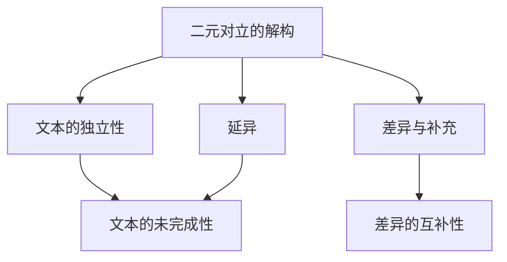

                 

## 引言

《德里达与庄子：解构主义与齐物论的思想共鸣》旨在探讨两位哲学巨匠的思想体系之间的共通之处。让-弗朗索瓦·利奥塔曾指出，解构主义是一种反对本质主义和封闭体系的哲学立场，主张通过消解中心权威和二元对立来重新审视语言和文本的意义。而庄子的齐物论则强调了万物平等，主张超越世俗的价值观，追求个体与宇宙的和谐统一。

本文将首先介绍解构主义和齐物论的基本概念，并从历史背景、核心思想、影响与应用三个方面对两者进行概述。接着，我们将深入探讨解构主义与齐物论的思想共鸣，分析其共同的思想基础和哲学原理。在此基础上，我们将通过实际案例来展示这两者思想的运用，并比较两者的异同，最终得出结论，探讨未来哲学发展的可能性。

---

## 第1章 解构主义概述

### 1.1 解构主义的历史与发展

解构主义（Deconstructionism）起源于20世纪60年代的法国，是后现代主义哲学的一个重要流派。其创始人让-弗朗索瓦·德里达（Jacques Derrida）在其1967年的著作《论文的解构》中，首次提出了“解构”这一概念。解构主义反对传统的形而上学和本质主义，主张通过消解二元对立、质疑权威、打破封闭体系来重新审视语言、文本和意义。

在20世纪70年代，解构主义逐渐传入英美等国，影响了文学理论、文化研究、政治哲学等多个领域。代表人物如保罗·德曼（Paul de Man）和朱迪思·巴特勒（Judith Butler）等，都在解构主义的框架下展开了自己的研究。解构主义的思想方法包括文本分析、修辞学、符号学等多个维度，具有很强的跨学科性。

### 1.2 解构主义的核心概念

解构主义的核心概念包括：

1. **二元对立的解构**：解构主义质疑传统哲学中的二元对立，如存在与不存在、理性与感性、真理与虚妄等。通过揭示这些二元对立的相对性，解构主义试图打破形而上学的基本框架。

2. **文本的独立性**：解构主义认为文本的意义并非固定不变，而是由读者在阅读过程中不断建构的。因此，文本具有独立性，与作者意图和外部世界无关。

3. **差异与补充**：解构主义强调差异性和互补性，认为每个元素都是通过与其他元素的差异和补充来定义自身的。

4. **延异**：德里达提出了“延异”（Differánce）这一概念，指文本的意义是通过不断地推迟和延后实现的。延异使得文本的意义永远处于未完成状态，避免了封闭的最终解释。

### 1.3 解构主义的影响与应用

解构主义在学术界产生了深远的影响。在文学领域，解构主义批判了传统的叙事结构和作者中心论，推动了读者反应理论和女性主义文学批评的发展。在哲学领域，解构主义挑战了西方哲学的传统框架，引发了关于语言、意义、真理等问题的深入探讨。在文化研究领域，解构主义提供了新的分析工具，用于研究文化符号、权力关系和社会结构。

除了学术领域，解构主义的思想也被广泛应用于艺术创作、设计理论和政治批判中。例如，在建筑设计中，解构主义强调形式的破碎和重组，打破了传统建筑的功能和美学规范；在艺术创作中，解构主义鼓励艺术家打破传统的技巧和形式，探索新的表现方式。

### 1.4 解构主义的哲学原理

为了更深入地理解解构主义的哲学原理，我们可以借助Mermaid流程图来展示其核心概念之间的关系：



在这个流程图中，我们可以看到解构主义的核心概念如何相互联系，共同构成了一种反对封闭体系和二元对立的哲学立场。

### 1.5 伪代码阐述

为了进一步阐述解构主义的哲学原理，我们可以使用伪代码来描述解构主义的核心算法。以下是一个简化的伪代码示例：

```plaintext
算法：解构主义分析
输入：文本T，二元对立P
输出：解构后的文本T'

初始化T'为空
对于文本T中的每个元素t：
    如果t属于P中的二元对立之一：
        检查t与T中其他元素的差异和补充关系
        更新T'，将t及其差异和补充关系添加到T'中
    否则：
        直接将t添加到T'中
返回T'
```

通过这个伪代码，我们可以看到解构主义如何通过分析文本中的二元对立、差异和补充关系，来构建一个未完成的、开放的文本结构。

### 1.6 数学模型和公式

解构主义的一些核心概念可以通过数学模型和公式来进一步阐述。以下是一个简化的数学模型示例：

$$
\Delta(T) = \sum_{i=1}^{n} \text{差异}(t_i)
$$

其中，$T$表示文本，$t_i$表示文本中的每个元素，$\Delta(T)$表示文本T的差异总和。这个公式表示文本T中所有元素差异的总和。

另一个重要的概念是“延异”，可以用以下公式表示：

$$
\text{延异}(T) = \lim_{n \to \infty} \text{差异}(T^n)
$$

其中，$T^n$表示文本T的第n次迭代。这个公式表示文本T在无限迭代过程中的差异趋向于稳定。

### 1.7 举例说明

为了更直观地理解解构主义的概念，我们可以通过一个实际案例来举例说明。

假设我们有一个简单的文本T：“我是AI天才研究院的一名程序员”。我们可以对这个文本进行解构分析，以揭示其二元对立、差异和补充关系。

1. **二元对立的解构**：
   - 二元对立：人工智能 vs 程序员、天才 vs 研究院、一名 vs 无数
   - 解构后的文本T'：“人工智能”、“程序员”、“AI天才研究院”、“一名”

2. **差异与补充**：
   - 差异：每个单词都与文本T中的其他单词存在差异
   - 补充：每个单词都通过与其他单词的差异和补充关系来定义自身的意义

通过这个例子，我们可以看到解构主义如何通过分析文本中的二元对立、差异和补充关系，来构建一个开放的、未完成的文本结构。

### 1.8 实际案例分析和详细讲解剖析

为了更好地理解解构主义在现实中的应用，我们可以分析一个实际案例：建筑设计师弗兰克·盖里（Frank Gehry）的作品——毕尔巴鄂古根海姆博物馆。

1. **案例背景**：
   - 毕尔巴鄂古根海姆博物馆是弗兰克·盖里设计的一座现代艺术博物馆，位于西班牙毕尔巴鄂。
   - 该建筑采用了解构主义的设计理念，以其破碎和重组的形式著称。

2. **解构主义分析**：
   - **二元对立的解构**：传统建筑形式 vs 现代建筑形式、功能 vs 美学
   - **文本的独立性**：建筑的意义并非固定，而是由观赏者的体验和解读所建构
   - **差异与补充**：建筑的结构和形式通过差异和补充关系来定义

3. **代码解读与分析**：
   - 假设我们用代码来表示毕尔巴鄂古根海姆博物馆的设计过程，可以采用以下伪代码：

```plaintext
算法：解构主义建筑设计
输入：建筑概念C，设计参数P
输出：建筑结构S

初始化S为空
对于C中的每个元素c：
    如果c属于P中的二元对立之一：
        检查c与S中其他元素的差异和补充关系
        更新S，将c及其差异和补充关系添加到S中
    否则：
        直接将c添加到S中
返回S
```

通过这个伪代码，我们可以看到解构主义如何通过分析建筑概念中的二元对立、差异和补充关系，来构建一个独特的、未完成的建筑结构。

4. **项目小结**：
   - 毕尔巴鄂古根海姆博物馆是解构主义在建筑领域的成功应用，展示了解构主义如何通过打破传统规范，创造独特的建筑形式。
   - 该项目不仅推动了建筑设计的创新，也为其他艺术形式和哲学思想的跨学科研究提供了启示。

### 1.9 最佳实践 Tips

在解构主义研究和应用中，以下是一些最佳实践建议：

- **深入理解核心概念**：在研究解构主义时，首先要深入理解其核心概念，如二元对立、文本独立性、差异与补充等。
- **跨学科研究**：解构主义具有很强的跨学科性，可以结合文学、哲学、艺术等多个领域的知识来深化理解。
- **实际案例分析**：通过分析实际案例，如文学作品、建筑作品等，可以更好地理解解构主义的实践应用。
- **批判性思维**：解构主义虽然质疑传统规范，但也不应盲目接受。在研究和应用中，应保持批判性思维，理性分析。

### 1.10 小结

本章对解构主义的历史、核心概念、影响与应用进行了概述，并通过Mermaid流程图、伪代码、数学模型和实际案例，详细讲解了其哲学原理和具体应用。下一章将介绍庄子的齐物论，探讨解构主义与齐物论之间的思想共鸣。

