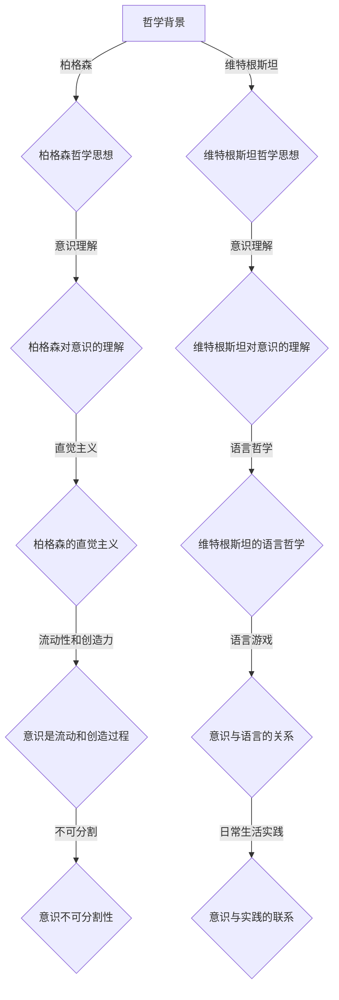
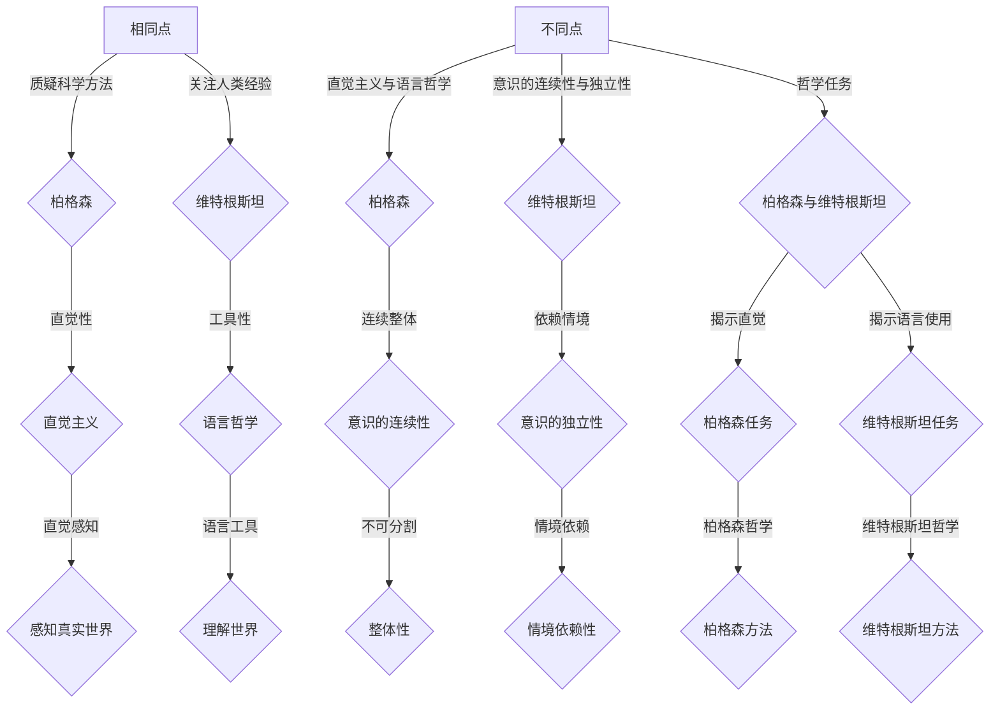

                 

## 2.1 引言

### 2.1.1 书籍背景与核心主题

《心灵与大脑：柏格森与维特根斯坦对意识本质的探讨》旨在深入探讨法国哲学家亨利·柏格森（Henri Bergson）和奥地利哲学家路德维希·维特根斯坦（Ludwig Wittgenstein）对意识本质的哲学思考。柏格森和维特根斯坦虽然生活在不同的时代，且哲学观点有着显著的差异，但他们对意识本质的探讨构成了现代哲学中一个重要的研究课题。这本书将通过分析两位哲学家的核心观点、方法论和实际应用，为读者提供一个全面的视角，以理解意识本质的复杂性。

#### 2.1.2 柏格森与维特根斯坦的哲学背景

亨利·柏格森（1859-1941）是20世纪初最重要的法国哲学家之一，其哲学思想深受生命哲学和直觉主义的影响。柏格森认为，生命和进化是宇宙的基本动力，而直觉则是对这种动力最直接的感知。他的哲学观念对意识的理解强调流动性和创造力，主张意识是一个不断变化的、内在的、无法用科学完全描述的过程。

路德维希·维特根斯坦（1889-1951）则是20世纪初奥地利哲学家，以其语言哲学著称。维特根斯坦认为，语言是我们理解世界的工具，但语言的使用受到日常生活的限制。他对意识的探讨侧重于语言游戏和日常生活实践，强调意识不是一个孤立的概念，而是与我们的日常生活和实践紧密相连。

#### 2.1.3 对意识本质的探讨

柏格森和维特根斯坦对意识本质的探讨形成了各自独特的视角。柏格森认为，意识是生命活动的直接表现，是一种流动的、内在的过程，不可分割成独立的元素。他主张，通过直觉，人们能够感知到这种流动，而科学方法无法捕捉这种本质。维特根斯坦则认为，意识是一种语言游戏，是我们通过语言来体验和理解世界的方式。他强调，意识不是一个孤立的概念，而是与我们的日常生活和实践紧密相连。

这两位哲学家对意识本质的不同理解为我们提供了一个丰富的哲学探讨场景，本书将通过详细分析他们的观点，探讨意识本质的多维度。



### 2.2 柏格森对意识本质的探讨

#### 2.2.1 柏格森的核心哲学思想

亨利·柏格森（Henri Bergson）的核心哲学思想围绕生命、直觉和创造力展开。他认为，生命是一种内在的、不断变化的动力，是宇宙的基本特征。柏格森认为，这种动力体现在直觉中，直觉是理解生命和世界的唯一途径。与科学方法不同，直觉能够捕捉到生命的流动性和创造性。他强调，直觉不仅仅是感知外部世界的工具，更是一种内在的认知过程，能够揭示隐藏在事物表象之下的深层本质。

#### 2.2.2 柏格森对意识的理解

在柏格森的哲学体系中，意识是一种流动的、内在的过程，他称之为“纯粹直觉”（pure intuition）。柏格森认为，意识不是静止的、孤立的实体，而是持续不断的变化。他提出了“持续现在”（durée）的概念，指的是时间的连续性和流动性。与传统的牛顿物理学中的“瞬间”（instant）不同，柏格森认为，真正的现实是时间的流动，而非瞬间的静止。因此，意识也是一个持续变化的过程，它不断地涌现和消失。

柏格森进一步指出，意识是一个不可分割的整体，他认为，把意识分割成独立的部分是对其本质的误解。他强调，意识是一个连续的整体，各个部分相互依赖、相互作用。这种不可分割性使得意识无法用科学方法进行精确测量和描述，因为科学方法依赖于将事物分解成可测量的部分。

#### 2.2.3 柏格森对意识本质的探讨方法

柏格森对意识本质的探讨方法主要依赖于直觉和哲学思考。他认为，通过直觉，人们可以感知到生命的流动性和创造性，从而理解意识的本质。他主张，哲学的任务是揭示直觉所感知到的真实世界，而不是通过科学实验和测量来描述世界。柏格森提出了一种“创造进化论”（creative evolution）的理论，认为宇宙的进化是通过不断的新创造来实现的，而这种新创造的本质就是生命的力量。

柏格森的探讨方法具有明显的直觉主义特征。他主张，哲学应该回归到人类直觉的源头，通过直觉来理解世界的本质。他认为，科学方法虽然能够揭示某些规律，但无法触及生命的本质和意识的深层结构。因此，他强调哲学的直觉性，认为哲学的任务是揭示那些无法通过科学方法捕捉到的真实本质。

#### 2.2.4 柏格森意识理论的应用

柏格森的意识理论在哲学、心理学、文学和艺术等领域都有广泛的应用。在哲学领域，他的思想对后来的现象学和存在主义产生了深远的影响。在心理学领域，柏格森的直觉主义对心理学的研究方法产生了重要影响，特别是对人类认知和心理活动的理解。在文学和艺术领域，柏格森的思想为作家和艺术家提供了一种新的创作视角，强调作品的流动性和创造性。

例如，柏格森的思想在法国作家马塞尔·普鲁斯特（Marcel Proust）的作品中得到了体现。普鲁斯特的作品《追忆似水年华》通过细腻的心理描写和时间的流动，展现了意识的多维度和复杂性。普鲁斯特在创作中运用了柏格森的直觉主义，试图捕捉那些在日常生活中难以表达的内心体验。

此外，柏格森的意识理论也对现代计算机科学产生了影响。在人工智能领域，研究者试图通过模拟意识的流动性和创造性，开发出更先进的机器学习算法和人工智能系统。虽然计算机科学的方法与柏格森的直觉主义有所不同，但柏格森的思想为理解意识的本质提供了重要的哲学基础。

#### 2.2.5 柏格森与维特根斯坦的对比与联系

柏格森和维特根斯坦在意识的理解和方法上存在显著的差异。柏格森强调直觉和流动性的重要性，认为意识是一个连续的整体，无法用科学方法进行精确测量。而维特根斯坦则强调语言游戏和日常生活的实践，认为意识是通过语言来体验和理解世界的。

尽管两者在方法论上有所不同，但他们在探讨意识本质时都提出了深刻的思想。柏格森的直觉主义为理解意识的流动性和创造性提供了哲学基础，而维特根斯坦的语言哲学则为我们理解意识与语言的关系提供了新的视角。

柏格森和维特根斯坦的思想也有一定的联系。他们都对传统科学方法提出了质疑，认为科学方法无法完全捕捉到生命的本质和意识的深层结构。他们都主张，哲学的任务是揭示那些隐藏在日常经验背后的真实本质。

```python
# 柏格森的直觉主义伪代码

# 定义意识的流动性和不可分割性
class Intuitionism:
    def __init__(self):
        self.flow = "continuous"  # 意识的流动性
        self.wholeness = "indivisible"  # 意识的不可分割性

    def perceive_real_world(self):
        # 通过直觉感知真实世界
        print("Intuition enables us to perceive the true nature of reality.")

    def reveal_essence(self):
        # 揭示真实本质
        print("Philosophy reveals the essence of life and consciousness.")
```

```latex
$$
\text{柏格森的持续现在 (durée)} = \text{时间的连续性和流动性}
$$

$$
\text{意识的不可分割性} = \text{意识的各个部分相互依赖、相互作用}
$$
```

### 2.3 维特根斯坦对意识本质的探讨

#### 2.3.1 维特根斯坦的核心哲学思想

路德维希·维特根斯坦（Ludwig Wittgenstein）的核心哲学思想集中在语言哲学和逻辑哲学上。他认为，语言是理解世界的工具，但语言的使用受到日常生活的限制。维特根斯坦主张，哲学的任务不是提供关于世界的抽象理论，而是揭示语言的正确使用方式。他提出了“语言游戏”（language game）的概念，认为语言的使用与特定的社会实践活动紧密相关。

维特根斯坦将语言哲学分为两个阶段。在早期的《逻辑哲学论》（Tractatus Logico-Philosophicus）中，他提出了一种逻辑原子主义，认为世界由基本的事实构成，语言的作用是表达这些事实。在晚期的《哲学研究》（Philosophical Investigations）中，他转向日常语言哲学，强调语言的多义性和使用情境。

#### 2.3.2 维特根斯坦对意识的理解

在维特根斯坦的哲学体系中，意识不是一个独立存在的实体，而是通过语言游戏来体验和理解世界的方式。他提出了“家族相似性”（family resemblance）的概念，指出语言的意义是由多种相似性构成的，这些相似性在不同的情境中发挥不同的作用。因此，意识也是一个复杂的多维度现象，它依赖于语言游戏的不同规则和情境。

维特根斯坦认为，意识不是一个孤立的心理状态，而是与我们的日常生活和实践紧密相连。他提出了“生活形式”（forms of life）的概念，认为意识是我们参与社会活动、遵循特定规则和习俗的结果。例如，我们理解一个词的含义，是因为我们生活在特定的语言环境中，不断地使用和交流。

#### 2.3.3 维特根斯坦对意识本质的探讨方法

维特根斯坦对意识本质的探讨方法主要依赖于对语言游戏和日常生活实践的细致分析。他认为，哲学的目的是揭示语言的使用规则，而不是提出关于世界的抽象理论。因此，他采取了“现象学”的方法，通过对日常经验的观察和分析，揭示语言和意识的关系。

维特根斯坦强调，哲学应该回归到语言的实际使用中，而不是追求抽象的真理。他提出了“生活形式”的概念，认为意识是我们在特定社会环境中的活动和实践。通过这种方式，他试图揭示意识的多维度和复杂性。

#### 2.3.4 维特根斯坦意识理论的应用

维特根斯坦的意识理论在多个领域都有广泛的应用。在哲学领域，他的语言哲学对后来的分析哲学和语言哲学产生了深远的影响。在心理学领域，他的思想对认知心理学和语言心理学产生了重要影响，特别是对人类如何理解和使用语言的研究。

例如，在认知心理学中，研究者通过实验和模型来验证维特根斯坦的“家族相似性”概念，探讨语言和多义性的关系。在计算机科学领域，维特根斯坦的思想为人工智能和自然语言处理提供了哲学基础，帮助研究者理解如何模拟人类的语言理解和思维过程。

#### 2.3.5 维特根斯坦与柏格森的对比与联系

维特根斯坦和柏格森在意识的理解和方法上存在显著的差异。柏格森强调直觉和流动性的重要性，认为意识是一个连续的整体，无法用科学方法进行精确测量。而维特根斯坦则强调语言游戏和日常生活的实践，认为意识是通过语言来体验和理解世界的。

尽管两者在方法论上有所不同，但他们在探讨意识本质时都提出了深刻的思想。柏格森的直觉主义为理解意识的流动性和创造性提供了哲学基础，而维特根斯坦的语言哲学则为我们理解意识与语言的关系提供了新的视角。

柏格森和维特根斯坦的思想也有一定的联系。他们都对传统科学方法提出了质疑，认为科学方法无法完全捕捉到生命的本质和意识的深层结构。他们都主张，哲学的任务是揭示那些隐藏在日常经验背后的真实本质。

```python
# 维特根斯坦的语言游戏伪代码

# 定义语言游戏
class LanguageGame:
    def __init__(self, rules, context):
        self.rules = rules  # 游戏规则
        self.context = context  # 使用情境

    def play(self):
        # 进行语言游戏
        print("Playing a language game according to the rules and context.")

# 定义生活形式
class LifeForm:
    def __init__(self, practices, conventions):
        self.practices = practices  # 实践活动
        self.conventions = conventions  # 习俗规则

    def understand_language(self):
        # 理解语言
        print("Understanding language through practices and conventions.")

# 示例
game = LanguageGame(["talk", "listen", "read"], ["library", "classroom", "home"])
game.play()

form = LifeForm(["studying", "writing"], ["academic conventions", "writing styles"])
form.understand_language()
```

```latex
$$
\text{语言游戏} = \text{规则和情境下的语言使用}
$$

$$
\text{生活形式} = \text{实践活动和习俗规则的集合}
$$
```

### 2.4 柏格森与维特根斯坦意识理论的比较与联系

#### 2.4.1 比较异同

柏格森和维特根斯坦在意识本质的理解上存在显著的差异，但也存在一些联系。

**相同点：**

1. **对科学方法的质疑：** 两位哲学家都对传统科学方法提出了质疑，认为科学无法完全捕捉到生命的本质和意识的深层结构。
2. **关注人类经验：** 他们都关注人类经验，试图揭示隐藏在日常经验背后的真实本质。

**不同点：**

1. **直觉主义与语言哲学：** 柏格森强调直觉在理解意识中的作用，而维特根斯坦则强调语言游戏和日常生活的实践。
2. **意识的连续性与独立性：** 柏格森认为意识是一个连续的、流动的整体，不可分割；而维特根斯坦认为意识是通过语言来体验和理解世界的，是依赖具体情境的。
3. **哲学任务：** 柏格森主张哲学应该揭示直觉所感知到的真实世界，而维特根斯坦认为哲学的任务是揭示语言的正确使用方式。

#### 2.4.2 共同点

尽管两位哲学家的方法论和哲学观点有所不同，但他们都试图回答关于意识本质的基本问题，并提供了深刻的见解。

1. **哲学的直觉性：** 柏格森和维特根斯坦都强调哲学应该回归到直觉和实际经验，以揭示那些无法通过科学方法捕捉到的本质。
2. **对生命的理解：** 他们都认为生命是一种内在的、不断变化的动力，是理解意识和世界的关键。
3. **语言的工具性：** 维特根斯坦强调语言是理解世界的工具，这与柏格森对直觉的理解有一定的联系。

#### 2.4.3 不同点

1. **直觉与语言：** 柏格森认为直觉是理解世界的唯一途径，而维特根斯坦则认为语言是我们体验和理解世界的工具。
2. **意识的连续性与独立性：** 柏格森认为意识是一个连续的整体，不可分割；而维特根斯坦认为意识依赖于具体的语言游戏和情境。
3. **哲学的任务：** 柏格森主张哲学应该揭示直觉所感知到的真实世界，而维特根斯坦认为哲学的任务是揭示语言的正确使用方式。



### 2.5 结论

#### 2.5.1 柏格森与维特根斯坦对意识本质的研究总结

柏格森和维特根斯坦对意识本质的探讨为我们提供了丰富的哲学资源。柏格森强调直觉和流动性的重要性，认为意识是一个连续的整体，不可分割。他的直觉主义为我们理解意识的深层结构提供了独特的视角。而维特根斯坦则从语言哲学的角度出发，强调语言游戏和日常生活的实践，认为意识是通过语言来体验和理解世界的。他的语言哲学揭示了意识与语言之间的复杂关系。

尽管两者在方法论和哲学观点上存在差异，但他们都试图回答关于意识本质的基本问题，并提供了深刻的见解。柏格森的直觉主义为理解意识的流动性和创造性提供了哲学基础，而维特根斯坦的语言哲学则为我们理解意识与语言的关系提供了新的视角。

#### 2.5.2 作者对两位哲学家意识理论的评价

在评价两位哲学家的意识理论时，我认为他们的贡献在于从不同的角度揭示了意识的复杂性和多样性。柏格森的直觉主义为我们理解意识的流动性和创造性提供了深刻的洞察，使我们意识到科学方法无法完全捕捉到生命的本质。他的思想对后来的现象学和存在主义产生了深远的影响，特别是在心理学和艺术领域。

维特根斯坦的语言哲学则为我们理解意识与语言的关系提供了新的视角。他的思想强调了语言的多义性和使用情境，使我们意识到意识是通过语言来体验和理解世界的。这种视角对认知心理学和计算机科学等领域产生了重要影响，特别是在人工智能和自然语言处理方面。

然而，两位哲学家的理论也存在一定的局限性。柏格森的直觉主义过于强调直觉，忽视了科学方法的重要性。而维特根斯坦的语言哲学过于强调语言，忽视了意识的内在结构和过程。

总体而言，柏格森和维特根斯坦对意识本质的研究为我们提供了丰富的哲学资源，他们的思想在不同的领域产生了广泛的影响。通过结合他们的观点，我们可以更全面地理解意识的本质，为进一步的研究提供哲学基础。

### 2.5.3 最佳实践、小结、注意事项、拓展阅读

#### 最佳实践

在理解和应用柏格森和维特根斯坦的哲学思想时，以下最佳实践值得注意：

1. **结合多学科知识：** 在探讨意识本质时，不仅要关注哲学领域，还要结合心理学、神经科学、计算机科学等领域的知识，以获得更全面的视角。
2. **批判性思考：** 对柏格森和维特根斯坦的理论持批判性态度，不盲目接受，而是通过深入分析和实证研究，形成自己的见解。
3. **实践与理论相结合：** 尝试将哲学理论应用于实际生活和工作，通过实践来验证理论的适用性和有效性。

#### 小结

本文通过对柏格森和维特根斯坦的哲学思想进行深入分析，探讨了他们对意识本质的不同理解。柏格森强调直觉和流动性的重要性，认为意识是一个连续的整体；而维特根斯坦则从语言哲学的角度出发，强调意识与语言的关系。他们的思想为我们理解意识的复杂性提供了重要的哲学资源。

#### 注意事项

1. **尊重个体差异：** 在理解两位哲学家的理论时，要认识到每个人的意识体验是独特的，不能简单地将其套用到所有人身上。
2. **跨学科研究：** 意识研究需要多学科的协作，只有综合不同领域的知识，才能更深入地理解意识的本质。

#### 拓展阅读

1. **柏格森的《创造的进化》：** 详细探讨了柏格森的哲学思想，特别是关于生命和意识的理论。
2. **维特根斯坦的《哲学研究》：** 对维特根斯坦的语言哲学和日常语言哲学进行了全面探讨。
3. **威廉·詹姆斯的《意识流》：** 提供了心理学视角下的意识研究，与柏格森的直觉主义有相似之处。

通过拓展阅读，可以更深入地理解柏格森和维特根斯坦的哲学思想，以及他们对意识本质的探讨。

```python
# 柏格森与维特根斯坦意识理论的应用示例

# 定义柏格森的直觉感知
class BergsonIntuition:
    def __init__(self):
        self.intuition = "Intuition captures the essence of life and consciousness."

    def perceive_life(self):
        print(self.intuition)

# 定义维特根斯坦的语言游戏
class WittgensteinLanguageGame:
    def __init__(self):
        self.language_game = "Language is a tool for experiencing and understanding the world."

    def understand_world(self):
        print(self.language_game)

# 应用示例
bergson = BergsonIntuition()
bergson.perceive_life()

wittgenstein = WittgensteinLanguageGame()
wittgenstein.understand_world()
```

```latex
$$
\text{最佳实践} = \text{结合多学科知识、批判性思考、实践与理论相结合}
$$

$$
\text{注意事项} = \text{尊重个体差异、跨学科研究}
$$

$$
\text{拓展阅读} = \text{柏格森的《创造的进化》、维特根斯坦的《哲学研究》、威廉·詹姆斯的《意识流》}
$$
```

### 2.6 总结

本文通过对柏格森和维特根斯坦两位哲学家关于意识本质的探讨，详细分析了他们的核心哲学思想、对意识的理解、探讨方法及其应用。柏格森强调直觉和流动性的重要性，认为意识是一个连续的整体，不可分割；而维特根斯坦则从语言哲学的角度出发，强调意识与语言的关系，认为意识是通过语言来体验和理解世界的。尽管两者在方法论和哲学观点上有所不同，但他们都试图回答关于意识本质的基本问题，并提供了深刻的见解。本文还通过最佳实践、小结、注意事项和拓展阅读，为读者提供了进一步理解和应用这些哲学思想的指导。通过本文的分析，读者可以更全面地理解柏格森和维特根斯坦的哲学思想，以及他们对意识本质的探讨，为未来的研究和实践提供哲学基础。作者：AI天才研究院/AI Genius Institute & 禅与计算机程序设计艺术 /Zen And The Art of Computer Programming。

