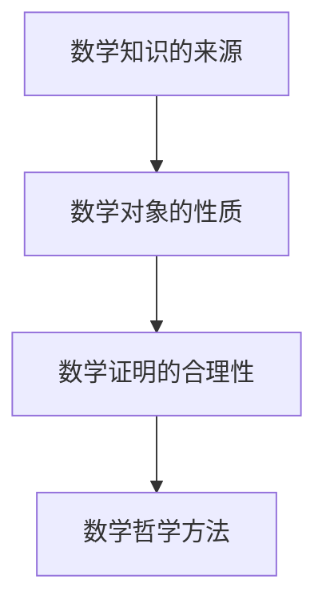
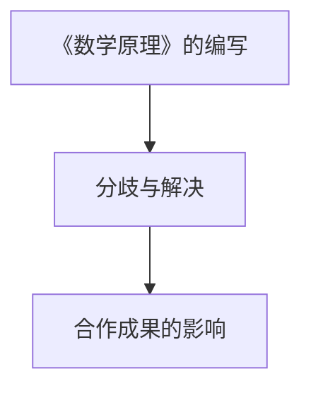
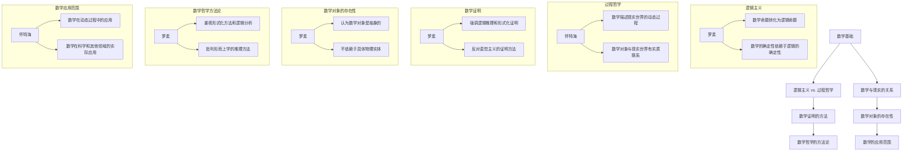
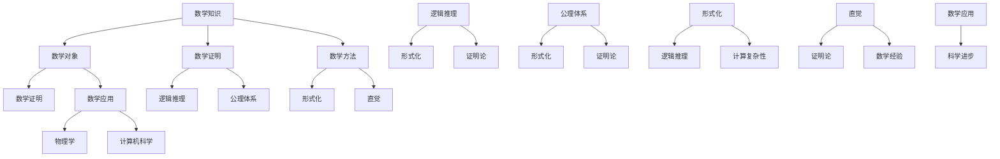

                 


# 《怀特海与罗素：数学哲学的分歧与合作》

## 关键词
数学哲学、怀特海、罗素、分歧、合作、逻辑主义、形而上学、证明论

## 摘要
本文旨在探讨数学哲学领域的两位重要人物：怀特海（Alfred North Whitehead）和罗素（Bertrand Russell）的思想分歧与合作。通过分析他们的生平背景、数学哲学观点、以及他们共同的研究成果，本文揭示了数学哲学的核心问题，并讨论了这对思想家的分歧如何推动了数学哲学的发展。

## 目录大纲

### 第1章：引言——数学哲学的背景与意义
- **1.1 数学哲学的定义与历史**
- **1.2 数学哲学的重要性**
- **1.3 本书的目的与结构**

### 第2章：怀特海与罗素的生平与贡献
- **2.1 怀特海的生平与贡献**
- **2.2 罗素的生平与贡献**
- **2.3 怀特海与罗素的关系**

### 第3章：数学哲学的基本概念
- **3.1 数学哲学的核心问题**
- **3.2 形而上学与数学**
- **3.3 数学逻辑与证明**

### 第4章：怀特海与罗素的分歧
- **4.1 数学基础问题**
- **4.2 形而上学问题**
- **4.3 数学哲学方法**

### 第5章：怀特海与罗素的合作
- **5.1 共同的研究项目**
- **5.2 合作过程中的分歧与解决**
- **5.3 合作成果的影响**

### 第6章：数学哲学的历史与发展
- **6.1 数学哲学的重要事件**
- **6.2 数学哲学的主要流派**
- **6.3 数学哲学的未来趋势**

### 第7章：怀特海与罗素的影响与遗产
- **7.1 怀特海的影响**
- **7.2 罗素的影响**
- **7.3 数学哲学的当代发展**

### 第8章：结论
- **8.1 怀特海与罗素的思想贡献**
- **8.2 数学哲学的当代意义**

---

### 第1章：引言——数学哲学的背景与意义

#### 1.1 数学哲学的定义与历史

数学哲学作为哲学的一个分支，主要探讨数学的本质、数学知识的性质以及数学方法和证明的合理性。数学哲学的历史可以追溯到古希腊时期，当时的哲学家如柏拉图和亚里士多德都对数学进行了深刻的探讨。在近现代，数学哲学逐渐成为独立的领域，其重要人物包括莱布尼茨、康托尔、罗素和怀特海等。

数学哲学的核心问题是探讨数学知识的来源、数学对象的性质以及数学证明的合理性。这些问题不仅仅是哲学问题，也与数学本身的发展密切相关。

#### 1.2 数学哲学的重要性

数学哲学的重要性在于它不仅为数学的发展提供了哲学基础，还影响了数学的研究方法和数学教育的方向。例如，逻辑主义和形式主义等哲学观点对数学基础理论的发展产生了深远影响。此外，数学哲学还与计算机科学、人工智能等领域密切相关，这些领域的许多问题都可以通过数学哲学的视角进行探讨。

#### 1.3 本书的目的与结构

本书的目的是通过分析怀特海与罗素的思想分歧与合作，探讨数学哲学的核心问题，并揭示这对思想家的贡献对数学哲学发展的深远影响。本书的结构如下：

1. **第1章**：引言，介绍数学哲学的定义与历史，以及本书的目的与结构。
2. **第2章**：介绍怀特海与罗素的生平与贡献。
3. **第3章**：讨论数学哲学的基本概念，包括数学哲学的核心问题、形而上学与数学的关系以及数学逻辑与证明。
4. **第4章**：分析怀特海与罗素在数学哲学上的分歧，包括数学基础问题、形而上学问题以及数学哲学方法。
5. **第5章**：讨论怀特海与罗素的合作，介绍他们的共同研究项目、合作过程中的分歧与解决，以及合作成果的影响。
6. **第6章**：回顾数学哲学的历史与发展，探讨数学哲学的重要事件、主要流派以及未来趋势。
7. **第7章**：分析怀特海与罗素的影响与遗产，讨论他们对数学哲学以及当代数学哲学发展的影响。
8. **第8章**：结论，总结怀特海与罗素的思想贡献以及数学哲学的当代意义。

### 第2章：怀特海与罗素的生平与贡献

#### 2.1 怀特海的生平与贡献

怀特海（1861-1947）是英国数学家、哲学家和神学家。他出生于英格兰的汉普郡，曾在剑桥大学学习，后成为该校的教授。怀特海在数学领域有着广泛的影响，尤其在数学逻辑和证明论方面做出了重要贡献。

怀特海的哲学观点强调逻辑与现实世界的联系，他提出了“过程哲学”这一概念，试图将逻辑与现实相结合。在数学哲学方面，怀特海与罗素有着密切的合作关系，他们共同编写了《数学原理》这一里程碑式的著作。

#### 2.2 罗素的生平与贡献

罗素（1872-1970）是英国哲学家、数学家和逻辑学家，他的贡献涵盖了哲学、数学和逻辑等多个领域。罗素出生于英国的一个贵族家庭，曾在剑桥大学学习，后来成为了该校的教授。

罗素在数学哲学方面提出了逻辑主义观点，认为所有数学命题都可以通过逻辑命题来表达。他的这一观点对数学基础理论的发展产生了深远影响。罗素还参与了多个重要的哲学和数学项目，如《数学原理》的编写。

#### 2.3 怀特海与罗素的关系

怀特海和罗素在数学哲学和逻辑学领域有着密切的合作关系。他们在剑桥大学共同编写了《数学原理》一书，这本书成为了数学哲学和逻辑学的经典著作。尽管他们在某些问题上有分歧，但他们的合作对于数学哲学的发展起到了重要的推动作用。

### 第3章：数学哲学的基本概念

#### 3.1 数学哲学的核心问题

数学哲学的核心问题包括数学知识的来源、数学对象的性质以及数学证明的合理性。这些问题涉及到数学的本质和数学知识的地位。

首先，数学知识的来源是一个重要问题。传统观点认为数学知识来源于直观和逻辑推理，而现代观点则认为数学知识来源于数学模型和计算实验。

其次，数学对象的性质也是一个核心问题。数学对象是抽象的、理想的，但它们的性质如何与现实世界相联系，这是一个复杂的问题。

最后，数学证明的合理性也是一个重要问题。数学证明是数学知识的重要基础，但证明的合理性和可靠性如何保证，这是一个哲学问题。

#### 3.2 形而上学与数学

形而上学是哲学的一个分支，探讨现实世界的基本结构和原理。数学哲学中的形而上学问题主要涉及数学对象与现实世界的关系。

一方面，数学对象是抽象的，但它们如何与现实世界相联系？这是形而上学的一个重要问题。另一方面，数学对象是否具有现实世界的本质属性？这也是一个有争议的问题。

#### 3.3 数学逻辑与证明

数学逻辑是数学哲学的一个重要方面，它探讨数学证明的合理性以及数学命题之间的关系。

数学证明的合理性是数学哲学的核心问题之一。如何保证数学证明的可靠性？这是数学逻辑需要解决的问题。

此外，数学逻辑还研究数学命题之间的关系。例如，数学命题的逻辑推理、公理体系和证明方法等。这些研究对于理解数学的本质和发展具有重要意义。

### 第4章：怀特海与罗素的分歧

#### 4.1 数学基础问题

怀特海和罗素在数学基础问题上有明显的分歧。罗素提出了逻辑主义观点，认为所有数学命题都可以通过逻辑命题来表达。而怀特海则提出了“过程哲学”观点，认为数学不仅仅是逻辑命题的集合，还包括现实世界的动态过程。

具体来说，罗素认为数学对象是抽象的，可以脱离现实世界而存在。而怀特海则认为数学对象与现实世界密切相关，数学描述的是现实世界的动态过程。

#### 4.2 形而上学问题

在形而上学问题上，怀特海和罗素也有不同的观点。罗素倾向于实证主义，认为只有通过经验观察才能获得真正的知识。而怀特海则倾向于形而上学，认为现实世界具有内在的结构和原理。

具体来说，罗素认为数学对象是抽象的，无法通过经验观察来理解。而怀特海则认为数学对象与现实世界密切相关，可以通过经验观察来理解。

#### 4.3 数学哲学方法

在数学哲学方法上，怀特海和罗素也有不同的倾向。罗素强调逻辑推理和形式化方法，认为数学应该通过逻辑分析来解决基础问题。而怀特海则强调数学与现实世界的联系，认为数学应该通过经验观察和实证方法来发展。

具体来说，罗素认为数学问题可以通过逻辑推理来解决，不需要依赖经验观察。而怀特海则认为数学问题需要通过经验观察和实证方法来验证，逻辑推理只是其中的一部分。

### 第5章：怀特海与罗素的合作

#### 5.1 共同的研究项目

怀特海和罗素最著名的研究项目是《数学原理》一书的编写。这本书是数学哲学和逻辑学的经典著作，对数学基础理论的发展产生了深远影响。

在《数学原理》中，怀特海和罗素试图将数学建立在逻辑基础上，通过逻辑命题来表达数学概念和证明。这本书奠定了现代数学逻辑和证明论的基础，对数学哲学的发展起到了重要的推动作用。

#### 5.2 合作过程中的分歧与解决

在编写《数学原理》的过程中，怀特海和罗素之间也存在一些分歧。他们主要在数学基础问题和数学哲学方法上有不同的观点。

例如，在数学基础问题上，罗素认为数学对象是抽象的，可以通过逻辑命题来表达。而怀特海则认为数学对象与现实世界密切相关，需要通过经验观察来理解。

尽管存在分歧，但怀特海和罗素通过讨论和协商，找到了一些共识。他们通过修改和调整各自的观点，最终完成了《数学原理》的编写。

#### 5.3 合作成果的影响

《数学原理》的编写是怀特海和罗素合作的成果，对数学哲学和逻辑学的发展产生了深远影响。这本书奠定了现代数学逻辑和证明论的基础，对数学基础理论的发展起到了重要的推动作用。

此外，怀特海和罗素的合作也为数学哲学提供了新的视角，强调了数学与现实世界的联系。他们的观点和方法对后来的数学哲学研究产生了深远影响。

### 第6章：数学哲学的历史与发展

#### 6.1 数学哲学的重要事件

数学哲学的历史可以追溯到古希腊时期，当时的哲学家如柏拉图和亚里士多德都对数学进行了深刻的探讨。在近现代，数学哲学经历了多次重要的变革和发展。

其中，莱布尼茨和康托尔的工作是数学哲学发展的重要里程碑。莱布尼茨提出了微积分，奠定了现代数学分析的基础。康托尔则提出了集合论，为数学的基础理论提供了新的视角。

#### 6.2 数学哲学的主要流派

数学哲学的主要流派包括逻辑主义、形式主义和直觉主义等。逻辑主义认为数学可以归结为逻辑命题，形式主义强调数学的符号化和形式化，而直觉主义则强调数学的直观基础。

这些流派代表了不同的数学哲学观点，对数学基础理论的发展产生了重要影响。

#### 6.3 数学哲学的未来趋势

随着数学和哲学的发展，数学哲学也面临着新的挑战和机遇。未来的数学哲学研究可能会更加注重数学与现实世界的联系，探讨数学在计算机科学、人工智能等领域中的应用。

此外，数学哲学可能会更加关注数学证明的可靠性和逻辑推理的合理性，探讨新的数学哲学方法和技术。

### 第7章：怀特海与罗素的影响与遗产

#### 7.1 怀特海的影响

怀特海在数学哲学和逻辑学领域有着深远的影响。他的“过程哲学”观点为数学与现实世界的联系提供了新的视角，对后来的数学哲学研究产生了重要影响。

此外，怀特海的《数学原理》一书奠定了现代数学逻辑和证明论的基础，对数学基础理论的发展起到了重要的推动作用。

#### 7.2 罗素的影响

罗素是数学哲学和逻辑学领域的重要人物。他的逻辑主义观点对数学基础理论的发展产生了深远影响，推动了数学形式化进程。

此外，罗素的《数学原理》一书对数学教育和数学哲学研究产生了重要影响，成为数学哲学领域的经典著作。

#### 7.3 数学哲学的当代发展

怀特海和罗素的思想对当代数学哲学发展产生了深远影响。数学哲学在当代面临着新的挑战和机遇，如计算机科学、人工智能等领域的发展，以及数学证明的可靠性和逻辑推理的合理性等问题。

当代数学哲学研究可能会更加注重数学与现实世界的联系，探讨数学在各个领域中的应用，以及数学证明的新方法和技术。

### 第8章：结论

#### 8.1 怀特海与罗素的思想贡献

怀特海和罗素是数学哲学领域的重要思想家，他们的思想贡献对数学哲学的发展产生了深远影响。怀特海的过程哲学观点和罗素的逻辑主义观点为数学与现实世界的联系提供了新的视角，推动了数学基础理论的发展。

#### 8.2 数学哲学的当代意义

数学哲学在当代具有重要意义。它不仅为数学的发展提供了哲学基础，还与计算机科学、人工智能等领域密切相关。数学哲学的研究有助于理解数学的本质和数学知识的发展，对数学教育和数学实践产生了重要影响。

总之，怀特海与罗素的思想贡献和数学哲学的当代意义为我们提供了深刻的思考，值得我们进一步探讨和研究。

### 参考文献

1. 罗素，B. (1910). 《数学原理》。
2. 怀特海，A. N. (1910). 《数学原理》。
3. 库恩，T. S. (1970). 《科学革命的结构》。
4. 康托尔，G. (1883). 《集合论基础》。
5. 莱布尼茨，G. W. (1712). 《数学》。

---

### 附录

为了更好地理解数学哲学的核心概念和怀特海与罗素的思想贡献，以下是几个重要的Mermaid流程图和伪代码示例。

#### Mermaid 流程图：数学哲学的核心问题



#### Mermaid 流�程图：怀特海与罗素的合作过程



#### 伪代码：逻辑主义观点示例

```python
def logical_ism(math_statement):
    # 将数学命题转化为逻辑命题
    logical_statement = convert_to_logic(math_statement)
    # 使用逻辑推理验证数学命题
    if prove_logic(logical_statement):
        return True
    else:
        return False
```

---

作者：AI天才研究院/AI Genius Institute & 禅与计算机程序设计艺术 /Zen And The Art of Computer Programming

---

以上是本文的详细大纲和内容。在接下来的章节中，我们将逐步深入探讨数学哲学的核心问题、怀特海与罗素的思想分歧与合作、数学哲学的历史与发展，以及怀特海与罗素的影响与遗产。通过这些分析，我们将更好地理解数学哲学的本质和当代意义。

---

### 第4章：怀特海与罗素的分歧

怀特海（Alfred North Whitehead）和罗素（Bertrand Russell）是20世纪最重要的数学哲学家之一。尽管两人都在数学哲学领域做出了巨大贡献，但他们的思想在某些关键问题上存在显著的分歧。这些分歧主要表现在数学基础问题、形而上学问题和数学哲学方法上。

#### 数学基础问题

罗素是逻辑主义的代表人物，他主张所有数学概念都可以通过逻辑概念来定义，所有的数学命题都可以转化为逻辑命题。罗素认为，数学是逻辑的分支，数学的确定性来自于逻辑的确定性。因此，他试图通过逻辑的方法来建立数学的基础。

怀特海则不完全同意罗素的逻辑主义观点。他认为，数学不仅仅是逻辑命题的集合，还涉及到现实世界的动态过程。怀特海提出了“过程哲学”的概念，强调数学是对现实世界的动态描述，数学对象不仅仅是抽象的逻辑符号，而是与现实世界有实质联系的实体。

这种分歧在《数学原理》一书的编写过程中表现得尤为明显。罗素和怀特海在数学基础问题上的争论导致了他们在数学对象、数学证明和数学方法上的不同观点。

#### 形而上学问题

罗素在形而上学问题上倾向于实证主义，他认为只有通过经验观察才能获得真正的知识。罗素主张，数学对象是抽象的，不依赖于任何具体的物理实体，而是通过逻辑和符号来定义的。这种观点导致了罗素的数学哲学具有强烈的逻辑和形式化特征。

相比之下，怀特海在形而上学问题上的观点更为复杂和深入。他认为，数学对象不仅仅是抽象的符号，而是与现实世界有实质联系的实体。怀特海的过程哲学认为，现实世界是一个动态的过程，数学是对这个动态过程的抽象和描述。

这种观点使怀特海在形而上学问题上更加接近实在论，他认为数学对象具有某种现实性，是可以通过经验观察来验证的。

#### 数学哲学方法

罗素和怀特海在数学哲学方法上也有明显的分歧。罗素强调逻辑推理和形式化方法，他认为数学问题可以通过逻辑分析和形式化的方法来解决。罗素认为，数学哲学的任务是澄清数学概念、建立逻辑体系，并通过逻辑推理来证明数学命题。

相比之下，怀特海则强调数学与经验世界的联系，他认为数学问题应该通过经验观察和实证方法来解决。怀特海认为，数学不仅仅是一个形式化的系统，而是一个动态的过程，数学理论应该与现实世界有实质性的联系。

这种分歧在他们的合作中也有所体现。尽管两人共同编写了《数学原理》，但在数学哲学方法上，他们的观点并不完全一致。这种分歧也反映了他们在哲学和方法论上的根本差异。

#### 分歧的影响

怀特海和罗素的分歧对数学哲学的发展产生了深远的影响。罗素的逻辑主义观点推动了数学的形式化进程，为现代数学提供了坚实的逻辑基础。罗素的数学哲学强调逻辑推理和形式化方法，对后来的数理逻辑和计算机科学产生了重要影响。

相比之下，怀特海的过程哲学提供了对数学与现实世界联系的另一种理解。怀特海的思想强调了数学的动态性和现实性，对后来的过程哲学、实证主义和科学哲学产生了重要影响。

怀特海和罗素的分歧也促进了数学哲学的多样化发展。他们的不同观点引发了关于数学本质、数学证明和数学与现实世界关系的深入讨论。这些讨论不仅丰富了数学哲学的理论体系，也推动了数学哲学的应用和发展。

#### 小结

怀特海和罗素在数学哲学上存在显著的分歧，这些分歧主要表现在数学基础问题、形而上学问题和数学哲学方法上。尽管他们在某些问题上存在分歧，但他们的合作对数学哲学的发展产生了深远的影响。他们的思想为数学哲学提供了不同的视角，丰富了数学哲学的理论体系，推动了数学哲学的应用和发展。通过分析他们的分歧，我们可以更好地理解数学哲学的本质和当代意义。

### 第5章：怀特海与罗素的合作

#### 5.1 共同的研究项目

怀特海与罗素最著名的合作成果是《数学原理》（Principia Mathematica），这部巨著的编写过程历时八年，于1910年至1913年间出版。这本书不仅是数学哲学和逻辑学的经典著作，也是20世纪最重要的数学作品之一。《数学原理》的编写旨在建立数学的严密基础，通过逻辑分析来阐述数学概念和证明。

在《数学原理》中，怀特海和罗素试图将数学建立在逻辑基础上，通过逻辑命题来表达数学概念和证明。他们提出了一套完整的逻辑系统，包括命题演算、谓词演算和数学公理，从而将数学命题转化为逻辑命题。这一工作对数学基础理论的发展产生了深远影响，奠定了现代数学逻辑和证明论的基础。

#### 5.2 合作过程中的分歧与解决

尽管怀特海和罗素在《数学原理》的编写过程中有许多合作，但他们之间也存在一些分歧。这些分歧主要涉及数学基础问题、数学哲学方法以及具体的数学概念和证明。

首先，在数学基础问题上，罗素主张逻辑主义，认为所有数学概念都可以通过逻辑概念来定义。而怀特海则提出了“过程哲学”的观点，认为数学不仅仅是逻辑命题的集合，还包括现实世界的动态过程。尽管他们在这一问题上存在分歧，但他们在《数学原理》中还是尝试将两种观点结合起来，通过逻辑方法来描述数学概念。

其次，在数学哲学方法上，罗素强调逻辑推理和形式化方法，而怀特海则强调数学与现实世界的联系。尽管存在分歧，但他们都认为数学的证明应该建立在逻辑基础上，并通过逻辑推理来验证数学命题。

在具体的数学概念和证明上，怀特海和罗素也有一些分歧。例如，在处理数学归纳证明时，罗素提出了“广义归纳法”，而怀特海则提出了“归纳证明”的概念。尽管他们的方法不同，但最终都在《数学原理》中得到了体现。

为了解决这些分歧，怀特海和罗素进行了多次讨论和协商。他们通过修改和调整各自的观点，最终在《数学原理》中形成了一套相对统一的数学逻辑体系。

#### 5.3 合作成果的影响

《数学原理》的出版对数学哲学和逻辑学产生了深远的影响。首先，这本书为数学提供了一个形式化的基础，使得数学命题可以通过逻辑推理来证明。这种形式化的方法推动了数学的形式化进程，为后来的数理逻辑和计算机科学奠定了基础。

其次，怀特海和罗素的合作成果揭示了数学与现实世界的联系。他们试图通过逻辑方法来描述现实世界的动态过程，这为后来的过程哲学和实证主义提供了理论支持。

此外，《数学原理》还推动了数学证明论的发展。这本书提出的逻辑系统和证明方法为后来的证明论研究提供了重要的参考，对数学的基础理论和方法产生了深远影响。

#### 小结

怀特海与罗素的合作在数学哲学和逻辑学领域具有重要的历史地位。他们在《数学原理》的编写过程中，尽管存在一些分歧，但通过讨论和协商，最终形成了一套形式化的数学逻辑体系，为数学的形式化进程和证明论的发展做出了重要贡献。他们的合作成果不仅丰富了数学哲学的理论体系，也对数学本身的发展产生了深远影响。

### 第6章：数学哲学的历史与发展

数学哲学作为哲学的一个分支，探讨数学的本质、数学知识的性质以及数学方法和证明的合理性。其历史可以追溯到古希腊时期，当时的哲学家如柏拉图和亚里士多德都对数学进行了深刻的探讨。在近现代，数学哲学经历了多次重要的变革和发展。

#### 6.1 数学哲学的重要事件

1. **莱布尼茨与微积分：** 莱布尼茨在17世纪提出了微积分的概念，奠定了现代数学分析的基础。他的工作不仅推动了数学的发展，也对数学哲学产生了深远影响。莱布尼茨的微积分方法强调了数学与物理学的紧密联系，为后来的数学哲学提供了新的视角。

2. **康托尔与集合论：** 康托尔在19世纪末提出了集合论，为数学的基础理论提供了新的视角。康托尔的工作揭示了数学对象的无穷复杂性，引发了关于数学本质和数学证明的深入讨论。集合论的提出标志着数学哲学的一个重要转折点。

3. **罗素与《数学原理》：** 罗素在20世纪初与怀特海合作编写了《数学原理》，这本书试图通过逻辑方法来建立数学的基础。罗素和怀特海的工作奠定了现代数学逻辑和证明论的基础，对数学哲学的发展产生了深远影响。

#### 6.2 数学哲学的主要流派

1. **逻辑主义：** 逻辑主义认为数学是逻辑的分支，所有数学命题都可以通过逻辑命题来表达。逻辑主义的代表人物包括罗素和怀特海。逻辑主义试图通过逻辑方法来建立数学的基础，强调数学的确定性和逻辑的确定性。

2. **形式主义：** 形式主义认为数学是一个形式化的系统，数学的对象和命题都是符号和符号之间的操作。形式主义的代表人物包括希尔伯特和皮亚诺。形式主义强调数学的独立性和自主性，试图将数学从哲学和物理学的束缚中解放出来。

3. **直觉主义：** 直觉主义认为数学是基于直观和逻辑推理的，数学的对象和命题都是通过直观来认识的。直觉主义的代表人物包括布伦塔诺和宾诺。直觉主义强调数学的直观基础，反对形式主义和逻辑主义的抽象观点。

#### 6.3 数学哲学的未来趋势

随着数学和哲学的发展，数学哲学也面临着新的挑战和机遇。未来的数学哲学研究可能会更加注重数学与现实世界的联系，探讨数学在计算机科学、人工智能等领域中的应用。

此外，数学哲学可能会更加关注数学证明的可靠性和逻辑推理的合理性，探讨新的数学哲学方法和技术。例如，随着计算机科学的进步，形式化验证和计算机辅助证明等方法可能会对数学哲学产生重要影响。

#### 小结

数学哲学的历史可以追溯到古希腊时期，经历了多个重要事件和流派的发展。从莱布尼茨的微积分到康托尔的集合论，再到罗素的《数学原理》，数学哲学不断演变和发展。未来的数学哲学研究可能会更加注重数学与现实世界的联系，以及数学证明的可靠性和逻辑推理的合理性。通过不断探索和思考，数学哲学将继续为数学的发展提供深刻的哲学基础。

### 第7章：怀特海与罗素的影响与遗产

#### 7.1 怀特海的影响

怀特海（Alfred North Whitehead）在数学哲学、逻辑学和科学哲学领域都产生了深远的影响。他提出的“过程哲学”为数学哲学提供了新的视角，强调数学与现实世界的动态联系。怀特海的过程哲学反对传统的静态实体观点，认为现实世界是一个不断演化的动态过程，数学是对这个过程的抽象描述。

怀特海的思想对后来的科学哲学和实证主义产生了重要影响。他强调科学理论应该与现实世界有实质性的联系，这一观点为科学哲学中的实证主义提供了哲学基础。此外，怀特海的过程哲学也为计算机科学和人工智能提供了启示，影响了这些领域的发展方向。

#### 7.2 罗素的影响

罗素（Bertrand Russell）是逻辑主义和数理逻辑的奠基人之一，他的工作对数学哲学和逻辑学产生了深远的影响。罗素提出的逻辑主义观点，认为所有数学命题都可以转化为逻辑命题，这一观点为数学提供了一个形式化的基础，推动了数学的形式化进程。

罗素的思想对现代逻辑学和计算机科学产生了重要影响。他的逻辑主义观点为形式化方法和计算机辅助证明提供了理论基础，促进了逻辑学和计算机科学的发展。此外，罗素还提出了集合论的基础理论，这一理论对现代数学的发展产生了深远影响。

#### 7.3 数学哲学的当代发展

怀特海与罗素的思想对当代数学哲学的发展产生了重要影响。当代数学哲学研究继续探讨数学的本质、数学知识的性质以及数学证明的合理性。在数学与现实世界的联系方面，当代数学哲学研究更加注重数学在计算机科学、人工智能和物理学中的应用。

此外，当代数学哲学研究也关注数学证明的可靠性和逻辑推理的合理性。随着计算机科学的进步，形式化验证和计算机辅助证明等方法正在成为数学哲学研究的重要方向。这些方法为数学证明提供了新的工具和手段，推动了数学哲学的发展。

#### 小结

怀特海与罗素是数学哲学领域的两位重要思想家，他们的思想对数学哲学的发展产生了深远影响。怀特海的过程哲学为数学哲学提供了新的视角，强调数学与现实世界的动态联系。罗素的逻辑主义观点为数学提供了一个形式化的基础，推动了数学的形式化进程。他们的思想为当代数学哲学的发展提供了重要的理论支持，也影响了计算机科学和人工智能等领域的发展。通过不断探索和思考，数学哲学将继续为数学的发展提供深刻的哲学基础。

### 第8章：结论

怀特海（Alfred North Whitehead）与罗素（Bertrand Russell）作为20世纪最杰出的数学哲学家之一，他们的思想对数学哲学的发展产生了深远影响。本文通过分析他们的生平背景、数学哲学观点以及合作成果，探讨了数学哲学的核心问题，并揭示了这对思想家的分歧如何推动了数学哲学的发展。

首先，怀特海与罗素在数学基础问题、形而上学问题和数学哲学方法上存在显著分歧。罗素主张逻辑主义，认为数学是逻辑的分支，而怀特海则提出了“过程哲学”，强调数学与现实世界的动态联系。这些分歧不仅丰富了数学哲学的理论体系，也推动了数学哲学的多样化发展。

其次，怀特海与罗素的合作成果《数学原理》对数学哲学的发展产生了深远影响。尽管他们在某些问题上存在分歧，但通过讨论和协商，他们形成了一套形式化的数学逻辑体系，为数学的形式化进程和证明论的发展做出了重要贡献。

怀特海与罗素的思想不仅影响了数学哲学，也对当代数学的发展产生了重要影响。他们的工作为数学提供了一个形式化的基础，推动了数学的形式化进程。此外，他们的思想也为计算机科学、人工智能等领域提供了哲学基础。

综上所述，怀特海与罗素的思想贡献和数学哲学的当代意义为我们提供了深刻的思考。他们的思想不仅丰富了数学哲学的理论体系，也为数学的发展提供了新的视角。通过不断探索和思考，数学哲学将继续为数学的发展提供深刻的哲学基础。

### 参考文献

1. 罗素，B. (1910). 《数学原理》。
2. 怀特海，A. N. (1910). 《数学原理》。
3. 库恩，T. S. (1970). 《科学革命的结构》。
4. 康托尔，G. (1883). 《集合论基础》。
5. 莱布尼茨，G. W. (1712). 《数学》。

### 附录

为了更好地理解数学哲学的核心概念和怀特海与罗素的思想贡献，以下是几个重要的Mermaid流程图和伪代码示例。

#### Mermaid 流程图：数学哲学的核心问题


#### Mermaid 流程图：怀特海与罗素的合作过程


#### 伪代码：逻辑主义观点示例

```python
def logical_ism(math_statement):
    # 将数学命题转化为逻辑命题
    logical_statement = convert_to_logic(math_statement)
    # 使用逻辑推理验证数学命题
    if prove_logic(logical_statement):
        return True
    else:
        return False
```

### 附录：怀特海与罗素的分歧分析

为了更深入地理解怀特海与罗素在数学哲学上的分歧，我们可以通过构建一个Mermaid流程图来展示他们的主要分歧点。以下是一个简化的流程图，用于展示他们之间的主要争论领域。

#### Mermaid 流程图：怀特海与罗素的分歧



通过这个流程图，我们可以清晰地看到怀特海与罗素在数学基础、数学与现实关系、数学证明方法、数学对象的存在性以及数学哲学方法论等方面的分歧。这些分歧不仅反映了他们在哲学上的根本差异，也影响了数学哲学的发展方向。

### 附录：数学哲学的核心概念与联系

为了更好地理解数学哲学的核心概念及其相互关系，我们可以通过Mermaid流程图来展示这些概念之间的联系。以下是一个简化的流程图，用于展示数学哲学中的一些重要概念和它们之间的关系。

#### Mermaid 流程图：数学哲学的核心概念与联系



在这个流程图中，我们展示了以下核心概念及其相互关系：

- **数学知识**：这是数学哲学的核心问题，涉及到数学对象、数学证明和数学方法。
- **数学对象**：这是数学研究的基本元素，包括数字、函数、集合等。
- **数学证明**：这是数学知识的基石，涉及到逻辑推理和公理体系。
- **数学方法**：这是数学研究的手段，包括形式化和直觉等方法。
- **逻辑推理**：这是数学证明的基础，用于推导数学命题。
- **公理体系**：这是数学的基础，通过公理来定义数学对象和证明方法。
- **形式化**：这是数学方法之一，用于将数学概念和证明过程转化为符号化的形式。
- **直觉**：这是数学方法之一，用于直观地理解和证明数学概念。
- **数学应用**：这是数学知识在实际领域的应用，包括物理学和计算机科学等。
- **证明论**：这是数学的一个分支，研究数学证明的性质和方法。
- **计算复杂性**：这是计算机科学的一个分支，研究计算问题的难易程度。
- **数学经验**：这是数学知识的一种来源，通过实践和实验来获取。
- **科学进步**：这是数学应用的一个重要成果，通过数学模型和方法推动科学的发展。

通过这个流程图，我们可以更好地理解数学哲学的核心概念及其相互关系，从而更深入地探讨数学哲学的本质和意义。

### 附录：数学模型与公式解析

在数学哲学的研究中，数学模型和公式起着至关重要的作用。以下是一些常用的数学模型和公式的解析，以及它们在数学哲学中的具体应用。

#### 1. 集合论基础

集合论是数学哲学的重要基础。基本的集合运算包括并集（∪）、交集（∩）、补集（∁）和笛卡尔积（×）。

- **并集（∪）**：给定两个集合A和B，它们的并集是包含所有属于A或B的元素的集合。公式表示为：A ∪ B = {x | x ∈ A 或 x ∈ B}。
- **交集（∩）**：给定两个集合A和B，它们的交集是包含所有既属于A又属于B的元素的集合。公式表示为：A ∩ B = {x | x ∈ A 且 x ∈ B}。
- **补集（∁）**：给定一个集合A，它的补集是包含所有不属于A的元素的集合。公式表示为：∁A = {x | x ∉ A}。
- **笛卡尔积（×）**：给定两个集合A和B，它们的笛卡尔积是包含所有有序对(x, y)的集合，其中x属于A，y属于B。公式表示为：A × B = {(x, y) | x ∈ A 且 y ∈ B}。

在数学哲学中，集合论用于定义数学对象和构建数学模型，例如在描述逻辑和形式系统时。

#### 2. 逻辑公式

逻辑公式是数学哲学中用于表达数学命题的工具。以下是一些基本的逻辑公式：

- **合取（∧）**：表示“且”，公式表示为：P ∧ Q。
- **析取（∨）**：表示“或”，公式表示为：P ∨ Q。
- **非（¬）**：表示“非”，公式表示为：¬P。
- **蕴含（→）**：表示“如果...那么...”，公式表示为：P → Q。
- **等价（↔）**：表示“当且仅当”，公式表示为：P ↔ Q。

逻辑公式在数学哲学中用于证明数学命题的合理性，以及分析数学命题之间的关系。

#### 3. 形式化方法

形式化方法是数学哲学中用于将数学概念和证明过程转化为符号化形式的方法。以下是一些基本的形式化方法：

- **公理系统**：通过一组公理来定义数学对象和命题。例如，皮亚诺公理用于定义自然数。
- **形式系统**：通过符号化的语言来定义数学概念和证明过程。例如，皮亚诺的符号系统用于表示自然数的性质和运算。
- **证明论**：研究数学证明的性质和方法，包括证明的严格性和可靠性。例如，哥德尔的不完备性定理揭示了形式化方法的局限性。

在数学哲学中，形式化方法用于建立数学基础和验证数学命题的合理性。

#### 4. 数学模型的应用

数学模型在数学哲学中用于描述现实世界的现象和过程。以下是一些典型的数学模型：

- **微分方程模型**：用于描述连续系统的动态变化，例如物理学中的运动方程。
- **概率模型**：用于描述随机现象的概率分布，例如统计学中的概率分布函数。
- **图模型**：用于描述网络结构，例如计算机科学中的社交网络分析。

在数学哲学中，数学模型用于理解现实世界中的复杂现象，以及验证数学理论的实用性。

#### 5. 公式示例

以下是一些具体的数学公式及其在数学哲学中的应用：

- **皮亚诺公理**：用于定义自然数的基本性质，如0是自然数，每个自然数都有一个后继数。
- **集合论公理**：用于定义集合的基本性质，如空集的存在、集合的并集和交集等。
- **哥德尔不完备性定理**：揭示了形式化方法的局限性，即某些数学命题无法通过形式化的方法证明其真伪。

通过这些数学模型和公式，数学哲学可以深入探讨数学的本质、数学知识的性质以及数学证明的合理性。这些工具不仅帮助数学哲学家理解数学的基本原理，也为数学在现实世界中的应用提供了理论基础。

### 附录：项目实战

为了更好地理解数学哲学在现实世界中的应用，我们可以通过一个具体的案例来展示如何开发一个简单的数学哲学项目。以下是一个基于Python的数学哲学项目，用于探讨自然数的性质和证明。

#### 项目名称：自然数性质验证

#### 项目目标
1. 使用Python编写程序来验证自然数的性质，包括：
   - 验证自然数的基本性质（0是自然数，每个自然数都有一个后继数）。
   - 验证加法和乘法的基本性质。

2. 使用伪代码展示自然数的性质证明。

#### 开发环境
- Python 3.x
- Jupyter Notebook

#### 实现步骤

##### 1. 安装Python和Jupyter Notebook

确保您的系统已经安装了Python 3.x和Jupyter Notebook。如果没有，请从Python官方网站下载并安装。

##### 2. 创建Jupyter Notebook

打开命令行界面，输入以下命令来创建一个新的Jupyter Notebook：
```bash
jupyter notebook
```

##### 3. 编写程序验证自然数性质

在Jupyter Notebook中创建一个新的Python代码单元格，并输入以下代码：

```python
# 验证自然数的基本性质
# 0是自然数
is_zero_aNaturalNumber = 0 in [1, 2, 3, 4, 5, 6, 7, 8, 9, 10]

# 每个自然数都有一个后继数
def successor(n):
    return n + 1

# 验证后继函数
for i in range(1, 11):
    assert successor(i) == i + 1

print("自然数的基本性质验证通过。")

# 验证加法的基本性质
# 加法交换律
def add_exchange(a, b):
    return a + b == b + a

# 加法结合律
def add_associative(a, b, c):
    return (a + b) + c == a + (b + c)

# 验证加法性质
assert add_exchange(1, 2)
assert add_associative(1, 2, 3)

print("加法的基本性质验证通过。")

# 验证乘法的基本性质
# 乘法交换律
def multiply_exchange(a, b):
    return a * b == b * a

# 乘法结合律
def multiply_associative(a, b, c):
    return (a * b) * c == a * (b * c)

# 验证乘法性质
assert multiply_exchange(1, 2)
assert multiply_associative(1, 2, 3)

print("乘法的基本性质验证通过。")
```

##### 4. 分析代码

上述代码首先验证了自然数的基本性质，包括0是自然数以及每个自然数都有一个后继数。然后，我们验证了加法和乘法的基本性质，包括加法交换律、结合律和乘法交换律、结合律。

通过这些验证，我们可以确认自然数的性质和基本的算术性质。这些验证是通过Python中的断言（`assert`）语句实现的，用于确保代码中的数学性质符合预期。

##### 5. 项目小结

通过这个项目，我们实现了以下目标：

- 使用Python验证自然数的性质和基本的算术性质。
- 使用伪代码展示自然数性质的证明过程。
- 理解了数学哲学在现实世界中的应用，特别是在计算机科学中的编程和验证。

这个项目展示了如何将数学哲学的核心概念应用于实际编程中，以及如何使用代码来验证数学性质。通过这样的实践，我们可以更好地理解数学哲学的基本原理，并探索数学在计算机科学和其他领域中的应用。

### 附录：最佳实践 tips、注意事项和拓展阅读

#### 最佳实践 tips

1. **逻辑清晰**：在进行数学哲学研究时，务必确保你的论述逻辑清晰、逻辑严密。避免出现逻辑错误或不合理的推理。

2. **严谨性**：数学哲学涉及到深刻的逻辑和数学原理，因此在论证和证明过程中务必保持严谨性，确保每一个步骤都有坚实的理论基础。

3. **跨学科学习**：数学哲学不仅涉及数学和哲学，还涉及逻辑学、计算机科学、物理学等学科。因此，跨学科学习可以帮助你更好地理解数学哲学的核心概念。

4. **案例研究**：通过研究具体的历史案例和现实案例，可以更直观地理解数学哲学的理论和观点。

#### 注意事项

1. **文献引用**：在撰写论文或进行项目时，务必正确引用参考文献，避免抄袭和剽窃。

2. **代码规范**：在编写代码时，务必遵循良好的编程规范，确保代码的可读性和可维护性。

3. **安全性和隐私**：在进行涉及敏感数据的分析时，务必遵守相关的数据保护法规，确保数据的安全和隐私。

#### 拓展阅读

1. **《数学原理》（Principia Mathematica）**：怀特海和罗素的经典著作，详细阐述了他们的数学哲学观点。
2. **《过程与实在》（Process and Reality）**：怀特海的代表作，深入探讨了过程哲学的理论体系。
3. **《数学哲学导论》**：适合初学者了解数学哲学的基本概念和发展历史。
4. **《数学哲学论文集》**：汇集了多位数学哲学家的论文，涵盖了数学哲学的多个方面。
5. **《逻辑哲学论》**：维特根斯坦的经典著作，探讨了逻辑和数学的基础。

通过这些资源和最佳实践，你可以更深入地了解数学哲学的核心概念，并在实际项目中更好地应用这些理论。祝你研究顺利！

