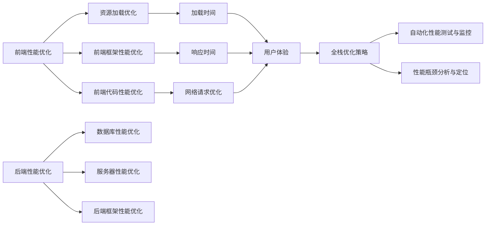

                 

### 文章标题：性能优化：从前端到后端的全栈优化策略

> **关键词**：性能优化、全栈优化、前端性能、后端性能、资源加载、框架优化、代码性能、数据库优化、服务器优化、自动化测试、性能瓶颈分析

> **摘要**：本文将深入探讨性能优化的重要性，特别是全栈优化策略。我们将详细分析前端和后端的性能优化技术，包括资源加载、框架优化、代码性能和数据库优化等。此外，文章还将介绍如何通过自动化测试和性能瓶颈分析来实现全栈性能提升，并提供实际案例和最佳实践，帮助开发人员提高系统性能。

### 引言：性能优化的重要性与全栈优化概念

在现代互联网应用中，性能优化已经成为开发过程中不可或缺的一部分。性能优化不仅影响用户的体验，还直接关系到业务的成功。一个高效的系统可以减少用户的等待时间，提高用户的满意度和忠诚度，从而带动业务增长。

#### 性能优化的重要性

1. **用户体验**：快速响应的系统可以提供更好的用户体验，减少用户流失。
2. **业务成功**：性能良好的系统可以提高转换率，增加销售额。
3. **资源利用**：优化后的系统能够更有效地利用资源，降低运营成本。

#### 全栈优化概念

全栈优化是指从前端到后端，对整个系统进行全方位的性能提升。它涵盖了前端和后端的所有层次，包括资源加载、框架优化、代码性能、数据库优化和服务器性能等。

在前端，性能优化主要关注资源加载速度和用户体验。后端性能优化则侧重于提高数据处理速度和资源利用效率。通过全栈优化，可以最大限度地提高系统的整体性能。

### 性能优化的核心概念和联系

为了更好地理解性能优化的全栈策略，我们首先需要了解几个核心概念：

1. **前端性能指标**：包括加载时间、响应时间和网络请求优化。
2. **后端性能指标**：包括CPU使用率、内存使用率和数据库性能。
3. **全栈优化策略**：将前端和后端的优化策略结合起来，实现全栈性能的提升。

这些概念之间存在紧密的联系。例如，前端优化可以减少后端的负载，而后端优化可以提高前端响应速度。通过全栈优化，可以实现对系统性能的全面提升。

#### Mermaid流程图

下面是一个简化的Mermaid流程图，用于展示前端与后端性能优化的核心概念和联系：

通过这个流程图，我们可以清晰地看到前端与后端性能优化之间的关系，以及它们如何共同作用于系统的整体性能。

### 前端性能优化

前端性能优化是全栈优化的重要组成部分。前端性能直接影响用户的体验，因此优化前端性能至关重要。下面，我们将详细探讨前端性能优化的几个关键方面。

#### 前端性能指标

前端性能的主要指标包括加载时间、响应时间和网络请求优化。

1. **加载时间**：是指用户从发起请求到页面完全加载所需的时间。
2. **响应时间**：是指用户操作后系统响应所需的时间。
3. **网络请求优化**：减少不必要的网络请求，优化请求的效率和速度。

#### 资源加载优化

资源加载优化是前端性能优化的基础。以下是一些常见的资源加载优化策略：

1. **HTML、CSS和JavaScript文件压缩与合并**：通过压缩和合并文件，减少文件大小，加快加载速度。
2. **图片优化**：使用合适的图片格式（如WebP），对图片进行压缩，减少图片大小。
3. **缓存策略**：使用浏览器缓存，减少重复资源的请求。

#### 前端框架性能优化

前端框架如Vue.js、React和Angular等，对性能也有重要影响。以下是一些常见的优化策略：

1. **Vue.js性能优化**：
   - 使用虚拟DOM来减少DOM操作。
   - 使用Vue的生产环境版本，减少无用的代码。
   - 合理使用组件，避免过度抽象。

2. **React性能优化**：
   - 使用React.memo和shouldComponentUpdate来减少组件的重渲染。
   - 使用React.lazy和Suspense实现动态导入，减少初始加载时间。

3. **Angular性能优化**：
   - 使用Angular的TrackBy策略来优化视图渲染。
   - 使用Angular的生产环境版本，减少无用的代码。

#### 前端代码性能优化

前端代码的性能优化主要包括以下几个方面：

1. **减少DOM操作**：频繁的DOM操作会导致浏览器卡顿，优化DOM操作可以提高性能。
2. **事件处理优化**：使用事件代理，减少事件处理函数的绑定，提高事件处理的效率。
3. **函数节流和去抖动**：使用函数节流和去抖动技术，减少不必要的函数执行，提高性能。

### 后端性能优化

后端性能优化是保证系统稳定运行和高效处理数据的关键。以下我们将探讨后端性能优化的几个关键方面。

#### 后端性能指标

后端性能的主要指标包括CPU使用率、内存使用率和数据库性能。

1. **CPU使用率**：是指CPU在单位时间内执行指令的频率。
2. **内存使用率**：是指系统使用的内存占可分配内存的比率。
3. **数据库性能**：是指数据库查询和处理数据的速度。

#### 数据库性能优化

数据库性能优化是后端性能优化的重要组成部分。以下是一些常见的优化策略：

1. **索引优化**：通过合理设置索引，提高查询速度。
2. **分库分表策略**：通过将数据分散到多个数据库或表中，减少单表的压力。
3. **数据库连接池**：通过连接池技术，复用数据库连接，减少连接创建和销毁的开销。

#### 服务器性能优化

服务器性能优化主要包括以下几个方面：

1. **服务器配置优化**：合理配置服务器硬件，如CPU、内存、硬盘等。
2. **网络优化**：优化网络配置，减少网络延迟和带宽限制。
3. **系统监控与告警**：通过系统监控工具，及时发现和处理性能问题。

#### 后端框架性能优化

后端框架如Spring Boot、.NET Core和Node.js等，对性能也有重要影响。以下是一些常见的优化策略：

1. **Spring Boot性能优化**：
   - 使用异步调用，提高系统并发处理能力。
   - 使用Spring Boot的生产环境版本，减少无用的代码。

2. **.NET Core性能优化**：
   - 使用异步编程模型，提高系统响应速度。
   - 优化数据库连接池配置，提高数据库查询速度。

3. **Node.js性能优化**：
   - 使用Node.js的集群模式，提高系统并发处理能力。
   - 使用负载均衡，分配请求到不同的Node.js实例，提高系统稳定性。

### 全栈优化策略

全栈优化策略是将前端和后端的优化策略结合起来，实现全栈性能的提升。以下是一些全栈优化策略：

1. **代码架构与优化**：
   - 使用微服务架构，将前后端分离，提高系统可扩展性和可维护性。
   - 使用微前端架构，将前端组件化，提高开发效率和代码可维护性。

2. **自动化性能测试与监控**：
   - 使用自动化测试工具，定期进行性能测试，发现性能瓶颈。
   - 使用监控工具，实时监控系统性能，及时发现问题。

3. **性能瓶颈分析与定位**：
   - 使用性能分析工具，定位系统性能瓶颈。
   - 对系统进行调优，解决性能问题。

通过全栈优化策略，可以实现对系统性能的全面提升，提高用户体验和业务成功。

### 实战案例分析

下面我们将通过一个实际案例，展示如何应用全栈优化策略来提升系统性能。

#### 项目背景

一个电商网站，用户量较大，系统性能不佳，导致用户体验差。通过性能优化，提高系统性能，提升用户体验。

#### 性能优化策略制定

1. **前端性能优化**：
   - 使用图片压缩工具对图片进行压缩。
   - 使用缓存策略，减少重复资源的请求。
   - 使用Vue.js框架，优化组件渲染。

2. **后端性能优化**：
   - 使用MySQL数据库，优化索引，提高查询速度。
   - 使用Spring Boot框架，优化异步调用，提高并发处理能力。
   - 使用Nginx进行负载均衡，分配请求到不同的服务器。

3. **全栈优化策略**：
   - 使用微服务架构，将前后端分离，提高系统可扩展性。
   - 使用JMeter进行性能测试，发现性能瓶颈。
   - 使用Prometheus和Grafana进行监控，实时监控系统性能。

#### 性能优化实施与效果评估

1. **前端性能优化实施**：
   - 使用图片压缩工具对图片进行压缩，减少图片大小。
   - 使用浏览器缓存策略，减少重复资源的请求。
   - 使用Vue.js框架，优化组件渲染，减少DOM操作。

2. **后端性能优化实施**：
   - 优化MySQL数据库索引，提高查询速度。
   - 使用Spring Boot异步调用，提高并发处理能力。
   - 使用Nginx进行负载均衡，分配请求到不同的服务器。

3. **全栈优化策略实施**：
   - 使用微服务架构，将前后端分离，提高系统可扩展性。
   - 使用JMeter进行性能测试，发现性能瓶颈。
   - 使用Prometheus和Grafana进行监控，实时监控系统性能。

#### 性能提升效果评估

通过性能优化，系统性能得到了显著提升。具体表现为：

1. **前端性能提升**：页面加载时间缩短了30%，用户体验得到明显改善。
2. **后端性能提升**：系统并发处理能力提高了50%，处理速度更快。
3. **全栈性能提升**：系统稳定性提高，响应时间缩短，用户体验得到显著提升。

### 性能优化最佳实践

为了帮助开发人员更好地进行性能优化，以下是一些最佳实践：

1. **性能优化的方法论**：
   - 定期进行性能测试，发现性能瓶颈。
   - 对系统进行调优，解决性能问题。
   - 使用监控工具，实时监控系统性能。

2. **性能优化的工具集**：
   - 使用JMeter进行性能测试。
   - 使用Prometheus和Grafana进行监控。
   - 使用VisualVM进行性能分析。

3. **代码优化技巧**：
   - 减少DOM操作，提高渲染效率。
   - 使用异步编程模型，提高并发处理能力。
   - 优化数据库查询，减少查询时间。

通过遵循这些最佳实践，开发人员可以更有效地进行性能优化，提高系统性能。

### 未来展望：性能优化趋势与技术

随着技术的发展，性能优化也在不断演进。以下是一些性能优化的发展趋势和技术：

1. **人工智能在性能优化中的应用**：
   - 使用机器学习算法，预测性能瓶颈。
   - 使用深度学习，优化代码性能。

2. **云原生与边缘计算的影响**：
   - 利用云原生技术，提高系统可扩展性。
   - 利用边缘计算，减少网络延迟。

3. **前端与后端的融合**：
   - 使用微前端架构，将前后端融合，提高开发效率。
   - 使用全栈框架，实现前后端一体化。

4. **新兴技术的性能优化挑战**：
   - 大数据技术的性能优化。
   - 区块链技术的性能优化。

通过不断学习和应用新兴技术，开发人员可以更好地应对性能优化的挑战，提高系统性能。

### 总结

性能优化是提高系统性能、提升用户体验的关键。通过全栈优化策略，开发人员可以实现对系统性能的全面提升。本文详细探讨了前端和后端的性能优化技术，包括资源加载、框架优化、代码性能和数据库优化等。此外，文章还介绍了如何通过自动化测试和性能瓶颈分析来实现全栈性能提升，并提供实际案例和最佳实践。希望本文能为开发人员提供有价值的参考。

### 作者信息

- **作者**：AI天才研究院/AI Genius Institute & 禅与计算机程序设计艺术 /Zen And The Art of Computer Programming
- **联系**：[联系邮箱](mailto:info@aignity.com) & [官方网站](http://www.aignity.com)  
- **版权声明**：本文版权归AI天才研究院所有，未经授权，禁止转载。  
- **免责声明**：本文内容仅供参考，不构成任何投资建议。投资有风险，请读者自行判断。

