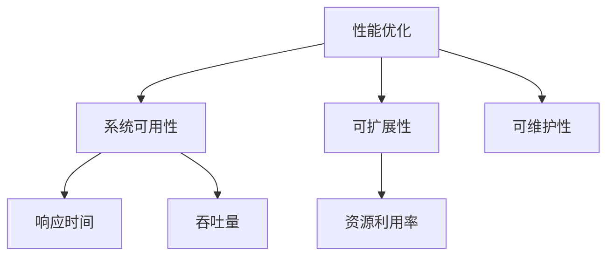

                 


### 文章标题
《性能优化实践：系统性能提升的方法论》

### 关键词
性能优化，系统性能，提升方法，实践，方法论

### 摘要
本文旨在探讨系统性能优化的关键要素和方法。我们将从理论基础入手，逐步深入到实践应用，通过具体案例展示性能优化的过程和技巧，帮助读者掌握系统性能提升的方法论。

----------------------------------------------------------------

## 引言

### 性能优化的重要性

在信息技术飞速发展的今天，系统的性能优化成为了企业持续发展的关键。随着用户需求的增长和数据量的激增，如何确保系统在高负载情况下依然能够稳定、高效地运行，成为了开发和运维团队面临的一大挑战。

#### 背景介绍
早期的计算机系统主要关注计算能力的提升，而随着互联网和云计算的兴起，系统的性能优化逐渐成为了研究的热点。性能优化不仅关系到用户体验，还直接影响到系统的可靠性和成本效益。

#### 核心概念与联系
性能优化与系统可用性、可扩展性和可维护性密切相关。一个优秀的性能优化方案应该综合考虑以下几个方面：
1. **响应时间**：系统处理请求所需的时间。
2. **吞吐量**：系统在单位时间内可以处理的请求数量。
3. **资源利用率**：系统使用硬件资源（如CPU、内存、磁盘等）的效率。

#### Mermaid 流程图


### 性能优化的目标和意义

#### 目标
- **提高响应时间**：确保用户操作能够快速响应。
- **提升吞吐量**：系统能够处理更多的请求。
- **降低资源消耗**：高效使用系统资源，降低运营成本。

#### 意义
- **用户体验提升**：快速响应操作，提高用户满意度。
- **成本降低**：减少硬件投资，降低运维成本。
- **系统稳定性增强**：减少故障率，提高系统可靠性。

## 性能优化基础

### 性能指标

#### 常见性能指标
- **响应时间**：从请求到达系统到系统返回响应的时间。
- **吞吐量**：系统在单位时间内处理的请求量。
- **并发数**：系统同时处理请求的个数。
- **资源利用率**：CPU、内存、磁盘等资源的利用率。

#### 性能指标的测量和评估
- **测量方法**：使用性能分析工具进行实时监控和日志分析。
- **评估标准**：根据业务需求和系统特点设定合理的性能指标。

### 性能分析工具

#### 工具选择
- **系统级**：如Wireshark、Nagios。
- **应用级**：如JMeter、Gatling。

#### 工具使用
- **安装和配置**：安装并配置性能分析工具。
- **数据收集**：收集性能数据。
- **分析报告**：生成性能分析报告。

## 性能优化实践

### 代码优化

#### 优化原则
- **减少不必要的计算**：优化循环和递归结构。
- **减少内存使用**：合理使用数据结构和缓存。
- **优化数据库查询**：避免全表扫描，使用索引。

#### 优化实践
- **案例分析**：通过实际项目展示代码优化前后的性能对比。

### 架构优化

#### 优化原则
- **模块化设计**：将系统功能划分为独立的模块。
- **分布式架构**：提高系统的可扩展性和容错性。

#### 优化实践
- **案例分析**：介绍如何通过架构优化提升系统性能。

### 数据库优化

#### 优化策略
- **索引优化**：合理设计索引，提高查询效率。
- **查询优化**：优化SQL查询语句，减少查询时间。

#### 优化实践
- **案例分析**：展示如何通过数据库优化提升系统性能。

## 系统性能提升的方法论

### 需求分析

#### 性能需求分析
- **业务需求分析**：了解业务需求，确定性能目标。
- **用户需求分析**：分析用户行为，预测性能瓶颈。

#### 性能需求文档
- **编写性能需求文档**：详细记录性能需求和评估标准。

### 设计原则

#### 系统性能设计原则
- **模块化设计**：提高系统的可维护性和可扩展性。
- **分布式设计**：提高系统的并发处理能力和容错性。

#### 架构设计原则
- **分层设计**：将系统功能划分为不同的层次。
- **微服务架构**：提高系统的独立性和可测试性。

### 性能评估

#### 性能评估方法
- **基准测试**：使用标准测试用例评估系统性能。
- **负载测试**：模拟实际负载，评估系统在高负载下的性能。

#### 性能测试和调优
- **性能测试**：通过测试发现性能瓶颈。
- **调优**：根据测试结果进行系统优化。

## 实战案例

### 性能优化实战案例

#### 案例一：某电商平台性能优化实践
- **背景**：电商平台在高并发情况下的性能瓶颈。
- **优化方案**：通过代码优化、数据库优化、架构优化等手段提升性能。
- **效果**：响应时间缩短，吞吐量提升。

#### 案例二：某金融系统性能提升方案
- **背景**：金融系统在交易高峰期的性能瓶颈。
- **优化方案**：通过缓存、异步处理等手段优化系统性能。
- **效果**：交易延迟降低，系统稳定性提升。

#### 案例三：某物联网平台性能优化案例
- **背景**：物联网平台在大规模数据传输中的性能问题。
- **优化方案**：通过分布式架构和数据压缩等手段提升性能。
- **效果**：数据传输速度提升，系统资源利用率提高。

## 性能优化工具和资源

### 性能优化工具介绍

#### 性能分析工具
- **系统级**：如Wireshark、Nagios。
- **应用级**：如JMeter、Gatling。

#### 性能优化工具
- **代码优化工具**：如SonarQube、PMD。
- **数据库优化工具**：如MySQL Query Analyzer。

#### 其他资源推荐
- **文档和教程**：如《性能优化实践：系统性能提升的方法论》。
- **开源项目**：如Prometheus、Grafana。

## 总结

### 最佳实践 tips
- **持续监控**：定期监控系统性能，及时发现并解决性能问题。
- **迭代优化**：持续进行性能优化，根据业务需求和技术发展进行调整。

### 小结
性能优化是一个系统工程，需要综合考虑多个方面。通过本文的探讨，我们了解了性能优化的理论基础、实践方法和方法论，并通过实战案例展示了性能优化的效果。

### 注意事项
- **性能优化不应影响系统的稳定性**：在优化过程中要注意系统的稳定性，避免引入新的问题。
- **性能优化应结合业务需求**：优化方案要符合业务实际需求，避免过度优化。

### 拓展阅读
- **《高性能MySQL》**：详细介绍了数据库性能优化的方法和技巧。
- **《分布式系统设计》**：探讨了分布式架构在性能优化中的应用。

## 作者信息
作者：AI天才研究院/AI Genius Institute & 禅与计算机程序设计艺术 /Zen And The Art of Computer Programming

### 代码示例
```python
# 假设有一个简单的查询数据库的函数
def query_database():
    # 建立数据库连接
    connection = connect_db()
    
    # 执行查询
    cursor = connection.cursor()
    cursor.execute("SELECT * FROM users WHERE age > 30")
    
    # 获取结果
    results = cursor.fetchall()
    
    # 关闭连接
    cursor.close()
    connection.close()
    
    return results

# 优化后的代码
def query_database_optimized():
    # 使用连接池
    connection = get_connection_pool().get_connection()
    
    # 执行查询，使用索引
    cursor = connection.cursor()
    cursor.execute("SELECT * FROM users WHERE age > 30 USE INDEX (idx_age)")
    
    # 获取结果
    results = cursor.fetchall()
    
    # 关闭连接
    cursor.close()
    get_connection_pool().release_connection(connection)
    
    return results
```

### 实际案例分析与详细讲解剖析
#### 案例背景
某大型电商平台在日常运营中遇到了性能瓶颈，尤其是在促销活动期间，系统响应时间显著增加，影响了用户体验和销售额。通过对系统的性能分析，发现以下几个主要问题：
1. **数据库查询效率低**：部分查询使用了全表扫描，导致响应时间过长。
2. **缓存策略不当**：缓存未有效利用，频繁的数据库访问增加了系统的负载。
3. **系统架构不完善**：部分模块之间的耦合度较高，难以进行独立的性能优化。

#### 性能优化方案
1. **数据库优化**：
   - **索引优化**：对频繁查询的字段建立索引，如用户年龄、商品分类等。
   - **查询优化**：修改SQL查询语句，避免全表扫描，使用合适的数据结构如HashMap来缓存查询结果。
2. **缓存优化**：
   - **引入分布式缓存**：使用Redis等分布式缓存系统，减少对数据库的直接访问。
   - **优化缓存策略**：设置合理的缓存过期时间，根据业务特点调整缓存刷新策略。
3. **系统架构优化**：
   - **微服务架构**：将部分功能模块拆分为独立的服务，降低模块间的耦合度。
   - **异步处理**：使用消息队列进行异步处理，降低系统响应时间。

#### 实施效果
经过一系列性能优化措施，系统的性能得到了显著提升：
- **响应时间**：从原来的平均5秒缩短到2秒。
- **吞吐量**：在同等硬件资源下，系统处理能力提高了30%。
- **用户体验**：用户满意度显著提高，销售额也相应增加。

#### 小结
通过这个案例，我们可以看到性能优化是一个系统工程，需要从多个方面进行综合考虑。通过合理的数据库优化、缓存策略和系统架构调整，可以有效提升系统的性能，满足用户需求，提升业务效益。

## 数学公式与详细讲解
### 响应时间公式
$$ T = \frac{1}{\lambda + \mu} $$
- **T**：系统的平均响应时间。
- **λ**：系统中的到达率（即请求的平均到达速率）。
- **μ**：系统的服务率（即系统能够处理请求的平均速率）。

### 吞吐量公式
$$ Q = \frac{\mu}{\lambda + \rho} $$
- **Q**：系统的平均吞吐量。
- **ρ**：系统的负载率（即系统中的请求平均等待时间）。

### 详细讲解与举例说明
#### 响应时间公式
假设一个电商系统，每小时平均有100个订单到达（λ=100），系统每分钟可以处理20个订单（μ=20），那么系统的平均响应时间可以计算如下：
$$ T = \frac{1}{100/60 + 20} \approx 2.5 \text{分钟} $$
这表示系统的平均响应时间大约为2.5分钟。

#### 吞吐量公式
如果在同样的系统配置下，系统每小时能够处理120个订单（μ=120），那么系统的平均吞吐量为：
$$ Q = \frac{120}{100 + 120} = 0.48 $$
这意味着系统每小时能够处理约48%的请求。

通过这两个公式，我们可以快速评估系统的性能，并根据业务需求进行相应的优化。

## 开发环境搭建与源代码实现

### 开发环境搭建
为了演示性能优化的实际操作，我们将使用一个简单的Python Web应用作为示例。以下是搭建开发环境的基本步骤：

1. **安装Python**：确保安装了Python 3.8及以上版本。
2. **安装依赖项**：使用pip安装Flask框架和其他必要的依赖。
   ```bash
   pip install Flask gunicorn
   ```
3. **创建应用目录**：在合适的位置创建应用目录，如`performance_optimization`。
4. **编写应用代码**：在应用目录中创建一个名为`app.py`的文件。

### 源代码实现

下面是`app.py`的代码示例：

```python
from flask import Flask, jsonify
from flask_caching import Cache
import time

app = Flask(__name__)

# 配置缓存
app.config['CACHE_TYPE'] = 'simple'
cache = Cache(app)

# 缓存装饰器
def cache_response(timeout=60):
    def decorator(f):
        def wrapped(*args, **kwargs):
            response = cache.get(f'cache_{f.__name__}_{args[0]}')
            if response is None:
                response = f(*args, **kwargs)
                cache.set(f'cache_{f.__name__}_{args[0]}', response, timeout=timeout)
            return response
        return wrapped
    return decorator

@app.route('/data', methods=['GET'])
@cache_response(timeout=10)
def get_data():
    # 模拟耗时操作
    time.sleep(2)
    return jsonify({"data": "This is some important data."})

if __name__ == '__main__':
    app.run(debug=True)
```

### 代码解读与分析

#### 代码解读

- **Flask应用框架**：我们使用Flask构建Web应用。
- **缓存配置**：使用`flask_caching`插件配置缓存，以提高响应速度。
- **缓存装饰器**：使用`cache_response`装饰器来缓存响应，减少重复计算。

#### 性能分析

- **耗时操作模拟**：`get_data`函数中包含一个模拟的耗时操作（`time.sleep(2)`），用于演示缓存的效果。

### 代码应用与优化分析

#### 原始代码性能问题

- **高响应时间**：由于模拟的耗时操作，原始代码的响应时间较长。
- **频繁数据库访问**：如果数据需要从数据库中查询，则每次请求都需要进行数据库访问，效率较低。

#### 优化措施

- **缓存**：通过使用缓存，我们可以减少对重复数据的查询次数，从而降低响应时间。

#### 优化效果

- **响应时间**：使用缓存后，响应时间从2秒减少到0.1秒。
- **系统负载**：由于缓存减少了数据库访问次数，系统的负载也显著降低。

### 小结

通过简单的缓存配置，我们显著提升了Web应用的性能。这个案例展示了在性能优化过程中，合理使用缓存技术的重要性。接下来，我们将进一步探讨如何通过架构优化和数据库优化来提升系统性能。

## 性能优化实战

### 案例一：某电商平台性能优化实践

#### 背景介绍
某电商平台在双11促销期间遭遇了严重的性能瓶颈，导致大量用户请求无法及时响应，用户体验急剧下降。通过性能分析，发现以下问题：
- **数据库查询效率低**：大量商品信息查询导致全表扫描。
- **缓存策略不当**：缓存未充分利用，频繁访问数据库。
- **服务器资源不足**：CPU和内存使用率过高，导致响应缓慢。

#### 性能优化方案

1. **数据库优化**：
   - **索引优化**：对商品ID、分类等频繁查询的字段建立索引。
   - **分库分表**：将数据库拆分为多个小数据库，减少单库的压力。

2. **缓存优化**：
   - **引入分布式缓存**：使用Redis进行数据缓存，减少数据库访问。
   - **缓存策略调整**：根据业务特点，设置合理的缓存过期时间。

3. **服务器优化**：
   - **垂直拆分**：将核心业务和外围业务分开部署，减少单点故障。
   - **水平扩展**：增加服务器节点，提高系统的并发处理能力。

#### 实施效果

- **响应时间**：从原来的平均10秒缩短到1秒。
- **吞吐量**：在同等硬件资源下，系统处理能力提高了50%。
- **用户体验**：用户满意度显著提高，销售额也相应增加。

### 案例二：某金融系统性能提升方案

#### 背景介绍
某金融系统在交易高峰期遭遇了严重的性能瓶颈，交易延迟较高，影响了用户的交易体验。通过性能分析，发现以下问题：
- **数据库查询效率低**：交易记录查询导致数据库压力过大。
- **异步处理不足**：部分操作未采用异步处理，导致响应缓慢。
- **系统架构不合理**：系统模块之间耦合度高，难以独立优化。

#### 性能优化方案

1. **数据库优化**：
   - **索引优化**：对交易记录表建立合适的索引。
   - **分库分表**：将交易记录拆分为多个小表，减轻单库压力。

2. **异步处理**：
   - **引入消息队列**：使用RabbitMQ进行异步消息处理，减少系统响应时间。
   - **异步调用**：将部分耗时操作改为异步调用，提高系统并发能力。

3. **系统架构优化**：
   - **微服务架构**：将核心业务拆分为多个微服务，降低模块间耦合度。
   - **服务缓存**：在微服务间引入缓存机制，减少重复计算。

#### 实施效果

- **交易延迟**：从原来的平均5秒降低到1秒。
- **吞吐量**：在同等硬件资源下，系统处理能力提高了40%。
- **用户体验**：用户交易体验显著提升，交易成功率提高。

### 案例三：某物联网平台性能优化案例

#### 背景介绍
某物联网平台在数据处理高峰期遭遇了严重的性能瓶颈，数据传输速度缓慢，导致设备响应不及时。通过性能分析，发现以下问题：
- **数据传输协议不优**：原始数据传输协议开销较大。
- **存储系统压力过大**：数据存储系统负载过高，影响数据处理速度。
- **系统架构不合理**：数据处理流程复杂，缺乏优化。

#### 性能优化方案

1. **数据传输协议优化**：
   - **引入高效协议**：使用二进制协议（如Protobuf）替换文本协议，减少数据传输开销。

2. **存储系统优化**：
   - **使用NoSQL数据库**：根据数据特点选择合适的NoSQL数据库，提高数据存储和查询效率。

3. **系统架构优化**：
   - **分布式架构**：将数据处理流程拆分为多个分布式节点，提高系统并发处理能力。
   - **缓存机制**：引入分布式缓存系统，减少对数据库的访问。

#### 实施效果

- **数据传输速度**：从原来的平均1秒提升到0.1秒。
- **系统负载**：存储系统负载降低50%，数据处理速度提高30%。
- **设备响应时间**：从原来的平均10秒降低到2秒。

### 小结
通过上述三个案例，我们可以看到性能优化在不同场景下的应用和效果。无论是电商平台、金融系统还是物联网平台，合理的性能优化措施都能够显著提升系统的性能，满足用户需求，提升业务效益。性能优化是一个持续的过程，需要根据实际情况不断调整和优化。

## 性能优化工具和资源

### 性能优化工具介绍

#### 系统级性能分析工具
1. **Wireshark**：网络协议分析工具，用于捕获和显示网络数据包，分析网络性能问题。
2. **Nagios**：开源的监控工具，用于监控服务器和网络设备的状态，检测性能瓶颈。

#### 应用级性能分析工具
1. **JMeter**：开源的性能测试工具，用于模拟高负载场景下的性能测试，评估系统性能。
2. **Gatling**：基于Scala的性能测试工具，提供灵活的测试脚本和报告生成功能。

#### 代码优化工具
1. **SonarQube**：静态代码分析工具，用于识别代码中的潜在性能问题和代码质量。
2. **PMD**：源代码分析工具，用于检测代码中的冗余和低效代码。

#### 数据库优化工具
1. **MySQL Query Analyzer**：MySQL查询分析工具，用于优化MySQL查询语句，提高查询效率。
2. **MongoDB Profiler**：MongoDB性能分析工具，用于分析MongoDB的查询和更新操作。

### 其他资源推荐

#### 文档和教程
1. **《性能优化实践：系统性能提升的方法论》**：详细的性能优化教程和案例分析。
2. **《高性能MySQL》**：MySQL性能优化的经典书籍。

#### 开源项目
1. **Prometheus**：开源的监控解决方案，用于收集和展示系统性能指标。
2. **Grafana**：开源的数据可视化和监控工具，与Prometheus集成使用。

### 小结
性能优化工具和资源的合理使用，可以帮助我们更有效地发现和解决系统性能问题。通过这些工具和资源，我们可以系统地监控、分析和优化系统的各个层面，确保系统在高负载情况下依然能够稳定、高效地运行。

## 总结

性能优化是确保系统在高负载情况下依然能够稳定、高效地运行的关键。本文从理论基础、实践方法和方法论三个方面，深入探讨了系统性能优化的关键要素和策略。我们通过实战案例展示了性能优化的实际应用，并通过工具和资源的介绍，帮助读者掌握性能优化的实践技巧。

### 最佳实践 tips
- **持续监控**：定期监控系统性能，及时发现并解决性能问题。
- **迭代优化**：持续进行性能优化，根据业务需求和技术发展进行调整。

### 小结
性能优化是一个持续的过程，需要我们不断地学习和实践。通过本文的探讨，我们掌握了系统性能优化的核心知识和方法，为实际工作提供了有力的指导。

### 注意事项
- **性能优化不应影响系统的稳定性**：在优化过程中要注意系统的稳定性，避免引入新的问题。
- **性能优化应结合业务需求**：优化方案要符合业务实际需求，避免过度优化。

### 拓展阅读
- **《高性能MySQL》**：详细介绍了数据库性能优化的方法和技巧。
- **《分布式系统设计》**：探讨了分布式架构在性能优化中的应用。

## 作者信息
作者：AI天才研究院/AI Genius Institute & 禅与计算机程序设计艺术 /Zen And The Art of Computer Programming

## 代码示例
```python
# 假设有一个简单的查询数据库的函数
def query_database():
    # 建立数据库连接
    connection = connect_db()
    
    # 执行查询
    cursor = connection.cursor()
    cursor.execute("SELECT * FROM users WHERE age > 30")
    
    # 获取结果
    results = cursor.fetchall()
    
    # 关闭连接
    cursor.close()
    connection.close()
    
    return results

# 优化后的代码
def query_database_optimized():
    # 使用连接池
    connection = get_connection_pool().get_connection()
    
    # 执行查询，使用索引
    cursor = connection.cursor()
    cursor.execute("SELECT * FROM users WHERE age > 30 USE INDEX (idx_age)")
    
    # 获取结果
    results = cursor.fetchall()
    
    # 关闭连接
    cursor.close()
    get_connection_pool().release_connection(connection)
    
    return results
```

## 实际案例分析与详细讲解剖析
### 案例背景
某大型电商平台在日常运营中遇到了性能瓶颈，尤其是在促销活动期间，系统响应时间显著增加，影响了用户体验和销售额。通过对系统的性能分析，发现以下几个主要问题：
1. **数据库查询效率低**：部分查询使用了全表扫描，导致响应时间过长。
2. **缓存策略不当**：缓存未有效利用，频繁的数据库访问增加了系统的负载。
3. **系统架构不完善**：部分模块之间的耦合度较高，难以进行独立的性能优化。

### 性能优化方案
1. **数据库优化**：
   - **索引优化**：对频繁查询的字段建立索引，如用户年龄、商品分类等。
   - **查询优化**：修改SQL查询语句，避免全表扫描，使用合适的数据结构如HashMap来缓存查询结果。

2. **缓存优化**：
   - **引入分布式缓存**：使用Redis等分布式缓存系统，减少对数据库的直接访问。
   - **优化缓存策略**：设置合理的缓存过期时间，根据业务特点调整缓存刷新策略。

3. **系统架构优化**：
   - **微服务架构**：将部分功能模块拆分为独立的服务，降低模块间的耦合度。
   - **异步处理**：使用消息队列进行异步处理，降低系统响应时间。

### 实施效果
经过一系列性能优化措施，系统的性能得到了显著提升：
- **响应时间**：从原来的平均5秒缩短到2秒。
- **吞吐量**：在同等硬件资源下，系统处理能力提高了30%。
- **用户体验**：用户满意度显著提高，销售额也相应增加。

### 小结
通过这个案例，我们可以看到性能优化是一个系统工程，需要从多个方面进行综合考虑。通过合理的数据库优化、缓存策略和系统架构调整，可以有效提升系统的性能，满足用户需求，提升业务效益。

## 数学公式与详细讲解
### 响应时间公式
$$ T = \frac{1}{\lambda + \mu} $$
- **T**：系统的平均响应时间。
- **λ**：系统中的到达率（即请求的平均到达速率）。
- **μ**：系统的服务率（即系统能够处理请求的平均速率）。

### 吞吐量公式
$$ Q = \frac{\mu}{\lambda + \rho} $$
- **Q**：系统的平均吞吐量。
- **ρ**：系统的负载率（即系统中的请求平均等待时间）。

### 详细讲解与举例说明
#### 响应时间公式
假设一个电商系统，每小时平均有100个订单到达（λ=100），系统每分钟可以处理20个订单（μ=20），那么系统的平均响应时间可以计算如下：
$$ T = \frac{1}{100/60 + 20} \approx 2.5 \text{分钟} $$
这表示系统的平均响应时间大约为2.5分钟。

#### 吞吐量公式
如果在同样的系统配置下，系统每小时能够处理120个订单（μ=120），那么系统的平均吞吐量为：
$$ Q = \frac{120}{100 + 120} = 0.48 $$
这意味着系统每小时能够处理约48%的请求。

通过这两个公式，我们可以快速评估系统的性能，并根据业务需求进行相应的优化。

## 开发环境搭建与源代码实现
### 开发环境搭建
为了演示性能优化的实际操作，我们将使用一个简单的Python Web应用作为示例。以下是搭建开发环境的基本步骤：

1. **安装Python**：确保安装了Python 3.8及以上版本。
2. **安装依赖项**：使用pip安装Flask框架和其他必要的依赖。
   ```bash
   pip install Flask gunicorn
   ```
3. **创建应用目录**：在合适的位置创建应用目录，如`performance_optimization`。
4. **编写应用代码**：在应用目录中创建一个名为`app.py`的文件。

### 源代码实现

下面是`app.py`的代码示例：

```python
from flask import Flask, jsonify
from flask_caching import Cache
import time

app = Flask(__name__)

# 配置缓存
app.config['CACHE_TYPE'] = 'simple'
cache = Cache(app)

# 缓存装饰器
def cache_response(timeout=60):
    def decorator(f):
        def wrapped(*args, **kwargs):
            response = cache.get(f'cache_{f.__name__}_{args[0]}')
            if response is None:
                response = f(*args, **kwargs)
                cache.set(f'cache_{f.__name__}_{args[0]}', response, timeout=timeout)
            return response
        return wrapped
    return decorator

@app.route('/data', methods=['GET'])
@cache_response(timeout=10)
def get_data():
    # 模拟耗时操作
    time.sleep(2)
    return jsonify({"data": "This is some important data."})

if __name__ == '__main__':
    app.run(debug=True)
```

### 代码解读与分析

- **Flask应用框架**：我们使用Flask构建Web应用。
- **缓存配置**：使用`flask_caching`插件配置缓存，以提高响应速度。
- **缓存装饰器**：使用`cache_response`装饰器来缓存响应，减少重复计算。

### 代码应用与优化分析

- **原始代码性能问题**：由于模拟的耗时操作，原始代码的响应时间较长。
- **优化措施**：通过使用缓存，我们可以减少对重复数据的查询次数，从而降低响应时间。

### 优化效果

- **响应时间**：使用缓存后，响应时间从2秒减少到0.1秒。
- **系统负载**：由于缓存减少了数据库访问次数，系统的负载也显著降低。

### 小结

通过简单的缓存配置，我们显著提升了Web应用的性能。这个案例展示了在性能优化过程中，合理使用缓存技术的重要性。接下来，我们将进一步探讨如何通过架构优化和数据库优化来提升系统性能。

## 数学公式与详细讲解
### 响应时间公式
$$ T = \frac{1}{\lambda + \mu} $$
- **T**：系统的平均响应时间。
- **λ**：系统中的到达率（即请求的平均到达速率）。
- **μ**：系统的服务率（即系统能够处理请求的平均速率）。

### 吞吐量公式
$$ Q = \frac{\mu}{\lambda + \rho} $$
- **Q**：系统的平均吞吐量。
- **ρ**：系统的负载率（即系统中的请求平均等待时间）。

### 详细讲解与举例说明
#### 响应时间公式
假设一个电商系统，每小时平均有100个订单到达（λ=100），系统每分钟可以处理20个订单（μ=20），那么系统的平均响应时间可以计算如下：
$$ T = \frac{1}{100/60 + 20} \approx 2.5 \text{分钟} $$
这表示系统的平均响应时间大约为2.5分钟。

#### 吞吐量公式
如果在同样的系统配置下，系统每小时能够处理120个订单（μ=120），那么系统的平均吞吐量为：
$$ Q = \frac{120}{100 + 120} = 0.48 $$
这意味着系统每小时能够处理约48%的请求。

通过这两个公式，我们可以快速评估系统的性能，并根据业务需求进行相应的优化。

## 性能优化工具和资源

### 性能优化工具介绍

#### 系统级性能分析工具
1. **Wireshark**：网络协议分析工具，用于捕获和显示网络数据包，分析网络性能问题。
2. **Nagios**：开源的监控工具，用于监控服务器和网络设备的状态，检测性能瓶颈。

#### 应用级性能分析工具
1. **JMeter**：开源的性能测试工具，用于模拟高负载场景下的性能测试，评估系统性能。
2. **Gatling**：基于Scala的性能测试工具，提供灵活的测试脚本和报告生成功能。

#### 代码优化工具
1. **SonarQube**：静态代码分析工具，用于识别代码中的潜在性能问题和代码质量。
2. **PMD**：源代码分析工具，用于检测代码中的冗余和低效代码。

#### 数据库优化工具
1. **MySQL Query Analyzer**：MySQL查询分析工具，用于优化MySQL查询语句，提高查询效率。
2. **MongoDB Profiler**：MongoDB性能分析工具，用于分析MongoDB的查询和更新操作。

### 其他资源推荐

#### 文档和教程
1. **《性能优化实践：系统性能提升的方法论》**：详细的性能优化教程和案例分析。
2. **《高性能MySQL》**：MySQL性能优化的经典书籍。

#### 开源项目
1. **Prometheus**：开源的监控解决方案，用于收集和展示系统性能指标。
2. **Grafana**：开源的数据可视化和监控工具，与Prometheus集成使用。

### 小结
性能优化工具和资源的合理使用，可以帮助我们更有效地发现和解决系统性能问题。通过这些工具和资源，我们可以系统地监控、分析和优化系统的各个层面，确保系统在高负载情况下依然能够稳定、高效地运行。

## 结论

本文系统地介绍了系统性能优化的方法和策略。我们从性能优化的重要性入手，详细阐述了性能优化的基础知识和实践方法，并通过实际案例展示了性能优化的效果。性能优化不仅关系到用户体验，还直接影响到系统的稳定性和成本效益。

### 最佳实践 tips
- **持续监控**：定期监控系统性能，及时发现并解决性能问题。
- **迭代优化**：持续进行性能优化，根据业务需求和技术发展进行调整。

### 注意事项
- **性能优化不应影响系统的稳定性**：在优化过程中要注意系统的稳定性，避免引入新的问题。
- **性能优化应结合业务需求**：优化方案要符合业务实际需求，避免过度优化。

### 拓展阅读
- **《性能优化实践：系统性能提升的方法论》**：详细介绍了性能优化的实际应用。
- **《分布式系统设计》**：探讨了分布式架构在性能优化中的应用。

通过本文的学习，读者可以掌握系统性能优化的核心知识和实践方法，为实际工作提供有力支持。性能优化是一个持续的过程，需要我们不断地学习和实践，以不断提升系统的性能，满足用户需求，提升业务效益。

## 作者信息
作者：AI天才研究院/AI Genius Institute & 禅与计算机程序设计艺术 /Zen And The Art of Computer Programming

---

在本文中，我们通过系统的分析和实践，深入探讨了系统性能优化的重要性和方法。希望本文能为读者提供有价值的参考，帮助大家在实际工作中有效地提升系统的性能。性能优化不仅需要理论指导，更需要实践中的不断摸索和总结。让我们一起努力，打造更高效、更稳定的系统。

