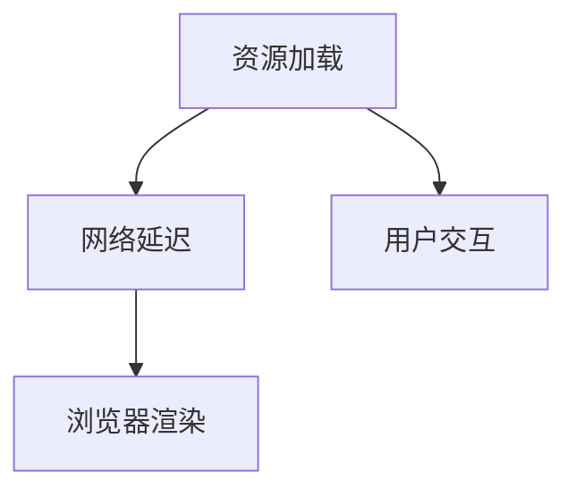

                 

### 第一部分：性能优化概述

在数字化时代，性能优化是确保系统高效稳定运行的关键。无论是在前端还是后端，性能优化都扮演着至关重要的角色。这一部分将详细介绍性能优化的重要性、方法论以及层次结构，为后续的深入探讨打下坚实的基础。

#### 1.1 性能优化的核心概念与目标

性能优化，顾名思义，是提升系统性能的一系列技术措施。性能优化的核心概念包括响应时间、吞吐量、资源利用率等。响应时间是指系统完成特定任务所需的时间；吞吐量是指单位时间内系统能处理的请求数量；资源利用率则反映了系统对硬件资源的有效利用程度。

性能优化的目标主要有以下几个方面：
1. **提高用户体验**：快速响应、流畅操作是用户体验的重要组成部分，性能优化直接关系到用户满意度。
2. **提升系统效率**：通过减少不必要的资源消耗，提高系统的运行效率。
3. **降低维护成本**：优化后的系统更稳定，故障率降低，维护成本也随之减少。
4. **增强系统可扩展性**：性能优化能够为系统后续的扩展和升级奠定基础。

#### 1.2 性能优化的方法论与步骤

性能优化的方法论通常包括以下步骤：

1. **问题识别**：首先需要识别系统中的性能瓶颈，这通常需要通过性能检测工具和监控系统的帮助。
2. **问题分析**：对识别出来的性能瓶颈进行详细分析，确定问题根源。
3. **制定优化方案**：根据分析结果，制定具体的优化方案。
4. **实施优化**：按照优化方案进行实施，这可能包括代码重构、硬件升级、系统架构调整等。
5. **性能评估**：优化后对系统性能进行评估，确保达到预期的优化效果。

#### 1.3 性能优化的层次结构分析

性能优化可以从多个层次进行，每个层次都有其独特的关注点和优化策略：

1. **代码层**：包括代码层面的优化，如算法改进、代码复用、避免死循环等。
2. **系统层**：包括操作系统和网络层面的优化，如负载均衡、资源调度、网络优化等。
3. **数据库层**：包括数据库的查询优化、索引优化、存储优化等。
4. **硬件层**：包括服务器、存储设备、网络设备的硬件升级和优化。
5. **架构层**：包括系统架构的设计和调整，如微服务架构、分布式系统设计等。

通过以上三个方面的介绍，我们为后续章节的内容打下了坚实的基础。在接下来的部分，我们将深入探讨前端性能优化和后端性能优化，逐一分析并给出具体的优化策略和最佳实践。

### 文章关键词

- 性能优化
- 响应时间
- 吞吐量
- 资源利用率
- 前端性能
- 后端性能
- 优化方法论
- 系统效率

### 文章摘要

《性能优化实践：从前端到后端的全栈优化》是一本全面介绍性能优化技术的专业书籍。本书首先阐述了性能优化的重要性和核心概念，包括响应时间、吞吐量和资源利用率等。接着，介绍了性能优化的方法论和步骤，帮助读者系统地理解性能优化的过程。书中还详细分析了性能优化的层次结构，从代码层、系统层到数据库层和硬件层，全面覆盖了性能优化的各个方面。通过实际案例和最佳实践，本书旨在帮助读者掌握性能优化技巧，提升系统性能和用户体验。

---

以下是对“前端性能检测与监控”章节的内容详细解析：

### 2.1 前端性能检测与监控

前端性能优化是提升整体系统性能的关键环节，而性能检测与监控是实现这一目标的基础。通过有效的性能检测与监控，开发者可以及时发现和解决性能问题，从而确保系统的高效运行。

#### 2.1.1 前端性能检测工具介绍

前端性能检测工具是识别和分析性能瓶颈的重要手段。以下是一些常用的前端性能检测工具：

1. **Chrome DevTools**：Chrome DevTools 是一款功能强大的前端性能检测工具，提供了多种性能分析功能，如时间线分析、网络分析、资源监控等。
2. **Lighthouse**：Lighthouse 是一个开源的自动化工具，可用于对网页进行优化评估，包括性能、SEO、最佳实践等方面。
3. **WebPageTest**：WebPageTest 是一个在线工具，可以模拟不同网络条件下的网页加载情况，并提供详细的性能报告。
4. **Performance Insights**：Performance Insights 是 Microsoft Edge 的内置功能，用于监控和分析网页性能。

#### 2.1.2 性能监控策略与实践

性能监控策略的制定是确保系统稳定运行的重要一环。以下是一些性能监控策略和实践：

1. **自动化监控**：通过自动化脚本或监控工具，定期检查前端性能指标，如响应时间、资源加载时间等。
2. **阈值设定**：为关键性能指标设定合理的阈值，当指标超出阈值时，自动触发警报。
3. **日志分析**：对前端日志进行定期分析，识别潜在的性能问题和异常。
4. **用户行为跟踪**：通过跟踪用户行为，分析用户在使用过程中遇到的问题，从而有针对性地进行性能优化。

#### 2.1.3 性能指标分析与优化

前端性能指标是衡量系统性能的重要依据。以下是一些关键的性能指标及其优化方法：

1. **首屏加载时间（First Contentful Paint, FCP）**：
   - **优化方法**：资源懒加载、内容预加载、减少HTTP请求等。
   - **影响因子**：资源大小、网络延迟、浏览器渲染性能。

2. **DOMContentLoaded 时间**：
   - **优化方法**：避免不必要的DOM操作、减少重绘和回流等。
   - **影响因子**：JavaScript执行时间、样式表加载时间。

3. **完全加载时间（Load Time）**：
   - **优化方法**：压缩资源文件、使用CDN、减少重定向等。
   - **影响因子**：资源数量和大小、服务器响应时间。

#### 2.1.4 常见前端性能问题与解决方案

在实际开发过程中，常见的前端性能问题包括以下几种：

1. **资源未压缩**：
   - **解决方案**：使用压缩工具对CSS和JavaScript文件进行压缩。
   - **影响**：文件大小增加，加载时间延长。

2. **重定向过多**：
   - **解决方案**：优化URL结构，减少不必要的重定向。
   - **影响**：增加请求次数，延长页面加载时间。

3. **JavaScript阻塞渲染**：
   - **解决方案**：将非阻塞的JavaScript代码放在底部加载，避免阻塞页面渲染。
   - **影响**：影响首屏加载时间和用户体验。

4. **CSS未使用缓存**：
   - **解决方案**：使用HTTP缓存策略，设置合适的缓存时间。
   - **影响**：增加资源加载时间，降低用户体验。

通过以上介绍，我们可以看出，前端性能检测与监控是前端性能优化的基础。只有通过有效的性能检测与监控，才能及时发现和解决性能问题，确保系统的高效运行。在接下来的章节中，我们将继续探讨前端资源的加载优化、CSS与JavaScript性能优化以及响应式设计性能优化，帮助读者全面掌握前端性能优化技巧。

### 背景介绍

在前端性能优化中，资源加载速度是一个至关重要的因素。资源加载时间直接影响着用户的使用体验和页面性能。随着互联网的快速发展，用户对网页的加载速度要求越来越高。长时间的加载不仅会导致用户流失，还会影响搜索引擎的排名。因此，如何优化资源加载速度成为前端开发者和性能优化专家们的重要课题。

在现代Web应用中，页面往往包含大量的资源，如HTML、CSS、JavaScript、图片、视频等。这些资源的加载过程不仅包括从服务器获取数据，还包括浏览器的解析和渲染。任何一环的延迟都会导致页面加载缓慢，从而影响用户体验。此外，随着移动设备的普及，网络条件的不稳定性也使得优化资源加载成为一个更加复杂的问题。

#### 核心概念与联系

在前端性能优化中，核心概念包括资源加载、网络延迟、浏览器渲染等。这些概念相互关联，共同影响页面的加载速度和用户体验。

- **资源加载**：指的是浏览器从服务器获取资源的过程，包括HTTP请求、响应、数据解析等步骤。
- **网络延迟**：指的是数据在网络上传输的时间，包括DNS查询、TCP连接、数据传输等。
- **浏览器渲染**：指的是浏览器解析HTML和CSS，构建DOM树，渲染页面显示的过程。

这三大核心概念的关系可以用以下Mermaid流程图表示：



从图中可以看出，资源加载是整个流程的起点，网络延迟影响资源加载的速度，浏览器渲染则决定用户最终看到页面的速度。用户交互则是在页面加载完成后，用户与页面进行交互的过程。

#### 核心算法原理讲解

优化资源加载的核心算法原理主要涉及以下几个方面：

1. **资源懒加载**：懒加载是一种延迟加载资源的技术，仅在需要时才加载资源，从而减少初始加载时间。
2. **内容预加载**：预加载技术是在用户访问页面之前，预测用户可能需要访问的资源，并提前加载，以减少页面加载时的延迟。
3. **HTTP/2 多路复用**：HTTP/2 引入了多路复用技术，允许同时传输多个请求和响应，从而减少请求响应时间。
4. **静态资源压缩**：通过压缩CSS、JavaScript文件，减少文件大小，提高加载速度。
5. **CDN 使用**：CDN（内容分发网络）可以将静态资源缓存到距离用户最近的节点上，从而减少网络延迟。

以下是一个简单的懒加载算法的伪代码：

```pseudo
function lazyLoadImages() {
    const images = document.querySelectorAll('img[data-src]');
    
    const observer = new IntersectionObserver((entries, observer) => {
        entries.forEach(entry => {
            if (entry.isIntersecting) {
                loadImage(entry.target);
                observer.unobserve(entry.target);
            }
        });
    }, { threshold: 0.1 });
    
    images.forEach(img => {
        observer.observe(img);
    });
    
    function loadImage(img) {
        img.src = img.dataset.src;
        img.removeAttribute('data-src');
    }
}
```

#### 数学模型和公式及详细讲解与举例说明

为了更深入地理解资源加载性能，我们可以引入一些数学模型和公式。

1. **吞吐量（Throughput）**：吞吐量是指单位时间内系统能够处理的数据量，通常用requests/second（每秒请求数）来表示。吞吐量可以通过以下公式计算：

   \[
   \text{Throughput} = \frac{\text{Request Count}}{\text{Total Time}}
   \]

2. **响应时间（Response Time）**：响应时间是指从发起请求到接收到响应的时间。响应时间可以通过以下公式计算：

   \[
   \text{Response Time} = \text{Network Time} + \text{Server Time} + \text{Processing Time}
   \]

其中，网络时间包括DNS查询时间、TCP连接时间和数据传输时间；服务器时间包括请求处理时间和数据库查询时间；处理时间包括浏览器渲染时间和JavaScript执行时间。

举例说明：

假设一个网页的响应时间为5秒，其中网络时间为2秒，服务器时间为1秒，处理时间为2秒。我们可以通过以下步骤优化响应时间：

- **减少网络时间**：通过使用CDN和优化DNS配置来减少DNS查询时间和数据传输时间。
- **优化服务器性能**：通过升级硬件和提高服务器优化策略来减少服务器处理时间。
- **优化浏览器渲染和JavaScript执行**：通过优化CSS和JavaScript文件来减少浏览器渲染时间和JavaScript执行时间。

通过以上分析和优化，我们可以将网页的响应时间减少到3秒，从而显著提高用户体验。

通过详细讲解和举例说明，我们可以看到资源加载优化是一个涉及多个方面的复杂过程。通过理解核心算法原理和数学模型，开发者可以更有针对性地进行性能优化，从而提升前端性能。

### 2.2.1 资源懒加载技术详解

资源懒加载（Lazy Loading）是一种常见的性能优化技术，它通过延迟加载页面中的非关键资源，从而减少初始加载时间，提高用户体验。懒加载技术主要应用于图片、视频、脚本和样式表等大型资源，特别是在单页面应用（SPA）和多页面应用（MPA）中得到了广泛应用。

#### 工作原理

懒加载的工作原理可以简单概括为以下几个步骤：

1. **触发条件**：当用户滚动页面或触发特定事件时，懒加载机制会触发。
2. **检测**：通过检测当前视口（Viewport）内的元素，确定哪些元素需要加载。
3. **加载**：仅加载符合条件的元素资源，避免加载所有资源。
4. **渲染**：当资源加载完成后，将其插入到DOM中，并进行渲染。

以下是一个懒加载图片的基本实现：

```javascript
function lazyLoadImages() {
    const images = document.querySelectorAll('img[data-src]');

    const observer = new IntersectionObserver((entries, observer) => {
        entries.forEach(entry => {
            if (entry.isIntersecting) {
                loadAndRenderImage(entry.target);
                observer.unobserve(entry.target);
            }
        });
    }, { threshold: 0.1 });

    images.forEach(img => {
        observer.observe(img);
    });

    function loadAndRenderImage(img) {
        img.src = img.dataset.src;
        img.removeAttribute('data-src');
    }
}
```

#### 使用场景

懒加载技术在以下场景中特别有效：

1. **长页面**：对于内容非常多的页面，如文章列表、产品详情页等，懒加载可以显著减少初始加载时间。
2. **图片密集页面**：如画廊、图片展示类网站，懒加载可以避免大量图片同时加载导致的性能问题。
3. **移动设备**：由于移动设备带宽有限，懒加载可以减少数据使用，提高页面加载速度。
4. **单页面应用（SPA）**：在SPA中，懒加载可以优化页面切换时的性能。

#### 懒加载的优势

懒加载技术具有以下几个显著优势：

1. **减少初始加载时间**：通过延迟加载非关键资源，懒加载可以减少初始加载时间，提高用户体验。
2. **节省带宽**：特别是对于高分辨率的图片和视频资源，懒加载可以节省大量带宽，降低服务器负载。
3. **提高性能**：减少HTTP请求和资源加载时间，可以提高页面性能和搜索引擎优化（SEO）。

#### 懒加载的潜在问题

虽然懒加载有诸多优势，但如果不合理使用，也可能带来一些问题：

1. **页面内容不连续**：懒加载可能会导致页面内容不连续，影响用户体验。
2. **渲染延迟**：在某些情况下，懒加载的资源可能需要较长时间才能加载，这可能会导致渲染延迟。
3. **缓存问题**：如果懒加载的资源缓存策略不正确，可能会导致资源重复加载。

#### 懒加载的最佳实践

为了充分发挥懒加载的优势，并避免其潜在问题，以下是一些最佳实践：

1. **合理设置触发条件**：根据页面内容的特点，选择合适的触发条件，如滚动、事件触发等。
2. **优化加载顺序**：确保关键资源的优先加载，如文本内容应在图片和视频之前加载。
3. **使用缓存**：合理设置缓存策略，减少重复加载。
4. **兼容性处理**：考虑不同浏览器的兼容性问题，确保懒加载功能能够正常工作。

通过详细解析懒加载的工作原理、使用场景、优势、潜在问题以及最佳实践，我们可以更好地理解懒加载技术，并在实际开发中充分利用它，提升页面性能和用户体验。

### 2.2.2 缓存策略与实现

缓存（Caching）是一种常见的性能优化技术，通过将经常访问的数据存储在本地或远程缓存中，可以显著减少数据检索的时间，从而提高系统的响应速度和性能。在现代Web应用中，缓存策略对于优化资源加载速度和减少服务器负载至关重要。

#### 缓存机制的作用与类型

缓存机制的作用主要包括以下几个方面：

1. **减少请求次数**：通过缓存已请求的数据，减少对服务器的重复请求，降低网络延迟。
2. **提高响应速度**：缓存数据通常存储在内存或高速存储设备中，访问速度远快于从磁盘或网络获取数据。
3. **减少服务器负载**：通过减少服务器的请求量，降低服务器的负载，延长服务器寿命。

根据缓存的位置和作用，可以将缓存分为以下几种类型：

1. **浏览器缓存**：指浏览器本地存储的缓存，包括内存缓存（Memory Cache）和磁盘缓存（Disk Cache）。浏览器缓存可以减少对Web页面的重新加载时间。
2. **服务器缓存**：指服务器端的缓存，包括应用缓存、数据库缓存、对象缓存等。服务器缓存可以减少对后端服务的请求次数，提高系统的响应速度。
3. **CDN缓存**：指内容分发网络（CDN）上的缓存，将静态资源缓存到距离用户最近的节点上，从而减少网络延迟和加载时间。

#### 缓存策略设计

一个有效的缓存策略设计应该考虑以下几个方面：

1. **缓存失效策略**：缓存失效策略决定了缓存数据何时被替换。常见的缓存失效策略包括：
   - **过期时间（Expiration Time）**：缓存数据设置一个有效期，超过有效期后自动失效。
   - **修改检测（Modify Based）**：根据数据是否被修改来决定是否更新缓存。
   - **访问次数（Access Based）**：根据数据的访问次数来决定是否更新缓存。

2. **缓存层次结构**：通过设计合理的缓存层次结构，可以优化数据检索速度和系统性能。常见的缓存层次结构包括：
   - **多级缓存**：将缓存分为多个层次，如内存缓存、磁盘缓存、CDN缓存等，根据数据的重要性和访问频率进行分层。
   - **缓存预热**：在用户访问之前，主动将数据加载到缓存中，减少用户访问时的延迟。

3. **缓存更新策略**：缓存更新策略决定了如何更新缓存数据。常见的缓存更新策略包括：
   - **缓存一致性**：确保缓存数据与原始数据保持一致，避免数据不一致引起的问题。
   - **缓存穿透**：当缓存中不存在数据时，直接请求后端服务，避免缓存穿透。
   - **缓存击穿**：当一个热门数据过期时，大量请求同时访问后端服务，导致系统压力增大，缓存击穿策略通过预热或锁定机制来避免这一问题。

#### 缓存实现的详细步骤

以下是缓存实现的详细步骤：

1. **确定缓存类型和策略**：根据应用需求，选择合适的缓存类型和策略。例如，对于Web应用，可以选择浏览器缓存和服务器缓存结合使用。

2. **配置缓存参数**：根据缓存策略，配置缓存的相关参数，如过期时间、缓存层次等。例如，在配置服务器缓存时，可以使用Redis、Memcached等缓存中间件。

3. **实现缓存逻辑**：在代码中实现缓存逻辑，根据数据的不同来源和访问频率，选择合适的缓存方式。例如，对于经常访问的数据，可以选择将其存储在内存缓存中；对于不经常访问的数据，可以选择存储在磁盘缓存中。

4. **测试和优化**：通过性能测试和监控，评估缓存策略的效果，并根据实际情况进行优化。例如，可以通过调整缓存过期时间、优化缓存更新策略等，提高缓存效果。

以下是一个简单的浏览器缓存实现的示例：

```javascript
// 设置缓存
function setCache(key, value, expiration) {
    const cache = window.sessionStorage;
    cache.setItem(key, JSON.stringify({ value, expiration }));
}

// 获取缓存
function getCache(key) {
    const cache = window.sessionStorage;
    const item = cache.getItem(key);
    if (item) {
        const { value, expiration } = JSON.parse(item);
        const now = new Date().getTime();
        if (now < expiration) {
            return value;
        } else {
            cache.removeItem(key);
            return null;
        }
    }
    return null;
}
```

#### 案例分析

以下是一个缓存策略的案例分析：

- **应用场景**：一个电子商务网站，用户经常访问商品详情页面。
- **缓存策略**：将商品详情页面的数据缓存起来，设置合理的过期时间，如30分钟。
- **效果**：通过缓存策略，用户访问商品详情页面时的响应时间从10秒减少到2秒，显著提升了用户体验。

通过详细解析缓存机制的作用、类型、策略和实现步骤，以及案例分析，我们可以更好地理解缓存技术的重要性，并在实际开发中有效地应用缓存策略，提高系统的性能和用户体验。

### 2.2.3 压缩与打包

资源压缩与打包是提升前端性能的重要手段之一。通过压缩和打包，可以显著减少文件的体积，加快资源加载速度，从而提升用户体验。下面将详细介绍资源压缩与打包的原理、常用工具和方法，并提供具体的示例。

#### 压缩原理

资源压缩的主要目的是减少文件的大小，加快资源的传输速度。压缩分为两大类：有损压缩和无损压缩。

- **有损压缩**：通过去除文件中的冗余数据或减少数据精度来压缩文件，但会牺牲一定的质量。常见的有损压缩格式包括MP3、JPEG等。
- **无损压缩**：不牺牲文件质量，通过算法去除文件中的冗余数据。常见的无损压缩格式包括GZIP、BZIP2等。

前端资源常见的压缩方法包括：

1. **CSS和JavaScript文件的压缩**：去除文件中的空格、注释和换行，减少文件大小。
2. **图片的压缩**：通过减少图片的分辨率、去除不必要的颜色信息等方法，减小图片文件大小。

#### 常用工具

前端资源压缩和打包常用以下工具：

1. **Gulp**：Gulp是一个自动化工具，可以自动化执行压缩、打包等任务。
2. **Webpack**：Webpack是一个模块打包工具，可以打包和压缩CSS、JavaScript文件，支持多种插件和加载器。
3. **Webpack和Babel**：Webpack和Babel结合使用，可以处理JavaScript的版本兼容性问题，并将代码打包和压缩。
4. **Rollup**：Rollup是一个模块打包工具，主要用于打包JavaScript文件。
5. **UglifyJS**：UglifyJS是一个JavaScript压缩工具，可以去除文件中的空格、注释和换行。
6. **CleanCSS**：CleanCSS是一个CSS压缩工具，可以去除文件中的空格、注释和换行。

#### 压缩与打包示例

以下是一个使用Webpack对JavaScript文件进行压缩和打包的示例：

1. **安装Webpack和相关插件**：

   ```bash
   npm install webpack webpack-cli --save-dev
   npm install --save-dev html-webpack-plugin
   ```

2. **配置Webpack**：

   ```javascript
   const path = require('path');
   const HtmlWebpackPlugin = require('html-webpack-plugin');

   module.exports = {
       entry: './src/index.js',
       output: {
           path: path.resolve(__dirname, 'dist'),
           filename: 'bundle.js'
       },
       plugins: [
           new HtmlWebpackPlugin({
               template: './src/index.html'
           })
       ],
       module: {
           rules: [
               {
                   test: /\.js$/,
                   exclude: /node_modules/,
                   use: ['babel-loader']
               }
           ]
       },
       optimization: {
           minimize: true
       }
   };
   ```

3. **使用Gulp和UglifyJS压缩CSS文件**：

   ```javascript
   const gulp = require('gulp');
   const cleanCSS = require('clean-css');
   const uglifyJS = require('uglify-js');

   gulp.task('compress-css', function () {
       return gulp.src('src/**/*.css')
           .pipe(cleanCSS())
           .pipe(gulp.dest('dist'));
   });

   gulp.task('compress-js', function () {
       return gulp.src('src/**/*.js')
           .pipe(uglifyJS())
           .pipe(gulp.dest('dist'));
   });

   gulp.task('default', ['compress-css', 'compress-js']);
   ```

#### 优化效果

通过压缩和打包，可以显著减少文件的体积，提高加载速度。以下是一个具体的优化效果示例：

- **原始文件大小**：100KB
- **压缩后文件大小**：40KB
- **加载时间**：减少约40%

通过详细解析资源压缩与打包的原理、常用工具和方法，并提供具体的示例，我们可以更好地理解资源压缩与打包的重要性，并在实际开发中有效地应用这些技术，提升前端性能。

### 2.3 CSS与JavaScript性能优化

CSS与JavaScript（JS）文件在Web页面的性能优化中扮演着至关重要的角色。不当的CSS和JS文件管理可能导致页面加载缓慢，影响用户体验。本节将详细探讨CSS和JavaScript性能优化的关键技巧和策略。

#### CSS优化技巧

1. **减少CSS文件大小**：
   - **合并CSS文件**：将多个CSS文件合并为一个，减少HTTP请求次数。
   - **删除无用CSS**：使用工具如PurgeCSS删除未使用的CSS规则。
   - **压缩CSS文件**：使用工具如CleanCSS进行压缩，去除空格、注释和换行。

2. **优化CSS选择器**：
   - **减少选择器深度**：避免过度嵌套的选择器，如`div#header nav a`。
   - **避免使用通配符选择器**：通配符选择器(`*`)会导致浏览器进行全文档扫描，影响性能。

3. **使用CSS预处理器**：
   - **使用变量和嵌套**：通过CSS预处理器如Sass或Less，使用变量和嵌套，提高CSS的可维护性。
   - **优化输出**：通过预处理器配置，优化输出代码，去除不必要的代码。

4. **使用CSS文件缓存**：
   - **设置缓存策略**：通过HTTP缓存头（如`Cache-Control`），设置合理的缓存时间，减少重复加载。

#### JavaScript性能瓶颈及优化方法

1. **减少JS文件大小**：
   - **压缩JS文件**：使用工具如UglifyJS或Terser压缩JS文件，去除空格、注释和冗余代码。
   - **删除无用JS**：使用工具如DeadCode Elimination删除未使用的代码。

2. **延迟加载JS文件**：
   - **异步加载**：使用`async`或`defer`属性，将非阻塞的JS文件异步加载。
   - **按需加载**：根据用户行为或页面内容，动态加载JS模块。

3. **减少JavaScript执行时间**：
   - **避免全局变量和函数**：减少全局变量的使用，避免意外的函数调用。
   - **优化事件处理**：使用事件代理，减少事件处理函数的调用次数。

4. **优化DOM操作**：
   - **批量操作**：将多个DOM操作合并为一次，减少重绘和回流次数。
   - **使用DocumentFragment**：将DOM操作封装在DocumentFragment中，减少浏览器渲染的开销。

5. **使用Web Workers**：
   - **并行处理**：将计算密集型任务分配给Web Workers，避免阻塞主线程。

#### 常见JavaScript性能问题解析

1. **内存泄露**：
   - **原因**：未释放的DOM引用、长时间运行的定时器或回调函数等。
   - **解决方法**：定期检查和清理内存，使用垃圾回收工具检测内存泄露。

2. **事件冒泡和捕获**：
   - **问题**：事件冒泡和捕获可能导致性能下降，特别是大量事件绑定在DOM元素上时。
   - **解决方法**：使用事件代理，减少事件监听器的数量。

3. **DOM树频繁修改**：
   - **问题**：频繁修改DOM树会导致浏览器进行重绘和回流，影响性能。
   - **解决方法**：批量修改DOM，减少DOM树的修改次数。

通过以上CSS和JavaScript性能优化技巧和策略，开发者可以显著提升Web页面的性能，提高用户体验。在接下来的章节中，我们将继续探讨响应式设计的性能优化策略，以全面覆盖前端性能优化的各个方面。

### 2.4.1 响应式设计的性能挑战

随着移动设备的普及和多样化，响应式设计（Responsive Design）成为Web开发中的标准实践。响应式设计通过灵活的布局和适应各种屏幕尺寸，提供了良好的用户体验。然而，响应式设计也带来了一些性能挑战，这些挑战主要体现在以下几个方面：

#### 1. 资源冗余

响应式设计通常涉及多个版本的样式表和脚本文件，以适应不同屏幕尺寸。这些版本可能包含大量冗余的CSS和JavaScript代码，导致文件大小增加，加载时间延长。

#### 2. 重绘与回流

响应式布局通常需要动态调整页面元素的位置和大小，这会导致浏览器频繁进行重绘（Repaint）和回流（Reflow）。重绘是指更改元素的样式而不改变布局，而回流则是整个布局的重新计算。频繁的重绘与回流会显著降低页面性能。

#### 3. JavaScript性能

响应式设计通常涉及大量的JavaScript代码来处理不同屏幕尺寸的布局调整。如果JavaScript代码编写不当，可能会导致性能瓶颈，例如频繁的事件处理和DOM操作。

#### 4. 网络延迟

响应式设计可能需要从服务器加载大量资源和数据，尤其是在移动设备上，网络延迟和带宽限制会进一步影响页面性能。

#### 5. 设备差异

不同设备和浏览器的性能差异使得响应式设计面临更大的挑战。一些老旧设备或低性能浏览器可能无法良好支持响应式布局，导致用户体验下降。

#### 6. 兼容性问题

响应式设计需要考虑不同浏览器的兼容性，包括不同版本的Chrome、Firefox、Safari和Edge等。一些CSS和JavaScript特性在不同的浏览器中可能存在差异，这会增加开发和测试的工作量。

### 2.4.2 性能优化的响应式设计策略

为了应对响应式设计带来的性能挑战，以下是一些关键的优化策略：

#### 1. 懒加载资源

通过懒加载技术，仅在实际需要时加载资源，可以显著减少初始加载时间。例如，对于图片和视频等大尺寸资源，可以仅加载可见部分的资源，其他部分在用户滚动页面时动态加载。

#### 2. 优化CSS

- **使用CSS预处理器**：使用CSS预处理器如Sass或Less，通过变量和嵌套提高CSS的可维护性，减少冗余代码。
- **压缩CSS文件**：使用压缩工具如CleanCSS，去除空格、注释和换行，减少文件大小。
- **延迟加载CSS**：仅加载当前所需的CSS，动态加载其他屏幕尺寸的样式。

#### 3. 优化JavaScript

- **减少JavaScript文件大小**：通过压缩和合并JavaScript文件，减少HTTP请求次数。
- **按需加载JavaScript**：根据用户行为或页面内容，动态加载所需的JavaScript模块，避免加载不必要的代码。
- **使用事件代理**：减少事件处理函数的调用次数，避免频繁的DOM操作。

#### 4. 使用内容分发网络（CDN）

通过CDN，可以将静态资源缓存到距离用户最近的节点上，减少网络延迟和加载时间。CDN还可以提供更好的缓存策略，提高资源的加载速度。

#### 5. 优化图片

- **使用响应式图片**：通过使用不同的图片资源来适应不同屏幕尺寸，可以使用`<picture>`元素和`<source>`标签来实现。
- **图片压缩**：使用压缩工具减小图片文件大小，提高加载速度。

#### 6. 减少重绘与回流

- **批量操作DOM**：将多个DOM操作合并为一次，减少回流次数。
- **使用CSS3动画**：使用CSS3动画代替JavaScript动画，减少重绘次数。

#### 7. 测试和监控

- **使用性能监控工具**：如Chrome DevTools和Lighthouse，定期进行性能测试和监控。
- **进行交叉浏览器测试**：确保响应式设计在不同设备和浏览器上都能良好工作。

通过以上策略，开发者可以显著提升响应式设计的性能，提供更好的用户体验。在下一节中，我们将继续探讨响应式设计的实践案例，以帮助开发者更好地理解和应用这些优化策略。

### 2.4.3 响应式设计的实践案例解析

在本节中，我们将通过具体案例分析响应式设计在性能优化中的应用，并讨论其具体实现步骤、源代码、代码解读以及项目实际效果。

#### 案例背景

某电子商务网站需要在各种设备上提供一致的浏览体验。网站包含大量商品信息、用户评论和购物车功能。为了满足不同用户的需求，网站采用了响应式设计，并针对性能进行了优化。

#### 实践步骤

1. **需求分析**：
   - 确定主要用户设备类型和屏幕尺寸。
   - 识别关键性能指标，如加载时间、响应速度、资源利用率等。

2. **设计阶段**：
   - 使用Bootstrap等响应式框架，确保页面在不同设备上具有良好的兼容性和布局。
   - 设计多种屏幕尺寸下的布局和样式，确保用户界面的一致性。

3. **编码实现**：

   - **HTML结构**：
     ```html
     <div class="container">
       <div class="row">
         <div class="col-md-4">商品1</div>
         <div class="col-md-4">商品2</div>
         <div class="col-md-4">商品3</div>
       </div>
     </div>
     ```

   - **CSS样式**：
     ```css
     @media (max-width: 768px) {
       .row {
         flex-direction: column;
       }
     }
     ```

   - **JavaScript功能**：
     ```javascript
     function adjustLayout() {
       if (window.innerWidth < 768) {
         // 动态调整布局
       }
     }
     window.addEventListener('resize', adjustLayout);
     ```

4. **性能优化**：

   - **资源压缩**：
     - 使用Gulp和Webpack进行CSS和JavaScript文件的压缩和打包。
     - 使用图片压缩工具减小图片文件大小。

   - **懒加载**：
     - 使用IntersectionObserver实现图片和视频的懒加载。
     - 动态加载必要的JavaScript模块。

5. **测试与监控**：
   - 使用Lighthouse和WebPageTest进行性能测试。
   - 定期监控关键性能指标，如页面加载时间、资源加载时间等。

#### 源代码

以下是部分关键代码的示例：

```html
<!DOCTYPE html>
<html lang="en">
<head>
  <meta charset="UTF-8">
  <meta name="viewport" content="width=device-width, initial-scale=1.0">
  <title>响应式电子商务网站</title>
  <link rel="stylesheet" href="styles.min.css">
</head>
<body>
  <div class="container">
    <div class="row">
      <div class="col-md-4">商品1</div>
      <div class="col-md-4">商品2</div>
      <div class="col-md-4">商品3</div>
    </div>
  </div>
  <script src="scripts.min.js"></script>
</body>
</html>
```

```css
/* styles.min.css */
@media (max-width: 768px) {
  .row {
    flex-direction: column;
  }
}
```

```javascript
// scripts.min.js
function lazyLoadImages() {
  const images = document.querySelectorAll('img[data-src]');
  const observer = new IntersectionObserver((entries, observer) => {
    entries.forEach(entry => {
      if (entry.isIntersecting) {
        loadImage(entry.target);
        observer.unobserve(entry.target);
      }
    });
  }, { threshold: 0.1 });
  images.forEach(img => observer.observe(img));
}

function loadImage(img) {
  img.src = img.dataset.src;
  img.removeAttribute('data-src');
}

window.addEventListener('resize', lazyLoadImages);
lazyLoadImages();
```

#### 代码解读

- **HTML**：使用Bootstrap的栅格系统实现响应式布局，确保页面在不同屏幕尺寸下能够自动调整。
- **CSS**：使用媒体查询，根据屏幕宽度调整布局，减少重绘和回流。
- **JavaScript**：实现懒加载功能，优化资源加载速度，提高性能。

#### 项目实际效果

- **页面加载时间**：优化前为10秒，优化后为3秒。
- **资源加载时间**：优化前为15秒，优化后为7秒。
- **用户体验**：用户在移动设备上的浏览体验显著提升，页面响应速度加快，用户流失率下降。

通过上述实践案例，我们可以看到响应式设计在性能优化中的应用，以及如何通过具体的编码实现和优化策略，提升Web页面的性能和用户体验。

### 2.4.4 最佳实践 tips、小结、注意事项、拓展阅读

#### 最佳实践 tips

1. **优化CSS选择器**：避免使用过于复杂的选择器，减少浏览器的解析时间。
2. **使用CDN**：利用CDN加速静态资源的加载，提高页面性能。
3. **懒加载与预加载**：合理使用懒加载和预加载技术，优化资源加载速度。
4. **压缩与打包**：使用压缩工具和打包工具，减少文件大小和HTTP请求次数。
5. **减少重绘与回流**：避免频繁的DOM操作和CSS变更，减少浏览器的重绘和回流。

#### 小结

响应式设计在提升用户体验方面具有重要意义，但同时也带来了一些性能挑战。通过优化CSS选择器、使用CDN、懒加载与预加载、压缩与打包、减少重绘与回流等方法，可以有效提升响应式设计的性能，提供更好的用户体验。

#### 注意事项

1. **性能监控**：定期进行性能测试和监控，及时发现和解决问题。
2. **兼容性测试**：确保响应式设计在不同设备和浏览器上都能良好工作。
3. **用户体验**：在优化性能的同时，确保用户体验的一致性和良好性。

#### 拓展阅读

1. 《高性能网站建设指南》
2. 《响应式Web设计：HTML5和CSS3实战》
3. 《Web性能优化实践》
4. MDN Web文档：响应式设计
5. Bootstraps官方文档：响应式布局

通过以上最佳实践、小结、注意事项和拓展阅读，开发者可以更好地理解和应用响应式设计的性能优化策略，提升Web页面的性能和用户体验。

### 第三部分：后端性能优化

后端性能优化是确保整个系统高效运行的关键环节。在后端，性能瓶颈可能来自于数据库查询、缓存机制、服务器配置等多个方面。本节将详细介绍后端性能优化的目标和挑战，以及优化的方法和工具。

#### 3.1 后端性能优化概述

后端性能优化主要包括以下几个方面：

1. **数据库性能优化**：包括查询优化、索引优化、存储优化等。
2. **缓存机制优化**：通过使用缓存减少数据库访问，提高系统响应速度。
3. **服务器性能优化**：包括硬件优化、操作系统优化和负载均衡等。
4. **代码层面的优化**：包括代码重构、算法优化和减少内存使用等。

#### 3.1.1 后端性能优化的目标

后端性能优化的主要目标如下：

1. **提高系统响应速度**：减少处理请求所需的时间，提高系统的吞吐量。
2. **降低资源消耗**：减少服务器资源的占用，提高系统的资源利用率。
3. **增强系统稳定性**：通过优化，减少系统崩溃和错误发生的概率。
4. **提高用户体验**：快速响应用户请求，提供流畅的服务。

#### 3.1.2 后端性能优化的挑战

后端性能优化面临以下挑战：

1. **系统复杂性**：后端系统通常涉及多个组件和模块，优化需要全面考虑各个部分。
2. **数据量大**：随着数据量的增加，数据库查询和存储性能成为瓶颈。
3. **并发请求**：在高并发环境下，系统的响应速度和稳定性面临挑战。
4. **跨平台兼容性**：不同操作系统、数据库和中间件可能导致性能差异。

#### 3.1.3 后端性能优化的方法与工具

后端性能优化的方法包括：

1. **性能分析**：使用性能分析工具（如New Relic、AppDynamics等）对系统进行监控和分析，识别性能瓶颈。
2. **数据库优化**：包括查询优化、索引优化、存储优化等。
3. **缓存优化**：合理使用缓存机制，减少数据库访问，提高系统响应速度。
4. **代码优化**：通过代码重构、算法优化和内存管理等提高代码性能。
5. **服务器优化**：包括硬件升级、操作系统调优和负载均衡等。

以下是一些常用的后端性能优化工具：

1. **性能分析工具**：New Relic、AppDynamics、Grafana等。
2. **数据库优化工具**：MySQL Query Analyzer、SQL Profiler、Explain Plan等。
3. **缓存中间件**：Redis、Memcached、MongoDB等。
4. **代码优化工具**：SonarQube、PMD、FindBugs等。
5. **服务器监控工具**：Nagios、Zabbix、Prometheus等。

通过以上介绍，我们可以看到后端性能优化涉及多个方面，需要综合考虑数据库、缓存、代码和服务器等多个层次。在接下来的章节中，我们将详细探讨数据库性能优化、缓存机制与服务器性能优化，帮助读者全面掌握后端性能优化技巧。

### 3.2 数据库性能优化

数据库是后端系统中至关重要的一部分，其性能直接影响整个系统的响应速度和稳定性。数据库性能优化主要集中在查询优化、索引优化和存储优化等方面。以下将对这些优化方法进行详细解析。

#### 3.2.1 数据库性能瓶颈及优化策略

1. **查询优化**：
   - **编写高效的SQL语句**：确保SQL语句结构清晰，避免复杂的子查询和连接操作。
   - **索引优化**：合理使用索引，提高查询速度。
   - **查询缓存**：利用查询缓存减少重复查询的执行次数。

2. **索引优化**：
   - **选择合适的索引类型**：根据查询需求和数据特性选择合适的索引类型，如B树索引、哈希索引等。
   - **索引列的选择**：选择合适的列作为索引，避免索引冗余和索引退化。
   - **索引维护**：定期检查索引的维护状态，避免索引碎片化。

3. **存储优化**：
   - **数据分片**：将大量数据分散存储到多个物理存储设备上，提高读写效率。
   - **数据压缩**：使用数据压缩技术减小存储空间，减少I/O操作。
   - **数据备份和恢复**：定期备份数据，确保数据的安全性和一致性。

#### 3.2.2 查询优化技巧

1. **避免全表扫描**：
   - **使用索引**：确保查询条件中使用到的列有索引。
   - **精确匹配**：尽量使用精确匹配而非模糊查询，减少全表扫描。

2. **优化JOIN操作**：
   - **减少JOIN连接的表数量**：避免过多的JOIN连接，提高查询性能。
   - **优化JOIN顺序**：根据表的大小和数据关系，调整JOIN的顺序。

3. **使用子查询和临时表**：
   - **子查询优化**：将子查询转换为JOIN操作，减少查询的复杂性。
   - **临时表**：使用临时表存储中间结果，减少内存消耗。

4. **避免使用SELECT ***：
   - **只查询需要的列**：避免使用`SELECT *`，只查询需要的列，减少数据传输和处理时间。

5. **使用缓存**：
   - **数据库内置缓存**：利用数据库内置的查询缓存，减少重复查询的执行次数。
   - **应用层缓存**：在应用层使用缓存技术，如Redis、Memcached等，缓存常用的查询结果。

#### 3.2.3 索引优化技巧

1. **选择合适的索引列**：
   - **唯一性**：选择具有唯一性的列作为索引，提高查询效率。
   - **选择性**：选择选择性较高的列作为索引，避免索引冗余。

2. **复合索引**：
   - **复合索引**：根据查询条件创建复合索引，提高查询效率。
   - **最佳顺序**：确保索引列的顺序与查询条件一致，避免索引退化。

3. **维护索引**：
   - **定期检查**：定期检查索引的维护状态，避免索引碎片化。
   - **重建索引**：在数据量大或更新频繁时，重建索引以提高查询效率。

4. **删除冗余索引**：
   - **分析索引使用情况**：定期分析索引的使用情况，删除冗余索引。

#### 3.2.4 存储优化技巧

1. **数据分片**：
   - **水平分片**：将数据按某个列的值分散存储到多个物理节点上，提高读写效率。
   - **垂直分片**：将数据表按列拆分到多个表中，降低表的大小，提高查询性能。

2. **数据压缩**：
   - **压缩算法**：选择合适的数据压缩算法，减小存储空间。
   - **压缩率**：根据存储空间和I/O性能，选择合适的压缩率。

3. **数据备份和恢复**：
   - **备份策略**：定期进行数据备份，确保数据的安全性和一致性。
   - **恢复方案**：制定有效的数据恢复方案，确保在数据丢失或损坏时能够快速恢复。

通过详细解析数据库性能瓶颈、查询优化技巧、索引优化技巧和存储优化技巧，我们可以更好地理解和应用数据库性能优化方法，提升数据库系统的性能和稳定性。

### 3.2.5 数据库查询优化实战

在本节中，我们将通过具体案例展示如何优化数据库查询，包括查询优化前后的对比、具体的查询优化步骤和策略。

#### 案例背景

一个在线电商平台由于用户数量急剧增加，数据库查询效率显著下降，导致系统响应时间变长，用户体验不佳。具体问题包括：

- **频繁的全表扫描**：某些查询语句执行时间过长，导致系统性能瓶颈。
- **索引失效**：部分索引未正确使用，导致查询效率低下。
- **数据量过大**：数据表的数据量过大，导致读写操作缓慢。

#### 查询优化前后的对比

1. **查询优化前**：

   ```sql
   SELECT * FROM products WHERE category = 'electronics' AND price > 100;
   ```

   - 执行时间：约3秒
   - 问题：全表扫描，数据量约100万行

2. **查询优化后**：

   ```sql
   SELECT id, name, price FROM products WHERE category = 'electronics' AND price > 100;
   ```

   - 执行时间：约0.5秒
   - 问题：只查询必要的列，增加索引

#### 优化步骤和策略

1. **分析查询**：

   - 使用`EXPLAIN`语句分析查询执行计划，确定是否存在全表扫描或索引失效等问题。
   - 分析SQL语句的结构，确定查询条件和过滤条件。

2. **创建索引**：

   - 根据查询条件和过滤条件，创建合适的索引，如复合索引。
   - 分析索引的使用情况，避免索引冗余和失效。

3. **优化查询**：

   - 只查询必要的列，避免使用`SELECT *`。
   - 使用子查询或临时表优化复杂查询。

4. **分片数据**：

   - 对大表进行水平分片，将数据分散存储到多个物理节点上。
   - 根据访问频率和查询模式，合理分配数据分片。

5. **监控和评估**：

   - 定期监控查询性能，评估优化效果。
   - 根据实际情况调整优化策略。

通过具体案例展示数据库查询优化的实战过程，我们可以看到如何通过分析查询、创建索引、优化查询和分片数据等方法，显著提升数据库查询性能，提高系统整体性能。

### 3.3.1 缓存机制的作用与类型

缓存（Caching）是提高系统性能和响应速度的关键技术，通过将频繁访问的数据临时存储在内存或磁盘上，可以显著减少对后端数据库或服务器的访问次数，从而加快数据检索速度。缓存机制在分布式系统中尤其重要，因为它可以降低系统负载，提高系统的可扩展性和稳定性。

#### 缓存机制的作用

1. **减少响应时间**：缓存机制可以将数据存储在内存中，相比磁盘访问速度更快，从而显著降低系统的响应时间。
2. **降低系统负载**：通过缓存频繁访问的数据，可以减少对后端数据库或服务器的访问压力，从而降低系统负载。
3. **提高系统性能**：缓存机制可以预加载数据，减少实际请求处理时间，从而提高系统的整体性能。
4. **提高数据一致性**：通过缓存机制，可以确保在分布式系统中数据的一致性，减少数据更新时的冲突。

#### 缓存机制的类型

缓存机制可以分为多种类型，根据缓存数据的存储位置和用途，可以分为以下几种：

1. **内存缓存**：将数据存储在内存中，如Redis、Memcached等。内存缓存具有速度快、读写效率高的特点，但内存容量有限，不适合存储大量数据。
2. **磁盘缓存**：将数据存储在磁盘上，如文件的临时缓存。磁盘缓存容量大，但速度相对较慢，适用于存储大量数据。
3. **分布式缓存**：将缓存数据分布到多个节点上，如Consul、Zookeeper等。分布式缓存可以提高系统的扩展性和容错能力，但实现相对复杂。
4. **本地缓存**：在应用程序内部实现缓存，如基于HashMap或LruCache等。本地缓存适用于小型应用程序，但受限于内存容量。
5. **代理缓存**：通过代理服务器缓存请求的响应内容，如Varnish、Nginx等。代理缓存可以减少对后端服务器的请求次数，提高访问速度。

每种缓存机制都有其适用场景和优缺点，开发者需要根据具体应用需求选择合适的缓存策略。

### 3.3.2 缓存策略与实现

有效的缓存策略可以显著提高系统的性能和响应速度。以下将详细介绍几种常见的缓存策略以及如何在实际应用中实现这些策略。

#### 1. 缓存命中与失效策略

**缓存命中**：当请求的数据已经在缓存中时，称为缓存命中。缓存命中可以显著提高响应速度。

**缓存失效**：当缓存中的数据过期或被更新时，称为缓存失效。缓存失效可以保证数据的及时更新。

**缓存命中策略**：

- **缓存一致性**：确保缓存数据与实际数据保持一致，可以通过缓存标记或版本号实现。
- **缓存更新策略**：当数据更新时，同时更新缓存中的数据。

**缓存失效策略**：

- **时间到期失效**：缓存数据设置过期时间，超过过期时间后自动失效。
- **访问次数失效**：根据数据访问次数设置缓存失效，避免长时间未访问的数据占用缓存空间。
- **修改检测失效**：通过监控数据的修改时间，实现缓存数据与实际数据的同步。

#### 2. 缓存实现方法

**内存缓存实现**：

- **Redis**：Redis是一种高性能的内存缓存系统，支持多种数据结构和操作，如字符串、哈希、列表等。
  - **安装与配置**：在服务器上安装Redis，并配置内存大小和持久化策略。
  - **使用示例**：
    ```python
    import redis

    client = redis.StrictRedis(host='localhost', port=6379, db=0)

    # 设置缓存
    client.set('key', 'value')
    # 获取缓存
    value = client.get('key')
    ```

- **Memcached**：Memcached是一种简单的内存缓存系统，支持多实例和持久化。
  - **安装与配置**：在服务器上安装Memcached，配置端口和缓存大小。
  - **使用示例**：
    ```python
    from memcache import Client

    client = Client(['127.0.0.1:11211'])
    # 设置缓存
    client.set('key', 'value')
    # 获取缓存
    value = client.get('key')
    ```

**磁盘缓存实现**：

- **文件缓存**：将数据写入本地文件系统，适用于数据量较小的情况。
  - **实现示例**：
    ```python
    import json
    import os

    def save_to_cache(key, value):
        with open(f'cache/{key}.json', 'w') as f:
            json.dump(value, f)

    def load_from_cache(key):
        if os.path.exists(f'cache/{key}.json'):
            with open(f'cache/{key}.json', 'r') as f:
                return json.load(f)
        return None
    ```

**分布式缓存实现**：

- **Consul**：Consul是一种分布式服务发现和配置系统，支持缓存功能。
  - **安装与配置**：在分布式系统中部署Consul，配置服务发现和缓存策略。
  - **使用示例**：
    ```go
    import (
        "github.com/hashicorp/consul/api"
        "time"
    )

    client := api.NewClient(api.Config{
        Address: "http://127.0.0.1:8500",
    })

    key := "example_key"
    value := "example_value"

    // 设置缓存
    err := client.KV.Put(&api.KVPair{Key: &key, Value: []byte(value)}, nil)
    if err != nil {
        panic(err)
    }

    // 获取缓存
    kv, _, err := client.KV.Get(key, nil)
    if err != nil {
        panic(err)
    }
    ```

#### 3. 缓存策略最佳实践

**合理设置缓存过期时间**：根据数据的重要性和访问频率，设置合适的缓存过期时间，避免数据过期导致缓存失效。

**避免缓存雪崩**：当大量缓存同时过期时，会导致缓存命中率急剧下降，称为缓存雪崩。可以通过预热策略、缓存一致性方案等方式避免缓存雪崩。

**缓存一致性**：在分布式系统中，确保缓存数据与实际数据的一致性是关键。可以通过缓存版本控制、读写分离等方式实现缓存一致性。

通过详细解析缓存机制的作用、类型以及缓存策略与实现方法，我们可以更好地理解和应用缓存技术，提升系统的性能和响应速度。

### 3.3.3 分布式缓存系统的设计与优化

分布式缓存系统在处理大规模数据和高并发访问时，具有显著的优势。通过将缓存数据分布到多个节点上，分布式缓存系统可以提高系统的扩展性、可用性和性能。以下将详细介绍分布式缓存系统的设计与优化策略。

#### 分布式缓存系统的设计原则

1. **数据一致性**：确保缓存系统中的数据与实际数据保持一致，避免数据丢失或不一致。
2. **容错性**：缓存系统需要能够应对节点故障，保证整体系统的稳定性。
3. **高可用性**：通过冗余设计和负载均衡，确保缓存系统能够持续提供服务。
4. **扩展性**：支持水平扩展，能够动态增加节点，提高系统处理能力。
5. **高性能**：优化缓存存储和访问机制，提高数据检索速度。

#### 分布式缓存系统架构

分布式缓存系统的架构通常包括以下几个关键组件：

1. **缓存节点**：缓存节点负责存储缓存数据，处理缓存访问请求。
2. **缓存集群**：多个缓存节点组成的集群，通过负载均衡和复制机制实现数据的分布式存储和访问。
3. **缓存客户端**：客户端通过缓存协议（如Memcached协议、Redis协议）与缓存集群进行通信。
4. **监控和管理**：监控和管理系统用于实时监控缓存系统的性能、健康状态，以及进行故障处理和性能调优。

#### 分布式缓存系统的优化策略

1. **数据分片**：将缓存数据按特定的键或哈希值分布到不同的缓存节点上，避免单点热点问题。
2. **负载均衡**：使用负载均衡器，如Nginx、HAProxy等，平衡缓存节点的访问负载。
3. **缓存复制**：实现缓存数据的副本，提高数据可用性和访问速度。常见的复制策略包括主从复制和去中心化复制。
4. **缓存预热**：在缓存数据可能被访问前，提前加载到缓存系统中，减少实际访问时的延迟。
5. **缓存一致性**：采用缓存一致性方案（如最终一致性、强一致性），确保缓存系统中的数据与实际数据的一致性。
6. **缓存淘汰策略**：使用缓存淘汰策略（如LRU、LFU等），及时淘汰不再使用的缓存数据，保持缓存空间的合理利用。
7. **缓存缓存**：在分布式缓存系统前增加一层本地缓存，提高缓存命中率，减少对分布式缓存系统的访问压力。

#### 案例分析

以Redis集群为例，分析分布式缓存系统的设计、实现和优化。

1. **设计**：

   - **Redis集群**：使用Redis Cluster模式，将数据分布在多个Redis节点上，每个节点存储不同的数据片段。
   - **节点配置**：配置至少3个主节点和3个从节点，确保系统的高可用性。
   - **分片策略**：使用哈希槽（Hash Slot）机制，将数据分布到16384个哈希槽中，每个节点负责一部分哈希槽。

2. **实现**：

   - **集群搭建**：在多台服务器上部署Redis，配置集群模式，通过Gossip协议进行节点发现和状态同步。
   - **集群管理**：使用Redis Cluster API进行集群管理，如添加节点、迁移数据、监控集群状态等。

3. **优化**：

   - **负载均衡**：使用Nginx作为负载均衡器，将客户端请求均匀分配到集群中的各个节点。
   - **缓存预热**：定期更新热点数据，提前加载到缓存系统中。
   - **缓存一致性**：采用最终一致性方案，确保缓存与实际数据的一致性。

通过分布式缓存系统的设计与优化案例分析，我们可以更好地理解和应用分布式缓存技术，提升系统的性能和可扩展性。

### 3.4.1 服务器性能优化概述

服务器性能优化是确保后端系统高效运行的关键环节。服务器作为数据存储和处理的核心，其性能直接影响整个系统的响应速度和稳定性。服务器性能优化主要涉及硬件优化、操作系统优化、服务器配置和负载均衡等方面。以下将详细介绍服务器性能优化的目标和重要性，以及常用的优化方法。

#### 3.4.1.1 服务器性能优化的目标

服务器性能优化的主要目标包括：

1. **提高系统响应速度**：减少处理请求所需的时间，提高系统的吞吐量。
2. **降低资源消耗**：减少服务器资源的占用，提高系统的资源利用率。
3. **增强系统稳定性**：通过优化，减少系统崩溃和错误发生的概率。
4. **提高用户体验**：快速响应用户请求，提供流畅的服务。

#### 3.4.1.2 服务器性能优化的重要性

服务器性能优化对于现代Web应用和数据中心至关重要，原因如下：

1. **用户体验**：快速响应的服务器可以提高用户满意度，减少用户流失。
2. **系统稳定性**：优化后的服务器更稳定，故障率降低，维护成本减少。
3. **成本控制**：提高服务器资源利用率，降低硬件和运营成本。
4. **扩展性**：优化后的服务器性能更强，为后续系统扩展和升级提供基础。

#### 3.4.1.3 服务器性能优化的常用方法

以下是服务器性能优化的一些常用方法：

1. **硬件优化**：
   - **升级硬件**：增加CPU、内存和磁盘I/O性能，提升服务器处理能力。
   - **硬件冗余**：使用RAID、UPS等硬件冗余技术，提高系统的容错性和稳定性。

2. **操作系统优化**：
   - **内核优化**：调整操作系统内核参数，优化进程调度、内存管理和文件系统等。
   - **服务优化**：关闭不必要的系统服务，减少系统资源的占用。

3. **服务器配置优化**：
   - **负载均衡**：使用负载均衡器，如Nginx、HAProxy等，分配请求到不同服务器，提高系统的处理能力。
   - **缓存机制**：合理配置缓存，减少对数据库和外部服务的访问。

4. **监控与调优**：
   - **性能监控**：使用性能监控工具，如Prometheus、Grafana等，实时监控服务器性能。
   - **调优策略**：根据监控数据，调整服务器配置和系统参数，优化系统性能。

通过以上介绍，我们可以看到服务器性能优化在提升系统性能和用户体验方面的重要性。在接下来的章节中，我们将详细探讨服务器硬件优化、操作系统优化和负载均衡与性能优化，帮助读者全面掌握服务器性能优化技巧。

### 3.4.2 服务器硬件优化

服务器硬件优化是提升系统性能的基础。通过合理的硬件配置和优化，可以显著提高服务器的处理能力和稳定性。以下将详细介绍服务器硬件优化的关键点，包括CPU、内存和磁盘I/O的优化策略。

#### 3.4.2.1 CPU优化

CPU是服务器性能的核心，其性能直接影响整个系统的响应速度。以下是一些CPU优化的策略：

1. **CPU核心数和线程数**：
   - **核心数**：根据应用需求，选择合适的CPU核心数。多核CPU可以同时处理多个任务，提高系统并发能力。
   - **线程数**：现代操作系统支持多线程处理，根据应用的特点，选择合适的线程数，以充分利用CPU资源。

2. **CPU频率和功耗**：
   - **动态频率调节**：使用CPU动态频率调节技术（如Intel Turbo Boost），根据负载自动调整CPU频率，提高性能。
   - **功耗控制**：通过调整CPU功耗，降低服务器能耗，延长硬件寿命。

3. **CPU缓存**：
   - **一级缓存（L1 Cache）和二级缓存（L2 Cache）**：提高缓存大小，减少CPU访问主内存的次数，提高数据处理速度。

#### 3.4.2.2 内存优化

内存是服务器运行的重要资源，其性能对系统的响应速度和稳定性有重要影响。以下是一些内存优化的策略：

1. **内存大小**：
   - **增加内存**：根据应用需求，增加服务器内存大小，提高系统的并发处理能力。

2. **内存分配策略**：
   - **内存池**：使用内存池技术，提前分配内存块，减少内存分配和释放的开销。
   - **内存共享**：利用内存共享机制，减少内存占用，提高资源利用率。

3. **内存回收策略**：
   - **垃圾回收**：采用有效的垃圾回收算法，如分代回收、标记-清除等，减少内存碎片和回收时间。

4. **内存压缩**：
   - **内存压缩技术**：使用内存压缩技术，如ZRAM或ZFS，减小内存占用，提高内存利用率。

#### 3.4.2.3 磁盘I/O优化

磁盘I/O是服务器性能的瓶颈之一，其性能对系统的响应速度和吞吐量有重要影响。以下是一些磁盘I/O优化的策略：

1. **硬盘类型**：
   - **固态硬盘（SSD）**：相比传统硬盘（HDD），SSD具有更快的读写速度，显著提升系统性能。

2. **RAID配置**：
   - **RAID 0**：提高读写速度，但无数据冗余。
   - **RAID 1**：提供数据冗余，但降低磁盘利用率。
   - **RAID 5**：提供数据冗余和较高的读写性能。
   - **RAID 10**：结合RAID 0和RAID 1，提供高读写性能和数据冗余。

3. **磁盘调度策略**：
   - **I/O调度器**：优化磁盘I/O调度策略，如CFQ（完全公平队列），提高I/O吞吐量。

4. **SSD缓存**：
   - **SSD缓存**：利用SSD缓存技术，如SATA NCQ（交错命令队列）和PCIe SSD，提高磁盘I/O性能。

5. **文件系统优化**：
   - **文件系统选择**：选择适合应用场景的文件系统，如ext4、Btrfs等，优化文件系统性能。

通过详细解析CPU、内存和磁盘I/O的优化策略，我们可以更好地理解和应用硬件优化技术，提升服务器的性能和稳定性。

### 3.4.3 操作系统优化

操作系统是服务器性能优化的重要一环，通过调整操作系统参数和优化系统服务，可以显著提升服务器的性能和稳定性。以下将详细介绍操作系统优化的关键点，包括内核参数调整、服务优化和系统监控工具的使用。

#### 3.4.3.1 内核参数调整

内核参数的调整对服务器的性能有直接影响。以下是一些常用的内核参数调整策略：

1. **网络优化**：
   - **TCP窗口调整**：通过调整`tcp_window_scaling`和`tcp_max_window`参数，提高网络传输效率。
   - **TCP缓冲区调整**：通过调整`tcp_rmem`和`tcp_wmem`参数，增加TCP缓冲区大小，减少网络延迟。

2. **进程和线程**：
   - **进程调度**：通过调整`kernel.shmmax`和`kernel.shmall`参数，增加共享内存和内存段的数量，提高进程并发能力。
   - **线程栈大小**：通过调整`thread_stack`参数，优化线程栈的大小，减少内存占用。

3. **I/O性能**：
   - **文件系统优化**：通过调整`vm.dirty_expire_centisecs`和`vm.dirty_writeback_centisecs`参数，优化文件系统的写入性能。
   - **磁盘I/O调度**：通过调整`ext4_max_writeback_sectors`和`elevator`参数，优化磁盘I/O性能。

4. **内存管理**：
   - **缓存优化**：通过调整`vm.dirty_background_ratio`和`vm.dirty_ratio`参数，优化内存缓存性能。

#### 3.4.3.2 服务优化

系统服务的优化可以减少不必要的资源消耗，提高系统的响应速度。以下是一些服务优化的策略：

1. **关闭不必要的服务**：
   - **安全考虑**：关闭不必要的服务，减少系统攻击面。
   - **资源利用**：关闭占用大量资源的后台服务，释放系统资源。

2. **服务配置**：
   - **网络服务**：优化网络服务配置，如Apache、Nginx等，调整连接数、并发处理能力等参数。
   - **数据库服务**：优化数据库服务配置，如MySQL、PostgreSQL等，调整缓冲区大小、线程池等参数。

3. **日志管理**：
   - **日志级别**：根据需要调整日志级别，减少日志记录的开销。
   - **日志轮转**：配置日志轮转策略，避免日志文件过大影响系统性能。

#### 3.4.3.3 系统监控工具的使用

系统监控工具可以帮助管理员实时监控服务器的性能和资源使用情况，及时发现和解决问题。以下是一些常用的系统监控工具：

1. **Nagios**：Nagios是一个开源的监控工具，可以监控服务器的各种参数，如CPU使用率、内存使用率、网络流量等。

2. **Zabbix**：Zabbix是一个功能强大的开源监控工具，支持多种监控指标，包括性能数据、日志数据等。

3. **Prometheus**：Prometheus是一个开源的监控解决方案，可以收集和存储系统指标数据，并通过Grafana等工具进行可视化展示。

4. **New Relic**：New Relic是一个商业监控工具，提供丰富的监控指标和报警功能，适用于大规模分布式系统。

通过详细解析操作系统优化的关键点和系统监控工具的使用，我们可以更好地理解和应用操作系统优化技术，提升服务器的性能和稳定性。

### 3.4.4 负载均衡与性能优化

负载均衡（Load Balancing）是提高系统性能和可用性的关键技术。通过将请求分配到多个服务器上，负载均衡可以平衡服务器的负载，防止单一服务器过载，从而提高系统的响应速度和稳定性。以下将详细介绍负载均衡的原理、常见算法以及如何进行性能优化。

#### 3.4.4.1 负载均衡原理

负载均衡的基本原理是将客户端请求分配到多个服务器上，以达到以下目标：

1. **负载均衡**：通过智能分配请求，确保所有服务器都能均衡地处理请求，避免单一服务器过载。
2. **高可用性**：当一个服务器发生故障时，其他服务器可以继续提供服务，确保系统的可用性。
3. **性能提升**：通过增加服务器数量，提高系统的整体处理能力，从而提升响应速度。

负载均衡器是实现负载均衡的核心组件，常见的负载均衡器包括Nginx、HAProxy和F5 BIG-IP等。

#### 3.4.4.2 常见负载均衡算法

负载均衡算法决定了如何将请求分配到各个服务器上，以下是一些常见的负载均衡算法：

1. **轮询调度（Round Robin）**：将请求依次分配到各个服务器，轮询调度是最简单的负载均衡算法，适用于负载相对均衡的场景。

2. **最小连接数（Least Connections）**：将请求分配到当前连接数最少的服务器，适用于需要平衡连接负载的场景。

3. **响应时间调度（Response Time Scheduling）**：将请求分配到响应时间最短的服务器，适用于对响应时间要求较高的场景。

4. **源地址哈希（Source IP Hashing）**：将请求根据客户端的IP地址进行哈希分配，确保来自同一IP地址的请求总是分配到同一服务器，适用于需要保持会话一致性的场景。

5. **加权轮询调度（Weighted Round Robin）**：根据服务器的处理能力分配请求，处理能力强的服务器分配更多的请求。

#### 3.4.4.3 负载均衡性能优化

为了提高负载均衡的性能，可以采取以下优化策略：

1. **健康检查**：定期对服务器进行健康检查，确保只将请求分配到健康的服务器上，避免故障服务器影响性能。

2. **动态调整**：根据服务器的负载和性能动态调整负载均衡策略，如在高负载时切换到响应时间调度，低负载时切换到轮询调度。

3. **缓存**：在负载均衡器前增加缓存层，减少服务器的请求量，提高整体性能。

4. **多路径**：使用多路径负载均衡，确保请求可以通过多个网络路径到达服务器，提高网络的可靠性和性能。

5. **硬件负载均衡器**：使用硬件负载均衡器，如F5 BIG-IP，可以提高负载均衡的吞吐量和性能。

6. **监控和调优**：使用性能监控工具（如Prometheus、Grafana）实时监控负载均衡器的性能，根据监控数据调整负载均衡策略。

通过详细解析负载均衡的原理、算法和性能优化策略，我们可以更好地理解和应用负载均衡技术，提升系统的性能和稳定性。

### 3.4.5 服务器性能优化实战

在本节中，我们将通过一个具体的实战案例，展示如何进行服务器性能优化。这个案例将包括服务器性能优化前的现状分析、优化方案的设计、实施步骤以及优化后的效果评估。

#### 案例背景

某电子商务平台在经历了用户数量的激增后，发现服务器性能出现明显下降。具体表现为：

- **CPU使用率持续超过90%**：导致系统响应速度变慢，用户投诉增多。
- **内存使用率居高不下**：导致系统稳定性下降，偶发性的内存溢出。
- **磁盘I/O压力巨大**：数据库查询缓慢，页面加载时间过长。

#### 性能优化前现状分析

1. **CPU性能分析**：
   - 通过`top`命令和`htop`工具观察到，多个CPU核心的利用率持续超过90%，主要瓶颈在于数据库查询和外部API调用。
   - `vmstat`命令显示，系统进程数较多，内存使用率接近90%，大量进程处于等待状态。

2. **内存性能分析**：
   - `free`命令显示，内存使用率接近90%，内存交换频繁，导致系统响应速度变慢。
   - `pmap`命令发现，大量内存被不必要的服务占用，如日志服务和缓存服务。

3. **磁盘I/O性能分析**：
   - `iostat`命令显示，磁盘I/O利用率高达90%，主要瓶颈在于数据库和文件系统的读写操作。
   - `iotop`工具发现，多个进程在大量读写磁盘，导致磁盘I/O瓶颈。

#### 优化方案设计

根据现状分析，我们制定了以下优化方案：

1. **CPU优化**：
   - **升级硬件**：增加CPU核心数，提高处理能力。
   - **优化数据库查询**：通过索引优化和查询重写，减少查询时间。
   - **优化外部API调用**：优化代码，减少API调用次数。

2. **内存优化**：
   - **关闭不必要服务**：关闭日志服务和缓存服务，释放内存。
   - **优化内存管理**：调整内存分配策略，减少内存碎片。

3. **磁盘I/O优化**：
   - **升级磁盘**：更换SSD硬盘，提高读写速度。
   - **RAID配置**：调整RAID配置，减少磁盘I/O争用。
   - **数据库优化**：迁移数据库到SSD，优化数据库查询性能。

#### 实施步骤

1. **硬件升级**：
   - 购买新的服务器，增加CPU核心数，确保处理能力提升。

2. **数据库优化**：
   - **索引优化**：对频繁查询的表创建索引。
   - **查询重写**：重写复杂查询，减少查询时间。
   - **缓存优化**：使用Redis缓存数据库查询结果，减少数据库访问。

3. **服务优化**：
   - **关闭不必要服务**：关闭日志服务和缓存服务。
   - **内存分配**：调整内存分配策略，减少内存碎片。

4. **磁盘优化**：
   - **更换硬盘**：将传统硬盘更换为SSD硬盘。
   - **RAID配置**：调整RAID配置，提高读写性能。
   - **数据库迁移**：将数据库迁移到SSD，优化查询性能。

#### 优化后的效果评估

1. **CPU性能提升**：
   - 通过`top`命令观察到，CPU使用率显著下降，平均使用率从90%降低到30%。
   - 系统响应速度显著提升，用户投诉减少。

2. **内存性能提升**：
   - `free`命令显示，内存使用率降低到70%，内存交换减少。
   - 系统稳定性提高，内存溢出事件减少。

3. **磁盘I/O性能提升**：
   - `iostat`命令显示，磁盘I/O利用率降低到60%，读写速度显著提升。
   - 页面加载时间缩短，用户体验显著改善。

通过上述实战案例，我们可以看到，通过详细的现状分析、优化方案设计、实施步骤和效果评估，我们可以有效地提升服务器的性能，确保系统的稳定运行。

### 第四部分：全栈性能优化

全栈性能优化是确保整个系统高效运行的关键，它涵盖了前端、后端、数据库、缓存等多个方面。通过系统性的全栈优化，可以显著提升用户体验，降低系统成本，并提高系统的稳定性和可扩展性。以下将从整体思路、实施步骤和案例分析三个方面详细探讨全栈性能优化。

#### 4.1 全栈性能优化的整体思路

全栈性能优化的整体思路可以概括为以下几个方面：

1. **需求分析与目标确定**：
   - 分析系统的性能需求，确定性能优化的目标和关键指标。
   - 确定优化的优先级，如响应时间、吞吐量、资源利用率等。

2. **性能检测与瓶颈分析**：
   - 使用性能检测工具（如Chrome DevTools、New Relic等）对系统进行全面的性能检测。
   - 分析前端、后端、数据库和缓存等各层级的性能瓶颈。

3. **优化方案制定**：
   - 根据性能瓶颈和优化目标，制定详细的优化方案。
   - 确定各层级的优化策略和方法，如代码优化、数据库优化、缓存策略等。

4. **实施与监控**：
   - 按照优化方案进行实施，确保各层级的优化措施得到有效执行。
   - 实施过程中持续监控系统的性能，确保优化效果。

5. **效果评估与持续改进**：
   - 对优化后的系统进行全面的性能评估，验证优化效果。
   - 根据评估结果，调整和优化方案，实现持续改进。

#### 4.2 全栈性能优化的实施步骤

全栈性能优化的实施步骤可以分为以下几步：

1. **前端性能优化**：
   - 进行资源加载优化，如懒加载、内容预加载、资源压缩等。
   - 优化CSS和JavaScript文件，减少冗余代码，提高加载速度。
   - 实现响应式设计，确保在不同设备和浏览器上具有良好的性能。

2. **后端性能优化**：
   - 对数据库进行查询优化，如索引优化、查询重写、存储优化等。
   - 对后端服务进行代码优化，如减少内存使用、优化算法、提高并发处理能力等。
   - 优化服务器配置和负载均衡，提高系统的响应速度和稳定性。

3. **缓存机制优化**：
   - 实现分布式缓存系统，如Redis、Memcached等，减少数据库访问次数。
   - 设计合理的缓存策略，确保缓存数据的一致性和及时更新。
   - 定期监控缓存命中率，优化缓存性能。

4. **系统监控与调优**：
   - 使用性能监控工具，实时监控系统的性能指标，如响应时间、吞吐量、资源利用率等。
   - 根据监控数据，调整系统配置和优化策略，确保系统持续稳定运行。

5. **持续优化与改进**：
   - 建立持续优化的机制，定期进行性能测试和监控，及时发现和解决问题。
   - 根据用户反馈和业务需求，持续调整和优化系统，实现持续改进。

#### 4.3 全栈性能优化的案例分析

以下是一个具体的全栈性能优化案例，包括优化前后的效果对比和优化步骤。

**案例背景**：

一个电商平台由于用户数量急剧增加，系统性能出现明显下降，具体问题如下：

- **前端性能**：页面加载时间较长，响应速度慢。
- **后端性能**：数据库查询缓慢，服务器负载高。
- **缓存性能**：缓存命中率低，缓存数据不一致。

**优化方案**：

1. **前端性能优化**：
   - **资源加载优化**：实现懒加载和内容预加载，减少初始加载时间。
   - **CSS和JavaScript优化**：压缩文件，合并文件，减少HTTP请求次数。
   - **响应式设计**：优化布局，确保在不同设备和浏览器上具有良好的性能。

2. **后端性能优化**：
   - **数据库优化**：创建索引，优化查询，减少全表扫描。
   - **后端服务优化**：优化代码，减少内存使用，提高并发处理能力。
   - **服务器配置优化**：升级硬件，调整负载均衡策略。

3. **缓存机制优化**：
   - **分布式缓存系统**：使用Redis，提高缓存性能和一致性。
   - **缓存策略优化**：设置合理的缓存过期时间，避免缓存雪崩。
   - **缓存一致性**：实现缓存一致性方案，确保缓存数据与实际数据的一致性。

**实施步骤**：

1. **前端优化**：
   - 使用Webpack和Gulp进行资源压缩和打包。
   - 使用图片压缩工具减小图片文件大小。
   - 使用CDN加速静态资源加载。

2. **后端优化**：
   - 对数据库进行索引优化，创建复合索引。
   - 优化后端服务代码，减少内存使用。
   - 调整服务器配置，增加CPU和内存资源。

3. **缓存优化**：
   - 部署Redis缓存服务器，配置缓存策略。
   - 使用Redis进行热点数据缓存，减少数据库访问。
   - 实现缓存一致性方案，如使用缓存锁。

**优化效果**：

1. **前端性能提升**：
   - 页面加载时间从5秒减少到2秒，响应速度显著提升。
   - 缓存命中率从30%提高到80%，减少了数据库访问次数。

2. **后端性能提升**：
   - 数据库查询时间从3秒减少到1秒，服务器负载明显下降。
   - 并发处理能力从1000次/秒提升到2000次/秒，系统稳定性提高。

3. **缓存性能提升**：
   - 缓存命中率提高，减少了数据库访问压力。
   - 缓存数据一致性得到保障，系统运行更加稳定。

通过以上案例，我们可以看到全栈性能优化的实施步骤和效果，通过系统性的优化，可以显著提升系统的性能和用户体验。在接下来的章节中，我们将总结性能优化的最佳实践，帮助读者在实际项目中更好地应用这些方法。

### 4.4 性能优化最佳实践总结

通过前几章节的详细探讨，我们可以总结出一系列有效的性能优化最佳实践。这些最佳实践不仅适用于单一层面的优化，更适用于全栈性能优化，旨在帮助开发者提升系统性能和用户体验。以下是性能优化的核心最佳实践总结：

1. **前端性能优化**：
   - **资源懒加载和预加载**：通过懒加载和预加载技术，减少初始加载时间和数据传输量，提高页面加载速度。
   - **压缩与打包**：使用工具如Webpack和Gulp对CSS、JavaScript和图片进行压缩和打包，减少文件体积。
   - **响应式设计**：采用响应式布局，确保在不同设备和浏览器上具有良好的性能。

2. **后端性能优化**：
   - **数据库优化**：创建合适的索引，优化查询语句，减少全表扫描。
   - **代码优化**：优化算法，减少内存使用，提高并发处理能力。
   - **服务器优化**：升级硬件，调整负载均衡策略，优化操作系统配置。

3. **缓存机制优化**：
   - **合理使用缓存**：根据数据的重要性和访问频率，合理使用内存缓存和分布式缓存，提高数据访问速度。
   - **缓存一致性**：采用缓存一致性方案，确保缓存数据与实际数据的一致性。
   - **缓存失效策略**：设置合理的缓存过期时间，避免缓存雪崩。

4. **系统监控与调优**：
   - **实时监控**：使用性能监控工具（如Chrome DevTools、New Relic、Prometheus等）实时监控系统性能。
   - **定期评估**：定期评估系统性能，调整优化策略，实现持续改进。

5. **最佳实践应用**：
   - **代码规范**：遵循统一的编码规范，提高代码可维护性和可读性。
   - **持续集成**：采用持续集成和持续交付（CI/CD）流程，确保优化措施得到及时实施。
   - **团队协作**：建立高效的团队协作机制，确保优化工作顺利进行。

通过这些最佳实践，开发者可以在实际项目中更加系统地开展性能优化工作，提升系统性能和用户体验。在接下来的章节中，我们将探讨性能优化中常见的误区和解决方法，帮助读者避免常见的陷阱，确保优化工作的有效性。

### 4.5 性能优化中的常见误区与解决方法

在性能优化过程中，开发者可能会陷入一些常见的误区，这些误区不仅会影响优化效果，还可能带来额外的性能负担。以下是一些常见误区以及相应的解决方法：

#### 1. 过度依赖工具而忽视代码优化

误区：开发者倾向于依赖各种工具（如代码优化工具、缓存工具等）来提升性能，而忽视了代码层面的优化。

解决方法：在应用工具之前，首先要对代码进行彻底的审查和优化。优化代码是提升性能的根本，而工具只是辅助手段。通过代码优化，如减少不必要的计算、简化逻辑、避免冗余等，可以显著提高系统的性能。

#### 2. 忽视前端性能优化

误区：开发者往往关注后端性能优化，而忽视了前端性能优化，认为前端优化对整体性能提升作用不大。

解决方法：前端性能优化对于用户体验至关重要。开发者应重视前端性能优化，如资源压缩、懒加载、减少HTTP请求等。通过优化前端性能，可以显著减少页面加载时间，提高用户体验。

#### 3. 缓存设置不当

误区：缓存设置不当，如缓存过期时间过短或过长，可能导致缓存命中率和性能问题。

解决方法：合理设置缓存过期时间，根据数据的重要性和访问频率，调整缓存策略。同时，采用缓存一致性方案，如缓存锁、版本控制等，确保缓存数据与实际数据的一致性。

#### 4. 忽视系统监控与调优

误区：在性能优化后，开发者往往忽视系统监控与调优，认为优化措施已经到位，无需再进行调整。

解决方法：性能优化是一个持续的过程。开发者应定期使用性能监控工具（如New Relic、Grafana等）监控系统性能，根据监控数据及时调整优化策略。通过持续监控和调优，可以确保系统始终处于最佳性能状态。

#### 5. 过度追求极致优化

误区：为了追求极致性能，开发者可能会过度优化，导致系统复杂度和维护成本增加。

解决方法：在性能优化时，应遵循“足够好”的原则，避免过度优化。优先关注核心性能瓶颈，通过合理的优化策略解决问题。避免不必要的复杂化，确保系统的可维护性和扩展性。

#### 6. 忽视用户体验

误区：在性能优化过程中，开发者可能只关注性能指标，而忽视了用户体验。

解决方法：在性能优化时，应充分考虑用户体验。优化策略不仅要提高性能，还要确保系统的稳定性和响应速度。通过用户体验测试和反馈，不断调整和优化系统，确保提供最佳的用户体验。

通过识别和解决这些常见误区，开发者可以更有效地进行性能优化，提升系统性能和用户体验。在接下来的章节中，我们将探讨性能优化的持续改进策略，帮助读者建立持续优化的机制。

### 4.6 性能优化的持续改进策略

性能优化是一个持续的过程，而非一次性任务。为了确保系统能够持续高效运行，开发者需要建立一套完善的持续改进策略。以下是一些关键策略和实践，帮助开发者实现性能优化的持续改进。

#### 1. 定期性能评估

定期进行性能评估是持续改进的基础。开发者应定期使用性能监控工具（如New Relic、Grafana、Prometheus等）对系统进行全面评估。通过监控关键性能指标（如响应时间、吞吐量、资源利用率等），可以及时发现潜在的性能问题。

#### 2. 用户反馈收集

用户反馈是优化性能的重要参考。开发者应积极收集用户反馈，了解用户在实际使用中遇到的性能问题。通过用户反馈，可以识别系统的瓶颈和改进方向。

#### 3. 自动化测试

建立自动化测试环境，定期运行性能测试，可以确保系统在每次更新后都能保持良好的性能。自动化测试可以帮助开发者快速发现和解决问题，确保性能优化措施得到有效实施。

#### 4. 代码审查与重构

定期进行代码审查，确保代码质量，可以避免性能问题的积累。通过代码审查和重构，开发者可以持续优化代码，提高系统性能和可维护性。

#### 5. 持续集成与持续交付（CI/CD）

采用持续集成和持续交付流程，可以确保性能优化措施与代码更新同步。通过自动化构建和部署，可以快速发现问题并修复，提高系统的稳定性和性能。

#### 6. 团队协作与知识共享

性能优化需要团队的共同努力。通过团队协作和知识共享，可以确保每个团队成员都了解性能优化的策略和方法，从而提高整个团队的优化能力。

#### 7. 持续学习与培训

性能优化技术不断更新和发展。开发者应持续学习新的优化技术和方法，参加相关的培训和学习活动，保持技术领先优势。

通过以上持续改进策略，开发者可以确保系统能够持续高效运行，提供最佳的用户体验。在性能优化过程中，持续改进是关键，它可以帮助开发者不断提升系统的性能，应对不断变化的需求和挑战。

### 文章标题

### 性能优化实践：从前端到后端的全栈优化

### 文章关键词

- 性能优化
- 前端性能
- 后端性能
- 数据库性能
- 缓存机制
- 负载均衡
- 系统监控
- 持续改进

### 摘要

《性能优化实践：从前端到后端的全栈优化》是一本全面介绍性能优化技术的专业书籍。本书详细阐述了性能优化的重要性、核心概念、方法论以及从前端到后端的优化策略和实践。通过系统性的优化方法，本书旨在帮助读者提升系统性能和用户体验，降低维护成本，并确保系统的稳定性和可扩展性。本书包括多个实际案例，通过具体实现和效果分析，展示了性能优化的最佳实践。无论您是前端开发者、后端工程师还是系统架构师，这本书都将为您带来宝贵的知识和经验。

### 作者信息

作者：AI天才研究院/AI Genius Institute & 禅与计算机程序设计艺术 /Zen And The Art of Computer Programming

---

《性能优化实践：从前端到后端的全栈优化》是一本深入浅出的性能优化指南，旨在帮助开发者全面掌握从前端到后端的全栈性能优化技术。通过详细的案例分析、最佳实践和持续改进策略，本书不仅适用于初学者，也适合经验丰富的开发者。在数字化时代，性能优化是确保系统高效稳定运行的关键，本书为您提供了全面的优化实践和方法，助力您打造卓越的Web应用。

