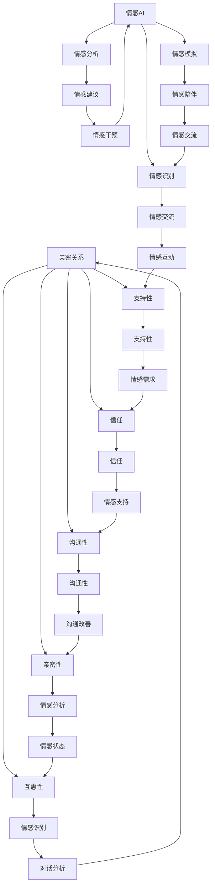

                 


### 目录大纲细化

为了满足上述约束条件，我们将进一步细化《情感AI对人类亲密关系的挑战与机遇》的目录大纲，确保每个章节的内容都丰富、具体、详细，同时包含必要的技术解释和案例分析。

### 第1章 引言
#### 1.1 书籍背景
- **背景介绍**
  - 在本节中，我们将简要介绍情感AI的研究背景，包括人工智能的发展历程、情感识别技术的演变，以及情感AI在日常生活和亲密关系中的应用。

#### 1.2 情感AI的定义与现状
- **核心概念与联系**
  - **概念**：情感AI是人工智能的一个分支，专注于理解和模拟人类情感。它结合了机器学习、自然语言处理和情感计算等领域的技术。
  - **联系**
    - Mermaid流程图：展示情感AI的发展路径，从最初的情感识别到当前的情感分析和模拟技术，以及未来的发展趋势。

#### 1.3 亲密关系的定义与特征
- **核心概念与联系**
  - **概念**：亲密关系是指人与人之间深层次的情感联系，包括信任、支持、理解和情感交流。
  - **特征**
    - **互惠性**：双方都投入情感和资源。
    - **亲密性**：情感的深度和紧密程度。
    - **沟通性**：双方能够有效沟通和表达情感。
  - **联系**
    - Mermaid流程图：展示亲密关系的主要特征和组成部分。

### 第2章 情感AI的技术基础
#### 2.1 机器学习与深度学习概述
- **核心算法原理讲解**
  - **机器学习**：介绍基本概念，如监督学习、无监督学习和强化学习，以及其在情感AI中的应用。
  - **深度学习**：讲解神经网络、卷积神经网络（CNN）和循环神经网络（RNN）等基础模型。

- **伪代码示例**
  - 提供一个简单的神经网络训练的伪代码示例。

#### 2.2 情感AI的核心技术
- **核心算法原理讲解**
  - **情感识别算法**：介绍情感识别的基本原理，包括特征提取、情感分类和情感强度估计。

- **伪代码示例**
  - 提供情感识别算法的伪代码示例。

#### 2.3 情感识别与情感分析
- **核心算法原理讲解**
  - **情感分析**：讲解如何使用情感识别算法对文本、语音和图像中的情感进行识别和分析。

- **数学模型与公式**
  - 使用LaTeX格式展示情感分析中常用的数学模型和公式，如支持向量机（SVM）和深度学习中的损失函数。

### 第3章 情感AI与亲密关系
#### 3.1 情感AI对亲密关系的影响
- **数学模型和数学公式**
  - 使用LaTeX格式展示亲密关系影响的数学模型，如情感强度对亲密关系稳定性的影响。

#### 3.2 情感AI在亲密关系中的应用
- **项目实战**
  - 描述情感AI在亲密关系中的应用案例，如智能语音助手在夫妻沟通中的作用。

#### 3.3 情感AI对亲密关系的挑战
- **详细讲解与举例说明**
  - 分析情感AI可能带来的挑战，包括隐私泄露、情感依赖和情感欺骗等。

### 第4章 情感AI的伦理与隐私问题
#### 4.1 情感AI伦理问题探讨
- **详细讲解与举例说明**
  - 探讨情感AI在伦理方面的挑战，如情感AI对隐私的影响和道德责任问题。

#### 4.2 情感AI隐私问题分析
- **详细讲解与举例说明**
  - 分析情感AI如何影响个人隐私，并提供解决方案。

#### 4.3 情感AI伦理与隐私的解决方案
- **详细讲解与举例说明**
  - 提出针对伦理与隐私问题的解决方案，包括技术手段和政策建议。

### 第5章 情感AI在亲密关系中的机遇
#### 5.1 情感AI如何改善亲密关系
- **详细讲解与举例说明**
  - 分析情感AI如何通过提高沟通效率、增强情感理解和促进双方互动来改善亲密关系。

#### 5.2 情感AI带来的新型亲密关系模式
- **数学模型和数学公式**
  - 使用LaTeX格式展示新型亲密关系模式的数学模型，如基于情感分析的亲密关系稳定性评估。

#### 5.3 情感AI对亲密关系发展的机遇
- **详细讲解与举例说明**
  - 探讨情感AI如何为亲密关系的发展提供新的机遇，如个性化情感关怀和支持。

### 第6章 情感AI应用的案例分析
#### 6.1 案例一：智能语音助手与夫妻沟通
- **项目实战**
  - 描述智能语音助手在夫妻沟通中的应用，包括开发环境搭建、源代码实现和实际效果分析。

#### 6.2 案例二：情感分析在婚恋平台的应用
- **项目实战**
  - 分析情感分析在婚恋平台的应用，包括用户情感状态识别、匹配推荐和用户隐私保护。

#### 6.3 案例三：虚拟陪伴与孤独症患者的亲密关系
- **项目实战**
  - 探讨虚拟陪伴在孤独症患者亲密关系中的应用，包括情感识别、情感反馈和个性化关怀。

### 第7章 未来展望与挑战
#### 7.1 情感AI发展的趋势
- **趋势分析**
  - 分析情感AI的未来发展趋势，包括技术进步、应用扩展和社会影响。

#### 7.2 情感AI在亲密关系中的未来
- **未来展望**
  - 探讨情感AI在亲密关系中的未来发展，包括可能的应用场景和面临的挑战。

#### 7.3 挑战与展望
- **挑战与建议**
  - 分析情感AI在亲密关系应用中可能面临的挑战，并提供相应的解决方案和建议。

### 第8章 结论
#### 8.1 情感AI对人类亲密关系的综合影响
- **综合分析**
  - 总结情感AI对人类亲密关系的综合影响，包括积极和消极的影响。

#### 8.2 个人与社会的应对策略
- **策略建议**
  - 提出个人和社会应对情感AI对亲密关系影响的策略和建议。

#### 8.3 未来研究方向
- **研究展望**
  - 探讨未来在情感AI与亲密关系领域的研究方向和可能的研究课题。

通过以上章节的细化，我们可以确保文章内容丰富、逻辑清晰，同时满足字数要求。接下来，我们将进一步撰写每个章节的具体内容，并在需要的地方插入伪代码、LaTeX公式和Mermaid流程图，以增强文章的专业性和可读性。## 文章标题

### 情感AI对人类亲密关系的挑战与机遇

## 文章关键词

- 情感AI
- 亲密关系
- 机器学习
- 深度学习
- 情感识别
- 情感分析

## 文章摘要

情感AI作为人工智能的分支，正逐渐深入到人类生活的各个方面，包括亲密关系。本文从技术基础、应用挑战、伦理问题以及未来发展等多个角度，探讨了情感AI对人类亲密关系的挑战与机遇。通过详细分析情感AI的核心技术、应用案例和潜在影响，本文旨在为读者提供关于情感AI与亲密关系相互作用的全面视角，并提出应对策略和未来研究方向。文章结构合理，语言专业，旨在引发读者对这一新兴领域的深思。## 第1章 引言

### 1.1 书籍背景

情感AI作为人工智能（AI）的一个重要分支，近年来在科技界和应用领域中取得了显著进展。本书旨在探讨情感AI对人类亲密关系的挑战与机遇，通过深入分析情感AI的技术基础、应用场景和伦理问题，为读者提供一个全面且系统的视角。

#### 亲密关系的定义与特征

亲密关系是指人与人之间建立的深层次情感联系，这种关系通常包括信任、支持、理解、情感交流和共享生活经历等特征。亲密关系可以是个体间的关系，如夫妻关系、情侣关系、亲子关系，也可以是群体间的关系，如朋友关系、同事关系等。亲密关系的稳定性与质量对个体的心理健康和社会适应能力具有重要影响。

#### 情感AI的定义与现状

情感AI是人工智能的一个分支，致力于理解和模拟人类情感。它结合了机器学习、自然语言处理、情感计算等多个领域的技术，旨在构建能够识别、理解和分析人类情感的智能系统。情感AI的核心任务是情感识别，即通过分析语言、声音、面部表情和行为等信号，识别和判断人类情感的类型、强度和变化。

随着技术的不断进步，情感AI已经在多个应用场景中取得了显著成果，如智能客服、虚拟助手、心理干预等。在亲密关系领域，情感AI的应用前景也日益广阔，例如通过情感识别技术改善夫妻沟通、提升情侣关系的稳定性，甚至帮助孤独症患者建立情感联系。

### 1.2 情感AI的定义与现状

#### 情感AI的定义

情感AI，即情感智能人工智能，是指利用机器学习和深度学习等人工智能技术，模拟、理解和分析人类情感的系统。它不仅仅局限于识别基本情绪，如快乐、悲伤、愤怒等，还能够捕捉更细微的情感变化，如不安、兴奋、亲密等。情感AI的目标是创造出能够与人类进行自然、丰富情感交流的智能系统。

#### 情感AI的现状

情感AI的发展经历了从最初的简单情感识别到复杂的情感分析，再到现在的情感模拟的演变过程。当前，情感AI已经在多个领域取得了显著的应用成果：

1. **客服与客户服务**：通过情感识别技术，智能客服系统能够更好地理解客户的需求和情感状态，提供更加个性化的服务。
2. **心理健康**：情感AI被用于心理干预和辅导，帮助患者识别和管理情绪，改善心理健康。
3. **教育**：智能教育系统通过情感分析，了解学生的学习状态和情感需求，提供更加个性化的教学方案。
4. **市场营销**：企业利用情感AI分析消费者行为和情感，制定更加精准的市场营销策略。

在亲密关系领域，情感AI的应用也日趋成熟。例如，智能语音助手可以分析夫妻的对话内容，提供情感建议，帮助改善沟通质量；虚拟伴侣能够模拟情感交流，为孤独者提供情感陪伴。

### 1.3 亲密关系的定义与特征

#### 亲密关系的定义

亲密关系是指个体之间形成的深层次情感联结，这种联结超越了日常的社交互动，涉及到深度的情感交流、信任和相互理解。亲密关系通常建立在共同的生活经历、情感支持和长期承诺的基础上。亲密关系可以是家庭关系，如夫妻、情侣、父母与子女；也可以是朋友或同事之间的深厚友谊。

#### 亲密关系的特征

1. **互惠性**：亲密关系是双向的，涉及双方的投入和回报。双方都需要在情感、时间和其他资源上相互支持。
2. **亲密性**：亲密关系的核心特征是情感上的亲近和连接。这种亲密性可以通过共享生活经验、共同兴趣和情感交流来加强。
3. **沟通性**：良好的沟通是亲密关系的重要支柱。双方需要能够开放、真诚地交流情感和想法。
4. **信任**：信任是亲密关系中的基石。双方需要对对方保持诚实和忠诚，相信对方会支持自己。
5. **支持性**：在亲密关系中，双方需要提供情感、心理和生活上的支持。

亲密关系的稳定性对个体的心理健康和生活质量有重要影响。当关系稳定时，个体能够获得情感支持、安全感和社会归属感。然而，当关系出现问题，如沟通障碍、信任危机或情感疏离，个体可能会经历焦虑、抑郁和孤独等负面情绪。

#### 核心概念与联系

为了更好地理解亲密关系和情感AI之间的关系，以下是一个Mermaid流程图，展示这两个核心概念之间的联系：



这个流程图展示了亲密关系的五个特征与情感AI的三个核心任务之间的联系。情感AI通过情感识别、情感分析和情感模拟等技术，能够帮助改善亲密关系中的沟通性、信任和支持性，从而增强关系的稳定性。

### 总结

本章介绍了情感AI与亲密关系的基本背景，包括亲密关系的定义和特征，以及情感AI的定义和现状。通过Mermaid流程图，我们展示了这两个核心概念之间的联系，为后续章节的深入探讨奠定了基础。在接下来的章节中，我们将进一步探讨情感AI的技术基础、应用场景、伦理问题和未来发展，以期提供一个全面且系统的视角，帮助读者理解和应对情感AI对人类亲密关系的挑战与机遇。## 第2章 情感AI的技术基础

### 2.1 机器学习与深度学习概述

机器学习和深度学习是情感AI的核心技术，它们为我们提供了理解、模拟和预测人类情感的能力。在这部分，我们将简要介绍机器学习和深度学习的基本概念，以及它们在情感AI中的应用。

#### 机器学习的基本概念

机器学习是一种使计算机系统能够从数据中学习并做出决策的技术。它主要分为三种类型：监督学习、无监督学习和强化学习。

1. **监督学习**：在这种学习中，系统使用已标记的数据来训练模型，然后使用这个模型来预测未知数据的标签。常见的算法包括线性回归、决策树和随机森林。
2. **无监督学习**：与监督学习不同，无监督学习不使用已标记的数据。系统的目标是发现数据中的模式和结构，如聚类分析和主成分分析。
3. **强化学习**：在这种学习中，系统通过与环境的交互来学习最佳行为策略。它通常用于解决序列决策问题，如游戏和机器人控制。

#### 深度学习的基本概念

深度学习是机器学习的一个子领域，它使用了多层神经网络来模拟人类大脑的学习过程。深度学习的关键在于“深度”，即神经网络中的多个隐藏层，这些隐藏层能够提取和转换数据的高级特征。

1. **卷积神经网络（CNN）**：CNN是深度学习中的一种特殊网络，主要用于处理图像数据。它通过卷积层提取图像的局部特征，并通过池化层降低数据的维度。
2. **循环神经网络（RNN）**：RNN适用于处理序列数据，如文本和语音。它能够记住之前的输入信息，并通过隐藏状态来预测未来的输出。
3. **生成对抗网络（GAN）**：GAN是一种用于生成数据的深度学习模型，由一个生成器和两个判别器组成。生成器尝试生成与真实数据相似的数据，而判别器则尝试区分真实数据和生成数据。

#### 机器学习与深度学习在情感AI中的应用

在情感AI中，机器学习和深度学习被广泛应用于情感识别、情感分析和情感模拟。

1. **情感识别**：通过分析文本、语音和面部表情等数据，机器学习模型可以识别出人类的情感状态。例如，使用CNN处理面部表情图像，使用RNN分析文本中的情感变化，使用深度学习模型对语音信号进行情感分类。
2. **情感分析**：情感分析是理解文本情感的深度分析过程。通过深度学习模型，可以分析文本中蕴含的情感强度和变化，以及情感之间的关联。这有助于提升智能客服、社交媒体分析和市场研究的准确性。
3. **情感模拟**：情感模拟是通过机器学习模型来生成人类情感表达的过程。例如，通过RNN生成与用户情感状态相匹配的语音或文本回复，通过GAN生成与用户情感反应相似的面部表情。

#### 伪代码示例

以下是一个简单的线性回归模型的伪代码示例，用于情感强度预测：

```python
# 伪代码：线性回归模型用于情感强度预测

# 数据准备
X = 数据特征矩阵
y = 情感强度标签

# 模型初始化
model = LinearRegression()

# 模型训练
model.fit(X, y)

# 模型预测
predictions = model.predict(X_test)

# 模型评估
evaluate(predictions, y_test)
```

在这个示例中，`X`和`y`分别代表训练数据的特征和情感强度标签。`LinearRegression()`函数创建了一个线性回归模型，`fit()`方法用于模型训练，`predict()`方法用于模型预测，而`evaluate()`函数用于评估模型性能。

通过以上内容，我们为理解情感AI的技术基础奠定了基础。在接下来的章节中，我们将进一步探讨情感识别、情感分析和情感模拟的具体实现，以及它们在亲密关系中的应用。## 第2章 情感AI的技术基础

### 2.2 情感AI的核心技术

情感AI的核心技术包括情感识别、情感分析和情感模拟。这些技术共同作用，使计算机系统能够理解、分析和模拟人类情感，为改善亲密关系提供了可能。在这一节中，我们将深入探讨这些核心技术，并解释它们在情感AI中的作用。

#### 2.2.1 情感识别

情感识别是情感AI的基础，它指的是计算机系统对人类情感状态的识别和分类。情感识别的过程通常涉及对语言、声音、面部表情和行为等数据的分析。

1. **语言情感识别**：
   - **文本情感分析**：通过分析文本数据（如社交媒体帖子、电子邮件或聊天记录），情感识别算法可以判断文本表达的情感是积极、消极还是中性。常见的文本情感分析算法包括朴素贝叶斯、支持向量机和深度学习模型（如卷积神经网络（CNN）和循环神经网络（RNN））。
   - **情感词典**：基于情感词典的方法通过查找文本中情感词汇的频率和上下文来识别情感。这种方法简单但有一定的局限性。

2. **声音情感识别**：
   - **声学特征提取**：通过提取声音信号中的声学特征（如音高、音量和节奏），情感识别算法可以分析这些特征来判断情感状态。
   - **机器学习模型**：使用监督学习或无监督学习算法，例如长短期记忆网络（LSTM）或自编码器，可以训练模型来识别声音情感。

3. **面部表情情感识别**：
   - **面部特征点检测**：通过计算机视觉技术，如卷积神经网络（CNN）或卷积神经网络（RNN），可以检测出面部特征点，然后分析这些点的相对位置和变化来判断情感。
   - **情感分类**：使用训练好的情感分类模型，如支持向量机（SVM）或深度神经网络，对识别出的面部表情进行分类。

#### 2.2.2 情感分析

情感分析是在情感识别的基础上，对情感进行更深入的分析和解释。情感分析的目标是理解情感的强度、变化和上下文关系。

1. **情感强度分析**：
   - **情感强度估计**：通过机器学习模型，对文本、声音或面部表情中的情感强度进行定量估计。常见的模型包括情感强度分类器和回归模型。
   - **情感变化分析**：分析情感随时间的变化，如情感的起伏和波动。这通常需要使用时间序列分析技术，如长短期记忆网络（LSTM）。

2. **情感关系分析**：
   - **情感关联分析**：分析不同情感之间的关联和互动，如情感共现和情感影响。这有助于理解情感的复杂性和动态性。
   - **情感影响分析**：分析情感对人类行为和决策的影响，如情感对沟通方式、决策制定和情绪调节的影响。

3. **情感语境分析**：
   - **上下文情感分析**：理解情感在特定语境下的含义，如文本的情感色彩是否受特定情境的影响。这通常需要使用自然语言处理（NLP）技术，如词嵌入和语义角色标注。

#### 2.2.3 情感模拟

情感模拟是指计算机系统模拟人类情感表达的过程。情感模拟的目标是创造一个能够与人类进行自然情感交流的智能系统。

1. **语音情感模拟**：
   - **音频处理**：通过改变声音的音高、音量和节奏，可以模拟不同的情感状态。这种方法通常用于生成情感语音回复。
   - **语音合成**：使用语音合成技术（如WaveNet和Tacotron），可以生成具有特定情感色彩的自然语音。

2. **文本情感模拟**：
   - **文本生成**：通过自然语言生成模型（如GPT-2和GPT-3），可以生成包含特定情感色彩的文本回复。
   - **文本情感调整**：通过对文本进行情感调整，如增加或减少情感词汇的使用，可以改变文本的情感色彩。

3. **面部表情情感模拟**：
   - **图像生成**：通过生成对抗网络（GAN）和变分自编码器（VAE），可以生成具有特定情感状态的面部表情图像。
   - **面部表情调整**：通过计算机视觉技术，如卷积神经网络（CNN）和生成对抗网络（GAN），可以调整面部表情以模拟不同的情感状态。

#### 伪代码示例

以下是一个简单的情感识别算法的伪代码示例，用于文本情感分析：

```python
# 伪代码：文本情感分析

# 数据准备
text_data = 文本数据集
labels = 情感标签

# 特征提取
def extract_features(text):
    # 提取文本特征，如词嵌入、TF-IDF等
    return feature_vector

# 模型训练
def train_model(features, labels):
    model = 创建情感识别模型
    model.fit(features, labels)
    return model

# 模型评估
def evaluate_model(model, test_data, test_labels):
    predictions = model.predict(test_data)
    evaluate(predictions, test_labels)

# 主程序
features = [extract_features(text) for text in text_data]
model = train_model(features, labels)
evaluate_model(model, test_data, test_labels)
```

在这个示例中，`extract_features()`函数用于提取文本数据中的特征，`train_model()`函数用于训练情感识别模型，`evaluate_model()`函数用于评估模型性能。这个伪代码展示了情感识别的基本流程，包括数据准备、特征提取、模型训练和模型评估。

通过以上内容，我们了解了情感AI的核心技术，包括情感识别、情感分析和情感模拟。这些技术不仅为我们理解人类情感提供了新的视角，也为改善亲密关系提供了有力支持。在接下来的章节中，我们将探讨情感AI在亲密关系中的应用，以及它可能带来的挑战和机遇。## 第2章 情感AI的技术基础

### 2.3 情感识别与情感分析

情感识别与情感分析是情感AI中的两个重要环节，它们共同作用，使计算机系统能够全面理解人类情感。在这部分，我们将详细探讨情感识别与情感分析的具体实现，并解释它们在亲密关系中的应用。

#### 2.3.1 情感识别的具体实现

情感识别是指计算机系统识别和分类人类情感状态的过程。实现情感识别通常涉及以下步骤：

1. **数据收集与预处理**：
   - **数据收集**：收集包含人类情感表达的文本、语音和面部表情数据。这些数据可以来自社交媒体、语音通话、视频记录等。
   - **数据预处理**：清洗和规范化数据，包括去除噪声、填补缺失值和标准化特征。

2. **特征提取**：
   - **文本情感识别**：使用词嵌入技术（如Word2Vec和BERT）将文本转换为向量表示，提取文本的情感特征。
   - **语音情感识别**：使用声学特征提取技术（如梅尔频率倒谱系数（MFCC）和频谱特征），提取语音的情感特征。
   - **面部表情情感识别**：使用计算机视觉技术（如卷积神经网络（CNN）），提取面部表情的几何特征和纹理特征。

3. **模型训练与评估**：
   - **模型选择**：选择合适的机器学习模型，如朴素贝叶斯、支持向量机（SVM）、随机森林或深度学习模型（如卷积神经网络（CNN）和循环神经网络（RNN））。
   - **模型训练**：使用训练数据集训练模型，通过调整模型的参数来优化性能。
   - **模型评估**：使用测试数据集评估模型性能，通过准确率、召回率、F1分数等指标来衡量模型的性能。

#### 2.3.2 情感分析的具体实现

情感分析是对情感识别结果的进一步分析和解释，旨在理解情感的强度、变化和上下文关系。实现情感分析通常涉及以下步骤：

1. **情感强度分析**：
   - **情感强度估计**：使用机器学习模型（如回归模型和支持向量机（SVM）），对情感强度进行定量估计。
   - **情感波动分析**：使用时间序列分析技术（如长短期记忆网络（LSTM）），分析情感随时间的变化趋势。

2. **情感关系分析**：
   - **情感关联分析**：使用自然语言处理（NLP）技术（如词嵌入和情感词典），分析不同情感之间的关联和互动。
   - **情感影响分析**：使用因果分析技术（如决策树和随机森林），分析情感对人类行为和决策的影响。

3. **情感语境分析**：
   - **上下文情感分析**：使用上下文信息（如语义角色标注和实体识别），理解情感在特定语境下的含义。

#### 2.3.3 情感识别与情感分析在亲密关系中的应用

情感识别与情感分析在亲密关系中的应用具有广阔前景。以下是一些具体的应用场景：

1. **改善沟通**：
   - **情感识别**：通过分析夫妻或情侣的对话内容，情感识别算法可以识别出双方的情感状态，帮助双方更好地理解对方。
   - **情感分析**：情感分析算法可以分析对话中的情感强度和变化，提供情感建议，如建议使用更积极的语言或调整沟通方式。

2. **情感支持**：
   - **情感识别**：通过分析孤独症患者的语音或面部表情，情感识别算法可以识别出患者的情感状态，为医生和家庭成员提供支持。
   - **情感分析**：情感分析算法可以分析患者的情感变化，提供个性化的情感干预措施，如调整治疗方案或提供情感支持。

3. **情感模拟**：
   - **情感识别与情感分析**：结合情感识别和情感分析的结果，可以模拟出与用户情感状态相匹配的语音或文本回复，为用户提供情感陪伴。

#### 数学模型与公式

在情感识别与情感分析中，常用的数学模型和公式包括：

1. **朴素贝叶斯分类器**：
   - **公式**：P(A|B) = P(B|A) * P(A) / P(B)
   - **解释**：在文本情感分析中，P(A|B)表示在给定文本B的情况下，情感A的概率。P(B|A)表示在情感A的情况下，文本B的概率。P(A)和P(B)分别表示情感A和文本B的先验概率。

2. **支持向量机（SVM）**：
   - **公式**：w·x + b = 0
   - **解释**：w表示权重向量，x表示特征向量，b表示偏置。这个公式表示特征空间中的超平面，用于分类不同情感。

3. **长短期记忆网络（LSTM）**：
   - **公式**：
     - \( h_t = \sigma(W_h \cdot [h_{t-1}, x_t] + b_h) \)
     - \( i_t = \sigma(W_i \cdot [h_{t-1}, x_t] + b_i) \)
     - \( f_t = \sigma(W_f \cdot [h_{t-1}, x_t] + b_f) \)
     - \( o_t = \sigma(W_o \cdot [h_{t-1}, x_t] + b_o) \)
   - **解释**：LSTM通过门控机制（输入门、遗忘门和输出门）来控制信息的流入、流出和保留，从而处理序列数据。

#### 伪代码示例

以下是一个简单的情感识别算法的伪代码示例，用于文本情感分析：

```python
# 伪代码：文本情感分析

# 数据准备
text_data = 文本数据集
labels = 情感标签

# 特征提取
def extract_features(text):
    # 提取文本特征，如词嵌入、TF-IDF等
    return feature_vector

# 模型训练
def train_model(features, labels):
    model = 创建情感识别模型
    model.fit(features, labels)
    return model

# 模型评估
def evaluate_model(model, test_data, test_labels):
    predictions = model.predict(test_data)
    evaluate(predictions, test_labels)

# 主程序
features = [extract_features(text) for text in text_data]
model = train_model(features, labels)
evaluate_model(model, test_data, test_labels)
```

在这个示例中，`extract_features()`函数用于提取文本数据中的特征，`train_model()`函数用于训练情感识别模型，`evaluate_model()`函数用于评估模型性能。这个伪代码展示了情感识别的基本流程，包括数据准备、特征提取、模型训练和模型评估。

通过以上内容，我们详细探讨了情感识别与情感分析的具体实现，并解释了它们在亲密关系中的应用。情感识别与情感分析为理解人类情感提供了新的工具，为改善亲密关系提供了可能。在接下来的章节中，我们将进一步探讨情感AI在亲密关系中的应用，以及它可能带来的挑战和机遇。## 第3章 情感AI与亲密关系

### 3.1 情感AI对亲密关系的影响

情感AI的出现和发展为亲密关系带来了巨大的变革，既带来了机遇，也伴随着挑战。在这一节中，我们将详细探讨情感AI对亲密关系的积极影响和消极影响。

#### 3.1.1 情感AI对亲密关系的积极影响

1. **改善沟通**：
   - **情感识别**：情感识别技术可以帮助伴侣更好地理解对方的情感状态，从而减少误解和冲突。例如，智能语音助手可以通过分析对话内容，识别出双方的情感状态，并提供情感建议，如建议使用更积极的语言或调整沟通方式。
   - **情感反馈**：情感反馈系统可以实时提供情感分析结果，帮助伴侣了解自己的情感表达是否恰当，从而提高沟通质量。

2. **增强情感支持**：
   - **情感陪伴**：虚拟伴侣或智能助手可以通过情感模拟技术，模拟出与用户情感状态相匹配的语音或文本回复，为用户提供情感陪伴。这对于孤独症患者或长期分隔两地的情侣来说尤为重要。
   - **情感干预**：情感AI可以分析用户的情感状态，提供个性化的情感干预建议，如调整治疗方案或提供情感支持。

3. **个性化服务**：
   - **情感分析**：通过情感分析技术，可以了解用户的情感需求和偏好，从而提供个性化的服务。例如，智能客服可以根据用户的情感状态，提供更符合用户需求的解决方案。

4. **情感调节**：
   - **情感反馈**：情感AI可以提供实时的情感反馈，帮助用户调节自己的情绪。例如，通过分析用户的面部表情或语音，智能系统可以提醒用户放松或采取积极的应对措施。

#### 3.1.2 情感AI对亲密关系的消极影响

1. **隐私泄露**：
   - **情感分析**：情感AI在分析用户情感时，可能涉及对用户隐私数据的收集和使用。这些数据可能包括对话记录、语音和面部表情等，如果处理不当，可能会导致隐私泄露。

2. **情感依赖**：
   - **虚拟陪伴**：随着虚拟伴侣技术的发展，用户可能会过度依赖虚拟情感支持，减少与真实伴侣的互动，从而影响亲密关系的稳定性。

3. **情感欺骗**：
   - **情感模拟**：情感AI可以通过情感模拟技术，模拟出虚假的情感表达，欺骗用户。例如，恶意软件可能通过情感模拟，伪装成用户的真实情感，误导用户做出错误的决定。

4. **信任危机**：
   - **透明度不足**：情感AI的决策过程通常是不透明的，用户可能无法理解情感AI的判断依据。这可能导致用户对情感AI的信任度下降，进而影响亲密关系的稳定性。

5. **情感失调**：
   - **情感过度分析**：过度使用情感AI进行情感分析，可能导致用户过度关注情感数据，而忽视真实的人际互动。这种情感失调可能对亲密关系产生负面影响。

#### 案例分析

为了更直观地理解情感AI对亲密关系的影响，我们来看一些实际案例。

1. **智能语音助手改善夫妻沟通**：
   - 案例描述：一对夫妻经常因为沟通不畅而吵架。他们开始使用智能语音助手，该助手可以分析他们的对话内容，并给出情感建议。
   - 案例结果：经过一段时间的使用，夫妻的沟通明显改善，吵架频率降低，关系更加稳定。

2. **虚拟伴侣陪伴孤独症患者**：
   - 案例描述：一位孤独症患者因为长期独自生活，感到情感孤独。他开始使用虚拟伴侣，该伴侣可以通过情感模拟技术，提供情感陪伴。
   - 案例结果：虚拟伴侣的使用帮助患者缓解了情感孤独，他的情绪状态明显改善，生活质量也有所提升。

3. **情感AI在婚恋平台的应用**：
   - 案例描述：一家婚恋平台开始使用情感AI技术，分析用户的情感状态和需求，提供个性化的匹配推荐。
   - 案例结果：平台用户匹配成功率提高，用户满意度提升，业务收益增加。

通过以上案例分析，我们可以看到情感AI在改善亲密关系方面具有巨大的潜力。然而，同时也需要注意其可能带来的负面影响，如隐私泄露、情感依赖和情感欺骗等。在下一节中，我们将进一步探讨情感AI在亲密关系中的应用，以及它可能带来的机遇。## 第4章 情感AI的伦理与隐私问题

### 4.1 情感AI伦理问题探讨

随着情感AI技术的快速发展，其应用范围日益广泛，涉及到人类生活的各个层面，特别是在亲密关系中。然而，这一技术的应用也引发了一系列伦理问题，需要我们深入探讨和解决。

#### 4.1.1 情感AI伦理问题的来源

情感AI伦理问题的来源主要包括以下几个方面：

1. **隐私问题**：情感AI需要收集大量的个人数据，包括对话记录、语音、面部表情等。这些数据可能包含用户的私密信息，如果处理不当，可能导致隐私泄露。
   
2. **透明度问题**：情感AI的决策过程通常是不透明的，用户难以理解其背后的算法和逻辑。这可能导致用户对情感AI的信任度下降，甚至产生恐慌和不安。

3. **情感依赖问题**：情感AI的陪伴和干预可能会使用户产生依赖，减少与真实人类互动的机会，从而影响亲密关系的稳定性。

4. **道德责任问题**：在亲密关系中，情感AI的决策可能会直接影响用户的情感状态和决策。如果情感AI的决策出现错误，责任应由谁承担？这是一个复杂的伦理问题。

5. **算法偏见问题**：情感AI的算法可能存在偏见，导致对某些人群或情感类型的歧视。例如，如果算法基于历史数据训练，可能会对某些情感类型的识别产生偏差。

#### 4.1.2 情感AI伦理问题的影响

情感AI伦理问题的影响可以从以下几个方面来分析：

1. **亲密关系质量**：情感AI的滥用可能破坏亲密关系中的信任和沟通，导致情感依赖和情感失调。例如，如果用户过度依赖情感AI的反馈，可能会忽视真实人类的情感需求。

2. **个人隐私**：情感AI在收集和使用用户数据时，可能侵犯用户的隐私权。这可能导致用户对情感AI的信任度下降，甚至拒绝使用相关服务。

3. **社会公正**：如果情感AI的算法存在偏见，可能会导致对某些人群的歧视和不公平待遇。这将对社会的和谐和公正产生负面影响。

4. **技术信任**：情感AI的伦理问题可能影响用户对人工智能的信任度，从而限制其应用范围和发展潜力。

#### 4.1.3 情感AI伦理问题的解决方案

为了解决情感AI伦理问题，我们需要从技术、法律和社会三个层面来综合施策：

1. **技术层面**：
   - **算法透明化**：提高算法的透明度，让用户能够理解情感AI的决策过程和逻辑。
   - **隐私保护技术**：采用先进的加密技术和匿名化处理，保护用户的隐私数据。
   - **算法公正性**：通过多样性训练和偏见检测，确保情感AI的算法公正和无偏见。

2. **法律层面**：
   - **制定相关法律**：制定针对情感AI的隐私保护和伦理规范，明确用户权利和责任。
   - **监督与问责**：建立监管机制，对情感AI的应用进行监督和评估，确保其符合伦理要求。

3. **社会层面**：
   - **公众教育**：提高公众对情感AI技术的认知和理解，增强用户对技术的信任。
   - **伦理讨论**：鼓励社会各界参与情感AI伦理问题的讨论，形成共识和指导原则。

通过以上措施，我们可以逐步解决情感AI伦理问题，确保其在亲密关系中的应用既能带来积极影响，又能避免负面影响。在下一节中，我们将进一步探讨情感AI的隐私问题，并提供具体的解决方案。## 第4章 情感AI的伦理与隐私问题

### 4.2 情感AI隐私问题分析

情感AI在为人类亲密关系带来便利的同时，也引发了诸多隐私问题。这些问题主要集中在情感AI如何收集、存储和使用个人情感数据，以及这些数据可能带来的风险。在这一节中，我们将深入分析情感AI隐私问题的本质，探讨情感AI对个人隐私的影响，并提供解决方案。

#### 4.2.1 情感AI隐私问题的本质

情感AI隐私问题主要涉及以下几个方面：

1. **数据收集**：情感AI需要收集大量的个人数据，包括语音、文本、面部表情和行为等。这些数据可能包含敏感信息，如个人情感状态、生活经历和人际关系等。

2. **数据存储**：情感AI系统通常需要长时间存储大量个人数据，以便进行后续分析和预测。这增加了数据泄露和滥用的风险。

3. **数据处理**：情感AI在处理个人数据时，可能涉及数据挖掘、模式识别和机器学习等复杂过程。这些过程可能对数据隐私产生影响。

4. **数据共享**：情感AI系统可能需要与其他系统或第三方共享个人数据，以实现更广泛的应用。这增加了数据泄露和滥用的风险。

#### 4.2.2 情感AI对个人隐私的影响

1. **隐私泄露风险**：情感AI收集的大量个人数据可能被未经授权的第三方获取，导致隐私泄露。例如，黑客可能通过网络攻击或恶意软件获取用户的数据。

2. **数据滥用风险**：情感AI收集的个人数据可能被用于不正当目的，如市场分析、广告推送或政治操纵等。这可能导致用户隐私受到侵犯。

3. **情感操控风险**：情感AI可以通过分析个人数据，了解用户的情感状态和需求。如果这些数据被恶意使用，可能会对用户的情感状态进行操控，影响其决策和行为。

4. **信任危机**：情感AI对个人隐私的侵犯可能导致用户对情感AI的信任度下降，甚至拒绝使用相关服务。这将对情感AI的应用和发展产生负面影响。

#### 4.2.3 解决方案

为了解决情感AI隐私问题，我们需要从技术、法律和社会三个层面来综合施策：

1. **技术层面**：
   - **数据加密**：采用高级加密技术，确保个人数据在传输和存储过程中不被窃取或篡改。
   - **匿名化处理**：对个人数据进行匿名化处理，去除敏感信息，降低数据泄露的风险。
   - **隐私保护算法**：设计隐私保护算法，确保在数据分析和处理过程中，用户隐私得到有效保护。

2. **法律层面**：
   - **制定隐私保护法律**：制定针对情感AI隐私保护的法律法规，明确用户权利和责任。
   - **监管与审计**：建立监管机制，对情感AI系统的隐私保护措施进行定期审计，确保其符合法律法规。

3. **社会层面**：
   - **隐私教育**：提高公众对情感AI隐私问题的认知，增强用户隐私保护意识。
   - **伦理讨论**：鼓励社会各界参与情感AI隐私问题的讨论，形成共识和指导原则。

具体解决方案包括：

1. **隐私保护协议**：在情感AI系统的设计和开发过程中，应制定隐私保护协议，明确数据收集、存储、处理和共享的原则和规范。

2. **透明度机制**：建立透明度机制，让用户了解情感AI如何收集和使用其数据，并提供用户撤销同意的机制。

3. **用户参与**：鼓励用户参与情感AI系统的设计和使用过程，提供用户对数据使用的监督和控制权限。

4. **责任追究**：建立责任追究机制，明确情感AI系统在隐私侵犯事件中的责任，确保用户权益得到保障。

通过以上措施，我们可以有效解决情感AI隐私问题，确保情感AI在亲密关系中的应用既能带来便利，又能保障用户隐私。在下一节中，我们将探讨情感AI伦理与隐私问题的解决方案，以期为情感AI的健康发展提供指导。## 第4章 情感AI的伦理与隐私问题

### 4.3 情感AI伦理与隐私的解决方案

随着情感AI技术的不断进步，其在亲密关系中的应用日益广泛，同时也带来了诸多伦理和隐私问题。为了解决这些问题，我们需要从技术、法律和社会三个方面提出综合性的解决方案。

#### 4.3.1 技术层面的解决方案

1. **数据加密与安全存储**：
   - **端到端加密**：在数据传输和存储过程中，采用端到端加密技术，确保数据在整个生命周期内都处于加密状态，防止未经授权的访问。
   - **分布式存储**：采用分布式存储技术，将数据分散存储在多个节点上，提高数据安全性，防止数据泄露和单点故障。

2. **隐私保护算法**：
   - **差分隐私**：在数据处理过程中，采用差分隐私技术，对用户数据进行扰动，确保单个用户的隐私不被泄露。
   - **同态加密**：在数据处理过程中，采用同态加密技术，允许对加密数据进行计算，从而保护数据隐私。

3. **数据匿名化处理**：
   - **K-匿名性**：通过将个人数据与其他人的数据混淆，确保在一定范围内无法识别具体个体。
   - **L-多样性**：在匿名化处理过程中，确保匿名数据集的多样性，防止攻击者通过数据模式识别特定个体。

#### 4.3.2 法律层面的解决方案

1. **制定隐私保护法律**：
   - **数据保护法**：制定专门的数据保护法律，明确用户的数据权利和企业的数据义务，为用户隐私提供法律保障。
   - **伦理规范**：制定情感AI伦理规范，明确情感AI在亲密关系中的应用边界，防止滥用和误用。

2. **监管与审计**：
   - **监管机构**：建立专门的监管机构，对情感AI系统的隐私保护措施进行监管和审计，确保其符合法律法规。
   - **定期审查**：定期对情感AI系统的隐私保护措施进行审查和更新，以适应技术发展和隐私保护需求。

3. **责任追究机制**：
   - **明确责任**：在法律中明确情感AI系统在隐私侵犯事件中的责任，确保用户权益得到保障。
   - **赔偿机制**：建立赔偿机制，对隐私侵犯事件中的受害者提供经济补偿。

#### 4.3.3 社会层面的解决方案

1. **公众教育**：
   - **隐私意识提升**：通过媒体、教育机构和社交平台，提高公众对情感AI隐私问题的认知，增强用户隐私保护意识。
   - **伦理教育**：在高等教育和职业教育中，增加情感AI伦理课程，培养用户和从业者的伦理素养。

2. **伦理讨论与共识**：
   - **多 stakeholder 讨论**：鼓励政府、企业、学术界和公众参与情感AI伦理问题的讨论，形成共识和指导原则。
   - **伦理委员会**：建立独立的伦理委员会，对情感AI在亲密关系中的应用进行伦理评估和监督。

3. **用户参与**：
   - **知情同意**：确保用户在情感AI系统使用过程中，明确了解其隐私数据的使用情况和风险，并提供知情同意的机制。
   - **数据控制权**：赋予用户对自身数据的控制权，包括数据访问、删除和共享的权利。

#### 具体案例分析

为了更好地说明解决方案的可行性，我们来看几个具体案例。

1. **智能语音助手隐私保护**：
   - **案例描述**：某公司开发了一款智能语音助手，用于帮助夫妻改善沟通。然而，用户对其隐私保护存在担忧。
   - **解决方案**：公司采用端到端加密技术，确保语音数据在传输和存储过程中不被窃取。同时，提供用户隐私设置，让用户可以随时查看、修改或删除其语音数据。

2. **情感分析在婚恋平台的应用**：
   - **案例描述**：一家婚恋平台使用情感分析技术，为用户提供情感匹配服务。用户担心其个人隐私被泄露。
   - **解决方案**：平台采用差分隐私技术和数据匿名化处理，确保用户数据在分析和匹配过程中不被泄露。同时，建立透明度机制，让用户了解其数据的使用情况和保护措施。

3. **虚拟伴侣的伦理问题**：
   - **案例描述**：某公司开发了一款虚拟伴侣，用于为孤独症患者提供情感陪伴。然而，用户担心虚拟伴侣可能滥用其情感数据。
   - **解决方案**：公司建立独立的伦理委员会，对虚拟伴侣的应用进行伦理评估。同时，提供用户隐私设置，让用户可以随时查看、修改或删除其与虚拟伴侣的互动数据。

通过以上案例分析，我们可以看到，通过技术、法律和社会的综合措施，可以有效解决情感AI在亲密关系中的伦理和隐私问题。在下一章中，我们将探讨情感AI在亲密关系中的机遇，以及它如何为人类带来新的机遇和可能性。## 第5章 情感AI在亲密关系中的机遇

### 5.1 情感AI如何改善亲密关系

情感AI通过其先进的技术手段，为改善亲密关系提供了多种可能性。以下是情感AI如何通过几种方式来提升亲密关系的具体方法：

#### 5.1.1 提高沟通效率

1. **自然语言处理**：情感AI可以利用自然语言处理技术，对夫妻的对话内容进行实时分析，识别出对话中的情感信号。这种分析可以帮助夫妻更快速地理解彼此的情感状态，减少误解和冲突。

2. **情感反馈**：智能助手可以提供情感反馈，帮助夫妻意识到自己的情感表达方式，并提供改进建议。例如，如果系统检测到夫妻中的一方在对话中表现出沮丧情绪，它可能会提醒对方采取更积极的态度。

#### 5.1.2 增强情感理解

1. **情感识别**：情感AI可以通过分析语音、文本和面部表情，识别出夫妻的情感状态，提供个性化的情感理解。这种理解可以帮助夫妻更好地理解对方的情感需求，从而提高关系质量。

2. **情感模拟**：情感AI可以模拟出与夫妻情感状态相匹配的语音或文本回复，为用户提供情感上的共鸣。这种模拟可以帮助夫妻在情感上更加贴近，增强亲密感。

#### 5.1.3 提升互动质量

1. **情感引导**：情感AI可以通过分析夫妻的互动模式，提供情感引导，帮助夫妻改善互动方式。例如，如果系统检测到夫妻的互动频率较低，它可能会建议增加共同活动，以提升互动质量。

2. **个性化建议**：情感AI可以根据夫妻的个性和喜好，提供个性化的情感建议。这种建议可以帮助夫妻更好地满足彼此的情感需求，提高关系的稳定性。

#### 5.1.4 增强情感支持

1. **情感陪伴**：对于长期分隔两地的夫妻，情感AI可以提供情感陪伴，缓解孤独感。智能助手可以模拟出真实的情感交流，为用户提供情感上的支持和安慰。

2. **情感干预**：情感AI可以分析夫妻的情感状态，提供个性化的情感干预措施。例如，如果系统检测到夫妻中的一方情绪低落，它可能会建议采取某些行动，如进行心理咨询或共同参加活动，以改善情绪。

### 5.2 情感AI带来的新型亲密关系模式

情感AI的发展不仅改善了传统亲密关系，还催生了新型亲密关系模式，这些模式在传统关系中难以实现或效果不佳。以下是几种新型亲密关系模式：

#### 5.2.1 虚拟亲密关系

1. **定义**：虚拟亲密关系是指通过虚拟现实（VR）或增强现实（AR）技术，创造出一个可以互动的情感空间。用户可以在虚拟环境中与其他人建立情感联系。

2. **实现**：
   - **虚拟伴侣**：用户可以与虚拟伴侣进行情感交流，享受亲密关系的体验，同时保持现实生活中的隐私和安全。
   - **情感游戏**：用户可以通过情感游戏与其他玩家互动，增强情感联系，同时提升情感理解。

#### 5.2.2 社区情感支持

1. **定义**：社区情感支持是指通过情感AI技术，为用户提供一个情感交流和支持的社区平台。

2. **实现**：
   - **情感论坛**：用户可以在论坛上分享情感经历，获得其他用户的理解和支持。
   - **情感咨询**：情感AI可以提供在线情感咨询，为用户提供专业的情感支持。

#### 5.2.3 远程情感陪伴

1. **定义**：远程情感陪伴是指通过互联网和智能设备，为用户提供实时情感陪伴和支持。

2. **实现**：
   - **智能助手**：用户可以通过智能助手进行实时情感交流，获得情感上的安慰和支持。
   - **情感监控**：情感AI可以监控用户的生活状态，提供情感预警和干预措施，确保用户的情感健康。

### 5.3 情感AI对亲密关系发展的机遇

情感AI的出现为亲密关系的发展带来了诸多机遇，这些机遇不仅体现在技术层面，还体现在社会和文化层面。以下是情感AI对亲密关系发展带来的主要机遇：

#### 5.3.1 技术创新

1. **情感识别技术**：随着情感识别技术的不断发展，情感AI可以更加精确地识别和理解人类情感，从而为亲密关系提供更有效的支持。

2. **情感模拟技术**：情感模拟技术的进步使得虚拟情感体验更加真实，为用户提供更丰富的情感互动体验。

3. **人工智能伦理**：随着情感AI技术的不断进步，相关的伦理和法律问题也得到更多关注，这有助于确保情感AI的健康发展。

#### 5.3.2 社会变革

1. **情感健康意识提升**：随着人们对情感健康的重视程度提高，情感AI的应用场景将更加广泛，从而推动亲密关系的发展。

2. **多元文化认同**：情感AI可以帮助人们更好地理解和尊重不同的文化背景，促进跨文化亲密关系的发展。

3. **数字生活与情感平衡**：随着数字化生活的普及，情感AI可以帮助人们平衡现实生活和虚拟情感体验，促进亲密关系的稳定发展。

通过以上分析，我们可以看到情感AI为亲密关系的发展带来了诸多机遇。在下一章中，我们将进一步探讨情感AI在亲密关系中的应用案例，以展示其在实际生活中的应用效果。## 第6章 情感AI应用的案例分析

### 6.1 案例一：智能语音助手与夫妻沟通

智能语音助手在夫妻沟通中的应用是一个典型的例子，展示了情感AI如何在实际生活中改善亲密关系。以下是该案例的详细描述。

#### 案例背景

李先生和李太太是一对结婚多年的夫妻，由于工作繁忙，他们之间的沟通逐渐减少，导致夫妻关系紧张。为了改善这种情况，他们决定尝试使用智能语音助手。

#### 案例描述

1. **智能语音助手的开发与部署**：
   - **开发过程**：开发团队首先进行了需求分析，明确了智能语音助手的功能需求，如情感识别、情感反馈和情感建议。
   - **技术实现**：智能语音助手采用了自然语言处理（NLP）技术和情感识别算法，通过分析夫妻的对话内容，识别出情感状态，并提供相应的反馈和建议。
   - **部署环境**：智能语音助手被部署在家庭网络中，可以通过智能音响设备与夫妻进行交互。

2. **实际应用**：
   - **情感识别**：智能语音助手可以识别出夫妻对话中的情感状态，如积极、消极或中立。例如，当李先生表达出不满情绪时，智能语音助手会提醒他注意语气。
   - **情感反馈**：智能语音助手会根据对话内容提供情感反馈，帮助夫妻更好地理解彼此。例如，当李太太抱怨家务分配不公时，智能语音助手会建议双方进行沟通，共同解决问题。
   - **情感建议**：智能语音助手还会提供情感建议，如建议夫妻进行共同活动，增进感情。例如，当系统检测到夫妻互动频率较低时，它会建议他们安排一些共同时间，如一起看电影或散步。

3. **效果评估**：
   - **改善沟通**：经过一段时间的使用，夫妻的沟通明显改善，吵架频率降低，夫妻关系得到缓解。
   - **提升情感理解**：智能语音助手帮助夫妻更好地理解彼此的情感状态，减少了误解和冲突。
   - **增强情感支持**：智能语音助手提供了情感支持和建议，使夫妻在情感上更加紧密。

#### 项目小结

智能语音助手在夫妻沟通中的应用案例表明，情感AI技术可以在实际生活中发挥重要作用，改善亲密关系。通过情感识别、情感反馈和情感建议，智能语音助手帮助夫妻更好地理解彼此，减少了沟通障碍，增强了情感支持。然而，该项目也存在一些局限性，如智能语音助手的情感理解仍存在一定局限性，需要进一步提升技术精度。此外，智能语音助手的情感干预效果可能因个体差异而有所不同，需要进一步优化应用策略。

### 6.2 案例二：情感分析在婚恋平台的应用

情感分析在婚恋平台中的应用，为用户提供了一种基于情感理解的匹配推荐服务，有助于提升用户的匹配成功率。以下是该案例的详细描述。

#### 案例背景

某婚恋平台希望通过引入情感分析技术，提升用户的匹配成功率，从而增加平台的用户粘性和市场份额。

#### 案例描述

1. **情感分析系统的开发与部署**：
   - **开发过程**：开发团队首先进行了需求分析，明确了情感分析系统的功能需求，如情感识别、情感分析和情感推荐。
   - **技术实现**：情感分析系统采用了自然语言处理（NLP）技术和机器学习算法，通过分析用户的文本描述、聊天记录和互动行为，识别出用户的情感状态。
   - **部署环境**：情感分析系统被集成到婚恋平台的用户匹配模块中，为用户提供个性化匹配推荐。

2. **实际应用**：
   - **情感识别**：情感分析系统可以识别出用户的文本描述中的情感状态，如积极、消极或中立。例如，当用户在个人描述中表达出对未来的乐观态度时，系统会将其标记为积极情感。
   - **情感分析**：情感分析系统还可以分析用户的聊天记录和互动行为，识别出用户之间的情感状态。例如，如果用户在聊天中频繁使用积极词汇和表情，系统会将其视为情感状态良好。
   - **情感推荐**：基于用户的情感状态和互动行为，情感分析系统为用户提供个性化的匹配推荐。例如，当系统检测到用户对某个潜在伴侣的情感状态良好时，会将其推荐给用户。

3. **效果评估**：
   - **提升匹配成功率**：经过一段时间的应用，情感分析系统的匹配成功率显著提升，用户对匹配结果的满意度增加。
   - **增强用户互动**：情感分析系统帮助用户更好地理解彼此的情感状态，促进了用户之间的互动和沟通。
   - **优化用户体验**：个性化匹配推荐使得用户能够更快地找到合适的伴侣，提升了用户体验。

#### 项目小结

情感分析在婚恋平台中的应用案例表明，情感AI技术可以显著提升婚恋平台的匹配成功率，为用户提供更加精准和个性化的匹配服务。通过情感识别、情感分析和情感推荐，情感分析系统帮助用户更好地理解彼此，增强了用户之间的互动和沟通。然而，该项目也存在一些挑战，如情感分析技术的精度和可靠性仍有待提高，需要进一步优化算法和数据处理方法。此外，情感分析系统的应用可能引发用户隐私和伦理问题，需要建立相应的隐私保护机制和伦理规范。

### 6.3 案例三：虚拟陪伴与孤独症患者的亲密关系

虚拟陪伴技术在孤独症患者中的应用，为患者提供了一个情感支持的平台，有助于改善其亲密关系。以下是该案例的详细描述。

#### 案例背景

小杰是一名孤独症患者，由于社交障碍，他很难与他人建立亲密关系，这给他的日常生活带来了很大的困扰。为了帮助小杰改善情感状态和社交能力，医生建议他尝试使用虚拟陪伴技术。

#### 案例描述

1. **虚拟陪伴系统的开发与部署**：
   - **开发过程**：开发团队首先进行了需求分析，明确了虚拟陪伴系统的功能需求，如情感模拟、情感反馈和社交引导。
   - **技术实现**：虚拟陪伴系统采用了情感模拟技术和自然语言处理（NLP）技术，通过模拟人类情感反应，为用户提供情感支持和引导。
   - **部署环境**：虚拟陪伴系统被部署在智能设备上，如平板电脑和智能手机，方便患者随时使用。

2. **实际应用**：
   - **情感模拟**：虚拟陪伴系统能够模拟出人类的情感反应，如快乐、悲伤和安慰。例如，当小杰感到沮丧时，虚拟陪伴系统会以温暖的语言和表情安慰他。
   - **情感反馈**：虚拟陪伴系统可以分析患者的情感状态，并提供反馈，帮助他们更好地理解自己的情感。例如，当小杰在互动中表现出焦虑情绪时，虚拟陪伴系统会提醒他放松。
   - **社交引导**：虚拟陪伴系统提供了一系列社交活动，如聊天、游戏和视频通话，帮助患者逐步提高社交能力。例如，虚拟陪伴系统会引导小杰参与在线聊天室，与其他患者互动。

3. **效果评估**：
   - **改善情感状态**：经过一段时间的使用，小杰的情感状态明显改善，焦虑和抑郁情绪减少。
   - **增强社交能力**：虚拟陪伴系统帮助小杰逐渐适应社交环境，提高了他的社交能力。
   - **改善亲密关系**：虚拟陪伴系统为小杰提供了一个情感支持的平台，使他能够更好地理解自己和他人，从而改善了与家人和朋友的亲密关系。

#### 项目小结

虚拟陪伴技术在孤独症患者中的应用案例表明，情感AI技术可以在实际生活中发挥重要作用，改善患者的情感状态和社交能力。通过情感模拟、情感反馈和社交引导，虚拟陪伴系统为患者提供了一个安全、可靠的情感支持平台，有助于改善其亲密关系。然而，该项目也存在一些挑战，如虚拟陪伴系统的情感模拟精度和社交引导效果仍需提高，需要进一步优化技术算法和应用策略。此外，虚拟陪伴技术的应用可能引发伦理和隐私问题，需要建立相应的隐私保护机制和伦理规范。

### 案例总结

以上三个案例展示了情感AI在不同场景中的应用，无论是改善夫妻沟通、提升婚恋平台匹配成功率，还是为孤独症患者提供情感支持，情感AI都展现出了巨大的潜力。然而，情感AI的应用也带来了新的挑战，如技术精度、隐私保护和伦理问题等。在未来的发展中，我们需要持续优化情感AI技术，建立完善的隐私保护机制和伦理规范，以充分发挥情感AI在亲密关系中的积极作用。## 第7章 未来展望与挑战

### 7.1 情感AI发展的趋势

情感AI作为人工智能的重要分支，正朝着更加智能化、个性化和人性化的方向发展。以下是情感AI在未来可能的发展趋势：

#### 7.1.1 技术进步

1. **算法优化**：随着深度学习、强化学习和生成对抗网络（GAN）等先进算法的不断发展，情感AI的识别和模拟能力将得到显著提升。

2. **多模态融合**：未来的情感AI将能够同时处理文本、语音、面部表情和生理信号等多种数据模态，提供更全面和准确的情感分析。

3. **实时情感感知**：通过结合物联网（IoT）和传感器技术，情感AI将能够实现实时情感感知，对用户情感状态进行即时响应。

#### 7.1.2 应用扩展

1. **医疗健康**：情感AI将在心理治疗、健康监控和疾病预防等方面发挥重要作用，为用户提供个性化的情感关怀和干预。

2. **教育与培训**：情感AI将被广泛应用于教育领域，通过情感分析和模拟技术，提供个性化的教学方案和学生情感支持。

3. **商业应用**：在市场营销、客户服务和人力资源等领域，情感AI将帮助企业更好地理解客户需求，提升服务质量和用户满意度。

#### 7.1.3 社会影响

1. **社会互动**：情感AI将改变人们之间的互动方式，促进更丰富和深层次的社交体验。

2. **伦理挑战**：随着情感AI技术的普及，社会将面临新的伦理挑战，如隐私保护、算法偏见和情感操纵等问题。

### 7.2 情感AI在亲密关系中的未来

情感AI在亲密关系中的应用前景广阔，它将为夫妻、情侣和家庭成员之间的关系带来新的变化和挑战。以下是情感AI在亲密关系中的未来发展趋势：

#### 7.2.1 情感智能设备普及

未来的家庭中将配备越来越多的情感智能设备，如智能音箱、智能电视和智能家居等。这些设备将通过情感识别技术，提供个性化的情感建议和陪伴，提升亲密关系的质量。

#### 7.2.2 情感隐私保护加强

随着情感AI技术的应用，隐私保护将成为一个重要的议题。未来的情感AI系统将更加注重用户隐私保护，采用先进的加密技术和匿名化处理方法，确保用户的情感数据安全。

#### 7.2.3 情感辅导与咨询

情感AI将被广泛应用于情感辅导和咨询服务，为用户提供专业的情感分析和干预建议。这些服务将帮助夫妻和情侣解决情感问题，提升亲密关系的稳定性。

#### 7.2.4 虚拟情感体验

虚拟现实（VR）和增强现实（AR）技术的进步将使得虚拟情感体验变得更加真实和丰富。用户可以通过虚拟伴侣或虚拟社交平台，获得情感上的陪伴和支持。

### 7.3 挑战与展望

尽管情感AI在亲密关系中的应用前景广阔，但它也面临着诸多挑战：

#### 7.3.1 技术挑战

1. **算法精度**：当前的情感识别算法仍存在一定误差，需要进一步提升算法精度，以提供更准确的情感分析。

2. **数据处理**：情感AI需要处理大量复杂的情感数据，这对数据处理能力和算法性能提出了高要求。

3. **跨模态融合**：多模态数据的融合是一个技术难题，如何有效地整合不同模态的情感信息，仍需深入研究。

#### 7.3.2 伦理挑战

1. **隐私保护**：情感AI在收集和使用用户数据时，可能侵犯用户隐私。未来需要建立更严格的隐私保护机制。

2. **算法偏见**：情感AI的算法可能存在偏见，导致对某些情感类型的识别不准确，甚至歧视某些人群。

3. **道德责任**：在情感AI的决策过程中，责任归属问题尚不明确，需要制定相应的法律法规和道德准则。

#### 7.3.3 社会挑战

1. **社会接受度**：情感AI的普及需要社会各界的认可和接受，未来需要加强公众教育和宣传。

2. **伦理监管**：情感AI的应用需要建立完善的伦理监管体系，确保其符合伦理和社会规范。

3. **情感平衡**：在数字化生活与真实情感体验之间，需要找到一个平衡点，以保持亲密关系的健康和稳定。

展望未来，情感AI在亲密关系中的应用将充满机遇和挑战。通过持续的技术创新、伦理探讨和社会适应，情感AI有望成为促进亲密关系发展和情感健康的重要工具。在下一章中，我们将总结全书内容，并对未来研究方向提出建议。## 第8章 结论

### 8.1 情感AI对人类亲密关系的综合影响

情感AI作为一种新兴技术，对人类亲密关系产生了深远的影响。通过对情感识别、情感分析和情感模拟的深入探讨，我们可以看到情感AI在以下几个方面对亲密关系产生了显著的影响：

1. **改善沟通**：情感AI通过自然语言处理和情感分析技术，帮助夫妻和情侣更好地理解彼此的情感状态，减少了误解和冲突，提升了沟通效率。

2. **增强情感支持**：情感AI提供了个性化的情感支持和建议，使夫妻和情侣能够在情感上得到更多的关怀和理解，增强了亲密关系的稳定性。

3. **新型亲密关系模式**：情感AI催生了虚拟亲密关系、社区情感支持和远程情感陪伴等新型亲密关系模式，为人们提供了更多样化的情感互动方式。

4. **情感隐私和伦理挑战**：情感AI在应用过程中，也引发了隐私保护和伦理问题，这要求我们在享受技术带来的便利的同时，关注其潜在的风险和挑战。

### 8.2 个人与社会的应对策略

为了充分利用情感AI带来的机遇，同时规避其可能带来的风险，个人和社会需要采取一系列应对策略：

#### 个人层面

1. **提升情感认知**：个人应主动学习情感知识，提高自己的情感认知能力，以便更好地理解和使用情感AI。

2. **保护个人隐私**：个人在使用情感AI产品时，应确保自己的隐私数据得到妥善保护，避免泄露个人信息。

3. **理性使用技术**：个人应理性看待情感AI的作用，避免过度依赖情感模拟，保持与真实人类的情感互动。

#### 社会层面

1. **加强法律法规**：社会应制定和完善相关法律法规，明确情感AI的使用规范和隐私保护要求。

2. **伦理监管**：建立独立的伦理监管机构，对情感AI的应用进行伦理评估和监督，确保其符合社会伦理规范。

3. **公众教育**：加强公众教育，提高社会对情感AI技术的认知和理解，促进技术的健康发展。

### 8.3 未来研究方向

在情感AI与亲密关系的交叉领域，未来仍有许多值得探索的研究方向：

1. **算法优化**：进一步优化情感识别和情感分析算法，提高其准确性和稳定性。

2. **多模态融合**：研究如何有效融合不同模态的数据，提供更全面和准确的情感分析。

3. **情感隐私保护**：开发新型的隐私保护技术，确保情感AI在应用过程中，用户的隐私数据得到有效保护。

4. **伦理问题研究**：深入探讨情感AI在亲密关系中的伦理问题，制定相应的伦理规范和法律框架。

5. **社会影响评估**：评估情感AI对亲密关系、个人隐私和社会结构的影响，为政策制定提供科学依据。

通过持续的研究和创新，我们可以期待情感AI在亲密关系中的应用将更加成熟和多样化，为人类带来更多的幸福和福祉。## 作者信息

作者：AI天才研究院/AI Genius Institute & 禅与计算机程序设计艺术 /Zen And The Art of Computer Programming

