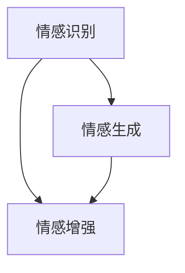

                 


### 第一章：情感AI的定义与原理

#### 背景介绍

随着人工智能（AI）技术的快速发展，情感AI作为一种能够识别、理解和模拟人类情感的人工智能分支，正日益受到关注。情感AI不仅在情感识别方面具有巨大潜力，还能应用于情绪管理、心理健康、社交互动等多个领域。

#### 核心概念与联系

情感AI的核心概念包括情感识别、情感生成和情感增强。这些概念之间紧密相连，形成一个完整的情感处理链条。

- **情感识别**：指AI系统从文本、语音或图像等数据中识别出人类情感的过程。
- **情感生成**：指AI系统生成新的情感表达，例如通过语音合成或文本生成来实现。
- **情感增强**：指AI系统通过增强用户的情绪体验，帮助用户更好地管理情绪。

为了更好地理解这些概念之间的关系，我们可以使用Mermaid流程图来展示它们：



#### 核心算法原理讲解

情感AI的核心算法包括基于规则的方法、机器学习方法、深度学习方法等。以下是一个简单的伪代码示例，用于展示如何使用机器学习方法进行情感识别：

```python
# 伪代码：基于机器学习的情感识别
def emotion_recognition(text):
    # 输入文本，经过预处理后
    preprocessed_text = preprocess_text(text)
    
    # 使用训练好的模型进行预测
    prediction = trained_model.predict(preprocessed_text)
    
    # 返回预测结果
    return prediction
```

在数学模型方面，常用的神经网络架构如卷积神经网络（CNN）和循环神经网络（RNN）在情感识别中有着广泛应用。以下是一个简化的latex公式，用于描述情感识别的损失函数：

```latex
\begin{equation}
    \min_{\theta} L(y, \hat{y}) = \sum_{i=1}^{n} (y_i - \hat{y}_i)^2
\end{equation}
```

其中，\( y \) 表示实际情感标签，\( \hat{y} \) 表示模型预测的情感标签，\( n \) 表示样本数量。

#### 数学模型和公式

为了提高情感识别的准确性，可以使用多种数学模型和算法。以下是一个简化的数学模型，用于描述情感识别过程中的特征提取和分类：

```latex
\begin{equation}
    \text{特征提取}:\ f(x) = \text{Activation}(W \cdot x + b)
\end{equation}
```

其中，\( x \) 是输入特征，\( W \) 是权重矩阵，\( b \) 是偏置项，\( \text{Activation} \) 是激活函数。

#### 项目实战

一个简单的情感识别项目可能包括以下步骤：

1. **数据集准备**：收集包含情感标签的文本数据。
2. **数据预处理**：对文本进行清洗、分词、去停用词等处理。
3. **模型训练**：使用机器学习算法（如逻辑回归、SVM、神经网络等）对预处理后的数据进行训练。
4. **模型评估**：使用交叉验证、准确率、召回率等指标评估模型性能。
5. **模型部署**：将训练好的模型部署到实际应用场景中。

以下是一个简化的Python代码示例，用于实现上述步骤：

```python
# Python代码：情感识别项目
from sklearn.feature_extraction.text import TfidfVectorizer
from sklearn.model_selection import train_test_split
from sklearn.linear_model import LogisticRegression

# 数据集准备
data = [...]  # 包含情感标签的文本数据
labels = [...]  # 情感标签

# 数据预处理
vectorizer = TfidfVectorizer()
X = vectorizer.fit_transform(data)

# 模型训练
X_train, X_test, y_train, y_test = train_test_split(X, labels, test_size=0.2)
model = LogisticRegression()
model.fit(X_train, y_train)

# 模型评估
accuracy = model.score(X_test, y_test)
print(f"Accuracy: {accuracy}")

# 模型部署
# ...（部署到实际应用场景）
```

#### 最佳实践 tips、小结、注意事项、拓展阅读

- **最佳实践 tips**：
  - 确保数据集的多样性和平衡性，以提高模型的泛化能力。
  - 使用适当的预处理技术，如词嵌入、文本清洗等，以提高模型性能。
  - 定期更新和重新训练模型，以适应不断变化的数据和应用场景。

- **小结**：
  - 本章介绍了情感AI的基本概念、核心算法原理、数学模型以及项目实战。
  - 通过简单的情感识别项目，展示了如何实现和应用情感AI技术。

- **注意事项**：
  - 在进行情感AI项目时，要注意保护用户隐私，遵守相关法律法规。
  - 情感识别的准确性受多种因素影响，包括数据质量、算法选择等。

- **拓展阅读**：
  - 《情感计算：技术与应用》
  - 《深度学习：面试指南》
  - 《自然语言处理入门》

通过上述内容，我们为《情感AI对人类情绪管理能力的影响》的文章打下了坚实的基础，接下来我们将继续深入探讨情感AI在人类情绪管理中的应用。

