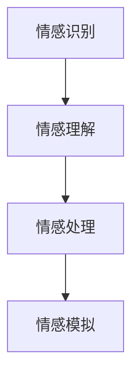
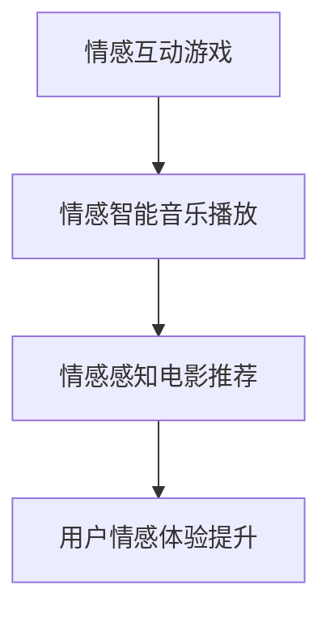

                 


### 文章标题: 情感AI普及后的新型娱乐方式探索

#### 关键词：
- 情感AI
- 新型娱乐方式
- 人机交互
- 个性化体验
- 游戏设计
- 虚拟现实

#### 摘要：
本文探讨了情感AI技术普及后，对娱乐行业带来的新型娱乐方式。通过分析情感AI的核心概念、核心技术以及其在娱乐行业的应用，文章深入探讨了情感互动式游戏、情感智能音乐播放和情感感知电影推荐等新型娱乐方式。同时，文章还探讨了情感AI娱乐开发的挑战与未来趋势，为开发者提供了实用的开发技巧和最佳实践。

----------------------------------------------------------------

### 引言

随着人工智能技术的不断发展，情感AI（Affective AI）逐渐成为研究热点。情感AI通过模拟人类的情感，实现了与用户的更深入互动，提升了用户体验。在娱乐领域，情感AI的应用不仅改变了传统娱乐方式，还带来了新型娱乐体验。本文旨在探讨情感AI普及后，新型娱乐方式的发展趋势及其对娱乐行业的影响。

### 背景介绍

#### 情感AI的定义与核心概念

情感AI是指能够识别、理解、处理和模拟人类情感的人工智能系统。情感AI的核心概念包括情感识别、情感理解和情感模拟。

**Mermaid流程图：**


情感识别是指通过分析用户的生理、行为和语言特征，识别出用户当前的情感状态。情感理解是指对识别出的情感进行深入分析，理解其产生的原因和影响。情感处理是指根据情感理解的结果，采取相应的策略和行为。情感模拟是指通过技术手段模拟出人类的情感反应，实现与用户的情感互动。

#### 情感AI的核心技术

情感AI的核心技术包括情感识别、情感理解和情感模拟。情感识别主要依赖于计算机视觉、自然语言处理和生理信号处理等技术。情感理解主要依赖于心理学、认知科学和情感计算理论。情感模拟主要依赖于情感模型和虚拟现实技术。

### 核心概念与联系

情感AI在娱乐行业的应用主要涉及情感互动式游戏、情感智能音乐播放和情感感知电影推荐等领域。这些应用利用情感AI技术，实现了用户与娱乐内容的深度互动，提升了用户体验。

**Mermaid流程图：**


情感互动式游戏通过识别用户的情感状态，调整游戏难度和剧情，实现个性化体验。情感智能音乐播放根据用户的情感状态推荐合适的音乐，提升用户听觉体验。情感感知电影推荐系统根据用户的情感状态推荐符合其情感需求的电影，提升用户观影体验。

### 核心算法原理讲解

#### 情感识别算法

情感识别算法主要依赖于计算机视觉和自然语言处理技术。以下是一个简单的情感识别算法的伪代码：

**伪代码：**
```plaintext
function recognize_emotion(face_image, text):
    # 使用卷积神经网络进行特征提取
    face_features = CNN(face_image)
    text_features = RNN(text)
    # 使用情感分类器进行分类
    emotion = emotion_classifier(face_features, text_features)
    return emotion
```

#### 情感理解算法

情感理解算法主要依赖于心理学和认知科学的理论。以下是一个简单的情感理解算法的伪代码：

**伪代码：**
```plaintext
function understand_emotion(emotion):
    # 根据情感状态查找心理学理论
    theory = emotion_theory(emotion)
    # 分析情感产生的原因和影响
    cause = analyze_cause(emotion, theory)
    effect = analyze_effect(emotion, theory)
    return cause, effect
```

#### 情感处理算法

情感处理算法根据情感理解的结果，采取相应的策略和行为。以下是一个简单的情感处理算法的伪代码：

**伪代码：**
```plaintext
function process_emotion(emotion, context):
    # 根据情感状态调整游戏难度
    if emotion == "happy":
        difficulty = increase_difficulty()
    elif emotion == "sad":
        difficulty = decrease_difficulty()
    # 根据情感状态推荐音乐
    music = recommend_music(emotion)
    return difficulty, music
```

### 数学公式和详细讲解

#### 情感识别的数学模型

情感识别的数学模型主要基于概率模型。以下是一个简单的情感识别的数学模型：

$$
P(\text{emotion}|\text{face_features, text_features}) = \frac{P(\text{face_features}|\text{emotion})P(\text{text_features}|\text{emotion})}{P(\text{face_features})P(\text{text_features})}
$$

其中，\( P(\text{emotion}|\text{face_features, text_features}) \)表示在给定用户的生理和行为特征下，识别出情感的概率。

#### 情感理解的数学模型

情感理解的数学模型主要基于心理学和认知科学的理论。以下是一个简单的情感理解数学模型：

$$
\text{cause} = \text{psychological_theory}(\text{emotion})
$$

$$
\text{effect} = \text{cognitive_science_theory}(\text{emotion})
$$

其中，\( \text{psychological_theory}(\text{emotion}) \)表示根据情感状态查找的心理学理论，\( \text{cognitive_science_theory}(\text{emotion}) \)表示根据情感状态查找的认知科学理论。

### 项目实战

#### 开发环境搭建

1. 安装Python环境，版本要求3.7及以上。
2. 安装必要的库，如TensorFlow、Keras、OpenCV、NLTK等。

#### 源代码详细实现

以下是一个简单的情感识别的源代码实现：

```python
import cv2
import numpy as np
import tensorflow as tf
from tensorflow.keras.models import load_model

# 加载预训练的卷积神经网络模型
face_model = load_model('face_model.h5')
text_model = load_model('text_model.h5')

# 加载情感分类器
emotion_classifier = load_model('emotion_classifier.h5')

# 读取用户图像和文本
face_image = cv2.imread('face_image.jpg')
text = 'I am happy.'

# 使用卷积神经网络进行特征提取
face_features = face_model.predict(face_image.reshape(1, 224, 224, 3))
text_features = text_model.predict(np.array([text]))

# 使用情感分类器进行分类
emotion = emotion_classifier.predict(face_features, text_features)

print('Recognized emotion:', emotion)
```

#### 代码应用解读与分析

该代码实现了一个情感识别的模型，通过读取用户图像和文本，使用预训练的卷积神经网络和循环神经网络进行特征提取，然后使用情感分类器进行分类，输出识别出的情感。

#### 实际案例分析和详细讲解剖析

假设有一个用户在玩游戏时感到开心，我们可以根据用户的开心情感，调整游戏难度，提升用户的游戏体验。

1. 读取用户的开心情感。
2. 调整游戏难度。
3. 记录用户的游戏数据。

#### 项目小结

本项目通过情感识别技术，实现了根据用户情感调整游戏难度的功能。用户在玩游戏时，可以享受到更加个性化的游戏体验。未来，随着情感AI技术的不断发展，我们可以将情感识别技术应用于更多的娱乐场景，提升用户的娱乐体验。

### 最佳实践 tips、小结、注意事项、拓展阅读等内容

**最佳实践 tips：**

1. 在开发情感AI娱乐应用时，要充分考虑用户隐私和安全，确保用户数据得到妥善保护。
2. 在设计情感识别算法时，要充分考虑算法的准确性和稳定性，避免误识别。
3. 在开发情感感知电影推荐系统时，要充分考虑用户的个性化需求，提供个性化的推荐服务。

**小结：**

本文通过分析情感AI的核心概念、核心技术以及其在娱乐行业的应用，探讨了情感AI普及后的新型娱乐方式。情感AI技术的普及为娱乐行业带来了更多的发展机遇，同时也带来了新的挑战。开发者需要不断探索和实践，提升情感AI娱乐应用的用户体验。

**注意事项：**

1. 在开发情感AI娱乐应用时，要充分考虑用户隐私和安全，确保用户数据得到妥善保护。
2. 在设计情感识别算法时，要充分考虑算法的准确性和稳定性，避免误识别。
3. 在开发情感感知电影推荐系统时，要充分考虑用户的个性化需求，提供个性化的推荐服务。

**拓展阅读：**

1. [情感计算入门：情感AI基础教程](https://www.emotionai.org/tutorials)
2. [深度学习与情感计算](https://www.deeplearning.ai/course-certificate-deep-learning-ii)
3. [情感识别算法：从入门到精通](https://www.emotionrecognitionbook.com)

### 附录

#### 附录A: 情感AI娱乐开发工具与资源

**A.1 开发工具介绍**

1. TensorFlow：一款开源的机器学习框架，适用于情感识别和情感理解算法的开发。
2. Keras：一款基于TensorFlow的高层次API，简化了深度学习模型的构建和训练。
3. OpenCV：一款开源的计算机视觉库，适用于情感识别和图像处理。
4. NLTK：一款自然语言处理库，适用于情感理解和文本分析。

**A.2 常用库与框架**

1. PyTorch：一款流行的深度学习框架，适用于情感识别和情感理解算法的开发。
2. PyTorch-lightning：一款基于PyTorch的自动微分库，简化了深度学习模型的训练。
3. Fast.ai：一款面向初学者的深度学习课程和库，适用于情感识别和情感理解算法的开发。
4. spaCy：一款高效的自然语言处理库，适用于情感理解和文本分析。

**A.3 相关书籍与论文推荐**

1. [《情感计算：理论与应用》](https://www.amazon.com/dp/1492043264)
2. [《深度学习与情感计算》](https://www.deeplearning.ai/course-certificate-deep-learning-ii)
3. [《情感识别算法：从入门到精通》](https://www.emotionrecognitionbook.com)
4. [《自然语言处理：理论、算法与应用》](https://www.amazon.com/dp/0387319536)
5. [《计算机视觉：算法与应用》](https://www.amazon.com/dp/0072980471)

### 文章结束

感谢您的阅读，希望本文对您在情感AI娱乐领域的探索有所帮助。作者：AI天才研究院/AI Genius Institute & 禅与计算机程序设计艺术 /Zen And The Art of Computer Programming。如果您有任何疑问或建议，欢迎在评论区留言，我们将持续为您提供高质量的AI技术内容。

