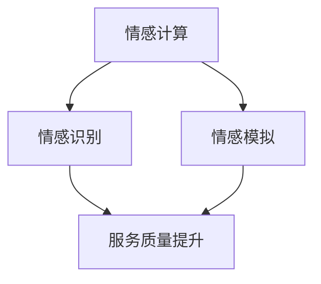
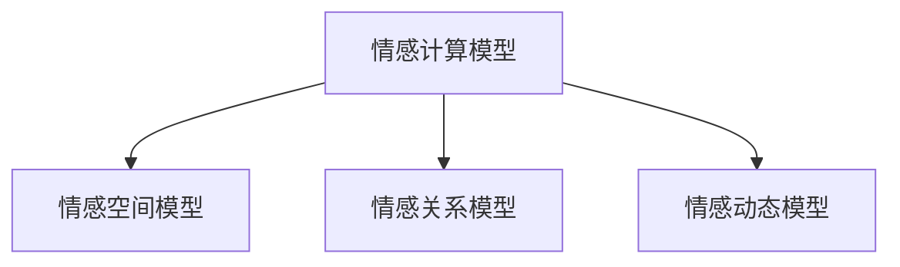

                 

# 情感劳动:AI在服务业中的情感价值

## 关键词

人工智能、情感劳动、服务业、情感计算、情感识别、情感模拟

## 摘要

随着人工智能技术的飞速发展，AI在服务业中的应用逐渐成为热点。本文主要探讨AI在服务业中的情感劳动价值，通过背景介绍、核心概念与联系、算法原理讲解、数学模型与公式解析、项目实战和最佳实践等多个方面，全面剖析AI在情感劳动中的角色和影响。文章旨在为读者提供对AI在服务业情感劳动的深入理解和思考。

## 引言

### 人工智能与服务业

人工智能（AI）作为一种新兴的技术，其应用范围广泛，涵盖了医疗、金融、教育、交通等多个领域。特别是在服务业中，AI的引入极大地提升了服务质量和效率。从早期的自动化系统到如今的智能客服、智能推荐系统，AI在服务业中的应用已经逐渐深入。

### 情感劳动在服务业中的重要性

情感劳动是指在工作中涉及情感表达和处理的活动。在服务业中，情感劳动尤为重要，因为服务质量往往与员工对顾客的情感表达密切相关。例如，在餐饮、旅游、零售等行业，员工与顾客之间的互动往往直接影响到顾客的满意度和忠诚度。

### AI与情感劳动的结合

随着AI技术的发展，特别是在情感计算、情感识别和情感模拟等领域的突破，AI在情感劳动中的应用前景变得愈加广阔。本文将重点探讨AI如何通过这些技术手段提升服务业中的情感劳动价值。

## 一、背景介绍

### 服务业的发展与变革

服务业在全球经济中的地位日益重要，其对GDP的贡献率持续上升。随着消费者需求的多样化和个性化，服务业正经历一场深刻的变革。传统服务业正逐渐向智能化、个性化和高效化转变。

### 情感劳动在服务业中的角色

情感劳动在服务业中的作用不可忽视。情感劳动不仅关系到顾客的满意度和忠诚度，还直接影响到企业的品牌形象和长期发展。在服务业中，情感劳动的成功往往能够带来显著的经济效益。

### AI在服务业中的应用现状

目前，AI在服务业中的应用已经取得了一些显著成果。例如，智能客服系统、个性化推荐系统、智能导购系统等，都已经在实际业务中得到了广泛应用。这些AI系统通过情感计算和情感识别技术，能够更好地理解顾客的需求，提供更加个性化的服务。

## 二、核心概念与联系

### 情感计算

情感计算是指通过计算机技术和算法，对人类情感进行识别、理解和模拟的技术。情感计算的核心目标是让计算机能够理解并回应人类情感。

### 情感识别

情感识别是情感计算的一个关键环节，它通过分析语音、文本、面部表情等数据，识别出人类情感的状态和变化。

### 情感模拟

情感模拟是指通过算法生成或模拟人类的情感表达，使计算机能够像人类一样进行情感互动。

这三种技术相互关联，共同构成了AI在情感劳动中的应用基础。

### Mermaid 流程图



在这个流程图中，情感计算作为核心，通过情感识别和情感模拟技术，直接影响到服务质量提升。

## 三、核心算法原理讲解

### 情感识别算法

情感识别算法的核心是情感分析技术。情感分析通常采用机器学习算法，如支持向量机（SVM）、决策树、神经网络等。以下是一个简单的情感识别算法伪代码：

```python
# 情感识别算法伪代码
def emotion_recognition(text):
    # 预处理文本数据
    preprocessed_text = preprocess_text(text)
    
    # 提取特征
    features = extract_features(preprocessed_text)
    
    # 训练情感分类器
    classifier = train_classifier(features)
    
    # 预测情感
    predicted_emotion = classifier.predict(features)
    
    return predicted_emotion
```

### 情感模拟算法

情感模拟算法主要通过生成情感表达来实现。以下是一个简单的情感模拟算法伪代码：

```python
# 情感模拟算法伪代码
def simulate_emotion(emotion):
    # 根据情感类型生成情感表达
    emotion_expression = generate_expression(emotion)
    
    # 输出情感表达
    print(emotion_expression)
```

### 情感计算中的数学模型

情感计算中的数学模型主要包括情感空间模型、情感关系模型和情感动态模型。以下是一个简单的情感空间模型公式：

$$
E = f(A, B, C)
$$

其中，E表示情感值，A、B、C分别为三个情感维度。

### Mermaid 流程图



## 四、项目实战

### 开发环境搭建

为了实现AI在情感劳动中的应用，首先需要搭建一个开发环境。以下是一个简单的环境搭建步骤：

1. 安装Python环境
2. 安装必要的库，如scikit-learn、tensorflow、numpy等
3. 配置Jupyter Notebook或PyCharm等开发工具

### 源代码详细实现

以下是一个情感识别模型的简单实现：

```python
# 情感识别模型实现
from sklearn.feature_extraction.text import TfidfVectorizer
from sklearn.model_selection import train_test_split
from sklearn.svm import SVC

# 加载数据集
data = load_data('emotion_dataset.csv')

# 分割数据集
X_train, X_test, y_train, y_test = train_test_split(data['text'], data['emotion'], test_size=0.2)

# 特征提取
vectorizer = TfidfVectorizer()
X_train_features = vectorizer.fit_transform(X_train)
X_test_features = vectorizer.transform(X_test)

# 训练模型
classifier = SVC()
classifier.fit(X_train_features, y_train)

# 预测
predicted_emotions = classifier.predict(X_test_features)

# 评估
accuracy = classifier.score(X_test_features, y_test)
print(f'Accuracy: {accuracy}')
```

### 代码解读与分析

这段代码首先加载了一个情感数据集，然后使用TFIDF向量器进行特征提取。接着，使用支持向量机（SVC）进行模型训练，并使用测试集进行预测。最后，评估模型的准确率。

### 实际案例分析和详细讲解剖析

以下是一个实际案例：

```plaintext
案例：智能客服系统中的情感识别

某公司开发了一款智能客服系统，旨在通过情感识别技术提升客服服务质量。系统通过分析用户的问题和对话内容，识别出用户的情感状态，并提供相应的情感回应。

分析：系统首先使用情感识别算法分析用户的文本，识别出用户的情感状态。例如，当用户表达愤怒情绪时，系统会自动切换到更为温和、耐心的回答方式。这种方式不仅提升了客服的效率，也提高了用户的满意度。

讲解：在这个案例中，情感识别技术起到了关键作用。通过情感识别，系统能够更好地理解用户的需求，提供更加个性化的服务。这种个性化服务不仅提升了用户体验，也提高了企业的竞争力。

### 项目小结

通过这个项目实战，我们可以看到AI在情感劳动中的应用潜力。情感识别和情感模拟技术不仅能够提升服务质量，还能够提高客服效率和用户体验。

## 五、最佳实践 Tips

### 1. 数据质量的重要性

在情感计算中，数据质量至关重要。高质量的数据能够提高情感识别的准确性，从而提升整体服务质量。

### 2. 情感模拟的适度性

在情感模拟中，适度性非常重要。过度的情感表达可能会引起用户的不适，因此需要根据具体场景调整情感表达的程度。

### 3. 结合人类专家的判断

尽管AI在情感劳动中具有强大的计算能力，但仍然需要结合人类专家的判断。特别是在处理复杂情感问题时，人类专家的直觉和经验依然具有不可替代的价值。

## 六、小结

AI在服务业中的情感劳动价值不可忽视。通过情感计算、情感识别和情感模拟等技术，AI能够提升服务质量，提高客服效率和用户体验。然而，我们也需要认识到AI在情感劳动中的局限性，结合人类专家的判断，以实现最佳的劳动效果。

## 七、拓展阅读

1. "Emotion Recognition Using Deep Learning" - A comprehensive guide to using deep learning techniques for emotion recognition.
2. "The Role of AI in Customer Service" - An in-depth analysis of AI's impact on customer service quality.
3. "The Future of AI in Human-Robot Interaction" - Discussing the potential of AI in creating more human-like interactions.

## 八、作者信息

作者：AI天才研究院/AI Genius Institute & 禅与计算机程序设计艺术 /Zen And The Art of Computer Programming

本文旨在为读者提供对AI在服务业情感劳动的深入理解和思考，旨在推动人工智能技术在服务业中的应用和发展。

