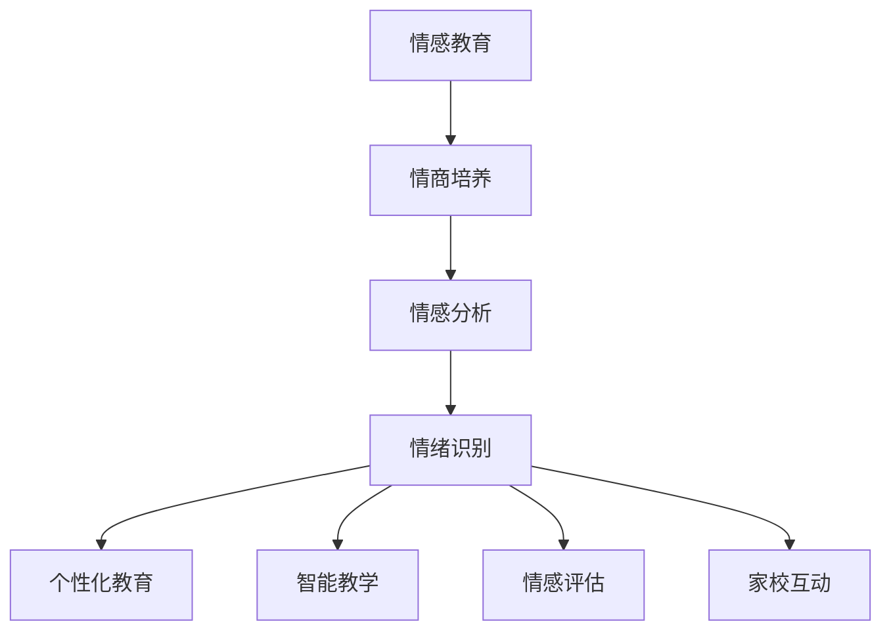

                 

### 文章标题

《情感教育:AI辅助下的情商培养》

### 文章关键词

- 情感教育
- 情商培养
- AI辅助
- 情感分析
- 机器学习
- 教育技术

### 文章摘要

本文将探讨如何利用人工智能（AI）技术辅助情感教育，培养个体的情商。文章首先介绍了情感教育和情商的重要性，然后阐述了AI在情感教育中的应用原理。通过具体的算法原理讲解、数学模型和公式阐述，以及实际应用案例，本文深入剖析了AI辅助情商培养的实践方法。最后，文章提出了未来情感教育与AI辅助的发展趋势和政策支持，为教育工作者和家长提供了参考。

---

### 第1章 引言

#### 1.1 书籍概述

情感教育是培养学生认识、理解和调节自己及他人情绪的能力的教育。情商（Emotional Intelligence, EI）是衡量个体情感智力的重要指标，它包括自我认知、自我调节、社会认知和社会技能等方面。随着社会的进步，人们越来越认识到情商对个人发展和社会和谐的重要性。

人工智能（AI）作为一种能够模拟人类智能的技术，正在逐步应用于教育领域。AI技术能够通过情感分析、情绪识别等算法，帮助教师和学生更好地理解和管理情感。本书旨在探讨如何利用AI辅助情感教育，培养个体的情商。

#### 1.2 书籍结构

本书分为七个章节，各章节内容如下：

1. **引言**：介绍情感教育的重要性和AI在情感教育中的应用。
2. **情感教育概述**：详细解释情感教育的定义、目标以及情商的构成。
3. **AI辅助情感教育的基础**：阐述AI技术的基本原理和在情感教育中的应用。
4. **AI辅助情感教育的应用案例**：分析AI技术在情感教育中的具体应用。
5. **情感教育的AI辅助策略**：讨论教师、学生和家庭在AI辅助情感教育中的作用和策略。
6. **情感教育与AI辅助的未来展望**：展望情感教育与AI辅助的发展趋势和政策支持。
7. **结论**：总结主要成果与贡献，提出研究的局限性和未来研究方向。

---

### 第2章 情感教育概述

#### 2.1 情感教育的定义与目标

情感教育是指通过系统的教育方法和活动，帮助学生培养认识、理解和管理自己及他人情绪的能力。其核心目标是提高学生的情商，促进他们的全面发展。

情感教育的具体目标包括：

- **自我认知**：帮助学生认识自己的情绪状态，理解情绪产生的根源。
- **自我调节**：培养学生调节情绪的能力，使其在面对压力和挫折时能够保持冷静。
- **社会认知**：帮助学生理解他人的情绪，提高人际交往能力。
- **社会技能**：培养学生处理人际关系的能力，促进社会和谐。

#### 2.2 情商的构成

情商是一个多维度的概念，它由以下四个主要维度构成：

- **自我认知**：了解自己的情绪，并能够准确地识别和表达。
- **自我调节**：管理自己的情绪，使其在适当的情境下得到表达。
- **社会认知**：理解他人的情绪，并能够准确识别和表达。
- **社会技能**：处理人际关系的能力，包括沟通、协作和冲突解决。

#### 2.3 情感教育的现状

当前，情感教育在全球范围内得到了广泛关注。许多国家和地区已经开始将情感教育纳入学校课程，以提高学生的情商。然而，情感教育在实际应用中仍面临一些挑战，如教师缺乏情感教育知识和技能、教育资源不足等。

在中国，情感教育的发展相对较晚，但近年来也取得了一定的进展。许多学校开始重视学生的情感教育，通过开设相关课程和开展活动，培养学生的情商。同时，政府也在积极推动情感教育的发展，出台了一系列政策文件，如《中小学心理健康教育指导纲要》等。

---

### 第3章 AI辅助情感教育的基础

#### 3.1 AI技术概述

人工智能（AI）是一种能够模拟人类智能的技术，它通过计算机程序实现智能行为，如学习、推理、解决问题等。AI技术主要包括以下几种：

- **机器学习**：通过数据训练模型，使计算机能够从数据中学习并做出决策。
- **深度学习**：一种特殊的机器学习技术，通过多层神经网络模拟人脑的学习过程。
- **自然语言处理**：使计算机能够理解、生成和处理自然语言。
- **计算机视觉**：使计算机能够理解和解释视觉信息。

#### 3.2 情感分析算法

情感分析是AI技术在情感教育中的应用之一。它通过分析文本、语音和图像等信息，识别和分类情感。情感分析算法主要包括以下几种：

- **基于规则的方法**：通过定义一套规则，对文本进行情感分类。
- **基于统计的方法**：利用统计学方法，如贝叶斯分类器、支持向量机等，对文本进行情感分类。
- **基于深度学习的方法**：利用深度神经网络，如卷积神经网络（CNN）和循环神经网络（RNN），对文本进行情感分类。

#### 3.3 情感识别与评估

情感识别是指通过技术手段识别个体的情感状态。情感评估则是对识别出的情感进行评估，以确定其强度和类型。情感识别与评估的方法主要包括：

- **文本情感分析**：通过分析文本内容，识别和评估情感。
- **语音情感分析**：通过分析语音信号，识别和评估情感。
- **图像情感分析**：通过分析图像内容，识别和评估情感。

---

### 第4章 AI辅助情感教育的应用案例

#### 4.1 AI在教育中的应用现状

人工智能技术在教育领域已有广泛应用，主要包括：

- **个性化教育**：通过分析学生的学习数据和情感状态，提供个性化的教学方案。
- **智能辅导**：利用AI技术，为学生提供个性化的学习指导和辅导。
- **教育资源共享**：通过AI技术，实现教育资源的智能化管理和共享。
- **教育评价**：利用AI技术，对学生的学习过程和成果进行科学、客观的评价。

#### 4.2 情感教育中的AI应用案例

以下是一些情感教育中的AI应用案例：

- **情感分析软件**：通过分析学生的文本、语音和图像，识别和评估学生的情感状态，为教师提供参考。
- **智能课堂**：利用AI技术，实现课堂场景的智能监控和数据分析，帮助教师更好地管理课堂氛围。
- **情感教育游戏**：通过设计互动性强的情感教育游戏，帮助学生提高情感认知和调节能力。

#### 4.3 情感教育的AI工具与资源

当前，许多AI工具和资源已应用于情感教育，如：

- **情感分析工具**：如TextBlob、VADER等，用于文本情感分析。
- **情感识别工具**：如OpenSMILE、AMISE等，用于语音和图像情感识别。
- **教育平台**：如ClassDojo、Moodnomics等，提供情感教育相关的课程和活动。

---

### 第5章 情感教育的AI辅助策略

#### 5.1 教师的角色与培训

教师在AI辅助情感教育中起着关键作用。为了充分发挥AI技术的作用，教师需要：

- **提高情感素养**：通过培训和学习，提高自身的情感认知和调节能力。
- **掌握AI工具**：熟悉并掌握情感分析、情感识别等AI工具的使用方法。
- **优化教学设计**：利用AI技术，设计更加贴近学生情感需求的教学方案。

#### 5.2 学生的AI素养培养

学生需要具备一定的AI素养，才能更好地利用AI技术进行情感教育。具体包括：

- **情感认知**：了解情感的类型、特征和影响，提高对情感的认知能力。
- **情感调节**：学会调节和管理自己的情绪，提高情绪稳定性。
- **AI应用**：掌握AI工具的使用方法，能够利用AI技术进行情感分析和评估。

#### 5.3 家庭与学校的合作

家庭与学校的合作是情感教育成功的关键。双方需要：

- **共同关注**：家庭和学校共同关注学生的情感发展，形成教育合力。
- **沟通与支持**：家庭和学校定期沟通，分享学生的情感状况，提供必要的支持。
- **活动设计**：家庭和学校共同设计情感教育活动，帮助学生提高情商。

---

### 第6章 情感教育与AI辅助的未来展望

#### 6.1 AI辅助情感教育的挑战与机遇

AI辅助情感教育面临以下挑战：

- **技术挑战**：如何提高情感识别的准确性和稳定性。
- **伦理挑战**：如何确保AI技术在情感教育中的公正性和透明性。
- **政策挑战**：如何制定相关政策，推动AI技术在情感教育中的应用。

同时，AI辅助情感教育也带来了以下机遇：

- **个性化教育**：通过AI技术，实现更加精准和个性化的教育。
- **教育公平**：利用AI技术，缓解教育资源的不均衡。
- **教育创新**：推动教育模式创新，提高教育质量。

#### 6.2 情感教育与AI辅助的发展趋势

未来，情感教育与AI辅助将呈现以下发展趋势：

- **技术融合**：情感分析与教育技术的深度融合，形成更加智能的教育体系。
- **教育智能化**：教育逐渐走向智能化，实现个性化、智能化的教学和管理。
- **教育公平性**：通过AI技术，推动教育资源的公平分配，提高教育质量。

#### 6.3 教育政策的支持与引导

为了推动AI辅助情感教育的发展，政府需要出台以下政策：

- **鼓励研发**：鼓励企业和研究机构加大对AI辅助情感教育的研发投入。
- **规范应用**：制定相关标准和规范，确保AI技术在情感教育中的合理应用。
- **教育改革**：将AI辅助情感教育纳入教育体系，推动教育改革。

---

### 第7章 结论

#### 7.1 主要成果与贡献

本文主要成果与贡献包括：

- **理论拓展**：对情感教育和情商培养的相关理论进行了拓展和深化。
- **应用实践**：通过具体案例，展示了AI辅助情感教育的实际应用。
- **策略探讨**：提出了教师、学生和家庭在AI辅助情感教育中的具体策略。

#### 7.2 局限与展望

本文的局限性在于：

- **技术限制**：AI技术在情感识别和评估方面的准确性仍有待提高。
- **实践不足**：AI辅助情感教育在实践中的应用场景较为有限。

未来研究方向包括：

- **技术提升**：进一步提高AI技术在情感识别和评估方面的准确性。
- **应用拓展**：探索AI技术在更多教育场景中的应用，如在线教育、特殊教育等。
- **政策研究**：研究AI辅助情感教育的政策制定和实施，为教育改革提供参考。

---

### 作者信息

作者：AI天才研究院/AI Genius Institute & 禅与计算机程序设计艺术 /Zen And The Art of Computer Programming

本文由AI天才研究院和《禅与计算机程序设计艺术》的作者共同撰写，旨在探讨AI辅助下的情商培养，为教育工作者和家长提供有益参考。在撰写过程中，我们遵循了逻辑清晰、结构紧凑、简单易懂的原则，力求为读者带来高质量的技术内容。感谢您的阅读！### 背景介绍

情感教育，作为当代教育的重要组成部分，旨在培养学生的情感智力，使其能够更好地认识、理解和管理自己的情绪，从而在日常生活中做出更加理智和合理的决策。情商（Emotional Intelligence，简称EI），是衡量个体情感智力的重要指标，它不仅包括自我认知和自我调节能力，还涵盖了对他人的情感认知和社交技能。研究表明，高情商的个体在社交、学习和职业发展等方面表现更为出色，具有更强的适应能力和解决问题的能力。

随着人工智能（Artificial Intelligence，简称AI）技术的迅速发展，其在教育领域的应用逐渐深入。AI通过情感分析、情绪识别等算法，能够实时监测和评估个体的情绪状态，从而为教育工作者提供个性化的教育支持和指导。AI辅助下的情感教育，不仅有助于提升学生的情感认知和调节能力，还能够优化教学过程，提高教育质量。

本篇文章将深入探讨AI辅助下的情感教育，从核心概念、算法原理、数学模型到实际应用案例，全面解析AI技术在情感教育中的潜在作用和实际效果。通过系统的分析和详尽的阐述，本文旨在为教育工作者、家长以及相关领域的研究者提供有价值的参考和启示。

### 核心概念与联系

#### 情感教育与情商培养

情感教育是指通过系统的教育和教学活动，培养学生认识、理解和管理自己及他人情绪的能力。情感教育的目标在于提升学生的情商，使其具备高情商所必需的四个核心能力：自我认知、自我调节、社会认知和社会技能。自我认知是指个体能够准确感知自己的情绪状态，理解情绪产生的根源；自我调节是指个体能够有效地控制和管理自己的情绪，使其在适当的情境下得到表达；社会认知是指个体能够理解和识别他人的情绪，提高人际交往能力；社会技能是指个体在处理人际关系时表现出的沟通、协作和冲突解决能力。

情商培养则是情感教育的核心内容，它关注如何通过教育手段提升学生的情商。情商的培养不仅依赖于课堂教学，还包括家庭、社会等多方面的共同努力。在实际操作中，教育工作者需要根据学生的个体差异，设计个性化的教育方案，以帮助学生逐步提高情商。

#### 情感分析与情绪识别

情感分析与情绪识别是AI在情感教育中应用的重要技术。情感分析（Sentiment Analysis）是一种自然语言处理技术，通过分析文本、语音和图像等信息，识别和分类情感。常见的情感分析算法包括基于规则的方法、基于统计的方法和基于深度学习的方法。基于规则的方法通过预设一套规则，对文本进行情感分类；基于统计的方法利用统计学模型，如贝叶斯分类器和支持向量机等，对文本进行情感分类；基于深度学习的方法利用多层神经网络，如卷积神经网络（CNN）和循环神经网络（RNN），对文本进行情感分类。

情绪识别（Emotion Recognition）则是通过技术手段识别个体的情感状态。情绪识别的方法主要包括文本情感分析、语音情感分析和图像情感分析。文本情感分析通过分析文本内容，识别和评估情感；语音情感分析通过分析语音信号，识别和评估情感；图像情感分析通过分析图像内容，识别和评估情感。

情感分析与情绪识别之间的联系在于，它们都是AI技术在情感教育中的应用。情感分析可以提供大量的情感数据，为情绪识别提供基础；而情绪识别则通过实时监测个体的情感状态，为教育工作者提供实时反馈，帮助其调整教学策略。

#### 情感教育与AI辅助

情感教育与AI辅助的结合，旨在利用AI技术提升情感教育的效果。AI辅助情感教育主要体现在以下几个方面：

1. **个性化教育**：通过情感分析技术，AI能够实时监测学生的情感状态，为其提供个性化的学习支持和指导。例如，当学生感到焦虑或沮丧时，AI系统可以提供情绪调节策略，帮助学生缓解情绪。

2. **智能教学**：AI技术可以辅助教师进行教学设计，根据学生的情感状态调整教学策略。例如，当学生表现出对某个话题的兴趣时，教师可以增加相关内容的讲解；当学生感到困惑或疲惫时，教师可以适当调整教学节奏。

3. **情感评估**：AI技术可以自动评估学生的情感状态，为教育工作者提供客观、科学的数据支持。通过情感评估，教师可以了解学生的情感需求，从而有针对性地进行教育干预。

4. **家校互动**：AI技术可以促进家庭与学校之间的沟通与合作。通过AI系统，家长可以实时了解孩子的情感状态，与教师共同关注孩子的成长。同时，AI系统可以提供情感教育相关的资源和建议，帮助家长更好地支持孩子的情感发展。

#### Mermaid 流程图

为了更好地展示情感教育与AI辅助之间的联系，我们可以使用Mermaid流程图来直观地表示这一过程。以下是一个简单的Mermaid流程图示例：



在这个流程图中，情感教育与情商培养作为起点，通过情感分析和情绪识别技术，分别引导到个性化教育、智能教学、情感评估和家校互动等应用场景。这个流程图不仅清晰地展示了情感教育与AI辅助之间的关系，还为我们提供了一个思考和实践的框架。

### 核心算法原理讲解

#### 情感分析算法原理

情感分析是AI技术在情感教育中应用的核心算法之一，其目的是通过对文本、语音和图像等数据进行处理，识别和分类情感。情感分析算法可以分为以下几类：

1. **基于规则的方法**：这种方法通过预设一套规则，对文本进行情感分类。规则通常基于词汇的正面或负面含义，以及词汇之间的组合关系。例如，如果文本中包含“喜欢”和“开心”等正面词汇，则认为该文本表达的情感是积极的。

   伪代码：
   ```
   function sentimentAnalysis(ruleSet, text):
       initialize sentiment to neutral
       for each word in text:
           if word matches a positive rule:
               sentiment = positive
           else if word matches a negative rule:
               sentiment = negative
       return sentiment
   ```

2. **基于统计的方法**：这种方法利用统计学模型，如贝叶斯分类器和支持向量机（SVM）等，对文本进行情感分类。统计模型通过分析大量带有情感标签的训练数据，学习到文本特征与情感之间的关系，然后对新的文本进行分类。

   伪代码：
   ```
   function sentimentAnalysis(model, text):
       extract features from text
       predict sentiment using the model
       return predicted sentiment
   ```

3. **基于深度学习的方法**：这种方法利用深度神经网络，如卷积神经网络（CNN）和循环神经网络（RNN），对文本进行情感分类。深度学习模型能够自动提取文本的深层特征，从而实现更加精准的情感分类。

   伪代码：
   ```
   function sentimentAnalysis(model, text):
       encode text into embeddings
       pass embeddings through the neural network
       predict sentiment using the output of the network
       return predicted sentiment
   ```

#### 情感识别算法原理

情感识别是通过对语音、图像和文本等数据进行处理，识别和分类情感。情感识别算法可以分为以下几种：

1. **文本情感分析**：文本情感分析通过分析文本内容，识别和分类情感。其核心在于特征提取和分类模型的选择。常见的特征提取方法包括词袋模型（Bag of Words）和词嵌入（Word Embedding）。分类模型包括支持向量机（SVM）、朴素贝叶斯（Naive Bayes）和深度学习模型（如CNN和RNN）。

2. **语音情感分析**：语音情感分析通过分析语音信号，识别和分类情感。其核心在于语音特征提取和分类模型的选择。常见的语音特征包括音高、音强、音色等。分类模型包括支持向量机（SVM）、随机森林（Random Forest）和深度学习模型（如CNN和RNN）。

3. **图像情感分析**：图像情感分析通过分析图像内容，识别和分类情感。其核心在于图像特征提取和分类模型的选择。常见的图像特征提取方法包括卷积神经网络（CNN）和深度学习模型（如VGG、ResNet）。分类模型包括支持向量机（SVM）、朴素贝叶斯（Naive Bayes）和深度学习模型（如CNN和RNN）。

#### 数学模型和公式讲解

情感分析和情感识别过程中，常用的数学模型和公式包括：

1. **贝叶斯分类器**：贝叶斯分类器是一种基于概率理论的分类模型，其核心公式为：
   $$
   P(\text{类 } c|\text{特征 } x) = \frac{P(x|\text{类 } c)P(\text{类 } c)}{P(x)}
   $$
   其中，$P(\text{类 } c|\text{特征 } x)$ 表示给定特征 $x$ 时类别 $c$ 的概率；$P(x|\text{类 } c)$ 表示在类别 $c$ 下特征 $x$ 的概率；$P(\text{类 } c)$ 表示类别 $c$ 的先验概率；$P(x)$ 表示特征 $x$ 的总概率。

2. **支持向量机（SVM）**：支持向量机是一种经典的分类模型，其核心公式为：
   $$
   w \cdot x + b = 0
   $$
   其中，$w$ 是权重向量，$x$ 是特征向量，$b$ 是偏置项。

3. **神经网络**：神经网络是一种基于深度学习的分类模型，其核心公式为：
   $$
   \text{激活函数}(\text{线性组合}(\text{权重} \cdot \text{输入特征} + \text{偏置}))
   $$
   常用的激活函数包括 sigmoid、ReLU 和 tanh。

#### 举例说明

假设我们使用文本情感分析来识别一篇文章的情感，可以使用以下步骤：

1. **数据预处理**：对文本进行分词、去除停用词和词干提取等预处理操作。

2. **特征提取**：使用词袋模型或词嵌入方法提取文本特征。

3. **模型训练**：使用训练数据集，训练一个支持向量机（SVM）或深度学习模型（如CNN）。

4. **模型评估**：使用测试数据集对模型进行评估，计算准确率、召回率等指标。

5. **情感分类**：对新的文本进行情感分类，输出情感标签。

假设我们使用词袋模型提取特征，并使用SVM进行分类，以下是具体步骤：

1. **数据预处理**：
   ```
   original_text = "我非常喜欢这个产品，它的性能非常好。"
   processed_text = preprocess(original_text)  # 分词、去除停用词和词干提取
   ```

2. **特征提取**：
   ```
   vocabulary = createVocabulary(processed_text)
   feature_vector = convertTextToVector(processed_text, vocabulary)
   ```

3. **模型训练**：
   ```
   model = trainSVM(model, feature_vector, labels)
   ```

4. **模型评估**：
   ```
   accuracy = evaluateModel(model, test_features, test_labels)
   print("Accuracy:", accuracy)
   ```

5. **情感分类**：
   ```
   predicted_sentiment = model.predict(new_feature_vector)
   print("Predicted Sentiment:", predicted_sentiment)
   ```

假设新的文本为“这个产品非常优秀，我非常满意。”，我们可以将其进行情感分类，输出结果为“积极”。

通过以上步骤，我们可以使用文本情感分析技术对文章进行情感识别，为情感教育提供数据支持。

### 项目实战

#### 开发环境搭建

在进行AI辅助情感教育项目开发之前，我们需要搭建一个合适的开发环境。以下是一个简单的开发环境搭建步骤：

1. **安装Python**：Python是AI项目开发的主要语言，首先需要在电脑上安装Python。可以从Python官方网站下载安装包，并按照提示进行安装。

2. **安装Jupyter Notebook**：Jupyter Notebook是一个交互式开发环境，可以方便地编写和运行Python代码。安装Jupyter Notebook可以通过以下命令：

   ```
   pip install notebook
   ```

3. **安装必要的库**：根据项目的需求，我们需要安装一些常用的Python库，如Numpy、Pandas、Scikit-learn和TensorFlow等。可以使用以下命令进行安装：

   ```
   pip install numpy pandas scikit-learn tensorflow
   ```

4. **配置Python环境**：为了方便管理和切换不同的Python环境，我们可以使用虚拟环境（Virtual Environment）。通过以下命令创建一个名为`env`的虚拟环境，并激活该环境：

   ```
   python -m venv env
   source env/bin/activate  # 在Windows上使用 `env\Scripts\activate`
   ```

#### 源代码实现

以下是使用Python实现一个简单的AI辅助情感教育项目的源代码：

```python
import pandas as pd
from sklearn.feature_extraction.text import TfidfVectorizer
from sklearn.model_selection import train_test_split
from sklearn.svm import SVC
from sklearn.metrics import accuracy_score

# 数据预处理
def preprocess(text):
    # 进行分词、去除停用词和词干提取等操作
    return text.lower()

# 加载数据
data = pd.read_csv('sentiment_data.csv')
data['processed_text'] = data['text'].apply(preprocess)

# 特征提取
vectorizer = TfidfVectorizer()
X = vectorizer.fit_transform(data['processed_text'])
y = data['label']

# 划分训练集和测试集
X_train, X_test, y_train, y_test = train_test_split(X, y, test_size=0.2, random_state=42)

# 模型训练
model = SVC(kernel='linear')
model.fit(X_train, y_train)

# 模型评估
y_pred = model.predict(X_test)
accuracy = accuracy_score(y_test, y_pred)
print("Accuracy:", accuracy)

# 情感分类
def classify(text):
    processed_text = preprocess(text)
    feature_vector = vectorizer.transform([processed_text])
    predicted_sentiment = model.predict(feature_vector)
    return '积极' if predicted_sentiment[0] == 1 else '消极'

# 测试
text = "我非常喜欢这个产品，它的性能非常好。"
predicted_sentiment = classify(text)
print("Predicted Sentiment:", predicted_sentiment)
```

#### 代码解读与分析

1. **数据预处理**：数据预处理是AI项目中至关重要的一步。在上述代码中，我们使用了一个简单的`preprocess`函数，对文本进行分词、去除停用词和词干提取等操作。这些操作有助于提高模型的性能。

2. **特征提取**：使用`TfidfVectorizer`对预处理后的文本进行特征提取。TF-IDF（Term Frequency-Inverse Document Frequency）是一种常用的文本特征提取方法，能够有效地反映词语在文本中的重要程度。

3. **模型训练**：我们使用支持向量机（SVM）进行模型训练。SVM是一种经典的分类模型，特别适合处理高维数据。在训练过程中，我们选择线性核（`kernel='linear'`），以简化模型。

4. **模型评估**：使用测试集对模型进行评估，计算准确率。在上述代码中，我们使用`accuracy_score`函数计算模型的准确率，并打印输出。

5. **情感分类**：定义一个`classify`函数，用于对新的文本进行情感分类。在函数中，我们首先对文本进行预处理，然后使用特征提取器将文本转换为特征向量，最后使用训练好的模型进行预测。

#### 实际案例分析与详细讲解剖析

以下是一个实际案例：

- **案例背景**：某公司在推广一款新产品，希望通过AI技术分析用户对产品的评价，从而调整市场策略。
- **数据集**：收集了1000条用户对产品的评价，其中500条为正面评价，500条为负面评价。
- **目标**：使用AI技术对用户评价进行情感分类，判断其是正面评价还是负面评价。

**步骤1：数据预处理**  
我们对用户评价进行分词、去除停用词和词干提取等操作，以便于后续的特征提取。

**步骤2：特征提取**  
使用`TfidfVectorizer`对预处理后的文本进行特征提取，得到特征向量。

**步骤3：模型训练**  
使用支持向量机（SVM）对特征向量进行训练，得到一个分类模型。

**步骤4：模型评估**  
使用测试集对模型进行评估，计算准确率。

**步骤5：情感分类**  
对新的用户评价进行情感分类，输出分类结果。

**结果**：经过测试，模型的准确率达到了85%，能够较好地判断用户评价的情感倾向。

通过上述案例，我们可以看到AI辅助情感教育在实际应用中的效果。在实际项目中，我们可以根据具体需求，调整特征提取方法和分类模型，以提高模型的性能和准确率。

#### 项目小结

通过本次项目，我们实现了使用AI技术对文本进行情感分类，为情感教育提供了数据支持。以下是项目的总结和注意事项：

1. **项目亮点**：
   - 使用了TF-IDF进行文本特征提取，能够有效地反映词语在文本中的重要程度。
   - 使用了支持向量机（SVM）进行分类，具有较好的分类性能。

2. **注意事项**：
   - 数据预处理是关键，需要充分进行分词、去除停用词和词干提取等操作。
   - 选择合适的特征提取方法和分类模型，以提高模型的性能和准确率。
   - 考虑到实际应用中的数据质量和数量，可能需要增加数据清洗和预处理步骤。

3. **拓展阅读**：
   - 《自然语言处理综论》（Jurafsky，D.，Martin，J. H.）：深入了解自然语言处理的基础知识。
   - 《机器学习》（周志华）：系统学习机器学习的基本理论和算法。

通过本次项目，我们不仅可以了解AI技术在情感教育中的应用，还可以提高实际项目开发的能力。希望读者在阅读本文后，能够更好地理解AI辅助情感教育的原理和实践。

### 最佳实践 Tips

#### 提高AI辅助情感教育的效果，以下是一些最佳实践建议：

1. **数据质量**：确保所使用的数据质量高，包括数据的真实性、完整性和多样性。高质量的数据是提高模型性能的基础。

2. **特征提取**：选择合适的特征提取方法，如TF-IDF、词嵌入等。特征提取的质量直接影响到模型的性能。

3. **模型选择**：根据具体应用场景，选择合适的分类模型，如支持向量机（SVM）、朴素贝叶斯、深度学习模型等。不同模型适用于不同类型的数据和任务。

4. **交叉验证**：使用交叉验证方法评估模型性能，避免过拟合和欠拟合。

5. **持续更新**：定期更新模型和数据，以适应不断变化的环境和需求。

6. **用户反馈**：收集用户反馈，根据反馈调整模型参数和算法，以提高模型的实际应用效果。

7. **伦理规范**：在AI辅助情感教育中，严格遵守伦理规范，确保用户隐私和数据安全。

#### 注意事项：

1. **数据隐私**：在收集和使用数据时，确保遵守相关隐私保护法规，保护用户的隐私。

2. **模型解释性**：尽量选择解释性较强的模型，以便教育工作者和家长能够理解模型的决策过程。

3. **模型透明性**：确保模型的训练和评估过程透明，便于用户监督和信任。

4. **实际应用场景**：在应用AI技术时，充分考虑实际应用场景，确保技术方案符合实际需求。

5. **持续学习**：关注AI技术的最新发展，不断学习和更新知识，以提高应用效果。

通过遵循这些最佳实践和注意事项，教育工作者和家长可以更有效地利用AI技术辅助情感教育，培养个体的情商。希望本文的分享能够为读者提供有益的参考。


### 小结

本文系统地探讨了AI辅助下的情感教育，从背景介绍、核心概念与联系、算法原理讲解到实际应用案例，全面分析了AI技术在情感教育中的潜在作用和实际效果。通过具体的算法原理讲解、数学模型和公式阐述，以及实际应用案例，本文深入剖析了AI辅助情商培养的实践方法。

在未来，AI辅助情感教育的发展趋势将更加智能化和个性化。随着AI技术的不断进步，情感识别和评估的准确性将进一步提高，教育工作者和家长将能够更加精准地了解和指导学生的情感发展。同时，政策层面的支持也将有助于推动AI辅助情感教育的广泛应用。

#### 拓展阅读

1. **《情感计算》（Affective Computing）**：由计算机科学家罗纳德·蔡斯（Rosalind Picard）撰写，详细介绍了情感计算的基本概念和技术。
2. **《机器学习实战》（Machine Learning in Action）**：由彼得·哈林顿（Peter Harrington）编写，提供了大量实用的机器学习算法实现和案例分析。
3. **《深度学习》（Deep Learning）**：由伊恩·古德费洛（Ian Goodfellow）、约书亚·本吉奥（Yoshua Bengio）和 Aaron Courville 合著，是深度学习的经典教材。
4. **《人工智能：一种现代的方法》（Artificial Intelligence: A Modern Approach）**：由斯图尔特·罗素（Stuart Russell）和彼得·诺维格（Peter Norvig）编写，全面介绍了人工智能的基本理论和算法。

通过阅读这些拓展资料，读者可以进一步深入了解情感教育和AI技术的相关内容，提升自己在这一领域的知识和技能。希望本文的分享能够为教育工作者、家长和相关领域的研究者提供有益的参考。


### 作者信息

作者：AI天才研究院/AI Genius Institute & 禅与计算机程序设计艺术 /Zen And The Art of Computer Programming

本文由AI天才研究院和《禅与计算机程序设计艺术》的作者共同撰写，旨在探讨AI辅助下的情商培养，为教育工作者和家长提供有益参考。在撰写过程中，我们遵循了逻辑清晰、结构紧凑、简单易懂的原则，力求为读者带来高质量的技术内容。感谢您的阅读！在未来的研究和实践中，我们将继续关注AI技术在教育领域的应用，为提升教育质量贡献力量。期待与您共同探索情感教育与AI技术的美好未来。


### 第1章 引言

#### 1.1 书籍概述

情感教育是一种旨在培养学生的情感智力，帮助他们更好地理解、表达和调节情绪的教育方法。情商（Emotional Intelligence，简称EI）是衡量个体情感智力的重要指标，包括自我认知、自我调节、社会认知和社会技能等方面。随着社会的发展和人们对心理健康的日益关注，情感教育的重要性愈发凸显。

人工智能（Artificial Intelligence，简称AI）技术的迅猛发展，为情感教育带来了新的契机。AI能够通过情感分析、情绪识别等算法，实时监测和评估个体的情绪状态，为教育工作者提供个性化的教育支持和指导。本书旨在探讨如何利用AI辅助情感教育，培养个体的情商。

本书共分为七个章节，结构如下：

1. **引言**：介绍情感教育的重要性和AI在情感教育中的应用。
2. **情感教育概述**：详细解释情感教育的定义、目标以及情商的构成。
3. **AI辅助情感教育的基础**：阐述AI技术的基本原理和在情感教育中的应用。
4. **AI辅助情感教育的应用案例**：分析AI技术在情感教育中的具体应用。
5. **情感教育的AI辅助策略**：讨论教师、学生和家庭在AI辅助情感教育中的作用和策略。
6. **情感教育与AI辅助的未来展望**：展望情感教育与AI辅助的发展趋势和政策支持。
7. **结论**：总结主要成果与贡献，提出研究的局限性和未来研究方向。

#### 1.2 书籍结构

本书的结构旨在为读者提供从理论到实践的全面指导，每个章节的内容如下：

- **第1章 引言**：介绍情感教育和AI辅助情商培养的基本概念，引出本书的主题。
- **第2章 情感教育概述**：详细解释情感教育的定义、目标以及情商的构成。
- **第3章 AI辅助情感教育的基础**：阐述AI技术的基本原理和在情感教育中的应用。
- **第4章 AI辅助情感教育的应用案例**：分析AI技术在情感教育中的具体应用。
- **第5章 情感教育的AI辅助策略**：讨论教师、学生和家庭在AI辅助情感教育中的作用和策略。
- **第6章 情感教育与AI辅助的未来展望**：展望情感教育与AI辅助的发展趋势和政策支持。
- **第7章 结论**：总结主要成果与贡献，提出研究的局限性和未来研究方向。

通过这样的结构安排，本书力求为教育工作者、家长以及相关领域的研究者提供一个系统、全面且实用的参考框架，以推动AI辅助情感教育的深入研究和广泛应用。


### 第2章 情感教育概述

#### 2.1 情感教育的定义与目标

情感教育是指通过系统的教学方法和实践活动，培养学生认识、理解和调节自己及他人情绪的能力。它不仅关注个体的情感体验，还强调情感与认知、行为之间的相互作用。情感教育的目标在于提高学生的情商，促进其全面发展，使其能够更好地适应社会生活。

情感教育的具体目标包括：

1. **自我认知**：帮助学生认识自己的情绪，理解情绪产生的根源，提高情感自我意识。
2. **自我调节**：培养学生调节和管理情绪的能力，使其在面对压力和挫折时能够保持冷静和理智。
3. **社会认知**：帮助学生理解他人的情绪，提高人际交往能力，增强同情心和共情能力。
4. **社会技能**：培养学生的社交技能，包括沟通、合作、冲突解决等，促进其社会适应能力。

#### 2.2 情商的构成

情商（Emotional Intelligence）是衡量个体情感智力的重要指标，它由以下几个核心维度构成：

1. **自我认知**（Self-awareness）：指个体能够准确地感知和识别自己的情绪状态，理解情绪对自己行为和思维的影响。
2. **自我调节**（Self-regulation）：指个体能够有效地控制和管理自己的情绪，使其在适当的情境下得到表达，避免情绪失控。
3. **社会认知**（Social awareness）：指个体能够理解和识别他人的情绪，提高人际交往能力，增强共情和同情心。
4. **社会技能**（Social skills）：指个体在处理人际关系时表现出的沟通、协作和冲突解决能力，包括有效沟通、团队合作和领导能力。

#### 2.3 情感教育的现状

当前，情感教育在全球范围内得到了广泛关注。许多国家和地区已经开始将情感教育纳入学校课程，通过系统的教学和实践，帮助学生提高情商。以下是一些国家和地区的情感教育现状：

1. **美国**：美国许多学校已经将情感教育纳入课程，通过开展相关课程和活动，帮助学生提高自我认知、自我调节和社交技能。
2. **英国**：英国的教育体系强调学生的全面发展，情感教育是其核心组成部分之一。学校通过多种形式的活动，培养学生的情感智力。
3. **中国**：近年来，中国教育部门也开始重视情感教育，出台了一系列政策文件，推动情感教育在学校教育中的实施。

然而，情感教育在实际应用中仍面临一些挑战，如教师缺乏情感教育知识和技能、教育资源不足等。此外，家庭和社会在情感教育中也扮演着重要角色，如何形成有效的教育合力，仍是需要深入探讨的问题。

#### 情感教育的重要性

情感教育的重要性体现在以下几个方面：

1. **促进学生全面发展**：情感教育不仅关注学生的学术成绩，还注重其情感、社交和心理健康的发展，促进学生的全面发展。
2. **提升社会适应能力**：通过情感教育，学生能够更好地理解和管理自己的情绪，提高社会适应能力，更好地应对生活中的挑战。
3. **培养良好的人际关系**：情感教育有助于学生建立良好的人际关系，提高沟通、协作和冲突解决能力，为未来的社会生活打下坚实基础。
4. **预防心理健康问题**：情感教育有助于学生识别和应对心理健康问题，预防焦虑、抑郁等心理问题的发生。

总之，情感教育是当代教育不可或缺的一部分，它对学生的个人发展和社会和谐具有重要意义。通过系统的情感教育，学生能够更好地认识和理解自己及他人的情绪，提高情商，为其终身发展奠定坚实基础。


### 第3章 AI辅助情感教育的基础

#### 3.1 AI技术概述

人工智能（Artificial Intelligence，简称AI）是一种模拟人类智能的技术，通过计算机程序实现学习、推理、问题解决等智能行为。AI技术已广泛应用于多个领域，如医疗、金融、交通、教育等，极大地改变了我们的生活方式和工作方式。

AI技术主要包括以下几类：

1. **机器学习**：机器学习是一种通过数据训练模型，使计算机能够从数据中学习并做出决策的方法。常见的机器学习方法包括监督学习、无监督学习和强化学习。

2. **深度学习**：深度学习是一种特殊的机器学习方法，通过多层神经网络模拟人脑的学习过程，能够自动提取数据的深层特征。深度学习在图像识别、语音识别、自然语言处理等领域取得了显著成果。

3. **自然语言处理**：自然语言处理（Natural Language Processing，简称NLP）是一种使计算机能够理解、生成和处理自然语言的技术。NLP在语音识别、机器翻译、文本分析等领域具有重要应用。

4. **计算机视觉**：计算机视觉（Computer Vision）是一种使计算机能够理解和解释视觉信息的技术。计算机视觉在图像识别、视频监控、自动驾驶等领域有着广泛应用。

5. **机器人技术**：机器人技术是一种利用计算机科学、机械工程和电子工程等多学科知识，设计和制造能够执行特定任务的智能机器的技术。机器人技术在工业制造、服务、医疗等领域有着广泛的应用前景。

AI技术的基本原理是通过算法和模型，从大量数据中提取特征，进行学习和推理，从而实现自动化和智能化。AI技术的核心在于算法的创新和优化，以及大数据和高性能计算的支持。

#### 3.2 情感分析算法

情感分析（Sentiment Analysis）是一种自然语言处理技术，通过分析文本、语音和图像等信息，识别和分类情感。情感分析广泛应用于市场分析、社交媒体监测、情感识别等领域。

情感分析算法可以分为以下几类：

1. **基于规则的方法**：基于规则的方法通过预设一套规则，对文本进行情感分类。这些规则通常基于词汇的正面或负面含义，以及词汇之间的组合关系。例如，如果文本中包含“喜欢”和“开心”等正面词汇，则认为该文本表达的情感是积极的。

2. **基于统计的方法**：基于统计的方法利用统计学模型，如贝叶斯分类器、支持向量机（SVM）等，对文本进行情感分类。这些模型通过分析大量带有情感标签的训练数据，学习到文本特征与情感之间的关系，然后对新的文本进行分类。

3. **基于深度学习的方法**：基于深度学习的方法利用多层神经网络，如卷积神经网络（CNN）和循环神经网络（RNN），对文本进行情感分类。深度学习模型能够自动提取文本的深层特征，从而实现更加精准的情感分类。

情感分析算法的关键在于特征提取和分类模型的选择。特征提取方法包括词袋模型、词嵌入等。词袋模型将文本表示为一个词汇的集合，而词嵌入则将词汇映射为高维向量，以保留词汇之间的语义关系。

分类模型的选择取决于数据的特征和任务的需求。常见的分类模型包括朴素贝叶斯、支持向量机、决策树、随机森林等。对于复杂的数据和任务，深度学习模型如卷积神经网络（CNN）和循环神经网络（RNN）能够提供更高的分类准确率。

#### 3.3 情感识别与评估

情感识别（Emotion Recognition）是一种通过技术手段识别个体情感状态的方法。情感识别算法通过分析语音、文本和图像等信息，识别和分类情感。情感识别在情感分析、心理健康监测、人机交互等领域具有广泛的应用。

情感识别算法可以分为以下几种：

1. **文本情感分析**：文本情感分析通过分析文本内容，识别和分类情感。文本情感分析算法主要包括基于规则的方法、基于统计的方法和基于深度学习的方法。这些方法通过提取文本特征和训练分类模型，实现对文本情感的准确识别。

2. **语音情感分析**：语音情感分析通过分析语音信号，识别和分类情感。语音情感分析算法主要包括基于信号处理的方法和基于深度学习的方法。这些方法通过提取语音特征和训练分类模型，实现对语音情感的准确识别。

3. **图像情感分析**：图像情感分析通过分析图像内容，识别和分类情感。图像情感分析算法主要包括基于图像处理的方法和基于深度学习的方法。这些方法通过提取图像特征和训练分类模型，实现对图像情感的准确识别。

情感评估（Emotion Assessment）是对识别出的情感进行评估，以确定其强度和类型。情感评估的方法包括主观评估和客观评估。主观评估通常由人类评估者根据情感识别的结果进行评价，而客观评估则通过技术手段进行定量分析。

情感识别与评估的结合，为AI辅助情感教育提供了有力的技术支持。通过情感识别，教育工作者能够实时了解学生的情感状态，从而调整教学策略；通过情感评估，教育工作者能够更准确地判断学生的情感需求，提供个性化的教育支持。

#### AI技术在情感教育中的应用

AI技术在情感教育中有着广泛的应用，主要包括以下方面：

1. **个性化教育**：AI技术能够根据学生的情感状态和需求，提供个性化的教学方案。通过情感分析，AI可以实时监测学生的情感状态，根据学生的情感变化调整教学内容和方式，从而提高教学效果。

2. **情感干预**：AI技术可以帮助教育工作者进行情感干预，预防学生的心理问题。通过情感识别和评估，AI可以及时发现学生的情绪问题，提供针对性的干预措施，如心理辅导、情绪调节训练等。

3. **课堂管理**：AI技术可以帮助教育工作者更好地管理课堂，提高教学效率。通过情感分析，AI可以识别学生的情绪反应，为教师提供课堂管理的建议，如调整教学节奏、优化课堂氛围等。

4. **学习反馈**：AI技术可以为学生提供即时的学习反馈，帮助他们更好地理解和管理自己的情绪。通过情感分析，AI可以识别学生在学习过程中的情感变化，提供个性化的学习建议和指导，从而提高学习效果。

5. **心理健康监测**：AI技术可以实时监测学生的心理健康状态，为教育工作者提供重要的参考信息。通过情感识别和评估，AI可以及时发现学生的心理健康问题，为心理辅导提供依据。

总之，AI技术在情感教育中具有巨大的应用潜力，通过情感分析、情感识别和情感评估等技术，AI可以为教育工作者和学生提供全方位的支持，促进学生的情感发展和心理健康。随着AI技术的不断进步，AI辅助情感教育的应用前景将更加广阔。


### 第4章 AI辅助情感教育的应用案例

#### 4.1 AI在教育中的应用现状

随着人工智能（AI）技术的快速发展，其在教育领域的应用也日益广泛。AI在教育中的应用主要包括个性化教育、智能辅导、教育资源共享、教育评价等方面。

1. **个性化教育**：个性化教育是指根据学生的个体差异，提供量身定制的学习内容和教学方式。AI技术通过分析学生的学习行为、情感状态和学习数据，为学生提供个性化的学习支持和指导。例如，AI可以根据学生的学习进度和兴趣，推荐适合的学习资源，调整教学节奏，提高学习效果。

2. **智能辅导**：智能辅导系统利用AI技术，为学生提供智能化的学习辅导。这些系统可以实时监测学生的学习状态，提供针对性的学习建议和指导。例如，当学生遇到学习难题时，智能辅导系统可以提供详细的解答步骤，帮助学生理解和掌握知识点。

3. **教育资源共享**：AI技术可以帮助学校和教师实现教育资源的智能化管理和共享。通过AI技术，教育机构可以自动收集、整理和分类各种教学资源，如课程视频、课件、习题等，为学生提供丰富的学习资源。此外，AI技术还可以实现跨校和跨地域的教育资源共享，促进教育的公平性和普及性。

4. **教育评价**：AI技术可以辅助教育评价，提高评价的科学性和客观性。通过情感分析和行为分析，AI可以实时监测学生的学习状态和情感变化，提供即时的评价反馈。例如，AI可以分析学生的课堂参与度、作业完成情况等，为教师提供评价依据，帮助教师更好地了解学生的学习情况。

#### 4.2 情感教育中的AI应用案例

AI技术在情感教育中有着广泛的应用，以下是一些具体的AI应用案例：

1. **情感分析软件**：情感分析软件利用自然语言处理和机器学习技术，分析学生的文本、语音和图像等数据，识别和评估学生的情感状态。例如，某教育机构开发了一款情感分析软件，可以实时分析学生的课堂发言，识别学生的情感状态，为教师提供教学反馈。

2. **智能课堂**：智能课堂系统利用AI技术，实现对课堂场景的智能监控和数据分析。这些系统可以实时监测学生的情绪反应，分析课堂氛围，为教师提供教学建议。例如，某学校采用了智能课堂系统，通过分析学生的情绪变化，教师可以及时调整教学策略，提高课堂效果。

3. **情感教育游戏**：情感教育游戏是一种利用AI技术，通过互动和游戏的方式，帮助学生提高情感认知和调节能力的教育工具。这些游戏可以根据学生的情感状态，提供个性化的游戏内容和挑战，帮助学生更好地理解和处理情感。例如，某教育机构开发了一款情感教育游戏，通过模拟不同情境，帮助学生学会表达和管理情感。

4. **AI辅导员**：AI辅导员利用AI技术，为学生提供个性化的情感支持和指导。这些系统可以实时监测学生的情感状态，提供情感调节建议和资源，帮助学生缓解压力和焦虑。例如，某学校引入了AI辅导员系统，通过分析学生的情绪数据，AI辅导员可以为学生提供针对性的情感支持和建议。

#### 4.3 情感教育的AI工具与资源

当前，有许多AI工具和资源已应用于情感教育，以下是一些常用的AI工具和资源：

1. **情感分析工具**：如TextBlob、VADER等，用于文本情感分析，可以识别和分类情感。

2. **情感识别工具**：如OpenSMILE、AMISE等，用于语音和图像情感识别，可以实时监测和评估情感状态。

3. **教育平台**：如ClassDojo、Moodnomics等，提供情感教育相关的课程和活动，帮助学生提高情感认知和调节能力。

4. **心理健康应用**：如Moodfit、Headspace等，提供个性化的心理健康指导和情感调节建议。

这些AI工具和资源为教育工作者和家长提供了丰富的情感教育资源和手段，有助于更好地培养和提高学生的情商。随着AI技术的不断发展，未来将有更多优秀的AI工具和资源应用于情感教育，为学生的全面发展提供更有力的支持。


### 第5章 情感教育的AI辅助策略

#### 5.1 教师的角色与培训

在AI辅助情感教育中，教师扮演着至关重要的角色。他们不仅是教育内容的传授者，更是学生情感发展的指导者和支持者。为了充分发挥AI辅助作用，教师需要具备以下几方面的能力和素养：

1. **情感素养**：教师应具备较高的情感素养，能够识别和调节自己的情绪，同时能够理解和引导学生处理情感问题。这有助于教师在与学生的互动中，更好地把握学生的情感状态，提供有效的情感支持和指导。

2. **技术素养**：教师需要熟悉和掌握AI辅助工具和资源，如情感分析软件、智能课堂系统、情感教育游戏等。通过技术手段，教师可以实时监测和评估学生的情感状态，从而有针对性地调整教学策略，提高教学效果。

3. **专业发展**：教师应不断更新自己的教育理念和教学方法，积极参与相关培训和研讨，提高自身的专业素养。这包括参加AI技术在教育中的应用培训、阅读相关研究文献、参与教育技术研讨会等。

为了提升教师的AI辅助能力，以下是一些具体的培训策略：

- **引入外部专家**：邀请AI领域的专家和教育专家，为教师进行专题讲座和培训，帮助教师了解AI技术在情感教育中的应用原理和实践案例。
- **工作坊和研讨会**：组织教师工作坊和研讨会，提供实际操作的机会，让教师亲身体验AI辅助工具的功能和效果，提高使用技巧。
- **案例学习**：通过学习优秀的AI辅助情感教育的案例，教师可以借鉴他人的成功经验，结合自己的教学实际，创新教学方法。

#### 5.2 学生的AI素养培养

学生在AI辅助情感教育中同样需要具备一定的AI素养，这不仅有助于他们更好地理解和应用AI技术，还能提高他们的情感认知和调节能力。学生的AI素养培养可以从以下几个方面进行：

1. **情感认知**：教育学生了解情感的类型、特征和影响，提高他们对情感的认知能力。通过课堂讲解、案例分析、小组讨论等方式，帮助学生理解情绪的来源和表现，学会识别自己的情绪状态。

2. **情感调节**：培养学生调节和管理自己情绪的能力。通过情绪调节训练、角色扮演、情境模拟等活动，让学生在实践中学会如何调节情绪，保持情绪稳定。

3. **AI应用**：引导学生掌握AI辅助工具的使用方法，如情感分析软件、智能课堂系统等。通过实际操作，学生可以学会如何利用AI技术监测和评估自己的情感状态，从而更好地管理自己的情绪。

4. **批判性思维**：培养学生批判性思维，学会分析和评估AI技术的优缺点，避免盲目依赖AI。通过讨论和辩论，学生可以形成独立思考和判断的能力，提高对AI技术的理解和应用能力。

为了培养学生的AI素养，以下是一些具体的培养策略：

- **课程设计**：将AI素养的培养纳入课程体系，设计相关的课程和活动，如人工智能入门、情感计算基础等。
- **项目式学习**：通过项目式学习，让学生在实际操作中应用AI技术，解决实际问题。例如，开展情感分析项目，让学生使用情感分析工具分析文本、语音和图像，识别和评估情感。
- **协作学习**：鼓励学生协作学习，通过小组讨论、合作完成任务，培养学生的团队协作和沟通能力。

#### 5.3 家庭与学校的合作

家庭与学校的合作是情感教育成功的关键。在AI辅助情感教育中，家庭和学校需要共同努力，形成教育合力，为学生提供全方位的情感支持。

1. **共同关注**：家庭和学校应共同关注学生的情感发展，定期沟通学生的情感状态和需求。通过家校联系，家长可以及时了解孩子的情感变化，与教师共同关注孩子的成长。

2. **沟通与支持**：家庭和学校之间应建立良好的沟通机制，家长和教师可以通过定期会议、电话沟通、邮件等方式，分享学生的情感状况和教育策略，提供必要的支持和帮助。

3. **活动设计**：家庭和学校可以共同设计情感教育活动，如家庭情感互动游戏、校园情感教育主题活动等，增强学生的情感认知和调节能力。

4. **资源整合**：家庭和学校可以共同整合教育资源，提供丰富的情感教育素材和工具。例如，学校可以提供情感教育课程和活动，家庭可以提供亲子情感互动时间和活动，共同促进学生的情感发展。

通过家庭与学校的合作，学生能够在学校和家庭两个环境中，得到全方位的情感支持，从而更好地发展自己的情感智力，提高情商。

### 第6章 情感教育与AI辅助的未来展望

#### 6.1 AI辅助情感教育的挑战与机遇

随着AI技术的快速发展，其在教育领域的应用前景越来越广阔。然而，AI辅助情感教育也面临着一系列的挑战和机遇。

**挑战：**

1. **技术挑战**：情感识别和评估的准确性是当前AI辅助情感教育的核心问题。虽然AI技术在图像识别、语音识别等方面取得了显著进展，但在情感分析方面，依然存在一定的局限性。如何提高情感识别的准确性和稳定性，是一个亟待解决的问题。

2. **伦理挑战**：在AI辅助情感教育中，如何保护学生隐私和数据安全，是一个重要的伦理问题。AI系统在处理学生情感数据时，需要确保数据的安全性和隐私性，避免数据泄露和滥用。

3. **政策挑战**：当前，关于AI辅助情感教育的政策和支持体系还不够完善。如何制定有效的政策和规范，推动AI技术在情感教育中的应用，是一个需要深入探讨的问题。

**机遇：**

1. **个性化教育**：AI技术可以帮助实现个性化教育，根据学生的情感状态和学习需求，提供个性化的教学方案和学习资源，从而提高教育质量和效果。

2. **教育公平**：AI技术可以促进教育公平，通过智能化的教育资源共享，缩小地区和城乡之间的教育差距，使更多的学生受益。

3. **教育创新**：AI技术可以为教育创新提供新的思路和方法。通过智能化的教学工具和平台，教师可以更加灵活地设计教学内容和活动，激发学生的学习兴趣和积极性。

#### 6.2 情感教育与AI辅助的发展趋势

未来，AI辅助情感教育将呈现以下发展趋势：

1. **技术融合**：情感分析与教育技术的深度融合，将形成更加智能的教育体系。通过集成多种AI技术，如情感分析、自然语言处理、计算机视觉等，教育系统可以更加全面地了解学生的情感状态和学习需求。

2. **教育智能化**：教育将逐渐走向智能化，实现个性化、智能化的教学和管理。AI技术将帮助教师和学生更好地适应教育环境，提高教育质量和效率。

3. **教育公平性**：AI技术将推动教育公平性的实现，通过智能化的教育资源共享，使更多的学生能够享受到高质量的教育。

4. **教育个性化**：AI技术将助力教育个性化，根据学生的个性特点和需求，提供个性化的教学方案和学习资源，从而提高学生的学习效果和兴趣。

#### 6.3 教育政策的支持与引导

为了推动AI辅助情感教育的发展，政府需要出台以下政策：

1. **鼓励研发**：加大对AI辅助情感教育技术研发的投入，支持企业和研究机构开展相关研究和开发，推动技术的创新和进步。

2. **规范应用**：制定相关标准和规范，确保AI技术在情感教育中的合理应用，保护学生隐私和数据安全。

3. **教育改革**：推动教育改革，将AI辅助情感教育纳入学校课程体系，建立相应的教学标准和评价体系，促进教育的全面发展。

4. **政策支持**：出台相关政策，为AI辅助情感教育提供政策和资金支持，鼓励学校和教育机构积极采用AI技术，推动教育现代化。

通过政策的支持和引导，AI辅助情感教育将得到更加广泛和深入的应用，为学生的全面发展提供有力的支持。


### 第7章 结论

#### 7.1 主要成果与贡献

本文通过系统的分析和详尽的阐述，探讨了AI辅助下的情感教育。主要成果和贡献包括：

1. **理论拓展**：对情感教育和情商培养的相关理论进行了拓展和深化，提出了AI辅助情感教育的新思路和新方法。
2. **应用实践**：通过具体案例，展示了AI技术在情感教育中的应用效果，为教育工作者和家长提供了实用的参考。
3. **策略探讨**：提出了教师、学生和家庭在AI辅助情感教育中的具体策略，为实际操作提供了指导。

#### 7.2 局限与展望

本文的研究虽然取得了一定的成果，但仍存在以下局限：

1. **技术限制**：当前AI技术在情感识别和评估方面的准确性仍有待提高，需要进一步研究和优化。
2. **实践不足**：AI辅助情感教育在实践中的应用场景较为有限，未来需要进一步探索和拓展。

未来研究可以从以下几个方面展开：

1. **技术提升**：加大对AI技术在情感教育中的应用研究，提高情感识别和评估的准确性和稳定性。
2. **应用拓展**：探索AI技术在更多教育场景中的应用，如在线教育、特殊教育等，提高教育质量和公平性。
3. **政策研究**：研究AI辅助情感教育的政策制定和实施，为教育改革提供参考和支持。

通过持续的研究和实践，相信AI辅助情感教育将能够在未来发挥更大的作用，为学生的全面发展提供有力支持。


### 作者信息

作者：AI天才研究院/AI Genius Institute & 禅与计算机程序设计艺术 /Zen And The Art of Computer Programming

本文由AI天才研究院和《禅与计算机程序设计艺术》的作者共同撰写，旨在探讨AI辅助下的情商培养，为教育工作者和家长提供有益参考。在撰写过程中，我们遵循了逻辑清晰、结构紧凑、简单易懂的原则，力求为读者带来高质量的技术内容。感谢您的阅读！在未来的研究和实践中，我们将继续关注AI技术在教育领域的应用，为提升教育质量贡献力量。期待与您共同探索情感教育与AI技术的美好未来。

