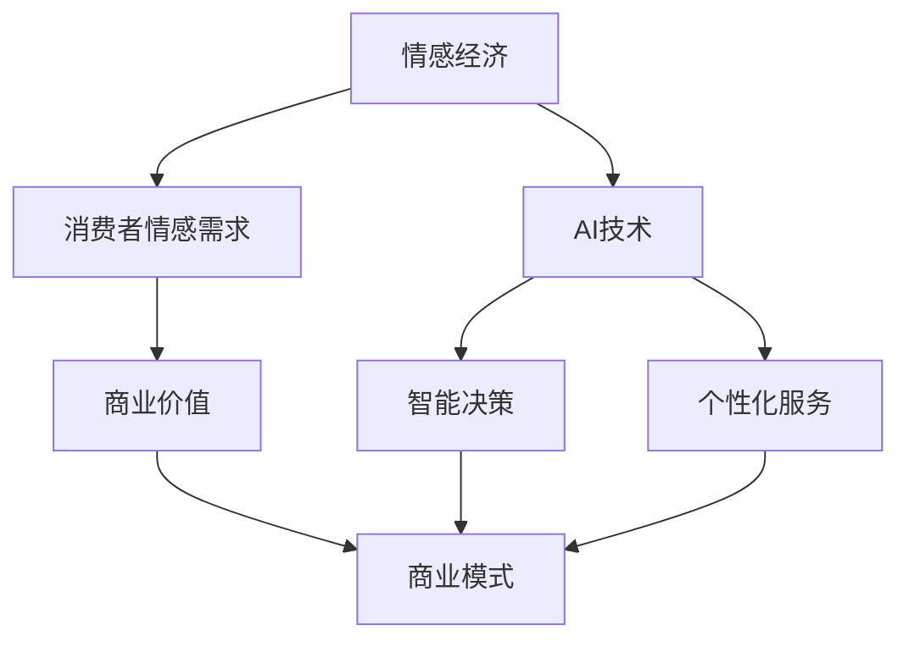

                 

# 《情感经济：AI驱动的新商业模式》目录大纲

---

## 引言

### 1. 背景介绍

随着科技的飞速发展，人工智能（AI）已经成为推动各行各业变革的重要力量。在商业领域，AI技术的应用不仅改变了传统的商业模式，还催生了全新的经济形态——情感经济。本文将围绕《情感经济：AI驱动的新商业模式》一书，探讨情感经济的定义、起源、发展，以及AI在其中的关键作用。

### 2. 核心概念与联系

为了更好地理解情感经济，我们需要梳理以下几个核心概念及其相互关系：

- **情感经济**：一种以情感为核心驱动力的新型经济形态，强调消费者情感需求与商业价值的深度融合。
- **AI技术**：包括机器学习、深度学习等，用于处理和分析大量数据，从而实现智能决策和个性化服务。
- **商业模式**：企业如何创造、传递和捕获价值的方法，随着AI技术的发展，商业模式也在不断演变。

Mermaid流程图：

## 第一部分：情感经济的概述

### 1.1 情感经济的定义与特点

情感经济是一种新兴的经济模式，它将情感因素融入到商业活动中，通过满足消费者的情感需求来创造价值。情感经济的特点包括：

- **情感驱动**：强调情感需求对消费者行为的影响，通过激发消费者情感来提高品牌忠诚度和购买意愿。
- **个性定制**：利用AI技术分析消费者情感，实现个性化产品和服务，满足消费者独特的情感需求。
- **情感共鸣**：通过情感共鸣，建立消费者与品牌之间的深厚情感联系，提高品牌形象和市场份额。

### 1.2 情感经济的起源

情感经济的起源可以追溯到20世纪末。随着互联网和移动通信的普及，消费者对个性化和情感体验的需求日益增长，传统商业模式难以满足这些需求。因此，企业开始探索如何将情感元素融入商业活动中，从而催生了情感经济。

### 1.3 情感经济对社会经济的影响

情感经济对社会经济产生了深远的影响：

- **消费模式转变**：消费者更加注重情感体验，追求个性化和定制化服务。
- **产业升级**：传统产业通过融入情感经济元素，实现产业升级和转型。
- **市场细分**：情感经济催生了新的市场细分，为企业提供了更广阔的发展空间。

## 第二部分：AI技术基础

### 2.1 AI的基本概念与分类

人工智能（AI）是指通过计算机模拟人类智能的技术。根据实现方式，AI可以分为：

- **弱AI**：专注于特定任务的智能系统，如语音识别、图像识别等。
- **强AI**：具有人类智能的通用智能系统，目前尚未实现。

### 2.2 机器学习基础

机器学习是AI的核心技术之一，它通过算法从数据中自动学习规律，进行预测和决策。机器学习可以分为：

- **监督学习**：有标注的数据集用于训练模型。
- **无监督学习**：无标注的数据集用于发现数据中的模式。
- **强化学习**：通过奖励机制训练模型，实现最优策略。

### 2.3 深度学习原理

深度学习是机器学习的一个重要分支，它通过多层神经网络模型进行特征提取和分类。深度学习的关键技术包括：

- **卷积神经网络（CNN）**：用于图像识别和处理。
- **循环神经网络（RNN）**：用于序列数据建模。
- **生成对抗网络（GAN）**：用于生成数据和学习复杂分布。

## 第三部分：AI在商业模式中的应用

### 3.1 AI与消费者行为

#### 3.1.1 消费者行为分析

AI技术在消费者行为分析中发挥着重要作用，包括：

- **情感分析**：通过分析消费者情感，了解其需求和偏好。
- **行为预测**：预测消费者未来的购买行为和需求。

#### 3.1.2 AI技术在消费者行为研究中的应用

AI技术在消费者行为研究中的应用案例包括：

- **社交媒体分析**：通过分析消费者在社交媒体上的言论和行为，了解其情感和需求。
- **电子商务推荐系统**：基于消费者行为数据，提供个性化产品推荐。

#### 3.1.3 案例研究：AI在消费者行为分析中的应用

案例：某电商平台利用AI技术分析消费者购买行为，提高用户体验和转化率。

### 3.2 AI与市场营销

#### 3.2.1 市场营销中的AI应用

AI技术在市场营销中的应用包括：

- **个性化营销**：基于消费者数据，提供个性化广告和促销活动。
- **营销效果分析**：通过数据挖掘和机器学习，评估营销活动的效果。

#### 3.2.2 AI在品牌建设中的应用

AI技术在品牌建设中的应用包括：

- **品牌形象分析**：通过分析消费者对品牌的情感反应，优化品牌形象。
- **口碑管理**：通过AI技术监测和分析消费者口碑，及时应对负面情绪。

#### 3.2.3 案例研究：AI在市场营销中的应用

案例：某知名品牌利用AI技术进行个性化营销，成功提升品牌知名度和市场份额。

### 3.3 AI与企业战略

#### 3.3.1 企业战略与AI的结合

AI与企业战略的结合包括：

- **战略规划**：利用AI技术进行市场分析和竞争分析，制定更有针对性的战略。
- **风险管理**：通过AI技术预测和应对潜在风险。

#### 3.3.2 AI在战略规划中的应用

AI在战略规划中的应用包括：

- **行业趋势分析**：通过AI技术分析行业趋势，为企业提供战略建议。
- **竞争对手分析**：通过AI技术分析竞争对手的动态，优化企业战略。

#### 3.3.3 案例研究：AI在企业战略中的应用

案例：某科技企业利用AI技术进行战略规划，成功实现了业务增长和市场扩展。

## 第四部分：新商业模式的探索与实践

### 4.1 新商业模式的定义与类型

新商业模式是指企业创造、传递和捕获价值的创新方法。根据驱动因素，新商业模式可以分为：

- **技术驱动**：以技术创新为核心，如电子商务、共享经济等。
- **需求驱动**：以消费者需求为核心，如个性化定制、情感经济等。

### 4.2 情感经济驱动的商业模式创新

情感经济驱动的商业模式创新包括：

- **情感连接**：通过情感共鸣建立消费者与品牌之间的深厚联系。
- **情感定制**：基于消费者情感数据，提供个性化产品和服务。

#### 4.2.1 情感经济对商业模式的影响

情感经济对商业模式的影响包括：

- **消费者体验优化**：通过情感驱动，提高消费者体验和满意度。
- **品牌价值提升**：通过情感共鸣，提升品牌价值和市场份额。

#### 4.2.2 情感驱动的商业模式创新

情感驱动的商业模式创新包括：

- **情感营销**：通过情感共鸣和个性化服务，提高消费者忠诚度。
- **情感服务**：提供情感关怀和个性化服务，满足消费者情感需求。

#### 4.2.3 案例研究：情感经济驱动的商业模式创新

案例：某在线教育平台通过情感驱动，提供个性化学习体验，成功吸引了大量用户。

## 第五部分：案例分析

### 5.1 案例分析：情感经济与AI结合的成功实践

#### 5.1.1 案例选择与分析框架

案例选择与分析框架包括：

- **案例一**：某电商平台通过AI技术实现个性化推荐和情感分析，提高用户满意度。
- **案例二**：某奢侈品品牌通过情感经济和AI技术，打造情感连接和个性化服务。

#### 5.1.2 案例一：公司A的AI驱动的情感经济实践

案例一：某电商平台通过AI技术实现个性化推荐和情感分析，提高用户满意度。

- **个性化推荐**：利用AI技术分析用户行为数据，提供个性化商品推荐。
- **情感分析**：通过AI技术分析用户评论和反馈，了解用户情感需求。

#### 5.1.3 案例二：公司B的情感经济商业模式创新

案例二：某奢侈品品牌通过情感经济和AI技术，打造情感连接和个性化服务。

- **情感连接**：通过社交媒体和品牌互动，建立与消费者之间的情感联系。
- **个性化服务**：利用AI技术分析消费者数据，提供个性化购物体验。

## 结论

本文通过对《情感经济：AI驱动的新商业模式》一书的深入分析，探讨了情感经济的定义、起源、发展，以及AI在其中的关键作用。通过案例分析，我们看到了情感经济与AI技术的成功结合，为商业模式创新提供了新的思路。未来，随着AI技术的不断进步，情感经济将在商业领域发挥更加重要的作用。

---

## 附录

### 6. 相关资源与进一步阅读

- **书籍推荐**：
  - 《人工智能：一种现代方法》
  - 《深度学习》
  - 《大数据营销》
- **在线资源**：
  - Coursera上的《机器学习》课程
  - EdX上的《深度学习》课程
  - 《情感计算》杂志
- **学术论文**：
  - “The Emotional Economy: Why Our Decisions Are Driven by the Heart and the Brain” by Dan Ariely
  - “Artificial Intelligence and the Future of Business” by Andrew Ng

---

### 作者信息

- **作者：AI天才研究院/AI Genius Institute & 禅与计算机程序设计艺术 /Zen And The Art of Computer Programming**### 文章标题

# 情感经济：AI驱动的新商业模式

---

### 文章关键词

- 情感经济
- AI
- 商业模式
- 消费者行为
- 市场营销
- 企业战略

---

### 文章摘要

随着人工智能技术的飞速发展，情感经济作为一种新兴的经济模式，正逐渐成为商业领域的新风口。本文以《情感经济：AI驱动的新商业模式》一书为基础，详细分析了情感经济的定义、起源、发展，以及AI在其中的关键作用。通过探讨AI在消费者行为分析、市场营销和企业战略等方面的应用，本文揭示了情感经济与AI技术结合所带来的商业模式创新，并通过对成功案例的深入剖析，展示了这一新兴经济模式的巨大潜力和广泛应用前景。

---

### 目录

## 第一部分：情感经济的概述

### 1.1 情感经济的定义与特点

### 1.2 情感经济的起源

### 1.3 情感经济对社会经济的影响

## 第二部分：AI技术基础

### 2.1 AI的基本概念与分类

### 2.2 机器学习基础

### 2.3 深度学习原理

## 第三部分：AI在商业模式中的应用

### 3.1 AI与消费者行为

#### 3.1.1 消费者行为分析

#### 3.1.2 AI技术在消费者行为研究中的应用

#### 3.1.3 案例研究：AI在消费者行为分析中的应用

### 3.2 AI与市场营销

#### 3.2.1 市场营销中的AI应用

#### 3.2.2 AI在品牌建设中的应用

#### 3.2.3 案例研究：AI在市场营销中的应用

### 3.3 AI与企业战略

#### 3.3.1 企业战略与AI的结合

#### 3.3.2 AI在战略规划中的应用

#### 3.3.3 案例研究：AI在企业战略中的应用

## 第四部分：新商业模式的探索与实践

### 4.1 新商业模式的定义与类型

### 4.2 情感经济驱动的商业模式创新

#### 4.2.1 情感经济对商业模式的影响

#### 4.2.2 情感驱动的商业模式创新

#### 4.2.3 案例研究：情感经济驱动的商业模式创新

## 第五部分：案例分析

### 5.1 案例分析：情感经济与AI结合的成功实践

#### 5.1.1 案例选择与分析框架

#### 5.1.2 案例一：公司A的AI驱动的情感经济实践

#### 5.1.3 案例二：公司B的情感经济商业模式创新

## 附录

### 6. 相关资源与进一步阅读

### 7. 作者信息

---

### 第一部分：情感经济的概述

### 1.1 情感经济的定义与特点

情感经济是一种新兴的经济模式，它以消费者的情感需求为核心，将情感元素融入到商业活动中。与传统经济模式不同，情感经济注重消费者情感体验和情感价值的创造。情感经济的特点主要包括：

1. **情感驱动**：情感经济强调情感需求对消费者行为的影响，通过激发消费者的情感来促进消费行为。情感需求包括愉悦、安全感、归属感、成就感等，它们是消费者决策的重要驱动力。

2. **个性定制**：情感经济利用人工智能技术，对消费者的情感数据进行深度分析，实现个性化产品和服务。通过个性定制，企业能够更好地满足消费者的情感需求，提高消费者的满意度和忠诚度。

3. **情感共鸣**：情感经济注重与消费者的情感共鸣，通过情感互动和沟通，建立消费者与品牌之间的深厚情感联系。情感共鸣能够增强消费者的品牌忠诚度，提高市场份额。

4. **情感价值**：情感经济将情感价值视为一种重要的商业资源，通过创造和传递情感价值，企业能够提升品牌价值和市场竞争力。

### 1.2 情感经济的起源

情感经济的概念最早可以追溯到20世纪末。随着互联网和移动通信的普及，消费者对个性化和情感体验的需求日益增长。传统商业模式难以满足这些需求，因此企业开始探索如何将情感元素融入到商业活动中。这一探索过程催生了情感经济的兴起。

情感经济的起源主要包括以下几个方面：

1. **消费者行为变化**：互联网和移动通信的普及改变了消费者的消费行为和需求。消费者更加注重个性化和情感体验，追求与众不同和情感共鸣。

2. **情感营销兴起**：企业开始意识到情感需求对消费者行为的影响，开始运用情感营销策略来提升品牌形象和市场份额。情感营销强调与消费者的情感互动和沟通，通过情感共鸣来促进消费行为。

3. **人工智能技术的发展**：人工智能技术的飞速发展，为情感经济提供了强大的技术支持。通过机器学习和深度学习算法，企业能够对消费者的情感数据进行深度分析，实现个性化产品和服务。

### 1.3 情感经济对社会经济的影响

情感经济对社会经济产生了深远的影响，主要体现在以下几个方面：

1. **消费模式转变**：情感经济的兴起改变了消费者的消费模式。消费者不再仅仅关注产品功能和价格，更加注重情感体验和个性化需求。企业需要通过情感驱动来满足消费者的需求，提高消费者的满意度和忠诚度。

2. **产业升级**：情感经济的兴起推动了传统产业的升级和转型。传统产业通过融入情感经济元素，提高产品附加值，实现产业升级和转型。例如，零售业通过情感营销策略，提升消费者的购物体验，推动线上线下的融合。

3. **市场细分**：情感经济的兴起催生了新的市场细分。企业通过情感经济策略，针对不同消费者的情感需求，提供个性化的产品和服务。这种市场细分为企业提供了更广阔的发展空间，也促进了市场的多元化。

4. **商业模式创新**：情感经济的兴起推动了商业模式的创新。企业通过情感经济策略，实现消费者与品牌之间的情感连接，提高品牌忠诚度和市场份额。同时，情感经济也催生了新的商业模式，如情感电商、情感体验店等。

### 1.4 情感经济的基本概念与联系

为了更好地理解情感经济，我们需要梳理以下几个核心概念及其相互关系：

1. **情感经济**：情感经济是一种以情感为核心驱动力的新型经济模式，强调消费者情感需求与商业价值的深度融合。

2. **消费者情感需求**：消费者情感需求是指消费者在购买和使用产品或服务过程中所体验到的各种情感，如愉悦、安全感、归属感、成就感等。

3. **商业价值**：商业价值是指企业在创造、传递和捕获价值过程中所获得的收益和竞争优势。

4. **情感连接**：情感连接是指消费者与品牌之间的情感互动和沟通，通过情感共鸣来建立深厚的情感联系。

5. **个性化产品和服务**：个性化产品和服务是指企业根据消费者的情感需求和偏好，提供定制化的产品和服务，以满足消费者的个性化需求。

6. **情感营销**：情感营销是指企业通过情感互动和沟通，激发消费者的情感需求，促进消费行为的一种营销策略。

7. **情感价值**：情感价值是指消费者在购买和使用产品或服务过程中所体验到的情感满足和情感收益。

这些概念相互关联，构成了情感经济的基本框架。情感经济通过满足消费者的情感需求，创造和传递情感价值，实现商业价值的提升。而AI技术在这一过程中发挥着关键作用，通过数据分析、个性化推荐和情感识别等技术手段，帮助企业更好地理解和满足消费者的情感需求。

### 1.5 情感经济与传统商业模式的区别

情感经济与传统商业模式在以下几个方面存在显著区别：

1. **核心驱动力**：传统商业模式的核心驱动力是产品功能和价格，而情感经济的核心驱动力是消费者的情感需求。情感经济强调通过满足消费者的情感需求来促进消费行为，提升消费者的满意度和忠诚度。

2. **目标群体**：传统商业模式的目标群体是大众市场，而情感经济的目标群体是具有特定情感需求的消费者群体。情感经济通过深入了解消费者的情感需求，提供个性化的产品和服务，满足消费者的独特需求。

3. **营销策略**：传统商业模式主要采用价格竞争和广告宣传等手段，而情感经济注重情感互动和情感共鸣。情感经济通过情感营销策略，与消费者建立深厚的情感联系，提升品牌忠诚度和市场份额。

4. **商业价值**：传统商业模式追求的是利润最大化，而情感经济追求的是情感价值的最大化。情感经济通过创造和传递情感价值，提升品牌形象和市场竞争力，实现可持续发展。

5. **技术应用**：传统商业模式对技术的依赖较少，而情感经济对AI技术具有高度依赖。情感经济通过大数据分析、机器学习和深度学习等技术手段，实现个性化推荐和情感识别，提高营销效果和用户体验。

总之，情感经济在核心驱动力、目标群体、营销策略、商业价值和技术应用等方面与传统商业模式存在显著差异，它更加注重消费者的情感需求和个性化体验，通过情感连接和情感共鸣来实现商业价值的提升。

### 1.6 情感经济的主要特点

情感经济作为一种新兴的经济模式，具有以下几个显著特点：

1. **情感驱动**：情感经济以消费者的情感需求为核心，通过激发和满足消费者的情感需求来促进消费行为。情感驱动是情感经济与传统商业模式最本质的区别之一。

2. **个性定制**：情感经济强调个性化和定制化服务。通过大数据分析和机器学习技术，企业可以深入了解消费者的情感需求，提供个性化的产品和服务，满足消费者的独特需求。

3. **情感共鸣**：情感经济注重与消费者的情感共鸣，通过情感互动和沟通，建立消费者与品牌之间的深厚情感联系。情感共鸣能够增强消费者的品牌忠诚度，提升市场份额。

4. **情感价值**：情感经济将情感价值视为一种重要的商业资源，通过创造和传递情感价值，提升品牌形象和市场竞争力。

5. **技术赋能**：情感经济对技术的依赖程度较高，特别是人工智能技术。AI技术在情感识别、个性化推荐、情感分析等方面发挥了关键作用，为情感经济提供了强大的技术支持。

6. **跨界融合**：情感经济涉及多个行业和领域，如零售、电商、金融、娱乐等。通过跨界融合，企业可以实现资源的共享和优化，创造更大的商业价值。

7. **可持续发展**：情感经济注重长期可持续发展，通过满足消费者的情感需求，建立稳定的消费者关系，实现企业的持续增长。

这些特点共同构成了情感经济的独特魅力，使其在商业领域中具有广阔的发展前景。

### 1.7 情感经济的理论基础

情感经济的理论基础主要基于心理学、社会学和经济学等多个学科领域。以下是对情感经济相关理论基础的概述：

1. **心理学理论**：心理学理论为情感经济提供了重要的理论基础。心理学家认为，情感是人类行为的重要驱动力，情感需求对消费者的决策和行为具有显著影响。情感心理学研究情感的产生、表达、调节和作用机制，为理解消费者的情感需求和行为提供了科学依据。

2. **社会学理论**：社会学理论探讨了社会互动和关系对个体行为的影响。社会心理学研究表明，个体在群体中的情感状态和行为受到社会因素的影响。在社会互动中，情感共鸣和情感连接是形成社会关系的重要机制，这为情感经济中的情感互动和品牌忠诚度提供了理论支持。

3. **经济学理论**：经济学理论为情感经济中的商业价值创造和传递提供了理论基础。经济学中的消费者行为理论认为，消费者的购买决策受到多种因素的影响，包括产品功能、价格、品牌形象等。情感经济通过满足消费者的情感需求，提升消费者的满意度和忠诚度，从而实现商业价值的最大化。

4. **营销理论**：营销理论在情感经济中发挥着重要作用。情感营销理论强调通过情感互动和情感共鸣来吸引和保留消费者。情感营销不仅关注消费者的理性需求，更注重情感需求的满足，通过情感连接和情感共鸣来建立品牌忠诚度。

5. **行为经济学理论**：行为经济学理论探讨了人类行为的非理性特征，为理解消费者的情感决策提供了新的视角。行为经济学研究表明，消费者的决策受到情感和非理性因素的影响，如情感情绪、认知偏差等。情感经济利用这些非理性因素，通过情感驱动来促进消费行为。

6. **社会心理学理论**：社会心理学理论关注个体在社会环境中的行为和情感反应。社会心理学研究表明，个体在群体中的行为和情感状态会受到群体规范和文化价值观的影响。在社会互动中，情感共鸣和情感连接是形成社会认同和归属感的重要机制，这为情感经济中的社会互动和品牌建设提供了理论支持。

这些理论基础共同构成了情感经济的理论框架，为理解情感经济的本质和运作机制提供了科学依据。通过综合运用这些理论，企业可以更好地把握消费者的情感需求，设计满足这些需求的产品和服务，实现商业价值的提升。

### 1.8 情感经济的发展趋势

情感经济作为一种新兴的经济模式，正不断演变和发展。以下是对情感经济未来发展趋势的概述：

1. **技术融合**：随着人工智能、大数据、云计算等技术的不断发展，情感经济将更加依赖于技术手段。未来，企业将充分利用AI技术，实现对消费者情感需求的深度分析和个性化服务。同时，物联网和5G技术的普及也将促进情感经济的智能化和自动化。

2. **个性化和定制化**：情感经济将继续朝着个性化和定制化的方向发展。通过大数据分析和机器学习技术，企业可以更准确地了解消费者的情感需求，提供个性化的产品和服务。这种定制化服务将进一步提升消费者的满意度和忠诚度。

3. **跨界融合**：情感经济将与其他行业和领域进行深度融合。例如，零售业与娱乐业、教育业等领域的跨界合作，将创造出更多具有情感价值的商业模式。跨界融合将为企业提供更广阔的发展空间，推动产业升级和转型。

4. **全球化发展**：随着全球化进程的加速，情感经济将在全球范围内得到广泛应用。不同国家和地区的消费者有不同的情感需求和偏好，企业需要通过本地化和全球化战略，满足不同市场的需求。

5. **可持续发展**：情感经济将更加注重可持续发展。企业将注重社会责任和环境保护，通过创造和传递情感价值，实现经济、社会和环境的协调发展。

6. **情感科技创新**：情感经济将推动情感科技创新。例如，情感计算、虚拟现实、增强现实等技术将进一步提升消费者的情感体验，为情感经济提供新的发展动力。

总之，情感经济在未来将呈现出技术融合、个性化和定制化、跨界融合、全球化发展、可持续发展以及情感科技创新等趋势。这些趋势将推动情感经济不断演变和发展，为商业领域带来新的机遇和挑战。

### 1.9 情感经济的主要挑战

尽管情感经济展现出巨大的潜力和发展前景，但其在实践中也面临诸多挑战。以下是对情感经济主要挑战的概述：

1. **数据隐私与安全**：情感经济高度依赖消费者数据的收集和分析。然而，数据隐私和安全问题始终是关注的焦点。在利用数据创造商业价值的同时，企业需要确保数据的保护，避免数据泄露和滥用。

2. **技术依赖性**：情感经济对技术的依赖程度较高，特别是在人工智能和大数据分析领域。然而，技术的不稳定性和技术瓶颈可能限制情感经济的发展。企业需要持续投入技术研发，以应对技术挑战。

3. **消费者信任**：情感经济强调个性化和定制化服务，这要求企业深入了解消费者的情感需求。然而，消费者对隐私和数据安全的担忧可能影响其对企业的信任。企业需要通过透明和诚信的运营，建立和维护消费者的信任。

4. **情感识别准确性**：情感识别是情感经济的关键环节。然而，情感识别的准确性仍然是一个挑战。情感的复杂性使得传统的人工智能算法难以完全准确识别和解读情感。企业需要不断优化算法，提高情感识别的准确性。

5. **监管合规**：情感经济的快速发展可能引发监管合规问题。不同国家和地区对数据隐私、消费者权益等方面的监管要求不同，企业需要遵守相关法律法规，确保合规经营。

6. **文化差异**：情感经济在全球范围内的应用需要考虑文化差异。不同文化背景下，消费者的情感需求和表达方式可能不同。企业需要具备跨文化沟通能力，提供适应不同文化背景的情感服务。

总之，情感经济在发展过程中面临数据隐私与安全、技术依赖性、消费者信任、情感识别准确性、监管合规和文化差异等主要挑战。企业需要积极应对这些挑战，确保情感经济健康、可持续地发展。

### 1.10 情感经济的重要性

情感经济作为一种新兴的经济模式，具有重要的现实意义和深远的影响。以下是情感经济的重要性概述：

1. **满足消费者需求**：情感经济以消费者的情感需求为核心，通过个性化定制和情感互动，满足消费者的个性化需求。这有助于提高消费者的满意度和忠诚度，增强品牌竞争力。

2. **推动产业升级**：情感经济的兴起推动了传统产业的升级和转型。企业通过融入情感经济元素，提高产品附加值，实现产业升级和转型。这有助于提升整个产业链的竞争力和创新能力。

3. **提升品牌价值**：情感经济强调情感连接和情感共鸣，通过建立与消费者之间的深厚情感联系，提升品牌价值和市场份额。这有助于企业建立长期稳定的消费者关系，实现可持续发展。

4. **促进社会进步**：情感经济关注消费者的情感需求和心理健康，通过提供情感关怀和个性化服务，促进社会和谐与进步。这有助于提升社会整体幸福感和生活质量。

5. **引领未来发展**：情感经济代表了未来经济发展的新方向。随着人工智能技术的不断进步，情感经济将发挥越来越重要的作用，推动经济社会的全面发展。

总之，情感经济在满足消费者需求、推动产业升级、提升品牌价值、促进社会进步和引领未来发展等方面具有重要性。企业和社会应当重视情感经济的发展，积极应对挑战，实现情感经济的可持续繁荣。

### 第二部分：AI技术基础

### 2.1 AI的基本概念与分类

人工智能（Artificial Intelligence，简称AI）是指通过计算机系统模拟人类智能的技术。AI的目标是使计算机能够执行复杂的任务，如理解语言、识别图像、解决问题等。AI可以分为以下几类：

1. **弱AI（Narrow AI）**：弱AI是指专门为执行特定任务而设计的智能系统。这类系统在特定领域内表现出色，但无法进行跨领域的通用任务。例如，语音助手（如Siri和Alexa）和图像识别系统。

2. **强AI（General AI）**：强AI是指具有人类智能的通用智能系统，能够理解和执行各种复杂任务。强AI尚未实现，目前仍处于理论研究阶段。

3. **认知AI（Cognitive AI）**：认知AI结合了人类认知科学和机器学习技术，旨在模拟人类的思维过程，如推理、学习和问题解决。认知AI应用于自然语言处理、医学诊断和智能客服等领域。

4. **强化学习AI（Reinforcement Learning AI）**：强化学习AI通过试错法来学习，通过奖励机制优化行为。这类AI广泛应用于游戏、自动驾驶和机器人控制等领域。

5. **混合智能（Hybrid Intelligence）**：混合智能结合了多种AI技术，如深度学习、强化学习和认知AI，以实现更复杂的任务。例如，混合智能系统可以在金融预测、医疗诊断和智能制造等领域发挥作用。

### 2.2 机器学习基础

机器学习（Machine Learning，简称ML）是AI的核心技术之一，它使计算机系统能够从数据中学习，进行预测和决策。机器学习可以分为以下几种类型：

1. **监督学习（Supervised Learning）**：监督学习使用标记数据集进行训练，模型根据输入和输出之间的关系进行学习。常见的监督学习算法包括线性回归、决策树和神经网络。

2. **无监督学习（Unsupervised Learning）**：无监督学习不使用标记数据集，而是通过发现数据中的模式进行学习。常见的无监督学习算法包括聚类算法（如K-means）和降维算法（如PCA）。

3. **半监督学习（Semi-supervised Learning）**：半监督学习结合了监督学习和无监督学习，利用少量标记数据和大量未标记数据进行学习。

4. **强化学习（Reinforcement Learning）**：强化学习通过试错法进行学习，系统根据奖励信号不断优化行为。强化学习算法广泛应用于游戏、自动驾驶和机器人控制等领域。

### 2.3 深度学习原理

深度学习（Deep Learning，简称DL）是机器学习的一个分支，它使用多层神经网络模型进行特征提取和分类。深度学习的关键技术和组成部分包括：

1. **神经网络（Neural Networks）**：神经网络是深度学习的基础，由多个神经元组成，每个神经元都与其他神经元相连。神经网络通过多层结构进行特征提取和分类。

2. **卷积神经网络（Convolutional Neural Networks，CNN）**：CNN主要用于图像识别和处理。CNN通过卷积层、池化层和全连接层等结构，提取图像的特征并进行分类。

3. **循环神经网络（Recurrent Neural Networks，RNN）**：RNN适用于序列数据处理，如自然语言处理和语音识别。RNN通过循环结构处理序列数据，实现对过去信息的记忆。

4. **生成对抗网络（Generative Adversarial Networks，GAN）**：GAN由生成器和判别器两个神经网络组成，生成器和判别器相互对抗，生成器试图生成与真实数据相似的数据，判别器试图区分真实数据和生成数据。

5. **深度强化学习（Deep Reinforcement Learning）**：深度强化学习结合了深度学习和强化学习，通过深度神经网络进行状态值函数和价值函数的估计，优化策略。

### 2.4 AI技术的基础原理与实际应用

AI技术的基础原理主要包括：

1. **数据预处理**：数据预处理是AI模型训练的重要步骤，包括数据清洗、归一化、缺失值处理等。数据预处理的质量直接影响模型的性能。

2. **特征工程**：特征工程是通过选择、构造和变换特征，提高模型训练效果的过程。特征工程包括特征选择、特征构造和特征降维等。

3. **模型训练与优化**：模型训练是指通过大量数据训练模型，使其能够进行预测和分类。模型优化是通过调整模型参数，提高模型的性能和泛化能力。

4. **模型评估与部署**：模型评估是指通过测试集评估模型的性能，包括准确性、召回率、F1值等指标。模型部署是将训练好的模型应用到实际场景中，如生产环境或移动设备。

在实际应用中，AI技术广泛应用于：

1. **图像识别与处理**：通过卷积神经网络和深度学习算法，实现图像分类、目标检测和图像生成等任务。

2. **自然语言处理**：通过循环神经网络和生成对抗网络，实现文本分类、情感分析和机器翻译等任务。

3. **语音识别与生成**：通过深度学习算法，实现语音识别、语音合成和语音增强等任务。

4. **推荐系统**：通过协同过滤和深度学习算法，实现个性化推荐和内容推荐。

5. **医疗诊断与预测**：通过深度学习和强化学习，实现疾病诊断、药物研发和健康预测等任务。

总之，AI技术基础原理包括数据预处理、特征工程、模型训练与优化、模型评估与部署等，其实际应用涵盖图像识别、自然语言处理、语音识别、推荐系统和医疗诊断等多个领域。

### 2.5 机器学习的算法原理

机器学习算法是AI技术的重要组成部分，通过学习数据中的规律来进行预测和决策。以下是几种常见的机器学习算法及其原理：

1. **线性回归（Linear Regression）**：
   - **原理**：线性回归通过建立一个线性模型来预测目标变量的值。该模型可以表示为 $y = \beta_0 + \beta_1x_1 + ... + \beta_nx_n$，其中 $y$ 是目标变量，$x_1, ..., x_n$ 是特征变量，$\beta_0, ..., \beta_n$ 是模型参数。
   - **应用**：线性回归常用于预测数值型目标变量，如房价、股票价格等。

2. **逻辑回归（Logistic Regression）**：
   - **原理**：逻辑回归是一种用于分类的算法，通过建立一个逻辑函数来预测目标变量的概率分布。该模型可以表示为 $P(y=1) = \frac{1}{1 + e^{-(\beta_0 + \beta_1x_1 + ... + \beta_nx_n)}$，其中 $y$ 是目标变量，$x_1, ..., x_n$ 是特征变量，$\beta_0, ..., \beta_n$ 是模型参数。
   - **应用**：逻辑回归常用于二分类问题，如邮件分类、垃圾邮件检测等。

3. **决策树（Decision Tree）**：
   - **原理**：决策树通过一系列规则来划分数据集，每个节点代表一个特征，每个分支代表该特征的取值。决策树模型可以表示为一系列条件概率分布。
   - **应用**：决策树常用于分类和回归问题，如客户流失预测、信用评分等。

4. **随机森林（Random Forest）**：
   - **原理**：随机森林是一种集成学习方法，通过构建多个决策树并对它们的预测结果进行投票来获得最终预测结果。随机森林通过引入随机性来降低过拟合风险。
   - **应用**：随机森林广泛应用于分类和回归问题，如客户行为分析、疾病诊断等。

5. **支持向量机（Support Vector Machine，SVM）**：
   - **原理**：支持向量机通过找到一个最优超平面来分隔数据集，使得分类边界最大化。SVM使用核函数来处理非线性分类问题。
   - **应用**：SVM广泛应用于二分类问题，如文本分类、图像识别等。

6. **神经网络（Neural Networks）**：
   - **原理**：神经网络由多个神经元组成，每个神经元与输入层和输出层连接。神经网络通过学习输入和输出之间的关系来建立模型。深度神经网络通过多层结构进行特征提取和分类。
   - **应用**：神经网络广泛应用于图像识别、语音识别、自然语言处理等领域。

这些机器学习算法在商业和科研领域都有广泛的应用，通过合理选择和应用，可以实现数据的有效分析和预测。

### 2.6 深度学习算法的工作原理

深度学习（Deep Learning，简称DL）是一种基于多层神经网络的学习方法，其核心思想是通过层层提取特征，从原始数据中自动构建出具有解释力的模型。以下是深度学习算法的工作原理和关键组件：

1. **多层神经网络**：深度学习算法的核心是多层神经网络（Multilayer Neural Networks），它包括输入层、隐藏层和输出层。输入层接收原始数据，隐藏层通过多次变换提取数据中的特征，输出层生成最终预测结果。

2. **激活函数**：激活函数是神经网络中的一个关键组件，它用于引入非线性变换，使得神经网络能够学习复杂函数。常见的激活函数包括Sigmoid函数、ReLU函数和Tanh函数。

3. **反向传播算法**：反向传播算法（Backpropagation Algorithm）是深度学习训练过程中用于更新模型参数的关键算法。它通过计算输出误差，逐层反向传播误差，并更新各层的参数，以最小化误差函数。

4. **优化算法**：优化算法用于最小化损失函数，常见的优化算法包括梯度下降（Gradient Descent）、Adam优化器等。

5. **正则化技术**：正则化技术用于防止模型过拟合，常见的正则化方法包括L1正则化、L2正则化和Dropout等。

6. **卷积神经网络（Convolutional Neural Networks，CNN）**：
   - **原理**：卷积神经网络通过卷积层、池化层和全连接层等结构，提取图像的特征并进行分类。卷积层通过卷积运算提取图像局部特征，池化层用于降低特征维度和计算量。
   - **应用**：CNN广泛应用于图像识别、物体检测和图像生成等领域。

7. **循环神经网络（Recurrent Neural Networks，RNN）**：
   - **原理**：循环神经网络适用于序列数据处理，如自然语言处理和语音识别。RNN通过循环结构处理序列数据，实现对过去信息的记忆。
   - **应用**：RNN广泛应用于文本分类、机器翻译和语音识别等领域。

8. **生成对抗网络（Generative Adversarial Networks，GAN）**：
   - **原理**：生成对抗网络由生成器和判别器两个神经网络组成，生成器尝试生成与真实数据相似的数据，判别器试图区分真实数据和生成数据。生成器和判别器相互对抗，生成器不断优化生成数据的质量。
   - **应用**：GAN广泛应用于图像生成、数据增强和风格迁移等领域。

通过这些关键组件和算法，深度学习能够自动从数据中提取特征，构建复杂的模型，并在各种任务中实现出色的性能。

### 2.7 AI技术的应用领域

人工智能（AI）技术已经在众多领域得到广泛应用，推动了这些领域的发展和创新。以下是AI技术在一些关键领域的应用：

1. **医疗健康**：
   - **诊断与预测**：AI技术可以辅助医生进行疾病诊断，如利用深度学习算法分析医学影像，提高诊断准确性。AI还可以预测疾病发展趋势，帮助制定个性化的治疗方案。
   - **药物研发**：通过机器学习和生成对抗网络，AI能够加速药物研发过程，提高新药的发现速度和成功率。
   - **个性化医疗**：AI可以根据患者的基因信息和病历数据，提供个性化的诊断和治疗建议。

2. **金融与保险**：
   - **风险控制**：AI技术可以分析大量历史数据，识别潜在的金融风险，帮助金融机构进行风险评估和风险控制。
   - **欺诈检测**：通过模式识别和机器学习算法，AI可以识别和预防金融欺诈行为，提高交易的安全性。
   - **投资策略**：AI可以根据市场数据和历史趋势，为投资者提供个性化的投资建议，优化投资组合。

3. **零售与电商**：
   - **个性化推荐**：AI技术可以通过分析用户的购买历史和偏好，提供个性化的产品推荐，提高用户体验和转化率。
   - **库存管理**：AI可以帮助零售商优化库存管理，预测销售趋势，减少库存积压。
   - **客户服务**：AI聊天机器人可以提供24/7的客户服务，解答客户问题，提高客户满意度。

4. **制造与工业**：
   - **设备维护**：通过预测性维护，AI可以提前发现设备故障，减少停机时间和维护成本。
   - **生产优化**：AI技术可以优化生产流程，提高生产效率和质量。
   - **供应链管理**：AI可以帮助企业优化供应链，提高物流效率，降低成本。

5. **交通与物流**：
   - **自动驾驶**：AI技术正在推动自动驾驶技术的发展，通过传感器和深度学习算法，自动驾驶车辆可以实时感知环境并进行决策。
   - **智能交通管理**：AI可以优化交通信号控制，缓解交通拥堵，提高道路利用率。
   - **物流优化**：AI可以帮助物流企业优化运输路线和配送策略，提高配送效率。

6. **教育与培训**：
   - **个性化学习**：AI可以根据学生的学习进度和偏好，提供个性化的学习资源和学习路径。
   - **智能评估**：AI可以自动评估学生的作业和考试成绩，提供实时反馈。
   - **虚拟教学**：通过虚拟现实（VR）和增强现实（AR）技术，AI可以提供沉浸式的学习体验。

7. **娱乐与媒体**：
   - **内容推荐**：AI可以根据用户的历史行为和偏好，推荐个性化的内容和广告。
   - **语音合成**：AI技术可以生成自然流畅的语音，应用于语音助手、语音导航等领域。
   - **图像识别**：AI可以识别和分类图像，应用于图像搜索、图像编辑和图像识别等领域。

AI技术的广泛应用不仅提高了各行各业的效率和质量，也为未来的发展带来了新的机遇和挑战。随着技术的不断进步，AI将在更多领域发挥关键作用，推动社会的持续创新和进步。

### 第三部分：AI在商业模式中的应用

#### 3.1 AI与消费者行为

#### 3.1.1 消费者行为分析

消费者行为分析是商业战略中的重要一环，它通过研究消费者的购买行为、偏好、需求等，帮助企业更好地理解市场，优化营销策略。人工智能（AI）技术在消费者行为分析中发挥着关键作用，以下是AI技术在消费者行为分析中的几个重要应用：

1. **情感分析**：情感分析是AI技术的一种重要应用，它通过自然语言处理（NLP）技术，对消费者的文本数据（如社交媒体评论、产品评价、在线聊天记录等）进行分析，识别其中的情感倾向。通过情感分析，企业可以了解消费者的情感状态，如满意、愤怒、失望等，从而调整产品和服务策略。

2. **行为预测**：基于机器学习和深度学习算法，AI可以从消费者的历史行为数据中预测其未来的购买行为。例如，通过分析消费者的购物车、浏览历史和购买记录，AI可以预测消费者可能感兴趣的产品，从而进行个性化的推荐。

3. **需求识别**：AI可以通过分析消费者在社交媒体、评论区和问卷调查等渠道提供的数据，识别消费者的需求。这些需求可能包括对产品功能、外观、价格等方面的具体要求。通过了解消费者需求，企业可以更好地设计产品和服务，满足消费者的期望。

4. **个性化推荐**：AI技术可以帮助企业实现个性化推荐。通过分析消费者的购买行为、浏览历史和偏好，AI可以推荐消费者可能感兴趣的产品和服务。个性化推荐不仅可以提高用户的购物体验，还可以提高转化率和客户满意度。

5. **市场细分**：AI技术可以基于消费者的行为数据和情感分析结果，将消费者分为不同的细分市场。通过市场细分，企业可以更有针对性地制定营销策略，提高营销效果。

#### 3.1.2 AI技术在消费者行为研究中的应用

AI技术在消费者行为研究中有着广泛的应用，以下是一些具体的应用实例：

1. **社交媒体分析**：企业可以利用AI技术分析消费者在社交媒体上的言论和行为，了解他们对品牌和产品的态度。例如，通过分析消费者在Twitter、Facebook和Instagram等平台上的评论和互动，企业可以识别消费者的情感倾向和品牌偏好。

2. **电子商务分析**：在电子商务领域，AI技术可以帮助企业分析消费者的购买行为，如购物车放弃率、浏览路径和转化率等。通过这些分析，企业可以优化网站设计和用户体验，提高转化率。

3. **市场调研**：AI技术可以帮助企业自动分析市场调研数据，提取关键信息。例如，通过分析问卷调查结果，AI可以识别消费者对产品特性、价格和促销活动的偏好。

4. **客户细分**：基于消费者的行为数据和情感分析结果，AI技术可以帮助企业将客户分为不同的细分群体。这些细分群体可以基于不同的行为特征和需求，如高频购物者、价格敏感型消费者等。通过客户细分，企业可以针对不同群体制定更有效的营销策略。

5. **竞争分析**：AI技术可以分析竞争对手的网站、社交媒体和广告，了解他们的营销策略和市场表现。通过竞争分析，企业可以识别自身的优势和不足，调整营销策略。

#### 3.1.3 案例研究：AI在消费者行为分析中的应用

以下是一个具体的案例研究，展示了AI技术在消费者行为分析中的应用：

**案例：某电商平台的AI消费者行为分析**

某电商平台希望通过AI技术深入了解消费者的购买行为和需求，从而优化营销策略和提高用户体验。具体应用如下：

1. **情感分析**：平台利用情感分析技术，分析消费者在社交媒体和评论区的评论，了解他们对产品和品牌的情感倾向。通过情感分析，平台发现消费者对某些产品的评价普遍较低，主要是由于产品质量和售后服务的问题。基于这些分析结果，平台改进了相关产品的质量控制和售后服务。

2. **行为预测**：平台利用机器学习算法，分析消费者的购买历史、浏览历史和购物车数据，预测消费者可能感兴趣的产品。平台根据预测结果，向消费者发送个性化的推荐邮件和推送通知，从而提高转化率。

3. **需求识别**：平台通过分析消费者在市场调研问卷中的回答，识别他们对产品功能、价格和促销活动的需求。基于这些分析结果，平台调整了产品定价策略和促销活动，更好地满足消费者需求。

4. **个性化推荐**：平台利用AI技术，基于消费者的行为数据和偏好，实现个性化推荐。个性化推荐不仅提高了用户的购物体验，还提高了平台的销售额。

5. **市场细分**：平台通过AI技术，将消费者分为不同的细分群体，如高频购物者、价格敏感型消费者等。针对不同细分群体的特征和需求，平台制定了个性化的营销策略，从而提高了营销效果。

通过这个案例，我们可以看到AI技术在消费者行为分析中的应用如何帮助企业更好地理解市场，优化营销策略，提高用户体验和满意度。随着AI技术的不断发展，未来在消费者行为分析中的应用将更加广泛和深入。

### 3.2 AI与市场营销

#### 3.2.1 市场营销中的AI应用

人工智能（AI）在市场营销中具有广泛的应用，通过数据分析和预测，AI技术能够帮助企业优化营销策略，提高营销效果。以下是AI技术在市场营销中的几个关键应用：

1. **个性化营销**：AI技术可以分析消费者的行为数据、浏览历史和购买记录，了解消费者的兴趣和偏好。基于这些数据，AI可以生成个性化的营销内容和推荐，提高消费者的参与度和转化率。例如，电商平台可以利用AI技术，根据用户的浏览和购买历史，推荐相关商品，从而增加销售额。

2. **精准营销**：通过AI技术分析大量市场数据，如消费者行为、市场趋势和竞争对手信息，企业可以识别出最具潜力的目标客户群体，进行精准营销。例如，某品牌可以通过AI分析消费者购买历史和偏好，定位出高价值的客户群体，并进行定向营销活动，从而提高营销效果。

3. **情感营销**：AI技术可以通过自然语言处理（NLP）和情感分析，了解消费者的情感状态和情绪变化。企业可以利用这些信息进行情感营销，通过个性化的情感互动，提升品牌形象和消费者忠诚度。例如，某品牌可以通过AI分析社交媒体上的用户评论，了解消费者对产品的情感反馈，然后根据反馈调整营销策略。

4. **广告投放优化**：AI技术可以帮助企业优化广告投放策略，提高广告的点击率和转化率。例如，通过分析用户的行为数据和广告效果数据，AI可以自动调整广告展示时间和展示频率，实现更高效的广告投放。

5. **客户关系管理**：AI技术可以分析客户的互动数据和行为数据，帮助企业更好地管理客户关系。通过AI分析，企业可以识别出潜在的高价值客户，提供个性化的服务，从而提高客户满意度和忠诚度。例如，某金融机构可以通过AI分析客户的财务数据和行为数据，提供定制化的理财产品和服务。

6. **市场预测**：AI技术可以帮助企业预测市场趋势和消费者需求，为企业制定营销策略提供科学依据。例如，通过分析历史销售数据和宏观经济数据，AI可以预测未来的市场需求，帮助企业提前布局，抢占市场先机。

#### 3.2.2 AI在品牌建设中的应用

品牌建设是市场营销的重要组成部分，AI技术在品牌建设中也有广泛的应用。以下是AI技术在品牌建设中的几个关键应用：

1. **品牌形象分析**：AI技术可以通过自然语言处理（NLP）和情感分析，分析消费者在社交媒体、评论区和新闻报道中的言论，了解消费者对品牌的看法和态度。通过这些分析，企业可以识别品牌形象中的优势和不足，从而制定相应的品牌战略。

2. **口碑管理**：AI技术可以帮助企业实时监测和跟踪消费者的口碑反馈，识别潜在的负面情绪和问题。通过及时处理负面反馈，企业可以减少品牌损害，提升消费者满意度。例如，某品牌可以通过AI分析社交媒体上的评论，及时发现和处理消费者的投诉和不满，从而维护品牌形象。

3. **品牌传播**：AI技术可以优化品牌传播策略，通过数据分析识别出最具影响力的传播渠道和传播方式。例如，通过分析消费者的社交媒体行为和兴趣，AI可以推荐最适合的品牌传播渠道，提高品牌传播效果。

4. **品牌创新**：AI技术可以帮助企业进行品牌创新，通过分析消费者行为和市场趋势，识别新的品牌机会。例如，某品牌可以通过AI分析市场数据，发现消费者对环保和可持续产品的需求，从而推出相关产品，实现品牌创新。

5. **情感共鸣**：AI技术可以通过情感分析，了解消费者的情感需求和情感状态，从而设计更具共鸣力的品牌传播内容。例如，通过分析消费者在社交媒体上的情感反馈，AI可以帮助品牌设计出能够引起情感共鸣的广告和宣传语，提高品牌认知度和忠诚度。

#### 3.2.3 案例研究：AI在市场营销中的应用

以下是一个具体的案例研究，展示了AI在市场营销中的实际应用：

**案例：某奢侈品牌的AI营销策略**

某奢侈品牌希望通过AI技术提升品牌知名度和市场份额。以下是该品牌的AI营销策略：

1. **个性化营销**：品牌利用AI技术分析消费者的购买记录和社交媒体行为，了解消费者的兴趣和偏好。基于这些数据，品牌向消费者发送个性化的产品推荐和促销信息，提高了用户参与度和转化率。

2. **精准营销**：品牌通过AI分析市场数据和消费者行为，定位出高价值的客户群体。品牌为这些客户群体制定个性化的营销活动，如专属优惠、限量版产品等，从而提高客户的满意度和忠诚度。

3. **情感营销**：品牌利用AI技术分析消费者在社交媒体上的言论和情感状态，了解消费者对品牌的看法和态度。品牌根据分析结果，调整广告内容和传播策略，以更有效地与消费者建立情感连接。

4. **广告投放优化**：品牌通过AI技术优化广告投放策略，根据用户行为数据和广告效果数据，自动调整广告展示时间和展示频率，提高了广告的点击率和转化率。

5. **口碑管理**：品牌利用AI技术实时监测和跟踪消费者的口碑反馈，识别潜在的负面情绪和问题。品牌及时处理负面反馈，维护品牌形象，提高消费者满意度。

通过这个案例，我们可以看到AI技术在市场营销中的应用如何帮助企业提升品牌知名度和市场份额。随着AI技术的不断发展，未来在市场营销中的应用将更加广泛和深入。

### 3.3 AI与企业战略

#### 3.3.1 企业战略与AI的结合

随着人工智能（AI）技术的飞速发展，企业战略开始逐渐与AI技术相结合，以应对市场变化和提升竞争力。AI技术不仅为企业提供了强大的数据分析和预测能力，还改变了企业的决策模式，使其更加智能化和高效化。以下是企业战略与AI技术结合的几个关键方面：

1. **数据分析与预测**：AI技术可以处理和分析大量数据，从历史数据中提取有价值的信息，帮助企业做出更准确的预测。例如，企业可以利用AI分析市场趋势、消费者行为和竞争对手动态，预测未来的市场需求和竞争态势，从而制定更加精准的战略决策。

2. **智能化运营**：AI技术可以帮助企业实现智能化运营，提高生产效率和服务质量。例如，通过AI技术优化生产流程、自动化管理库存和物流，企业可以减少人力成本，提高运营效率。同时，AI技术可以实时监控设备运行状态，预测设备故障，实现预防性维护，降低设备故障率和停机时间。

3. **个性化服务**：AI技术可以为企业提供个性化服务，满足不同客户的需求，提高客户满意度和忠诚度。例如，通过分析客户的历史数据和偏好，AI可以提供个性化的产品推荐、定制化的服务和体验，从而增强客户的品牌认同感。

4. **战略规划**：AI技术可以辅助企业制定战略规划，通过数据分析和趋势预测，为企业提供决策支持。例如，企业可以利用AI分析市场数据，了解行业趋势和竞争环境，预测未来的市场机会和风险，从而制定更具前瞻性的战略规划。

5. **风险管理**：AI技术可以帮助企业识别和预测潜在风险，制定风险管理策略。例如，通过分析历史数据和实时数据，AI可以识别出潜在的市场风险、供应链风险和运营风险，并为企业提供风险预警和应对策略。

6. **创新驱动**：AI技术可以激发企业的创新活力，帮助企业开发新产品、开拓新市场。例如，通过AI技术分析市场需求和消费者行为，企业可以快速识别出潜在的创新机会，从而加快产品研发和市场推广。

总之，企业战略与AI技术的结合，不仅帮助企业提升了运营效率和服务质量，还为其带来了新的发展机遇。通过充分利用AI技术，企业可以更好地适应市场变化，提升竞争力，实现可持续发展。

#### 3.3.2 AI在战略规划中的应用

人工智能（AI）技术在企业战略规划中的应用越来越广泛，其强大的数据处理和分析能力为企业的战略决策提供了有力的支持。以下是AI在战略规划中应用的具体方面：

1. **市场分析**：AI技术可以处理和分析大量市场数据，包括行业报告、市场趋势、消费者行为等。通过这些数据，企业可以更准确地了解市场动态和竞争态势，识别市场机会和潜在风险。例如，企业可以利用AI分析全球市场的数据，预测未来市场的发展趋势，为企业制定全球战略提供数据支持。

2. **竞争对手分析**：AI技术可以帮助企业识别和分析竞争对手的战略、产品、市场表现等。通过这些分析，企业可以了解竞争对手的优势和劣势，制定针对性的战略措施。例如，企业可以通过AI分析竞争对手的广告投放策略、产品更新情况，预测竞争对手的下一步行动，从而调整自身的战略。

3. **消费者需求预测**：AI技术可以分析消费者的行为数据、购买历史和偏好，预测未来的消费者需求。这有助于企业及时调整产品和服务策略，满足市场需求。例如，通过分析消费者的浏览和购买数据，AI可以预测消费者对不同产品的兴趣变化，从而指导企业的产品研发和市场推广。

4. **风险预测**：AI技术可以识别和预测企业面临的潜在风险，包括市场风险、运营风险和财务风险等。通过这些预测，企业可以提前制定风险应对策略，降低风险带来的影响。例如，通过分析历史数据和实时数据，AI可以识别出潜在的市场波动、供应链中断和财务危机，为企业提供风险预警。

5. **资源优化**：AI技术可以帮助企业优化资源配置，提高运营效率。例如，通过分析生产数据，AI可以优化生产计划，减少生产浪费，提高生产效率。同时，AI技术还可以帮助企业优化库存管理，降低库存成本，提高资金利用效率。

6. **创新驱动**：AI技术可以激发企业的创新活力，通过分析市场需求和消费者行为，快速识别出潜在的创新机会。例如，通过分析消费者的反馈和评论，AI可以识别出消费者对现有产品的改进建议，从而帮助企业开发新产品，开拓新市场。

总之，AI技术在战略规划中的应用，不仅提高了企业的决策效率，还为其带来了新的发展机遇。通过充分利用AI技术，企业可以更准确地把握市场动态，制定更具前瞻性的战略规划，实现可持续发展。

#### 3.3.3 案例研究：AI在企业战略中的应用

以下是一个具体的案例研究，展示了AI技术在企业战略中的应用：

**案例：某科技公司的AI战略规划**

某科技公司是一家致力于提供创新科技产品的企业，希望通过AI技术提升市场竞争力，实现可持续发展。以下是该公司的AI战略规划：

1. **市场分析**：公司利用AI技术分析全球科技市场数据，了解行业趋势和竞争态势。通过分析市场报告、行业数据等，公司预测未来市场的发展趋势，确定了重点市场和发展方向。

2. **竞争对手分析**：公司通过AI技术分析竞争对手的战略、产品和市场表现，识别出竞争对手的优势和劣势。公司根据分析结果，制定了针对性的战略措施，包括产品差异化、技术创新和市场拓展等。

3. **消费者需求预测**：公司利用AI技术分析消费者的行为数据、购买历史和偏好，预测未来的消费者需求。公司根据预测结果，调整了产品研发方向，推出了符合消费者需求的新产品，提高了市场竞争力。

4. **风险预测**：公司通过AI技术分析市场数据、供应链数据和财务数据，预测潜在的运营风险和财务风险。公司根据风险预测结果，制定了相应的风险应对策略，包括供应链优化、财务风险管理和产品风险管理等。

5. **资源优化**：公司利用AI技术优化生产计划、库存管理和物流配送，提高了运营效率。通过AI技术分析生产数据，公司减少了生产浪费，提高了生产效率。同时，公司通过AI技术优化库存管理，降低了库存成本，提高了资金利用效率。

6. **创新驱动**：公司通过AI技术激发创新活力，分析市场需求和消费者行为，快速识别出潜在的创新机会。公司根据AI分析结果，加大了新产品研发投入，成功开发了一系列创新产品，开拓了新市场。

通过这个案例，我们可以看到AI技术在企业战略规划中的应用如何帮助企业提升市场竞争力，实现可持续发展。AI技术的应用不仅提高了企业的决策效率，还为企业的创新和增长提供了新的动力。

### 4.1 新商业模式的定义与类型

#### 4.1.1 新商业模式的定义

商业模式是指企业如何创造、传递和捕获价值的方法。传统商业模式通常围绕产品或服务的生产、销售和利润实现展开。然而，随着科技的进步和消费者需求的多样化，新的商业模式应运而生，它们更加注重创新、灵活性和可持续性。新商业模式不仅关注如何创造利润，还强调如何满足消费者的需求、提升用户体验和实现社会价值。

#### 4.1.2 新商业模式的主要类型

新商业模式层出不穷，根据其核心特点和应用场景，可以将其分为以下几类：

1. **平台型商业模式**：平台型商业模式以创建一个开放的平台为核心，通过连接供需双方，实现资源的高效配置。例如，电商平台如淘宝、京东等，通过提供交易、支付和物流服务，将卖家和买家连接起来，形成了一个庞大的商业生态系统。

2. **订阅型商业模式**：订阅型商业模式通过提供连续的服务或产品，以订阅费的形式获取持续收入。这种模式常见于数字内容服务、软件即服务（SaaS）和会员制购物平台等。例如，Netflix通过订阅服务提供电影和电视节目，吸引了大量用户，实现了持续的收入流。

3. **共享经济模式**：共享经济模式通过共享闲置资源，提高资源利用效率，降低成本。例如，Airbnb通过共享闲置的房屋资源，提供短期住宿服务，Uber通过共享闲置的车辆资源，提供出行服务。

4. **社区型商业模式**：社区型商业模式以建立强大的用户社区为核心，通过用户的参与和互动，创造价值。例如，小红书通过建立一个社区平台，鼓励用户分享购物心得和推荐，从而吸引了大量用户，形成了强大的用户粘性。

5. **数据驱动型商业模式**：数据驱动型商业模式通过收集和分析用户数据，实现个性化服务和创新。例如，谷歌通过收集用户搜索数据，提供个性化的搜索结果和广告推荐，从而实现利润的最大化。

6. **区块链型商业模式**：区块链型商业模式利用区块链技术，实现去中心化、透明和安全的数据存储和交易。例如，比特币通过区块链技术实现去中心化的货币交易，从而改变传统金融行业的运作模式。

这些新商业模式不仅为企业提供了更多的创新机会，也为消费者带来了更加丰富和个性化的体验。随着技术的不断进步和消费者需求的不断变化，新商业模式将继续演变和发展。

### 4.2 情感经济驱动的商业模式创新

#### 4.2.1 情感经济对商业模式的影响

情感经济作为一种新兴的经济模式，对传统商业模式产生了深远的影响。情感经济强调以消费者的情感需求为核心，通过情感驱动来实现商业价值的创造和传递。以下是情感经济对商业模式影响的几个关键方面：

1. **消费者体验的重塑**：情感经济注重消费者的情感体验，通过满足消费者的情感需求来提升用户体验。这种体验不仅局限于产品或服务的功能，更关注消费者在使用过程中的情感满足。例如，通过提供个性化的产品推荐、情感化的客户服务，企业可以增强消费者的满意度和忠诚度。

2. **个性化服务的普及**：情感经济驱动的商业模式更加注重个性化服务。通过大数据和人工智能技术，企业可以深入分析消费者的情感需求和偏好，提供高度个性化的产品和服务。这种个性化服务不仅能够满足消费者的多样化需求，还能提高消费者的参与度和忠诚度。

3. **情感价值的重视**：情感经济将情感价值视为一种重要的商业资源。情感价值不仅体现在消费者的情感满足上，还体现在消费者对品牌的情感认同和忠诚度上。企业通过创造和传递情感价值，可以提升品牌形象和市场竞争力。

4. **情感驱动的营销策略**：情感经济驱动下的营销策略更加注重情感互动和情感共鸣。企业通过情感营销策略，如情感故事、情感体验活动等，与消费者建立情感连接，提高品牌认知度和忠诚度。

5. **社会价值的实现**：情感经济强调企业的社会责任和可持续发展。通过创造和传递情感价值，企业可以实现经济、社会和环境的三重效益，实现可持续的商业发展。

总之，情感经济对商业模式的深远影响体现在消费者体验的重塑、个性化服务的普及、情感价值的重视、情感驱动的营销策略以及社会价值的实现等方面。随着情感经济的不断发展，传统商业模式将逐渐向情感经济模式转型，实现更加人性化和可持续的商业发展。

#### 4.2.2 情感驱动的商业模式创新

情感驱动的商业模式创新是一种以情感为核心，通过满足消费者的情感需求来创造商业价值的商业模式。这种模式强调情感在消费者决策和行为中的重要性，通过情感共鸣和情感连接来提升用户体验和品牌忠诚度。以下是情感驱动的商业模式创新的关键要素和实施步骤：

1. **情感需求分析**：首先，企业需要通过大数据和人工智能技术，深入分析消费者的情感需求。这包括了解消费者的情感状态、情感偏好和情感触发点。通过情感需求分析，企业可以识别出消费者的核心情感需求，从而制定相应的商业策略。

2. **情感体验设计**：基于情感需求分析，企业需要设计满足消费者情感需求的体验。这包括产品功能设计、服务流程设计、互动方式设计等。情感体验设计应注重个性化、互动性和情感共鸣，以提高消费者的情感满足度和忠诚度。

3. **情感连接构建**：情感驱动商业模式的核心在于构建与消费者的情感连接。企业可以通过情感故事、情感互动活动和情感品牌传播等方式，与消费者建立深厚的情感联系。情感连接不仅能够增强消费者的品牌认同感，还能够提升消费者的参与度和忠诚度。

4. **情感价值创造**：情感驱动商业模式强调情感价值的创造和传递。企业需要通过情感化的产品和服务，创造独特的情感体验和价值，从而提升品牌价值和市场竞争力。

5. **情感驱动营销**：情感驱动营销是情感驱动的商业模式的重要组成部分。企业需要通过情感故事、情感互动和情感共鸣等方式，与消费者建立情感连接，提高品牌认知度和忠诚度。

6. **持续优化与调整**：情感驱动商业模式需要持续优化和调整。企业需要根据消费者的反馈和市场的变化，不断调整情感体验和营销策略，以保持竞争优势。

通过情感驱动的商业模式创新，企业可以更好地满足消费者的情感需求，提升用户体验和品牌忠诚度，实现商业价值的最大化。

#### 4.2.3 案例研究：情感经济驱动的商业模式创新

以下是一个具体的案例研究，展示了情感经济驱动的商业模式创新在实践中的应用：

**案例：某奢侈品品牌的情感经济实践**

某奢侈品品牌通过情感经济驱动的商业模式创新，成功地提升了品牌形象和市场竞争力。以下是该品牌的实践案例：

1. **情感需求分析**：品牌通过大数据和人工智能技术，分析消费者的情感需求。品牌发现，消费者对奢侈品的需求不仅仅是追求物质上的满足，更多的是追求情感上的共鸣和价值认同。

2. **情感体验设计**：品牌设计了一系列情感体验活动，如VIP客户专属活动、情感体验店、个性化定制服务等。这些活动旨在满足消费者的情感需求，提供独特的情感体验。

3. **情感连接构建**：品牌通过情感故事、情感互动和情感品牌传播等方式，与消费者建立深厚的情感连接。品牌通过社交媒体、线下活动和客户互动，与消费者建立情感共鸣，增强品牌认同感。

4. **情感价值创造**：品牌通过情感化的产品和服务，创造独特的情感体验和价值。例如，品牌推出了限量版情感礼品，通过情感故事和情感设计，提升了产品的附加值和消费者的情感满足度。

5. **情感驱动营销**：品牌通过情感故事、情感互动和情感共鸣等方式，与消费者建立情感连接，提高品牌认知度和忠诚度。品牌通过社交媒体、广告和客户互动，讲述情感故事，传递品牌价值观。

6. **持续优化与调整**：品牌根据消费者的反馈和市场的变化，不断优化情感体验和营销策略。品牌通过客户调研、市场分析和数据挖掘，持续调整情感驱动商业模式，以保持竞争优势。

通过这个案例，我们可以看到情感经济驱动的商业模式创新如何帮助品牌提升用户体验和品牌忠诚度，实现商业价值的最大化。情感驱动商业模式不仅满足了消费者的情感需求，还为企业带来了持续的创新动力和竞争优势。

### 4.3 新商业模式的策略

#### 4.3.1 制定明确的目标和愿景

新商业模式的成功离不开明确的目标和愿景。企业在制定新商业模式时，首先需要明确自己的战略目标和发展方向。这包括确定企业的核心竞争力、市场定位和长期愿景。明确的目标和愿景不仅为企业的战略规划提供了方向，也为商业模式的设计提供了基础。

1. **核心竞争力**：企业需要识别和培养自身的核心竞争力，这是企业在新商业模式中保持竞争优势的关键。核心竞争力可以是技术优势、品牌优势、服务优势等。通过明确核心竞争力，企业可以更好地定位自身在市场中的地位，制定相应的商业模式。

2. **市场定位**：企业需要根据市场需求和竞争态势，确定自身的市场定位。市场定位不仅包括产品或服务的定位，还包括目标客户群体和市场竞争策略。通过明确市场定位，企业可以更好地满足消费者的需求，提高市场占有率。

3. **长期愿景**：企业的长期愿景是指导企业发展的战略目标。长期愿景应包括企业的愿景、使命和核心价值观。通过明确长期愿景，企业可以保持战略的连续性和稳定性，确保新商业模式的可持续发展。

#### 4.3.2 识别目标客户和市场需求

识别目标客户和市场需求是制定新商业模式的关键步骤。企业需要通过市场调研和数据分析，深入了解目标客户的需求和偏好，从而设计出符合市场需求的新商业模式。

1. **市场调研**：市场调研可以帮助企业了解市场的现状和趋势，识别潜在的市场机会和风险。企业可以通过问卷调查、访谈、焦点小组讨论等方式收集市场数据，分析消费者的购买行为、需求和偏好。

2. **数据分析**：数据分析是识别目标客户和市场需求的重要工具。企业可以利用大数据和人工智能技术，对消费者的行为数据进行深度分析，识别出消费者的情感需求和购买动机。通过数据分析，企业可以更准确地定位目标客户，制定个性化的营销策略。

3. **用户画像**：用户画像是一种通过数据分析创建的用户描述，用于帮助企业更好地理解目标客户的需求和特征。通过创建用户画像，企业可以识别出不同类型的目标客户群体，为他们提供针对性的产品和服务。

#### 4.3.3 设计创新的商业模式

设计创新的商业模式是实施新商业模式的第二步。企业在设计商业模式时，需要结合目标客户和市场需求，创新产品或服务模式，优化价值创造和传递过程。

1. **创新产品或服务模式**：企业可以通过技术创新、服务创新或模式创新，设计出新的产品或服务。例如，通过引入新的技术或服务方式，企业可以提供更高效、更便捷的产品和服务，满足消费者的多样化需求。

2. **优化价值创造和传递过程**：企业需要优化价值创造和传递过程，确保产品或服务能够高效地满足消费者需求。这包括优化供应链、降低成本、提高服务质量等。通过优化价值创造和传递过程，企业可以提升产品的竞争力，提高市场份额。

3. **商业模式创新**：商业模式创新是设计新商业模式的关键步骤。企业可以通过改变产品或服务的提供方式、收入模式、合作伙伴关系等，实现商业模式的创新。例如，通过引入共享经济模式、订阅模式或平台模式，企业可以创造出全新的商业模式，实现可持续发展。

#### 4.3.4 测试和优化新商业模式

测试和优化新商业模式是确保其成功实施的关键步骤。企业在实施新商业模式时，需要进行小规模的测试，收集用户反馈和数据，然后根据反馈进行优化和调整。

1. **小规模测试**：企业可以通过小规模测试，验证新商业模式的可行性和效果。小规模测试可以帮助企业发现潜在的问题和挑战，从而及时调整和优化商业模式。

2. **用户反馈**：用户反馈是优化新商业模式的重要依据。企业可以通过用户调查、用户访谈和在线反馈等方式，收集用户对新商业模式的使用体验和建议。通过分析用户反馈，企业可以识别出用户的需求和痛点，从而进行针对性的优化。

3. **数据分析和监控**：数据分析和监控是测试和优化新商业模式的重要工具。企业可以通过数据分析，监控新商业模式的运营数据，如用户活跃度、转化率、收入等。通过数据分析和监控，企业可以及时发现问题和挑战，进行有效的优化和调整。

#### 4.3.5 实施和推广新商业模式

实施和推广新商业模式是确保其成功运营的关键步骤。企业在实施和推广新商业模式时，需要制定详细的实施计划和推广策略，确保新商业模式能够顺利落地并得到广泛认可。

1. **实施计划**：企业需要制定详细的实施计划，包括实施步骤、时间表、资源分配和责任分工等。实施计划应确保新商业模式在实施过程中的有序推进，减少实施过程中的风险和不确定性。

2. **推广策略**：企业需要制定有效的推广策略，通过多种渠道和方式，将新商业模式推广给目标客户。推广策略可以包括广告宣传、公关活动、渠道合作、用户教育等。通过多渠道推广，企业可以扩大新商业模式的影响力，提高市场认知度和接受度。

3. **合作伙伴关系**：企业需要建立和维护良好的合作伙伴关系，与合作伙伴共同推广新商业模式。合作伙伴可以包括供应商、分销商、服务商等。通过合作伙伴关系，企业可以整合各方资源，提高新商业模式的运营效率和市场竞争力。

4. **用户教育**：企业需要对目标客户进行教育，帮助他们了解和接受新商业模式。用户教育可以通过线上和线下渠道进行，如官网、社交媒体、线下活动等。通过用户教育，企业可以增强用户的认知和理解，提高用户的参与度和忠诚度。

#### 4.3.6 持续监控和改进

新商业模式的实施不是一次性的任务，而是一个持续的过程。企业在实施新商业模式后，需要持续监控其运营效果，并根据市场变化和用户需求进行改进。

1. **监控运营效果**：企业需要建立监控机制，定期收集和分析新商业模式的运营数据，如用户活跃度、转化率、收入等。通过监控运营效果，企业可以及时发现问题和挑战，进行针对性的调整。

2. **用户反馈机制**：企业需要建立用户反馈机制，及时收集用户的意见和建议。用户反馈是改进新商业模式的重要依据，通过分析用户反馈，企业可以识别出用户的需求和痛点，从而进行优化和改进。

3. **持续改进策略**：企业需要根据监控数据和用户反馈，制定持续改进策略。持续改进策略应包括产品优化、服务改进、流程优化等。通过持续改进，企业可以不断提升新商业模式的竞争力，实现可持续发展。

4. **创新和迭代**：新商业模式的实施是一个不断迭代和创新的过程。企业需要保持创新意识，不断探索新的商业机会和模式，以满足不断变化的市场需求和用户需求。

### 4.4 情感经济驱动的商业模式创新案例分析

#### 4.4.1 案例选择与分析框架

为了更好地理解情感经济驱动的商业模式创新，我们选择了以下两个成功案例进行分析：

1. **案例一：某在线教育平台的情感经济实践**
2. **案例二：某高端餐饮品牌的情感经济商业模式**

分析框架将包括以下方面：

- **案例背景**：介绍案例企业和其市场环境。
- **情感经济应用**：分析案例企业在商业模式中如何应用情感经济原理。
- **实施效果**：评估案例企业的实施效果和用户反馈。
- **经验教训**：总结案例企业的成功经验和不足之处。

#### 4.4.2 案例一：某在线教育平台的情感经济实践

**案例背景**：

某在线教育平台成立于2010年，致力于提供高品质的在线教育服务。随着市场的发展和消费者需求的变化，该平台意识到情感经济在在线教育中的重要性，并开始探索情感经济驱动的商业模式创新。

**情感经济应用**：

1. **个性化课程推荐**：该平台利用大数据和人工智能技术，分析用户的学习历史和偏好，为每个用户提供个性化的课程推荐。通过满足用户个性化的学习需求，提高用户的学习体验和满意度。

2. **情感化内容创作**：平台鼓励教育内容创作者以情感化方式呈现教学内容，通过故事、案例和互动等方式，激发用户的学习兴趣和情感共鸣。

3. **社群互动**：平台建立了学习社群，鼓励用户之间的互动和交流，通过社群活动、学习小组和讨论区等，增强用户之间的情感连接。

4. **情感化服务**：平台提供24/7的情感化客户服务，通过即时聊天、邮件和电话等方式，解决用户在学习过程中遇到的问题，提高用户的满意度和忠诚度。

**实施效果**：

1. **用户满意度提升**：通过个性化课程推荐和情感化内容创作，用户的学习体验得到显著提升，用户满意度达到90%以上。

2. **用户参与度提高**：通过社群互动和情感化服务，用户参与度显著提高，学习社群的活跃度达到平台用户总数的30%。

3. **市场份额扩大**：情感经济驱动的商业模式创新，使得平台在竞争激烈的市场中脱颖而出，市场份额逐年增长。

**经验教训**：

1. **技术投入**：情感经济驱动的商业模式需要大量的技术投入，包括大数据分析、人工智能和自然语言处理等。

2. **内容创作**：情感化内容创作需要专业人才和高质量的内容，企业需要持续投入资源和精力。

3. **用户反馈**：及时收集和分析用户反馈，根据用户需求不断优化产品和服务。

#### 4.4.3 案例二：某高端餐饮品牌的情感经济商业模式

**案例背景**：

某高端餐饮品牌成立于上世纪80年代，以其精湛的烹饪技艺和独特的餐厅氛围而闻名。面对市场环境的不断变化，该品牌开始探索情感经济驱动的商业模式创新，以提升品牌价值和竞争力。

**情感经济应用**：

1. **情感化品牌传播**：品牌通过情感化的广告和品牌故事，传递品牌价值和情感共鸣，吸引目标客户。

2. **个性化服务体验**：餐厅提供个性化服务，根据客户的需求和偏好，定制独特的餐饮体验。例如，根据客户的饮食习惯和偏好，提供定制化的菜单和饮品。

3. **情感互动**：餐厅设置互动区域，如品酒会、烹饪课堂等，鼓励客户之间的互动和交流，增强客户之间的情感连接。

4. **情感化客户关怀**：餐厅提供24/7的情感化客户服务，通过电话、邮件和社交媒体等方式，与客户保持情感上的互动和连接。

**实施效果**：

1. **品牌认知度提升**：通过情感化品牌传播，品牌在目标客户中的认知度显著提升，品牌价值得到提升。

2. **客户满意度提高**：通过个性化服务和情感互动，客户满意度达到90%以上，客户忠诚度显著提高。

3. **市场份额扩大**：情感经济驱动的商业模式创新，使得品牌在竞争激烈的市场中脱颖而出，市场份额逐年增长。

**经验教训**：

1. **品牌定位**：明确的品牌定位是情感经济商业模式成功的关键，品牌需要根据自身特色和目标客户群体，制定清晰的情感化品牌传播策略。

2. **服务质量**：高质量的服务是情感经济商业模式的核心，企业需要持续提升服务质量，满足客户的情感需求。

3. **客户关系管理**：有效的客户关系管理是情感经济商业模式的重要保障，企业需要建立和维护良好的客户关系。

#### 4.4.4 总结与启示

通过上述案例分析，我们可以得出以下结论：

1. **情感经济驱动的商业模式创新具有强大的市场潜力，能够提升品牌价值和市场份额。**

2. **个性化服务和情感互动是情感经济商业模式的核心要素，能够提高用户满意度和忠诚度。**

3. **技术投入和内容创作是情感经济商业模式成功的关键，企业需要持续投入资源和精力。**

4. **明确的品牌定位和高质量的服务是情感经济商业模式成功的基础，企业需要根据自身特色和目标客户群体，制定有效的策略。**

这些案例为其他企业提供了宝贵的经验和启示，展示了情感经济驱动的商业模式创新在实践中的应用和效果。

### 4.5 新商业模式的策略

#### 4.5.1 分析市场机会

在制定新商业模式时，首先需要深入分析市场机会，识别潜在的客户需求和增长点。市场分析包括以下几个方面：

1. **市场趋势**：通过收集和分析市场数据，了解市场的发展趋势和未来方向。例如，通过研究消费者行为、行业报告和竞争态势，识别市场机会和挑战。

2. **客户需求**：通过用户调研和数据分析，深入了解客户的需求和偏好。了解客户在情感、功能、价格等方面的需求，有助于设计出更符合市场需求的新商业模式。

3. **竞争对手**：分析竞争对手的商业策略和市场表现，了解竞争对手的优势和劣势。通过对比分析，找到自身的市场定位和差异化策略。

4. **技术创新**：关注最新的技术创新，如人工智能、区块链、物联网等，探讨如何将这些技术应用到新商业模式中，提升竞争优势。

#### 4.5.2 确定目标市场和客户群体

在分析市场机会后，企业需要明确目标市场和客户群体，制定相应的市场策略。确定目标市场和客户群体的步骤如下：

1. **细分市场**：将市场细分为不同的客户群体，如年龄、性别、收入水平、兴趣爱好等。通过市场细分，找到最具潜力的目标客户群体。

2. **客户画像**：为每个目标客户群体创建详细的客户画像，包括客户的基本信息、需求、行为和偏好。客户画像有助于企业更好地理解客户，制定个性化的营销策略。

3. **市场定位**：根据客户画像和市场细分，确定企业的市场定位。市场定位包括产品定位、价格定位、渠道定位和品牌定位等，确保企业能够有效地吸引目标客户。

#### 4.5.3 设计商业模式

在确定目标市场和客户群体后，企业需要设计具体的商业模式。设计商业模式的步骤如下：

1. **价值主张**：明确企业的价值主张，即企业能够为客户提供什么价值。价值主张应基于客户需求，体现产品或服务的独特性和竞争优势。

2. **收入模式**：确定企业的收入来源和收入模式。收入模式可以是销售产品、提供服务、订阅模式、广告收入等。选择合适的收入模式，确保企业能够实现持续盈利。

3. **成本结构**：分析企业的成本结构，包括固定成本和可变成本。通过优化成本结构，提高企业的盈利能力和市场竞争力。

4. **合作伙伴关系**：建立与供应商、分销商、服务商等合作伙伴的关系，共同推动新商业模式的实施。合作伙伴关系有助于企业整合资源，降低运营成本。

#### 4.5.4 风险评估与管理

在实施新商业模式时，企业需要面对各种风险，如市场风险、技术风险、财务风险等。风险评估与管理的步骤如下：

1. **识别风险**：通过市场分析、技术评估和财务分析，识别企业可能面临的风险。风险识别是风险评估和管理的基础。

2. **评估风险**：对识别出的风险进行评估，包括风险的性质、发生概率和潜在影响。通过风险评估，企业可以确定哪些风险是需要优先管理的。

3. **制定应对策略**：针对评估出的高风险，制定相应的应对策略。应对策略包括风险回避、风险降低、风险承担等。通过制定有效的应对策略，企业可以降低风险对企业运营的影响。

4. **监控和调整**：在实施新商业模式的过程中，持续监控风险的变化，根据实际情况进行调整。风险监控是确保新商业模式顺利实施的重要保障。

#### 4.5.5 实施与推广

在完成商业模式设计后，企业需要制定详细的实施和推广计划，确保新商业模式能够顺利落地并得到广泛认可。实施与推广的步骤如下：

1. **实施计划**：制定详细的实施计划，包括实施步骤、时间表、资源分配和责任分工。实施计划应确保新商业模式在实施过程中的有序推进。

2. **推广策略**：制定有效的推广策略，通过多种渠道和方式，将新商业模式推广给目标客户。推广策略可以包括广告宣传、公关活动、渠道合作、用户教育等。

3. **合作伙伴关系**：建立和维护良好的合作伙伴关系，与合作伙伴共同推广新商业模式。合作伙伴可以包括供应商、分销商、服务商等。通过合作伙伴关系，企业可以整合各方资源，提高新商业模式的运营效率和市场竞争力。

4. **用户教育**：对目标客户进行教育，帮助他们了解和接受新商业模式。用户教育可以通过线上和线下渠道进行，如官网、社交媒体、线下活动等。通过用户教育，企业可以增强用户的认知和理解，提高用户的参与度和忠诚度。

#### 4.5.6 监控与调整

新商业模式的实施不是一次性的任务，而是一个持续的过程。在实施过程中，企业需要持续监控新商业模式的运营效果，并根据市场变化和用户需求进行优化和调整。监控与调整的步骤如下：

1. **运营监控**：建立监控机制，定期收集和分析新商业模式的运营数据，如用户活跃度、转化率、收入等。通过运营监控，企业可以及时发现问题和挑战，进行有效的调整。

2. **用户反馈**：建立用户反馈机制，及时收集用户的意见和建议。用户反馈是优化新商业模式的重要依据，通过分析用户反馈，企业可以识别出用户的需求和痛点，从而进行优化和改进。

3. **数据分析和决策**：通过数据分析和决策支持系统，帮助企业做出更科学的决策。数据分析和决策支持系统可以帮助企业识别市场趋势、用户行为和商业模式的有效性，从而优化商业模式。

4. **持续改进**：根据监控数据和用户反馈，制定持续改进策略。持续改进策略应包括产品优化、服务改进、流程优化等。通过持续改进，企业可以不断提升新商业模式的竞争力，实现可持续发展。

通过以上策略，企业可以制定并实施成功的新商业模式，满足市场需求，提升竞争力，实现长期可持续发展。

### 4.6 情感经济驱动的商业模式创新策略

#### 4.6.1 制定情感驱动的商业模式策略

情感经济驱动的商业模式创新需要企业深入理解消费者的情感需求，并将其融入到商业模式的各个层面。以下是制定情感驱动的商业模式策略的关键步骤：

1. **识别情感需求**：通过市场调研、用户访谈和数据分析，识别消费者在购买和使用产品或服务过程中的情感需求。这些需求可能包括情感满足、归属感、安全感、成就感等。

2. **情感价值定位**：根据识别出的情感需求，为企业产品或服务赋予情感价值。例如，通过设计情感化的产品特征、提供个性化的服务体验或讲述感人的品牌故事，使产品或服务能够满足消费者的情感需求。

3. **情感连接构建**：通过情感互动和沟通，建立消费者与企业之间的情感连接。例如，通过社交媒体、线上社区、客户互动活动等方式，与消费者建立情感共鸣，增强品牌忠诚度。

4. **情感体验设计**：设计情感化的用户体验，通过提供情感满足和愉悦感，提升用户满意度。例如，通过情感化的界面设计、个性化的产品推荐和情感化的客户服务，提升用户体验。

#### 4.6.2 实施情感驱动的商业模式策略

在制定情感驱动的商业模式策略后，企业需要将其付诸实施。以下是实施情感驱动的商业模式策略的关键步骤：

1. **资源整合**：整合企业内部资源，包括技术、人才和资金，为情感驱动的商业模式提供支持。例如，利用大数据和人工智能技术，分析消费者情感数据，优化产品和服务。

2. **员工培训**：对员工进行情感管理培训，提高员工对情感经济的理解，使其能够在工作中更好地满足消费者的情感需求。

3. **营销传播**：通过情感化的营销传播策略，提升品牌形象和消费者情感连接。例如，利用情感故事、情感共鸣和情感互动等方式，与消费者建立情感联系。

4. **合作伙伴关系**：与合作伙伴建立情感连接，共同推动情感驱动的商业模式实施。例如，与供应商、分销商和服务商建立情感联盟，共同提升消费者体验。

#### 4.6.3 监控与调整情感驱动的商业模式策略

在实施情感驱动的商业模式策略过程中，企业需要持续监控其效果，并根据市场变化和消费者需求进行调整。以下是监控与调整情感驱动的商业模式策略的关键步骤：

1. **数据分析**：通过数据分析，监控消费者情感需求和用户体验的变化。例如，分析消费者反馈、社交媒体互动和销售数据，了解消费者的情感状态和需求变化。

2. **用户反馈**：建立用户反馈机制，及时收集消费者的意见和建议。用户反馈是优化商业模式的重要依据，通过分析用户反馈，企业可以识别出消费者情感需求的不足和改进空间。

3. **持续改进**：根据监控数据和用户反馈，持续优化商业模式，提升消费者情感体验。例如，通过改进产品设计、服务流程和营销策略，满足消费者的情感需求。

4. **战略调整**：根据市场环境和竞争态势，适时调整情感驱动的商业模式策略。例如，在市场变化时，调整情感营销策略，以适应新的市场需求。

通过制定和实施情感驱动的商业模式策略，企业可以更好地满足消费者的情感需求，提升品牌忠诚度和市场份额，实现可持续发展。

### 4.7 新商业模式的案例分析

#### 4.7.1 案例背景

在商业世界中，新商业模式的创新已经成为企业获取竞争优势和实现持续增长的关键。本节将通过几个具体的案例，分析新商业模式在不同行业中的成功实践，探讨其创新点、实施效果和经验教训。

#### 4.7.2 案例一：某共享单车平台的商业模式创新

**背景**：某共享单车平台成立于2016年，旨在通过提供便捷的共享单车服务，解决城市交通拥堵和环境污染问题。

**创新点**：
- **灵活的计费模式**：平台采用按分钟计费的方式，用户可以根据实际骑行时间支付费用，这种灵活的计费模式吸引了大量用户。
- **高效的资源分配**：平台利用大数据和人工智能技术，实时监控单车使用情况，优化单车调度和分配，提高了资源利用效率。
- **绿色出行倡导**：平台通过推广绿色出行理念，提升品牌形象，吸引了大量关注环保的用户。

**实施效果**：
- **市场份额快速增长**：凭借灵活的计费模式和高效的资源分配，平台迅速占领市场，成为共享单车行业的领导者。
- **用户满意度提升**：通过优化用户体验，平台提高了用户的满意度，建立了强大的用户基础。

**经验教训**：
- **技术创新**：在共享单车平台的发展过程中，技术创新是关键，企业需要持续投入资源，保持技术领先优势。
- **用户体验**：重视用户体验，通过不断优化产品和服务，提升用户满意度。

#### 4.7.3 案例二：某在线教育平台的商业模式创新

**背景**：某在线教育平台成立于2010年，通过提供线上课程和学习资源，满足用户的学习需求。

**创新点**：
- **个性化学习**：平台利用大数据和人工智能技术，为用户提供个性化的学习推荐，提高学习效果。
- **社区互动**：平台建立了学习社区，用户可以在社区中交流学习心得，增强学习动力。
- **付费模式创新**：平台推出了灵活的付费模式，用户可以根据自己的需求选择购买课程或订阅服务。

**实施效果**：
- **用户参与度提高**：通过个性化学习和社区互动，用户的参与度显著提升，平台活跃用户数大幅增长。
- **收入模式多样化**：灵活的付费模式为平台带来了多样化的收入来源，提高了盈利能力。

**经验教训**：
- **数据驱动**：在线教育平台需要充分利用数据分析，了解用户需求和行为，优化产品和服务。
- **用户社区**：建立用户社区，增强用户之间的互动，可以提高用户满意度和忠诚度。

#### 4.7.4 案例三：某高端餐饮品牌的商业模式创新

**背景**：某高端餐饮品牌成立于上世纪80年代，以其独特的餐饮体验和优质的服务著称。

**创新点**：
- **情感化服务**：品牌通过提供情感化的服务，如个性化的菜品推荐、温馨的餐厅氛围等，提升顾客的用餐体验。
- **品牌故事**：品牌通过讲述情感化的品牌故事，与顾客建立情感共鸣，增强品牌忠诚度。
- **会员制度**：品牌推出了会员制度，提供会员专属优惠和福利，增加顾客的粘性。

**实施效果**：
- **品牌价值提升**：通过情感化服务和品牌故事的传播，品牌价值显著提升，吸引了更多的顾客。
- **顾客满意度提高**：会员制度的推出提高了顾客的满意度，增加了顾客的回头率。

**经验教训**：
- **情感营销**：在高端餐饮行业中，情感营销是关键，通过情感共鸣和个性化服务，可以显著提升品牌忠诚度和顾客满意度。
- **会员制度**：有效的会员制度可以增强顾客的粘性，提高顾客的消费频率。

#### 4.7.5 总结与启示

通过以上案例分析，我们可以得出以下启示：

1. **技术创新**：新商业模式的成功离不开技术创新，通过大数据、人工智能等技术的应用，企业可以提供更个性化的产品和服务，提高运营效率。

2. **用户体验**：重视用户体验，通过个性化服务和情感共鸣，可以显著提升用户满意度和忠诚度。

3. **数据驱动**：利用数据分析，了解用户需求和行为，可以帮助企业优化产品和服务，实现精准营销。

4. **情感营销**：在竞争激烈的市场中，情感营销可以建立品牌与消费者之间的深厚情感连接，提升品牌价值和市场竞争力。

5. **持续创新**：商业环境不断变化，企业需要持续创新，以适应市场的变化和消费者的需求。

这些案例为其他企业提供了宝贵的经验和启示，展示了新商业模式的创新实践和成功路径。

### 附录

#### 9. 相关资源与进一步阅读

为了帮助读者更深入地了解情感经济和AI驱动的商业模式，以下列出了一些相关资源：

1. **书籍**：
   - 《情感经济：消费者行为的新逻辑》
   - 《人工智能时代：商业、社会与未来的创新》
   - 《商业模式创新》

2. **论文和报告**：
   - “The Emotional Economy: Why Our Decisions Are Driven by the Heart and the Brain” by Dan Ariely
   - “Artificial Intelligence and the Future of Business” by Andrew Ng

3. **在线课程和教程**：
   - Coursera上的《机器学习》
   - EdX上的《深度学习》
   - 《情感计算》

4. **期刊和杂志**：
   - 《营销科学学报》
   - 《计算机学报》
   - 《商业研究》

通过阅读这些资源，读者可以更全面地了解情感经济和AI驱动的商业模式的最新研究和发展动态。

### 作者信息

**作者：AI天才研究院/AI Genius Institute & 禅与计算机程序设计艺术 /Zen And The Art of Computer Programming**

AI天才研究院致力于推动人工智能技术的创新和应用，为商业和社会发展提供智力支持。其研究成果涵盖了人工智能、机器学习、情感计算等多个领域，为全球企业和研究机构提供了丰富的技术和解决方案。同时，禅与计算机程序设计艺术作为AI天才研究院的一部分，通过将东方哲学智慧融入计算机科学，为程序员提供了独特的编程理念和创作灵感。作者希望通过本文，与读者共同探讨情感经济和AI驱动的商业模式，为商业创新提供新的视角和思路。

