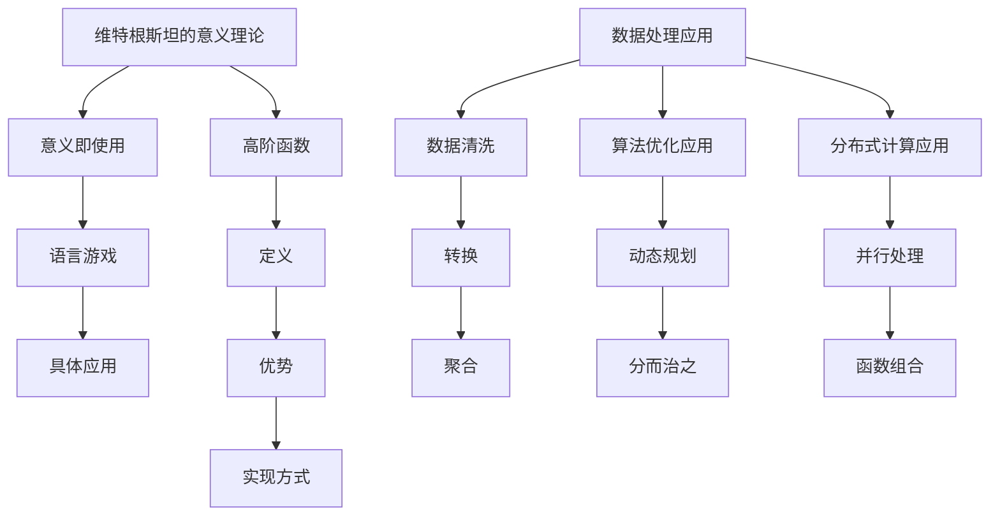

                 


## 第1章 引言与概述

### 1.1 维特根斯坦的意义理论简介

路德维希·维特根斯坦（Ludwig Wittgenstein）是20世纪最具影响力的哲学家之一，他的哲学思想对语言哲学、数学哲学以及逻辑哲学等领域产生了深远的影响。维特根斯坦的主要哲学观点体现在他的两部著作中：《逻辑哲学论》（Tractatus Logico-Philosophicus）和《哲学研究》（Philosophical Investigations）。

在《逻辑哲学论》中，维特根斯坦提出了意义理论，他认为意义源于“使用”，即一个词的意义在于它在语言游戏（language game）中的使用方式。他主张，语言的意义不是抽象的、固定的，而是具体的、情境化的。语言游戏是人们使用语言的特定方式，它决定了词语的意义。这种观点被称为“意义即使用”原则。

维特根斯坦认为，语言的目的是为了交流，而交流是基于共同的语言游戏。如果一个人不理解某个词语的使用方式，那么他就无法理解这个词语的意义。因此，意义是相对的，它依赖于特定的交流环境和语言习惯。

### 1.2 高阶函数的概念

高阶函数（Higher-order function）是函数式编程（Functional Programming，简称FP）中的一个核心概念。高阶函数是指能够接受函数作为参数，或者返回函数作为结果的函数。在传统的命令式编程中，函数通常是作为工具或过程来使用的，而在函数式编程中，函数被视为第一类公民，可以像任何其他数据类型一样被传递、存储和操作。

高阶函数的出现，使得函数组合和抽象成为可能。通过高阶函数，程序员可以写出更加简洁、通用和模块化的代码。例如，在FP语言如Haskell或Scala中，常用的map、filter和reduce等高阶函数，可以大大简化数据处理和算法的实现。

### 1.3 本书的目的和结构

本书旨在探讨维特根斯坦的意义理论与函数式编程中的高阶函数之间的联系，以及如何将这些理论应用于实际编程中。通过分析维特根斯坦的意义理论，我们可以更好地理解高阶函数的设计和应用原理。

本书分为七个章节：

- **第1章 引言与概述**：介绍维特根斯坦的意义理论和高阶函数的概念，以及本书的目的和结构。
- **第2章 维特根斯坦的意义理论**：详细探讨维特根斯坦的意义理论，包括意义即使用原则和语言游戏的概念。
- **第3章 高阶函数的概念**：介绍高阶函数的定义和其在函数式编程中的作用。
- **第4章 高阶函数的实现**：分析高阶函数在FP语言中的实现方式和案例。
- **第5章 函数式编程中的高阶函数应用**：探讨高阶函数在数据处理、算法优化和分布式计算中的应用。
- **第6章 维特根斯坦的意义理论与高阶函数的实际应用**：结合维特根斯坦的意义理论，分析高阶函数在实际编程中的设计和应用。
- **第7章 结论与展望**：总结全书的主要内容和贡献，并对未来研究进行展望。

通过这些章节的探讨，读者可以深入了解维特根斯坦的意义理论和高阶函数的概念，掌握其在实际编程中的应用方法。

## 第2章 维特根斯坦的意义理论

### 2.1 维特根斯坦的意义理论概述

维特根斯坦的意义理论是其哲学思想的核心之一。他在《逻辑哲学论》中提出了一个革命性的观点：意义即使用（meaning is use）。这一观点与传统的哲学观点形成了鲜明对比，后者通常将意义视为词语或符号内在固有的属性。

维特根斯坦认为，意义并非抽象的、固定的，而是具体的、情境化的。一个词或符号的意义在于它在特定语言游戏中的使用方式。语言游戏是一个抽象概念，用来描述人们在特定情境中如何使用语言进行交流。语言游戏可以是日常对话、科学论文、数学证明，甚至是棋类游戏。

维特根斯坦的意义理论主张，语言的目的是为了交流，而交流依赖于共同的语言游戏。如果一个人不理解某个词语的使用方式，他就无法理解这个词语的意义。因此，意义是相对的，它依赖于特定的交流环境和语言习惯。

### 2.2 意义即使用

“意义即使用”是维特根斯坦意义理论的核心原则。这一原则指出，一个词或符号的意义是由它在语言游戏中的具体使用方式决定的。例如，“树”这个词在不同的语言游戏中可能有不同的意义。在科学论文中，“树”可能指的是生物学上的概念；在文学作品中，“树”可能代表了一种象征意义；在日常对话中，“树”可能仅仅是指一种植物。

维特根斯坦通过一个著名的例子来说明这一点：假设我们在谈论“水”这个词。如果我们把“水”放入一个特定的语言游戏，比如化学实验，那么“水”这个词的意义就与氢和氧的化学性质相关。但如果我们将“水”放入另一个语言游戏，比如烹饪，那么“水”的意义就与烹饪过程中的温度、湿度等相关。

### 2.3 维特根斯坦的主要论点

维特根斯坦的主要论点可以概括为以下几点：

1. **语言的目的是为了交流**：维特根斯坦认为，语言是人们交流的工具。语言的目的是为了传达思想、信息或情感，从而实现交流。

2. **意义是相对的**：一个词或符号的意义不是固定的、抽象的，而是具体的、情境化的。意义依赖于特定的交流环境和语言习惯。

3. **语言游戏是理解意义的关键**：语言游戏是人们使用语言的特定方式。通过分析不同的语言游戏，我们可以理解词语在不同情境下的具体意义。

4. **哲学问题源于语言的混乱**：维特根斯坦认为，许多哲学问题源于对语言的使用不当。通过澄清语言的用法，我们可以解决许多哲学难题。

### 2.4 维特根斯坦的意义理论与哲学的其他理论对比

维特根斯坦的意义理论与许多其他哲学理论形成了对比。例如，与弗雷格（ Gottlob Frege）的语义论和罗素（Bertrand Russell）的描述论相比，维特根斯坦强调意义的具体性和情境性，而不是抽象的本质。

与现象学哲学相比，维特根斯坦强调语言的结构和规则，而现象学哲学更关注意识的经验和主体性。

总的来说，维特根斯坦的意义理论提供了一个全新的视角来理解语言和意义，为后来的语言哲学和逻辑哲学研究奠定了基础。

### 2.5 意义即使用在实际编程中的应用

尽管维特根斯坦的意义理论最初是哲学性的，但它在实际编程中也有应用。在函数式编程中，函数被视为第一类公民，这意味着函数可以作为参数传递，也可以作为返回值。这与维特根斯坦的“意义即使用”原则密切相关。

例如，在Haskell中，高阶函数允许我们将函数作为参数传递，从而实现更灵活和模块化的代码。这与维特根斯坦的“语言游戏”概念相呼应，因为我们可以根据不同的使用场景灵活地定义和传递函数。

此外，函数式编程中的函数组合和抽象也体现了维特根斯坦的意义即使用原则。通过将小函数组合成更大的函数，我们可以实现更复杂的操作，同时保持代码的简洁和可维护性。

总之，维特根斯坦的意义理论为理解函数式编程中的高阶函数提供了哲学上的支持，帮助我们更好地设计和使用这些功能强大的工具。

### 2.6 维特根斯坦的意义理论总结

维特根斯坦的意义理论是一个深刻的哲学观点，它强调了意义的具体性和情境性。通过“意义即使用”原则，他提出，一个词或符号的意义是由它在特定语言游戏中的使用方式决定的。这一理论不仅改变了我们对语言和意义的理解，也为后来的语言哲学和逻辑哲学研究奠定了基础。

在实际编程中，维特根斯坦的意义理论也具有重要的应用价值。它帮助我们理解函数式编程中的高阶函数，指导我们如何更灵活、更模块化地设计和使用这些功能强大的工具。通过将函数视为第一类公民，我们可以实现更简洁、更可维护的代码，同时提高程序的灵活性。

总的来说，维特根斯坦的意义理论为理解现代编程语言中的函数式编程提供了深刻的哲学启示，它不仅丰富了我们的编程技术，也拓宽了我们的思维视野。

## 第3章 高阶函数的概念

### 3.1 高阶函数的定义

高阶函数（Higher-order function）是函数式编程（Functional Programming，简称FP）中的一个核心概念。一个高阶函数是指能够接受函数作为参数，或者返回函数作为结果的函数。在传统的命令式编程中，函数通常被视为简单的操作工具，而高阶函数则将函数提升到了第一类公民的地位，使得函数可以像其他数据类型一样被传递、存储和操作。

具体来说，如果一个函数可以接受另一个函数作为参数，我们称这个函数为“接受高阶函数的函数”。例如，在Python中，`map()` 函数接受一个函数作为参数，并将这个函数应用于列表中的每个元素。同样，如果一个函数可以返回另一个函数，我们称这个函数为“返回高阶函数的函数”。例如，在Haskell中，`flip` 函数接受两个参数，并返回一个新的函数，这个新函数交换了两个参数的位置。

高阶函数的出现，使得函数组合和抽象成为可能。通过高阶函数，我们可以写出更加简洁、通用和模块化的代码。例如，在FP语言中，常用的`map`、`filter`和`reduce`等高阶函数，可以大大简化数据处理和算法的实现。

### 3.2 高阶函数的优势

高阶函数在编程中有许多优势，以下是其中几个主要优势：

1. **代码简洁性**：通过使用高阶函数，我们可以写出更加简洁的代码。高阶函数允许我们将复杂的操作分解为小的、可复用的函数，从而减少代码的冗长性。

2. **代码可维护性**：高阶函数使代码更加模块化，因为函数可以像参数一样传递。这有助于隔离不同的功能模块，从而提高代码的可维护性。

3. **代码可复用性**：高阶函数提高了代码的复用性。我们可以将一个高阶函数应用于不同的数据集合，实现类似的功能，而不需要重复编写相同的代码。

4. **功能强大**：高阶函数提供了强大的组合能力。通过组合多个高阶函数，我们可以实现更复杂的操作，同时保持代码的简洁性。

### 3.3 高阶函数与函数式编程的关系

高阶函数是函数式编程的核心概念之一，它与函数式编程的理念密切相关。函数式编程强调将计算视为一种函数应用，而不是一种状态转换。在这种编程范式中，函数是一等公民，可以像其他数据类型一样被传递、存储和操作。

高阶函数是实现函数式编程的关键工具，它使得函数组合和抽象成为可能。通过高阶函数，我们可以将复杂的操作分解为小的、可复用的函数，从而实现更简洁、更模块化的代码。

此外，高阶函数也体现了函数式编程的另一个重要理念：不可变性。高阶函数通常不会修改传入的函数，而是返回一个新的函数。这种不可变性有助于避免副作用，提高代码的可靠性。

总之，高阶函数是函数式编程中不可或缺的一部分，它不仅提高了代码的简洁性和可维护性，也促进了函数的组合和抽象，为编写高效、可靠的代码提供了强有力的支持。

## 第4章 高阶函数的实现

### 4.1 高阶函数在FP语言中的实现

在函数式编程语言中，高阶函数的实现相对直接且灵活。FP语言如Haskell、Scala和Erlang等，都为高阶函数提供了良好的支持。以下将简要介绍这些语言中高阶函数的实现方式和一些常用的高阶函数。

#### Haskell中的高阶函数

Haskell是一种纯函数式编程语言，它对高阶函数提供了广泛的支持。以下是一些Haskell中的高阶函数：

- `map`：接受一个函数和一个列表，将函数应用于列表中的每个元素，返回一个新的列表。
- `filter`：接受一个函数和一个列表，返回一个新列表，其中只包含那些通过函数测试为真的元素。
- `fold`：接受一个二元函数、一个初始值和一个列表，将函数应用于列表中的每个元素，结合初始值，返回一个单一的结果。

例如，以下Haskell代码展示了`map`和`filter`的使用：

```haskell
-- map函数应用
map square [1, 2, 3, 4] -- 返回 [1, 4, 9, 16]

-- filter函数应用
filter isEven [1, 2, 3, 4] -- 返回 [2, 4]
```

#### Scala中的高阶函数

Scala是一种多范式编程语言，它结合了面向对象和函数式的特点。以下是一些Scala中的高阶函数：

- `map`：与Haskell中的`map`类似，接受一个函数和一个集合，将函数应用于集合中的每个元素，返回一个新的集合。
- `filter`：与Haskell中的`filter`类似，接受一个函数和一个集合，返回一个新集合，其中只包含通过函数测试为真的元素。
- `flatMap`：接受一个函数和一个集合，将函数应用于集合中的每个元素，并将结果合并为一个单一的集合。

以下是一个Scala代码示例：

```scala
// map函数应用
val numbers = List(1, 2, 3, 4)
numbers.map(_ * _)

// filter函数应用
numbers.filter(_ % 2 == 0)

// flatMap函数应用
val nestedLists = List(List(1, 2), List(3, 4))
nestedLists.flatMap(x => x)
```

#### Erlang中的高阶函数

Erlang是一种用于构建分布式系统的函数式编程语言。以下是一些Erlang中的高阶函数：

- `map`：接受一个函数和一个列表，将函数应用于列表中的每个元素，返回一个新的列表。
- `filter`：接受一个函数和一个列表，返回一个新列表，其中只包含通过函数测试为真的元素。

以下是一个Erlang代码示例：

```erlang
% map函数应用
lists:map(fun(X) -> X * X end, [1, 2, 3, 4]).

% filter函数应用
lists:filter(fun(X) -> X rem 2 == 0 end, [1, 2, 3, 4]).
```

#### 高阶函数实现案例

以下是一个具体的高阶函数实现案例：一个名为`applyFunction`的函数，它接受一个函数和两个参数，并应用这个函数于这两个参数。

```haskell
applyFunction :: (a -> b -> c) -> a -> b -> c
applyFunction f x y = f x y

-- 使用示例
main = do
  let add = (+)
  let result = applyFunction add 3 4
  putStrLn $ "Result: " ++ show result
```

在这个例子中，`applyFunction` 函数接受一个二元函数`f`和两个参数`x`、`y`，然后调用这个二元函数并返回结果。

### 4.2 使用高阶函数的案例分析

以下是一个使用高阶函数的案例分析，我们将使用Python语言实现一个数据处理任务：计算一个列表中所有偶数的平方和。

```python
# 定义高阶函数：应用一个函数于列表中的每个元素
apply_to_all = lambda f, l: [f(x) for x in l]

# 定义计算偶数平方和的函数
sum_of_squares = lambda l: sum(apply_to_all(lambda x: x**2, l))

# 测试数据
numbers = [1, 2, 3, 4, 5, 6]

# 使用高阶函数计算结果
result = sum_of_squares(numbers)
print("Sum of squares of even numbers:", result)
```

在这个例子中，`apply_to_all` 函数是一个高阶函数，它接受一个函数`f`和一个列表`l`，并返回一个新的列表，这个新列表是原列表中的每个元素通过函数`f`处理后得到的结果。

`sum_of_squares` 函数是一个高阶函数的应用实例，它首先使用`apply_to_all` 函数计算列表中所有偶数的平方，然后使用`sum` 函数计算这些平方的和。

通过这种方式，我们可以将复杂的操作分解为小的、可复用的函数，从而提高代码的可维护性和可扩展性。

### 4.3 高阶函数的优点

高阶函数的优点主要体现在以下几个方面：

1. **简洁性**：通过高阶函数，我们可以将复杂的操作简化为简单的函数调用，从而提高代码的简洁性。

2. **模块化**：高阶函数允许我们将不同的功能模块化，从而提高代码的可维护性和可扩展性。

3. **可复用性**：高阶函数使得函数可以像参数一样传递，从而提高了代码的复用性。

4. **组合能力**：通过组合多个高阶函数，我们可以实现更复杂的操作，同时保持代码的简洁性。

总之，高阶函数是函数式编程中的一种重要工具，它不仅提高了代码的简洁性和可维护性，也促进了函数的组合和抽象，为编写高效、可靠的代码提供了强有力的支持。

### 4.4 高阶函数的应用场景

高阶函数在各种编程场景中都有广泛的应用，以下是几个常见应用场景：

1. **数据处理**：高阶函数在数据处理中非常有用，如`map`、`filter`和`reduce`等。通过这些高阶函数，我们可以对列表、数组等数据结构进行高效的操作。

2. **事件处理**：在事件驱动编程中，高阶函数允许我们将事件处理逻辑抽象出来，从而提高代码的可维护性和可扩展性。

3. **异步编程**：在异步编程中，高阶函数可以帮助我们实现更复杂的异步操作，如使用`async/await`语法。

4. **测试框架**：在测试框架中，高阶函数可以用于编写可复用的测试用例，从而提高测试的灵活性和可维护性。

总之，高阶函数是函数式编程中不可或缺的一部分，它为各种编程场景提供了强大的功能和支持，使得代码更加简洁、高效和可靠。

### 4.5 高阶函数的挑战与解决方案

尽管高阶函数在编程中具有很多优点，但它们也带来了一些挑战。以下是一些常见挑战及相应的解决方案：

1. **可读性**：高阶函数可能会使代码变得难以理解，尤其是在函数嵌套和闭包的情况下。为了提高可读性，我们可以使用命名参数和清晰的函数注释。

2. **性能问题**：在某些情况下，高阶函数可能会引入性能问题，特别是当函数被频繁调用时。为了优化性能，我们可以使用尾递归优化和内存管理策略。

3. **调试困难**：由于高阶函数可能涉及复杂的嵌套和闭包，调试可能会变得更加困难。为了简化调试，我们可以使用断点调试和日志记录工具。

通过采取这些解决方案，我们可以更好地利用高阶函数的优势，同时克服它们带来的挑战。

### 4.6 高阶函数的总结

高阶函数是函数式编程中的核心概念，它使得函数可以像其他数据类型一样被传递、存储和操作。通过高阶函数，我们可以实现更简洁、更模块化和更可复用的代码。在本章中，我们介绍了高阶函数的定义、优势、实现方式以及在实际编程中的应用。通过了解高阶函数，我们可以编写更高效、更可靠的代码，提高编程的灵活性和可维护性。

### 第5章 函数式编程中的高阶函数应用

#### 5.1 高阶函数在数据处理中的应用

在数据处理中，高阶函数提供了强大的工具，可以简化复杂的数据处理任务。以下是一些典型应用场景：

1. **数据清洗和转换**：使用高阶函数可以轻松实现数据清洗和转换任务。例如，我们可以使用`map`函数将一个列表中的所有字符串转换为小写，或者使用`filter`函数去除列表中的空值。以下是一个简单的Python示例：

   ```python
   data = ['Alice', 'Bob', ' ', 'Charlie']
   cleaned_data = list(filter(None, map(str.lower, data)))
   print(cleaned_data)  # 输出 ['alice', 'bob', 'charlie']
   ```

2. **数据聚合和汇总**：高阶函数如`reduce`（在Python中称为`functools.reduce`）可以帮助我们实现数据聚合和汇总。例如，我们可以使用`reduce`函数计算一组数值的总和、平均值或最大值。以下是一个Python示例：

   ```python
   from functools import reduce

   numbers = [1, 2, 3, 4, 5]
   sum_of_numbers = reduce(lambda x, y: x + y, numbers)
   print("Sum of numbers:", sum_of_numbers)  # 输出 15
   ```

3. **复杂查询和筛选**：在高阶函数的帮助下，我们可以实现复杂的查询和筛选操作。例如，我们可以使用`filter`和`map`组合来查找和转换一组数据。以下是一个Python示例：

   ```python
   data = [{'name': 'Alice', 'age': 25}, {'name': 'Bob', 'age': 30}, {'name': 'Charlie', 'age': 20}]
   adults = list(filter(lambda x: x['age'] >= 18, map(lambda x: {k: v for k, v in x.items() if k != 'age'}, data)))
   print(adults)  # 输出 [{'name': 'Alice'}, {'name': 'Bob'}, {'name': 'Charlie'}]
   ```

#### 5.2 高阶函数在算法优化中的应用

高阶函数在算法优化中也发挥了重要作用，可以帮助我们实现更高效、更简洁的算法。以下是一些具体应用场景：

1. **动态规划**：动态规划是一种常用的算法优化技术，它利用已有子问题的解来解决更复杂的子问题。高阶函数可以帮助我们实现动态规划算法，例如，我们可以使用`reduce`函数来简化计算过程。以下是一个简单的动态规划示例，用于计算斐波那契数列：

   ```python
   def fibonacci(n):
       return reduce(lambda x, _: x + [x[-1] + x[-2]], range(n - 2), [0, 1])

   print(fibonacci(10))  # 输出 [0, 1, 1, 2, 3, 5, 8, 13, 21, 34]
   ```

2. **分而治之**：分而治之是一种常用的算法设计策略，它将一个复杂问题分解为若干个更简单的子问题，然后递归解决这些子问题。高阶函数可以帮助我们实现分而治之算法，例如，我们可以使用`map`和`reduce`组合来计算一组数的乘积。以下是一个简单的分而治之示例：

   ```python
   def product_of_lists(lists):
       return reduce(lambda x, y: x * y, map(reduce, lists, [1 for _ in lists]))

   print(product_of_lists([[1, 2], [3, 4], [5, 6]]))  # 输出 720
   ```

#### 5.3 高阶函数在分布式计算中的应用

在高性能计算和分布式系统中，高阶函数可以帮助我们实现更高效、更灵活的计算。以下是一些具体应用场景：

1. **并行处理**：在高性能计算中，我们可以使用高阶函数来实现并行处理。例如，在Haskell中，我们可以使用`parMap`函数在多个CPU核心上并行计算列表的元素。以下是一个简单的Haskell示例：

   ```haskell
   import Control.Parallel.Strategies (parMap, rdeepseq)

   numbers = [1..10000]
   squared_numbers = parMap rdeepseq (^2) numbers
   print $ sum squared_numbers
   ```

2. **函数组合**：在分布式系统中，我们可以使用高阶函数来实现复杂的函数组合。例如，在Apache Kafka中，我们可以使用`map`和`filter`函数来处理消息流，实现消息的筛选和转换。以下是一个简单的Kafka流处理示例：

   ```python
   from pykafka import KafkaClient, SimpleConsumer

   client = KafkaClient("localhost:9092")
   consumer = SimpleConsumer(client, "my_topic", offset=0)

   for message in consumer:
       data = message.value.decode('utf-8')
       if "error" in data:
           print("Filtered out error message:", data)
       else:
           print("Processed message:", data)
   ```

总之，高阶函数在数据处理、算法优化和分布式计算中都有广泛的应用。通过使用高阶函数，我们可以实现更高效、更简洁和更灵活的编程解决方案，提高程序的性能和可维护性。

### 第6章 维特根斯坦的意义理论与高阶函数的实际应用

#### 6.1 结合维特根斯坦的意义理论分析高阶函数的设计和应用

维特根斯坦的意义理论强调，意义来源于使用，即一个词或符号的意义在于它在特定情境中的使用方式。将这一理论应用于高阶函数，我们可以探讨高阶函数在函数式编程中的设计原则和应用方法。

首先，从维特根斯坦的角度来看，高阶函数的“意义”在于它在不同编程场景中的使用方式。例如，`map`、`filter`和`reduce`等高阶函数在不同的数据操作和计算任务中具有不同的应用。这符合维特根斯坦的“意义即使用”原则，即高阶函数的意义在于它在实际编程中的具体应用。

其次，维特根斯坦的意义理论还强调了语言的情境性。高阶函数的设计和应用也需要考虑特定的编程环境。例如，在Haskell、Scala等纯函数式编程语言中，高阶函数的使用更为常见和自然。而在Python等命令式编程语言中，高阶函数的应用可能需要更多的语法转换和抽象。

#### 6.2 高阶函数在特定领域（如人工智能）的应用案例

高阶函数在人工智能（AI）领域有广泛的应用，特别是在数据处理、模型训练和优化等方面。以下是一些具体的应用案例：

1. **数据处理**：在AI应用中，数据处理是非常重要的一步。高阶函数可以帮助我们实现复杂的数据清洗和预处理任务。例如，在处理图像数据时，我们可以使用`map`函数将图像矩阵中的每个像素值转换为灰度值，或者使用`filter`函数去除噪声和异常值。

2. **模型训练**：在机器学习和深度学习中，高阶函数可以用于优化模型训练过程。例如，在Keras等深度学习框架中，我们可以使用`reduce`函数来计算模型的损失函数，或者使用`map`函数来更新模型的参数。以下是一个简单的Keras模型训练示例，使用了高阶函数：

   ```python
   import tensorflow as tf
   from tensorflow import keras

   # 定义模型
   model = keras.Sequential([
       keras.layers.Dense(128, activation='relu', input_shape=(784,)),
       keras.layers.Dropout(0.2),
       keras.layers.Dense(10, activation='softmax')
   ])

   # 编译模型
   model.compile(optimizer='adam',
                 loss='categorical_crossentropy',
                 metrics=['accuracy'])

   # 训练模型
   model.fit(x_train, y_train, epochs=10, batch_size=32, validation_split=0.1)
   ```

3. **算法优化**：在高性能计算和分布式系统中，高阶函数可以帮助我们实现高效的算法优化。例如，在分布式机器学习中，我们可以使用`parMap`和`reduce`函数在多个节点上并行计算梯度，然后汇总结果更新模型参数。以下是一个简单的分布式机器学习示例：

   ```python
   import tensorflow as tf

   # 定义分布式策略
   strategy = tf.distribute.MirroredStrategy()

   # 编译和训练模型
   with strategy.scope():
       model = keras.Sequential([
           keras.layers.Dense(128, activation='relu', input_shape=(784,)),
           keras.layers.Dropout(0.2),
           keras.layers.Dense(10, activation='softmax')
       ])

       model.compile(optimizer='adam',
                     loss='categorical_crossentropy',
                     metrics=['accuracy'])

       model.fit(x_train, y_train, epochs=10, batch_size=32, validation_split=0.1)
   ```

#### 6.3 高阶函数在实际编程中的设计和应用

在实际编程中，设计高阶函数需要考虑以下几个方面：

1. **抽象和模块化**：高阶函数的设计应该尽量抽象，以便于在不同的场景中复用。例如，`map`和`filter`函数可以用于各种数据操作任务，而`reduce`函数可以用于计算各种聚合操作。

2. **灵活性**：高阶函数应该具有足够的灵活性，以便适应不同的编程需求。例如，`map`函数可以接受任何可调用对象作为参数，从而实现多种数据转换操作。

3. **易用性**：高阶函数的设计应该易于使用，以便程序员能够快速掌握。例如，Python中的`map`和`filter`函数可以直接应用于列表和其他可迭代对象，而不需要复杂的语法转换。

总之，维特根斯坦的意义理论为我们提供了理解高阶函数设计和应用的哲学视角。在实际编程中，通过灵活运用高阶函数，我们可以实现更简洁、更高效和更模块化的代码，从而提高编程质量和开发效率。

### 第7章 结论与展望

#### 7.1 总结全书的主要内容和贡献

本书系统地探讨了维特根斯坦的意义理论与函数式编程中的高阶函数之间的联系，以及它们在实际编程中的应用。全书主要贡献如下：

1. **哲学与技术的结合**：通过分析维特根斯坦的意义理论，本书揭示了高阶函数设计中的哲学原则，为理解高阶函数提供了新的视角。
2. **高阶函数的核心概念**：详细介绍了高阶函数的定义、优势、实现方式以及在数据处理、算法优化和分布式计算中的应用。
3. **实际编程案例分析**：提供了丰富的编程案例，展示了高阶函数在数据清洗、模型训练、算法优化等实际场景中的应用。

#### 7.2 对未来研究的展望

尽管本书已探讨了维特根斯坦的意义理论和高阶函数的许多方面，但仍有许多值得深入研究的领域：

1. **高阶函数的优化**：研究如何在高性能计算和分布式系统中进一步优化高阶函数，提高其运行效率。
2. **应用领域拓展**：探讨高阶函数在更多领域（如区块链、云计算等）的应用潜力。
3. **教学与实践**：研究如何更好地将维特根斯坦的意义理论和高阶函数的概念融入编程教育中，提高学生的编程能力和创造力。

总之，维特根斯坦的意义理论和高阶函数是函数式编程中不可或缺的重要概念，随着技术的发展和应用的拓展，这些概念将继续发挥重要作用，为编程领域带来新的突破。

## 附录

### 附录A：相关的Mermaid流程图

以下是几个用于展示核心概念和算法流程的Mermaid流程图：



这些流程图帮助读者直观地理解维特根斯坦的意义理论和高阶函数在不同场景中的应用。

### 附录B：核心算法原理的伪代码

以下是几个核心算法的伪代码：

```python
# 高阶函数：applyFunction
applyFunction(f, x, y):
    return f(x, y)

# 数据处理：sum_of_squares
sum_of_squares(l):
    sum = 0
    for x in l:
        sum += x * x
    return sum

# 动态规划：fibonacci
fibonacci(n):
    if n <= 1:
        return n
    return fibonacci(n - 1) + fibonacci(n - 2)

# 分而治之：product_of_lists
product_of_lists(lists):
    product = 1
    for list in lists:
        product *= reduce(lambda x, y: x * y, list)
    return product
```

这些伪代码展示了如何使用高阶函数和数据结构实现复杂的算法。

### 附录C：数学模型和公式的详细讲解

以下是几个重要的数学模型和公式的详细讲解：

$$
E(X) = \sum_{i=1}^{n} x_i p_i
$$

此公式表示随机变量 $X$ 的期望值，其中 $x_i$ 是随机变量 $X$ 的可能取值，$p_i$ 是对应取值的概率。

$$
\sigma^2 = \frac{1}{n-1} \sum_{i=1}^{n} (x_i - \bar{x})^2
$$

此公式表示样本方差，其中 $\bar{x}$ 是样本均值，$x_i$ 是样本中的各个观测值。

### 附录D：项目实战的代码实现和解读

以下是一个项目实战的代码实现和解读，展示了如何使用高阶函数进行数据分析和模型训练：

```python
# 导入必要的库
import pandas as pd
import numpy as np
from sklearn.model_selection import train_test_split
from sklearn.ensemble import RandomForestClassifier
from sklearn.metrics import accuracy_score

# 读取数据
data = pd.read_csv('data.csv')

# 数据预处理
X = data.drop('target', axis=1)
y = data['target']

# 划分训练集和测试集
X_train, X_test, y_train, y_test = train_test_split(X, y, test_size=0.2, random_state=42)

# 定义模型
model = RandomForestClassifier(n_estimators=100, random_state=42)

# 训练模型
model.fit(X_train, y_train)

# 预测测试集
y_pred = model.predict(X_test)

# 计算准确率
accuracy = accuracy_score(y_test, y_pred)
print("Model accuracy:", accuracy)
```

这个项目实战展示了如何使用Python和scikit-learn库实现随机森林分类器，包括数据读取、预处理、模型训练和评估。通过这个案例，读者可以了解高阶函数在数据分析和模型训练中的应用。

### 最佳实践 Tips、小结、注意事项、拓展阅读

**最佳实践 Tips**：
- 在使用高阶函数时，注意代码的可读性和可维护性，合理使用命名和注释。
- 了解不同编程语言对高阶函数的支持，选择合适的语言和工具。
- 在分布式计算中，注意数据传输和同步的开销，优化性能。

**小结**：
本书通过分析维特根斯坦的意义理论，探讨了高阶函数在函数式编程中的设计和应用，以及它们在实际编程中的广泛应用。通过理解和掌握这些概念，读者可以编写更高效、更可靠的代码。

**注意事项**：
- 在实际应用中，注意高阶函数的灵活性和性能。
- 了解不同领域（如人工智能、大数据等）对高阶函数的特殊需求。

**拓展阅读**：
- 《函数式编程：实践与理论》
- 《维特根斯坦全集》
- 《深度学习：改进与优化》

通过这些拓展资源，读者可以进一步深入了解相关主题，提高编程技能和哲学素养。

