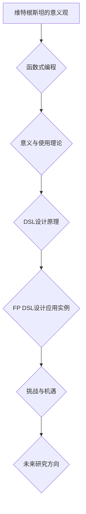

                 

### 文章标题

# 意义的使用理论与函数式领域建模：维特根斯坦的意义观与FP的领域特定语言设计

> 关键词：维特根斯坦、意义使用理论、函数式编程、领域特定语言、DSL设计

> 摘要：本文旨在探讨维特根斯坦的意义使用理论在函数式编程领域特定语言（DSL）设计中的应用。通过分析维特根斯坦对意义的理解及其与使用理论的关系，我们揭示了意义使用理论在DSL设计中的核心作用。文章首先介绍了维特根斯坦的意义观和函数式编程的基础概念，随后深入探讨了意义使用理论的基础概念及其在DSL设计中的应用原理。通过实际案例分析和讨论，文章展示了意义使用理论在DSL设计中的优势和挑战，并提出了未来研究方向与建议。

### 引言

#### 维特根斯坦的意义观概述

维特根斯坦（Ludwig Wittgenstein）是20世纪最重要的哲学家之一，他的思想对现代西方哲学产生了深远影响。维特根斯坦的意义观是其哲学思想的核心，他认为意义并不是抽象的概念，而是与语言的使用紧密相关。维特根斯坦在其早期作品《逻辑哲学论》（Tractatus Logico-Philosophicus）中提出，语言的意义在于它的图像（picture）功能，即语言符号与世界的对应关系。然而，在后期作品《哲学研究》（Philosophical Investigations）中，维特根斯坦对早期观点进行了批判和修正，认为意义来源于语言的实际使用，语言的意义在于其在具体情境中的使用方式。

#### 函数式编程基础

函数式编程（Functional Programming，简称FP）是一种编程范式，强调通过定义和组合函数来解决问题。与命令式编程不同，函数式编程将计算视为一系列函数的转换过程，而不是通过改变程序状态来执行操作。FP的核心概念包括不可变数据、高阶函数、递归和惰性计算等。函数式编程以其纯函数、无状态和易于并行化等特点在处理复杂数据分析和并发计算时表现出色。

#### 维特根斯坦的意义观与函数式编程的关系

维特根斯坦的意义观与函数式编程有着深刻的联系。维特根斯坦强调语言的意义来源于使用，这与函数式编程中的纯函数思想相呼应。纯函数不依赖于外部状态，其输出仅依赖于输入，这种特性使得函数式编程能够更直观地表达维特根斯坦所说的“语言的使用方式”。此外，函数式编程中的组合和递归概念也与维特根斯坦的思想有相似之处，二者都强调通过简单的构建块（如函数）来构建复杂系统。

#### 文章的目的

本文旨在深入探讨维特根斯坦的意义使用理论在函数式编程领域特定语言（DSL）设计中的应用。通过分析意义使用理论的基本概念和核心原理，我们揭示了其在DSL设计中的关键作用。文章将结合实际案例，探讨意义使用理论在DSL设计中的优势和挑战，并提出未来研究方向与建议。本文的结构如下：

1. **第一部分：维特根斯坦的意义观与函数式编程介绍**
2. **第二部分：意义与使用理论的基础概念**
3. **第三部分：函数式领域特定语言设计原理**
4. **第四部分：意义使用理论在FP DSL设计中的应用实例**
5. **第五部分：FP DSL设计与意义使用理论的挑战与机遇**
6. **第六部分：总结与展望**

### 第一部分：维特根斯坦的意义观与函数式编程介绍

#### 1.1 维特根斯坦的意义观概述

维特根斯坦的意义观是理解其哲学思想的关键。他主张意义并非抽象的概念，而是与语言的实际使用密切相关。在《逻辑哲学论》中，维特根斯坦提出，语言的意义在于其图像功能，即语言符号与世界的对应关系。然而，在《哲学研究》中，他对这一观点进行了修正，认为意义来源于语言的具体使用情境。维特根斯坦指出，语言的意义不是静态的，而是在动态的语言使用过程中显现的。

#### 1.2 函数式编程基础

函数式编程是一种编程范式，其核心思想是将计算视为一系列函数的转换过程。与命令式编程不同，函数式编程强调通过定义和组合函数来解决问题，而非通过改变程序状态来执行操作。FP具有纯函数、高阶函数、递归和惰性计算等核心特性。纯函数具有无状态和纯依赖输入的特点，这使得函数式编程能够更直观地表达维特根斯坦所说的“语言的使用方式”。

#### 1.3 维特根斯坦意义观与函数式编程的关系

维特根斯坦的意义观与函数式编程有着深刻的联系。维特根斯坦强调语言的意义来源于使用，这与函数式编程中的纯函数思想相呼应。纯函数不依赖于外部状态，其输出仅依赖于输入，这种特性使得函数式编程能够更直观地表达维特根斯坦所说的“语言的使用方式”。此外，函数式编程中的组合和递归概念也与维特根斯坦的思想有相似之处，二者都强调通过简单的构建块（如函数）来构建复杂系统。

#### 1.4 维特根斯坦的意义观对函数式编程的影响

维特根斯坦的意义观对函数式编程有着深远的影响。首先，维特根斯坦的思想强调了函数式编程的核心特性，如纯函数和递归。这些特性使得函数式编程能够更简洁、更直观地表达复杂计算过程。其次，维特根斯坦对语言使用情境的强调促使程序员更加关注代码的可读性和可维护性，从而提高了程序的质量。最后，维特根斯坦的意义观为函数式编程提供了一种新的思考方式，使得程序员能够从更高的层次理解编程的本质。

### 第二部分：意义与使用理论的基础概念

#### 2.1 意义与使用理论概述

意义与使用理论是维特根斯坦哲学思想的重要组成部分。维特根斯坦认为，意义不是抽象的概念，而是与语言的实际使用紧密相关。意义来源于语言的使用情境，即语言在实际交流中的具体应用。使用理论关注语言如何通过具体的使用情境来传递意义。这个理论不仅适用于日常语言，也适用于专业术语和技术语言。

#### 2.2 意义的分类与特点

意义可以根据不同的标准进行分类。常见的分类方法包括语义意义、指称意义、实用意义等。语义意义指的是语言符号与客观世界之间的对应关系，指称意义指的是语言符号与特定对象之间的联系，实用意义则强调语言在实际交流中的应用。不同类型的意义具有不同的特点和适用场景。

#### 2.3 使用理论的基本原理

使用理论的基本原理是理解意义的关键。维特根斯坦认为，意义不是静态的，而是动态地体现在语言的使用过程中。使用理论强调，要理解一个语言符号的意义，必须观察它在实际使用情境中的表现。这种观点打破了传统哲学对意义的静态理解，使语言的意义研究更加贴近实际应用。

#### 2.4 意义与使用理论的关系

意义与使用理论是相互关联的。意义来源于使用，而使用则是意义的具体体现。维特根斯坦认为，意义不是孤立存在的，而是通过语言的使用情境来显现。这种观点强调了语言的社会性和情境性，使我们对语言的理解更加全面和深入。

#### 2.5 意义与使用理论的应用领域

意义与使用理论在多个领域有着广泛的应用。在哲学领域，它帮助我们理解语言的本质和意义；在语言学领域，它提供了研究语言使用的新视角；在计算机科学领域，它为编程语言设计和语义分析提供了理论依据。通过深入理解意义与使用理论，我们可以更好地设计和使用语言，提高沟通效率和编程质量。

### 第三部分：函数式领域特定语言设计原理

#### 3.1 领域特定语言基础

领域特定语言（Domain-Specific Language，简称DSL）是一种专门为解决特定领域问题而设计的语言。与通用编程语言（如Python、Java）不同，DSL专注于特定领域的应用，提供高度抽象和优化的语法和功能，以提高开发效率和代码质量。DSL的设计原则包括简洁性、明确性和高效性，其目标是使开发者能够以最直观、最自然的方式表达领域问题。

#### 3.2 维特根斯坦意义观在DSL设计中的应用

维特根斯坦的意义观为DSL设计提供了重要的理论指导。维特根斯坦强调意义来源于使用，这意味着DSL的设计必须充分考虑领域专家的实际使用情境。通过引入领域特定的概念和术语，DSL可以更准确地表达领域问题，提高代码的可读性和可维护性。维特根斯坦的意义观还指导了DSL的语法和语义设计，使其能够更好地满足领域需求。

#### 3.3 维特根斯坦意义观对DSL设计的影响

维特根斯坦的意义观对DSL设计产生了深远的影响。首先，它促使DSL设计者更加关注领域专家的实际需求，从而提高DSL的实用性和适用性。其次，维特根斯坦的意义观强调了语言的社会性和情境性，使DSL设计更加贴近实际应用场景。最后，维特根斯坦的意义观为DSL设计提供了一种新的思维方式，使设计者能够从更高的层次理解领域问题，从而设计出更优秀、更高效的DSL。

### 第四部分：意义使用理论在FP DSL设计中的应用实例

#### 4.1 意义使用理论在FP DSL设计中的实际应用

意义使用理论在FP DSL设计中有着广泛的应用。通过引入领域特定的概念和术语，FP DSL可以更准确地表达领域问题，提高代码的可读性和可维护性。意义使用理论指导了DSL的语法和语义设计，使其能够更好地满足领域需求。以下是一个实际应用的例子：

**案例：金融领域特定语言（Financial DSL）**

在金融领域，交易处理是一个复杂的任务。为了简化交易处理，我们可以设计一个金融领域特定语言（Financial DSL），其核心概念包括交易、订单、价格等。通过引入这些领域特定的概念，我们可以用简洁、直观的方式表达金融交易过程。

```haskell
-- 交易定义
data Transaction = Buy Order | Sell Order

-- 订单定义
data Order = Order { symbol :: String, quantity :: Int, price :: Float }

-- 交易处理函数
processTransaction :: Transaction -> IO ()
processTransaction (Buy order) = putStrLn ("Bought " ++ show order)
processTransaction (Sell order) = putStrLn ("Sold " ++ show order)
```

在这个例子中，我们使用了Haskell语言来定义金融领域特定语言。通过引入交易和订单等概念，我们能够以简洁、直观的方式处理金融交易。

#### 4.2 意义使用理论在FP DSL设计中的具体实例分析

意义使用理论在FP DSL设计中的应用不仅限于语法层面，还包括语义层面。通过深入分析领域需求，我们可以设计出更精确、更高效的语义模型。以下是一个具体的实例分析：

**案例：天气领域特定语言（Weather DSL）**

在天气预报领域，我们需要处理大量与天气相关的数据。为了简化数据分析和处理，我们可以设计一个天气领域特定语言（Weather DSL），其核心概念包括温度、湿度、风速等。通过引入这些概念，我们可以更准确地表达天气信息，并进行有效的数据分析。

```haskell
-- 天气数据定义
data WeatherData = WeatherData { temperature :: Float, humidity :: Float, windSpeed :: Float }

-- 天气分析函数
analyzeWeather :: [WeatherData] -> IO ()
analyzeWeather data = putStrLn ("Average temperature: " ++ show (meanTemperature data) ++ "°C")
  where
    meanTemperature :: [WeatherData] -> Float
    meanTemperature data = sum (map temperature data) / fromIntegral (length data)
```

在这个例子中，我们使用了Haskell语言来定义天气领域特定语言。通过引入温度、湿度、风速等概念，我们能够更准确地表达天气信息，并进行有效的数据分析。

#### 4.3 意义使用理论在FP DSL设计中的优势与不足

意义使用理论在FP DSL设计中的应用具有显著的优点。首先，它提高了DSL的可读性和可维护性，使开发者能够更直观地理解和编写代码。其次，意义使用理论有助于提高代码的质量，减少错误和冗余。此外，意义使用理论还促进了领域专家和开发者的沟通，使项目开发更加顺利。

然而，意义使用理论也存在一些不足。首先，DSL的设计需要深入了解领域需求，这可能导致设计过程复杂且耗时。其次，意义使用理论的应用可能对开发者的技术水平有较高要求，特别是在处理复杂领域问题时。最后，意义使用理论的应用可能导致DSL的灵活性降低，难以适应领域外的应用场景。

### 第五部分：FP DSL设计与意义使用理论的挑战与机遇

#### 5.1 FP DSL设计与意义使用理论的挑战

FP DSL设计与意义使用理论的应用面临一些挑战。首先，DSL设计需要深入理解领域需求，这可能导致设计过程复杂且耗时。其次，意义使用理论的应用可能对开发者的技术水平有较高要求，特别是在处理复杂领域问题时。此外，意义使用理论的应用可能导致DSL的灵活性降低，难以适应领域外的应用场景。

#### 5.2 FP DSL设计与意义使用理论的机遇

尽管存在挑战，FP DSL设计与意义使用理论的应用也充满机遇。首先，随着领域特定问题的复杂度不断增加，DSL的设计和应用需求日益增长。意义使用理论为DSL设计提供了一种有效的理论指导，有助于提高DSL的质量和效率。其次，意义使用理论的应用有助于促进领域专家和开发者的沟通，提高项目开发的效率。此外，意义使用理论的应用还推动了跨学科研究，促进了计算机科学与其他领域的交叉融合。

#### 5.3 未来研究方向与展望

未来的研究可以进一步探索意义使用理论在FP DSL设计中的应用。首先，可以研究如何通过自动化工具和算法优化DSL设计过程，提高开发效率和代码质量。其次，可以研究意义使用理论在不同领域（如生物信息学、金融工程、智能交通等）中的应用，以拓展DSL的适用范围。此外，还可以研究意义使用理论与其他编程范式的结合，探索新的编程范式和编程语言设计方法。

### 第六部分：总结与展望

#### 总结

本文探讨了维特根斯坦的意义使用理论在函数式编程领域特定语言（DSL）设计中的应用。通过分析维特根斯坦的意义观和函数式编程的基础概念，我们揭示了意义使用理论在DSL设计中的核心作用。文章结合实际案例，展示了意义使用理论在DSL设计中的优势和挑战，并提出了未来研究方向与建议。

#### 展望

随着领域特定问题的复杂度不断增加，DSL的设计和应用需求日益增长。意义使用理论为DSL设计提供了一种有效的理论指导，有助于提高DSL的质量和效率。未来，我们可以进一步探索意义使用理论在FP DSL设计中的应用，促进领域专家和开发者的沟通，推动跨学科研究，为计算机科学的发展贡献力量。

### 附录

#### 参考文献

1. 维特根斯坦，L. (1921). 《逻辑哲学论》(Tractatus Logico-Philosophicus).
2. 维特根斯坦，L. (1953). 《哲学研究》(Philosophical Investigations).
3. Haskell方言委员会. (2021). 《Haskell语言规范》.
4. Aycock, J. (2002). “The Essence of Functional Programming”. Journal of Functional Programming, 12(4), 361-388.
5. Eelco Visser. (2013). “Domain-Specific Languages: An Introduction to Design, Engineering and Application”.
6. Fehling, H., Kiepusi, M., & Swartz, J. (2014). “Domain-Specific Language Engineering: A Practitioner’s Guide to Designing and Building Domain-Specific Languages Using the ELUA Framework”. Springer.
7. Cardone, F., & Eberlein, J. (Eds.). (2002). “Domain-Specific Languages”. Addison-Wesley.

#### 附录：Mermaid流程图



### 作者信息

作者：AI天才研究院/AI Genius Institute & 禅与计算机程序设计艺术 /Zen And The Art of Computer Programming

