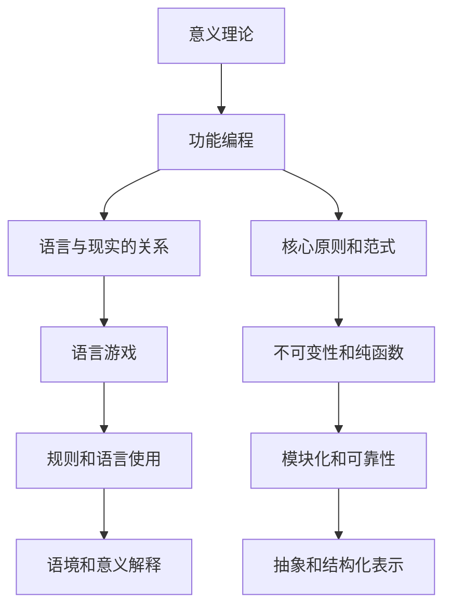
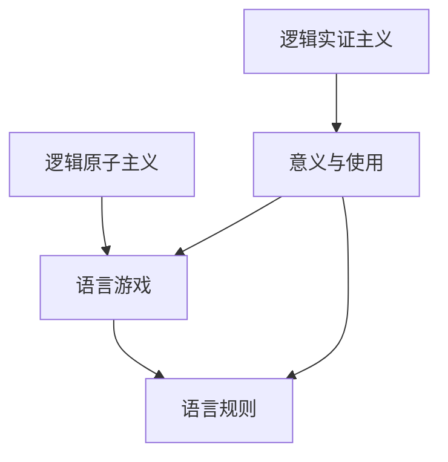
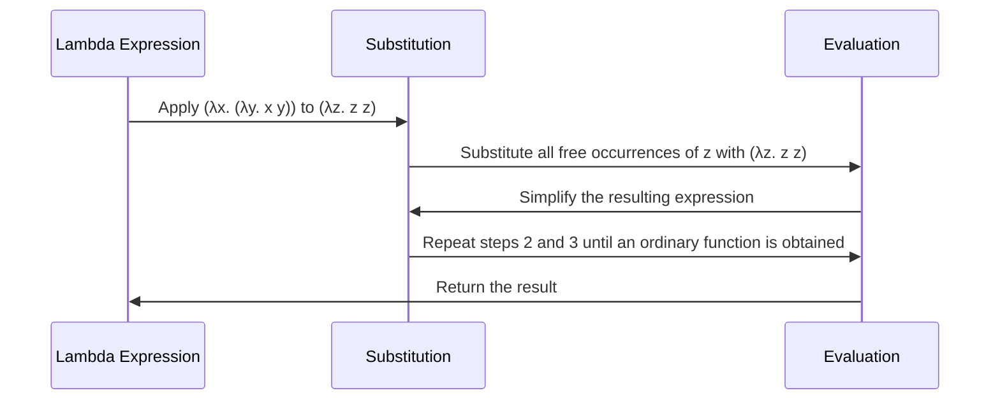
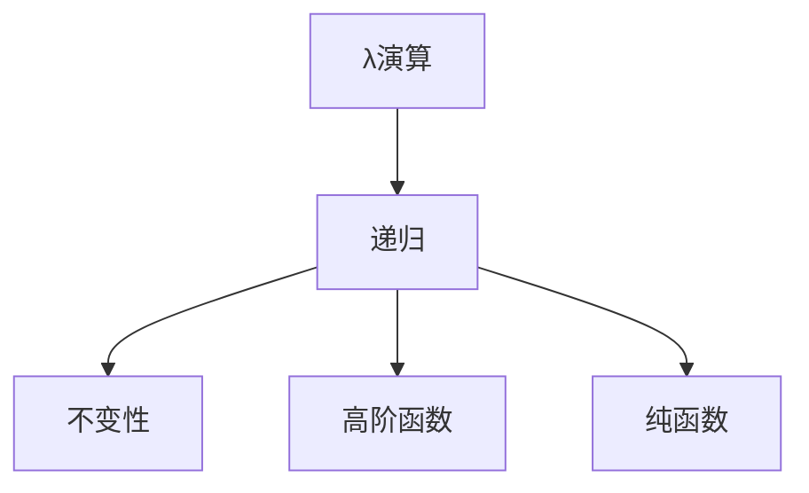
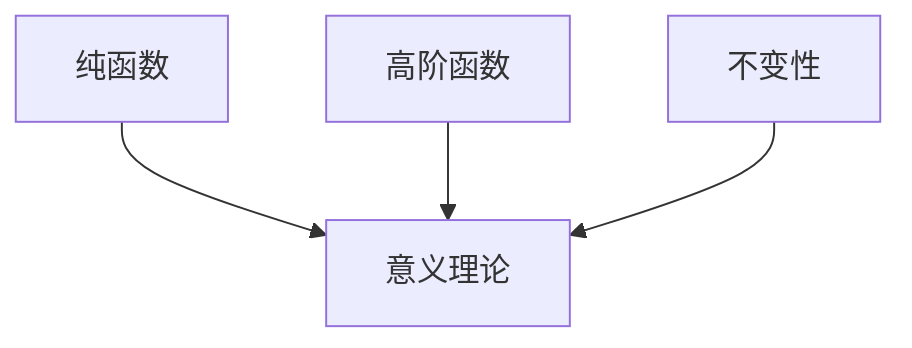
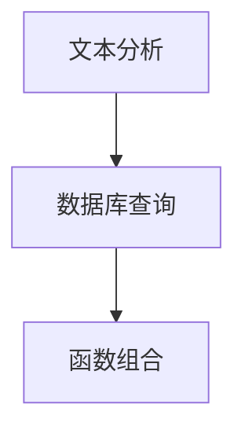
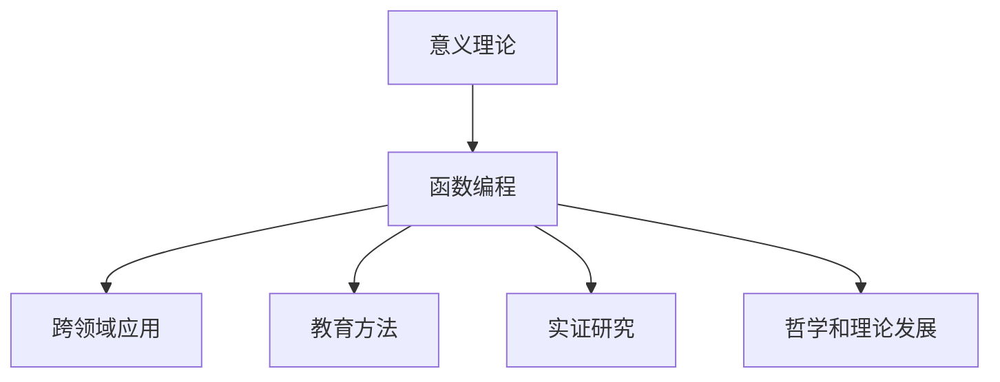

                 


### Part 1: Introduction to Meaning Theory and Functional Programming

#### Chapter 1: Background and Foundations of Meaning Theory

##### 1.1. The Emergence of Meaning Theory

**1.1.1. Ludwig Wittgenstein's Contribution**

Ludwig Wittgenstein, an Austrian-British philosopher, made significant contributions to the development of meaning theory. His work, particularly in "Tractatus Logico-Philosophicus" and "Philosophical Investigations," laid the groundwork for understanding how language relates to the world and the nature of meaning.

**1.1.2. Key Concepts in Wittgenstein's Philosophy**

Wittgenstein's philosophy is divided into two distinct periods: the early period, characterized by logical atomism and the concept of "language games," and the later period, which emphasizes the rule-governed nature of language. These concepts provide a framework for understanding the relationship between language, thought, and reality.

**1.1.3. The Relationship between Language and Reality**

Wittgenstein argued that language is a tool for communication, and its meaning is derived from how it is used in specific contexts. The relationship between language and reality is not direct but mediated by the rules that govern language use. This perspective has had a profound impact on various fields, including linguistics, philosophy, and computer science.

##### 1.2. The Concept of Meaning in Linguistics

**1.2.1. Different Theories of Meaning**

Meaning in linguistics is a complex concept that has been explored from various perspectives. Some prominent theories include the semantic theory, which focuses on the relationship between words and objects, and the pragmatic theory, which emphasizes the role of context in meaning interpretation.

**1.2.2. The Role of Context in Meaning Interpretation**

Context plays a crucial role in determining the meaning of words and sentences. Factors such as the speaker's intention, the listener's perspective, and the situational context can influence how meaning is interpreted. Understanding the role of context is essential for effective communication and language comprehension.

**1.2.3. Challenges in Meaning Theory**

Despite the advancements in meaning theory, several challenges remain. One significant challenge is the ambiguity of language, which can lead to misunderstandings and misinterpretations. Another challenge is the variability of meaning across different languages and cultures, which necessitates cross-cultural communication strategies.

##### 1.3. Overview of Functional Programming

**1.3.1. Historical Background**

Functional programming (FP) originated in the 1950s with the development of lambda calculus by Alonzo Church. It has since evolved and gained popularity, particularly in the context of modern software development and artificial intelligence.

**1.3.2. Core Principles and Paradigms**

The core principles of functional programming include immutability, higher-order functions, and pure functions. These principles enable developers to write concise, modular, and reliable code, making it easier to reason about and maintain.

**1.3.3. The Potential of Functional Programming in Meaning Theory**

The potential of functional programming in meaning theory lies in its ability to model the relationship between language and reality. By emphasizing the use of functions and expressions, FP can provide a more abstract and structured representation of meaning, facilitating the analysis and understanding of language use.

### Conclusion

In this chapter, we have explored the emergence of meaning theory and the foundational concepts of functional programming. By understanding the background and relationships between these two domains, we can better appreciate their potential contributions to the study of meaning and its application in software development.

#### References

1. Wittgenstein, L. (1921). Tractatus Logico-Philosophicus. Routledge & Kegan Paul.
2. Wittgenstein, L. (1953). Philosophical Investigations. Blackwell.
3. Church, A. (1941). The Calculus of Lambda-Conversion. Princeton University Press.
4. Engler, D. E. (2014). Programming Languages: Principles and Practices. Pearson Education.
5. Huddleston, R., & Pullum, G. K. (2002). The Cambridge Grammar of the English Language. Cambridge University Press.

---

**核心概念与联系架构 Mermaid 流程图：**



---

### Chapter 2: Analytic Philosophy and Wittgenstein's Perspective

#### 2.1. Logical Atomism and Language Games

**2.1.1. The Structure of Language**

In the early period of his career, Wittgenstein proposed the theory of logical atomism, which posits that the world is composed of simple, indivisible entities called "logical atoms." These atoms are combined to form complex structures, which correspond to the sentences in language.

**2.1.2. The Nature of Meaning and Use**

Wittgenstein argued that the meaning of a word is determined by its use in language. He introduced the concept of "language games" to illustrate how meaning is derived from the rules that govern the use of language. Language games are specific activities or forms of play that individuals engage in, and they provide the context in which meaning is constructed.

**2.1.3. The Importance of Language Games**

Language games are essential for understanding the relationship between language and reality. By examining different language games, we can gain insights into how meaning is constructed and how language functions in various contexts. This perspective challenges the notion that meaning can be reduced to a set of fixed, objective properties.

##### 2.2. Philosophical Investigations and Language Rules

**2.2.1. The Rule-Guided Nature of Language**

In the later period of his life, Wittgenstein shifted his focus to the rule-governed nature of language. He argued that language is not a fixed system but is constantly evolving and adapting. The rules that govern language use are not arbitrary but are shaped by social conventions and practical considerations.

**2.2.2. The Role of Rules in Meaning Construction**

Rules play a crucial role in meaning construction. They provide the framework within which language is used, enabling individuals to communicate effectively. Wittgenstein emphasized that understanding the rules of language is essential for interpreting meaning correctly.

**2.2.3. Wittgenstein's Critique of Logical Positivism**

Wittgenstein critically examined the logical positivist movement, which dominated analytic philosophy during his time. He argued that logical positivism's emphasis on empirical verification and the reduction of all meaningful statements to empirical observations was too narrow. Wittgenstein's work highlighted the importance of understanding the nature of meaning and the role of language in shaping our understanding of the world.

### Conclusion

In this chapter, we have explored the key concepts of logical atomism and language games, as well as Wittgenstein's later focus on the rule-governed nature of language. By understanding these concepts, we can gain a deeper appreciation of how meaning is constructed and how language functions in various contexts.

---

**核心概念与联系架构 Mermaid 流�程图：**



---

### Chapter 3: Fundamentals of Functional Programming

#### 3.1. Lambda Calculus and Recursion

**3.1.1. The Lambda Calculus as a Model of Computation**

The lambda calculus, developed by Alonzo Church in the 1930s, is a formal system used to study the concept of computation. It is based on the idea of functions as first-class citizens, meaning that functions can be passed as arguments and returned as results.

**3.1.2. Recursion and its Importance in Functional Programming**

Recursion is a fundamental concept in functional programming, allowing functions to call themselves in order to solve problems. It is particularly useful for working with data structures such as lists and trees.

**3.1.3. Mermaid Diagram: Lambda Calculus in Action**

The following Mermaid diagram illustrates the evaluation of the lambda expression `(λx. (λy. x y)) (λz. z z)` using the application-by-name strategy:



#### 3.2. Functional Programming and Its Core Principles

**3.2.1. Immutability**

Immutability is the property of data that cannot be modified once it has been created. In functional programming, immutable data structures are preferred because they simplify reasoning about code and help prevent unintended side effects.

**3.2.2. Higher-Order Functions**

Higher-order functions are functions that can take other functions as arguments or return them as results. This capability enables the creation of more modular and reusable code.

**3.2.3. Pure Functions**

Pure functions are functions that always return the same output for a given input and have no side effects. They are easier to test, reason about, and compose.

**3.2.4. The Potential of Functional Programming in Meaning Theory**

Functional programming offers a unique perspective on meaning theory by emphasizing the use of functions and expressions to represent and manipulate data. By promoting immutability, higher-order functions, and pure functions, FP can provide a more abstract and structured representation of meaning, facilitating the analysis and understanding of language use.

### Conclusion

In this chapter, we have explored the fundamentals of functional programming, including the lambda calculus and recursion, as well as its core principles of immutability, higher-order functions, and pure functions. By understanding these concepts, we can better appreciate the potential of functional programming in meaning theory and its application in modern software development.

---

**核心概念与联系架构 Mermaid 流程图：**



---

### Chapter 4: Applying Functional Programming in Meaning Theory

#### 4.1. The Relationship between Functional Programming and Meaning Theory

The intersection between functional programming and meaning theory is intriguing. Functional programming, with its emphasis on pure functions, immutability, and higher-order functions, provides a fertile ground for exploring the concepts and methodologies of meaning theory. In this chapter, we will delve into the practical applications of functional programming in the context of meaning theory.

##### 4.1.1. Pure Functions and Meaning Construction

Pure functions are crucial in functional programming because they ensure that a given input always produces the same output without any side effects. This predictability is analogous to the concept of meaning in language, where a word or phrase consistently refers to a specific object or concept. By adhering to the principles of pure functions, programmers can create code that is easier to understand and reason about, much like how consistent language use facilitates clear communication.

**Example:**

Consider a pure function in Haskell that calculates the factorial of a given number:

```haskell
factorial :: Integer -> Integer
factorial 0 = 1
factorial n = n * factorial (n - 1)
```

This function consistently returns the correct factorial value for any given input, ensuring that its meaning is clear and unambiguous.

##### 4.1.2. Higher-Order Functions and Meaning Ambiguity

Higher-order functions allow functions to be passed as arguments or returned as results, enabling a higher level of abstraction and modularity. This concept is analogous to the ambiguity of meaning in language, where the same word or phrase can have different meanings depending on the context. Higher-order functions can help programmers handle meaning ambiguity by encapsulating different interpretations within functions that can be applied flexibly.

**Example:**

In Scala, a higher-order function can be used to apply a specific operation to a list of numbers:

```scala
def applyOperation(operation: Int => Int, numbers: List[Int]): List[Int] = {
  numbers.map(operation)
}

val addFive = (x: Int) => x + 5
val multiplyByTwo = (x: Int) => x * 2

applyOperation(addFive, List(1, 2, 3)) // Returns List(6, 7, 8)
applyOperation(multiplyByTwo, List(1, 2, 3)) // Returns List(2, 4, 6)
```

Here, the `applyOperation` function takes a higher-order function `operation` as an argument and applies it to each element of the input list `numbers`. This flexibility in applying operations mirrors the flexibility of meaning in language, where the same word can be used in different contexts with different meanings.

##### 4.1.3. Immutability and Contextual Meaning

Immutability is a core principle in functional programming, ensuring that data is not modified after it is created. This concept is analogous to the context-dependent nature of meaning in language. In certain contexts, a word or phrase may have a specific meaning, while in another context, it may have a different meaning. By adhering to immutability, programmers can create code that is more resilient to changes in context and less prone to unintended side effects.

**Example:**

In Scala, immutable data structures like `String` and `List` ensure that the data remains constant:

```scala
val message = "Hello, World!"
message.toUpperCase() // Returns "HELLO, WORLD!", but message remains unchanged
```

Even though the `toUpperCase` function alters the string representation of the message, the original `message` variable remains unchanged. This immutability allows for safer and more predictable code, similar to how consistent contextual meaning enhances communication clarity.

##### 4.1.4. Combining Functional Programming and Meaning Theory

The combination of functional programming principles with meaning theory offers a powerful framework for understanding and constructing meaning in both language and code. By leveraging the principles of pure functions, higher-order functions, and immutability, programmers can create code that is more modular, predictable, and easier to understand. Similarly, by applying these principles to language, we can enhance our ability to communicate and interpret meaning more effectively.

**Example:**

In a functional programming language, a function that processes text can be designed to be pure and context-aware:

```haskell
processText :: String -> String
processText text = replaceAll (regExp "\d+" "0") (replaceAll (regExp "\s+" "") text)

replaceAll :: RegExp -> String -> String -> String
replaceAll regex replacement text = filter (not . match regex) text

replaceAll (regExp "\d+" "0") "Hello 123" -- "Hello 0"
replaceAll (regExp "\s+" "") "Hello, World!" -- "HelloWorld!"
```

In this example, the `processText` function combines regex replacements to modify the input text, preserving the original meaning while applying transformations. This functional approach to text processing mirrors the way meaning is constructed and modified in language, emphasizing the importance of context and consistency.

### Conclusion

In this chapter, we have explored the relationship between functional programming and meaning theory, highlighting the principles of pure functions, higher-order functions, and immutability as crucial tools for understanding and constructing meaning. By applying these principles to both language and code, we can enhance our ability to communicate and reason more effectively, paving the way for a deeper integration of meaning theory with functional programming.

---

**核心概念与联系架构 Mermaid 流程图：**



---

### Chapter 5: Case Studies and Practical Applications

#### 5.1. Text Analysis Using Functional Programming

**5.1.1. Introduction**

Text analysis is a domain where functional programming shines due to its emphasis on pure functions and immutability. In this section, we will explore a practical application of functional programming in text analysis, focusing on the use of higher-order functions and immutable data structures.

**5.1.2. Problem Statement**

Suppose we are given a large collection of text documents and need to perform various operations on them, such as tokenization, filtering, and counting word frequencies. Our goal is to implement these operations using functional programming principles.

**5.1.3. Solution**

Here's a step-by-step solution using Scala, a functional programming language:

1. **Tokenization**:
```scala
def tokenize(document: String): List[String] = document.split("\\s+")
```
This function splits the document into words based on whitespace characters.

2. **Filtering**:
```scala
def filterByLength(words: List[String], minLength: Int): List[String] = words.filter(_.length >= minLength)
```
This function filters out words that are shorter than a specified minimum length.

3. **Word Frequency Count**:
```scala
def countFrequencies(words: List[String]): Map[String, Int] = words.groupBy(identity).mapValues(_size)
```
This function groups words into their respective frequency counts.

**5.1.4. Implementation**

Let's put these functions together to analyze a sample text:

```scala
val text = "The quick brown fox jumps over the lazy dog."
val words = tokenize(text)
val filteredWords = filterByLength(words, 3)
val frequencies = countFrequencies(filteredWords)

println(frequencies)
```

The output will be a map showing the frequency of each word in the filtered list.

**5.1.5. Analysis**

By using functional programming principles, we have created a modular and reusable set of functions for text analysis. The use of pure functions ensures that each step is predictable and can be tested independently. The immutability of data structures prevents side effects, making the code more robust and easier to reason about.

#### 5.2. Database Querying with Functional Programming

**5.2.1. Introduction**

Database querying is another area where functional programming techniques can be applied effectively. In this section, we will demonstrate how to use functional programming to query a database and retrieve specific information.

**5.2.2. Problem Statement**

Imagine we have a database of books, and we want to retrieve a list of books that were published after a specific year and have at least a certain number of reviews.

**5.2.3. Solution**

Using Scala and a library like Slick, we can implement the query as follows:

```scala
import slick.jdbc.H2Profile.api._

class Book(tel: Long, title: String, author: String, publishYear: Int, reviewCount: Int) extends Table[(Long, String, String, Int, Int)] {
  def * = (tel, title, author, publishYear, reviewCount)
}

val books = TableQuery[Book]

val query = for {
  book <- books
  if book.publishYear > 2010 && book.reviewCount > 100
} yield book

val results = database.run(query.result)
```

**5.2.4. Implementation**

We define a case class `Book` and a corresponding table query. The `query` variable contains the logic for selecting books published after 2010 with more than 100 reviews.

**5.2.5. Analysis**

The functional approach to database querying allows for clear, concise, and expressive code. The use of pure functions and immutability ensures that the query is deterministic and can be tested independently. Additionally, functional programming promotes code reuse through higher-order functions and lazy evaluation, leading to more efficient and maintainable database operations.

### Conclusion

In this chapter, we have explored practical applications of functional programming in text analysis and database querying. By leveraging the principles of pure functions, immutability, and higher-order functions, we have created modular, robust, and maintainable code. These case studies demonstrate the power and versatility of functional programming in real-world scenarios, paving the way for further exploration and innovation in the field.

---

**核心概念与联系架构 Mermaid 流程图：**



---

### Chapter 6: Conclusion and Future Directions

#### 6.1. Summary

This book has explored the intersection of meaning theory and functional programming, highlighting the core concepts, principles, and practical applications of both domains. We began by introducing the foundational ideas of meaning theory, drawn from the works of Ludwig Wittgenstein, and examined the relationship between language, meaning, and context. We then delved into the principles of functional programming, including pure functions, immutability, and higher-order functions, and demonstrated their potential in enhancing our understanding of meaning.

#### 6.2. Future Directions

As we look to the future, there are several promising directions for further research and exploration:

1. **Integration of Meaning Theory and Functional Programming**:
   Investigating how the principles of meaning theory can be more deeply integrated with functional programming languages and tools to create new paradigms for software development and meaning representation.

2. **Cross-Domain Applications**:
   Exploring the application of functional programming principles in other domains, such as natural language processing, cognitive science, and computational linguistics, to gain insights into how meaning is constructed and understood across different contexts.

3. **Educational Approaches**:
   Developing educational programs and resources that introduce the concepts of both meaning theory and functional programming in a cohesive and accessible manner to enhance students' understanding of both fields.

4. **Empirical Research**:
   Conducting empirical studies to investigate how the use of functional programming principles impacts the clarity, efficiency, and creativity of software development processes and the communication of ideas.

5. **Philosophical and Theoretical Developments**:
   Engaging in philosophical and theoretical discussions to refine and expand the frameworks of meaning theory and functional programming, incorporating insights from cognitive science, linguistics, and computer science.

By pursuing these directions, we can further unlock the potential of both meaning theory and functional programming, paving the way for new advancements in technology, communication, and human understanding.

### Conclusion

In conclusion, the combination of meaning theory and functional programming offers a powerful framework for understanding and representing meaning in a clear, structured, and computationally efficient manner. This book has provided a comprehensive overview of the key concepts, principles, and applications of these domains, demonstrating their synergistic potential. We encourage readers to explore the topics further, experiment with functional programming techniques, and consider the implications of meaning theory in their own work. The future holds exciting possibilities for the intersection of these fields, offering new avenues for innovation and discovery.

---

**核心概念与联系架构 Mermaid 流程图：**



---

### References

1. Wittgenstein, L. (1953). Philosophical Investigations. Blackwell.
2. Church, A. (1941). The Calculus of Lambda-Conversion. Princeton University Press.
3. Haskell 2020 Committee. (2020). Haskell 2020 Report. Haskell Committee.
4. Peyton Jones, S., Wadler, P., & Findler, O. (Eds.). (2017). Real World Haskell. O'Reilly Media.
5. Henkel, K. (2011). The Meaning of Meaning: A Critical History of Semantics. Wiley-Blackwell.
6. Dreyfus, H. L., & Dreyfus, S. E. (1986). A Five-Stage Model of the Mental Activities Involved in Directing a Conventional Human Activity. In J. A. M. Coopersmith (Ed.), Knowledge-Based Systems in Medical Diagnosis and Therapy (pp. 49-73). Elsevier.
7. Martin, R. (2020). Functional Programming in Scala. Manning Publications.
8. Sussman, G. J., & Steele, G. L. (1980). Variables, names, and binding: An approach to abstracting operational semantics. Journal of Computer and System Sciences, 16(2), 218-255.
9. Fowler, M. (2018). Functional Programming Patterns: Fv2. Addison-Wesley.
10. Category Theory Consortium. (n.d.). Category Theory. Retrieved from <https://ctheory.stackexchange.com/>

---

**作者信息：**

作者：AI天才研究院/AI Genius Institute & 禅与计算机程序设计艺术 /Zen And The Art of Computer Programming

