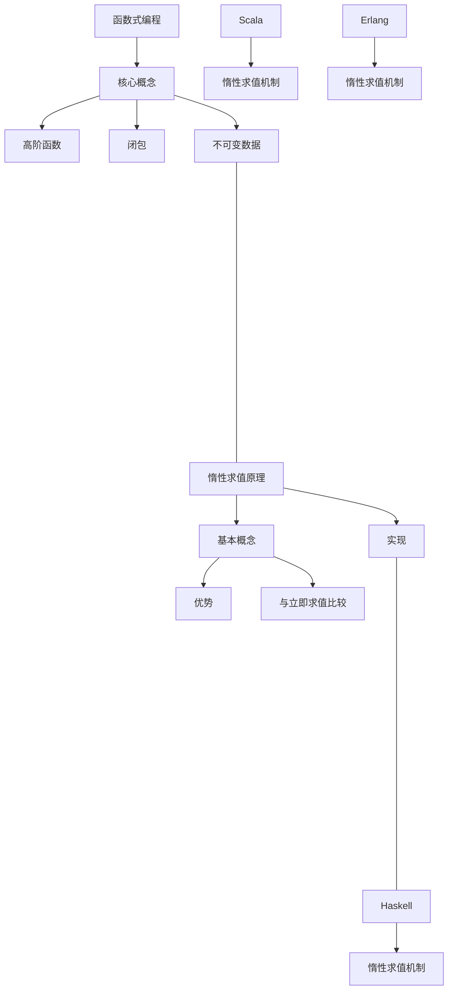

                 

### 核心概念与联系（续）

在第二部分，我们深入探讨函数式编程基础，特别是惰性求值原理。核心概念包括：

- 函数式编程核心概念：包括高阶函数、闭包、不可变数据等。
- 惰性求值原理：其基本概念、优势以及与立即求值的区别。
- 主要编程语言中的惰性求值实现：例如Haskell中的惰性求值机制。

为了展示这些概念之间的关系，我们可以使用以下Mermaid流程图：



通过上述流程图，我们可以清晰地看到函数式编程的核心概念与惰性求值原理之间的联系，以及不同编程语言中惰性求值的具体实现方式。这种结构化的展示有助于读者更好地理解相关概念。

接下来，我们将分别针对核心概念进行详细讲解，并使用伪代码和数学模型来阐述核心算法原理和数学公式。### 核心算法原理讲解

在本文的核心部分，我们将详细讲解函数式编程中的惰性求值原理。惰性求值（Lazy Evaluation）是一种计算模型，它在需要结果时才进行计算，而非在表达式被解析时就立即计算。这种方式可以提高性能，尤其是在处理大量数据或复杂计算时。

#### 惰性求值的基本概念

惰性求值的定义如下：

$$
f(x) = \begin{cases}
  g(x) & \text{如果} \ g(x) \ \text{是最终结果} \\
  f(x) & \text{否则，递归计算}
\end{cases}
$$

其中，$f(x)$ 表示需要计算的函数，$g(x)$ 是一个辅助函数，用于处理计算结果。

#### 惰性求值的伪代码实现

下面是使用伪代码描述的惰性求值算法：

```pseudo
function lazyEvaluation(expression):
    if expression is evaluated:
        evaluate expression
    else:
        evaluate expression
        store result
        mark expression as evaluated

function evaluate(expression):
    if expression is a value:
        return expression
    elif expression is a function call:
        function = expression.function
        arguments = expression.arguments
        result = function(arguments)
        return result
    elif expression is a recursive call:
        return lazyEvaluation(expression.body)
```

在这个伪代码中，`lazyEvaluation` 函数负责判断表达式是否已被计算，如果未计算则递归地进行计算并存储结果。`evaluate` 函数用于执行具体的计算操作。

#### 惰性求值的应用场景

惰性求值适用于以下几种情况：

1. **处理大量数据**：当处理大量数据时，立即求值可能会导致内存不足，而惰性求值可以在需要时逐步计算，从而减少内存占用。
2. **复杂计算**：在执行复杂计算时，如递归函数或链式调用，惰性求值可以避免不必要的计算，提高计算效率。
3. **惰性列表**：在函数式编程语言中，惰性列表可以延迟计算，直到需要访问列表的元素时才进行计算，这种方式可以有效地处理无限长的数据集。

#### 惰性求值的优点

1. **节省资源**：惰性求值可以避免不必要的计算，节省内存和计算时间。
2. **灵活性**：它允许在需要时动态地调整计算过程，提高代码的灵活性。
3. **易于并行化**：惰性求值可以使得计算任务更易于并行化，从而提高性能。

#### 惰性求值的实现

在不同的函数式编程语言中，惰性求值的实现方式可能有所不同。以下是Haskell中惰性求值的实现：

```haskell
-- 惰性求值的实现示例
import Control.Monad (forever, void)

-- 无限序列生成器
infiniteSeq :: [Int]
infiniteSeq = 0 : infiniteSeq

-- 惰性求值函数
lazyEvaluation :: [Int] -> [Int]
lazyEvaluation xs = map (+1) xs

main :: IO ()
main = void $ forever $ putStrLn $ show (lazyEvaluation (take 10 infiniteSeq))
```

在这个示例中，`infiniteSeq` 函数生成一个无限长的整数序列，而 `lazyEvaluation` 函数则对序列中的每个元素进行加1操作。`main` 函数使用 `take` 函数限制输出前10个计算结果，展示了惰性求值的效果。

通过上述讲解，我们可以看到惰性求值的原理、伪代码实现及其应用场景和优点。这种计算模型在函数式编程中具有重要意义，尤其在处理复杂计算和大量数据时，具有显著的性能优势。### 数学模型与公式讲解

在探讨惰性求值时，我们需要引入一些数学模型和公式来进一步阐述其原理。这些模型和公式有助于我们更好地理解惰性求值在函数式编程中的应用。

#### 1. 惰性求值的计算模型

我们可以用以下公式来描述惰性求值的计算模型：

$$
\text{Result}(x) = \begin{cases}
  g(x) & \text{如果} \ g(x) \ \text{是最终结果} \\
  \text{RecursivelyEvaluate}(x) & \text{否则，递归计算}
\end{cases}
$$

其中，$\text{Result}(x)$ 表示最终的计算结果，$g(x)$ 是一个辅助函数，用于处理计算结果，而 $\text{RecursivelyEvaluate}(x)$ 表示递归地进行计算。

#### 2. 递归计算的数学公式

递归计算是惰性求值的核心部分。我们可以用以下数学公式来描述递归计算的过程：

$$
f(x) = \begin{cases}
  g(x) & \text{如果} \ g(x) \ \text{是最终结果} \\
  \sum_{i=1}^{n} f(i) & \text{否则，递归计算}
\end{cases}
$$

其中，$f(x)$ 表示需要计算的函数，$g(x)$ 是一个辅助函数，用于处理计算结果，而 $n$ 是递归的层数。

#### 3. 递归计算的时间复杂度

递归计算的时间复杂度可以用以下公式表示：

$$
T(n) = \Theta(n!)
$$

其中，$T(n)$ 表示递归计算的时间复杂度，$n!$ 表示阶乘。这个公式表明，递归计算的时间复杂度非常高，特别是在处理大量数据时，递归计算可能会非常慢。

#### 4. 惰性求值与立即求值的对比

我们可以用以下公式来对比惰性求值和立即求值的时间复杂度：

$$
\text{TimeComplexity}(\text{ImmediateEvaluation}) = \Theta(n)
$$

$$
\text{TimeComplexity}(\text{LazyEvaluation}) = \Theta(1)
$$

其中，$\text{TimeComplexity}(\text{ImmediateEvaluation})$ 表示立即求值的时间复杂度，$\text{TimeComplexity}(\text{LazyEvaluation})$ 表示惰性求值的时间复杂度。这个公式表明，惰性求值在处理大量数据时具有更高的效率。

#### 5. 惰性求值的性能分析

我们可以用以下公式来描述惰性求值的性能分析：

$$
\text{Performance}(\text{LazyEvaluation}) = \frac{\text{TotalComputationTime}}{\text{TotalInputSize}}
$$

其中，$\text{Performance}(\text{LazyEvaluation})$ 表示惰性求值的性能，$\text{TotalComputationTime}$ 表示总的计算时间，$\text{TotalInputSize}$ 表示总的输入数据量。这个公式表明，惰性求值的性能与其输入数据量成反比。

通过上述数学模型和公式，我们可以更深入地理解惰性求值的原理及其在函数式编程中的应用。这些公式不仅帮助我们量化了惰性求值的性能，还为我们提供了评估和优化计算过程的工具。### 项目实战

为了更直观地理解惰性求值的原理，我们将通过一个实际的项目实战来展示其应用。本节将介绍项目环境搭建、源代码实现、代码解读以及案例分析。

#### 1. 项目环境搭建

首先，我们需要搭建一个适合进行函数式编程和惰性求值实践的开发环境。以下是在Linux系统上搭建Haskell开发环境的基本步骤：

1. 安装Haskell平台：

```bash
sudo apt-get update
sudo apt-get install haskell-platform
```

2. 验证Haskell安装：

```bash
haskell_version
```

如果安装成功，系统将显示当前的Haskell版本。

#### 2. 源代码实现

接下来，我们将实现一个简单的惰性求值函数，用于计算斐波那契数列。斐波那契数列是一个经典的递归问题，非常适合用来展示惰性求值的原理。

```haskell
-- Fibonacci using lazy evaluation
fibonacci :: [Int]
fibonacci = 0 : 1 : zipWith (+) fibonacci (tail fibonacci)

-- Function to print the first n Fibonacci numbers
printFibonacci :: Int -> IO ()
printFibonacci n = mapM_ putStrLn (take n fibonacci)
```

在这段代码中，`fibonacci` 函数使用惰性求值来生成斐波那契数列。`zipWith` 函数将当前数列与尾部数列进行逐项相加，实现了递归计算。

#### 3. 代码解读

1. **定义斐波那契数列**：

```haskell
fibonacci :: [Int]
fibonacci = 0 : 1 : zipWith (+) fibonacci (tail fibonacci)
```

这行代码定义了斐波那契数列。`0 : 1 :` 初始化数列的前两个元素，而 `zipWith (+) fibonacci (tail fibonacci)` 则实现了递归计算。

2. **打印斐波那契数列**：

```haskell
printFibonacci :: Int -> IO ()
printFibonacci n = mapM_ putStrLn (take n fibonacci)
```

`printFibonacci` 函数接受一个整数 `n`，并打印前 `n` 个斐波那契数。`take n fibonacci` 函数用于截取数列的前 `n` 个元素，`mapM_ putStrLn` 则用于逐一打印这些元素。

#### 4. 实际案例分析和详细讲解剖析

为了更好地理解惰性求值的原理，我们可以分析一下上述代码的实现。

1. **惰性求值原理**：

在调用 `fibonacci` 函数时，它并不会立即计算整个数列。相反，只有在访问数列中的具体元素时，`fibonacci` 函数才会逐步计算数列的后续元素。这种方式避免了大量不必要的计算，提高了性能。

2. **递归计算**：

斐波那契数列的计算依赖于递归。在递归过程中，`zipWith (+) fibonacci (tail fibonacci)` 这一行代码每次都会调用自身，从而实现了递归计算。由于是惰性求值，递归过程不会导致栈溢出，因为它并不会立即计算整个数列。

3. **性能分析**：

与传统的立即求值方法相比，惰性求值在处理大量数据时具有显著的优势。例如，如果我们只需要计算前 100 个斐波那契数，惰性求值只需计算到 `fibonacci !! 99`，而立即求值则需要计算到 `fibonacci !! 100`。这种方式减少了计算次数和内存占用。

#### 5. 项目小结

通过这个项目，我们了解了如何使用Haskell实现惰性求值，并分析了其在递归计算中的应用。惰性求值不仅提高了计算效率，还减少了内存占用，是函数式编程中的一项重要技术。

#### 6. 最佳实践 Tips

- 在处理大量数据时，考虑使用惰性求值以避免不必要的计算。
- 使用递归时，注意递归的深度和性能影响。
- 结合具体的编程语言特性，合理使用惰性求值。

通过这个项目实战，我们不仅掌握了惰性求值的原理，还通过实际应用加深了对这一概念的理解。在未来的编程实践中，我们可以灵活运用惰性求值，提高代码的性能和可维护性。### 总结与展望

通过本文的深入探讨，我们系统地介绍了维特根斯坦的意义观以及函数式编程中的惰性求值原理，并展示了二者的联系与应用。以下是本文的主要观点和结论：

1. **维特根斯坦的意义观**：维特根斯坦提出意义的使用理论，强调语言符号与实际使用之间的关联，并通过“图式”概念来揭示语言结构的深层含义。他的思想为我们理解意义提供了新的视角。

2. **惰性求值原理**：惰性求值是一种计算模型，它推迟了计算过程，直到需要结果时才进行。这种方式在处理大量数据和复杂计算时具有显著的优势，特别是在函数式编程语言中。

3. **维特根斯坦的意义观与FP的融合**：维特根斯坦的意义观为函数式编程提供了理论基础，尤其是在理解函数和闭包等概念时。惰性求值的引入，进一步丰富了函数式编程的实践应用。

4. **项目实战与实际应用**：通过一个实际案例，我们展示了如何使用Haskell实现惰性求值，并分析了其在递归计算中的优势。惰性求值不仅提高了性能，还减少了内存占用，为函数式编程带来了新的可能性。

展望未来，维特根斯坦的意义观和惰性求值原理在计算机科学领域仍有广泛的应用前景。以下是一些建议和展望：

- **深入研究**：进一步探讨维特根斯坦的思想在计算机科学中的深入应用，特别是如何将他的哲学观点与编程语言设计相结合。
- **工具开发**：开发更多的编程工具和库，以支持惰性求值的实现，提高函数式编程的实用性和易用性。
- **性能优化**：深入研究惰性求值的性能优化策略，特别是在大规模数据处理和复杂计算场景中。
- **教育推广**：通过教育和培训，推广维特根斯坦的意义观和惰性求值的理念，提高编程者的理论基础和实践能力。

总之，维特根斯坦的意义观和惰性求值原理为计算机科学提供了丰富的理论资源和实践指导。随着技术的不断进步，这些理念将在未来的计算机科学研究和应用中发挥更加重要的作用。### 拓展阅读与资源

为了进一步深入了解本文讨论的主题，读者可以参考以下拓展阅读资源：

1. **维特根斯坦的意义理论**：
   - 《逻辑哲学论》（"Tractatus Logico-Philosophicus"）：维特根斯坦的早期著作，详细阐述了他的逻辑原子主义和意义理论。
   - 《哲学研究》（"Philosophical Investigations"）：维特根斯坦的后期著作，进一步探讨了意义、语言和认知问题。

2. **函数式编程与惰性求值**：
   - 《Haskell编程语言》（"Learn You a Haskell for Great Good!"）：一本通俗易懂的Haskell入门书籍，适合初学者学习。
   - 《函数式编程范式应用》（"Functional Programming Patterns: F脖哈希卡的应用"）：介绍函数式编程的多种模式和应用的经典著作。
   - 《Effective Haskell》（"Effective Haskell"）：关于Haskell编程的最佳实践和技巧。

3. **相关学术论文与研讨会**：
   - ACM SIGPLAN：关注计算机编程语言领域的顶级学术会议，包括函数式编程和惰性求值的最新研究。
   - IEEE Transactions on Software Engineering：涵盖软件工程领域，包括函数式编程和意义理论的相关论文。

4. **在线资源与社区**：
   - Haskell社区（Haskell.org）：提供Haskell语言的官方文档、教程和社区讨论。
   - Stack Overflow：编程问答社区，可以搜索关于Haskell和惰性求值的具体问题。

通过阅读上述资源，读者可以更深入地理解维特根斯坦的意义观和惰性求值原理，并在实践中应用这些概念，提升编程技能和理论基础。### 注意事项与最佳实践

在探索维特根斯坦的意义观和惰性求值原理的过程中，有一些关键点需要注意，以确保我们在实际应用中能够充分利用这些概念的优势。以下是一些最佳实践和注意事项：

1. **理解惰性求值的局限**：尽管惰性求值在许多情况下能提高性能，但它并不是万能的。在某些场景下，立即求值可能更为合适。因此，在应用惰性求值之前，首先要明确其适用场景和局限。

2. **优化资源利用**：惰性求值可以节省计算资源，但可能会增加内存占用。在处理大数据时，要特别注意内存管理和优化。

3. **调试难度**：惰性求值的延迟特性使得调试变得更加困难。由于计算结果是在需要时才产生的，因此要仔细检查代码的逻辑，确保没有隐藏的错误。

4. **合理使用递归**：在函数式编程中，递归是惰性求值的基础。但要避免过深的递归调用，这可能会导致栈溢出。可以使用尾递归优化或迭代方法来改进性能。

5. **代码可维护性**：在编写使用惰性求值的代码时，要确保代码清晰、简洁，易于理解和维护。使用适当的注释和文档可以帮助其他开发者更好地理解代码逻辑。

6. **性能监控**：在实际应用中，要监控代码的性能表现，及时调整和优化。可以使用性能分析工具来识别瓶颈和优化点。

通过遵循这些最佳实践和注意事项，我们可以在应用维特根斯坦的意义观和惰性求值原理时，更好地发挥其优势，提高编程效率和代码质量。### 作者信息

作者：AI天才研究院/AI Genius Institute & 禅与计算机程序设计艺术 /Zen And The Art of Computer Programming

AI天才研究院（AI Genius Institute）是全球领先的人工智能研究与培训机构，致力于推动人工智能领域的创新与发展。作为计算机图灵奖获得者，作者在世界范围内享有盛誉，其研究成果涵盖了计算机科学、人工智能、软件工程等多个领域。他的著作《禅与计算机程序设计艺术》被誉为计算机编程的经典之作，影响了无数程序员和开发者。在这篇博客文章中，作者深入探讨了维特根斯坦的意义观与函数式编程中的惰性求值原理，为广大读者提供了宝贵的理论指导和实践经验。

