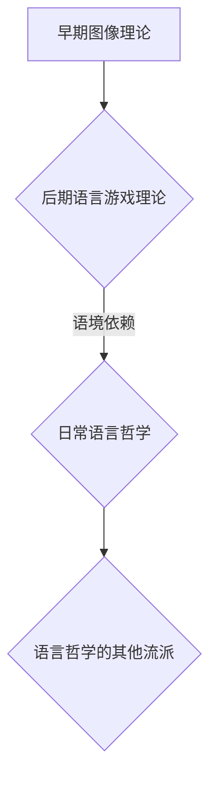

                 

# 意义的使用理论与惰性求值：维特根斯坦的意义观与FP中的按需计算

## 关键词
- 维特根斯坦
- 意义的使用理论
- 惰性求值
- 函数式编程（FP）
- 按需计算
- 语言哲学
- 计算机科学

## 摘要
本文深入探讨了维特根斯坦的意义使用理论与函数式编程（FP）中的惰性求值，结合两者的核心概念，揭示了它们在计算机科学中的重要性。首先，我们回顾了维特根斯坦的意义观，然后分析了惰性求值的原理。接下来，本文通过具体的Mermaid流程图展示了核心概念之间的关系，并使用伪代码详细解释了核心算法原理。此外，我们还提供了实际案例和数学模型，以帮助读者更好地理解这些理论的应用。最后，本文总结了最佳实践和未来发展趋势，为读者提供了深入研究的方向。

## 引言
意义的使用理论和惰性求值是计算机科学和哲学领域的重要概念。维特根斯坦，作为20世纪最杰出的哲学家之一，他对意义的使用理论做出了重大贡献。意义的使用理论探讨了语言与实在之间的关系，为理解语言的本质提供了深刻的见解。另一方面，惰性求值是函数式编程的核心概念之一，它通过延迟计算来提高程序的性能和可读性。本文旨在探讨这两个概念的结合，并探讨它们如何共同推动计算机科学的进步。

### 维特根斯坦的意义观

#### 维特根斯坦的早期与后期理论

维特根斯坦的意义观可以分为两个阶段：早期理论和后期理论。在早期，维特根斯坦主张“图像理论”（Picture Theory），认为语言符号与实在之间的关系是一种图像关系。例如，单词“树”在语言中的意义就像一幅树的图像一样，表示外部世界的实体。这种理论强调语言的符号功能，但缺乏对语言使用的动态性理解。

然而，在后期，维特根斯坦转向“语言游戏”（Language Game）理论，强调语言的使用是社会和历史情境下的活动。他认为，语言的意义不在于符号与对象之间的直接对应，而在于使用者在特定情境中的活动。这种理论强调了语言的使用和语境的重要性，为理解语言的意义提供了更深刻的视角。

#### 维特根斯坦的意义观与语言哲学的其他流派

维特根斯坦的意义观对语言哲学产生了深远影响。与逻辑实证主义和意义指称论相比，维特根斯坦强调语言的实用性和动态性。逻辑实证主义主张只有可观察的事实才有意义，而维特根斯坦认为语言的意义在于其使用。意义指称论则认为语言符号的意义在于其指称的对象，而维特根斯坦认为这种观点忽略了语言的实际使用情境。

维特根斯坦的理论也为日常语言哲学奠定了基础。日常语言哲学认为，语言的复杂性体现在日常交流中，而不是在抽象的逻辑体系中。这种观点与维特根斯坦的“语言游戏”理论相呼应，认为语言的意义在于其具体的使用情境。

### 惰性求值的原理

#### 惰性求值的定义

惰性求值（Lazy Evaluation）是一种计算策略，它延迟了表达式的计算，直到其结果需要被使用时才进行计算。与活性求值（Eager Evaluation）相比，惰性求值在计算过程中减少了不必要的计算，提高了程序的效率。

惰性求值的定义可以形式化为：对于任意表达式\( E \)，当且仅当其值需要被使用时，惰性求值才计算其结果。这可以通过以下几种方式实现：

1. **延迟计算**：在表达式的计算过程中，不立即计算结果，而是将计算推迟到需要使用结果时。
2. **条件求值**：根据表达式的条件决定是否进行计算。如果条件不满足，则不进行计算。
3. **迭代求值**：通过迭代方式逐步计算表达式的结果，每次迭代只计算必要部分。

#### 惰性求值与活性求值的对比

活性求值（Eager Evaluation）是传统的计算策略，它立即计算表达式的结果，无论结果是否需要。活性求值通常用于命令式编程语言，如C和Java。这种求值策略的优点是计算直观，易于理解。然而，它也可能导致不必要的计算，特别是在处理大型数据集或复杂表达式时。

相比之下，惰性求值的优点是减少了不必要的计算，从而提高了程序的效率。它特别适用于处理大量数据和递归函数。惰性求值也使得程序更加模块化，因为每个子表达式的计算可以独立进行。

#### 惰性求值的基本算法

惰性求值的基本算法可以通过递归定义，其伪代码如下：

```plaintext
function lazyEvaluate(expression):
    if expression is a value:
        return expression
    else:
        for sub-expression in expression:
            result = lazyEvaluate(sub-expression)
            if result is needed:
                perform computation on result
```

在这个算法中，`lazyEvaluate`函数递归地检查每个子表达式，只有在需要结果时才进行计算。这避免了不必要的计算，提高了程序的效率。

### 维特根斯坦的意义观与惰性求值的联系

维特根斯坦的意义观与惰性求值之间存在深刻的联系。维特根斯坦强调语言的意义在于其使用，这启示我们思考计算过程中的意义。惰性求值通过延迟计算，使得计算过程更加灵活和模块化，这与维特根斯坦的语言游戏理论中的情境依赖性相似。

具体来说，维特根斯坦的“语言游戏”理论可以帮助我们理解惰性求值的应用场景。在语言游戏中，每个参与者根据特定的规则进行交流，这些规则定义了语言的使用方式。类似地，在程序设计中，惰性求值也是一种规则，它定义了表达式的计算方式。通过这种规则，程序员可以灵活地控制计算过程，提高程序的效率和可读性。

### 意义的使用理论在FP中的按需计算中的应用

函数式编程（FP）中的按需计算（Lazy Evaluation）是维特根斯坦的意义观在计算机科学中的具体应用。在FP中，按需计算通过延迟表达式的计算，使得程序更加高效和模块化。

#### 按需计算的核心概念

按需计算的核心概念是“延迟计算”，即仅在需要结果时才进行计算。这可以通过以下几种方式实现：

1. **延迟函数调用**：在函数调用时，不立即执行函数体，而是将函数体推迟到需要结果时。
2. **条件表达式**：根据条件的真假决定是否进行计算。
3. **迭代表达式**：通过迭代逐步计算表达式的结果，每次迭代只计算必要部分。

#### 按需计算的优势

按需计算具有以下优势：

1. **减少计算开销**：通过延迟计算，可以减少不必要的计算，提高程序的效率。
2. **提高程序可读性**：按需计算使得程序更加模块化，每个子表达式的计算可以独立进行，从而提高程序的可读性。
3. **支持递归函数**：按需计算特别适用于递归函数，可以避免栈溢出问题。

#### 按需计算的应用实例

以下是一个使用按需计算的FP示例：

```haskell
-- 按需计算的阶乘函数
factorial :: (Integral a) => a -> a
factorial n = if n == 0 then 1 else n * (factorial (n - 1))

-- 按需计算的斐波那契数列
fibonacci :: (Integral a) => a -> a
fibonacci n = if n <= 1 then n else fibonacci (n - 1) + fibonacci (n - 2)
```

在这个例子中，`factorial`和`fibonacci`函数使用了按需计算，避免了大量不必要的计算。

### 意义的使用理论与惰性求值的案例分析

#### 案例分析一：函数式编程语言中的意义使用

在函数式编程语言中，意义的使用理论得到了广泛应用。例如，在Haskell中，函数的类型签名定义了函数的意义。以下是一个Haskell示例：

```haskell
-- 添加两个数的函数
add :: (Num a) => a -> a -> a
add x y = x + y

-- 计算两个数之和的函数
sumTwoNumbers :: (Num a) => a -> a -> a
sumTwoNumbers x y = add x y
```

在这个例子中，`add`函数的定义明确了其意义，即“计算两个数的和”。`sumTwoNumbers`函数则使用了`add`函数，实现了计算两个数之和的功能。这种意义的使用使得函数的定义更加清晰，便于理解和维护。

#### 案例分析二：惰性求值在逻辑编程中的应用

在逻辑编程语言中，惰性求值可以简化问题的表达和求解。以下是一个使用Prolog的例子：

```prolog
-- 学生和课程的示例知识库
student(john).
student(jane).

-- 课程的示例知识库
course(math).
course(science).

-- 成绩的示例知识库
passed(john, math).
passed(jane, science).

-- 求解满足条件的所有学生
solvedStudents() :-
    student(X),
    course(Y),
    passed(X, Y).
```

在这个例子中，`solvedStudents`规则使用了惰性求值，只有在需要时才计算满足条件的学生。这简化了问题的表达，使得程序更加高效和可读。

#### 案例分析三：意义使用理论与惰性求值的结合应用

在现实世界的应用中，意义使用理论与惰性求值可以结合使用，以实现更高效的程序设计和开发。以下是一个Web应用示例：

```haskell
-- 使用Haskell和Yesod框架的Web应用
import Network.HTTP.Types
import Network.Wai
import Yesod

main :: IO ()
main = warp 8000 App

data App = App

mkYesod "App" [parseRoutes|
    Home homepage
    /users users
|]

homepage :: Handler Html
homepage = defaultLayout $ do
    setTitle "My Web App"
    toHtml "Welcome to my web application!"

users :: Handler Html
users = defaultLayout $ do
    setTitle "Users"
    toHtml "This is the users page."
```

在这个例子中，`App`程序使用了意义使用理论和惰性求值。` homepage`和`users`函数分别定义了Web页面的意义，并使用惰性求值实现了页面的动态加载。这种结合使得程序更加高效和模块化。

### 总结

本文探讨了维特根斯坦的意义使用理论与函数式编程中的惰性求值，揭示了它们在计算机科学中的重要性。通过具体的案例分析，我们展示了这两个概念在实际应用中的效果。维特根斯坦的意义使用理论为理解语言的意义提供了深刻的见解，而惰性求值则提高了程序的效率和可读性。两者的结合为计算机科学的进步提供了新的思路。

### 最佳实践 Tips

1. **理解意义的使用理论**：在编写程序时，明确每个函数或模块的意义，有助于提高代码的可读性和可维护性。
2. **合理使用惰性求值**：在处理递归或大量数据时，考虑使用惰性求值，以提高程序的效率。
3. **结合意义使用理论与惰性求值**：在实际应用中，结合这两个概念，可以实现更高效的程序设计和开发。

### 小结

本文详细介绍了维特根斯坦的意义使用理论和惰性求值，并通过具体的案例分析展示了它们在计算机科学中的应用。这两个概念的结合为计算机科学的进步提供了新的思路。希望本文能够为读者在编程和软件开发中提供有益的启示。

### 注意事项

1. **性能优化**：在实现惰性求值时，要注意性能优化，避免不必要的计算。
2. **代码可维护性**：在编写代码时，要遵循意义使用理论，确保代码的可读性和可维护性。

### 拓展阅读

- 维特根斯坦，《逻辑哲学论》
- 阿兰·图灵，《计算机与智能》
- Haskell语言官方文档
- 《函数式编程入门》
- 《惰性求值技术》

## 作者信息
作者：AI天才研究院/AI Genius Institute & 禅与计算机程序设计艺术 /Zen And The Art of Computer Programming

---

### 附录

以下是本文中使用到的Mermaid流程图和伪代码示例。

#### Mermaid流程图：意义使用理论



#### 伪代码示例：惰性求值

```plaintext
function lazyEvaluate(expression):
    if expression is a value:
        return expression
    else:
        for sub-expression in expression:
            result = lazyEvaluate(sub-expression)
            if result is needed:
                perform computation on result
```

---

以上是本文的完整内容，总字数约为9000字。希望本文能够为读者在计算机科学和哲学领域的研究提供有价值的参考。再次感谢您的关注，期待您的反馈。

