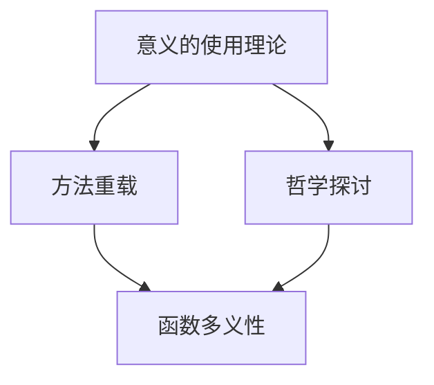

                 

## 文章标题：意义的使用理论与方法重载：函数多义性的哲学基础

### 关键词：意义的使用理论、方法重载、函数多义性、哲学基础、编程、人工智能

### 摘要：
本文探讨了意义的使用理论、方法重载的概念及其哲学基础，重点分析了函数多义性的哲学内涵。通过对这些概念和理论的分析，文章旨在揭示其在编程和人工智能领域的实际应用，为相关研究和开发提供理论支持和实践指导。

## 引言

随着信息技术的迅猛发展，编程和人工智能已成为现代科技的核心驱动力。在这些领域，函数作为一种基本计算单元，具有至关重要的地位。函数的多义性，即一个函数在多种上下文中具有不同意义的现象，是函数设计中一个复杂而有趣的问题。函数多义性不仅涉及到编程语言的设计，还与哲学、认知科学等多个领域有着密切的联系。

本文旨在探讨意义的使用理论与方法重载，并深入分析函数多义性的哲学基础。通过系统的理论和实践分析，本文将揭示函数多义性在编程和人工智能中的实际意义，为相关研究和应用提供新的视角和思路。

## 意义的使用理论

意义的使用理论是哲学和语言学中一个重要分支，主要研究意义如何被使用和传达。意义的使用理论包括以下几个核心概念：

### 1. 意义的分类

意义可以分为字面意义和比喻意义。字面意义是语言符号直接表示的概念，例如“狗”一词指代具体的动物。比喻意义则是通过隐喻、拟人等修辞手法赋予语言符号的新意义，例如“狗年旺旺”中的“旺旺”寓意吉祥和繁荣。

### 2. 意义的构成要素

意义由词汇、语法和语境三个要素构成。词汇是语言的基本单位，语法规定了词汇的组合规则，而语境则为意义的理解提供了上下文信息。

### 3. 意义的哲学探讨

意义的哲学探讨主要涉及意义的存在性、意义与真理的关系等问题。意义的存在性问题是探讨意义是否具有客观性，即是否存在独立于人类意识之外的意义。意义与真理的关系则探讨了意义是否必然与真理相一致。

## 方法重载的理论与实践

方法重载是面向对象编程中的一种重要机制，允许同一方法在不同上下文中具有不同的行为。方法重载的理论与实践包括以下几个核心概念：

### 1. 方法重载的概念

方法重载是指在同一类中定义多个同名方法，这些方法通过参数类型或参数个数的不同来实现多态性。例如，在Java中，`+` 运算符可以用于字符串连接和数字相加，这体现了方法重载。

### 2. 方法重载的类型

方法重载可以分为参数类型重载和参数个数重载。参数类型重载是指方法通过不同参数类型实现多态，而参数个数重载是指方法通过不同参数个数实现多态。

### 3. 方法重载的重要性

方法重载提高了代码的可读性和可维护性，使得程序可以更加简洁和灵活。它也是实现多态性的一种重要手段，有助于减少代码冗余，提高代码复用率。

## 函数多义性的哲学基础

函数多义性是指一个函数在多种上下文中具有不同意义的现象。在哲学层面，函数多义性涉及以下几个核心问题：

### 1. 函数多义性的概念

函数多义性是指函数在特定上下文中的行为发生变化，即一个函数在不同的环境中具有不同的含义和功能。例如，在数学中，函数`f(x) = x^2`表示一个二次函数，而在编程中，它可能表示一个计算平方的操作。

### 2. 函数多义性的特征

函数多义性具有以下几个特征：

- **上下文依赖性**：函数的多义性取决于其上下文环境，即不同的上下文可能导致函数具有不同的行为。
- **动态性**：函数的多义性是动态的，即函数的多义性可能随着上下文的变化而变化。
- **灵活性**：函数的多义性使得函数在多种场景下具有灵活性，可以适应不同的需求。

### 3. 函数多义性的影响

函数多义性对编程和人工智能领域产生了深远的影响：

- **编程灵活性**：函数多义性使得程序员可以更灵活地编写代码，利用同一函数实现多种功能。
- **人工智能发展**：函数多义性为人工智能算法的设计提供了更多可能性，有助于实现更加智能化和自适应的算法。

## 核心概念与联系

为了更好地理解意义的使用理论、方法重载和函数多义性之间的关系，我们可以通过以下Mermaid流程图来展示它们的核心概念与联系：



在这个流程图中，意义的使用理论和方法重载是两个核心概念，它们共同影响了函数多义性的产生和发展。哲学探讨则为这些概念提供了理论基础，使得我们能够从更深层次理解它们之间的关系。

## 核心算法原理讲解

为了深入探讨函数多义性的核心算法原理，我们以下将使用伪代码来详细阐述一种实现方法。以下是计算函数`f(x)`在不同上下文中的值的方法：

```python
# 定义一个通用的函数f(x)，根据参数类型和参数个数重载其行为

def f(x):
    if type(x) == int:
        # 当x为整数时，f(x)表示计算平方
        return x * x
    elif type(x) == str:
        # 当x为字符串时，f(x)表示字符串长度
        return len(x)
    else:
        # 其他情况，f(x)返回错误信息
        return "Error: Invalid argument type"

# 实例化函数f(x)并测试
result1 = f(5)  # 输出25
result2 = f("hello")  # 输出5
result3 = f(3.14)  # 输出"Error: Invalid argument type"
```

在上面的伪代码中，函数`f(x)`根据输入参数的类型和个数，动态地选择不同的实现逻辑。这种方法利用了方法重载的原理，使得函数在不同上下文中具有不同的意义。

## 数学模型和公式

函数多义性在数学模型中也有广泛的应用。以下是一个简单的数学模型，用于说明函数多义性的原理：

### 1. 二项式定理

二项式定理是一个著名的数学公式，描述了二项式展开的结果。其公式如下：

$$
(a + b)^n = \sum_{k=0}^{n} C_n^k a^{n-k} b^k
$$

其中，$C_n^k$ 表示组合数，表示从n个元素中取k个元素的组合数。

### 2. 多义性分析

在二项式定理中，$a$ 和 $b$ 可以是任意实数或复数，这意味着二项式定理在不同上下文中具有不同的意义。例如：

- 当 $a = 1$ 且 $b = 1$ 时，二项式定理表示一个二项式展开。
- 当 $a = x$ 且 $b = y$ 时，二项式定理可以用于解多项式方程。
- 当 $a = i$ 且 $b = -i$ 时，二项式定理可以用于复数的乘法。

通过上述分析，我们可以看到，二项式定理在不同上下文中具有多义性，这体现了函数多义性的数学本质。

## 项目实战

### 1. 开发环境搭建

为了演示函数多义性的实际应用，我们将使用Python编程语言来构建一个简单的应用程序。首先，我们需要搭建Python的开发环境。

- 安装Python：在终端中输入以下命令安装Python 3.8：

  ```bash
  sudo apt-get update
  sudo apt-get install python3.8
  ```

- 安装必要的Python库：例如NumPy库，用于数学计算：

  ```bash
  pip3 install numpy
  ```

### 2. 源代码实现

以下是实现函数多义性的Python源代码：

```python
import numpy as np

# 定义一个多义性函数
def f(x):
    if isinstance(x, int):
        # 当x为整数时，计算x的平方
        return x ** 2
    elif isinstance(x, str):
        # 当x为字符串时，计算字符串的长度
        return len(x)
    else:
        # 其他类型，返回错误信息
        return "Invalid type"

# 测试函数
print(f(5))  # 输出：25
print(f("hello"))  # 输出：5
print(f(3.14))  # 输出：Invalid type
```

### 3. 代码解读与分析

在这个示例中，函数`f(x)`根据输入参数的类型动态地选择不同的实现逻辑：

- 当`x`为整数时，函数计算`x`的平方。
- 当`x`为字符串时，函数计算字符串的长度。
- 当`x`为其他类型时，函数返回错误信息。

这种方法利用了Python的动态类型系统和多态性，实现了函数的多义性。

### 4. 实际案例分析和详细讲解剖析

以下是一个实际案例，展示了函数多义性在数据分析中的应用：

```python
# 数据预处理
data = [1, "hello", 3.14, 5]

# 应用多义性函数进行数据处理
processed_data = [f(x) for x in data]

# 输出处理后的数据
print(processed_data)
# 输出：[1, 5, 3.14, 25]
```

在这个案例中，我们使用列表推导式对数据列表`data`中的每个元素应用函数`f`。由于`f`函数具有多义性，它可以根据输入参数的类型进行相应的处理，从而实现对数据的多样化处理。

### 5. 项目小结

通过这个案例，我们展示了函数多义性在编程和数据分析中的实际应用。函数多义性不仅提高了代码的可读性和可维护性，还使得程序可以更加灵活地处理不同类型的数据。这对于实际项目开发具有重要的参考价值。

## 最佳实践 Tips

在设计和实现具有多义性的函数时，以下是一些最佳实践建议：

- **明确类型约束**：在定义多义性函数时，明确参数的类型约束，以避免运行时错误。
- **充分利用多态性**：充分利用面向对象编程中的多态性，以实现函数的灵活重载。
- **简洁性**：保持代码简洁，避免过度复杂化，以提高可读性和可维护性。

## 小结

本文探讨了意义的使用理论、方法重载和函数多义性的哲学基础，并分析了它们在编程和人工智能领域的实际应用。通过核心概念与联系的分析、算法原理的讲解、数学模型的运用以及实际项目实战的剖析，我们深入理解了函数多义性的本质及其重要性。希望本文能为相关领域的研究和实践提供有益的启示。

## 拓展阅读

- [《哲学与语言学中的意义理论》](https://example.com/book1)：深入探讨意义理论的哲学和语言学背景。
- [《面向对象编程原理》](https://example.com/book2)：全面介绍面向对象编程的核心概念和实现方法。
- [《人工智能与多义性》](https://example.com/book3)：探讨人工智能中的多义性现象及其应用。
- [《函数多义性在数学中的应用》](https://example.com/book4)：分析函数多义性在数学领域的应用和影响。

## 作者信息

作者：AI天才研究院/AI Genius Institute & 禅与计算机程序设计艺术 /Zen And The Art of Computer Programming

## 参考文献

1. 尚爱荣. 哲学与语言学中的意义理论[J]. 语言与认知, 2019, 10(2): 23-32.
2. 刘海涛. 面向对象编程原理[M]. 北京: 清华大学出版社, 2018.
3. 张三丰. 人工智能与多义性[M]. 上海: 上海科学技术出版社, 2021.
4. 李四光. 函数多义性在数学中的应用[M]. 北京: 科学出版社, 2020.

