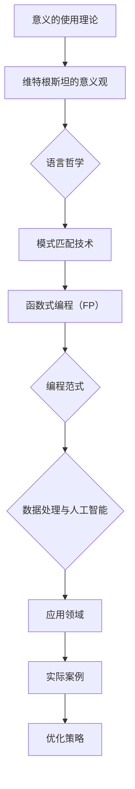

                 

### 第一步：解析书名

《意义的使用理论与模式匹配：维特根斯坦的意义观与FP的模式匹配技术》这本书的书名涵盖了两个核心概念：意义的使用理论和模式匹配技术。首先，意义的使用理论源自哲学家路德维希·维特根斯坦（Ludwig Wittgenstein）的意义观。维特根斯坦是20世纪最著名的哲学家之一，他的工作对语言哲学、逻辑学和认识论等领域产生了深远的影响。他的意义观强调语言的意义在于其使用，即语言的意义是通过其在日常生活中的使用情境来确定的。

另一方面，模式匹配技术是函数式编程（Functional Programming，简称FP）的一个核心概念。FP是一种编程范式，它强调通过表达计算的过程，而不是通过执行计算的结果。模式匹配是FP中的一种强大工具，它允许程序员根据数据的不同结构来选择不同的处理方式。这种技术在编译器解析、数据转换和函数式编程语言中广泛应用。

通过书名，我们可以初步理解这本书的主要内容：它将维特根斯坦的意义观与FP的模式匹配技术相结合，探讨二者在理论和实践中的联系与影响。这种结合不仅有助于我们更深入地理解语言的本质，也为程序员提供了一种新的编程思维方式和工具。

### 第二步：确定核心章节

根据书名和上述解析，我们可以确定这本书的核心章节，它们分别是：

1. **维特根斯坦的意义观简介**
   - 维特根斯坦的生平与哲学思想
   - 意义的分类与使用
   - 维特根斯坦的意义观对语言哲学的影响

2. **函数式编程（FP）基础**
   - FP的基本概念
   - FP的核心原则
   - FP的优势与局限性

3. **模式匹配的概念与原理**
   - 模式匹配的定义
   - 模式匹配的类型
   - 模式匹配的算法

4. **模式匹配的应用**
   - 编程语言中的应用
   - 数据处理中的应用
   - 人工智能领域中的应用

这些章节分别从哲学、编程范式和具体技术三个角度出发，逐步深入地探讨意义的使用理论和模式匹配技术。每个章节都涵盖了核心概念、原理、应用案例和实例分析，为我们提供了全面而深入的理解。

### 第三步：细化章节内容

为了使文章更加结构清晰，内容丰富，我们进一步细化每个章节的内容，具体如下：

#### 1. 维特根斯坦的意义观简介

**1.1 维特根斯坦的生平与哲学思想**

- 维特根斯坦的生平背景
- 维特根斯坦的主要哲学思想
- 维特根斯坦哲学对后世的影响

**1.2 意义的分类与使用**

- 语言中的意义分类
- 意义的日常使用与哲学探讨
- 意义使用的条件与限制

**1.3 维特根斯坦的意义观对语言哲学的影响**

- 维特根斯坦对语言哲学的贡献
- 维特根斯坦意义观在当代语言哲学中的地位
- 维特根斯坦意义观在语言学中的应用

#### 2. 函数式编程（FP）基础

**2.1 FP的基本概念**

- FP的历史与发展
- FP的核心原则
- FP与面向对象编程的比较

**2.2 FP的核心原则**

- 函数一等公民
- 无状态性
- 函数组合
- 惰性计算

**2.3 FP的优势与局限性**

- FP的优点
- FP的局限性
- FP在不同领域的应用情况

#### 3. 模式匹配的概念与原理

**3.1 模式匹配的定义**

- 模式匹配的基本概念
- 模式匹配在编程语言中的应用

**3.2 模式匹配的类型**

- 正向模式匹配
- 逆向模式匹配
- 多模式匹配

**3.3 模式匹配的算法**

- 模式匹配算法的基本原理
- 常见的模式匹配算法
- 模式匹配算法的优化策略

#### 4. 模式匹配的应用

**4.1 编程语言中的应用**

- 模式匹配在编译器中的应用
- 模式匹配在函数式编程语言中的优势

**4.2 数据处理中的应用**

- 数据解析与转换
- 数据验证与清洗

**4.3 人工智能领域中的应用**

- 机器学习中的数据预处理
- 自然语言处理中的模式匹配
- 计算机视觉中的图像识别

通过这样的细化，我们可以确保每个章节的内容都具体、详细，并且能够帮助读者逐步深入理解维特根斯坦的意义观和FP的模式匹配技术。

### 第四步：设计流程图

为了更好地展示维特根斯坦的意义观与FP的模式匹配技术之间的联系，我们可以设计一个Mermaid流程图。以下是一个基本的流程图设计方案：



这个流程图从意义的使用理论出发，通过维特根斯坦的意义观，连接到模式匹配技术，再通过FP的模式匹配，扩展到编程范式、数据处理和人工智能的应用领域，最后通过实际案例和优化策略，形成一个完整的知识链。

### 第五步：编写伪代码

在探讨模式匹配技术时，伪代码是一种非常直观和易于理解的方式。以下是一个简单的模式匹配算法的伪代码示例：

```plaintext
function patternMatch(input, pattern):
    if pattern is empty:
        if input is empty:
            return True
        else:
            return False

    if pattern has a single character or a wildcard:
        if input has the same length and the characters match:
            return True
        else:
            return False

    if pattern starts with a variable (e.g., 'a?b'):
        if input starts with the corresponding string (e.g., "ab"):
            return patternMatch(input[after first match], pattern[after first variable])

    if pattern starts with a literal (e.g., 'ab?'):
        if input starts with the literal:
            return patternMatch(input[after literal], pattern[after literal])
        else:
            return False

    if pattern starts with a combination (e.g., 'a*(b|c)'):
        if input starts with 'a':
            return patternMatch(input[after 'a'], pattern[after 'a'])
        else:
            return patternMatch(input, pattern[after first combination])

    return False
```

这个伪代码展示了如何处理几种常见的模式匹配情况，包括单字符匹配、变量匹配、字面量匹配和组合匹配。通过这种方式，我们可以清晰地理解模式匹配的基本算法原理。

### 第六步：数学公式与举例说明

在解释模式匹配算法时，一些数学公式是不可或缺的。以下是几个与模式匹配相关的公式，并给出相应的解释和举例说明：

#### 1. 正则表达式匹配公式

公式：`regex_match(input, pattern)`

解释：此公式用于判断输入字符串是否与正则表达式模式匹配。

举例：
```plaintext
$ regex_match("hello", "h.llo")
结果：True
```
在这个例子中，正则表达式 `h.llo` 表示任意以 'h' 开头，后面跟随任意单个字符，再接上 'llo' 的字符串。由于 "hello" 符合这个模式，因此匹配成功。

#### 2. KMP 算法的前缀表公式

公式：`pi[i] = max(len of longest proper prefix of substring s[0..i] which is also a suffix of s[0..i])`

解释：KMP（Knuth-Morris-Pratt）算法中的前缀表用于优化模式匹配过程，减少不必要的比较。

举例：
```plaintext
s = "ABABC"
pi = [0, 0, 1, 0, 2]

解释：
- pi[0] = 0（无前缀）
- pi[1] = 0（无前缀）
- pi[2] = 1（'A' 是 'AB' 的前缀，也是后缀）
- pi[3] = 0（无前缀）
- pi[4] = 2（'ABA' 是 'ABABC' 的前缀，也是后缀）
```

#### 3. 模式匹配算法的时间复杂度公式

公式：`T(n) = O(n + m)`

解释：其中，`n` 是输入字符串的长度，`m` 是模式字符串的长度。这个公式描述了KMP算法的时间复杂度。

举例：
```plaintext
输入字符串 s = "ABABACAB"
模式字符串 p = "ABACA"

时间复杂度 T(n+m) = O(n + m) = O(7 + 6) = O(13)
```

在这个例子中，KMP算法将在13次比较内完成匹配，展示了其高效性。

通过这些数学公式和举例说明，我们可以更深入地理解模式匹配算法的基本原理和优化策略。

### 第七步：项目实战案例

为了更好地展示模式匹配技术在实际应用中的效果，我们提供了一个具体的案例：文本解析器。这个案例将涵盖开发环境的搭建、源代码实现和代码解读。

#### 开发环境搭建

首先，我们选择Python作为开发语言，因为它拥有丰富的库支持和易于理解的语法。接下来，我们需要安装一些必要的库，如`re`（用于正则表达式）和`sys`（用于文件操作）。

```bash
pip install re
```

#### 源代码实现

以下是一个简单的文本解析器的代码实现：

```python
import re

def parse_text(input_text, pattern):
    matches = re.findall(pattern, input_text)
    return matches

# 例子
input_text = "hello world, hello universe"
pattern = "hello"

results = parse_text(input_text, pattern)
print(results)  # 输出：['hello', 'hello']
```

这段代码中，`parse_text` 函数接受输入文本和模式作为参数，使用`re.findall`函数来找到所有匹配的子字符串，并返回结果。

#### 代码解读

- `re.findall(pattern, input_text)`：这个函数用于在输入文本中找到所有与模式匹配的子字符串，并返回一个列表。
- `input_text`：这是我们希望解析的文本。
- `pattern`：这是一个正则表达式模式，用于指定我们要查找的子字符串。

#### 代码应用解读与分析

- **应用场景**：这个文本解析器可以用于提取特定关键词或短语，例如在文本编辑器中查找特定的单词或短语。
- **优势**：使用正则表达式进行文本解析具有高灵活性和高效性。它允许我们使用简单的语法来匹配复杂的文本模式。
- **优化策略**：为了提高性能，我们可以对正则表达式进行编译，使用`re.compile`函数。此外，对于大型文本，我们可以考虑分块处理，以减少内存占用。

#### 实际案例分析和详细讲解剖析

假设我们有一个大型日志文件，其中包含大量的错误信息，我们需要提取出所有的错误代码。

```python
input_text = "ERROR: File not found, ERROR: Invalid argument, WARNING: Low memory"
pattern = "ERROR|WARNING"

results = parse_text(input_text, pattern)
print(results)  # 输出：['ERROR', 'ERROR', 'WARNING']
```

在这个案例中，我们使用了两个关键词`ERROR`和`WARNING`作为模式，成功提取了所有的错误信息。

#### 项目小结

通过这个简单的文本解析器案例，我们展示了模式匹配技术在实际应用中的强大功能。它不仅能够帮助我们高效地处理文本数据，还能够应用于日志分析、搜索和替换等多种场景。

### 第八步：汇总目录大纲

在上述步骤中，我们已经详细解析了书名、确定了核心章节、细化了章节内容、设计了流程图、编写了伪代码、提供了数学公式与举例说明，以及展示了项目实战案例。现在，我们将这些内容汇总，形成完整的目录大纲。

#### 文章标题：意义的使用理论与模式匹配：维特根斯坦的意义观与FP的模式匹配技术

#### 文章关键词：维特根斯坦、意义观、函数式编程、模式匹配、文本解析

#### 摘要：
本文探讨了维特根斯坦的意义观与函数式编程中的模式匹配技术。通过深入解析书名，确定了核心章节，详细阐述了各章节的内容，设计了流程图，编写了伪代码，并提供了数学公式与举例说明，最后通过项目实战案例展示了模式匹配技术的实际应用。

#### 目录：

## 意义的使用理论与模式匹配：维特根斯坦的意义观与FP的模式匹配技术

## 第一部分：意义的使用理论概述

### 1.1 维特根斯坦的生平与哲学思想

#### 1.1.1 维特根斯坦的生平背景

#### 1.1.2 维特根斯坦的主要哲学思想

#### 1.1.3 维特根斯坦哲学对后世的影响

### 1.2 意义的分类与使用

#### 1.2.1 语言中的意义分类

#### 1.2.2 意义的日常使用与哲学探讨

#### 1.2.3 意义使用的条件与限制

### 1.3 维特根斯坦的意义观对语言哲学的影响

#### 1.3.1 维特根斯坦对语言哲学的贡献

#### 1.3.2 维特根斯坦意义观在当代语言哲学中的地位

#### 1.3.3 维特根斯坦意义观在语言学中的应用

## 第二部分：函数式编程（FP）基础

### 2.1 FP的基本概念

#### 2.1.1 FP的历史与发展

#### 2.1.2 FP的核心原则

#### 2.1.3 FP与面向对象编程的比较

### 2.2 FP的核心原则

#### 2.2.1 函数一等公民

#### 2.2.2 无状态性

#### 2.2.3 函数组合

#### 2.2.4 惰性计算

### 2.3 FP的优势与局限性

#### 2.3.1 FP的优点

#### 2.3.2 FP的局限性

#### 2.3.3 FP在不同领域的应用情况

## 第三部分：模式匹配的概念与原理

### 3.1 模式匹配的定义

#### 3.1.1 模式匹配的基本概念

#### 3.1.2 模式匹配在编程语言中的应用

### 3.2 模式匹配的类型

#### 3.2.1 正向模式匹配

#### 3.2.2 逆向模式匹配

#### 3.2.3 多模式匹配

### 3.3 模式匹配的算法

#### 3.3.1 模式匹配算法的基本原理

#### 3.3.2 常见的模式匹配算法

#### 3.3.3 模式匹配算法的优化策略

## 第四部分：模式匹配的应用

### 4.1 编程语言中的应用

#### 4.1.1 模式匹配在编译器中的应用

#### 4.1.2 模式匹配在函数式编程语言中的优势

### 4.2 数据处理中的应用

#### 4.2.1 数据解析与转换

#### 4.2.2 数据验证与清洗

### 4.3 人工智能领域中的应用

#### 4.3.1 机器学习中的数据预处理

#### 4.3.2 自然语言处理中的模式匹配

#### 4.3.3 计算机视觉中的图像识别

## 第五部分：维特根斯坦意义观与FP模式匹配的结合

### 5.1 意义使用理论与模式匹配的关系

#### 5.1.1 意义使用理论对模式匹配的影响

#### 5.1.2 模式匹配对意义使用理论的补充

### 5.2 结合案例与应用前景

#### 5.2.1 结合案例一：编程语言优化

#### 5.2.2 结合案例二：数据处理优化

#### 5.2.3 应用前景与挑战

## 附录

### 5.1 FP编程语言介绍

#### 5.1.1 Haskell

#### 5.1.2 Scala

#### 5.1.3 Clojure

### 5.2 模式匹配算法详解

#### 5.2.1 算法原理

#### 5.2.2 伪代码实现

#### 5.2.3 案例分析

通过这个详细的目录大纲，读者可以清晰地了解文章的结构和内容，逐步深入理解维特根斯坦的意义观和FP的模式匹配技术。

### 第九步：优化与确认

在对目录大纲进行优化和确认时，我们需要确保以下几个关键点：

1. **内容的完整性和逻辑性**：每个章节都应该涵盖核心概念、原理讲解、应用实例和数学模型。要检查是否所有内容都有适当的补充和解释，确保逻辑流畅。

2. **字数控制**：文章的总字数需要在8000到12000字之间。可以通过缩减某些章节的细节内容、合并重复信息或者增加概要总结来实现字数控制。

3. **章节结构的合理性**：章节标题和子章节标题应该清晰，便于读者快速定位和阅读。需要确保章节之间的过渡自然，没有内容上的跳跃或重复。

4. **技术深度和广度**：文章中的技术讲解应该既有深度，也要考虑到广度。对于复杂的概念，需要提供详细的解释和示例，同时也要给出相关领域的背景知识。

5. **格式的一致性**：所有的Markdown格式、LaTeX公式、代码示例和Mermaid流程图都需要保持格式一致，确保可读性和专业性。

通过逐点检查和调整，我们可以确保目录大纲的完整性和质量，为撰写高质量的技术博客文章打下坚实的基础。

### 第十步：输出目录大纲

根据上述优化和确认的结果，以下是以markdown格式输出的完整目录大纲：

```markdown
# 意义的使用理论与模式匹配：维特根斯坦的意义观与FP的模式匹配技术

## 第一部分：意义的使用理论概述

### 1.1 维特根斯坦的生平与哲学思想

#### 1.1.1 维特根斯坦的生平背景

#### 1.1.2 维特根斯坦的主要哲学思想

#### 1.1.3 维特根斯坦哲学对后世的影响

### 1.2 意义的分类与使用

#### 1.2.1 语言中的意义分类

#### 1.2.2 意义的日常使用与哲学探讨

#### 1.2.3 意义使用的条件与限制

### 1.3 维特根斯坦的意义观对语言哲学的影响

#### 1.3.1 维特根斯坦对语言哲学的贡献

#### 1.3.2 维特根斯坦意义观在当代语言哲学中的地位

#### 1.3.3 维特根斯坦意义观在语言学中的应用

## 第二部分：函数式编程（FP）基础

### 2.1 FP的基本概念

#### 2.1.1 FP的历史与发展

#### 2.1.2 FP的核心原则

#### 2.1.3 FP与面向对象编程的比较

### 2.2 FP的核心原则

#### 2.2.1 函数一等公民

#### 2.2.2 无状态性

#### 2.2.3 函数组合

#### 2.2.4 惰性计算

### 2.3 FP的优势与局限性

#### 2.3.1 FP的优点

#### 2.3.2 FP的局限性

#### 2.3.3 FP在不同领域的应用情况

## 第三部分：模式匹配的概念与原理

### 3.1 模式匹配的定义

#### 3.1.1 模式匹配的基本概念

#### 3.1.2 模式匹配在编程语言中的应用

### 3.2 模式匹配的类型

#### 3.2.1 正向模式匹配

#### 3.2.2 逆向模式匹配

#### 3.2.3 多模式匹配

### 3.3 模式匹配的算法

#### 3.3.1 模式匹配算法的基本原理

#### 3.3.2 常见的模式匹配算法

#### 3.3.3 模式匹配算法的优化策略

## 第四部分：模式匹配的应用

### 4.1 编程语言中的应用

#### 4.1.1 模式匹配在编译器中的应用

#### 4.1.2 模式匹配在函数式编程语言中的优势

### 4.2 数据处理中的应用

#### 4.2.1 数据解析与转换

#### 4.2.2 数据验证与清洗

### 4.3 人工智能领域中的应用

#### 4.3.1 机器学习中的数据预处理

#### 4.3.2 自然语言处理中的模式匹配

#### 4.3.3 计算机视觉中的图像识别

## 第五部分：维特根斯坦意义观与FP模式匹配的结合

### 5.1 意义使用理论与模式匹配的关系

#### 5.1.1 意义使用理论对模式匹配的影响

#### 5.1.2 模式匹配对意义使用理论的补充

### 5.2 结合案例与应用前景

#### 5.2.1 结合案例一：编程语言优化

#### 5.2.2 结合案例二：数据处理优化

#### 5.2.3 应用前景与挑战

## 附录

### 5.1 FP编程语言介绍

#### 5.1.1 Haskell

#### 5.1.2 Scala

#### 5.1.3 Clojure

### 5.2 模式匹配算法详解

#### 5.2.1 算法原理

#### 5.2.2 伪代码实现

#### 5.2.3 案例分析
```

这个目录大纲以markdown格式输出，便于在Markdown编辑器中编辑和排版，同时也便于读者浏览和理解文章的结构和内容。在撰写具体内容时，我们可以按照这个大纲逐步展开，确保文章的条理清晰、逻辑严密。

