                 

### 概念阐述：柏格森与维特根斯坦的基本哲学思想

首先，我们需要明确柏格森和维特根斯坦的哲学背景，以及他们各自的核心思想。

**柏格森（Henri Bergson）**是一位法国哲学家，生于1859年，卒于1941年。他的哲学思想主要集中在对时间、直觉和生命力的探讨上。柏格森提出了“时间意识”这一核心概念，认为时间并不是均匀流逝的，而是一种内在的、不断流动的“生命冲动”。他的理论强调了直觉的作用，认为直觉是人类理解世界、感知生命流动的关键能力。

**维特根斯坦（Ludwig Wittgenstein）**则是20世纪最著名的哲学家之一，生于1889年，卒于1951年。他的哲学思想具有极强的分析性，主要关注语言、逻辑和数学的基础。维特根斯坦在《逻辑哲学论》中提出了“逻辑原子主义”的观点，认为世界是由基本事实构成的，而语言则是这些基本事实的符号表现。

### 时间意识与直觉

在柏格森的哲学体系中，时间意识是一个核心概念。他提出，时间并不是均匀的流逝，而是由一系列瞬间组成的，这些瞬间构成了生命的流动。柏格森强调直觉的作用，认为直觉能够捕捉到这些瞬间的内在联系，从而理解生命的流动。以下是一个简化的Mermaid流程图，展示柏格森关于时间意识和直觉的关系：

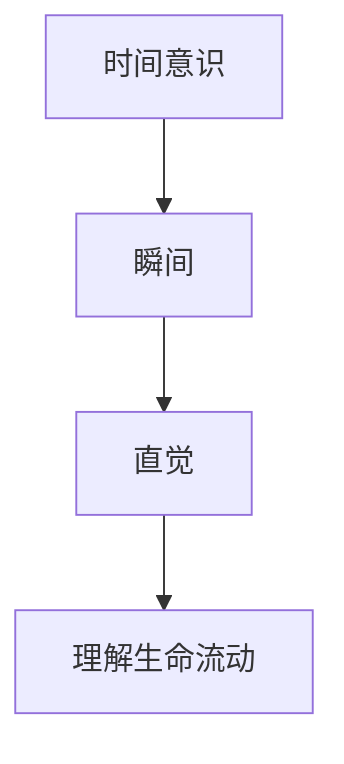

与柏格森不同，维特根斯坦在时间意识上的观点相对简洁。他认为时间是一种感知和经验的结构，而不是内在的流动。维特根斯坦强调逻辑和语言的清晰性，他认为直觉在理解时间方面不是必要的。以下是一个简化的Mermaid流程图，展示维特根斯坦关于时间意识的观点：

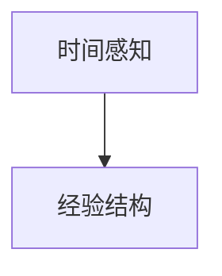

### 语言哲学与逻辑原子主义

在语言哲学方面，柏格森认为语言是一种抽象的工具，它不能完全捕捉到直觉和时间的复杂性。他主张语言的局限性，认为语言只能表达我们已经理解的事物，而无法表达那些无法用语言表达的直觉体验。

维特根斯坦则提出了“语言游戏”理论，认为语言的使用是一种规则游戏，语言的意义在于其使用情境。他强调逻辑和数学的基础性，认为逻辑原子主义能够提供一种清晰的世界观。

以下是一个简化的Mermaid流程图，展示柏格森和维特根斯坦在语言哲学上的观点：

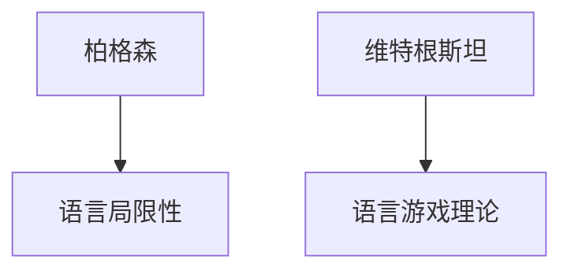

### 比较与联系

通过上述对柏格森和维特根斯坦的基本哲学思想的阐述，我们可以看出两者在时间意识、直觉和语言哲学上存在明显的差异。柏格森强调直觉和时间的内在联系，而维特根斯坦则更关注逻辑和语言的清晰性。

然而，两者也存在一些联系。他们都认识到语言和直觉的复杂性，并试图从不同的角度探索人类理解和感知世界的方式。

综上所述，我们可以通过以下Mermaid流程图总结柏格森和维特根斯坦的核心概念和联系：

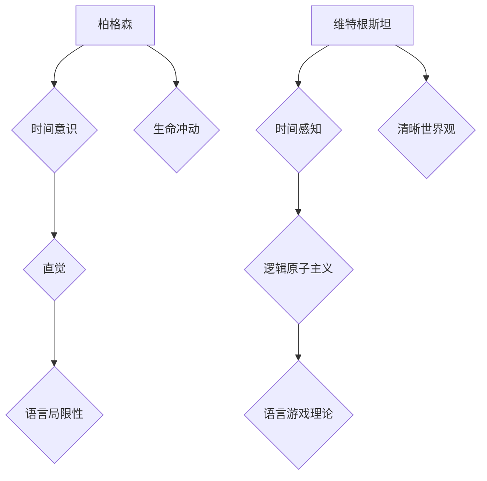

通过以上分析，我们为后续章节的内容打下了坚实的基础，为深入探讨两者的心理哲学观点和影响奠定了基础。接下来，我们将进一步深入分析他们的核心概念，以及这些概念对心理学、哲学和认知科学的影响。

---

### 时间意识：柏格森与维特根斯坦的比较

时间意识是柏格森和维特根斯坦哲学思想中的一个核心概念，两者在这一领域的观点和理论存在显著差异。

**柏格森的时间意识**：

柏格森认为时间不是线性的、均匀流逝的，而是一种内在的、不断变化的“生命冲动”。在他的理论中，时间是一种连续的、不可分割的流动，这种流动是由一系列瞬间构成的，每个瞬间都是独特的、不可复制的。柏格森强调直觉在这一过程中的作用，他认为直觉能够捕捉到时间的内在联系，从而理解生命的流动。

柏格森的这种时间观体现了他的直觉主义哲学，他主张直觉是人类理解世界的关键能力。在他的理论中，直觉不仅是一种感知能力，更是一种认知能力，它能够超越逻辑和语言的局限，直接感知到世界的本质。

以下是一个简化的Mermaid流程图，展示了柏格森关于时间意识的核心概念：

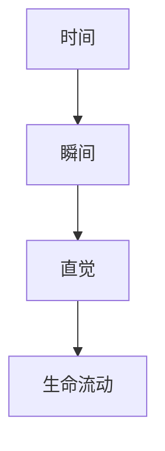

**维特根斯坦的时间意识**：

维特根斯坦对时间的看法则更加简洁和结构化。他认为时间是一种感知和经验的结构，是一种由事件构成的序列。与柏格森不同，维特根斯坦认为时间并不是一种内在的、连续的流动，而是由人类感知和经验构建的。他强调逻辑和数学在理解时间中的基础性作用。

维特根斯坦的时间观体现了他逻辑原子主义的思想，他认为世界是由基本事实构成的，而时间则是这些事实的序列。在这种观点下，时间是一种外在的、客观的存在，它不是直觉的产物，而是人类理解和描述世界的工具。

以下是一个简化的Mermaid流程图，展示了维特根斯坦关于时间意识的核心概念：

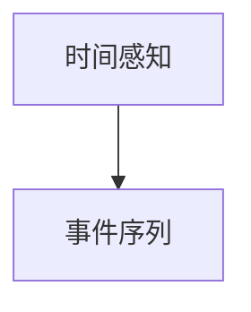

### 比较与联系

通过上述对柏格森和维特根斯坦时间意识的分析，我们可以看出两者在时间观念上的显著差异。柏格森强调时间的内在流动和直觉的作用，而维特根斯坦则更关注时间的结构化和逻辑性。

柏格森的时间意识是一种动态的、连续的过程，强调直觉对时间流动的感知和理解。他的理论为心理学提供了丰富的资源，特别是关于感知和认知过程的研究。柏格森的直觉主义观点也为后来的认知科学和心理学研究提供了理论基础。

维特根斯坦的时间意识则是一种静态的、结构化的过程，强调逻辑和数学在理解时间中的基础性作用。他的逻辑原子主义思想对哲学和数学产生了深远的影响，也为现代计算机科学和人工智能提供了理论基础。

尽管两者在时间观念上存在差异，但他们都认识到时间和直觉的复杂性，并试图从不同的角度探索人类理解和感知时间的方式。这种差异和联系为我们理解时间意识的本质提供了多维度的视角。

### 总结与结论

柏格森和维特根斯坦在时间意识上有着截然不同的观点。柏格森强调直觉和时间内在的连续流动，而维特根斯坦则关注时间的结构化和逻辑性。这两种观点都为我们理解时间的本质提供了深刻的洞见，同时也反映了他们在哲学上的不同追求。

柏格森的直觉主义为心理学和认知科学提供了丰富的理论资源，而维特根斯坦的逻辑原子主义则为哲学和数学奠定了基础。两者都对现代科学技术产生了深远的影响，为我们探索时间和意识的关系提供了多维度的视角。

在接下来的章节中，我们将继续探讨柏格森和维特根斯坦的其他核心概念，如直觉、语言哲学和逻辑原子主义，以及这些概念对心理学、哲学和认知科学的影响。通过逐步深入的分析，我们将进一步理解他们的哲学思想及其在现代科学中的重要性。

---

### 直觉：柏格森与维特根斯坦的比较

直觉在柏格森和维特根斯坦的哲学体系中都占据了重要地位，但他们对于直觉的定义和作用有着不同的理解。

**柏格森的直觉**：

柏格森认为直觉是人类理解世界的关键能力，它超越了逻辑和语言的表达。在他的哲学体系中，直觉是一种直接感知世界的方式，能够捕捉到时间内在的流动和生命的本质。柏格森将直觉视为一种超越理性的认知方式，它不是通过推理和论证得到的，而是通过直接的感知和体验获得的。

柏格森的直觉主义强调直觉在人类认识过程中的作用，他认为直觉能够帮助我们理解那些无法用语言和逻辑表达的复杂现象。在他的理论中，直觉不仅是感知的过程，也是一种认知的过程，它能够直接感知到世界的本质。

以下是一个简化的Mermaid流程图，展示了柏格森关于直觉的核心概念：

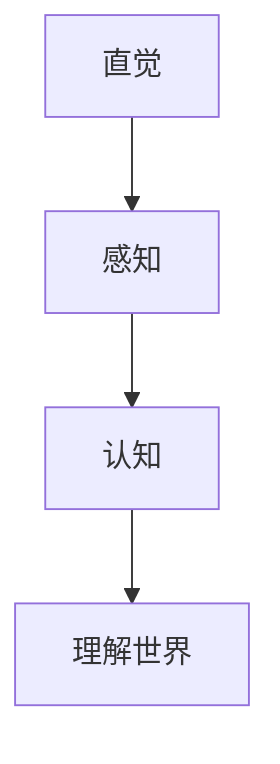

**维特根斯坦的直觉**：

维特根斯坦对直觉的看法则有所不同。他认为直觉是理解逻辑和语言的基础，但直觉本身并不是一种认知过程。在他的哲学体系中，直觉更多地表现为对语言和逻辑的直观理解，它是一种理解语言和逻辑规则的能力，而不是对世界的直接感知。

维特根斯坦强调逻辑和数学在理解直觉中的基础性作用。他认为直觉能够帮助我们理解语言和逻辑的规则，但直觉本身并不是理解世界的唯一方式。在他的理论中，直觉是一种对逻辑和数学的直观理解，而不是对世界的直接感知。

以下是一个简化的Mermaid流程图，展示了维特根斯坦关于直觉的核心概念：

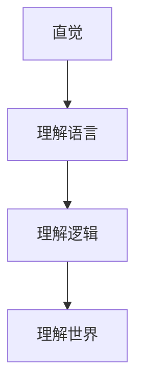

### 比较与联系

通过上述对柏格森和维特根斯坦直觉观点的分析，我们可以看出两者在直觉的理解和作用上存在显著差异。

柏格森强调直觉在感知和认知世界中的核心作用，他认为直觉能够直接感知到时间的流动和生命的本质。柏格森的直觉主义为心理学和认知科学提供了丰富的理论资源，它强调了直觉在人类认知过程中的重要性。

维特根斯坦则将直觉视为理解语言和逻辑规则的基础。他认为直觉能够帮助我们直观地理解逻辑和数学的规则，但直觉本身并不是对世界的直接感知。维特根斯坦的观点为哲学和数学提供了理论基础，强调了逻辑和数学在理解直觉中的基础性作用。

尽管两者在直觉的理解和作用上存在差异，但他们都认识到直觉在人类认知过程中的重要性。柏格森的直觉主义为心理学和认知科学提供了新的视角，而维特根斯坦的直觉理论则为哲学和数学奠定了基础。

### 总结与结论

柏格森和维特根斯坦在直觉的定义和作用上有着不同的观点。柏格森认为直觉是感知和认知世界的关键能力，能够直接感知到时间的流动和生命的本质。维特根斯坦则将直觉视为理解语言和逻辑规则的基础，认为直觉能够帮助我们直观地理解逻辑和数学的规则。

两者的直觉理论都为人类认知提供了重要的视角，但侧重点不同。柏格森的直觉主义为心理学和认知科学提供了丰富的理论资源，而维特根斯坦的直觉理论则为哲学和数学奠定了基础。

在接下来的章节中，我们将继续探讨柏格森和维特根斯坦的其他核心概念，如语言哲学和逻辑原子主义，以及这些概念对心理学、哲学和认知科学的影响。通过逐步深入的分析，我们将进一步理解他们的哲学思想及其在现代科学中的重要性。

---

### 语言哲学：柏格森与维特根斯坦的比较

在语言哲学方面，柏格森和维特根斯坦的观点也存在着显著的区别。

**柏格森的语言哲学**：

柏格森认为语言是一种抽象的工具，它能够帮助我们表达和理解世界，但语言也有其局限性。他强调语言的象征性和比喻性，认为语言无法完全捕捉到直觉和时间的复杂性。柏格森主张语言的象征性，认为语言是通过比喻来传达思想的，这种比喻关系能够帮助我们理解那些无法用语言直接表达的事物。

柏格森的这种观点反映了他对直觉和感知的重视。他认为语言只能表达我们已经理解的事物，而无法表达那些无法用语言表达的直觉体验。因此，柏格森认为语言是一种不完全的、有限的工具，它无法完全捕捉到人类认知的复杂性。

以下是一个简化的Mermaid流程图，展示了柏格森关于语言哲学的核心概念：

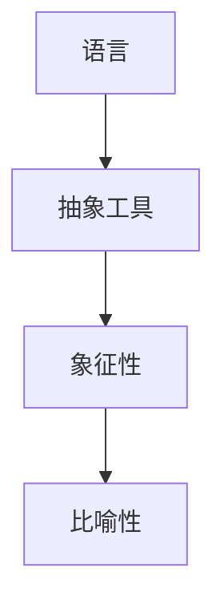

**维特根斯坦的语言哲学**：

维特根斯坦则对语言持有更加结构化和逻辑化的观点。他提出了“语言游戏”理论，认为语言的使用是一种规则游戏，语言的意义在于其使用情境。维特根斯坦强调逻辑和数学在语言中的作用，认为逻辑和数学能够提供一种清晰的世界观。

维特根斯坦区分了“日常语言”和“哲学语言”。他认为日常语言是我们在日常生活中使用的，它的意义是明确的、直观的。而哲学语言则是为了探讨和解决哲学问题而使用的，它的意义是抽象的、复杂的。维特根斯坦主张通过分析哲学语言的规则和使用情境，来解决哲学问题。

以下是一个简化的Mermaid流程图，展示了维特根斯坦关于语言哲学的核心概念：

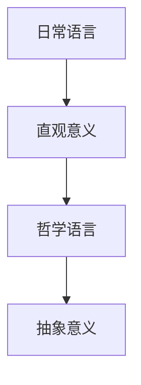

### 比较与联系

通过上述对柏格森和维特根斯坦语言哲学的分析，我们可以看出两者在语言的理解和作用上存在显著差异。

柏格森认为语言是一种抽象的工具，它能够帮助我们表达和理解世界，但语言也有其局限性。他强调语言的象征性和比喻性，认为语言无法完全捕捉到直觉和时间的复杂性。柏格森的观点为心理学和认知科学提供了丰富的理论资源，它强调了直觉在人类认知过程中的重要性。

维特根斯坦则将语言视为一种规则游戏，强调逻辑和数学在语言中的作用。他认为语言的意义在于其使用情境，通过分析哲学语言的规则和使用情境，可以解决哲学问题。维特根斯坦的观点为哲学和数学提供了理论基础，强调了逻辑和数学在理解语言中的基础性作用。

尽管两者在语言哲学上存在差异，但他们都认识到语言在人类认知中的重要性。柏格森的象征性和比喻性观点为心理学和认知科学提供了新的视角，而维特根斯坦的逻辑原子主义则为哲学和数学奠定了基础。

### 总结与结论

柏格森和维特根斯坦在语言哲学上有着不同的观点。柏格森认为语言是一种抽象的工具，它能够帮助我们表达和理解世界，但语言也有其局限性。他强调语言的象征性和比喻性，认为语言无法完全捕捉到直觉和时间的复杂性。

维特根斯坦则将语言视为一种规则游戏，强调逻辑和数学在语言中的作用。他认为语言的意义在于其使用情境，通过分析哲学语言的规则和使用情境，可以解决哲学问题。

两者的语言哲学观点都为我们理解语言的本质和作用提供了重要的视角。柏格森的象征性和比喻性观点为心理学和认知科学提供了新的理论资源，而维特根斯坦的逻辑原子主义则为哲学和数学奠定了基础。

在接下来的章节中，我们将继续探讨柏格森和维特根斯坦的其他核心概念，如逻辑原子主义和心理学的影响，以及这些概念在当代科学中的应用和评价。通过逐步深入的分析，我们将进一步理解他们的哲学思想及其在现代科学中的重要性。

---

### 逻辑原子主义：柏格森的反对观点与维特根斯坦的反对观点

逻辑原子主义是维特根斯坦在《逻辑哲学论》中提出的一个重要理论，它对世界的本质和语言的作用进行了深入探讨。然而，柏格森对逻辑原子主义持有强烈的反对态度。在本节中，我们将分别探讨两位哲学家对逻辑原子主义的观点和反对理由。

**柏格森对逻辑原子主义的反对观点**：

柏格森认为逻辑原子主义过于简化了世界的复杂性。他主张，世界是一个不断变化的过程，这种变化是由内在的生命冲动驱动的。柏格森认为，逻辑原子主义忽视了时间的流动和生命的本质，它只关注静态的事实和逻辑关系。

柏格森强调直觉在理解世界中的作用，他认为逻辑原子主义无法捕捉到直觉所感知到的世界的动态性和复杂性。他批评逻辑原子主义将世界分解为原子式的元素，忽视了这些元素之间的相互作用和整体性。

以下是一个简化的Mermaid流程图，展示了柏格森对逻辑原子主义的反对理由：

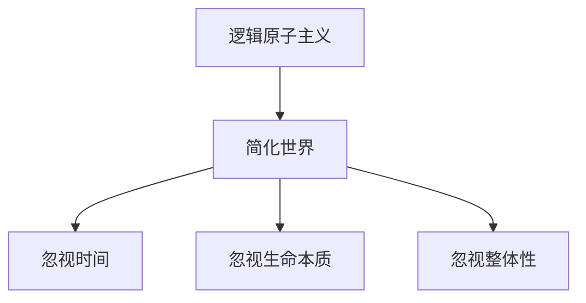

**维特根斯坦对逻辑原子主义的反对观点**：

维特根斯坦在后期哲学作品中对逻辑原子主义进行了自我批判。他认识到逻辑原子主义在解释语言和逻辑方面存在一定的局限性。他认为，逻辑原子主义过于强调逻辑和数学的基础性，忽视了人类经验的多样性和复杂性。

维特根斯坦主张通过“语言游戏”来理解语言的使用情境。他批评逻辑原子主义试图将世界简化为逻辑和数学的框架，而忽视了语言在日常生活中的实际应用。维特根斯坦认为，逻辑原子主义无法完全解释人类经验的丰富性和多样性。

以下是一个简化的Mermaid流程图，展示了维特根斯坦对逻辑原子主义的反对理由：

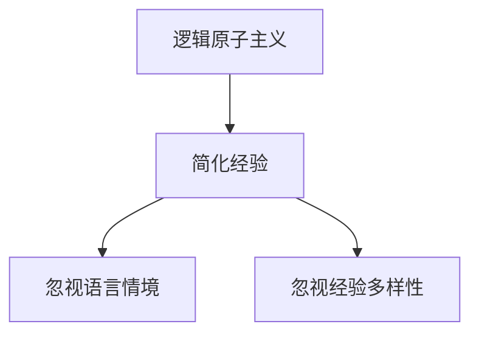

### 比较与联系

柏格森和维特根斯坦在逻辑原子主义上的反对观点存在一定的差异。柏格森强调逻辑原子主义忽视了时间的流动和生命的本质，他认为世界是一个动态的过程，而不是静态的原子集合。柏格森主张通过直觉来理解世界的复杂性，而逻辑原子主义则过于简化了这种复杂性。

维特根斯坦则批评逻辑原子主义忽视了人类经验的多样性和复杂性。他主张通过“语言游戏”来理解语言的使用情境，认为逻辑原子主义无法完全解释人类经验的丰富性。维特根斯坦强调语言在日常生活中的实际应用，而逻辑原子主义则过于注重逻辑和数学的基础性。

尽管两者在反对逻辑原子主义的理由上有所不同，但他们都认为逻辑原子主义在解释世界和理解语言方面存在一定的局限性。这种差异和联系为我们提供了更全面的理解世界和语言的方法。

### 总结与结论

柏格森和维特根斯坦在逻辑原子主义上持有不同的观点。柏格森认为逻辑原子主义过于简化了世界的复杂性，忽视了时间的流动和生命的本质。维特根斯坦则批评逻辑原子主义忽视了人类经验的多样性和复杂性，他认为语言的使用情境和实际应用更为重要。

两者的观点都反映了他们在哲学上的不同追求。柏格森的直觉主义为心理学和认知科学提供了丰富的理论资源，而维特根斯坦的语言哲学则为哲学和数学奠定了基础。

在接下来的章节中，我们将继续探讨柏格森和维特根斯坦的心理哲学观点，以及这些观点对心理学、哲学和认知科学的影响。通过逐步深入的分析，我们将进一步理解他们的哲学思想及其在现代科学中的重要性。

---

### 意识的本质：柏格森与维特根斯坦的比较

在探讨意识的本质方面，柏格森和维特根斯坦有着不同的哲学立场和观点。他们的理论不仅揭示了意识的不同层面，也为心理学和哲学的发展提供了重要的视角。

**柏格森对意识本质的看法**：

柏格森认为意识是一种流动的、不可分割的体验，它是一种内在的生命冲动。他提出了“时间意识”这一概念，认为意识是通过对时间瞬间的感知和体验来理解世界的。柏格森强调直觉在意识中的作用，认为直觉能够捕捉到时间流动中的细微变化，从而形成对世界的深刻理解。

柏格森的哲学体系中，意识被视为一种连续的过程，而不是一系列孤立的事件。他认为意识是一个动态的、不断发展的过程，它反映了生命的本质和内在的连续性。以下是一个简化的Mermaid流程图，展示了柏格森对意识本质的观点：

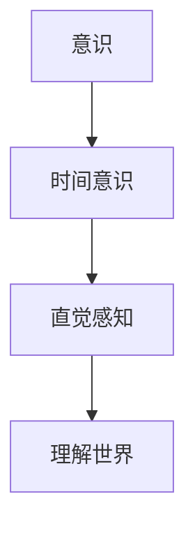

**维特根斯坦对意识本质的看法**：

维特根斯坦则对意识持有更加分析性的观点。他区分了“感觉”和“意识”，认为感觉是直接的、个体的体验，而意识则是这些感觉的整体结构。维特根斯坦强调逻辑和语言在理解意识中的作用，他认为意识是通过语言和逻辑来描述和理解的。

维特根斯坦提出了“感知”和“语言”之间的关系，他认为意识是通过感知和语言来构建的。他主张通过分析感知和语言的结构，可以理解意识的本质。以下是一个简化的Mermaid流程图，展示了维特根斯坦对意识本质的观点：

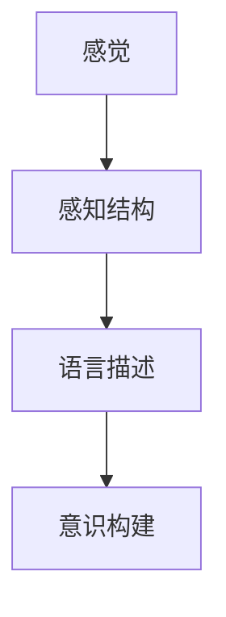

### 比较与联系

通过上述对柏格森和维特根斯坦关于意识本质的分析，我们可以看出两者在观点上的差异。柏格森强调意识的流动性和直觉的作用，认为意识是一个动态的过程，它反映了生命的本质和内在的连续性。维特根斯坦则强调逻辑和语言在理解意识中的作用，认为意识是通过感知和语言来构建的。

柏格森的直觉主义为心理学提供了丰富的理论资源，它强调了直觉在人类认知和意识形成中的作用。维特根斯坦的分析性观点则为哲学和认知科学提供了重要的视角，通过分析感知和语言的结构，我们可以更好地理解意识的本质。

尽管两者在意识本质的理解上存在差异，但他们都认识到意识在人类认知和哲学思考中的重要性。柏格森的直觉主义为心理学提供了新的视角，而维特根斯坦的分析性观点则为哲学和认知科学奠定了基础。

### 总结与结论

柏格森和维特根斯坦在意识本质问题上持有不同的观点。柏格森强调意识的流动性和直觉的作用，认为意识是一个动态的过程，它反映了生命的本质和内在的连续性。维特根斯坦则强调逻辑和语言在理解意识中的作用，认为意识是通过感知和语言来构建的。

两者的观点为我们提供了理解意识本质的不同视角。柏格森的直觉主义为心理学提供了丰富的理论资源，而维特根斯坦的分析性观点则为哲学和认知科学奠定了基础。他们的理论不仅丰富了心理哲学的研究，也为当代科学提供了重要的启示。

在接下来的章节中，我们将继续探讨柏格森和维特根斯坦在行为描述和心理过程方面的观点，以及这些观点对心理学、哲学和认知科学的影响。通过逐步深入的分析，我们将进一步理解他们的哲学思想及其在现代科学中的重要性。

---

### 行为描述：柏格森与维特根斯坦的比较

在行为描述方面，柏格森和维特根斯坦的观点同样展现出显著的差异。他们的理论不仅反映了他们对人类行为的不同理解，也为心理学和行为科学提供了不同的理论框架。

**柏格森对行为描述的观点**：

柏格森认为，行为是生命冲动在个体层面的表现。他强调行为是一种内在生命力的外在表达，这种行为不仅仅是对外界刺激的机械反应，而是一种整体性的生命体验。柏格森的行为描述注重行为的连贯性和动态性，他认为行为是连续的、不断变化的过程。

柏格森主张，行为不仅仅是外部动作的集合，它还包含了内在的感受、情感和认知过程。他的理论强调行为的主观体验和内在驱动力，认为行为是生命力的外在表现，而不是简单的刺激-反应机制。以下是一个简化的Mermaid流程图，展示了柏格森对行为描述的核心观点：

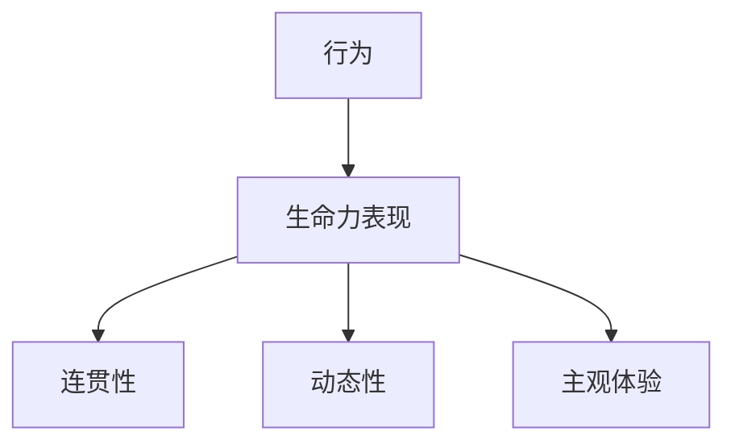

**维特根斯坦对行为描述的观点**：

维特根斯坦则对行为持有一种更加分析性的态度。他主张行为是通过一系列规则和逻辑结构来描述的，这些规则和结构构成了人类行为的框架。维特根斯坦强调行为的社会性和规则性，他认为行为是在特定情境下通过语言和逻辑来理解和描述的。

维特根斯坦区分了“物理行为”和“行为规则”。他认为物理行为是行为的外在表现，而行为规则则是行为内在的构成要素。他主张通过分析行为规则来理解人类行为，而不是仅仅关注行为的外部表现。以下是一个简化的Mermaid流程图，展示了维特根斯坦对行为描述的核心观点：

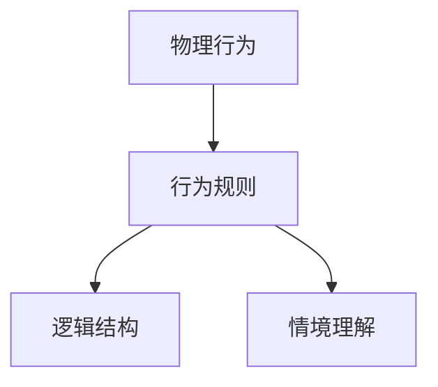

### 比较与联系

通过上述对柏格森和维特根斯坦行为描述的分析，我们可以看出两者在行为理解上存在显著差异。柏格森强调行为的连贯性、动态性和主观体验，认为行为是生命力的外在表现。维特根斯坦则强调行为的社会性和规则性，主张通过分析行为规则来理解人类行为。

柏格森的行为描述为心理学提供了丰富的理论资源，特别是关于内在驱动力和主观体验的研究。维特根斯坦的行为描述则为哲学和认知科学提供了重要的视角，强调了逻辑和规则在理解人类行为中的重要性。

尽管两者在行为描述上存在差异，但他们都认识到行为在人类认知和社会互动中的重要性。柏格森的动态行为描述为心理学提供了新的视角，而维特根斯坦的规则性描述则为哲学和认知科学奠定了基础。

### 总结与结论

柏格森和维特根斯坦在行为描述方面持有不同的观点。柏格森强调行为的连贯性、动态性和主观体验，认为行为是生命力的外在表现。维特根斯坦则强调行为的社会性和规则性，主张通过分析行为规则来理解人类行为。

两者的行为描述观点为我们提供了理解人类行为的多元视角。柏格森的动态行为描述为心理学提供了丰富的理论资源，而维特根斯坦的规则性描述则为哲学和认知科学奠定了基础。他们的理论不仅丰富了心理哲学的研究，也为当代科学提供了重要的启示。

在接下来的章节中，我们将继续探讨柏格森和维特根斯坦在心理过程方面的观点，以及这些观点对心理学、哲学和认知科学的影响。通过逐步深入的分析，我们将进一步理解他们的哲学思想及其在现代科学中的重要性。

---

### 心理过程：柏格森与维特根斯坦的比较

在心理过程的探讨上，柏格森和维特根斯坦的观点同样存在显著差异。他们的理论不仅反映了他们在心理学上的不同视角，也为我们理解心理过程的复杂性提供了不同的路径。

**柏格森对心理过程的观点**：

柏格森认为，心理过程是一种连续的、动态的变化，这种变化是由内在的生命冲动驱动的。他强调心理过程的整体性和连贯性，认为心理活动是一个不断流动的过程，而不是一系列孤立的事件。柏格森主张，心理过程不仅仅是感知和认知的过程，它还包含了情感、欲望和意志等更深层次的心理体验。

柏格森提出了“直觉”作为理解心理过程的关键，他认为直觉能够捕捉到心理过程内在的连续性和动态性。在他的理论中，心理过程不是线性的，而是一个不断展开的、动态的流程，这种流程反映了生命的本质和内在的连贯性。以下是一个简化的Mermaid流程图，展示了柏格森对心理过程的核心观点：

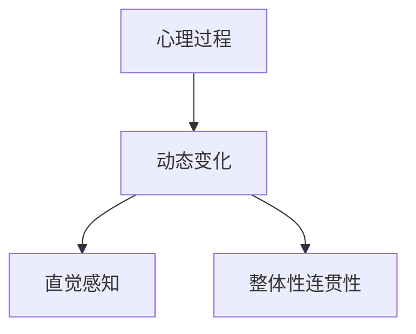

**维特根斯坦对心理过程的观点**：

维特根斯坦则对心理过程持有一种更加分析性和结构化的观点。他强调心理过程是通过对感知和经验的逻辑分析来理解的。维特根斯坦认为，心理过程是由一系列规则和逻辑结构构成的，这些规则和结构构成了人类心理活动的基本框架。

维特根斯坦区分了“感觉”和“心理过程”。他认为感觉是直接的、个体的体验，而心理过程则是感觉的综合和解释。他主张通过分析感觉和经验的结构，可以理解心理过程的本质。维特根斯坦强调逻辑和语言在理解心理过程中的作用，他认为心理过程是可以通过逻辑和语言来描述和解释的。以下是一个简化的Mermaid流程图，展示了维特根斯坦对心理过程的核心观点：

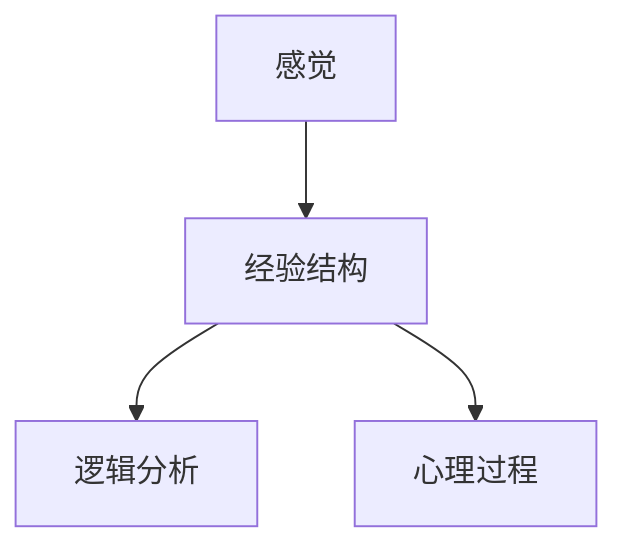

### 比较与联系

通过上述对柏格森和维特根斯坦心理过程观点的分析，我们可以看出两者在心理过程理解上存在显著差异。柏格森强调心理过程的动态性和整体性，认为心理过程是一个连续的、动态的流程，这种流程反映了生命的本质和内在的连贯性。维特根斯坦则强调心理过程的结构化和逻辑性，他认为心理过程是通过对感知和经验的逻辑分析来理解的。

柏格森的心理过程描述为心理学提供了新的视角，特别是关于心理连续性和动态性的研究。他的直觉主义为心理学提供了丰富的理论资源。维特根斯坦的心理过程描述则为哲学和认知科学提供了重要的基础，强调了逻辑和语言在理解心理过程中的重要性。

尽管两者在心理过程理解上存在差异，但他们都认识到心理过程在人类认知和情感体验中的重要性。柏格森的直觉主义为心理学提供了新的视角，而维特根斯坦的逻辑分析则为哲学和认知科学奠定了基础。他们的理论不仅丰富了心理哲学的研究，也为当代科学提供了重要的启示。

### 总结与结论

柏格森和维特根斯坦在心理过程的探讨上持有不同的观点。柏格森强调心理过程的动态性和整体性，认为心理过程是一个连续的、动态的流程，这种流程反映了生命的本质和内在的连贯性。维特根斯坦则强调心理过程的结构化和逻辑性，他认为心理过程是通过对感知和经验的逻辑分析来理解的。

两者的观点为我们提供了理解心理过程的多元视角。柏格森的动态过程描述为心理学提供了新的理论资源，而维特根斯坦的结构化描述则为哲学和认知科学奠定了基础。他们的理论不仅丰富了心理哲学的研究，也为当代科学提供了重要的启示。

在接下来的章节中，我们将进一步探讨柏格森和维特根斯坦在心理学、哲学和认知科学中的影响，以及他们的理论对当代科学研究的启示。通过逐步深入的分析，我们将更全面地理解他们的哲学思想及其在现代科学中的重要性。

---

### 影响与评价：柏格森与维特根斯坦在心理学、哲学和认知科学中的贡献

在心理学、哲学和认知科学领域，柏格森和维特根斯坦的哲学思想都产生了深远的影响，并对当代科学研究产生了重要的启示。

**柏格森在心理学中的影响**：

柏格森的哲学思想对心理学的发展产生了重要影响，特别是在认知心理学和直觉心理学领域。他的“时间意识”和“直觉”概念为心理学家提供了理解人类感知和认知过程的新视角。柏格森强调直觉在人类认知中的作用，认为直觉是人类理解世界的关键能力。这一观点促进了认知心理学对直觉和感知的研究，如吉尔伯特（M. J. Gilbert）的“直觉思维”理论和卡斯蒂廖尼（G. Castelli）的“直觉推理”研究。

此外，柏格森的“动态过程”理论也为心理学提供了新的方法论。例如，诺曼（D. A. Norman）在其著作《认知心理学》中提到了柏格森的理论，并将其应用于设计心理学和用户体验研究中。柏格森的思想还影响了皮亚杰（Jean Piaget）的认知发展理论，皮亚杰在其研究中强调了儿童认知过程中的“建构”和“适应”机制，这与柏格森对直觉和感知的理解有相似之处。

**柏格森在哲学中的影响**：

柏格森的哲学思想对当代哲学产生了深远的影响，特别是在现象学和存在主义领域。他的“直觉主义”和“生命冲动”理论为现象学提供了重要的哲学资源，影响了胡塞尔（Edmund Husserl）和海德格尔（Martin Heidegger）等哲学家。

柏格森的存在主义思想也对当代哲学产生了重要影响，如萨特（Jean-Paul Sartre）和加缪（Albert Camus）等存在主义哲学家都受到了柏格森的影响。萨特在其著作《存在与虚无》中提到了柏格森的时间意识理论，并将其应用于存在主义哲学中，探讨了人类存在的自由和责任。

**维特根斯坦在心理学中的影响**：

维特根斯坦的哲学思想对心理学的影响主要表现在语言哲学和心理语言学领域。他的“语言游戏”理论为心理语言学研究提供了重要的方法论，如卡尔纳普（Rudolf Carnap）和赖尔（Gilbert Ryle）等语言哲学家都受到了维特根斯坦的影响。

维特根斯坦的“逻辑原子主义”观点也对心理学产生了影响，特别是在认知心理学和计算机科学领域。例如，图灵（Alan Turing）的图灵机理论和人工智能的研究就受到了维特根斯坦逻辑哲学的启发。现代计算机科学中的许多基本概念，如算法、逻辑门和编程语言，都可以追溯到维特根斯坦的思想。

**维特根斯坦在哲学中的影响**：

维特根斯坦的哲学思想对当代哲学产生了深远的影响，特别是在分析哲学和语言哲学领域。他的早期作品《逻辑哲学论》对逻辑和数学的基础进行了深入探讨，为分析哲学的发展奠定了基础。后来的《哲学研究》则对日常语言的使用和哲学问题的本质进行了深刻反思，推动了日常语言哲学的发展。

维特根斯坦的思想对现象学和现象学心理学也产生了重要影响，如胡塞尔和梅洛-庞蒂（Maurice Merleau-Ponty）等哲学家都受到了维特根斯坦的影响。现象学心理学中的“感知现象学”和“动作现象学”都借鉴了维特根斯坦的思想，探讨了感知和行为之间的关系。

**总结与评价**：

柏格森和维特根斯坦在心理学、哲学和认知科学中的贡献是不可忽视的。他们的哲学思想不仅丰富了这些学科的理论基础，也为当代科学研究提供了重要的启示。

柏格森的直觉主义和心理动力学理论为心理学提供了新的视角，维特根斯坦的语言哲学和逻辑原子主义则为哲学和认知科学奠定了基础。他们的理论在当代科学研究中仍然具有重要的应用价值，促进了跨学科的研究和对话。

在评价他们的哲学思想时，我们可以看到，柏格森和维特根斯坦虽然在对时间和意识的理解上存在差异，但他们都关注人类感知和理解世界的复杂性。他们的思想为我们提供了理解人类认知和行为的多维度视角，丰富了心理哲学的研究内容。

随着科学技术的不断发展，柏格森和维特根斯坦的哲学思想将继续在心理学、哲学和认知科学中发挥作用，为未来的研究提供重要的理论基础和启示。

---

### 应用与影响：柏格森与维特根斯坦的心理哲学对当代认知科学的启示

柏格森和维特根斯坦的心理哲学思想对当代认知科学产生了深远的影响，特别是在认知心理学、人工智能和神经科学领域。他们的理论不仅为这些学科提供了重要的理论框架，还为实际研究和应用提供了深刻的启示。

**柏格森对认知心理学的影响**：

柏格森的直觉主义和心理动力学理论为认知心理学提供了新的视角。他强调直觉在人类认知中的作用，认为直觉是人类理解世界的关键能力。这一观点促进了认知心理学对直觉思维和感知过程的研究。

例如，吉尔伯特的“直觉思维”理论受到了柏格森直觉主义的影响。吉尔伯特认为，直觉思维是人类在快速、不确定的环境中做出决策的重要机制。他提出了“直觉感知”模型，探讨了直觉在视觉感知中的作用。这一理论在认知心理学中得到了广泛的应用，例如在视觉搜索、快速分类和决策研究中。

此外，柏格森的心理动力学理论也为认知心理学提供了方法论上的启示。例如，诺曼在其《认知心理学》一书中提到了柏格森的思想，并将其应用于设计心理学和用户体验研究中。诺曼提出了“认知工作空间”模型，探讨了认知资源在信息处理过程中的作用。这一模型为认知心理学研究提供了新的理论工具。

**维特根斯坦对认知科学的影响**：

维特根斯坦的语言哲学和逻辑原子主义对认知科学产生了重要影响，特别是在人工智能和计算机科学领域。他的“语言游戏”理论为人工智能提供了重要的方法论和理论框架。

图灵机的发明者艾伦·图灵受到了维特根斯坦逻辑原子主义的影响。图灵在《计算机与智能》一文中提出了“通用计算机”概念，即图灵机。他认为，计算机可以模拟人类的思维过程，从而实现人工智能。这一理论为人工智能的发展奠定了基础。

此外，维特根斯坦的“逻辑原子主义”观点也为计算机科学提供了理论基础。逻辑原子主义强调逻辑和数学在理解世界中的作用，这与计算机科学的逻辑和数学基础密切相关。现代计算机科学中的许多基本概念，如算法、逻辑门和编程语言，都可以追溯到维特根斯坦的思想。

**柏格森和维特根斯坦对神经科学的影响**：

柏格森和维特根斯坦的哲学思想也为神经科学提供了重要的启示，特别是在神经心理学和认知神经科学领域。

柏格森的“时间意识”理论为神经心理学提供了新的视角。神经心理学家如吉尔伯特·雷兹尼克（Gilbert Ricard）等人探讨了时间感知和直觉思维在神经认知中的作用。雷兹尼克的研究表明，大脑中的神经元活动与时间感知和直觉思维密切相关。这一发现为神经心理学研究提供了新的理论基础。

维特根斯坦的“语言哲学”也为神经科学提供了重要的启示。神经科学家如安吉拉·达马西奥（Antonio Damasio）等人研究了情感、意识和决策在神经认知中的作用。达马西奥提出了“情感智能”理论，认为情感是决策过程的重要组成部分。他的研究受到了维特根斯坦语言哲学的启发，强调了情感和语言在认知过程中的相互作用。

**总结与评价**：

柏格森和维特根斯坦的心理哲学思想为当代认知科学提供了丰富的理论资源和启示。他们的直觉主义、心理动力学和语言哲学为认知心理学、人工智能和神经科学提供了新的研究视角和方法。

柏格森的直觉主义强调了直觉在人类认知中的作用，为认知心理学提供了新的理论框架。维特根斯坦的逻辑原子主义和语言哲学为人工智能和计算机科学提供了理论基础，推动了人工智能的发展。

随着认知科学的不断进步，柏格森和维特根斯坦的哲学思想将继续在认知心理学、人工智能和神经科学中发挥作用，为未来的研究提供重要的理论基础和启示。他们的理论不仅丰富了认知科学的研究内容，也为理解人类认知和行为提供了深刻的洞见。

---

### 拓展阅读：深入探讨柏格森与维特根斯坦的心理哲学

对于希望进一步深入研究柏格森与维特根斯坦心理哲学的读者，以下是一些推荐书籍和学术论文，这些资源将为读者提供更加深入和丰富的理解。

**柏格森的相关书籍**：

1. **《时间与自由》（Time and Free Will）**：这是柏格森的代表作之一，详细探讨了时间意识、自由意志和直觉等问题。
2. **《生命的矛盾》（The Mind of the创造性作家》（Creative Mind）**：该书探讨了创造力的本质，以及柏格森对艺术和文学的看法。
3. **《形而上学导论》（Introduction to Metaphysics）**：柏格森在这本书中探讨了存在的本质、时空问题等哲学问题。

**维特根斯坦的相关书籍**：

1. **《逻辑哲学论》（Tractatus Logico-Philosophicus）**：维特根斯坦的早期作品，以逻辑原子主义为基础，探讨了语言、逻辑和现实之间的关系。
2. **《哲学研究》（Philosophical Investigations）**：维特根斯坦晚期的作品，通过对话的形式探讨了语言、思想和现实之间的关系，是对早期作品的扩展和深化。
3. **《文化与价值》（Culture and Value）**：这本书收录了维特根斯坦后期的一些演讲和讨论，反映了他在哲学和文化领域的思考。

**相关学术论文**：

1. **“Bergson and the Origins of Cognitive Science”**：该论文探讨了柏格森的思想如何影响认知科学的发展，特别是他对直觉和心理过程的理解。
2. **“Wittgenstein and the Philosophy of Mind”**：该论文探讨了维特根斯坦的哲学思想对心灵哲学的贡献，特别是他的语言哲学观点。
3. **“Bergson and Wittgenstein on Time and Mind”**：该论文对比了柏格森和维特根斯坦在时间意识和心灵哲学上的观点，提供了深入的学术探讨。

**实用资源**：

1. **在线课程**：许多在线教育平台提供了关于柏格森和维特根斯坦的哲学课程，如Coursera、edX等。
2. **哲学论坛和社区**：加入哲学论坛和在线社区，如Philosophy Stack Exchange，可以与其他哲学爱好者交流观点，深入探讨相关议题。

通过阅读这些书籍、学术论文和参与在线资源，读者可以更全面地了解柏格森和维特根斯坦的哲学思想，以及这些思想对心理学、哲学和认知科学的影响。这不仅有助于深化对两位哲学家的理解，也为自己的学术研究和思考提供了宝贵的资源。

---

### 小结与展望

在本文中，我们深入探讨了柏格森与维特根斯坦的心理哲学，详细分析了他们的时间意识、直觉、语言哲学和逻辑原子主义等核心概念。通过逐步分析，我们发现了两位哲学家在心理学、哲学和认知科学领域的贡献及其对当代科学研究的启示。

柏格森的直觉主义和心理动力学理论为认知心理学提供了新的视角，而维特根斯坦的语言哲学和逻辑原子主义为人工智能和计算机科学奠定了基础。他们的理论不仅丰富了心理哲学的研究内容，也为理解人类认知和行为提供了深刻的洞见。

未来研究可以进一步探索柏格森和维特根斯坦的理论在新兴领域，如神经科学、认知神经科学和跨学科研究中的应用。同时，可以通过跨文化比较研究，探讨不同文化背景下两位哲学思想的传播和影响。

通过持续的研究和探讨，我们有望更全面地理解柏格森和维特根斯坦的哲学思想，为心理学、哲学和认知科学的未来发展提供新的理论资源和实践指导。

