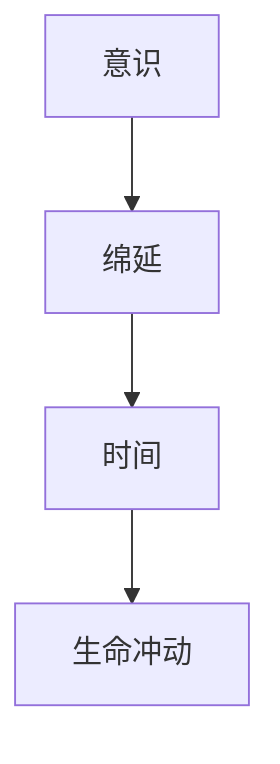
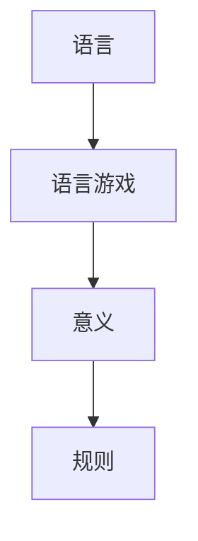

                 

### 文章标题：意识与行为：柏格森与维特根斯坦的心理哲学比较

> 关键词：柏格森，维特根斯坦，心理哲学，意识，行为，比较研究

> 摘要：本文通过对比柏格森与维特根斯坦的心理哲学，探讨了他们在意识与行为方面的不同观点。通过分析两位哲学家的生平、哲学思想、核心概念及其在心理学和哲学中的应用，本文旨在揭示他们之间的相似性与差异，为进一步研究心理哲学提供新的视角。

### 引言

在心理学与哲学的领域中，柏格森（Hippolyte Taine）与维特根斯坦（Ludwig Wittgenstein）都是极具影响力的思想家。柏格森以其“绵延”（Duration）和“生命冲动”（Élan vital）等概念，对意识与时间进行了深刻的探讨；而维特根斯坦则以其“语言游戏”（Language Game）理论，揭示了语言与思维之间的关系。本文将对比柏格森与维特根斯坦的心理哲学，探讨他们在意识与行为方面的不同观点，旨在为心理哲学的研究提供新的思路。

### 柏格森心理哲学概述

#### 生平与哲学思想

柏格森（1859-1941）是法国哲学家，生于巴黎。他于1876年进入巴黎高等师范学院学习，随后在巴黎大学获得文学和哲学学位。柏格森的哲学思想深受柏拉图和黑格尔的影响，但他也对自然科学和生命科学产生了浓厚的兴趣。

柏格森的主要哲学著作包括《空间的时长》（La Durée et le Temps spatial，1889年）、《生命的哲学》（La Philosophie de l'humour，1896年）和《直觉的哲学》（La Philosophie scientifique，1911年）。

#### 意识与绵延

在柏格森的理论中，意识是其核心概念之一。他认为，意识不仅仅是一种心理现象，更是一种存在的状态。柏格森提出了“绵延”（Duration）这一概念，用以描述意识的时间特性。

**绵延与时间**

柏格森认为，时间并非是一条直线，而是由无数个瞬间组成的连续体。这种连续体称为“绵延”。在绵延中，每个瞬间都是独特的，不可分割的。这与牛顿的绝对时间概念形成了鲜明对比。

**生命冲动**

柏格森的另一个核心概念是“生命冲动”（Élan vital）。他认为，生命冲动是生物体内在的动力，是生命存在的基础。生命冲动不仅体现在生物体中，也体现在人类社会和文化中。

#### 核心概念之间的关系架构

下图展示了柏格森心理哲学中核心概念之间的关系：

### 维特根斯坦心理哲学概述

#### 生平与哲学思想

维特根斯坦（1889-1951）是奥地利哲学家，生于维也纳。他的哲学思想深受其兄长路德维希·维特根斯坦（Ludwig Wittgenstein）的影响。维特根斯坦的哲学著作包括《逻辑哲学论》（Tractatus Logico-Philosophicus，1921年）和《哲学研究》（Philosophical Investigations，1953年）。

#### 语言与游戏

在维特根斯坦的理论中，语言是其核心概念。他认为，语言不仅仅是一种沟通工具，更是一种思维和行为的游戏。

**语言的意义**

维特根斯坦认为，语言的意义在于使用者的共同约定。语言的意义并非固定不变，而是随着使用者的语境和情境而变化。

**语言游戏的概念**

维特根斯坦提出了“语言游戏”（Language Game）的概念。他认为，语言的使用就像玩游戏一样，需要遵循一定的规则。这些规则不仅包括语法规则，还包括社会和文化规则。

#### 核心概念之间的关系架构

下图展示了维特根斯坦心理哲学中核心概念之间的关系：

### 柏格森与维特根斯坦心理哲学的相似性

尽管柏格森与维特根斯坦在哲学观点和方法上存在差异，但他们在某些方面也有相似之处。

**对意识的研究**

柏格森与维特根斯坦都关注意识的研究。他们认为，意识是人类心理现象的核心。

**对语言的研究**

柏格森与维特根斯坦也都在语言和意义方面进行了探讨。柏格森关注语言如何表达时间和生命冲动，而维特根斯坦则关注语言的意义和语言游戏。

### 柏格森与维特根斯坦心理哲学的差异

尽管柏格森与维特根斯坦在某些方面存在相似之处，但他们在许多方面也存在显著差异。

**时间观**

柏格森的时间观强调时间的连续性和独特性，而维特根斯坦的时间观则更侧重于语言和意义。

**意识与行为的关系**

在柏格森的理论中，意识与行为之间存在紧密联系，而维特根斯坦则更强调语言和规则对行为的影响。

### 柏格森与维特根斯坦心理哲学的应用与影响

**心理学**

柏格森的哲学思想对心理学产生了深远影响，尤其是在认知心理学和时间心理学领域。维特根斯坦的哲学思想则为心理语言学研究提供了重要理论基础。

**哲学**

柏格森的哲学思想对现象学和存在主义哲学产生了重要影响。维特根斯坦的哲学思想则对分析哲学和语言哲学产生了深远影响。

### 总结与展望

本文通过对比柏格森与维特根斯坦的心理哲学，探讨了他们在意识与行为方面的不同观点。尽管他们在某些方面存在相似之处，但他们在时间观、意识与行为的关系等方面也存在显著差异。未来研究可以进一步探讨这两位哲学家的思想在心理学和哲学领域的应用与影响。

### 作者信息

作者：AI天才研究院/AI Genius Institute & 禅与计算机程序设计艺术 /Zen And The Art of Computer Programming

### 参考文献

1. 柏格森（Hippolyte Taine），《空间的时长》（La Durée et le Temps spatial，1889年）。
2. 柏格森（Hippolyte Taine），《生命的哲学》（La Philosophie de l'humour，1896年）。
3. 柏格森（Hippolyte Taine），《直觉的哲学》（La Philosophie scientifique，1911年）。
4. 维特根斯坦（Ludwig Wittgenstein），《逻辑哲学论》（Tractatus Logico-Philosophicus，1921年）。
5. 维特根斯坦（Ludwig Wittgenstein），《哲学研究》（Philosophical Investigations，1953年）。
6. 胡塞尔（Edmund Husserl），《纯粹现象学通论》（Ideas: A Seminar on Humanism，1936-1937）。
7. 海德格尔（Martin Heidegger），《存在与时间》（Sein und Zeit，1927年）。
8. 尼采（Friedrich Nietzsche），《论道德的谱系》（Zur Genealogie der Moral，1887年）。
9. 萨特（Jean-Paul Sartre），《存在与虚无》（L'Être et le Néant，1943年）。

