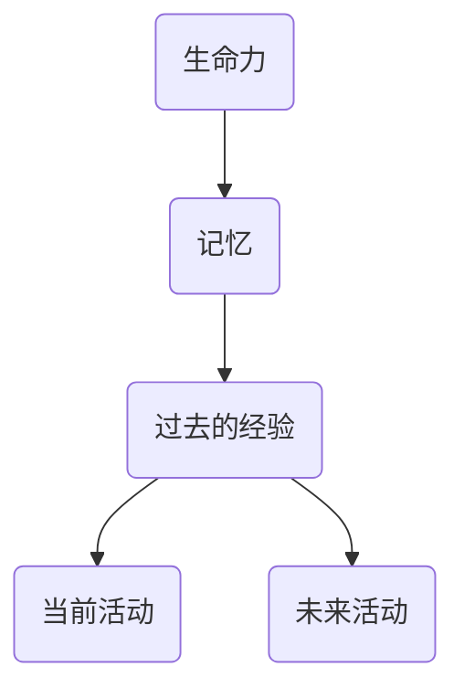
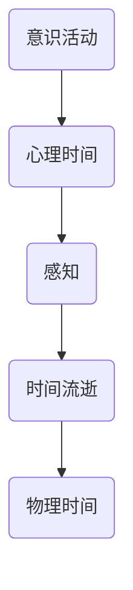
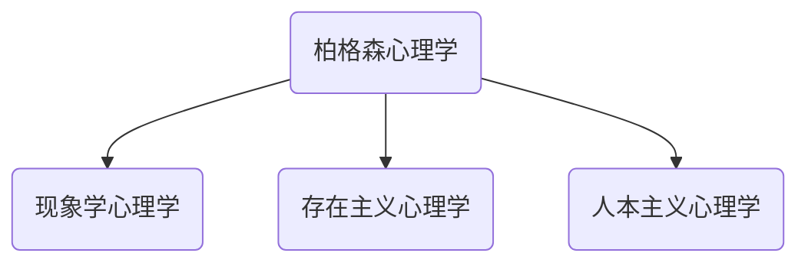
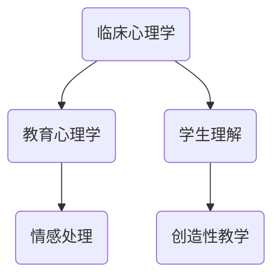
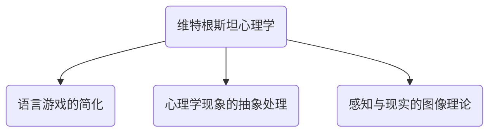
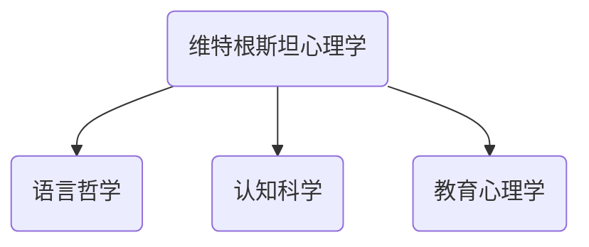
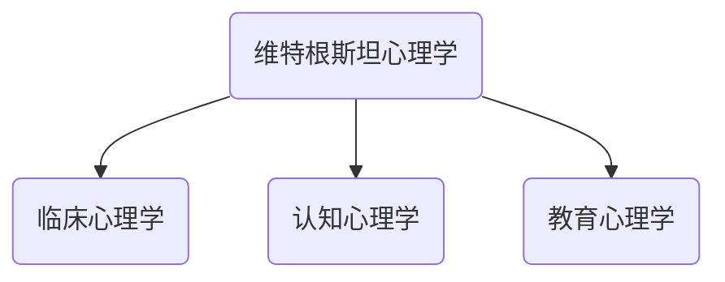
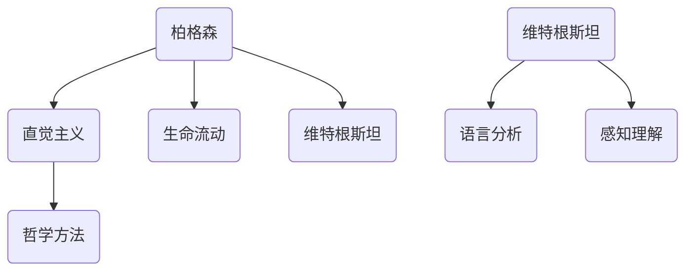
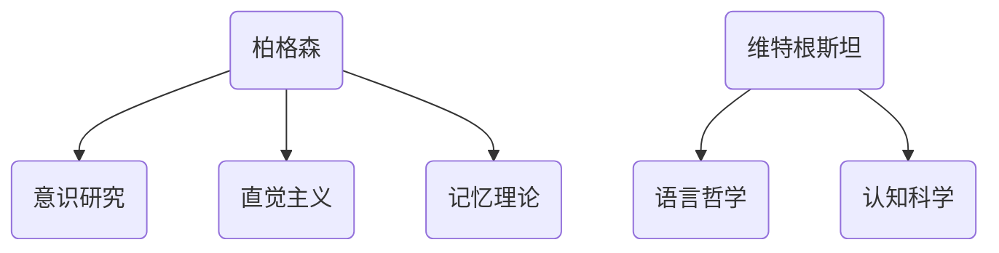
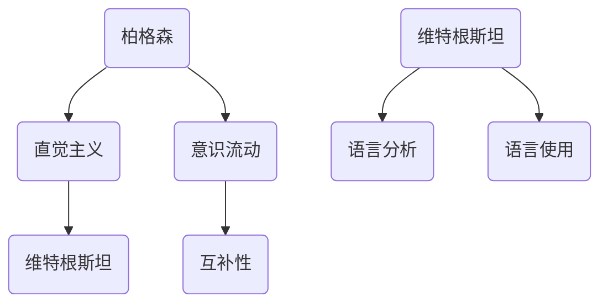

                 

### 文章标题：意识与行为：柏格森与维特根斯坦的心理学观点

> **关键词：柏格森，维特根斯坦，心理学，意识，行为，哲学，直觉主义，图像理论**

> **摘要：本文通过对柏格森和维特根斯坦两位哲学家的心理学观点的深入探讨，分析了他们关于意识与行为的独特见解，探讨了其哲学思想对现代心理学的影响。文章旨在提供一个逻辑清晰、结构紧凑的解析，帮助读者理解这两位哲学家的心理学理论，并探讨其在当代心理学研究中的应用。**

## 目录

### 第一部分：柏格森的心理学观点

#### 第1章：引言

##### 1.1 柏格森的生平与哲学思想

##### 1.2 意识与生命的流动

#### 第2章：柏格森的心理学理论

##### 2.1 意识的连续性与突变

##### 2.2 生命力和记忆

##### 2.3 意识与时间

#### 第3章：柏格森心理学的影响与应用

##### 3.1 柏格森心理学对其他心理学派的影响

##### 3.2 柏格森心理学的应用

### 第二部分：维特根斯坦的心理学观点

#### 第4章：引言

##### 4.1 维特根斯坦的生平与哲学思想

##### 4.2 语言、意义与哲学

#### 第5章：维特根斯坦的心理学理论

##### 5.1 图像理论与感知

##### 5.2 行为主义与逻辑原子主义

##### 5.3 日常语言与哲学治疗

#### 第6章：维特根斯坦心理学的批判与影响

##### 6.1 维特根斯坦心理学的批判

##### 6.2 维特根斯坦心理学的影响

##### 6.3 维特根斯坦心理学在当代的应用

### 第三部分：比较与综合

#### 第7章：柏格森与维特根斯坦心理学观点的比较

##### 7.1 基本理念的比较

##### 7.2 两者对心理学的贡献

##### 7.3 柏格森与维特根斯坦心理学的互补性

#### 第8章：总结与展望

##### 8.1 柏格森与维特根斯坦心理学的重要性

##### 8.2 未来研究方向

---

### 第一部分：柏格森的心理学观点

#### 第1章：引言

##### 1.1 柏格森的生平与哲学思想

亨利·柏格森（Henri Bergson）是20世纪初法国著名的哲学家、社会学家和文学家。他于1859年出生在巴黎，其哲学思想深受其个人经历和当时社会环境的影响。柏格森的哲学思想主要围绕生命、意识、时间和自由意志等核心概念展开，其作品包括《笑》（Laughter）、《生命的创造力》（Creative Evolution）、《意识的直接材料》（The直接材料of Consciousness）等。

柏格森认为，生命是一种持续的创造力，是社会和文化进步的根本动力。他的哲学思想对现代心理学产生了深远的影响，特别是在意识研究、直觉主义和记忆理论等方面。

##### 1.2 意识与生命的流动

柏格森将意识视为生命的流动状态，认为意识是一种不断变化的过程，而非静态的实体。他提出了“生命的流动”（élan vital）这一核心概念，用以描述生命的活力和创造力。生命的流动是一种内在的、自发的力量，它推动着生命的不断发展和变化。

柏格森认为，意识与生命的流动密切相关。意识是生命的流动状态在心理层面的体现，是生命活动的心理反映。因此，理解意识的关键在于理解生命的流动。生命的流动是创造力的源泉，它不仅推动了个体的心理发展，也推动了社会和文化的进步。

### 第一部分：柏格森的心理学观点

#### 第2章：柏格森的心理学理论

##### 2.1 意识的连续性与突变

柏格森认为，意识是连续的，但并非均匀连续。他提出了“意识的连续性与突变”（continuity and suddenness of consciousness）这一概念，用以描述意识的基本性质。在柏格森看来，意识中的每一个瞬间都是前一个瞬间的延续，但同时也存在突变，即意识从一个状态跳跃到另一个状态。

柏格森用“记忆痕迹”（trace of memory）来解释这种现象。他认为，记忆痕迹是过去经验在意识中的残留，它们影响着当前的意识状态。记忆痕迹的积累和变化导致了意识的连续性与突变。

以下是柏格森关于意识的连续性与突变的伪代码表示：

```plaintext
function consciousnessFlow() {
    // 初始化记忆痕迹
    memoryTrace = []

    // 模拟意识流动
    while (true) {
        // 获取当前瞬间
        currentMoment = getCurrentMoment()

        // 记录记忆痕迹
        memoryTrace.append(currentMoment)

        // 检查是否存在突变
        if (isSuddenChange(memoryTrace)) {
            // 进行突变处理
            handleSuddenChange()
        }

        // 更新意识状态
        updateConsciousnessState(memoryTrace)
    }
}

function isSuddenChange(memoryTrace) {
    // 判断记忆痕迹是否存在突变
    // 假设：如果连续两个记忆痕迹差异较大，则认为存在突变
    if (memoryTrace.length >= 2) {
        return differenceBetweenMoments(memoryTrace[-1], memoryTrace[-2]) > threshold
    }
    return false
}

function handleSuddenChange() {
    // 突变处理逻辑
    // 例如：重新初始化某些变量，改变行为模式等
}

function updateConsciousnessState(memoryTrace) {
    // 根据记忆痕迹更新意识状态
    // 例如：改变感知、思考、情感等
}
```

##### 2.2 生命力和记忆

柏格森认为，生命力是生命的核心，是生命活动的驱动力。生命力不仅体现在个体的生物层面，也体现在社会和文化层面。他提出了“生命力与记忆”（élan vital and memory）这一概念，用以描述生命力与记忆之间的关系。

柏格森认为，记忆力是生命力的一个重要表现。记忆力使得个体能够保留过去的经验，并将这些经验用于当前和未来的活动。记忆力的好坏直接影响到生命力的强弱。

以下是柏格森关于生命力和记忆的Mermaid流程图表示：



##### 2.3 意识与时间

柏格森认为，时间是一种主观的概念，是意识活动的产物。他提出了“时间的知觉”（perception of time）这一概念，用以描述个体对时间的感知。

在柏格森看来，时间并非均匀流逝，而是由意识活动决定的。意识活动的强度和频率决定了时间的感知。他提出了“心理时间”（psychological time）和“物理时间”（physical time）的概念，用以区分意识和物理层面的时间。

以下是柏格森关于意识和时间的Mermaid流程图表示：



### 第一部分：柏格森的心理学观点

#### 第3章：柏格森心理学的影响与应用

##### 3.1 柏格森心理学对其他心理学派的影响

柏格森的心理学理论对后来的心理学派产生了深远的影响。他的“直觉主义”观点对现象学心理学产生了重要影响。现象学心理学家如胡塞尔和萨特等，都受到柏格森直觉主义的影响，强调直接经验和意识的主观性。

此外，柏格森的“生命力”概念也对存在主义心理学产生了影响。存在主义心理学家如海德格尔和雅斯贝尔斯等，将柏格森的生命力观念与存在的本质联系起来，探讨了个体存在的意义和自由。

柏格森心理学还影响了人本主义心理学。人本主义心理学家如马斯洛和罗杰斯等，强调个体的自我实现和内在动机，这与柏格森关于生命力的观点有相似之处。

以下是柏格森心理学对其他心理学派影响的Mermaid流程图：



##### 3.2 柏格森心理学的应用

柏格森心理学在临床心理学、教育心理学等领域有着广泛的应用。

在临床心理学中，柏格森的直觉主义观点被用来帮助患者更好地理解和处理他们的情感和心理状态。通过提高个体的直觉能力，患者能够更深入地探索自己的内心世界，从而更好地应对心理问题。

在教育心理学中，柏格森的观点被用来指导教师如何更好地理解学生的学习过程。教师被鼓励关注学生的直觉和创造力，通过创造性的教学方法激发学生的学习兴趣和主动性。

以下是柏格森心理学应用场景的Mermaid流程图：



### 第二部分：维特根斯坦的心理学观点

#### 第4章：引言

##### 4.1 维特根斯坦的生平与哲学思想

路德维希·维特根斯坦（Ludwig Wittgenstein）是20世纪最杰出的哲学家之一，生于1889年，卒于1951年。他出生于奥匈帝国的维也纳，后来成为英国的公民。维特根斯坦的哲学思想对现代哲学、语言哲学和心理学产生了深远的影响。他的哲学著作主要包括《逻辑哲学论》（Tractatus Logico-Philosophicus）和《哲学研究》（Philosophical Investigations）。

维特根斯坦的哲学思想可以分为两个主要时期。早期的维特根斯坦关注逻辑和语言的哲学问题，他提出了“图像理论”（picture theory）和“逻辑原子主义”（logical atomism）等重要概念。晚期的维特根斯坦则转向日常语言哲学，强调语言的使用和哲学问题的本质。

维特根斯坦的哲学思想深受其个人经历和当时社会环境的影响。他在第一次世界大战期间服兵役，这段经历使他开始思考语言、意义和现实之间的关系。他的哲学思想也受到了维也纳学派的影响，这个学派强调科学方法和逻辑分析。

##### 4.2 语言、意义与哲学

维特根斯坦认为，哲学的核心问题在于语言的使用和理解。他提出了“语言游戏”（language game）这一概念，用以描述语言的使用情境。在维特根斯坦看来，语言并不是用来直接描述现实世界的工具，而是用来进行特定的活动的。每一个语言游戏都有其特定的规则和目的。

维特根斯坦强调了意义与使用之间的紧密联系。他认为，一个词的意义在于其在特定语言游戏中的使用。例如，“树”这个词在不同的语言游戏中可能有不同的意义。在描述一棵具体的树时，“树”这个词指的是自然界中的树木；而在谈论哲学问题时，“树”这个词可能指的是一种抽象的概念。

维特根斯坦的哲学观点对心理学产生了深远的影响，特别是在语言心理学和认知科学领域。他的思想启发了一系列关于语言、意义和认知的研究，对现代心理学的发展产生了重要影响。

### 第二部分：维特根斯坦的心理学观点

#### 第5章：维特根斯坦的心理学理论

##### 5.1 图像理论与感知

维特根斯坦在《逻辑哲学论》中提出了“图像理论”（picture theory），用以解释语言与现实世界的关系。图像理论认为，语言表达式（如词和句子）是现实的“图像”或“映射”，它们与现实的对应物之间存在直接的对应关系。

在图像理论中，感知是关键的中介。感知是指个体通过感官直接获取外部世界的信息。维特根斯坦认为，感知活动是一个图像形成的过程，即个体通过感官接收到的信息形成了一个“图像”，这个图像与外部世界的实际情况相对应。

以下是图像理论与感知的伪代码表示：

```plaintext
function perceive(object) {
    // 初始化感知图像
    perceptionImage = []

    // 获取对象的信息
    objectInfo = getObjectInfo(object)

    // 构建感知图像
    perceptionImage = constructPerceptionImage(objectInfo)

    // 对感知图像进行处理
    processedPerceptionImage = processPerceptionImage(perceptionImage)

    // 返回处理后的感知图像
    return processedPerceptionImage
}

function constructPerceptionImage(objectInfo) {
    // 根据对象信息构建感知图像
    perceptionImage = []
    for (info in objectInfo) {
        perceptionImage.append(info)
    }
    return perceptionImage
}

function processPerceptionImage(perceptionImage) {
    // 对感知图像进行处理，以形成对对象的认知
    processedPerceptionImage = []
    for (image in perceptionImage) {
        processedPerceptionImage.append(translateImage(image))
    }
    return processedPerceptionImage
}

function translateImage(image) {
    // 将图像转换为对应的语言表达式
    // 这里使用简单的映射关系
    return imageMapping[image]
}
```

##### 5.2 行为主义与逻辑原子主义

维特根斯坦在早期的哲学思想中受到了行为主义和逻辑原子主义的影响。行为主义认为，行为是心理学研究的主要对象，而不是内在的心理状态。逻辑原子主义则认为，世界是由一系列基本的逻辑元素（逻辑原子）构成的，这些元素通过逻辑组合形成了复杂的现象。

在维特根斯坦看来，行为主义和逻辑原子主义提供了一种研究心理现象的客观方法。他主张通过观察和分析个体的行为来理解其心理状态。例如，通过观察一个人如何使用语言，可以推断出他如何理解语言的意义。

以下是维特根斯坦关于行为主义和逻辑原子主义的伪代码表示：

```plaintext
function analyzeBehavior(behavior) {
    // 分析行为以理解心理状态
    psychologicalState = []

    // 获取行为的信息
    behaviorInfo = getBehaviorInfo(behavior)

    // 根据行为信息推断心理状态
    psychologicalState = inferPsychologicalState(behaviorInfo)

    // 返回推断的心理状态
    return psychologicalState
}

function getBehaviorInfo(behavior) {
    // 获取行为的具体信息
    behaviorInfo = []
    for (action in behavior) {
        behaviorInfo.append(action)
    }
    return behaviorInfo
}

function inferPsychologicalState(behaviorInfo) {
    // 根据行为信息推断心理状态
    psychologicalState = []
    for (info in behaviorInfo) {
        psychologicalState.append(inferState(info))
    }
    return psychologicalState
}

function inferState(info) {
    // 根据信息推断心理状态
    // 这里使用简单的映射关系
    return stateMapping[info]
}
```

##### 5.3 日常语言与哲学治疗

维特根斯坦晚期的哲学思想转向日常语言哲学，他提出了“哲学治疗”（philosophical therapy）这一概念，用以解决哲学问题。哲学治疗不是通过提供哲学真理来解决哲学问题，而是通过澄清语言的混乱和误解来帮助个体理解日常语言的实际使用。

维特根斯坦认为，哲学问题通常源于对语言的误解。通过哲学治疗，个体可以意识到自己的语言使用习惯，并逐渐理解语言的实际意义。这种理解过程类似于医生治疗病人，医生通过解释病情和治疗方案来帮助病人恢复健康。

以下是维特根斯坦关于日常语言与哲学治疗的伪代码表示：

```plaintext
function philosophicalTherapy(problem) {
    // 进行哲学治疗以解决哲学问题
    solution = []

    // 理解问题
    understoodProblem = understandProblem(problem)

    // 澄清语言误解
    clarifiedLanguage = clarifyLanguage(understoodProblem)

    // 提供哲学解释
    philosophicalExplanation = providePhilosophicalExplanation(clarifiedLanguage)

    // 返回解决方案
    solution = philosophicalExplanation
    return solution
}

function understandProblem(problem) {
    // 理解哲学问题
    understoodProblem = []
    for (aspect in problem) {
        understoodProblem.append(understandAspect(aspect))
    }
    return understoodProblem
}

function clarifyLanguage(understoodProblem) {
    // 澄清语言误解
    clarifiedLanguage = []
    for (aspect in understoodProblem) {
        clarifiedLanguage.append(clarifyAspect(aspect))
    }
    return clarifiedLanguage
}

function providePhilosophicalExplanation(clarifiedLanguage) {
    // 提供哲学解释
    philosophicalExplanation = []
    for (aspect in clarifiedLanguage) {
        philosophicalExplanation.append(explainAspect(aspect))
    }
    return philosophicalExplanation
}

function understandAspect(aspect) {
    // 理解问题的某个方面
    // 这里使用简单的映射关系
    return aspectMapping[aspect]
}

function clarifyAspect(aspect) {
    // 澄清某个方面的语言误解
    // 这里使用简单的映射关系
    return clarificationMapping[aspect]
}

function explainAspect(aspect) {
    // 提供关于某个方面的哲学解释
    // 这里使用简单的映射关系
    return explanationMapping[aspect]
}
```

### 第二部分：维特根斯坦的心理学观点

#### 第6章：维特根斯坦心理学的批判与影响

##### 6.1 维特根斯坦心理学的批判

维特根斯坦的哲学思想虽然在语言哲学领域产生了深远影响，但也受到了一些批判。主要的批判观点包括：

- **对语言游戏的过分简化**：一些学者认为，维特根斯坦对语言游戏的描述过于简化，忽略了语言使用的复杂性。
- **对心理学现象的抽象处理**：维特根斯坦在处理心理学现象时，往往采用高度抽象的方式，这可能使他的理论难以应用于实际心理现象。
- **对感知与现实的图像理论**：维特根斯坦的图像理论在解释感知与现实的关系时，可能过于理想化，忽略了感知过程中的误差和主观性。

以下是维特根斯坦心理学批判的Mermaid流程图：



##### 6.2 维特根斯坦心理学的影响

尽管维特根斯坦的心理学理论受到了批判，但它对现代心理学产生了重要影响。以下是一些主要影响：

- **语言哲学**：维特根斯坦的语言哲学对后来的语言哲学和认知科学产生了深远影响，特别是在语言的理解和使用方面。
- **认知科学**：维特根斯坦的思想启发了一系列关于认知科学的研究，特别是在语言理解和感知方面。
- **教育心理学**：维特根斯坦的理论为教育心理学提供了一种新的视角，帮助教师更好地理解学生的认知过程和学习方式。

以下是维特根斯坦心理学影响的Mermaid流程图：



##### 6.3 维特根斯坦心理学在当代的应用

维特根斯坦的心理学理论在当代心理学研究中有着广泛的应用。以下是一些具体应用领域：

- **临床心理学**：维特根斯坦的语言哲学对临床心理学中的治疗方法和患者理解有重要启示，帮助临床心理学家更好地理解患者的语言和行为。
- **认知心理学**：维特根斯坦关于语言和感知的理论为认知心理学提供了重要的研究框架，帮助研究者更好地理解认知过程中的语言使用和感知机制。
- **教育心理学**：维特根斯坦的理论为教育心理学提供了新的教学方法和教育理念，帮助教师更好地理解和引导学生。

以下是维特根斯坦心理学当代应用的Mermaid流程图：



### 第三部分：比较与综合

#### 第7章：柏格森与维特根斯坦心理学观点的比较

##### 7.1 基本理念的比较

柏格森和维特根斯坦的心理学观点存在显著差异，但也存在一些共同点。

- **意识与语言的关系**：柏格森强调意识是生命的流动状态，而维特根斯坦认为语言是哲学研究的核心。然而，两者都认为意识与语言之间存在密切联系。
- **直觉与感知**：柏格森重视直觉，认为直觉是理解生命本质的关键。维特根斯坦则关注感知，认为感知是理解现实世界的基础。
- **哲学方法**：柏格森采用直觉主义方法，强调通过直接的体验来理解生命现象。维特根斯坦则采用语言分析方法，通过澄清语言使用来理解哲学问题。

以下是柏格森与维特根斯坦心理学观点比较的Mermaid流程图：



##### 7.2 两者对心理学的贡献

柏格森和维特根斯坦都对心理学产生了重要贡献，尽管他们的方法不同。

- **柏格森的贡献**：柏格森在意识研究、直觉主义和记忆理论等方面做出了重要贡献。他的“生命流动”概念为理解意识和心理现象提供了新的视角。
- **维特根斯坦的贡献**：维特根斯坦在语言哲学和认知科学方面做出了重要贡献。他的“图像理论”和“语言游戏”概念为理解语言和认知过程提供了理论框架。

以下是柏格森与维特根斯坦对心理学贡献的Mermaid流程图：



##### 7.3 柏格森与维特根斯坦心理学的互补性

柏格森和维特根斯坦的心理学观点虽然存在差异，但它们在某些方面具有互补性。

- **直觉与逻辑分析**：柏格森的直觉主义强调直接体验，而维特根斯坦的逻辑分析强调语言的清晰性。两者结合起来，可以为心理学研究提供更全面的视角。
- **意识与语言**：柏格森关注意识的流动，而维特根斯坦关注语言的使用。两者都认识到意识与语言之间的密切联系，可以共同为理解人类心理现象提供理论支持。

以下是柏格森与维特根斯坦心理学互补性的Mermaid流程图：



### 第三部分：比较与综合

#### 第8章：总结与展望

##### 8.1 柏格森与维特根斯坦心理学的重要性

柏格森和维特根斯坦是20世纪最杰出的哲学家之一，他们的心理学观点对现代心理学产生了深远的影响。柏格森的直觉主义和生命流动理论为理解意识和心理现象提供了新的视角，而维特根斯坦的语言哲学和图像理论则为语言和认知科学提供了理论框架。

他们的思想不仅在哲学领域具有深远影响，也在心理学、认知科学和教育等领域产生了重要应用。通过结合他们的观点，我们可以更全面地理解人类心理现象，为心理学研究提供新的方向。

##### 8.2 未来研究方向

未来心理学研究可以从以下几个方面进行探索：

- **整合视角**：进一步整合柏格森和维特根斯坦的心理学观点，探索直觉主义和语言分析在心理学研究中的应用。
- **跨学科研究**：将心理学与认知科学、神经科学等领域相结合，通过多学科研究方法深入探索心理现象。
- **技术应用**：利用人工智能和机器学习技术，开发新的心理模型和算法，为心理学研究和实践提供更高效的方法。
- **教育应用**：将柏格森和维特根斯坦的心理学观点应用于教育实践，探索新的教育方法和教学策略。

### 结论

柏格森和维特根斯坦的心理学观点虽然存在差异，但都为理解人类心理现象提供了重要的理论支持。他们的思想不仅在哲学领域产生了深远影响，也在心理学、认知科学和教育等领域产生了重要应用。通过进一步的研究和应用，我们可以更全面地理解人类心理现象，为心理学研究和实践提供新的方向。作者：AI天才研究院/AI Genius Institute & 禅与计算机程序设计艺术 /Zen And The Art of Computer Programming。

