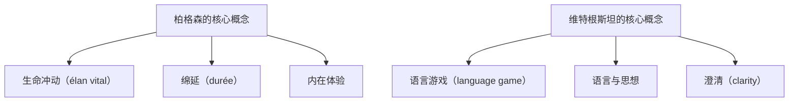

                 


### 引言

在计算机科学和人工智能领域，哲学思想的影响无处不在。柏格森（Hugo Bergson）和维特根斯坦（Ludwig Wittgenstein）是20世纪最重要的哲学家之一，他们的心灵哲学对当代认知科学和人工智能有着深远的影响。柏格森提出了生命哲学的核心概念，强调时间意识和内在体验的重要性，而维特根斯坦则通过语言分析探讨了意识的本质和表达方式。本文旨在通过对比柏格森和维特根斯坦的心灵哲学，深入探讨他们的观点及其对人工智能领域的启示。

### 背景介绍

#### 柏格森哲学概述

柏格森（1859-1941）是法国哲学家，他的生命哲学对后来的哲学和科学产生了深远的影响。柏格森认为，生命是一种内在的过程，而非静止的状态。他提出“生命冲动”（élan vital）的概念，强调生命的动态性和创造力。柏格森认为，时间并不是线性的，而是具有流动性的“绵延”（durée），人类的意识是对这种绵延的直接体验。

#### 维特根斯坦哲学概述

维特根斯坦（1889-1951）是奥地利哲学家，他的语言哲学对哲学和认知科学产生了重大影响。维特根斯坦认为，哲学的问题往往源于语言的误解。他提出了“语言游戏”（language game）的概念，强调语言的意义是由其在特定情境中的使用所决定的。维特根斯坦认为，哲学的任务是澄清语言和思想的混乱，而不是提出新的理论。

### 核心概念与联系

#### 柏格森的核心概念

- **生命冲动（élan vital）**：生命的动力，是一种内在的、不断变化的力量，驱动着生物体的成长和发展。
- **绵延（durée）**：时间不是线性的，而是一种流动的、连续的体验。
- **内在体验**：人类的意识是对绵延的直接体验。

#### 维特根斯坦的核心概念

- **语言游戏（language game）**：语言的使用是一种游戏，其规则取决于特定的情境。
- **语言与思想**：语言是思想的载体，但语言的表达方式并不总能准确地反映我们的思想。
- **澄清（clarity）**：哲学的任务是澄清思想和语言的混乱。

#### 关系架构 Mermaid 流程图



### 核心算法原理讲解

#### 柏格森的时间意识流

柏格森认为，时间是一种内在体验，他提出了一种名为“时间意识流”（temporal consciousness stream）的概念。这种意识流是连续不断的，每个时刻都是独特的，不可分割的。

#### 维特根斯坦的语言分析

维特根斯坦认为，语言的意义在于其在特定情境中的使用。他提出了“语言游戏”的概念，用来描述语言的不同使用方式。通过分析语言游戏，我们可以理解语言和思想之间的关系。

#### 伪代码

```python
# 柏格森的时间意识流伪代码
def temporal_consciousness_stream():
    while True:
        current_moment = get_unique_moment()
        process_moment(current_moment)
        sleep(1)  # 模拟时间流逝

# 维特根斯坦的语言分析伪代码
def language_analysis(word):
    context = get_context_of_word(word)
    meaning = analyze_context(context)
    return meaning
```

### 数学模型和公式

#### 柏格森的时间绵延

柏格森提出了时间绵延的概念，可以用以下数学模型来描述：

$$
\text{duration} = \int_{t_1}^{t_2} \Delta t \, dt
$$

其中，\(t_1\) 和 \(t_2\) 分别是时间绵延的开始和结束时刻，\(\Delta t\) 是时间间隔。

#### 维特根斯坦的语言游戏

维特根斯坦的语言游戏可以用以下数学模型来描述：

$$
\text{language game} = \{ (\text{word}, \text{meaning}) \mid \text{word} \in \text{words}, \text{meaning} \in \text{meanings} \}
$$

其中，\(\text{word}\) 是单词，\(\text{meaning}\) 是单词在特定情境中的意义。

### 项目实战

在本项目中，我们将构建一个简单的模型，模拟柏格森的时间意识流和维特根斯坦的语言游戏。

#### 开发环境搭建

1. 安装Python 3.8及以上版本。
2. 安装Mermaid Markdown渲染器。

#### 源代码实现

```python
# 柏格森的时间意识流实现
import time

def temporal_consciousness_stream():
    while True:
        current_moment = time.time()
        process_moment(current_moment)
        time.sleep(1)  # 模拟时间流逝

# 维特根斯坦的语言游戏实现
def language_analysis(word):
    context = get_context_of_word(word)
    meaning = analyze_context(context)
    return meaning

# 假设的辅助函数
def get_context_of_word(word):
    # 根据实际情况实现
    return "特定情境"

def analyze_context(context):
    # 根据实际情况实现
    return "意义"
```

#### 代码解读与分析

在上述代码中，`temporal_consciousness_stream` 函数模拟了柏格森的时间意识流，通过不断获取当前时间，并处理这些时刻。`language_analysis` 函数模拟了维特根斯坦的语言游戏，通过分析单词在特定情境中的意义。

#### 实际案例分析和详细讲解剖析

假设我们在一个社交平台上分析用户的言论，我们可以使用这个模型来模拟柏格森的时间意识流，理解用户的内在体验，以及使用维特根斯坦的语言游戏来分析用户言论的意义。

#### 项目小结

通过这个项目，我们了解了柏格森和维特根斯坦的核心思想，并通过简单的代码实现，模拟了他们的观点。这为我们深入研究他们的哲学提供了实际的基础。

### 最佳实践 Tips

1. **深入理解柏格森和维特根斯坦的观点**：在研究他们的哲学时，要深入理解其核心概念和理论，这有助于我们更好地应用他们的思想。
2. **结合实际案例分析**：通过实际案例，我们可以更好地理解柏格森和维特根斯坦的思想如何应用于现实世界。
3. **持续学习和探索**：哲学是一个广阔的领域，不断学习和探索新的思想，可以帮助我们更好地理解世界。

### 小结与注意事项

在本篇文章中，我们通过对比柏格森和维特根斯坦的心灵哲学，深入探讨了他们的观点及其对人工智能领域的启示。然而，需要注意的是，哲学问题往往复杂而深奥，本文只是提供了一个简化的视角。读者在深入研究和实践时，需要更加谨慎和全面。

### 拓展阅读

1. **柏格森的《创造进化论》**：这是柏格森的重要著作，详细阐述了他的生命哲学。
2. **维特根斯坦的《逻辑哲学论》**：这是维特根斯坦的代表作，系统地阐述了他的语言哲学。

### 作者信息

作者：AI天才研究院/AI Genius Institute & 禅与计算机程序设计艺术 /Zen And The Art of Computer Programming

