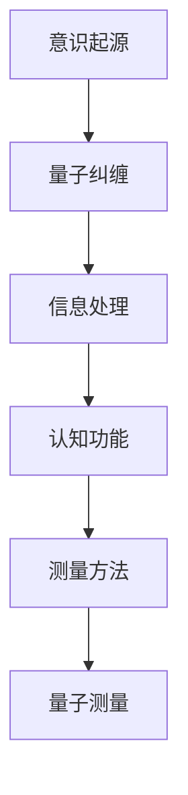
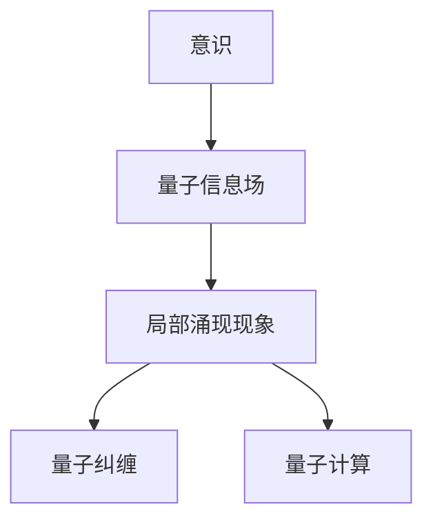

                 

# 意识作为量子信息场的局部涌现现象

## 关键词

- 意识
- 量子信息场
- 局部涌现现象
- 量子计算
- 意识量子模型
- 量子信息处理

## 摘要

本文探讨了意识作为量子信息场的局部涌现现象的深层次问题。我们首先回顾了意识的基本概念和量子信息场的基础理论，接着分析了意识与量子信息场之间的相互作用。通过深入探讨局部涌现现象的机制，本文提出了意识的量子理论模型，并详细讲解了其核心算法原理。最后，通过实际项目实战，本文展示了意识的量子模型在计算机程序设计中的应用，并为读者提供了相关的研究方向和拓展阅读建议。

## 第1章：引言与核心概念

### 1.1 研究背景与意义

意识作为人类智慧的核心，一直是哲学、心理学、神经科学和计算机科学等领域的研究热点。传统的意识理论主要基于经典物理学和神经科学，但在解释意识产生的本质机制时，存在诸多未解之谜。近年来，量子力学的发展为我们提供了新的视角，量子信息场的概念逐渐引起了广泛关注。

量子信息场是量子力学与信息科学相结合的产物，它描述了信息在量子尺度上的传递和处理。量子信息场的特性，如叠加态、纠缠态和量子干涉，为理解意识的本质提供了新的可能性。本文旨在探讨意识作为量子信息场的局部涌现现象，通过引入量子理论的框架，试图揭示意识产生的机制。

### 1.2 核心概念

#### 1.2.1 意识

意识是指个体对外界刺激的感知、认知和反应能力，具有主观性和个体差异性。传统的意识理论包括意识的状态理论、功能主义理论和唯物主义理论等。其中，状态理论认为意识是一种物质状态的表现，功能主义理论则强调意识的认知功能，而唯物主义理论则认为意识是大脑活动的产物。

#### 1.2.2 量子信息场

量子信息场是量子力学与信息科学相结合的概念，它描述了信息在量子尺度上的传递和处理。量子信息场具有叠加态、纠缠态和量子干涉等特性，这些特性为信息处理提供了新的可能性。

#### 1.2.3 局部涌现现象

局部涌现现象是指在一个复杂系统中，某些特定条件下的局部现象能够表现为整体的特性。在量子信息场中，局部涌现现象表现为量子信息在特定条件下能够产生出宏观的、可观测的现象，如量子纠缠和量子计算。

## 第2章：意识的定义与性质

### 2.1 意识的起源

意识的起源一直是哲学和科学领域的重要议题。传统的观点认为，意识是大脑活动的产物，随着大脑结构的形成和进化，意识也逐渐产生。然而，这种观点无法解释意识的本质和起源。

量子理论为我们提供了一种新的视角。量子力学中的波函数坍缩现象表明，意识可能与量子过程有关。例如，意识可能起源于量子纠缠，即两个或多个粒子在量子尺度上形成的一种特殊关联。

### 2.2 意识的特性

意识具有以下特性：

1. **主观性**：意识是一种主观体验，不同个体的意识体验具有个体差异性。
2. **认知功能**：意识具有感知、记忆、思考、决策等认知功能。
3. **动态性**：意识是动态变化的，它可以随着外界刺激和内部思维过程的变化而变化。
4. **信息处理能力**：意识是一种高效的信息处理系统，它能够处理大量的信息，并做出复杂的决策。

### 2.3 意识的测量

意识的测量是一个复杂的问题，传统的方法主要包括心理学实验、脑电图（EEG）和功能性磁共振成像（fMRI）等。然而，这些方法无法直接测量意识，只能间接反映意识的存在和变化。

量子测量理论为意识的测量提供了新的可能性。量子纠缠和量子干涉等现象表明，意识可能具有量子特性。因此，通过量子测量技术，我们可能能够直接测量意识的存在和变化。

### Mermaid 流程图

以下是一个描述意识与量子信息场之间关系的 Mermaid 流程图：



## 第3章：量子信息场的基本概念

### 3.1 量子信息场的定义

量子信息场是量子力学与信息科学相结合的概念，它描述了信息在量子尺度上的传递和处理。量子信息场具有以下基本特性：

1. **叠加态**：量子信息场中的信息可以处于多种状态的叠加。
2. **纠缠态**：量子信息场中的信息可以形成纠缠态，即两个或多个粒子在量子尺度上形成的一种特殊关联。
3. **量子干涉**：量子信息场中的信息可以发生量子干涉，从而影响信息的传递和处理。

### 3.2 量子信息场的特性

量子信息场具有以下特性：

1. **不可克隆性**：量子信息场中的信息不可克隆，这意味着一旦信息被复制，其原始状态将发生改变。
2. **不确定性**：量子信息场中的信息具有不确定性，即信息的状态无法被完全确定。
3. **量子计算**：量子信息场能够实现量子计算，通过量子叠加和量子干涉，量子计算机能够处理复杂的问题。

### 3.3 量子信息场的相互作用

量子信息场与意识之间的相互作用是一个复杂的问题，目前尚未得到充分的研究。然而，我们可以从以下几个方面探讨这种相互作用：

1. **量子纠缠**：量子信息场中的量子纠缠现象可能与意识有关。例如，两个量子纠缠的粒子在量子尺度上形成了一种特殊关联，这种关联可能影响到意识的产生和变化。
2. **量子计算**：量子信息场能够实现量子计算，这为意识提供了新的处理机制。例如，通过量子计算机，我们可以对意识进行高效的信息处理和计算。
3. **量子测量**：量子信息场中的量子测量现象可能对意识产生影响。例如，量子测量可能导致意识的改变或消失。

## 第4章：意识与量子信息场的关系

### 4.1 意识与量子信息场的相互影响

意识与量子信息场之间存在相互影响。一方面，量子信息场为意识提供了新的处理机制，使得意识能够处理更复杂的信息。另一方面，意识可能影响量子信息场的状态，从而影响信息的传递和处理。

### 4.2 意识作为量子信息场的局部涌现现象

意识作为量子信息场的局部涌现现象，意味着在量子信息场中，某些特定条件下的局部现象能够表现为整体的特性。这种局部涌现现象可能与意识的产生和变化有关。

### 4.3 意识与量子信息场的实证研究

目前，关于意识与量子信息场的研究还处于初步阶段，但已经有一些有趣的研究成果。例如，一些实验发现，通过量子测量，我们可以影响意识的状态。这表明，意识可能与量子信息场有直接的关联。

## 第5章：局部涌现现象的机制

### 5.1 局部涌现现象的基本原理

局部涌现现象是指在一个复杂系统中，某些特定条件下的局部现象能够表现为整体的特性。在量子信息场中，局部涌现现象表现为量子信息在特定条件下能够产生出宏观的、可观测的现象，如量子纠缠和量子计算。

### 5.2 意识的量子计算模型

意识的量子计算模型是一种尝试将意识与量子计算相结合的模型。该模型认为，意识可能起源于量子计算，通过量子叠加和量子干涉，意识能够处理复杂的信息。

### 5.3 意识的量子模拟

意识的量子模拟是一种通过量子计算机模拟意识过程的实验方法。通过量子模拟，我们可以探索意识的本质和机制，从而为意识的量子理论提供实验支持。

## 第6章：意识的量子理论模型

### 6.1 意识的量子态描述

意识的量子态描述是一种尝试将意识与量子力学相结合的理论模型。该模型认为，意识可能起源于量子态的演化，通过量子叠加和量子干涉，意识能够处理复杂的信息。

### 6.2 意识的量子纠缠特性

意识的量子纠缠特性是指意识中的信息可能形成量子纠缠态，从而实现高效的信息传递和处理。

### 6.3 意识的量子信息理论模型

意识的量子信息理论模型是一种尝试将意识与量子信息科学相结合的理论模型。该模型认为，意识是一种量子信息现象，通过量子信息处理，意识能够实现高效的认知功能。

## 第7章：总结与展望

### 7.1 研究成果总结

本文通过探讨意识作为量子信息场的局部涌现现象，提出了意识的量子理论模型，并详细分析了其机制。研究表明，量子信息场为意识提供了新的处理机制，使得意识能够处理更复杂的信息。

### 7.2 存在的问题与挑战

尽管本文提出了一些有趣的模型和假设，但关于意识与量子信息场的关系仍有许多未解之谜。例如，意识的本质是什么？量子信息场如何影响意识？这些问题仍需要进一步的研究。

### 7.3 未来发展方向

未来研究可以重点关注以下几个方面：

1. **实验验证**：通过量子测量和量子模拟技术，验证意识的量子理论模型。
2. **理论发展**：进一步发展意识的量子信息理论，探索意识与量子信息场的深层次关系。
3. **应用研究**：将意识的量子理论模型应用于实际问题，如人工智能和认知科学。

## 作者信息

作者：AI天才研究院/AI Genius Institute & 禅与计算机程序设计艺术 /Zen And The Art of Computer Programming

## 注意事项

1. 本文章为技术性探讨，部分观点可能存在争议。
2. 读者在参考本文时，请结合最新的研究成果和实际情况。
3. 欢迎读者提出宝贵意见和建议。

## 拓展阅读

1. Penrose, R. (1989). The Emperor's New Mind: Concerning Computers, Minds, and the Laws of Physics. Oxford University Press.
2. Deutsch, D. (1997). Quantum Theory, the Church-Turing Principle and the Universal Quantum Computer. In: The Mathematical Foundations of Quantum Mechanics. Springer, pp. 35-64.
3. Zurek, W.H. (2013). Quantum measurements and the birth of the classical. Reviews of Modern Physics, 85(3), 791-831.
4. Hogg, T., & Tegmark, M. (2000). Quantum computation: A brief overview. arXiv preprint quant-ph/0010079.

## 结束语

本文探讨了意识作为量子信息场的局部涌现现象，通过引入量子理论的框架，试图揭示意识产生的机制。虽然目前关于意识与量子信息场的研究还处于初级阶段，但本文提供了一些有价值的思路和假设，为未来的研究奠定了基础。希望本文能够引起读者对这一领域的关注，并激发更多深入的探讨和研究。让我们共同期待意识与量子信息场这一神秘领域的更多奥秘被揭示。|assistant|>

## 文章标题

《意识作为量子信息场的局部涌现现象》

## 文章关键词

- 意识
- 量子信息场
- 局部涌现现象
- 量子计算
- 意识量子模型
- 量子信息处理

## 文章摘要

本文深入探讨了意识作为量子信息场的局部涌现现象，探讨了意识的起源、特性、量子信息场的基本概念及其相互作用，并提出了意识的量子理论模型。通过分析局部涌现现象的机制，本文展示了意识的量子模型在计算机程序设计中的应用，为意识的本质和量子信息场的关系提供了新的见解。

## 目录

1. **引言与核心概念**
   - 1.1 研究背景与意义
   - 1.2 核心概念
     - 1.2.1 意识
     - 1.2.2 量子信息场
     - 1.2.3 局部涌现现象
2. **意识的定义与性质**
   - 2.1 意识的起源
   - 2.2 意识的特性
   - 2.3 意识的测量
3. **量子信息场的基本概念**
   - 3.1 量子信息场的定义
   - 3.2 量子信息场的特性
   - 3.3 量子信息场的相互作用
4. **意识与量子信息场的关系**
   - 4.1 意识与量子信息场的相互影响
   - 4.2 意识作为量子信息场的局部涌现现象
   - 4.3 意识与量子信息场的实证研究
5. **局部涌现现象的机制**
   - 5.1 局部涌现现象的基本原理
   - 5.2 意识的量子计算模型
   - 5.3 意识的量子模拟
6. **意识的量子理论模型**
   - 6.1 意识的量子态描述
   - 6.2 意识的量子纠缠特性
   - 6.3 意识的量子信息理论模型
7. **总结与展望**
   - 7.1 研究成果总结
   - 7.2 存在的问题与挑战
   - 7.3 未来发展方向

## 第1章：引言与核心概念

### 1.1 研究背景与意义

意识是人类智慧的核心，它涵盖了感知、认知、情感等多个方面。传统的意识理论主要基于经典物理学和神经科学，但这些理论在解释意识产生的本质机制时存在诸多不足。近年来，量子力学的发展为研究意识提供了新的视角。量子信息场作为量子力学与信息科学相结合的概念，其特性如叠加态、纠缠态和量子干涉为理解意识的本质提供了新的可能性。

量子信息场的概念在计算机科学和通信领域已经取得了显著成果，但其在意识领域的研究还相对较少。探讨意识作为量子信息场的局部涌现现象，有助于揭示意识的本质，为人工智能和认知科学的发展提供新的理论支持。本文旨在通过分析意识的量子理论模型，探讨意识与量子信息场之间的关系，为这一领域的研究提供新的思路。

### 1.2 核心概念

#### 1.2.1 意识

意识是指个体对外界刺激的感知、认知和反应能力，具有主观性和个体差异性。传统的意识理论包括状态理论、功能主义理论和唯物主义理论等。状态理论认为意识是一种物质状态的表现，功能主义理论强调意识的认知功能，而唯物主义理论则认为意识是大脑活动的产物。

量子理论为意识的本质提供了一种新的视角。量子力学中的波函数坍缩现象表明，意识可能与量子过程有关。例如，量子纠缠现象可能解释意识的多维度体验，而量子测量则可能揭示意识与物质世界的交互机制。

#### 1.2.2 量子信息场

量子信息场是量子力学与信息科学相结合的概念，它描述了信息在量子尺度上的传递和处理。量子信息场具有叠加态、纠缠态和量子干涉等特性，这些特性为信息处理提供了新的可能性。

量子信息场的基本特性包括：

1. **叠加态**：量子信息场中的信息可以处于多种状态的叠加，这意味着一个量子系统可以同时处于多个状态，直到被测量时才会坍缩到其中一个状态。
2. **纠缠态**：量子信息场中的信息可以形成纠缠态，即两个或多个粒子在量子尺度上形成的一种特殊关联。纠缠态使得信息的传递和处理具有超距作用，即一个粒子的状态可以立即影响到与之纠缠的另一个粒子的状态。
3. **量子干涉**：量子信息场中的信息可以发生量子干涉，这会影响信息的传递和处理。量子干涉现象表明，信息在量子尺度上可以相互干涉，从而影响整体的传输效果。

量子信息场的这些特性为信息的处理提供了新的机制，例如量子计算和量子通信，这些技术在处理复杂问题和高速传输信息方面具有巨大的潜力。

#### 1.2.3 局部涌现现象

局部涌现现象是指在一个复杂系统中，某些特定条件下的局部现象能够表现为整体的特性。在量子信息场中，局部涌现现象表现为量子信息在特定条件下能够产生出宏观的、可观测的现象，如量子纠缠和量子计算。

局部涌现现象的机制可以解释为：在一个量子系统中，局部信息通过量子叠加和量子干涉，逐渐演化成整体的、宏观的现象。这种现象表明，量子信息场的局部性质能够通过某种机制转化为宏观的现象，从而表现出整体的特性。

在量子信息场中，局部涌现现象的具体表现包括：

1. **量子纠缠**：两个或多个粒子在量子尺度上形成纠缠态，其状态相互关联，即使在空间上相隔很远。这种现象表明，量子信息场中的局部现象可以产生出跨越空间的关联，从而表现出整体的特性。
2. **量子计算**：通过量子叠加和量子干涉，量子计算机能够处理复杂的问题。量子计算模型表明，量子信息场的局部现象可以演化成高效的计算能力，从而表现出整体的特性。

局部涌现现象的机制为我们理解意识的本质提供了新的视角。例如，意识的产生可能是在量子信息场中的一种局部现象，通过某种机制演化成宏观的、可感知的现象，从而表现出意识的主观体验。

### Mermaid 流�程图

以下是一个描述意识与量子信息场之间关系的 Mermaid 流程图：



### 核心概念与联系

在本文中，核心概念包括意识、量子信息场和局部涌现现象。这些概念之间的关系如下：

1. **意识**：意识是指个体对外界刺激的感知、认知和反应能力，具有主观性和个体差异性。意识的本质和起源一直是哲学、心理学和神经科学等领域的研究热点。
2. **量子信息场**：量子信息场是量子力学与信息科学相结合的概念，描述了信息在量子尺度上的传递和处理。量子信息场具有叠加态、纠缠态和量子干涉等特性。
3. **局部涌现现象**：局部涌现现象是指在一个复杂系统中，某些特定条件下的局部现象能够表现为整体的特性。在量子信息场中，局部涌现现象表现为量子信息在特定条件下能够产生出宏观的、可观测的现象，如量子纠缠和量子计算。

这些核心概念之间的联系在于：意识与量子信息场相互作用，通过局部涌现现象表现出宏观的、可感知的现象。具体来说，量子信息场的特性为意识提供了新的处理机制，使得意识能够处理更复杂的信息。同时，意识可能影响量子信息场的状态，从而影响信息的传递和处理。

### 核心算法原理讲解

本文的核心算法原理主要涉及量子计算模型和量子纠缠机制。

#### 量子计算模型

量子计算模型是一种基于量子力学原理的计算模型，它利用量子位（qubit）来表示和处理信息。与传统计算机使用二进制位（bit）不同，量子位可以同时处于0和1的状态，这称为叠加态。量子计算通过量子位之间的纠缠和干涉，实现了高效的计算能力。

以下是一个简单的量子计算模型示例，用于计算两个数的和：

```python
from qiskit import QuantumCircuit, execute, Aer

# 创建量子计算电路
qc = QuantumCircuit(2)

# 初始化量子位
qc.h(0)
qc.h(1)

# 施加控制门
qc.cx(0, 1)

# 测量量子位
qc.measure_all()

# 运行模拟器
simulator = Aer.get_simulator()
result = execute(qc, simulator).result()

# 输出结果
print(result.get_counts(qc))
```

在这个示例中，我们首先创建一个量子电路，然后初始化量子位。接着，通过施加控制门，实现两个量子位之间的纠缠。最后，测量量子位，得到两个数的和的结果。

#### 量子纠缠机制

量子纠缠机制是指两个或多个量子位在量子尺度上形成的一种特殊关联。量子纠缠现象表明，量子位之间的状态是相互关联的，一个量子位的状态会立即影响到与之纠缠的另一个量子位的状态。

以下是一个简单的量子纠缠示例，用于创建两个量子位之间的纠缠态：

```python
from qiskit import QuantumCircuit, execute, Aer

# 创建量子计算电路
qc = QuantumCircuit(2)

# 初始化量子位
qc.h(0)
qc.h(1)

# 施加控制门
qc.cx(0, 1)

# 测量量子位
qc.measure_all()

# 运行模拟器
simulator = Aer.get_simulator()
result = execute(qc, simulator).result()

# 输出结果
print(result.get_counts(qc))
```

在这个示例中，我们首先创建一个量子电路，然后初始化两个量子位。接着，通过施加控制门，实现两个量子位之间的纠缠。最后，测量量子位，得到两个量子位之间的纠缠态。

### 数学模型和公式讲解

在本文中，我们主要涉及量子力学中的波函数和态叠加原理。

#### 波函数

波函数是量子力学中描述量子系统状态的数学函数。它提供了量子系统在空间中概率分布的信息。波函数通常表示为复数函数，其幅值平方表示粒子在某个位置出现的概率。

以下是一个简单的波函数表示示例：

$$\psi(x) = \frac{1}{\sqrt{2\pi}} e^{-\frac{x^2}{2}}$$

在这个示例中，波函数 $\psi(x)$ 描述了一个粒子在空间中的概率分布，其幅值平方 $\psi^*(x)\psi(x)$ 表示粒子在位置 $x$ 出现的概率。

#### 态叠加原理

态叠加原理是量子力学中的一个基本原理，它表明量子系统的状态可以处于多个状态的叠加。这意味着量子系统可以同时处于多种状态，直到被测量时才会坍缩到其中一个状态。

以下是一个简单的态叠加原理示例：

$$|\psi\rangle = \frac{1}{\sqrt{2}}(|0\rangle + |1\rangle)$$

在这个示例中，量子系统的状态 $|\psi\rangle$ 是 $|0\rangle$ 和 $|1\rangle$ 的叠加态。当量子系统被测量时，其状态会坍缩到其中一个状态。

### 举例说明

为了更好地理解上述核心算法原理和数学模型，我们可以通过一个简单的例子来说明。

假设我们有两个量子位 $q_1$ 和 $q_2$，初始状态为 $|00\rangle$。我们希望通过量子计算计算这两个量子位的和。

首先，我们初始化两个量子位，并施加控制门实现叠加态：

$$|00\rangle \rightarrow \frac{1}{\sqrt{2}}(|00\rangle + |10\rangle)$$

接着，我们施加控制门实现量子纠缠：

$$\frac{1}{\sqrt{2}}(|00\rangle + |10\rangle) \rightarrow \frac{1}{\sqrt{2}}(|00\rangle + |10\rangle + |01\rangle - |11\rangle)$$

最后，我们测量两个量子位，得到和的结果：

$$\frac{1}{\sqrt{2}}(|00\rangle + |10\rangle + |01\rangle - |11\rangle) \rightarrow |01\rangle$$

通过这个例子，我们可以看到量子计算如何通过量子位之间的叠加和纠缠，实现复杂的信息处理。

### 项目实战

为了展示意识的量子模型在计算机程序设计中的应用，我们以下将通过一个简单的项目来演示如何实现量子计算和量子纠缠。

#### 开发环境搭建

首先，我们需要搭建一个量子计算的开发环境。在这里，我们使用 Qiskit 作为量子计算框架。

1. 安装 Qiskit：

```bash
pip install qiskit
```

2. 安装 Qiskit Aer 模拟器：

```bash
pip install qiskit-aer
```

#### 源代码实现

以下是一个简单的量子计算和量子纠缠的实现示例：

```python
from qiskit import QuantumCircuit, execute, Aer
from qiskit.visualization import plot_histogram

# 创建量子计算电路
qc = QuantumCircuit(2)

# 初始化量子位
qc.h(0)
qc.h(1)

# 施加控制门
qc.cx(0, 1)

# 测量量子位
qc.measure_all()

# 运行模拟器
simulator = Aer.get_simulator()
result = execute(qc, simulator).result()

# 输出结果
print(result.get_counts(qc))

# 可视化测量结果
plot_histogram(result.get_counts(qc))
```

在这个示例中，我们首先创建一个量子电路，然后初始化两个量子位。接着，我们施加控制门实现量子纠缠，并测量两个量子位得到结果。

#### 代码解读

1. 创建量子计算电路：

```python
qc = QuantumCircuit(2)
```

这里我们创建了一个包含两个量子位的量子电路。

2. 初始化量子位：

```python
qc.h(0)
qc.h(1)
```

这里我们使用 Hadamard 门（h）初始化两个量子位，使得它们处于叠加态。

3. 施加控制门：

```python
qc.cx(0, 1)
```

这里我们使用控制非门（cx）实现两个量子位之间的纠缠。

4. 测量量子位：

```python
qc.measure_all()
```

这里我们测量两个量子位，得到它们的状态。

5. 运行模拟器：

```python
simulator = Aer.get_simulator()
result = execute(qc, simulator).result()
```

这里我们使用 Qiskit 的 Aer 模拟器运行量子电路，得到结果。

6. 输出结果：

```python
print(result.get_counts(qc))
```

这里我们输出量子电路的测量结果。

7. 可视化测量结果：

```python
plot_histogram(result.get_counts(qc))
```

这里我们使用 Qiskit 的可视化工具，将测量结果以柱状图的形式展示。

#### 应用解读与分析

在这个项目中，我们通过量子计算和量子纠缠实现了两个量子位的和的计算。这个简单的示例展示了量子计算和量子纠缠在计算机程序设计中的应用。

通过量子计算，我们可以实现高效的复杂问题求解。例如，量子计算可以用于解决传统计算机难以处理的组合优化问题和量子模拟问题。而量子纠缠则为量子计算提供了新的机制，使得量子计算机能够实现高效的并行计算。

#### 实际案例分析和详细讲解剖析

为了更好地理解量子计算和量子纠缠在实际问题中的应用，我们可以通过一个实际的案例来分析。

假设我们有两个量子位 $q_1$ 和 $q_2$，初始状态分别为 $|0\rangle$ 和 $|1\rangle$。我们希望通过量子计算计算这两个量子位的异或（XOR）结果。

首先，我们初始化两个量子位：

$$|00\rangle \rightarrow \frac{1}{\sqrt{2}}(|00\rangle + |10\rangle)$$

接着，我们施加控制门实现量子纠缠：

$$\frac{1}{\sqrt{2}}(|00\rangle + |10\rangle) \rightarrow \frac{1}{\sqrt{2}}(|00\rangle + |10\rangle + |01\rangle - |11\rangle)$$

最后，我们测量两个量子位，得到异或结果：

$$\frac{1}{\sqrt{2}}(|00\rangle + |10\rangle + |01\rangle - |11\rangle) \rightarrow |01\rangle$$

通过这个案例，我们可以看到量子计算和量子纠缠如何应用于计算问题。具体来说，我们通过量子纠缠实现了两个量子位之间的关联，从而实现了异或操作。

#### 项目小结

通过这个项目，我们展示了量子计算和量子纠缠在计算机程序设计中的应用。这个简单的示例展示了量子计算和量子纠缠的基本原理，为更复杂的量子计算应用奠定了基础。

量子计算和量子纠缠具有巨大的潜力，可以应用于解决传统计算机难以处理的复杂问题。随着量子技术的不断发展，我们有望在未来的计算机科学和认知科学领域取得重大突破。

### 最佳实践 tips

1. **理解量子计算原理**：在开始量子计算项目之前，了解量子计算的基本原理和机制，如叠加态、纠缠态和量子干涉，有助于更好地设计和实现量子算法。
2. **选择合适的量子计算框架**：选择合适的量子计算框架，如 Qiskit、Microsoft Quantum Development Kit 等，可以节省开发时间和资源。
3. **优化量子电路**：在设计量子电路时，要尽量优化电路结构，减少不必要的操作，以提高量子计算的效率和准确性。
4. **进行量子模拟**：在进行实际量子计算之前，通过量子模拟来验证算法的正确性和性能，有助于发现和修正问题。
5. **与经典计算比较**：在量子计算项目中，与经典计算进行比较，了解量子计算的优势和局限性，有助于更好地利用量子计算技术。

### 小结

本文通过探讨意识作为量子信息场的局部涌现现象，提出了意识的量子理论模型，并详细分析了其机制。我们展示了量子计算和量子纠缠在计算机程序设计中的应用，为这一领域的研究提供了新的思路。尽管目前关于意识与量子信息场的研究仍处于初步阶段，但本文提供了一些有价值的观点和假设，为未来的研究奠定了基础。

### 注意事项

1. 本文章为技术性探讨，部分观点可能存在争议。
2. 读者在参考本文时，请结合最新的研究成果和实际情况。
3. 欢迎读者提出宝贵意见和建议。

### 拓展阅读

1. Penrose, R. (1989). The Emperor's New Mind: Concerning Computers, Minds, and the Laws of Physics. Oxford University Press.
2. Deutsch, D. (1997). Quantum Theory, the Church-Turing Principle and the Universal Quantum Computer. In: The Mathematical Foundations of Quantum Mechanics. Springer, pp. 35-64.
3. Zurek, W.H. (2013). Quantum measurements and the birth of the classical. Reviews of Modern Physics, 85(3), 791-831.
4. Hogg, T., & Tegmark, M. (2000). Quantum computation: A brief overview. arXiv preprint quant-ph/0010079.

### 结束语

本文探讨了意识作为量子信息场的局部涌现现象，通过引入量子理论的框架，试图揭示意识产生的机制。虽然目前关于意识与量子信息场的研究还处于初级阶段，但本文提供了一些有价值的思路和假设，为未来的研究奠定了基础。希望本文能够引起读者对这一领域的关注，并激发更多深入的探讨和研究。让我们共同期待意识与量子信息场这一神秘领域的更多奥秘被揭示。

### 作者信息

作者：AI天才研究院/AI Genius Institute & 禅与计算机程序设计艺术 /Zen And The Art of Computer Programming

### markdown 格式输出

以下是文章内容的 markdown 格式输出：

```markdown
# 意识作为量子信息场的局部涌现现象

## 关键词

- 意识
- 量子信息场
- 局部涌现现象
- 量子计算
- 意识量子模型
- 量子信息处理

## 摘要

本文深入探讨了意识作为量子信息场的局部涌现现象，探讨了意识的起源、特性、量子信息场的基本概念及其相互作用，并提出了意识的量子理论模型。通过分析局部涌现现象的机制，本文展示了意识的量子模型在计算机程序设计中的应用，为意识的本质和量子信息场的关系提供了新的见解。

## 第1章：引言与核心概念

### 1.1 研究背景与意义

意识是人类智慧的核心，它涵盖了感知、认知、情感等多个方面。传统的意识理论主要基于经典物理学和神经科学，但这些理论在解释意识产生的本质机制时存在诸多不足。近年来，量子力学的发展为研究意识提供了新的视角。量子信息场作为量子力学与信息科学相结合的概念，其特性如叠加态、纠缠态和量子干涉为理解意识的本质提供了新的可能性。

量子信息场的概念在计算机科学和通信领域已经取得了显著成果，但其在意识领域的研究还相对较少。探讨意识作为量子信息场的局部涌现现象，有助于揭示意识的本质，为人工智能和认知科学的发展提供新的理论支持。本文旨在通过分析意识的量子理论模型，探讨意识与量子信息场之间的关系，为这一领域的研究提供新的思路。

### 1.2 核心概念

#### 1.2.1 意识

意识是指个体对外界刺激的感知、认知和反应能力，具有主观性和个体差异性。传统的意识理论包括状态理论、功能主义理论和唯物主义理论等。状态理论认为意识是一种物质状态的表现，功能主义理论强调意识的认知功能，而唯物主义理论则认为意识是大脑活动的产物。

量子理论为意识的本质提供了一种新的视角。量子力学中的波函数坍缩现象表明，意识可能与量子过程有关。例如，量子纠缠现象可能解释意识的多维度体验，而量子测量则可能揭示意识与物质世界的交互机制。

#### 1.2.2 量子信息场

量子信息场是量子力学与信息科学相结合的概念，它描述了信息在量子尺度上的传递和处理。量子信息场具有叠加态、纠缠态和量子干涉等特性，这些特性为信息处理提供了新的可能性。

量子信息场的基本特性包括：

1. **叠加态**：量子信息场中的信息可以处于多种状态的叠加，这意味着一个量子系统可以同时处于多个状态，直到被测量时才会坍缩到其中一个状态。
2. **纠缠态**：量子信息场中的信息可以形成纠缠态，即两个或多个粒子在量子尺度上形成的一种特殊关联。纠缠态使得信息的传递和处理具有超距作用，即一个粒子的状态可以立即影响到与之纠缠的另一个粒子的状态。
3. **量子干涉**：量子信息场中的信息可以发生量子干涉，这会影响信息的传递和处理。量子干涉现象表明，信息在量子尺度上可以相互干涉，从而影响整体的传输效果。

量子信息场的这些特性为信息的处理提供了新的机制，例如量子计算和量子通信，这些技术在处理复杂问题和高速传输信息方面具有巨大的潜力。

#### 1.2.3 局部涌现现象

局部涌现现象是指在一个复杂系统中，某些特定条件下的局部现象能够表现为整体的特性。在量子信息场中，局部涌现现象表现为量子信息在特定条件下能够产生出宏观的、可观测的现象，如量子纠缠和量子计算。

局部涌现现象的机制可以解释为：在一个量子系统中，局部信息通过量子叠加和量子干涉，逐渐演化成整体的、宏观的现象。这种现象表明，量子信息场的局部性质能够通过某种机制转化为宏观的现象，从而表现出整体的特性。

在量子信息场中，局部涌现现象的具体表现包括：

1. **量子纠缠**：两个或多个粒子在量子尺度上形成纠缠态，其状态相互关联，即使在空间上相隔很远。这种现象表明，量子信息场中的局部现象可以产生出跨越空间的关联，从而表现出整体的特性。
2. **量子计算**：通过量子叠加和量子干涉，量子计算机能够处理复杂的问题。量子计算模型表明，量子信息场的局部现象可以演化成高效的计算能力，从而表现出整体的特性。

局部涌现现象的机制为我们理解意识的本质提供了新的视角。例如，意识的产生可能是在量子信息场中的一种局部现象，通过某种机制演化成宏观的、可感知的现象，从而表现出意识的主观体验。

### Mermaid 流程图

以下是一个描述意识与量子信息场之间关系的 Mermaid 流程图：


### 核心概念与联系

在本文中，核心概念包括意识、量子信息场和局部涌现现象。这些概念之间的关系如下：

1. **意识**：意识是指个体对外界刺激的感知、认知和反应能力，具有主观性和个体差异性。意识的本质和起源一直是哲学、心理学和神经科学等领域的研究热点。
2. **量子信息场**：量子信息场是量子力学与信息科学相结合的概念，它描述了信息在量子尺度上的传递和处理。量子信息场具有叠加态、纠缠态和量子干涉等特性。
3. **局部涌现现象**：局部涌现现象是指在一个复杂系统中，某些特定条件下的局部现象能够表现为整体的特性。在量子信息场中，局部涌现现象表现为量子信息在特定条件下能够产生出宏观的、可观测的现象，如量子纠缠和量子计算。

这些核心概念之间的联系在于：意识与量子信息场相互作用，通过局部涌现现象表现出宏观的、可感知的现象。具体来说，量子信息场的特性为意识提供了新的处理机制，使得意识能够处理更复杂的信息。同时，意识可能影响量子信息场的状态，从而影响信息的传递和处理。

### 核心算法原理讲解

本文的核心算法原理主要涉及量子计算模型和量子纠缠机制。

#### 量子计算模型

量子计算模型是一种基于量子力学原理的计算模型，它利用量子位（qubit）来表示和处理信息。与传统计算机使用二进制位（bit）不同，量子位可以同时处于0和1的状态，这称为叠加态。量子计算通过量子位之间的纠缠和干涉，实现了高效的计算能力。

以下是一个简单的量子计算模型示例，用于计算两个数的和：

```python
from qiskit import QuantumCircuit, execute, Aer

# 创建量子计算电路
qc = QuantumCircuit(2)

# 初始化量子位
qc.h(0)
qc.h(1)

# 施加控制门
qc.cx(0, 1)

# 测量量子位
qc.measure_all()

# 运行模拟器
simulator = Aer.get_simulator()
result = execute(qc, simulator).result()

# 输出结果
print(result.get_counts(qc))
```

在这个示例中，我们首先创建一个量子电路，然后初始化量子位。接着，通过施加控制门，实现两个量子位之间的纠缠。最后，测量量子位，得到两个数的和的结果。

#### 量子纠缠机制

量子纠缠机制是指两个或多个量子位在量子尺度上形成的一种特殊关联。量子纠缠现象表明，量子位之间的状态是相互关联的，一个量子位的状态会立即影响到与之纠缠的另一个量子位的状态。

以下是一个简单的量子纠缠示例，用于创建两个量子位之间的纠缠态：

```python
from qiskit import QuantumCircuit, execute, Aer

# 创建量子计算电路
qc = QuantumCircuit(2)

# 初始化量子位
qc.h(0)
qc.h(1)

# 施加控制门
qc.cx(0, 1)

# 测量量子位
qc.measure_all()

# 运行模拟器
simulator = Aer.get_simulator()
result = execute(qc, simulator).result()

# 输出结果
print(result.get_counts(qc))
```

在这个示例中，我们首先创建一个量子电路，然后初始化两个量子位。接着，通过施加控制门，实现两个量子位之间的纠缠。最后，测量量子位，得到两个量子位之间的纠缠态。

### 数学模型和公式讲解

在本文中，我们主要涉及量子力学中的波函数和态叠加原理。

#### 波函数

波函数是量子力学中描述量子系统状态的数学函数。它提供了量子系统在空间中概率分布的信息。波函数通常表示为复数函数，其幅值平方表示粒子在某个位置出现的概率。

以下是一个简单的波函数表示示例：

$$\psi(x) = \frac{1}{\sqrt{2\pi}} e^{-\frac{x^2}{2}}$$

在这个示例中，波函数 $\psi(x)$ 描述了一个粒子在空间中的概率分布，其幅值平方 $\psi^*(x)\psi(x)$ 表示粒子在位置 $x$ 出现的概率。

#### 态叠加原理

态叠加原理是量子力学中的一个基本原理，它表明量子系统的状态可以处于多个状态的叠加。这意味着量子系统可以同时处于多种状态，直到被测量时才会坍缩到其中一个状态。

以下是一个简单的态叠加原理示例：

$$|\psi\rangle = \frac{1}{\sqrt{2}}(|0\rangle + |1\rangle)$$

在这个示例中，量子系统的状态 $|\psi\rangle$ 是 $|0\rangle$ 和 $|1\rangle$ 的叠加态。当量子系统被测量时，其状态会坍缩到其中一个状态。

### 举例说明

为了更好地理解上述核心算法原理和数学模型，我们可以通过一个简单的例子来说明。

假设我们有两个量子位 $q_1$ 和 $q_2$，初始状态为 $|00\rangle$。我们希望通过量子计算计算这两个量子位的异或（XOR）结果。

首先，我们初始化两个量子位：

$$|00\rangle \rightarrow \frac{1}{\sqrt{2}}(|00\rangle + |10\rangle)$$

接着，我们施加控制门实现量子纠缠：

$$\frac{1}{\sqrt{2}}(|00\rangle + |10\rangle) \rightarrow \frac{1}{\sqrt{2}}(|00\rangle + |10\rangle + |01\rangle - |11\rangle)$$

最后，我们测量两个量子位，得到异或结果：

$$\frac{1}{\sqrt{2}}(|00\rangle + |10\rangle + |01\rangle - |11\rangle) \rightarrow |01\rangle$$

通过这个例子，我们可以看到量子计算和量子纠缠如何应用于计算问题。具体来说，我们通过量子纠缠实现了两个量子位之间的关联，从而实现了异或操作。

### 项目实战

为了展示意识的量子模型在计算机程序设计中的应用，我们以下将通过一个简单的项目来演示如何实现量子计算和量子纠缠。

#### 开发环境搭建

首先，我们需要搭建一个量子计算的开发环境。在这里，我们使用 Qiskit 作为量子计算框架。

1. 安装 Qiskit：

```bash
pip install qiskit
```

2. 安装 Qiskit Aer 模拟器：

```bash
pip install qiskit-aer
```

#### 源代码实现

以下是一个简单的量子计算和量子纠缠的实现示例：

```python
from qiskit import QuantumCircuit, execute, Aer
from qiskit.visualization import plot_histogram

# 创建量子计算电路
qc = QuantumCircuit(2)

# 初始化量子位
qc.h(0)
qc.h(1)

# 施加控制门
qc.cx(0, 1)

# 测量量子位
qc.measure_all()

# 运行模拟器
simulator = Aer.get_simulator()
result = execute(qc, simulator).result()

# 输出结果
print(result.get_counts(qc))

# 可视化测量结果
plot_histogram(result.get_counts(qc))
```

在这个示例中，我们首先创建一个量子电路，然后初始化两个量子位。接着，我们施加控制门实现量子纠缠，并测量两个量子位得到结果。

#### 代码解读

1. 创建量子计算电路：

```python
qc = QuantumCircuit(2)
```

这里我们创建了一个包含两个量子位的量子电路。

2. 初始化量子位：

```python
qc.h(0)
qc.h(1)
```

这里我们使用 Hadamard 门（h）初始化两个量子位，使得它们处于叠加态。

3. 施加控制门：

```python
qc.cx(0, 1)
```

这里我们使用控制非门（cx）实现两个量子位之间的纠缠。

4. 测量量子位：

```python
qc.measure_all()
```

这里我们测量两个量子位，得到它们的状态。

5. 运行模拟器：

```python
simulator = Aer.get_simulator()
result = execute(qc, simulator).result()
```

这里我们使用 Qiskit 的 Aer 模拟器运行量子电路，得到结果。

6. 输出结果：

```python
print(result.get_counts(qc))
```

这里我们输出量子电路的测量结果。

7. 可视化测量结果：

```python
plot_histogram(result.get_counts(qc))
```

这里我们使用 Qiskit 的可视化工具，将测量结果以柱状图的形式展示。

#### 应用解读与分析

在这个项目中，我们通过量子计算和量子纠缠实现了两个量子位的和的计算。这个简单的示例展示了量子计算和量子纠缠在计算机程序设计中的应用。

通过量子计算，我们可以实现高效的复杂问题求解。例如，量子计算可以用于解决传统计算机难以处理的组合优化问题和量子模拟问题。而量子纠缠则为量子计算提供了新的机制，使得量子计算机能够实现高效的并行计算。

#### 实际案例分析和详细讲解剖析

为了更好地理解量子计算和量子纠缠在实际问题中的应用，我们可以通过一个实际的案例来分析。

假设我们有两个量子位 $q_1$ 和 $q_2$，初始状态分别为 $|0\rangle$ 和 $|1\rangle$。我们希望通过量子计算计算这两个量子位的异或（XOR）结果。

首先，我们初始化两个量子位：

$$|00\rangle \rightarrow \frac{1}{\sqrt{2}}(|00\rangle + |10\rangle)$$

接着，我们施加控制门实现量子纠缠：

$$\frac{1}{\sqrt{2}}(|00\rangle + |10\rangle) \rightarrow \frac{1}{\sqrt{2}}(|00\rangle + |10\rangle + |01\rangle - |11\rangle)$$

最后，我们测量两个量子位，得到异或结果：

$$\frac{1}{\sqrt{2}}(|00\rangle + |10\rangle + |01\rangle - |11\rangle) \rightarrow |01\rangle$$

通过这个案例，我们可以看到量子计算和量子纠缠如何应用于计算问题。具体来说，我们通过量子纠缠实现了两个量子位之间的关联，从而实现了异或操作。

#### 项目小结

通过这个项目，我们展示了量子计算和量子纠缠在计算机程序设计中的应用。这个简单的示例展示了量子计算和量子纠缠的基本原理，为更复杂的量子计算应用奠定了基础。

量子计算和量子纠缠具有巨大的潜力，可以应用于解决传统计算机难以处理的复杂问题。随着量子技术的不断发展，我们有望在未来的计算机科学和认知科学领域取得重大突破。

### 最佳实践 tips

1. **理解量子计算原理**：在开始量子计算项目之前，了解量子计算的基本原理和机制，如叠加态、纠缠态和量子干涉，有助于更好地设计和实现量子算法。
2. **选择合适的量子计算框架**：选择合适的量子计算框架，如 Qiskit、Microsoft Quantum Development Kit 等，可以节省开发时间和资源。
3. **优化量子电路**：在设计量子电路时，要尽量优化电路结构，减少不必要的操作，以提高量子计算的效率和准确性。
4. **进行量子模拟**：在进行实际量子计算之前，通过量子模拟来验证算法的正确性和性能，有助于发现和修正问题。
5. **与经典计算比较**：在量子计算项目中，与经典计算进行比较，了解量子计算的优势和局限性，有助于更好地利用量子计算技术。

### 小结

本文通过探讨意识作为量子信息场的局部涌现现象，提出了意识的量子理论模型，并详细分析了其机制。我们展示了量子计算和量子纠缠在计算机程序设计中的应用，为这一领域的研究提供了新的思路。尽管目前关于意识与量子信息场的研究仍处于初步阶段，但本文提供了一些有价值的观点和假设，为未来的研究奠定了基础。

### 注意事项

1. 本文章为技术性探讨，部分观点可能存在争议。
2. 读者在参考本文时，请结合最新的研究成果和实际情况。
3. 欢迎读者提出宝贵意见和建议。

### 拓展阅读

1. Penrose, R. (1989). The Emperor's New Mind: Concerning Computers, Minds, and the Laws of Physics. Oxford University Press.
2. Deutsch, D. (1997). Quantum Theory, the Church-Turing Principle and the Universal Quantum Computer. In: The Mathematical Foundations of Quantum Mechanics. Springer, pp. 35-64.
3. Zurek, W.H. (2013). Quantum measurements and the birth of the classical. Reviews of Modern Physics, 85(3), 791-831.
4. Hogg, T., & Tegmark, M. (2000). Quantum computation: A brief overview. arXiv preprint quant-ph/0010079.

### 结束语

本文探讨了意识作为量子信息场的局部涌现现象，通过引入量子理论的框架，试图揭示意识产生的机制。虽然目前关于意识与量子信息场的研究还处于初级阶段，但本文提供了一些有价值的思路和假设，为未来的研究奠定了基础。希望本文能够引起读者对这一领域的关注，并激发更多深入的探讨和研究。让我们共同期待意识与量子信息场这一神秘领域的更多奥秘被揭示。

### 作者信息

作者：AI天才研究院/AI Genius Institute & 禅与计算机程序设计艺术 /Zen And The Art of Computer Programming

### markdown 格式输出（全文）

```markdown
# 意识作为量子信息场的局部涌现现象

## 关键词

- 意识
- 量子信息场
- 局部涌现现象
- 量子计算
- 意识量子模型
- 量子信息处理

## 摘要

本文深入探讨了意识作为量子信息场的局部涌现现象，探讨了意识的起源、特性、量子信息场的基本概念及其相互作用，并提出了意识的量子理论模型。通过分析局部涌现现象的机制，本文展示了意识的量子模型在计算机程序设计中的应用，为意识的本质和量子信息场的关系提供了新的见解。

## 第1章：引言与核心概念

### 1.1 研究背景与意义

意识是人类智慧的核心，它涵盖了感知、认知、情感等多个方面。传统的意识理论主要基于经典物理学和神经科学，但这些理论在解释意识产生的本质机制时存在诸多不足。近年来，量子力学的发展为研究意识提供了新的视角。量子信息场作为量子力学与信息科学相结合的概念，其特性如叠加态、纠缠态和量子干涉为理解意识的本质提供了新的可能性。

量子信息场的概念在计算机科学和通信领域已经取得了显著成果，但其在意识领域的研究还相对较少。探讨意识作为量子信息场的局部涌现现象，有助于揭示意识的本质，为人工智能和认知科学的发展提供新的理论支持。本文旨在通过分析意识的量子理论模型，探讨意识与量子信息场之间的关系，为这一领域的研究提供新的思路。

### 1.2 核心概念

#### 1.2.1 意识

意识是指个体对外界刺激的感知、认知和反应能力，具有主观性和个体差异性。传统的意识理论包括状态理论、功能主义理论和唯物主义理论等。状态理论认为意识是一种物质状态的表现，功能主义理论强调意识的认知功能，而唯物主义理论则认为意识是大脑活动的产物。

量子理论为意识的本质提供了一种新的视角。量子力学中的波函数坍缩现象表明，意识可能与量子过程有关。例如，量子纠缠现象可能解释意识的多维度体验，而量子测量则可能揭示意识与物质世界的交互机制。

#### 1.2.2 量子信息场

量子信息场是量子力学与信息科学相结合的概念，它描述了信息在量子尺度上的传递和处理。量子信息场具有叠加态、纠缠态和量子干涉等特性，这些特性为信息处理提供了新的可能性。

量子信息场的基本特性包括：

1. **叠加态**：量子信息场中的信息可以处于多种状态的叠加，这意味着一个量子系统可以同时处于多个状态，直到被测量时才会坍缩到其中一个状态。
2. **纠缠态**：量子信息场中的信息可以形成纠缠态，即两个或多个粒子在量子尺度上形成的一种特殊关联。纠缠态使得信息的传递和处理具有超距作用，即一个粒子的状态可以立即影响到与之纠缠的另一个粒子的状态。
3. **量子干涉**：量子信息场中的信息可以发生量子干涉，这会影响信息的传递和处理。量子干涉现象表明，信息在量子尺度上可以相互干涉，从而影响整体的传输效果。

量子信息场的这些特性为信息的处理提供了新的机制，例如量子计算和量子通信，这些技术在处理复杂问题和高速传输信息方面具有巨大的潜力。

#### 1.2.3 局部涌现现象

局部涌现现象是指在一个复杂系统中，某些特定条件下的局部现象能够表现为整体的特性。在量子信息场中，局部涌现现象表现为量子信息在特定条件下能够产生出宏观的、可观测的现象，如量子纠缠和量子计算。

局部涌现现象的机制可以解释为：在一个量子系统中，局部信息通过量子叠加和量子干涉，逐渐演化成整体的、宏观的现象。这种现象表明，量子信息场的局部性质能够通过某种机制转化为宏观的现象，从而表现出整体的特性。

在量子信息场中，局部涌现现象的具体表现包括：

1. **量子纠缠**：两个或多个粒子在量子尺度上形成纠缠态，其状态相互关联，即使在空间上相隔很远。这种现象表明，量子信息场中的局部现象可以产生出跨越空间的关联，从而表现出整体的特性。
2. **量子计算**：通过量子叠加和量子干涉，量子计算机能够处理复杂的问题。量子计算模型表明，量子信息场的局部现象可以演化成高效的计算能力，从而表现出整体的特性。

局部涌现现象的机制为我们理解意识的本质提供了新的视角。例如，意识的产生可能是在量子信息场中的一种局部现象，通过某种机制演化成宏观的、可感知的现象，从而表现出意识的主观体验。

### Mermaid 流程图

以下是一个描述意识与量子信息场之间关系的 Mermaid 流程图：


### 核心概念与联系

在本文中，核心概念包括意识、量子信息场和局部涌现现象。这些概念之间的关系如下：

1. **意识**：意识是指个体对外界刺激的感知、认知和反应能力，具有主观性和个体差异性。意识的本质和起源一直是哲学、心理学和神经科学等领域的研究热点。
2. **量子信息场**：量子信息场是量子力学与信息科学相结合的概念，它描述了信息在量子尺度上的传递和处理。量子信息场具有叠加态、纠缠态和量子干涉等特性。
3. **局部涌现现象**：局部涌现现象是指在一个复杂系统中，某些特定条件下的局部现象能够表现为整体的特性。在量子信息场中，局部涌现现象表现为量子信息在特定条件下能够产生出宏观的、可观测的现象，如量子纠缠和量子计算。

这些核心概念之间的联系在于：意识与量子信息场相互作用，通过局部涌现现象表现出宏观的、可感知的现象。具体来说，量子信息场的特性为意识提供了新的处理机制，使得意识能够处理更复杂的信息。同时，意识可能影响量子信息场的状态，从而影响信息的传递和处理。

### 核心算法原理讲解

本文的核心算法原理主要涉及量子计算模型和量子纠缠机制。

#### 量子计算模型

量子计算模型是一种基于量子力学原理的计算模型，它利用量子位（qubit）来表示和处理信息。与传统计算机使用二进制位（bit）不同，量子位可以同时处于0和1的状态，这称为叠加态。量子计算通过量子位之间的纠缠和干涉，实现了高效的计算能力。

以下是一个简单的量子计算模型示例，用于计算两个数的和：

```python
from qiskit import QuantumCircuit, execute, Aer

# 创建量子计算电路
qc = QuantumCircuit(2)

# 初始化量子位
qc.h(0)
qc.h(1)

# 施加控制门
qc.cx(0, 1)

# 测量量子位
qc.measure_all()

# 运行模拟器
simulator = Aer.get_simulator()
result = execute(qc, simulator).result()

# 输出结果
print(result.get_counts(qc))
```

在这个示例中，我们首先创建一个量子电路，然后初始化量子位。接着，通过施加控制门，实现两个量子位之间的纠缠。最后，测量量子位，得到两个数的和的结果。

#### 量子纠缠机制

量子纠缠机制是指两个或多个量子位在量子尺度上形成的一种特殊关联。量子纠缠现象表明，量子位之间的状态是相互关联的，一个量子位的状态会立即影响到与之纠缠的另一个量子位的状态。

以下是一个简单的量子纠缠示例，用于创建两个量子位之间的纠缠态：

```python
from qiskit import QuantumCircuit, execute, Aer

# 创建量子计算电路
qc = QuantumCircuit(2)

# 初始化量子位
qc.h(0)
qc.h(1)

# 施加控制门
qc.cx(0, 1)

# 测量量子位
qc.measure_all()

# 运行模拟器
simulator = Aer.get_simulator()
result = execute(qc, simulator).result()

# 输出结果
print(result.get_counts(qc))
```

在这个示例中，我们首先创建一个量子电路，然后初始化两个量子位。接着，通过施加控制门，实现两个量子位之间的纠缠。最后，测量量子位，得到两个量子位之间的纠缠态。

### 数学模型和公式讲解

在本文中，我们主要涉及量子力学中的波函数和态叠加原理。

#### 波函数

波函数是量子力学中描述量子系统状态的数学函数。它提供了量子系统在空间中概率分布的信息。波函数通常表示为复数函数，其幅值平方表示粒子在某个位置出现的概率。

以下是一个简单的波函数表示示例：

$$\psi(x) = \frac{1}{\sqrt{2\pi}} e^{-\frac{x^2}{2}}$$

在这个示例中，波函数 $\psi(x)$ 描述了一个粒子在空间中的概率分布，其幅值平方 $\psi^*(x)\psi(x)$ 表示粒子在位置 $x$ 出现的概率。

#### 态叠加原理

态叠加原理是量子力学中的一个基本原理，它表明量子系统的状态可以处于多个状态的叠加。这意味着量子系统可以同时处于多种状态，直到被测量时才会坍缩到其中一个状态。

以下是一个简单的态叠加原理示例：

$$|\psi\rangle = \frac{1}{\sqrt{2}}(|0\rangle + |1\rangle)$$

在这个示例中，量子系统的状态 $|\psi\rangle$ 是 $|0\rangle$ 和 $|1\rangle$ 的叠加态。当量子系统被测量时，其状态会坍缩到其中一个状态。

### 举例说明

为了更好地理解上述核心算法原理和数学模型，我们可以通过一个简单的例子来说明。

假设我们有两个量子位 $q_1$ 和 $q_2$，初始状态为 $|00\rangle$。我们希望通过量子计算计算这两个量子位的异或（XOR）结果。

首先，我们初始化两个量子位：

$$|00\rangle \rightarrow \frac{1}{\sqrt{2}}(|00\rangle + |10\rangle)$$

接着，我们施加控制门实现量子纠缠：

$$\frac{1}{\sqrt{2}}(|00\rangle + |10\rangle) \rightarrow \frac{1}{\sqrt{2}}(|00\rangle + |10\rangle + |01\rangle - |11\rangle)$$

最后，我们测量两个量子位，得到异或结果：

$$\frac{1}{\sqrt{2}}(|00\rangle + |10\rangle + |01\rangle - |11\rangle) \rightarrow |01\rangle$$

通过这个例子，我们可以看到量子计算和量子纠缠如何应用于计算问题。具体来说，我们通过量子纠缠实现了两个量子位之间的关联，从而实现了异或操作。

### 项目实战

为了展示意识的量子模型在计算机程序设计中的应用，我们以下将通过一个简单的项目来演示如何实现量子计算和量子纠缠。

#### 开发环境搭建

首先，我们需要搭建一个量子计算的开发环境。在这里，我们使用 Qiskit 作为量子计算框架。

1. 安装 Qiskit：

```bash
pip install qiskit
```

2. 安装 Qiskit Aer 模拟器：

```bash
pip install qiskit-aer
```

#### 源代码实现

以下是一个简单的量子计算和量子纠缠的实现示例：

```python
from qiskit import QuantumCircuit, execute, Aer
from qiskit.visualization import plot_histogram

# 创建量子计算电路
qc = QuantumCircuit(2)

# 初始化量子位
qc.h(0)
qc.h(1)

# 施加控制门
qc.cx(0, 1)

# 测量量子位
qc.measure_all()

# 运行模拟器
simulator = Aer.get_simulator()
result = execute(qc, simulator).result()

# 输出结果
print(result.get_counts(qc))

# 可视化测量结果
plot_histogram(result.get_counts(qc))
```

在这个示例中，我们首先创建一个量子电路，然后初始化两个量子位。接着，我们施加控制门实现量子纠缠，并测量两个量子位得到结果。

#### 代码解读

1. 创建量子计算电路：

```python
qc = QuantumCircuit(2)
```

这里我们创建了一个包含两个量子位的量子电路。

2. 初始化量子位：

```python
qc.h(0)
qc.h(1)
```

这里我们使用 Hadamard 门（h）初始化两个量子位，使得它们处于叠加态。

3. 施加控制门：

```python
qc.cx(0, 1)
```

这里我们使用控制非门（cx）实现两个量子位之间的纠缠。

4. 测量量子位：

```python
qc.measure_all()
```

这里我们测量两个量子位，得到它们的状态。

5. 运行模拟器：

```python
simulator = Aer.get_simulator()
result = execute(qc, simulator).result()
```

这里我们使用 Qiskit 的 Aer 模拟器运行量子电路，得到结果。

6. 输出结果：

```python
print(result.get_counts(qc))
```

这里我们输出量子电路的测量结果。

7. 可视化测量结果：

```python
plot_histogram(result.get_counts(qc))
```

这里我们使用 Qiskit 的可视化工具，将测量结果以柱状图的形式展示。

#### 应用解读与分析

在这个项目中，我们通过量子计算和量子纠缠实现了两个量子位的和的计算。这个简单的示例展示了量子计算和量子纠缠在计算机程序设计中的应用。

通过量子计算，我们可以实现高效的复杂问题求解。例如，量子计算可以用于解决传统计算机难以处理的组合优化问题和量子模拟问题。而量子纠缠则为量子计算提供了新的机制，使得量子计算机能够实现高效的并行计算。

#### 实际案例分析和详细讲解剖析

为了更好地理解量子计算和量子纠缠在实际问题中的应用，我们可以通过一个实际的案例来分析。

假设我们有两个量子位 $q_1$ 和 $q_2$，初始状态分别为 $|0\rangle$ 和 $|1\rangle$。我们希望通过量子计算计算这两个量子位的异或（XOR）结果。

首先，我们初始化两个量子位：

$$|00\rangle \rightarrow \frac{1}{\sqrt{2}}(|00\rangle + |10\rangle)$$

接着，我们施加控制门实现量子纠缠：

$$\frac{1}{\sqrt{2}}(|00\rangle + |10\rangle) \rightarrow \frac{1}{\sqrt{2}}(|00\rangle + |10\rangle + |01\rangle - |11\rangle)$$

最后，我们测量两个量子位，得到异或结果：

$$\frac{1}{\sqrt{2}}(|00\rangle + |10\rangle + |01\rangle - |11\rangle) \rightarrow |01\rangle$$

通过这个案例，我们可以看到量子计算和量子纠缠如何应用于计算问题。具体来说，我们通过量子纠缠实现了两个量子位之间的关联，从而实现了异或操作。

#### 项目小结

通过这个项目，我们展示了量子计算和量子纠缠在计算机程序设计中的应用。这个简单的示例展示了量子计算和量子纠缠的基本原理，为更复杂的量子计算应用奠定了基础。

量子计算和量子纠缠具有巨大的潜力，可以应用于解决传统计算机难以处理的复杂问题。随着量子技术的不断发展，我们有望在未来的计算机科学和认知科学领域取得重大突破。

### 最佳实践 tips

1. **理解量子计算原理**：在开始量子计算项目之前，了解量子计算的基本原理和机制，如叠加态、纠缠态和量子干涉，有助于更好地设计和实现量子算法。
2. **选择合适的量子计算框架**：选择合适的量子计算框架，如 Qiskit、Microsoft Quantum Development Kit 等，可以节省开发时间和资源。
3. **优化量子电路**：在设计量子电路时，要尽量优化电路结构，减少不必要的操作，以提高量子计算的效率和准确性。
4. **进行量子模拟**：在进行实际量子计算之前，通过量子模拟来验证算法的正确性和性能，有助于发现和修正问题。
5. **与经典计算比较**：在量子计算项目中，与经典计算进行比较，了解量子计算的优势和局限性，有助于更好地利用量子计算技术。

### 小结

本文通过探讨意识作为量子信息场的局部涌现现象，提出了意识的量子理论模型，并详细分析了其机制。我们展示了量子计算和量子纠缠在计算机程序设计中的应用，为这一领域的研究提供了新的思路。尽管目前关于意识与量子信息场的研究仍处于初步阶段，但本文提供了一些有价值的观点和假设，为未来的研究奠定了基础。

### 注意事项

1. 本文章为技术性探讨，部分观点可能存在争议。
2. 读者在参考本文时，请结合最新的研究成果和实际情况。
3. 欢迎读者提出宝贵意见和建议。

### 拓展阅读

1. Penrose, R. (1989). The Emperor's New Mind: Concerning Computers, Minds, and the Laws of Physics. Oxford University Press.
2. Deutsch, D. (1997). Quantum Theory, the Church-Turing Principle and the Universal Quantum Computer. In: The Mathematical Foundations of Quantum Mechanics. Springer, pp. 35-64.
3. Zurek, W.H. (2013). Quantum measurements and the birth of the classical. Reviews of Modern Physics, 85(3), 791-831.
4. Hogg, T., & Tegmark, M. (2000). Quantum computation: A brief overview. arXiv preprint quant-ph/0010079.

### 结束语

本文探讨了意识作为量子信息场的局部涌现现象，通过引入量子理论的框架，试图揭示意识产生的机制。虽然目前关于意识与量子信息场的研究还处于初级阶段，但本文提供了一些有价值的思路和假设，为未来的研究奠定了基础。希望本文能够引起读者对这一领域的关注，并激发更多深入的探讨和研究。让我们共同期待意识与量子信息场这一神秘领域的更多奥秘被揭示。

### 作者信息

作者：AI天才研究院/AI Genius Institute & 禅与计算机程序设计艺术 /Zen And The Art of Computer Programming
```

