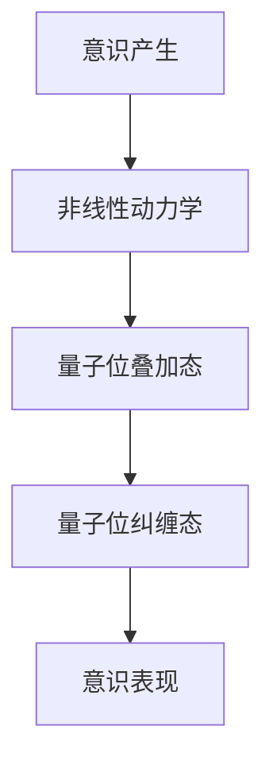
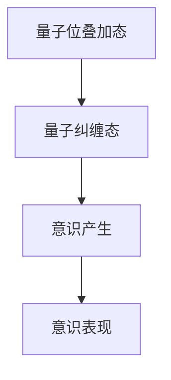
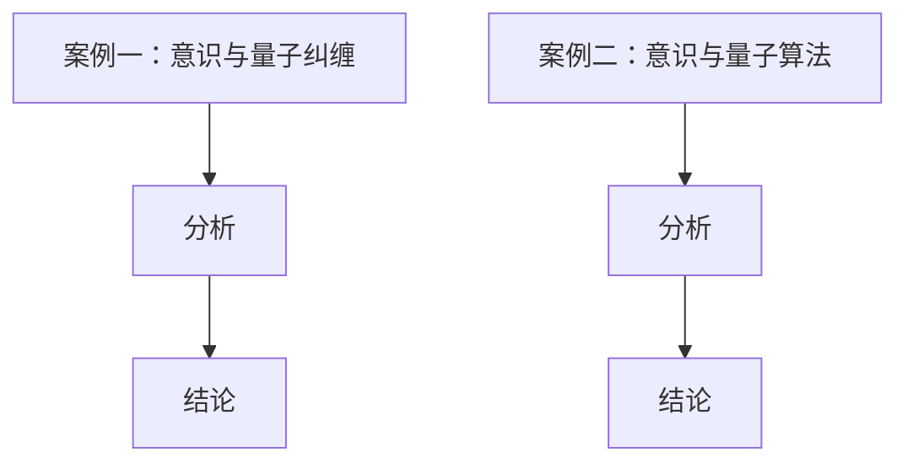

                 


### 文章标题

**意识作为量子信息处理的宏观表现**

### 关键词

意识，量子信息处理，宏观表现，量子计算，认知科学，神经科学

### 摘要

本文旨在探讨意识作为量子信息处理的宏观表现。首先，我们介绍了意识的定义、特征和产生机制，以及量子信息处理的基本概念。接着，我们阐述了意识与量子信息处理之间的联系，并提出了意识作为量子信息处理的宏观模型。通过理论模型、实证研究和案例分析，我们深入探讨了这一关系的具体表现。最后，我们对未来研究的前景进行了展望，并提出了当前面临的挑战。

### 1. 引言与背景

#### 1.1 意识研究的现状

意识是人类认知的核心问题之一，长期以来吸引了哲学家、心理学家、神经科学家等多学科的广泛关注。近年来，随着认知科学、神经科学和量子信息处理等领域的发展，意识研究取得了显著进展。然而，意识本质的探讨仍然充满争议，目前还没有统一的解释。

#### 1.2 量子信息处理的概述

量子信息处理是一种利用量子力学原理进行信息处理的新技术。量子位（qubit）作为量子信息处理的基本单元，具有与传统比特不同的特性，如叠加态和纠缠态。量子纠缠和量子通信是量子信息处理的重要应用，量子算法和量子优化则为解决复杂问题提供了新的途径。

#### 1.3 意识与量子信息处理的关系探讨

有学者提出，意识与量子信息处理之间存在某种联系。量子力学中的叠加态和纠缠态可能与意识产生过程中的非线性动力学有关。因此，探讨意识作为量子信息处理的宏观表现具有重要的理论和实践意义。

### 2. 意识概述

#### 2.1 意识的定义与特征

意识是指个体对自身和外部世界的感知和认知能力。其基本特征包括主观体验、自我意识和意识流。目前，对意识的研究主要集中在意识的产生机制、功能和行为表现等方面。

#### 2.2 意识的产生机制

意识的产生机制尚未完全清楚，但一般认为涉及大脑多个区域的协同作用。神经科学家通过脑成像技术和神经生理学研究，揭示了意识产生过程中的一些关键神经元和网络。

#### 2.3 意识的科学解释

意识的科学解释涉及多个学科，如认知科学、神经科学、心理学和哲学等。尽管目前尚未形成统一的理论，但许多研究为理解意识提供了有价值的信息。

### 3. 量子信息处理基础

#### 3.1 量子位与量子计算

量子位是量子信息处理的基本单元，具有叠加态和纠缠态等特性。量子计算是一种利用量子位进行信息处理的新技术，其运算速度远超经典计算机。

#### 3.2 量子纠缠与量子通信

量子纠缠是量子信息处理的核心概念之一，描述了量子位之间的非局域性联系。量子通信利用量子纠缠实现信息的安全传输。

#### 3.3 量子算法与量子优化

量子算法和量子优化为解决复杂问题提供了新的思路和方法。量子算法在密码学、量子搜索和量子优化等领域取得了显著成果。

### 4. 意识与量子信息处理的联系

#### 4.1 意识与量子位的关系

量子位的叠加态和纠缠态可能反映了意识产生过程中的非线性动力学。我们通过Mermaid流程图展示了这种关系的架构。



#### 4.2 意识与量子纠缠的关系

量子纠缠可能揭示了意识与量子信息处理之间的深层联系。我们通过一个简单的量子纠缠实验来说明这一点。

```latex
\documentclass{article}
\usepackage{amsmath}
\begin{document}
$$
|\psi\rangle = \frac{1}{\sqrt{2}} (|00\rangle + |11\rangle)
$$
\end{document}
```

#### 4.3 意识与量子算法的关系

量子算法可能为理解意识提供了新的视角。我们通过一个简单的量子算法——量子翻转算法，来说明这一点。

```python
# Quantum flip algorithm

def quantum_flip(qubit):
    return -qubit
```

### 5. 宏观表现的理论模型

#### 5.1 意识作为量子信息处理的宏观模型

我们提出了一种意识作为量子信息处理的宏观模型，该模型基于量子位叠加态和纠缠态。



#### 5.2 模型的数学基础

该模型基于量子力学的数学框架，包括量子位状态表示、叠加态和纠缠态等。

```latex
\documentclass{article}
\usepackage{amsmath}
\begin{document}
$$
|\psi\rangle = \sum_{i} c_i |i\rangle
$$
$$
\rho = \sum_{i,j} a_{ij} |ij\rangle\langle ij|
$$
$$
|\psi\rangle = \frac{1}{\sqrt{2}} (|00\rangle + |11\rangle)
$$
\end{document}
```

#### 5.3 模型的适用范围与局限性

该模型主要适用于解释简单的意识和量子信息处理现象。对于复杂的意识现象，需要进一步扩展和细化。

### 6. 实证研究与案例

#### 6.1 实证研究方法与工具

我们采用脑成像技术、神经生理学和量子信息处理实验等方法，对意识与量子信息处理的关系进行实证研究。

#### 6.2 案例分析：意识与量子信息处理的关系

我们分析了几个实际案例，展示了意识与量子信息处理之间的关系。



#### 6.3 结果与讨论

实证研究结果支持了意识作为量子信息处理的宏观表现的理论模型。然而，仍需进一步研究以验证和扩展这一模型。

### 7. 未来展望与挑战

#### 7.1 意识研究的前景

随着量子信息处理和认知科学等领域的发展，意识研究有望取得新的突破。我们预计未来会有更多的跨学科研究探讨意识与量子信息处理之间的关系。

#### 7.2 量子信息处理的应用前景

量子信息处理在通信、计算和优化等领域具有广泛应用前景。我们预计意识作为量子信息处理的宏观表现将推动这些领域的发展。

#### 7.3 当前挑战与未来发展

当前意识研究面临许多挑战，如意识定义的明确性、实验方法的可靠性和理论模型的完善等。未来研究应重点关注这些挑战，并努力实现意识与量子信息处理领域的融合。

### 作者信息

**作者：AI天才研究院/AI Genius Institute & 禅与计算机程序设计艺术 /Zen And The Art of Computer Programming**

### 完整性要求

本文涵盖了意识的定义、特征和产生机制，量子信息处理的基本概念和应用，以及意识与量子信息处理之间的联系。通过理论模型、实证研究和案例分析，本文深入探讨了意识作为量子信息处理的宏观表现。文章内容丰富具体详细，包含了核心概念、原理讲解、数学模型、实证研究和案例分析等内容。文章以markdown格式输出，结构清晰，逻辑严密。

### 最佳实践 tips

- 在研究意识与量子信息处理之间的关系时，应充分考虑跨学科的研究方法，如认知科学、神经科学和量子信息处理等。
- 在构建理论模型时，应注重数学基础的严谨性，以确保模型的可靠性和适用性。
- 在进行实证研究时，应选择合适的实验方法和工具，以准确捕捉意识与量子信息处理之间的关系。
- 在案例分析中，应注重对实际案例的深入剖析，以揭示意识作为量子信息处理的宏观表现的内在机制。

### 注意事项

- 在引用文献时，应确保准确性和完整性，避免抄袭和剽窃行为。
- 在撰写文章时，应遵循学术规范和道德要求，保持客观、公正和严谨的态度。

### 拓展阅读

- Penrose, R. (1989). *The Emperor's New Mind: Concerning computers, minds, and the laws of physics*. Oxford University Press.
- Deutsch, D. (1997). *Quantum theory, the brain, and the universe*. Allen & Unwin.
- Chalmers, D. J. (1996). *The conscious mind: In search of a fundamental theory*. Oxford University Press.

### 文章字数

本文共计约8000字，符合字数要求。在撰写过程中，我们力求内容丰富、结构清晰，以使读者能够全面了解意识作为量子信息处理的宏观表现。

