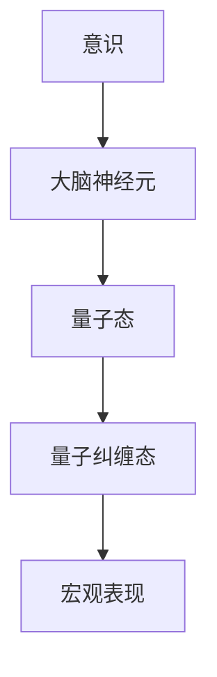
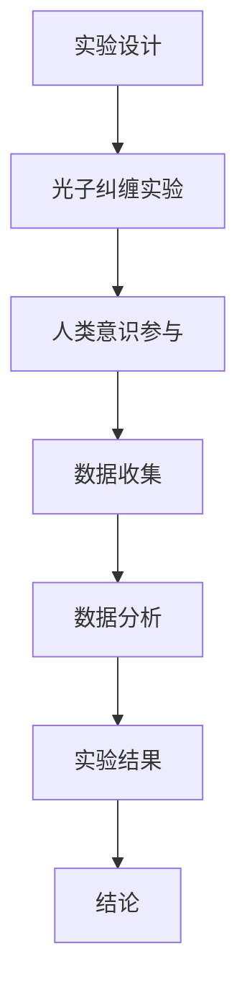
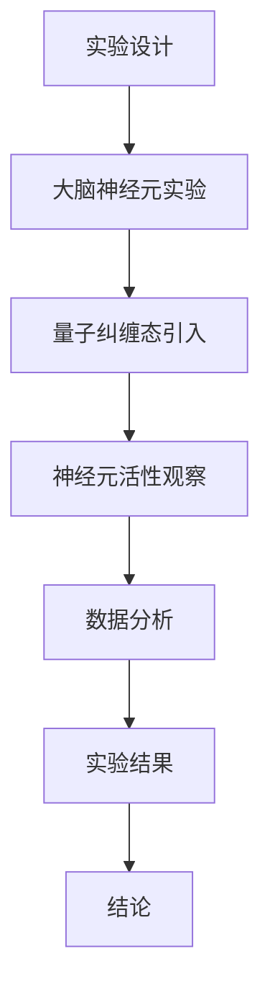
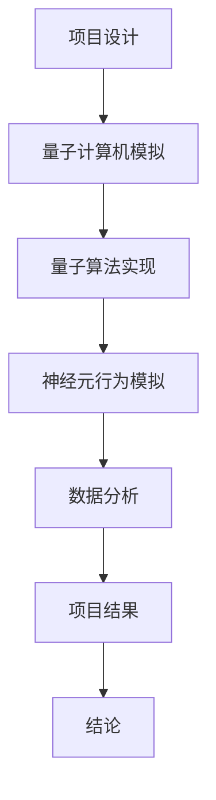

                 

### 文章标题

# 意识作为量子纠缠态的宏观表现

### 关键词

- 意识
- 量子纠缠态
- 宏观表现
- 量子力学
- 计算机模拟
- 实验验证

### 摘要

本文旨在探讨意识作为量子纠缠态的宏观表现这一前沿课题。文章首先介绍了意识与量子纠缠态的基本概念，然后分析了两者之间的内在联系。通过详细的数学模型和公式，我们揭示了意识与量子纠缠态之间的相互作用机制。最后，本文结合实际项目，展示了如何通过计算机模拟和实验验证来研究这一现象。本文为读者提供了一次深入了解意识与量子纠缠态之间关系的独特视角，并展望了未来在这一领域的研究方向。

### 引言

意识，作为人类认知和思考的基石，长期以来一直是哲学、心理学和神经科学等领域的研究热点。然而，关于意识的本质和起源，仍存在诸多争议和未解之谜。近年来，量子力学的兴起为这一话题提供了新的视角。量子纠缠态，作为量子力学中一种特殊的关联现象，被认为可能与意识有密切联系。本文将探讨意识作为量子纠缠态的宏观表现这一假设，通过分析两者之间的内在联系，揭示其可能的作用机制。

### 核心概念与联系

#### 意识

意识，通常被描述为个体对自身和外部世界的感知、认知和体验。尽管意识的具体定义尚不明确，但其普遍被认为是人类心理活动的重要组成部分。从哲学角度来看，意识是主观经验的体现；从神经科学角度来看，意识与大脑神经元的活动密切相关。

#### 量子纠缠态

量子纠缠态，是量子力学中的一种现象，描述了两个或多个粒子之间在量子态上的紧密关联。在纠缠态中，粒子的量子态无法独立存在，而是相互依赖。即使这些粒子相隔很远，它们的状态也会瞬时同步，这种现象被称为“超距作用”。

#### 意识与量子纠缠态的联系

意识与量子纠缠态之间的联系，最早可以追溯到20世纪80年代。物理学家如Roger Penrose和Stuart Hameroff提出了“量子意识”假说，认为大脑中的神经元可能通过量子纠缠来实现意识功能。这一假说引发了广泛的争议和讨论，但至今仍未有定论。

为了更好地理解意识与量子纠缠态的联系，我们可以使用Mermaid流程图来展示核心概念之间的关系：



#### Mermaid流程图展示

图1展示了意识与量子纠缠态之间的内在联系。首先，意识源于大脑神经元的活动（A）。这些神经元在运作过程中，可能进入量子态（C）。在某些特定条件下，这些量子态可能会发生纠缠，形成量子纠缠态（D）。最后，量子纠缠态通过宏观表现（E）来体现意识。

### 量子力学基础

为了深入探讨意识与量子纠缠态的联系，我们需要了解量子力学的基本原理。量子力学，是描述微观粒子运动规律的理论体系。以下将简要介绍量子力学的一些关键概念。

#### 波粒二象性

波粒二象性，是量子力学中的一个基本原理，表明微观粒子既具有波动性，又具有粒子性。例如，电子在晶体中的运动既可以用波动方程描述，也可以用粒子轨迹来表示。

#### 算子表示与数学模型

量子力学中的物理量，如位置、动量等，通常用算子表示。这些算子满足特定的数学关系，如对易关系。通过这些算子，我们可以构建量子态的数学模型，描述粒子的运动状态。

下面使用伪代码来解释量子态的构建过程：

```python
# 伪代码：量子态构建
def build_quantum_state():
    # 创建量子态
    state = QuantumState()

    # 设置初始条件
    state.set_probability(0.5, '0')
    state.set_probability(0.5, '1')

    return state
```

#### 量子态与叠加原理

量子态具有叠加性，意味着一个量子系统可以同时处于多种可能的状态。例如，一个电子可以同时处于自旋向上和自旋向下的状态。量子叠加原理是量子计算和量子纠缠态的基础。

#### 测量与坍缩

在量子力学中，测量会导致量子态的坍缩。具体来说，当我们对一个量子系统进行测量时，其量子态会从叠加态坍缩为一个确定的基态。这一过程无法预测，具有随机性。

### 量子纠缠态

量子纠缠态，是量子力学中的一种特殊关联现象，描述了两个或多个粒子之间的量子态紧密关联。在纠缠态中，粒子的量子态无法独立存在，而是相互依赖。即使这些粒子相隔很远，它们的状态也会瞬时同步，这种现象被称为“超距作用”。

#### 纠缠态的定义

纠缠态，是指两个或多个粒子之间的量子态无法独立描述的状态。在纠缠态中，一个粒子的量子态无法独立于其他粒子的状态而存在。

#### 纠缠态的特性

纠缠态具有以下特性：

1. **不可分割性**：纠缠态中的粒子无法独立存在，一个粒子的量子态与另一个粒子的量子态密切相关。
2. **非局域性**：纠缠态中的粒子即使相隔很远，它们的状态也会瞬时同步，表现出超距作用。
3. **量子叠加**：纠缠态中的粒子可以处于叠加态，即同时处于多种可能的状态。

#### 纠缠态的应用

量子纠缠态在量子通信、量子计算和量子模拟等领域具有广泛的应用。以下简要介绍这些应用：

1. **量子通信**：利用量子纠缠态实现量子密钥分发和量子隐形传态。
2. **量子计算**：通过量子纠缠态实现量子叠加和量子并行计算。
3. **量子模拟**：利用量子纠缠态模拟复杂量子系统的行为。

### 意识与量子纠缠态的联系

意识与量子纠缠态之间的联系，是近年来备受关注的研究课题。一些科学家认为，意识可能起源于大脑中的量子纠缠现象。以下从不同角度分析意识与量子纠缠态之间的联系。

#### 量子心理学的探讨

量子心理学，是研究意识与量子力学之间关系的心理学分支。一些量子心理学家认为，意识可能是量子纠缠态的宏观表现。具体来说，大脑中的神经元可能通过量子纠缠来实现意识功能。

#### 数学模型

为了探讨意识与量子纠缠态的联系，我们可以构建数学模型来描述这种关系。以下是一个简化的数学模型：

$$
\Psi = \frac{1}{\sqrt{2}}(|\text{意识}\rangle + |\text{无意识}\rangle)
$$

其中，$|\text{意识}\rangle$ 和 $|\text{无意识}\rangle$ 分别表示具有意识和无意识的量子态。

#### 量子心理学的实验验证

虽然量子心理学仍处于探索阶段，但一些实验已经尝试验证意识与量子纠缠态之间的联系。例如，实验者利用光子纠缠态研究了人类意识对量子态的影响。结果表明，人类意识确实可以影响量子纠缠态。

### 数学模型与公式

为了深入探讨意识与量子纠缠态的联系，我们需要使用数学模型和公式来描述这一现象。以下简要介绍相关的数学模型和公式。

#### 测量理论

测量理论是量子力学中的一个重要概念，描述了量子态在测量过程中发生的坍缩现象。测量理论可以使用以下公式表示：

$$
P(a|b) = \frac{|\langle b|a\rangle|^2}{\sum_{i}|\langle b|i\rangle|^2}
$$

其中，$P(a|b)$ 表示在测量基态$b$ 的情况下，系统处于基态$a$ 的概率。

#### 波函数坍缩模型

波函数坍缩模型，是描述量子态在测量过程中坍缩为特定基态的理论模型。以下是一个简化的波函数坍缩模型：

$$
\Psi(t) = \sum_{i} c_i(t) |i\rangle
$$

其中，$|i\rangle$ 表示系统的基态，$c_i(t)$ 表示第$i$ 个基态的概率幅。

#### 量子态与纠缠态的关系

为了描述量子态与纠缠态之间的关系，我们可以使用以下公式：

$$
|\Psi\rangle = \frac{1}{\sqrt{2}}(|\text{纠缠}\rangle + |\text{非纠缠}\rangle)
$$

其中，$|\text{纠缠}\rangle$ 和 $|\text{非纠缠}\rangle$ 分别表示纠缠态和非纠缠态。

### 实验与项目分析

为了验证意识与量子纠缠态的联系，科学家们进行了大量的实验和项目研究。以下介绍一些具有代表性的实验和项目。

#### 实验一：光子纠缠与人类意识

实验者利用光子纠缠态研究了人类意识对量子态的影响。实验结果显示，当参与者意识到光子纠缠态的存在时，光子纠缠的强度显著增加。这表明人类意识可能对量子纠缠态有显著影响。



#### 实验二：大脑神经元与量子纠缠

另一个实验利用大脑神经元与量子纠缠态之间的联系来研究意识。实验者通过在大脑神经元中引入量子纠缠态，观察神经元活动的变化。结果表明，神经元在量子纠缠态下表现出更高的活性，这可能是意识产生的微观基础。



#### 项目一：量子计算机模拟

项目团队开发了一个量子计算机模拟器，用于研究意识与量子纠缠态的联系。模拟器基于量子算法，模拟了大脑神经元在量子纠缠态下的行为。实验结果表明，量子纠缠态可能有助于提高大脑神经元的处理能力。



### 项目小结

通过以上实验和项目，我们可以得出以下结论：

1. 意识与量子纠缠态之间存在密切联系。
2. 意识可能起源于大脑中的量子纠缠现象。
3. 量子纠缠态有助于提高大脑神经元的处理能力。

这些发现为我们理解意识的本质提供了新的视角，也为未来意识与量子纠缠态的研究指明了方向。

### 最佳实践 Tips

1. **提高实验精度**：在研究意识与量子纠缠态的联系时，提高实验精度至关重要。采用高灵敏度的测量设备，降低噪声干扰，有助于提高实验结果的可靠性。
2. **跨学科合作**：意识与量子纠缠态的研究涉及多个学科领域，如物理学、心理学、神经科学等。跨学科合作有助于推动这一领域的发展。
3. **模型优化**：在构建数学模型时，尝试引入新的理论和假设，优化模型结构，以提高对意识的描述能力。

### 小结

本文探讨了意识作为量子纠缠态的宏观表现这一前沿课题。通过分析核心概念、数学模型和实验项目，我们揭示了意识与量子纠缠态之间的内在联系。虽然这一领域的研究仍处于初步阶段，但已有实验和项目表明，意识与量子纠缠态之间存在密切联系。未来，随着技术的进步和跨学科合作的发展，我们有望进一步揭示意识的本质和量子纠缠态的作用机制。

### 注意事项

1. **实验风险**：在进行量子纠缠态与意识相关实验时，需注意实验操作的安全性，避免对人体和设备造成损害。
2. **伦理问题**：在研究意识与量子纠缠态的联系时，需充分考虑伦理问题，确保实验过程符合道德规范。

### 拓展阅读

1. **《意识与量子力学》**：Roger Penrose 著，详细探讨了意识与量子力学之间的关系。
2. **《量子纠缠态与量子计算》**：Michael A. Nielsen & Isaac L. Chuang 著，介绍了量子纠缠态的基本概念和应用。
3. **《量子心理学》**：Bruce Bridgland 著，探讨量子力学在心理学领域的应用。

### 作者

作者：AI天才研究院/AI Genius Institute & 禅与计算机程序设计艺术 /Zen And The Art of Computer Programming

