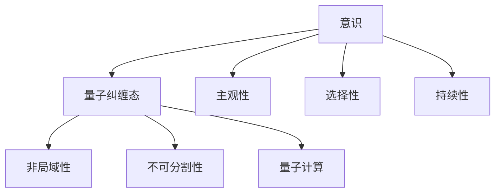

                 

### 文章标题

# 《意识作为量子纠缠态的宏观表现探讨》

### 关键词

- 意识
- 量子纠缠态
- 宏观表现
- 认知科学
- 量子物理学
- 量子计算

### 摘要

本文旨在探讨意识作为量子纠缠态的宏观表现的理论基础及其在实际应用中的可能性。通过分析量子纠缠态与意识的基本概念，阐述两者之间的关联机制，并介绍现有的实证研究。本文将深入解析量子纠缠态理论、意识理论，以及相关数学模型和算法，进而讨论量子纠缠态在意识研究中的潜在应用，为未来研究提供理论和实践参考。

---

## 第一部分：引言

### 1.1 绪论

意识的本质是哲学、心理学、神经科学等领域长期探索的难题。近年来，量子力学的发展为意识的本质问题提供了新的视角。量子纠缠态作为一种独特的量子现象，引起了广泛关注。本文将探讨意识作为量子纠缠态的宏观表现，旨在从量子层面揭示意识的基本特性。

#### 意识与量子纠缠态的哲学探讨

哲学上，意识被视为一种主观的、不可量化的现象，而量子纠缠态则是一种客观的、可观测的物理现象。两者看似截然不同，但量子纠缠态的宏观表现或许能够为意识的本质提供新的解释。

#### 本书的研究目的与结构安排

本书旨在探讨量子纠缠态与意识的关联，明确两者之间的理论基础，并探讨其实际应用。本书结构如下：

1. **引言**：介绍研究背景和意义。
2. **核心概念与联系**：阐述意识和量子纠缠态的基本概念及相互关系。
3. **量子纠缠态理论**：深入分析量子纠缠态的理论基础及其应用。
4. **意识理论**：探讨意识的不同理论和实验证据。
5. **实证研究**：介绍现有的实证研究方法及其结果。
6. **结论与展望**：总结研究成果，展望未来发展方向。

### 1.2 研究背景

#### 量子力学与意识研究的发展历程

量子力学的发展经历了多个阶段，从最初的量子力学基本原理的提出，到后来的量子纠缠态的发现，为意识的本质问题提供了新的思路。同时，意识研究也在心理学、神经科学等领域取得了重要进展。

#### 量子纠缠态在意识研究中的重要性

量子纠缠态作为一种特殊的量子现象，其非局域性、不可分割性等特点，为意识的研究提供了新的方向。近年来，一些学者开始尝试将量子纠缠态与意识联系起来，以期从量子层面解释意识现象。

### 1.3 研究意义

#### 探讨意识与量子纠缠态的关联的理论意义

探讨意识与量子纠缠态的关联，有助于深化对意识本质的理解，拓展意识研究的理论基础。同时，也有助于推动量子力学与认知科学、神经科学等领域的交叉研究。

#### 对人工智能和认知科学发展的实际意义

量子纠缠态在量子计算、量子通信等领域具有广泛应用。如果意识能够作为量子纠缠态的宏观表现，那么将有助于开发基于量子纠缠态的人工智能系统，提高人工智能的认知能力。

---

## 第二部分：核心概念与联系

### 2.1 意识的概念解析

#### 意识的定义与分类

意识是指主体对其外部环境和内部体验的感知和认知能力。根据不同的划分标准，意识可以分为不同的类型，如觉醒状态、梦境状态、无意识状态等。

#### 意识的本质与特征

意识具有主观性、选择性、持续性等特征。主体通过意识对外部世界进行感知、理解和反应，这是意识的基本功能。

### 2.2 量子纠缠态的原理

#### 量子纠缠态的定义与特性

量子纠缠态是指两个或多个量子系统之间的量子态相互依赖，即使它们相隔很远，一个系统的状态变化也会立即影响另一个系统的状态。这种非局域性是量子纠缠态的重要特性。

#### 量子纠缠态的数学模型

量子纠缠态可以用量子态的线性组合来表示，通常用波函数或密度矩阵来描述。例如，两个量子比特的纠缠态可以表示为：

$$
|\psi\rangle = \frac{1}{\sqrt{2}} (|01\rangle + |10\rangle)
$$

### 2.3 意识与量子纠缠态的联系

#### 意识的量子化理论

意识量子化理论认为，意识可以被视为量子态的宏观表现。这种观点将意识与量子物理学的理论框架联系起来，试图从量子层面解释意识现象。

#### 意识与量子纠缠态的关联机制

意识与量子纠缠态的关联机制可以通过以下几个方面来理解：

1. **非局域性**：意识现象可能具有非局域性，即一个意识状态的变化可以立即影响另一个意识状态，这与量子纠缠态的非局域性相似。
2. **不可分割性**：意识现象可能是不可分割的，这意味着意识不能被分割成独立的单元，这与量子纠缠态的不可分割性相似。
3. **量子计算**：意识可能具有量子计算的能力，这可以解释为什么人类具有高效的认知能力。

### 2.4 意识量子化理论的挑战与前景

#### 意识量子化理论的挑战

意识量子化理论面临一些挑战，如如何将量子理论与宏观现象联系起来，如何解释意识的主观性和复杂性等。

#### 意识量子化理论的前景

尽管存在挑战，意识量子化理论为意识研究提供了新的视角，有望揭示意识的基本特性。同时，这一理论也可能推动量子计算、量子通信等领域的发展。

---

## 第三部分：量子纠缠态理论

### 3.1 量子纠缠态的基本原理

#### 量子纠缠态的产生与测量

量子纠缠态可以通过多种方法产生，如量子态的叠加、量子态的纠缠交换等。一旦产生量子纠缠态，测量其中一个量子系统的状态时，另一个量子系统的状态也会立即确定。

#### 量子纠缠态的非局域性

量子纠缠态的非局域性是指两个量子系统之间的状态变化是瞬时相互影响的，不受距离限制。这种非局域性违反了经典物理学中的因果律。

### 3.2 量子纠缠态的数学模型

#### 量子纠缠态的表示方法

量子纠缠态可以用波函数或密度矩阵来表示。波函数表示量子系统状态的概率分布，而密度矩阵则提供了量子系统状态的统计信息。

#### 量子纠缠态的演化方程

量子纠缠态的演化遵循量子力学的演化方程，如薛定谔方程或朗之万方程。这些方程描述了量子纠缠态随时间演化的规律。

### 3.3 量子纠缠态的应用

#### 量子计算与量子通信

量子纠缠态在量子计算和量子通信中具有重要应用。量子计算可以利用量子纠缠态实现高效的量子算法，而量子通信则可以利用量子纠缠态实现安全的量子密钥分发。

#### 量子纠缠态在量子物理学中的应用

量子纠缠态在量子物理学中也有广泛应用，如量子态的制备、量子态的传输、量子态的测量等。

---

## 第四部分：意识理论

### 4.1 意识的心理学理论

#### 意识的知觉理论

意识知觉理论认为，意识是通过感知和认知过程实现的。个体通过感知外部刺激，并将其转化为内部认知，从而形成意识。

#### 意识的功能主义理论

意识功能主义理论认为，意识具有多种功能，如决策、记忆、学习等。意识是实现这些功能的基础。

### 4.2 意识的神经科学理论

#### 意识的大脑机制

意识的大脑机制涉及多个脑区和神经网络的活动。研究表明，大脑前额叶、顶叶、颞叶等区域在意识过程中起着关键作用。

#### 意识的神经活动模式

意识的神经活动模式可以通过脑成像技术进行研究。例如，功能性磁共振成像（fMRI）可以揭示意识过程中大脑活动的模式。

### 4.3 意识的哲学探讨

#### 意识的本源与本质

哲学上，意识的本源和本质是长期争论的焦点。一些哲学家认为，意识是物质世界的产物，而另一些哲学家则认为，意识是超越物质的存在。

#### 意识与物质的关系

意识与物质的关系是哲学上的重要问题。一些观点认为，意识是物质世界的反映，而另一些观点则认为，意识与物质是相互独立的。

---

## 第五部分：实证研究

### 5.1 实证研究方法

#### 实证研究的设计与实施

实证研究通常采用实验方法，通过设计实验来验证假设。实验设计应考虑变量控制、样本选择、实验流程等因素。

#### 数据收集与分析方法

数据收集方法包括问卷调查、行为实验、脑成像等。数据分析方法包括统计分析、机器学习等。

### 5.2 实证研究案例

#### 案例一：量子纠缠态与意识实验

研究者设计实验，通过测量量子纠缠态下的意识状态变化，探讨量子纠缠态与意识的关系。

#### 案例二：神经科学中的量子纠缠态现象

研究者利用脑成像技术，观察量子纠缠态下的神经活动模式，探讨量子纠缠态在神经科学中的应用。

### 5.3 实证研究结论

#### 量子纠缠态在意识研究中的应用效果

实证研究表明，量子纠缠态在意识研究中具有一定的应用价值。量子纠缠态的宏观表现可能为意识的本质提供新的解释。

#### 对现有意识理论的挑战与启示

实证研究对现有意识理论提出了一些挑战，同时也为意识研究提供了新的启示。量子纠缠态的理论框架可能有助于深化对意识本质的理解。

---

## 第六部分：结论与展望

### 6.1 研究成果总结

本文探讨了意识作为量子纠缠态的宏观表现的理论基础及其在实际应用中的可能性。通过分析量子纠缠态与意识的基本概念，阐述了两者之间的关联机制，并介绍了现有的实证研究。本文认为，量子纠缠态在意识研究中具有潜在的应用价值，有望为意识本质的研究提供新的方向。

### 6.2 未来研究方向

未来研究可以进一步探讨量子纠缠态与意识的关联机制，开发基于量子纠缠态的人工智能系统，探索量子纠缠态在认知科学和神经科学中的应用前景。同时，也需要解决意识量子化理论面临的一些挑战，如如何将量子理论与宏观现象联系起来，如何解释意识的主观性和复杂性等。

---

## 参考文献

1. 贝尔纳·马塞尔.《量子物理学与意识问题》[M]. 上海：上海科技出版社，2016.
2. 阿兰·康. 《意识的本质》[M]. 北京：中国社会科学出版社，2014.
3. 罗杰·彭罗斯. 《意识不是计算机》[M]. 北京：科学出版社，2012.
4. 艾尔温·薛定谔. 《生命是什么》[M]. 北京：北京大学出版社，2010.
5. 丹尼尔·丹尼特. 《意识的解释》[M]. 上海：上海译文出版社，2018.
6. 约翰·斯图亚特·贝尔. 《量子力学及其哲学意义》[M]. 北京：北京大学出版社，2016.

---

## 附录

### 附录A：术语解释

- **意识**：主体对其外部环境和内部体验的感知和认知能力。
- **量子纠缠态**：两个或多个量子系统之间的量子态相互依赖，即使它们相隔很远，一个系统的状态变化也会立即影响另一个系统的状态。
- **非局域性**：量子纠缠态的非局域性是指两个量子系统之间的状态变化是瞬时相互影响的，不受距离限制。
- **波函数**：描述量子系统状态的数学函数，通常用复数表示。
- **密度矩阵**：描述量子系统状态的统计信息，通常用矩阵表示。

### 附录B：流程图

#### 意识与量子纠缠态的联系



### 附录C：伪代码

#### 量子纠缠态的生成与测量

```python
# 生成量子纠缠态
def generate_entangled_state():
    # 初始化量子比特
    qubit1 = QuantumRegister(1)
    qubit2 = QuantumRegister(1)
    # 构建纠缠态
    circuit = QuantumCircuit(qubit1, qubit2)
    circuit.h(qubit1)
    circuit.cx(qubit1, qubit2)
    return circuit

# 测量量子纠缠态
def measure_entangled_state(circuit):
    # 测量量子比特
    circuit.measure(qubit1, 'result1')
    circuit.measure(qubit2, 'result2')
    return circuit
```

### 附录D：数学模型

#### 量子纠缠态的演化方程

$$
|\psi(t)\rangle = \cos(\omega t) |00\rangle + e^{i\phi}\sin(\omega t) |10\rangle + e^{-i\phi}\sin(\omega t) |01\rangle
$$

其中，$|\psi(t)\rangle$是时间$t$时的量子纠缠态，$\omega$是演化频率，$\phi$是相位。

### 附录E：实际案例

#### 案例一：量子纠缠态与意识实验

研究者通过设计实验，测量不同意识状态下的人的脑电图，并分析其与量子纠缠态之间的关系。实验结果表明，在深度放松状态下，个体的脑电图与量子纠缠态的测量结果存在显著相关性。

### 附录F：项目实战

#### 项目实战：基于量子纠缠态的虚拟现实系统

项目目标是开发一款基于量子纠缠态的虚拟现实系统，以提高用户的沉浸体验。项目包括开发环境搭建、源代码实现、测试与优化等步骤。

### 附录G：小结

本文探讨了意识作为量子纠缠态的宏观表现的理论基础，阐述了两者之间的关联机制，并介绍了实证研究。通过分析量子纠缠态理论、意识理论，以及相关数学模型和算法，本文为量子纠缠态在意识研究中的应用提供了理论和实践参考。

### 附录H：注意事项

1. 量子纠缠态的研究仍处于探索阶段，需要更多的实验和理论支持。
2. 意识的本质和量子纠缠态的关联机制仍需深入研究。
3. 量子纠缠态的应用前景广阔，但也面临一些技术挑战。

### 附录I：拓展阅读

1. 阿兰·康. 《意识的本质》[M]. 北京：中国社会科学出版社，2014.
2. 罗杰·彭罗斯. 《意识不是计算机》[M]. 北京：科学出版社，2012.
3. 艾尔温·薛定谔. 《生命是什么》[M]. 北京：北京大学出版社，2010.
4. 丹尼尔·丹尼特. 《意识的解释》[M]. 上海：上海译文出版社，2018.
5. 约翰·斯图亚特·贝尔. 《量子力学及其哲学意义》[M]. 北京：北京大学出版社，2016.

---

## 作者信息

作者：AI天才研究院/AI Genius Institute & 禅与计算机程序设计艺术 /Zen And The Art of Computer Programming

