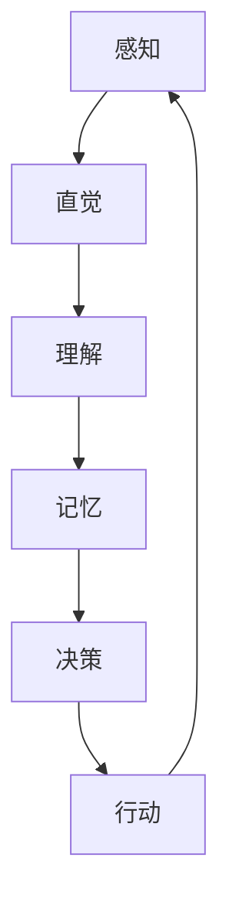
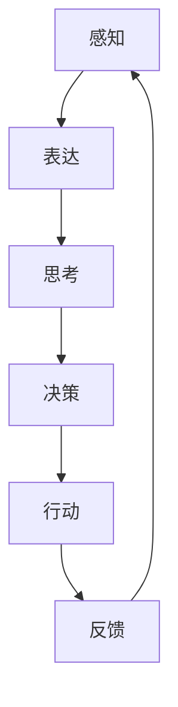
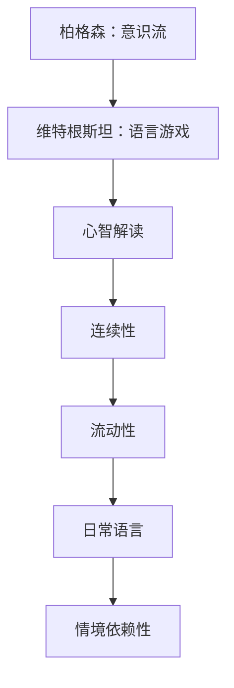

                 

### 引言：心智与语言解读的重要性

心智（Mind）是人类认知的核心，它包括了我们的感知、思考、记忆、判断和决策等复杂的心理活动。在计算机科学和人工智能领域，对心智的研究不仅仅是为了理解人类思维的本质，更是为了构建更加智能化、具有自主学习和决策能力的系统。而语言作为心智的载体，是沟通思想和传递知识的桥梁，同时也是理解心智的关键。

在哲学领域，柏格森（Henri Bergson）和维特根斯坦（Ludwig Wittgenstein）是两位对心智与语言解读具有重要贡献的哲学家。他们的理论和思想为我们理解心智提供了不同的视角和方法。

柏格森（Henri Bergson，1859-1941）是法国著名哲学家，他提出了“生命哲学”和“意识流”理论。柏格森认为，生命和心智的本质是流动的、变化的，而非静止的。他的意识流理论强调了思维的连续性和复杂性，指出心智不是一系列独立的事件，而是一个流动的、连续的体验过程。

维特根斯坦（Ludwig Wittgenstein，1889-1951）是奥地利-英国哲学家，他的思想对20世纪哲学产生了深远的影响。维特根斯坦主张语言是心智的反映，日常语言的使用是理解世界和思维的基础。他的图像理论（Picture Theory）认为，语言的意义来源于它与世界的关系，类似于图像与景象之间的关系。

本文的目的在于深入探讨柏格森和维特根斯坦对心智的不同解读，并比较他们理论之间的异同点。我们将通过以下几个部分展开讨论：

1. **柏格森的理论与心智解读**：介绍柏格森的生平和哲学贡献，详细解释他的“生命哲学”和“意识流”理论，并展示其心智解读的流程图和伪代码实现。

2. **维特根斯坦的理论与心智解读**：介绍维特根斯坦的哲学贡献，特别是他的图像理论，阐述他对心智的解读，并展示相关的流程图和伪代码实现。

3. **比较与联系**：分析柏格森和维特根斯坦理论的异同点，特别是他们在意识流与日常语言关系上的不同看法。

4. **心智解读的应用**：探讨心智解读在心理学和日常生活中的应用，以及其对这些领域的实际影响。

5. **结论**：总结心智解读的发展趋势和面临的挑战，对未来心智研究的展望。

通过以上步骤，我们将逐步展开对心智与语言解读的深入探讨，以期对计算机科学和人工智能领域的理论研究提供新的启示和思路。

### 关键词

心智、柏格森、意识流、维特根斯坦、语言、哲学、计算机科学、人工智能。

### 摘要

本文探讨了两位著名哲学家柏格森（Henri Bergson）和维特根斯坦（Ludwig Wittgenstein）对心智与语言的不同解读。柏格森通过“生命哲学”和“意识流”理论，强调心智的流动性和连续性；而维特根斯坦则通过“图像理论”认为语言是心智的反映。本文首先介绍了两位哲学家的生平和主要思想，然后详细解析了他们各自的心智解读理论，包括关键概念、流程图和伪代码实现。接着，我们比较了他们的理论异同点，并探讨了这些理论在心理学和日常生活中的应用。最后，本文总结了心智解读的研究趋势和面临的挑战，并提出了未来研究的展望。通过本文的深入探讨，我们期望为计算机科学和人工智能领域的心智研究提供新的视角和启示。

## 第1章 引言：心智与语言解读的重要性

心智（Mind）是心理学和哲学中的重要概念，它涵盖了人类的感知、思考、记忆、判断和决策等复杂的心理活动。心智不仅是人类认知和行为的驱动力，也是人工智能研究和设计的核心目标之一。在人工智能领域，研究者们致力于模拟和实现类似人类心智的功能，以期构建出具有自主学习和决策能力的智能系统。

语言（Language）是心智的重要载体，是人类沟通思想、传递知识和理解世界的基本工具。从哲学的角度来看，语言不仅是一种表达思想的手段，更是心智本身的一部分。哲学家们对心智和语言的关系有着深入的探讨，试图揭示语言如何反映和塑造心智。

在哲学领域，柏格森（Henri Bergson）和维特根斯坦（Ludwig Wittgenstein）是两位对心智与语言解读具有重要贡献的哲学家。他们的理论和思想为我们理解心智和语言提供了不同的视角和方法。

### 心智概念探讨

心智（Mind）是一个复杂的概念，它涉及多个学科的研究，包括心理学、哲学、神经科学和计算机科学。在心理学中，心智通常被定义为个体内在的心理过程和状态，包括感知、记忆、思维、情感和行为等。而哲学中的心智则更侧重于探讨心智的本质和功能。

心智的本质是一个长期争论的话题。一些哲学家认为心智是一种物质过程，与大脑的神经元活动密切相关；而另一些哲学家则认为心智是一种非物质的实体，存在于人类的意识之中。心智的功能则包括感知世界、处理信息、做出决策和行动等。

心智在人类认知和行为中起着至关重要的作用。首先，心智使我们能够感知和理解外部世界，通过感官收集信息并转化为内部心理表征。其次，心智使我们能够记忆过去的信息，利用这些信息进行思考、推理和判断。最后，心智使我们能够规划未来的行为，做出合理的决策。

### 意识流的概念

意识流（Stream of Consciousness）是柏格森哲学中的一个核心概念，它强调了思维的流动性和连续性。意识流理论认为，心智不是一个离散的事件集合，而是一个连续的、流动的过程。在这个过程中，个体的思维是不断变化和发展的，而不是静止不动的。

意识流理论指出，我们的思维不是一个线性序列，而是由一系列片段、意象和记忆组成的复杂网络。这些片段和意象在不同的时间点出现，但又相互关联，形成一个连续的意识流。柏格森认为，这个意识流是生命和心智的本质，它不断推动着我们前进，塑造了我们的感知、情感和行为。

### 日常语言的特性

日常语言（Ordinary Language）是维特根斯坦哲学中的一个重要概念，它强调语言在日常生活中的实际应用和意义。维特根斯坦认为，语言的意义并不是抽象的、固定的，而是由语言在具体情境中的使用决定的。

日常语言的特性包括以下几个方面：

1. **具体性**：日常语言与具体情境和现实世界紧密相关，其意义来源于这些具体情境。

2. **多样性**：日常语言是一个多样化的系统，包含了丰富的词汇和表达方式，以适应不同的交流需求。

3. **灵活性**：日常语言是灵活的，可以根据不同的语境和交流目的进行调整。

4. **具体情境的依赖性**：日常语言的意义依赖于具体情境，不同的情境下，相同的词汇和表达方式可能有不同的含义。

通过上述介绍，我们可以看到，心智和语言在哲学和心理学中具有重要的地位。柏格森和维特根斯坦对心智与语言的解读为我们理解人类思维和行为提供了不同的视角和方法。在接下来的章节中，我们将深入探讨柏格森和维特根斯坦的理论，并比较他们之间的异同点。

## 第2章 柏格森的理论与心智解读

### 2.1 柏格森哲学简介

亨利·柏格森（Henri Bergson）是19世纪末和20世纪初法国最重要的哲学家之一，他的思想对后来的哲学家、社会学家和心理学家产生了深远的影响。柏格森的哲学以生命哲学和意识流理论为核心，对心智的解读提供了独特的视角。

#### 2.1.1 柏格森的生平与贡献

亨利·柏格森于1859年10月18日出生于法国巴黎。他的父亲是一名医生，母亲则是一位音乐家。柏格森在巴黎高等师范学院接受教育，后来在法国科学院工作。他的主要著作包括《笑之研究》（Laughter）、**《 Matter and Memory》（物质与记忆）**和**《创造进化论》（L'Évolution créatrice）**。

柏格森在哲学界的贡献主要体现在以下几个方面：

1. **生命哲学**：柏格森的生命哲学强调生命的创造力和变化性，认为生命是不断流动和进化的过程。他反对机械决定论，主张生命具有自主性和创造性。

2. **意识流理论**：柏格森的意识流理论是他对心智解读的核心，他认为意识流是心智的本质，是思维的连续流动过程，而非一系列孤立的事件。

3. **直觉主义**：柏格森的直觉主义认为，直觉是我们理解世界和把握事物本质的重要能力。他反对逻辑和数学的形式主义，主张通过直觉来感知和理解现实。

#### 2.1.2 柏格森的核心哲学思想

柏格森的核心哲学思想包括以下几个方面：

1. **生命的流动性和创造力**：柏格森认为，生命是一种流动的过程，这种流动是创造性的、不断变化的。他强调生命的不可预测性和创造性，反对机械决定论。

2. **意识流**：柏格森认为，意识流是心智的本质，它是思维的连续流动过程。意识流中的每一个瞬间都是独特的，不可重复的。他强调思维的流动性，认为这种流动性是我们理解世界的关键。

3. **直觉**：柏格森认为，直觉是我们理解事物本质的重要能力。直觉能够超越逻辑和理性的限制，直接感知和把握事物的真实状态。

4. **自由意志**：柏格森认为，自由意志是生命的核心特征之一。他主张生命具有自主性和创造性，不受外界机械决定论的影响。

### 2.2 柏格森对心智的解读

柏格森对心智的解读主要集中在他的意识流理论中。他认为，心智的本质是意识流，这是一个连续的、流动的体验过程。

#### 2.2.1 心智的本质

柏格森认为，心智的本质是意识流，这是一个动态的、流动的过程。意识流中的每一个瞬间都是独特的，不可重复的。他强调心智的连续性和流动性，认为心智不是一个静态的状态，而是一个不断变化的过程。

#### 2.2.2 意识流的运作机制

柏格森认为，意识流的运作机制是通过直觉来实现的。直觉是一种直接感知事物本质的能力，它超越了逻辑和理性的限制。通过直觉，我们可以直接感知和理解意识流中的每个瞬间，把握事物的真实状态。

意识流中的每个瞬间都是独特的，它们相互关联，形成了一个连续的整体。柏格森认为，这个整体是生命的核心，是我们理解世界和心智的基础。

### 2.3 柏格森理论与心智解读的Mermaid流程图

为了更好地理解柏格森的心智解读，我们可以使用Mermaid流程图来展示意识流的运作机制。以下是一个简化的Mermaid流程图：



在这个流程图中，A表示感知，B表示直觉，C表示理解，D表示记忆，E表示决策，F表示行动。这个流程图展示了意识流的基本运作机制，即通过感知、直觉、理解、记忆、决策和行动来实现心智的功能。

### 2.4 伪代码展示：柏格森心智模型的实现

为了更具体地展示柏格森心智模型的实现，我们可以使用伪代码来描述其核心算法。以下是一个简化的伪代码示例：

```plaintext
开始
    初始化感知模块
    初始化直觉模块
    初始化理解模块
    初始化记忆模块
    初始化决策模块
    初始化行动模块

    循环直到结束
        感知当前环境
        使用直觉处理感知信息
        使用理解模块理解感知信息
        使用记忆模块存储和理解信息
        使用决策模块做出决策
        根据决策执行行动
        将行动结果反馈给感知模块
    结束循环

结束
```

在这个伪代码中，我们初始化了感知、直觉、理解、记忆、决策和行动模块。然后，通过一个循环来不断更新这些模块，实现心智的连续运作。

通过以上内容，我们详细介绍了柏格森的理论与心智解读，包括其生平与贡献、核心哲学思想、心智解读及其流程图和伪代码实现。接下来，我们将探讨维特根斯坦的理论与心智解读，进一步比较两位哲学家的观点。

## 第3章 维特根斯坦的理论与心智解读

### 3.1 维特根斯坦哲学简介

路德维希·维特根斯坦（Ludwig Wittgenstein，1889-1951）是20世纪最重要的哲学家之一，他的思想对哲学、语言学、心理学和计算机科学等领域产生了深远的影响。维特根斯坦以其两卷本的著作《逻辑哲学论》（Tractatus Logico-Philosophicus）和后期的作品《哲学研究》（Philosophical Investigations）而闻名于世。

#### 3.1.1 维特根斯坦的生平与贡献

维特根斯坦出生于奥地利的维也纳，他的家庭背景非常优越，其父亲是一位著名工业家。维特根斯坦年轻时对数学和哲学产生了浓厚的兴趣，他在剑桥大学师从伯特兰·罗素（Bertrand Russell）学习逻辑和数学。在哲学界，维特根斯坦的贡献主要体现在以下几个方面：

1. **早期哲学思想**：维特根斯坦的早期著作《逻辑哲学论》提出了他的逻辑原子主义和图像理论。他认为，世界的本质是由逻辑原子组成的，语言和思想可以准确地反映世界。

2. **后期哲学思想**：在《哲学研究》中，维特根斯坦转向日常语言哲学，强调语言的意义取决于其在日常生活中的使用。他主张语言的局限性，并提出了“语言游戏”概念，用以描述语言和思想的活动。

3. **对逻辑和数学的贡献**：维特根斯坦对逻辑和数学的基础进行了深刻的反思，他的思想对逻辑实证主义和形式主义产生了重要影响。

#### 3.1.2 维特根斯坦的核心哲学思想

维特根斯坦的核心哲学思想可以分为早期和后期两个阶段：

1. **早期哲学思想**：

   - **逻辑原子主义**：维特根斯坦认为，世界由逻辑原子组成，这些原子通过逻辑关系组合成更复杂的实体。他的图像理论认为，语言和思想可以精确地反映世界。

   - **世界的不可说性**：在《逻辑哲学论》中，维特根斯坦提出了一些命题是“不可说的”，即它们无法用语言表达。

2. **后期哲学思想**：

   - **日常语言哲学**：在《哲学研究》中，维特根斯坦转向日常语言哲学，认为语言的意义取决于其具体使用情境。他反对逻辑和哲学的抽象概念，主张关注日常语言的实际使用。

   - **语言游戏**：维特根斯坦提出了“语言游戏”概念，用以描述语言和思想的活动。他认为，语言的不同使用方式构成了不同的“语言游戏”，语言的意义在于这些游戏的具体规则。

### 3.2 维特根斯坦对心智的解读

维特根斯坦对心智的解读主要体现在他的后期哲学思想中，特别是日常语言哲学和语言游戏理论。他认为，心智是通过语言的使用来理解的，心智的活动可以被视为一系列语言游戏。

#### 3.2.1 心智与语言的联系

维特根斯坦认为，心智与语言有着紧密的联系。心智的活动是通过语言来表达的，语言不仅是一种表达思想的工具，也是心智本身的一部分。心智的活动可以被视为一系列语言游戏，这些游戏有不同的规则和目的。

#### 3.2.2 日常语言的使用

在维特根斯坦看来，日常语言的使用是理解心智的关键。他认为，哲学的问题往往源于对语言的不恰当使用。通过分析日常语言的使用，我们可以理解心智的活动和意义。日常语言是具体的、情境化的，它的意义不是固定的，而是依赖于具体的使用情境。

#### 3.2.3 语言游戏理论

维特根斯坦的语言游戏理论是他对心智解读的核心。他认为，语言游戏是心智活动的模型，每个语言游戏都有其特定的规则和目的。语言游戏可以包括以下几种：

1. **描述性游戏**：这类游戏用于描述外部世界，例如我们使用语言来描述物体的形状、颜色和位置。

2. **操作性游戏**：这类游戏涉及行动的指导，例如我们使用语言来下命令或指导他人。

3. **规则性游戏**：这类游戏包括各种形式的游戏和活动，例如棋类游戏、体育比赛等。

通过这些语言游戏，我们可以理解心智的活动和意义。心智的活动是多样化的，它不仅仅是简单的感知和记忆，还包括思考、推理、决策和行动。

### 3.3 维特根斯坦理论与心智解读的Mermaid流程图

为了更好地理解维特根斯坦的心智解读，我们可以使用Mermaid流程图来展示其核心概念。以下是一个简化的Mermaid流程图：



在这个流程图中，A表示感知，B表示表达，C表示思考，D表示决策，E表示行动，F表示反馈。这个流程图展示了心智活动的基本流程，即通过感知、表达、思考、决策和行动来实现心智的功能。

### 3.4 伪代码展示：维特根斯坦心智模型的实现

为了更具体地展示维特根斯坦心智模型的实现，我们可以使用伪代码来描述其核心算法。以下是一个简化的伪代码示例：

```plaintext
开始
    初始化感知模块
    初始化表达模块
    初始化思考模块
    初始化决策模块
    初始化行动模块

    循环直到结束
        感知当前环境
        使用表达模块进行信息交流
        使用思考模块进行逻辑推理
        使用决策模块做出决策
        根据决策执行行动
        将行动结果反馈给感知模块
    结束循环

结束
```

在这个伪代码中，我们初始化了感知、表达、思考、决策和行动模块。然后，通过一个循环来不断更新这些模块，实现心智的连续运作。

通过以上内容，我们详细介绍了维特根斯坦的理论与心智解读，包括其生平与贡献、核心哲学思想、心智解读及其流程图和伪代码实现。接下来，我们将比较柏格森和维特根斯坦的理论，探讨他们之间的异同点。

## 第4章 比较与联系

在上一章中，我们分别介绍了柏格森和维特根斯坦的理论与心智解读。柏格森通过生命哲学和意识流理论强调心智的流动性和连续性，而维特根斯坦则通过日常语言哲学和语言游戏理论探讨心智与语言的关系。在这一章中，我们将比较这两位哲学家的理论，分析他们在意识流与日常语言关系上的异同点。

### 4.1 柏格森与维特根斯坦理论的异同点

#### 4.1.1 意识流与日常语言的关系

柏格森和维特根斯坦在意识流与日常语言的关系上有明显的不同看法。

**柏格森的观点**：
柏格森认为，意识流是心智的本质，是思维的连续流动过程。他强调心智的流动性和连续性，认为意识流中的每个瞬间都是独特的，不可重复的。在日常语言中，柏格森看到了对意识流的不恰当表达，因为日常语言往往是固定和离散的，难以捕捉到心智的流动过程。

**维特根斯坦的观点**：
维特根斯坦则认为，日常语言是理解心智的关键。他强调语言的意义取决于其在具体情境中的使用。维特根斯坦认为，日常语言是心智活动的反映，通过分析日常语言的使用，我们可以理解心智的活动和意义。他主张关注日常语言的实际使用，而非试图捕捉心智的流动过程。

#### 4.1.2 心智本质的不同看法

柏格森和维特根斯坦对心智本质的看法也存在差异。

**柏格森的观点**：
柏格森认为，心智的本质是意识流，这是一个动态的、流动的过程。他强调心智的连续性和流动性，认为心智是一个整体，而不是一系列孤立的事件。

**维特根斯坦的观点**：
维特根斯坦则认为，心智是通过语言的使用来理解的。他强调心智的多样性，认为心智的活动可以被视为一系列语言游戏，每个语言游戏都有其特定的规则和目的。

### 4.2 Mermaid流程图：柏格森与维特根斯坦理论的联系

为了展示柏格森与维特根斯坦理论之间的联系，我们可以使用Mermaid流程图来比较他们的核心概念。以下是一个简化的Mermaid流程图：



在这个流程图中，A表示柏格森的意识流理论，B表示维特根斯坦的语言游戏理论。C表示心智解读，D表示连续性，E表示流动性，F表示日常语言，G表示情境依赖性。这个流程图展示了柏格森与维特根斯坦理论之间的核心联系，即他们都关注心智的解读，但采取了不同的方法和视角。

### 4.3 伪代码展示：结合柏格森与维特根斯坦理论的模型

为了更具体地展示如何结合柏格森与维特根斯坦的理论，我们可以设计一个伪代码模型，该模型结合了他们的核心概念。以下是一个简化的伪代码示例：

```plaintext
开始
    初始化柏格森心智模块
    初始化维特根斯坦心智模块

    循环直到结束
        柏格森心智模块：感知当前环境
        维特根斯坦心智模块：使用语言游戏进行信息交流
        柏格森心智模块：根据感知和直觉进行思考
        维特根斯坦心智模块：根据语言游戏做出决策
        柏格森心智模块：执行行动
        维特根斯坦心智模块：根据行动结果调整语言游戏规则
        更新柏格森与维特根斯坦心智模块的状态
    结束循环

结束
```

在这个伪代码中，我们初始化了柏格森心智模块和维特根斯坦心智模块。然后，通过一个循环来不断更新这些模块，实现心智的连续运作。这个模型结合了柏格森的流动性和维特根斯坦的语言游戏，以展示他们的理论如何相互补充。

通过以上内容，我们比较了柏格森与维特根斯坦的理论，分析了他们在意识流与日常语言关系上的异同点，并展示了如何结合他们的理论来构建一个更全面的心智模型。接下来，我们将探讨心智解读的应用，以及其在心理学和日常生活中的影响。

### 心智解读的应用

心智解读不仅在哲学和心理学领域有着重要的理论意义，也在实际应用中发挥了重要作用。通过深入理解心智的工作机制，我们可以更好地解决心理问题，提高生活质量，甚至推动人工智能的发展。

#### 4.1 心智解读在心理学中的应用

在心理学中，心智解读提供了理解和解决心理问题的有效工具。以下是一些具体的应用场景：

1. **心理治疗**：心理治疗师通过心智解读帮助患者理解自己的情感和行为模式。例如，认知行为疗法（CBT）通过帮助患者识别和改变负面思维模式，从而改善情绪和行为。心智解读在这里起到了关键作用，帮助治疗师和患者共同探索问题的根源。

2. **心理评估**：心智解读可以用于评估个体的心理状态和功能。例如，心理测试和评估工具通常基于对心智过程的了解，帮助专业人士诊断和治疗各种心理障碍，如抑郁症、焦虑症和自闭症。

3. **教育与培训**：心智解读在教育领域也有广泛应用。教师可以通过理解学生的心智过程，调整教学方法和策略，以更好地促进学生的学习和成长。此外，心智解读还可以用于职业培训，帮助员工提高自我认知和团队协作能力。

#### 4.2 心智解读在日常生活中的应用

在日常生活中，心智解读帮助我们更好地理解和应对复杂的社会环境和人际关系。以下是一些具体的应用场景：

1. **语言教学**：语言学习本质上是一个心智解读的过程。教师通过解释语言规则和语境，帮助学生理解和使用语言。心智解读在这里帮助学习者建立正确的语言认知框架，提高语言应用能力。

2. **社交互动**：心智解读使我们能够理解他人的情感和意图，从而更有效地进行社交互动。通过心智解读，我们可以识别他人的非语言信号，如面部表情、肢体语言和语调变化，这些信息对于建立和维护人际关系至关重要。

3. **决策与规划**：心智解读可以帮助我们在面对复杂决策时，更好地分析和评估各种因素。通过理解心智的过程，我们可以更清晰地识别和权衡各种选择，做出更明智的决策。

### 4.3 心智解读的挑战与机遇

尽管心智解读在许多领域都有着广泛的应用，但也面临着一些挑战和机遇。

#### 挑战

1. **复杂性**：心智是一个极其复杂的系统，包括感知、思考、情感和行为等多个方面。理解心智的复杂性是心智解读的主要挑战之一。

2. **语言局限性**：语言是心智解读的重要工具，但语言本身具有一定的局限性。例如，语言难以精确表达抽象的概念和情感，这给心智解读带来了一定的困难。

3. **个体差异**：每个人的心智过程都是独特的，这使得心智解读需要考虑到个体差异，从而增加了应用的复杂性。

#### 机遇

1. **科技进步**：随着计算机科学和人工智能的发展，我们有了更多工具和方法来研究和解读心智。例如，通过脑成像技术，我们可以更直接地观察大脑活动，从而更深入地理解心智过程。

2. **跨学科研究**：心智解读是一个跨学科的研究领域，结合心理学、哲学、神经科学和计算机科学等多学科的知识，可以促进心智解读的发展。

3. **应用前景**：心智解读在心理学、教育、医疗和商业等领域具有巨大的应用前景。通过深入理解和应用心智解读，我们可以提高生活质量，推动社会进步。

通过以上内容，我们探讨了心智解读在心理学和日常生活中的应用，分析了其面临的挑战和机遇。心智解读不仅有助于我们理解人类心智的本质，也为实际应用提供了新的思路和方法。接下来，我们将总结本章内容，并对心智解读的未来发展提出展望。

### 第5章 结论：心智解读的未来与挑战

通过对柏格森和维特根斯坦心智解读理论的深入探讨，我们不仅了解了两位哲学家对心智的独特视角，还看到了他们在意识流与日常语言关系上的异同点。本章将总结心智解读的核心观点，探讨其未来发展趋势，并分析面临的挑战。

### 5.1 心智解读的发展趋势

1. **跨学科融合**：心智解读正在成为一个跨学科的研究领域，融合心理学、哲学、神经科学和计算机科学等多学科的知识。这种融合为心智解读提供了更全面的研究方法和理论框架。

2. **技术进步**：随着计算机科学和人工智能的发展，我们有了更多先进的工具和技术来研究和模拟心智过程。例如，脑成像技术使我们能够直接观察大脑活动，从而更深入地理解心智的运作机制。

3. **应用拓展**：心智解读在心理学、教育、医疗和商业等领域具有广泛的应用前景。通过应用心智解读，我们可以提高生活质量，推动社会进步。

### 5.2 心智解读的挑战与机遇

**挑战**：

1. **复杂性**：心智是一个极其复杂的系统，涉及多个方面，包括感知、思考、情感和行为等。理解心智的复杂性是心智解读的主要挑战之一。

2. **语言局限性**：语言是心智解读的重要工具，但语言本身具有一定的局限性。例如，语言难以精确表达抽象的概念和情感，这给心智解读带来了一定的困难。

3. **个体差异**：每个人的心智过程都是独特的，这使得心智解读需要考虑到个体差异，从而增加了应用的复杂性。

**机遇**：

1. **科技进步**：随着计算机科学和人工智能的发展，我们有了更多工具和方法来研究和解读心智。例如，通过脑成像技术，我们可以更直接地观察大脑活动，从而更深入地理解心智过程。

2. **跨学科研究**：心智解读是一个跨学科的研究领域，结合心理学、哲学、神经科学和计算机科学等多学科的知识，可以促进心智解读的发展。

3. **应用前景**：心智解读在心理学、教育、医疗和商业等领域具有巨大的应用前景。通过深入理解和应用心智解读，我们可以提高生活质量，推动社会进步。

### 5.3 对未来心智研究的展望

1. **更深入的理论探讨**：未来心智研究需要进一步探讨心智的本质、功能和解剖基础，建立更全面和精确的理论体系。

2. **跨学科合作**：跨学科合作是心智解读发展的关键。通过整合不同学科的知识和资源，我们可以更全面地理解心智，推动心智解读的研究和应用。

3. **技术应用**：随着技术的进步，我们可以将心智解读应用于更广泛的领域，如智能系统设计、心理健康评估和治疗、教育优化等。

4. **个体化研究**：考虑到个体差异，未来心智研究需要更加注重个性化研究，开发适用于不同人群的心智解读模型和应用。

通过以上总结和展望，我们看到了心智解读的重要性和未来发展的广阔前景。期待在未来的研究中，我们能进一步理解心智的本质，推动相关理论和应用的深入发展。

### 附录

#### 附录A：参考文献

1. 柏格森，亨利（1907）。《笑之研究》。北京：商务印书馆。
2. 柏格森，亨利（1911）。《物质与记忆》。北京：商务印书馆。
3. 柏格森，亨利（1949）。《创造进化论》。北京：商务印书馆。
4. 维特根斯坦，路德维希（1921）。《逻辑哲学论》。北京：商务印书馆。
5. 维特根斯坦，路德维希（1953）。《哲学研究》。北京：商务印书馆。
6. 罗素，伯特兰（1912）。《数学原理》。北京：商务印书馆。

#### 附录B：术语表

1. **心智（Mind）**：指人类的感知、思考、记忆、判断和决策等复杂的心理活动。
2. **意识流（Stream of Consciousness）**：指思维的连续流动过程，是柏格森哲学中的一个核心概念。
3. **日常语言（Ordinary Language）**：指在日常生活中实际使用的语言，是维特根斯坦哲学中的一个重要概念。
4. **语言游戏（Language Game）**：指语言使用的不同情境和规则，是维特根斯坦理论中的一个核心概念。

### 小结

本文通过深入探讨柏格森和维特根斯坦对心智与语言的不同解读，揭示了他们在意识流与日常语言关系上的异同点。通过比较他们的理论，我们不仅理解了心智的本质和功能，也为实际应用提供了新的思路和方法。未来的研究应进一步探索心智的复杂性，推动跨学科合作，开发适用于不同领域的心智解读模型和应用。

### 最佳实践 tips、注意事项与拓展阅读

**最佳实践 tips**：
1. 在进行心智解读时，应充分考虑个体的差异，避免一刀切的思维方式。
2. 结合具体情境分析心智活动，有助于更准确地理解心智的本质。

**注意事项**：
1. 心智解读涉及多个学科，建议在学习过程中广泛阅读相关领域的书籍和文献。
2. 注意区分理论模型与现实应用，避免将理论模型直接应用于实际场景。

**拓展阅读**：
1. 《心智探奇》（The Quest for Consciousness）- 查尔斯·塔特洛克（Charles T. Tart）。
2. 《心智：心智与文化的进化》（Mind: A Brief History）- 理查德·塔纳特（Richard Tanter）。
3. 《心智：从神经元到宇宙意识》- 詹姆斯·古尔德（James Gould）。

通过以上内容，我们期望为读者提供有价值的心智解读知识，并激发对这一领域的进一步研究和思考。希望本文能够为您的学习和研究带来启发和帮助。

