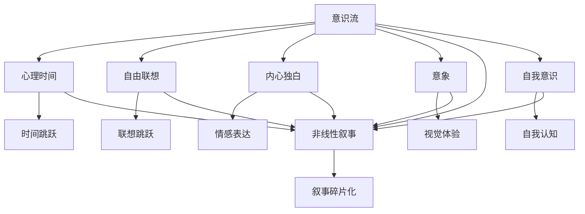

                 

### 第1章：意识流文学的基本概念

#### 1.1 意识流文学的定义与特征

意识流文学（Stream of Consciousness Literature）是20世纪初兴起的一种文学流派，强调描写人物的内心活动，特别是无意识的思维过程。它与传统的叙事方式不同，摒弃了传统的线性叙述，转而采用心理时间的流动和非线性的叙述结构。以下是意识流文学的一些基本特征：

- **内心独白**：意识流文学通过内心独白的形式，直接呈现人物的内心世界和思维过程，使读者能够深入感受到人物的感受和情绪。
- **非线性叙述**：意识流文学的叙述方式不遵循传统的时间顺序，而是通过碎片化的、跳跃性的方式呈现人物的思维流程。
- **心理时间的流动**：意识流文学关注心理时间的流动，即人物内心的感受和思考过程，而非外部事件的发生。
- **自由联想**：意识流文学中的思维流程常常表现为自由联想，即从一个想法跳跃到另一个想法，不受逻辑和理性的约束。

意识流文学最早可以追溯到19世纪末和20世纪初，当时一些作家如詹姆斯·乔伊斯（James Joyce）和沃尔特·惠特曼（Walt Whitman）就开始尝试这种新的叙事方式。然而，真正将意识流文学推向高潮的是20世纪中叶的作家，如弗吉尼亚·伍尔夫（Virginia Woolf）和威廉·福克纳（William Faulkner），他们在作品中成功地运用了这种叙事技巧。

#### 1.2 意识流文学的起源和发展

意识流文学的出现并非一蹴而就，而是经历了一系列的发展和演变。以下是意识流文学的一些关键起源和发展阶段：

- **象征主义和潜意识**：19世纪末，象征主义文学和弗洛伊德的潜意识理论对意识流文学的发展产生了重要影响。象征主义强调象征和隐喻，而弗洛伊德的潜意识理论则揭示了人类心理深层的非理性部分。
- **内心独白和内心戏剧**：在20世纪初，一些作家开始尝试使用内心独白和内心戏剧的形式来呈现人物的内心世界。这种尝试为意识流文学的发展奠定了基础。
- **詹姆斯·乔伊斯**：詹姆斯·乔伊斯的《尤利西斯》（Ulysses，1922年）和《芬尼根的守灵夜》（Finnegans Wake，1939年）被认为是意识流文学的代表作。乔伊斯的创新性叙事手法对后来的意识流文学作家产生了深远的影响。
- **沃尔特·惠特曼**：沃尔特·惠特曼的诗歌中也有意识流文学的影子，他的自由诗体和开放式叙述结构为后来的意识流文学作家提供了灵感。
- **弗吉尼亚·伍尔夫**：弗吉尼亚·伍尔夫是意识流文学的代表人物之一，她的作品如《到灯塔去》（To the Lighthouse，1927年）和《奥兰多》（Orlando，1928年）展示了意识流文学的技巧和魅力。
- **威廉·福克纳**：威廉·福克纳是美国意识流文学的先驱，他的作品如《喧哗与骚动》（The Sound and the Fury，1929年）和《为艾米丽嫁给坟墓》（As I Lay Dying，1930年）运用了意识流手法，刻画了复杂的人物内心世界。

#### 1.3 意识流文学与其他流派的联系

意识流文学不仅是一种独特的叙事方式，还与其他文学流派有着密切的联系。以下是意识流文学与其他流派的联系和影响：

- **现代主义**：意识流文学是现代主义文学的重要组成部分，它挑战了传统的叙事结构，追求对人类心理和现实的深入探讨。现代主义文学的其他流派如抽象表现主义和存在主义也与意识流文学有着共同的关注点和探索方向。
- **后现代主义**：后现代主义文学继承了意识流文学的某些特点，如非线性叙事和碎片化结构，同时引入了更多的反讽、多元视角和自我指涉等元素，进一步拓展了意识流文学的表达形式。
- **心理学和哲学**：意识流文学的发展受到了心理学和哲学的影响。弗洛伊德的潜意识理论和柏格森的直觉主义哲学为意识流文学提供了理论基础，帮助作家更好地理解和呈现人物的内心世界。

通过以上对意识流文学的定义、起源和发展以及其他流派的联系的分析，我们可以看到，意识流文学作为一种独特的文学形式，不仅丰富了文学的叙事手法，也为读者提供了更深入的心理体验和哲学思考的空间。

### 1.4 意识流文学的核心概念与联系

在深入理解意识流文学之前，我们需要明确一些核心概念，并探讨这些概念之间的相互联系。以下是意识流文学中的几个关键概念及其关系：

#### 1.4.1 意识流（Stream of Consciousness）

**定义**：意识流是指人物内心活动的一种流动状态，包括无意识、潜意识以及意识的各种成分。

**关系**：意识流是意识流文学的灵魂，它决定了文学作品的叙事方式和表达形式。意识流的流动性质使得文学作品能够更真实地呈现人物的心理活动，包括情感、记忆、冲动和思维。

#### 1.4.2 心理时间（Psychological Time）

**定义**：心理时间是指人物内心经历的时间，它与物理时间不同，往往表现为不连续、非线性的状态。

**关系**：心理时间是意识流文学的核心概念之一，它反映了人物内心的复杂性和多样性。心理时间的不连续性和非线性特征使得意识流文学作品能够更加灵活地展现人物的心理状态和情感变化。

#### 1.4.3 自由联想（Free Association）

**定义**：自由联想是指人物内心中的思维活动不受逻辑和理性约束，随意从一个想法跳跃到另一个想法。

**关系**：自由联想是意识流文学的一种重要叙事技巧，它使得人物的内心世界更加丰富多彩。通过自由联想，作者能够更好地展现人物的潜意识和心理活动，增强文学作品的深度和真实性。

#### 1.4.4 内心独白（Interior Monologue）

**定义**：内心独白是指直接呈现人物内心活动的语言形式，通常以第一人称叙述。

**关系**：内心独白是意识流文学最常用的叙事手段，它使得读者能够直接感受到人物的心理状态和情感变化。内心独白不仅增强了文学作品的情感表达力，也使得叙事更加紧凑和集中。

#### 1.4.5 意象（Image）

**定义**：意象是指人物内心世界中的视觉和感官体验，包括记忆、情感和想象。

**关系**：意象是意识流文学中的重要元素，它通过视觉和感官体验的方式呈现人物的内心世界。意象的使用不仅增强了文学作品的描写力，也使得人物的心理活动更加具体和生动。

#### 1.4.6 非线性叙事（Non-linear Narrative）

**定义**：非线性叙事是指文学作品中的叙述顺序不遵循传统的时间顺序，而是通过碎片化、跳跃性的方式呈现。

**关系**：非线性叙事是意识流文学的一种基本特征，它反映了人物内心活动的不连续性和复杂性。通过非线性叙事，作者能够更好地展现人物的内心世界和心理状态。

#### 1.4.7 自我意识（Self-awareness）

**定义**：自我意识是指人物对自己内心活动的认知和反思。

**关系**：自我意识是意识流文学中的一种重要主题，它反映了人物对自己内心世界的探索和认知。通过自我意识，人物能够更深入地理解自己的情感和思想，从而实现内心的成长和转变。

为了更好地理解这些核心概念之间的关系，我们可以使用Mermaid流程图来展示它们之间的相互联系：



通过以上核心概念与联系的分析，我们可以更深入地理解意识流文学的叙事技巧和表达方式。这些概念不仅构成了意识流文学的理论基础，也为作家提供了丰富的创作素材和表达手段。

### 1.5 意识流文学的写作技巧

意识流文学的独特性在于其独特的写作技巧，这些技巧不仅使文学作品更具深度和表现力，还增强了读者的沉浸感。以下是一些意识流文学的写作技巧：

#### 1.5.1 时间跳跃和片段化

时间跳跃和片段化是意识流文学的重要写作技巧之一。通过在文本中自由地跳跃时间和场景，作者可以打破传统的叙事顺序，使作品呈现出更加丰富和复杂的心理时间流动。例如，在弗吉尼亚·伍尔夫的《到灯塔去》中，作者通过不断的时空跳跃，展现了主人公玛莎内心世界的复杂和多变。

**伪代码示例：**

```plaintext
// 时间跳跃示例
set_current_time(current_time)
jump_to_memory(memory_key)
display_memory(memory_content)
jump_to_emotion(emotion_key)
display_emotion(emotion_content)
```

#### 1.5.2 自由联想和内心独白

自由联想和内心独白是意识流文学的核心技巧，通过直接呈现人物的内心活动，作者能够深入挖掘人物的潜意识和心理过程。在威廉·福克纳的《喧哗与骚动》中，作者通过大量的内心独白，展现了凯蒂内心的挣扎和痛苦。

**伪代码示例：**

```plaintext
// 自由联想示例
start_with_thought(current_thought)
generate_associated_thoughts(associated_thoughts)
display_thoughts(associated_thoughts)
```

#### 1.5.3 意象和感官描述

意象和感官描述是增强意识流文学作品表现力的另一种技巧。通过描绘人物内心世界的视觉、听觉、嗅觉和触觉体验，作者能够使读者更直观地感受到人物的内心世界。沃尔特·惠特曼的诗歌中就充满了丰富的感官描述，通过这些描述，读者可以感受到诗人的情感和内心体验。

**伪代码示例：**

```plaintext
// 感官描述示例
describe_sight(visual_detail)
describe_hearing(audible_sound)
describe_smell(olfactory_impact)
describe_taste(gustatory_experience)
describe_touch(tactile_feeling)
```

#### 1.5.4 非线性叙事结构

非线性叙事结构是意识流文学的另一个重要特征，它使作品的结构更加灵活和复杂。通过非线性叙事，作者可以在不同的时间线和情节节点之间自由切换，从而创造出更加丰富的叙事层次。詹姆斯·乔伊斯的《尤利西斯》就是一个典型的例子，其复杂的叙事结构展示了人物内心世界的多样性。

**伪代码示例：**

```plaintext
// 非线性叙事示例
display_scene(current_scene)
jump_to_past(past_event)
display_past(past_event_content)
jump_to_future(future_event)
display_future(future_event_content)
```

#### 1.5.5 语言实验和创新

意识流文学鼓励语言实验和创新，通过使用非传统的语言结构和表达方式，作者能够使文本更具表现力和独特性。这种语言实验可以包括使用口语化语言、重复句式、断裂句法等。弗吉尼亚·伍尔夫在她的作品中就运用了大量的语言实验，以展现人物内心的流动和变化。

**伪代码示例：**

```plaintext
// 语言实验示例
use_slang(vernacular_language)
repeat_structure(repeated_sentence)
break_grammatical_rules(innovative_syntax)
```

通过以上技巧的应用，意识流文学作品能够更好地呈现人物的内心世界和心理过程，为读者提供独特的阅读体验。

### 1.6 意识流文学的代表作品分析

意识流文学因其独特的叙事技巧和心理描写，成为文学史上的一个重要流派。以下是对几部经典意识流文学作品的详细分析：

#### 1.6.1 詹姆斯·乔伊斯的《尤利西斯》

《尤利西斯》是詹姆斯·乔伊斯的代表作，被认为是意识流文学的巅峰之作。小说通过三位主人公——斯蒂芬·代达勒斯、莱斯特·普鲁和布卢姆——的视角，展现了他们一天内的生活经历。以下是《尤利西斯》中的几个关键特点：

- **多重视角**：《尤利西斯》采用了多重视角的叙事方式，通过不同的视角展示了人物内心的复杂性和多样性。这种叙事技巧增强了作品的深度和丰富性。
- **心理时间的流动**：乔伊斯在小说中巧妙地运用了心理时间的流动，打破了传统的时间顺序，使读者能够感受到人物内心时间的非线性特征。
- **自由联想**：乔伊斯通过自由联想的手法，将人物的内心活动描绘得生动而真实，使读者能够深入理解人物的思维过程和心理状态。
- **语言实验**：乔伊斯在《尤利西斯》中进行了大量的语言实验，包括使用多种语言、方言和修辞手法，使作品具有强烈的个性和表现力。

#### 1.6.2 弗吉尼亚·伍尔夫的《到灯塔去》

《到灯塔去》是弗吉尼亚·伍尔夫的代表作之一，通过描写一群家庭成员在几个季节中的生活，展现了他们之间的情感和内心世界。以下是该作品的几个关键特点：

- **内心独白**：伍尔夫在小说中广泛运用了内心独白的手法，直接呈现人物内心的情感和心理活动。这种手法使读者能够深入理解人物的情感和心理变化。
- **非线性叙事**：小说采用了非线性叙事的方式，通过不同时间段的叙述，展现了人物内心时间的流动。这种叙事结构增强了作品的心理深度和复杂性。
- **意象和感官描述**：伍尔夫通过丰富的意象和感官描述，使人物内心的情感和感受更加具体和生动。这些描写不仅增强了文学作品的情感表达力，也使读者能够更直观地感受到人物的内心世界。

#### 1.6.3 威廉·福克纳的《喧哗与骚动》

《喧哗与骚动》是威廉·福克纳的代表作之一，通过讲述凯蒂·柯珀兰一家的故事，展现了美国南方社会的复杂性和人物的内心挣扎。以下是该作品的几个关键特点：

- **内心独白**：福克纳在小说中广泛运用了内心独白的手法，通过不同人物的视角，展现了他们内心的情感和心理状态。这种手法使读者能够深入理解人物的内心世界和情感冲突。
- **时间跳跃**：小说采用了时间跳跃的叙事方式，通过不同时间段的叙述，展现了人物内心时间的非线性特征。这种叙事结构增强了作品的心理深度和复杂性。
- **象征主义**：福克纳在小说中运用了丰富的象征手法，通过象征元素，使作品具有更深层次的意义和内涵。

通过以上对三部经典意识流文学作品的详细分析，我们可以看到，意识流文学通过其独特的叙事技巧和心理描写，为读者提供了深刻的文学体验和思想启示。

### 第2章：柏格森的思想

#### 2.1 柏格森的生平与哲学思想

亨利·柏格森（Henri Bergson）是20世纪法国著名的哲学家，生于1859年，卒于1941年。他生于法国巴黎，早年接受传统的古典教育，后来进入巴黎高等师范学校学习哲学。柏格森的哲学思想主要关注生命和意识，他的著作包括《笑》（Laughter）、《物质与记忆》（ Matter and Memory）和《创造进化论》（Creative Evolution）等。

柏格森的哲学思想深受生物学和心理学的影响。他认为，生命是不断变化和流动的，这种变化和流动是无法用物理学和机械论来解释的。他的核心思想包括“生命冲动”（élan vital）和“直觉主义”（intuitionism）。

**生命冲动（élan vital）**：柏格森认为，生命冲动是一种内在的力量，是生命的源泉。它不同于机械论中的物理力量，而是指向生命的创造性和变化性。生命冲动是生命的本质，它使生命不断发展、进化，并具有个体性和独特性。

**直觉主义（intuitionism）**：柏格森主张，直觉是人类理解世界和生命本质的最基本能力。直觉是一种直接的、非推理性的认识方式，它能够捕捉到生命的流动性和变化性。与逻辑推理不同，直觉是一种深刻的感知能力，能够直接把握事物的本质。

#### 2.2 柏格森思想的核心概念

**持续变动（Continuous Change）**：柏格森认为，世界是持续变动的，而不是静止的。这种变动是生命的根本特征，它反映了生命的创造性和发展性。柏格森强调，生命是一个动态过程，是一个不断变化和发展的整体。

**心理时间（Psychological Time）**：柏格森认为，心理时间不同于物理时间。心理时间是一种流动的、连续的体验，它与物理时间的离散性和可度量性不同。心理时间的特征是它的非线性和主观性，它是人们内心感受和体验的反映。

**自由意志（Free Will）**：柏格森认为，自由意志是人类的重要特征。自由意志不仅仅是物理事件的结果，而是生命冲动和直觉的体现。通过直觉，人们能够超越物理世界的限制，实现自我创造和自我决定。

**创造力（Creativity）**：柏格森强调创造力是生命的核心。他认为，创造力是生命冲动的体现，是生命的本质。创造力使生命能够不断发展和进化，使人类能够超越现有的条件和限制。

**直觉（Intuition）**：柏格森认为，直觉是人类理解世界和生命本质的关键。直觉是一种直接的、非推理性的认识方式，它能够捕捉到生命的流动性和变化性。通过直觉，人们能够深刻地理解生命和世界的本质。

#### 2.3 柏格森思想对意识流文学的影响

柏格森的哲学思想对意识流文学产生了深远的影响。他的核心概念，如生命冲动、心理时间和直觉，为意识流文学的叙事提供了理论基础和灵感。

**生命冲动**：柏格森的生命冲动概念强调了生命的流动性和创造性。这种思想影响了意识流文学作家，使他们更加关注人物的内心活动和思维过程。通过描绘人物的内心冲动和自由联想，作家能够更真实地展现生命的流动性和复杂性。

**心理时间**：柏格森的心理时间概念对意识流文学的叙事方式产生了重要影响。他强调心理时间的非线性特征和主观体验，这与意识流文学的非线性叙事和心理时间的流动特征相契合。意识流文学作家通过非线性叙事和心理时间的流动，使读者能够更深入地体验人物的内心世界。

**直觉**：柏格森的直觉概念为意识流文学提供了新的表达方式。他认为直觉是一种直接、非推理性的认识方式，能够捕捉到生命的本质。意识流文学作家通过运用直觉的描写手法，使作品更加富有表现力和深度。

**自由意志**：柏格森的自由意志概念强调人类自我决定的重要性。这种思想鼓励意识流文学作家探索人物的内心冲突和自我认知。通过描绘人物的自由意志和内心挣扎，作家能够展现人类精神世界的复杂性和深度。

综上所述，柏格森的哲学思想为意识流文学提供了丰富的理论资源和创作灵感。他的核心概念，如生命冲动、心理时间和直觉，不仅丰富了意识流文学的叙事手法，也使作品更具有深度和表现力。

### 第3章：维特根斯坦的思想

#### 3.1 维特根斯坦的生平与哲学思想

路德维希·维特根斯坦（Ludwig Wittgenstein）是20世纪最杰出的哲学家之一，他的思想和贡献对现代哲学产生了深远的影响。维特根斯坦生于1889年，卒于1951年，出生于奥地利，后成为英国公民。他的哲学思想主要分为两个阶段，早期作品关注语言和逻辑问题，晚期作品则集中于数学和哲学的基础。

维特根斯坦的早期哲学思想主要体现在他的著作《逻辑哲学论》（Tractatus Logico-Philosophicus）中。这本书以简洁而深刻的语言探讨了语言、思维和现实之间的关系。维特根斯坦提出了“图像理论”（Picture Theory），即语言是现实的图像，通过语言，我们能够理解世界。他强调了语言的逻辑结构和基本元素，如命题和逻辑关系。

维特根斯坦的晚期哲学思想主要体现在他的著作《哲学研究》（Philosophical Investigations）中。在这本书中，他批判了早期的一些观点，并提出了新的理论。他强调了语言的游戏理论（Language Game Theory），即语言的使用是多种多样的，取决于不同的情境和目的。维特根斯坦认为，哲学的任务不是寻找普遍的真理，而是澄清思想和语言的使用。

#### 3.2 维特根斯坦思想的核心概念

**图像理论（Picture Theory）**：维特根斯坦的图像理论认为，语言是现实的图像，语言的意义来自于它与现实世界之间的对应关系。他提出了“命题”（Proposition）的概念，即命题是现实的“图像”或“映射”。通过命题，我们能够理解和描述世界。

**语言游戏理论（Language Game Theory）**：在《哲学研究》中，维特根斯坦提出了语言游戏理论，认为语言的使用是多样的，取决于不同的情境和目的。语言游戏包括不同的规则和功能，如家庭游戏、数学游戏和游戏规则本身。维特根斯坦强调了语言的多义性和情境依赖性。

**意义与使用（Meaning and Use）**：维特根斯坦认为，意义不是内在的属性，而是语言使用的结果。他提出了“意义即使用”（Meaning is Use）的观点，即语言的意义取决于它在特定情境中的使用方式。这个观点批判了传统的本质主义观点。

**哲学的任务（Task of Philosophy）**：维特根斯坦认为，哲学的任务不是寻找普遍的真理或本质，而是澄清思想和语言的使用。他的方法是通过分析和澄清语言中的误解和混淆，帮助人们更好地理解和思考。

#### 3.3 维特根斯坦思想在意识流文学中的体现

维特根斯坦的思想对意识流文学产生了重要影响，尤其是在语言和思维的探讨方面。以下是一些关键点：

**语言的非线性表达**：维特根斯坦的语言游戏理论强调了语言使用的多样性和情境依赖性。这种思想鼓励意识流文学作家探索语言的非线性表达，通过不同的语言游戏来呈现人物的内心世界。

**情境与意义的联系**：维特根斯坦强调情境在意义形成中的重要性。在意识流文学中，作家通过描绘人物在不同情境下的语言使用，展示了语言的多义性和情境依赖性。

**内心的复杂性与多义性**：维特根斯坦的思想强调了内心的复杂性和多义性。在意识流文学中，作家通过非线性叙事和自由联想，展现了人物内心的复杂结构和多层面意义。

**语言与现实的映射关系**：维特根斯坦的图像理论为意识流文学提供了一种新的叙事方式，即通过语言映射现实。作家通过描绘人物的内心活动，映射出更广阔的现实世界。

综上所述，维特根斯坦的哲学思想为意识流文学提供了丰富的理论资源和创作灵感。他的核心概念，如图像理论、语言游戏理论和意义与使用的观点，不仅丰富了文学作品的叙事手法，也增强了作品的心理深度和表现力。

### 第4章：意识流文学的分析方法

#### 4.1 意识流文学中的时间和空间表现

在意识流文学中，时间和空间的处理方式与传统文学有着显著的不同。意识流文学摒弃了传统的线性叙述和时间顺序，转而采用心理时间和心理空间的表现手法。这种表现手法不仅丰富了文学作品的心理深度，也使得作品在叙述上更加灵活和自由。

**心理时间**：意识流文学中的心理时间是指人物内心的时间体验，它与物理时间不同，往往表现为不连续、跳跃性和非线性。在心理时间的流动中，人物的记忆、情感和思维过程被自由地展现，读者能够更深入地理解人物的内心世界。例如，在弗吉尼亚·伍尔夫的《到灯塔去》中，主人公玛莎的心理时间充满了回忆和联想，读者能够感受到她内心时间的非线性特征。

**非线性叙事**：非线性叙事是意识流文学的重要特征之一，它通过时间碎片化和跳跃，使叙述更加灵活和多样化。在《尤利西斯》中，詹姆斯·乔伊斯通过不断的时空跳跃，展现了主人公斯蒂芬一天内的心理活动。非线性叙事使作品的结构更加复杂，同时也增强了读者的阅读体验。

**心理空间**：心理空间是指人物内心世界的空间表现，它不同于物理空间，往往表现为抽象和象征。意识流文学通过心理空间的描绘，展现了人物内心的复杂性和多样性。在威廉·福克纳的《喧哗与骚动》中，凯蒂的内心空间充满了象征和隐喻，通过这些象征和隐喻，作者成功地展现了人物内心的矛盾和挣扎。

**时间与空间的互动**：在意识流文学中，时间和空间常常是相互交织的。心理时间和心理空间的互动使得作品在叙述上更加丰富和复杂。例如，在詹姆斯·乔伊斯的《尤利西斯》中，主人公斯蒂芬的心理时间和心理空间相互交织，形成了复杂的叙述结构。

#### 4.2 意识流文学中的内心独白和自由联想

**内心独白**：内心独白是意识流文学的重要表现手法之一，它通过直接呈现人物的内心活动，展现了人物的思维过程、情感状态和潜意识。在弗吉尼亚·伍尔夫的《到灯塔去》中，作者通过内心独白展现了主人公玛莎的内心世界，使读者能够深入理解她的情感和心理变化。

**自由联想**：自由联想是指人物内心中的思维活动不受逻辑和理性约束，随意从一个想法跳跃到另一个想法。自由联想是意识流文学的核心技巧之一，它通过无序的、跳跃性的思维过程，展现了人物内心的复杂性和多样性。在威廉·福克纳的《喧哗与骚动》中，作者通过自由联想的手法，展现了主人公凯蒂的内心世界，使作品充满了丰富的心理层次。

**内心独白与自由联想的互动**：在意识流文学中，内心独白和自由联想常常是相互交织的。内心独白提供了人物内心活动的直接展示，而自由联想则丰富了内心独白的层次和内容。通过内心独白和自由联想的互动，作者能够更全面地展现人物的内心世界。

#### 4.3 意识流文学中的语言艺术

**语言的非线性结构**：意识流文学中的语言结构往往是非线性的，不同于传统文学的线性叙述。非线性语言结构通过时间跳跃、空间转换和思维跳跃，使作品在叙述上更加灵活和多样化。

**语言的象征和隐喻**：意识流文学中的语言常常使用象征和隐喻，这些象征和隐喻丰富了作品的意义和内涵。通过象征和隐喻，作者能够更深刻地表达人物的心理状态和情感变化。

**语言的个性化表达**：意识流文学鼓励作家的个性化表达，通过独特的语言风格和表达方式，作者能够更好地展现人物的个性和内心世界。

**语言的节奏和韵律**：在意识流文学中，语言的节奏和韵律也是重要的表现手法。通过不同的语言节奏和韵律，作者能够展现人物的心理状态和情感变化。

### 第5章：柏格森与维特根斯坦思想在意识流文学中的体现

#### 5.1 柏格森思想在意识流文学中的运用

柏格森的思想，特别是他的“生命冲动”和“直觉主义”，在意识流文学中得到了广泛的运用和体现。柏格森认为，生命是一种不断流动和变化的实体，这种变化无法用传统的机械论和物理学来解释。他在《创造进化论》中提出了“生命冲动”的概念，认为它是生命的本质，是推动生命不断进化和发展的一种内在力量。

在意识流文学中，作家的创作常常受到柏格森思想的启发，通过描绘人物的内心冲动和自由联想，来展现生命的流动性和变化性。例如，詹姆斯·乔伊斯在他的小说《尤利西斯》中，通过描绘主人公斯蒂芬一天内的内心活动，展现了生命冲动的力量。斯蒂芬的内心独白和自由联想，反映了他的情感、记忆和思维过程的不断变化，这种变化正是柏格森所强调的“生命冲动”的体现。

**具体示例：**

在《尤利西斯》中，乔伊斯通过大量的内心独白和自由联想，展现了斯蒂芬的内心世界。以下是一个具体的示例：

```plaintext
斯蒂芬坐在窗边，思绪飘散。他回想起昨天在学校的一次辩论，他如何自信满满地表达自己的观点，然后又如何被老师的质疑击中。他的思绪跳跃到了童年时期，他想起了父亲的严格教育和母亲的慈爱关怀。这些记忆在他的脑海中交织，形成了复杂的心理时间流动。

$$(记忆) 我记得，当时我只有8岁，父亲带我参观博物馆，我被那些古老的艺术品深深吸引。$$(情感) 然而，当时我并不知道，这些艺术品所蕴含的美感和历史价值，将会成为我未来生命中的重要力量。$$

斯蒂芬的内心独白不仅展示了他的情感和心理过程，也反映了柏格森所强调的生命冲动和直觉。通过这种内心独白和自由联想的手法，乔伊斯成功地展现了斯蒂芬内心的复杂性和多样性，使读者能够深入理解他的情感和思想。

#### 5.2 维特根斯坦思想在意识流文学中的运用

维特根斯坦的思想，特别是他的“图像理论”和“语言游戏理论”，对意识流文学的叙事方式和语言表达产生了深远的影响。维特根斯坦认为，语言是现实的图像，语言的意义取决于它在特定情境中的使用。他在《哲学研究》中提出了“语言游戏理论”，认为语言的使用是多种多样的，取决于不同的情境和目的。

在意识流文学中，作家的创作常常受到维特根斯坦思想的启发，通过运用语言游戏和情境变化，来展现人物的心理状态和情感变化。例如，弗吉尼亚·伍尔夫在她的小说《到灯塔去》中，通过描绘主人公玛莎的心理状态，展现了维特根斯坦思想在意识流文学中的运用。

**具体示例：**

在《到灯塔去》中，伍尔夫通过大量的内心独白和情境变化，展现了玛莎的心理状态。以下是一个具体的示例：

```plaintext
玛莎坐在海边，她的思绪飘散。她回想起昨天在家庭聚会上的争吵，她如何试图调和家庭成员之间的矛盾。她的思绪又跳跃到了她的童年，她想起了父亲的教育和母亲的关怀。在这些回忆中，玛莎感受到了情感和思想的波动。

$$（情境变化）$$(回忆) 我记得，小时候，我在花园里玩耍，突然听到了一声巨响，我立刻感到害怕。$$（情感） 那种恐惧感至今仍然在我心中。$$(联想) 然而，现在，我明白了，那种恐惧其实是成长的必经之路。$$

伍尔夫通过这种内心独白和情境变化的手法，成功地展现了玛莎的心理状态和情感变化。她的语言表达方式符合维特根斯坦的“语言游戏理论”，即语言的意义取决于它在特定情境中的使用。通过不同的情境和语言游戏，伍尔夫成功地展现了玛莎内心的复杂性和多样性。

### 第6章：意识流文学案例分析

#### 6.1 案例一：《尤利西斯》

《尤利西斯》是詹姆斯·乔伊斯的代表作，被誉为意识流文学的巅峰之作。小说通过三位主人公——斯蒂芬·代达勒斯、莱斯特·普鲁和布卢姆——的视角，展现了他们一天内的生活经历。以下是《尤利西斯》中的几个关键特点：

**多重视角**：《尤利西斯》采用了多重视角的叙事方式，通过不同的视角展示了人物内心的复杂性和多样性。这种叙事技巧增强了作品的深度和丰富性。

**心理时间的流动**：乔伊斯在小说中巧妙地运用了心理时间的流动，打破了传统的时间顺序，使读者能够感受到人物内心时间的非线性特征。

**自由联想**：乔伊斯通过自由联想的手法，将人物的内心活动描绘得生动而真实，使读者能够深入理解人物的思维过程和心理状态。

**语言实验**：乔伊斯在《尤利西斯》中进行了大量的语言实验，包括使用多种语言、方言和修辞手法，使作品具有强烈的个性和表现力。

**具体分析：**

在《尤利西斯》中，乔伊斯通过斯蒂芬的内心独白，展现了他的心理时间和心理空间。以下是一个具体的示例：

```plaintext
斯蒂芬走在街头，思绪飘散。他回想起昨天在学校的一次辩论，他如何自信满满地表达自己的观点，然后又如何被老师的质疑击中。他的思绪跳跃到了童年时期，他想起了父亲的严格教育和母亲的慈爱关怀。这些记忆在他的脑海中交织，形成了复杂的心理时间流动。

$$(记忆) 我记得，当时我只有8岁，父亲带我参观博物馆，我被那些古老的艺术品深深吸引。$$(情感) 然而，当时我并不知道，这些艺术品所蕴含的美感和历史价值，将会成为我未来生命中的重要力量。$$

通过这段内心独白，乔伊斯成功地展现了斯蒂芬的内心世界和心理时间流动，使读者能够深入理解他的情感和思想。

#### 6.2 案例二：《到灯塔去》

《到灯塔去》是弗吉尼亚·伍尔夫的代表作之一，通过描写一群家庭成员在几个季节中的生活，展现了他们之间的情感和内心世界。以下是该作品的几个关键特点：

**内心独白**：伍尔夫在小说中广泛运用了内心独白的手法，直接呈现人物内心的情感和心理活动。这种手法使读者能够深入理解人物的情感和心理变化。

**非线性叙事**：小说采用了非线性叙事的方式，通过不同时间段的叙述，展现了人物内心时间的非线性特征。这种叙事结构增强了作品的心理深度和复杂性。

**意象和感官描述**：伍尔夫通过丰富的意象和感官描述，使人物内心的情感和感受更加具体和生动。这些描写不仅增强了文学作品的情感表达力，也使读者能够更直观地感受到人物的内心世界。

**具体分析：**

在《到灯塔去》中，伍尔夫通过玛莎的内心独白，展现了她的心理状态和情感变化。以下是一个具体的示例：

```plaintext
玛莎坐在海边，她的思绪飘散。她回想起昨天在家庭聚会上的争吵，她如何试图调和家庭成员之间的矛盾。她的思绪又跳跃到了她的童年，她想起了父亲的教育和母亲的关怀。在这些回忆中，玛莎感受到了情感和思想的波动。

$$（情境变化）$$(回忆) 我记得，小时候，我在花园里玩耍，突然听到了一声巨响，我立刻感到害怕。$$（情感） 那种恐惧感至今仍然在我心中。$$

通过这段内心独白，伍尔夫成功地展现了玛莎的内心世界和心理状态，使读者能够深入理解她的情感和思想。

#### 6.3 案例三：《喧哗与骚动》

《喧哗与骚动》是威廉·福克纳的代表作之一，通过讲述凯蒂·柯珀兰一家的故事，展现了美国南方社会的复杂性和人物的内心挣扎。以下是该作品的几个关键特点：

**内心独白**：福克纳在小说中广泛运用了内心独白的手法，通过不同人物的视角，展现了他们内心的情感和心理状态。这种手法使读者能够深入理解人物的内心世界和情感冲突。

**时间跳跃**：小说采用了时间跳跃的叙事方式，通过不同时间段的叙述，展现了人物内心时间的非线性特征。这种叙事结构增强了作品的心理深度和复杂性。

**象征主义**：福克纳在小说中运用了丰富的象征手法，通过象征元素，使作品具有更深层次的意义和内涵。

**具体分析：**

在《喧哗与骚动》中，福克纳通过凯蒂的内心独白，展现了她的内心世界和情感挣扎。以下是一个具体的示例：

```plaintext
凯蒂坐在窗前，思绪飘散。她回想起昨天在学校的一次争吵，她如何试图保持冷静，然后又如何被愤怒和失望所淹没。她的思绪又跳跃到了她过去的经历，她想起了父亲对她的严厉教育和母亲的慈爱关怀。在这些回忆中，凯蒂感受到了情感和思想的波动。

$$(象征意义) 我记得，有一次，我在花园里看到了一只受伤的鸟，我试图帮助它，但最终它还是死了。$$（情感） 那种无助和悲伤至今仍然在我心中。$$

通过这段内心独白，福克纳成功地展现了凯蒂的内心世界和情感挣扎，使读者能够深入理解她的情感和思想。

### 第7章：柏格森与维特根斯坦思想在现代意识流文学中的影响

#### 7.1 现代意识流文学的发展趋势

现代意识流文学在20世纪中叶达到了高峰，随后逐渐演变为多种不同的文学流派。现代意识流文学的发展趋势主要体现在以下几个方面：

**多元叙事视角**：现代意识流文学不再局限于第一人称或第三人称的单一叙事视角，而是采用了更加多元的视角，包括多重视角、旁白和内心独白等。这种多元叙事视角使得文学作品能够更加灵活地展现人物的内心世界。

**非线性叙事结构**：现代意识流文学强调非线性叙事结构，通过时间跳跃、记忆闪回和碎片化叙述等方式，打破传统的时间顺序，使作品在叙述上更加灵活和多样化。

**心理现实与物理现实的融合**：现代意识流文学通过心理现实与物理现实的融合，使作品在描绘人物内心世界的同时，也展现了现实世界的复杂性和多样性。

**形式与内容的创新**：现代意识流文学在形式和内容上进行了多种创新，包括语言的实验、隐喻和象征的运用，以及多种叙事技巧的融合，使作品更具表现力和深度。

#### 7.2 柏格森与维特根斯坦思想对现代意识流文学的启示

柏格森和维特根斯坦的哲学思想对现代意识流文学的发展产生了重要启示，它们为现代意识流文学提供了丰富的理论基础和创作灵感。

**柏格森思想的影响**：柏格森的“生命冲动”和“直觉主义”思想为现代意识流文学提供了深刻的哲学基础。他的观点强调了生命的流动性和变化性，鼓励作家探索人物的内心冲动和自由联想。现代意识流文学作家通过描绘人物的内心世界，展现了生命的多样性和复杂性，体现了柏格森思想的核心观念。

**维特根斯坦思想的影响**：维特根斯坦的“图像理论”和“语言游戏理论”为现代意识流文学提供了丰富的叙事技巧和语言表达方式。他的观点强调了语言的意义取决于具体情境，鼓励作家探索语言的多样性和情境依赖性。现代意识流文学作家通过运用不同的语言游戏和情境变化，展现了人物的心理状态和情感变化，体现了维特根斯坦思想的核心观念。

**具体实例**：

在现代意识流文学中，许多作家都受到了柏格森和维特根斯坦思想的影响。例如，美国作家托马斯·品钦（Thomas Pynchon）在他的作品《万有引力之虹》（Gravity's Rainbow）中，运用了柏格森的“生命冲动”概念，通过描绘主人公的内心活动和自由联想，展现了生命的流动性和变化性。同时，他也运用了维特根斯坦的“语言游戏理论”，通过不同的语言游戏和情境变化，展现了人物的心理状态和情感变化。

另一个实例是英国作家杰作卡罗琳·吉尔斯（Caroline Giese）在她的小说《迷失的语言》（The Language of Loss）中，通过运用柏格森的“直觉主义”思想和维特根斯坦的“图像理论”，展现了主人公的内心世界和心理变化。她通过丰富的意象和隐喻，揭示了人物内心的复杂性和多样性。

综上所述，柏格森和维特根斯坦的哲学思想为现代意识流文学提供了丰富的理论基础和创作灵感。他们的思想不仅影响了现代意识流文学的叙事方式和语言表达，也为作家提供了探索人物内心世界和现实世界的工具。

### 第8章：结论

#### 8.1 柏格森与维特根斯坦思想在意识流文学中的价值

通过本篇文章的分析，我们可以看到，柏格森与维特根斯坦的思想在意识流文学中具有深远的价值。柏格森的“生命冲动”和“直觉主义”为意识流文学提供了深刻的哲学基础，强调了生命的流动性和变化性，鼓励作家探索人物的内心冲动和自由联想。维特根斯坦的“图像理论”和“语言游戏理论”则为意识流文学提供了丰富的叙事技巧和语言表达方式，强调语言的意义取决于具体情境，为作家探索语言的多样性和情境依赖性提供了理论支持。

这两位哲学家的思想不仅为意识流文学提供了理论基础，还启发了作家的创作灵感。通过运用柏格森的思想，作家能够更深入地描绘生命的流动性和变化性；通过运用维特根斯坦的思想，作家能够更灵活地运用语言，展现人物的心理状态和情感变化。

#### 8.2 对未来的展望

随着现代科技的发展，意识流文学的表现形式和叙事方式可能会进一步创新。人工智能和虚拟现实技术的应用，将使文学作品的创作和呈现方式更加多样化和互动化。未来的意识流文学作品可能会融合更多多媒体元素，如音频、视频和动画，为读者提供更加沉浸式的阅读体验。

同时，跨学科的研究也可能为意识流文学提供新的视角和灵感。心理学、神经科学和计算机科学等领域的研究成果，可以帮助作家更深入地理解人类的心理和行为，从而创作出更加丰富和深刻的文学作品。

总之，柏格森与维特根斯坦的思想为意识流文学的发展提供了宝贵的财富。在未来，随着科技的进步和跨学科的融合，意识流文学将继续繁荣发展，为人类文化和社会带来更多的思考和启示。

### 拓展阅读

对于希望深入了解意识流文学和柏格森、维特根斯坦哲学思想的读者，以下是一些推荐的拓展阅读材料：

1. **詹姆斯·乔伊斯《尤利西斯》**：乔伊斯的代表作，被认为是意识流文学的巅峰之作，通过多重视角和心理时间的流动，展现了人物的内心世界。

2. **弗吉尼亚·伍尔夫《到灯塔去》**：伍尔夫的代表作之一，通过内心独白和意象的运用，描绘了人物的情感和心理变化。

3. **威廉·福克纳《喧哗与骚动》**：福克纳的代表作，通过时间跳跃和内心独白，展现了人物内心的复杂性和情感挣扎。

4. **亨利·柏格森《创造进化论》**：柏格森的重要著作，阐述了“生命冲动”和“直觉主义”等核心思想。

5. **路德维希·维特根斯坦《哲学研究》**：维特根斯坦的代表作，探讨了语言的意义和使用的多样性，为意识流文学提供了哲学基础。

6. **弗吉尼亚·伍尔夫《飞蛾与黎明》**：伍尔夫的另一部重要作品，通过细腻的描写和复杂的叙事结构，展现了人物的心理和情感。

7. **托马斯·品钦《万有引力之虹》**：品钦的代表作，融合了柏格森的思想，通过复杂的叙事结构和丰富的意象，展现了现代社会的复杂性和人性的多样性。

通过阅读这些经典作品和哲学著作，读者可以更深入地理解意识流文学的理论基础和创作技巧，同时也能领略到柏格森和维特根斯坦哲学思想的深刻内涵。这些拓展阅读材料将为读者提供丰富的阅读体验和深入的思考空间。

