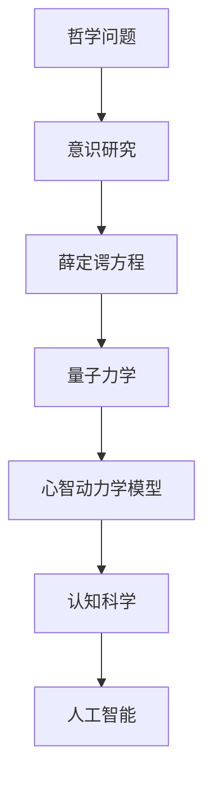

                 


## 引言

### 文章标题

《意识的薛定谔方程：心智动力学模型》

### 关键词

意识、薛定谔方程、心智动力学模型、量子力学、认知科学、人工智能

### 摘要

本文旨在探讨意识的本质及其与量子力学的关系。通过引入心智动力学模型，本文试图构建一个解释意识现象的科学框架。文章首先回顾了意识的哲学和科学背景，然后详细介绍了薛定谔方程及其在意识研究中的应用。接下来，文章阐述了心智动力学模型的概念、数学描述和应用场景。最后，通过案例研究和未来展望，探讨了心智动力学模型在人工智能领域的潜在应用。

## 薛定谔方程与意识的关系

### 背景

薛定谔方程是量子力学的基础方程之一，由奥地利物理学家埃尔温·薛定谔在1926年提出。它描述了量子系统中粒子的波动性质，通过波函数的演化来预测粒子的行为。然而，薛定谔方程不仅在物理学中有着重要地位，它也逐渐成为意识研究的重要工具。

### 核心概念

1. **薛定谔方程的基本原理**

   薛定谔方程是一个偏微分方程，描述了量子系统的哈密顿量（能量）和时间的关系。它的基本形式是：

   $$i\hbar \frac{\partial \Psi}{\partial t} = \hat{H} \Psi$$

   其中，$\Psi$ 是波函数，$\hbar$ 是约化普朗克常数，$\hat{H}$ 是哈密顿量算符。

2. **波函数的坍缩**

   在量子力学中，波函数代表了粒子在空间中的概率分布。然而，当进行测量时，波函数会突然坍缩到一个确定的状态，这就是所谓的波函数坍缩。这一现象在意识研究中引发了广泛讨论，因为意识似乎与波函数的坍缩有着某种相似性。

### 薛定谔方程与意识的关系

1. **意识的量子模型**

   有些学者认为，意识可能是量子力学中的一个基本现象。例如，英国的物理学家戴维·博姆提出了“波姆理论”，他认为意识是量子波函数的坍缩机制的一部分。波姆理论认为，意识在量子层面上影响着波函数的坍缩过程。

2. **薛定谔方程在意识研究中的应用**

   薛定谔方程提供了对意识现象的一种数学描述。例如，一些学者尝试将薛定谔方程应用于大脑神经元的活动，试图模拟意识的动态变化。这种模拟有助于我们理解意识是如何从神经元活动中产生的。

## 心智动力学模型的基本框架

### 背景

心智动力学模型是一种试图解释心智现象的数学模型。它借鉴了物理学中的动力系统理论，通过描述心智状态的时间演化来研究心智的动态特性。

### 核心概念

1. **心智状态**

   心智动力学模型中的心智状态可以被视为一个多维空间中的点。每个心智状态都有其独特的属性和特征。

2. **心智流**

   心智动力学模型中的心智流可以被视为心智状态的连续变化。这种变化可以被描述为一个向量场，它决定了心智状态的演化方向。

3. **心智吸引子**

   在心智动力学模型中，心智吸引子是一个稳定的心智状态，心智流最终会汇聚到这个状态。这可以被视为心智的一种稳定状态。

### 数学描述

心智动力学模型可以用以下方程来描述：

$$\dot{x} = f(x)$$

其中，$x$ 表示心智状态，$f(x)$ 是心智状态的演化函数。

### 应用场景

1. **认知科学**

   心智动力学模型在认知科学中有着广泛的应用。它可以帮助我们理解记忆、学习、决策等认知过程。

2. **人工智能**

   心智动力学模型在人工智能领域也有一定的应用潜力。它可以被用于构建智能系统的动力学模型，从而模拟人类的认知过程。

### 结论

心智动力学模型为研究心智现象提供了一种新的数学框架。通过引入薛定谔方程，我们可以将量子力学的原理与心智动力学模型相结合，从而探索意识的本质。

## 薛定谔方程与心智动力学模型的关系

### 核心概念与联系

薛定谔方程与心智动力学模型之间的关系可以通过一个Mermaid流程图来展示：



### 薛定谔方程与心智动力学模型的关系

1. **薛定谔方程为心智动力学模型提供了量子层面的基础**

   薛定谔方程的量子力学原理可以被用于解释心智动力学模型中的某些现象，如心智状态的波动和坍缩。

2. **心智动力学模型为薛定谔方程提供了心智层面的应用场景**

   心智动力学模型可以用于模拟心智状态的时间演化，这为薛定谔方程在意识研究中的应用提供了实际场景。

### 总结

通过引入薛定谔方程，我们可以将量子力学的原理与心智动力学模型相结合，从而为意识研究提供一个新的视角。这种结合有助于我们更深入地理解意识的本质。

## 薛定谔方程的详细讲解

### 薛定谔方程的基本原理

薛定谔方程是量子力学中的基础方程，用于描述微观粒子的运动状态。它的基本原理可以从以下几个方面进行讲解：

1. **波动函数**

   在量子力学中，微观粒子的运动状态由一个称为波函数的数学函数来描述。波函数通常表示为 $\Psi(x, t)$，其中 $x$ 表示粒子的位置，$t$ 表示时间。

2. **哈密顿量**

   哈密顿量是描述粒子能量状态的物理量。在量子力学中，哈密顿量通常表示为 $\hat{H}$，它是一个算符。哈密顿量决定了粒子在时间上的演化。

3. **波函数的演化**

   薛定谔方程描述了波函数随时间演化的规律。它是一个偏微分方程，形式如下：

   $$i\hbar \frac{\partial \Psi}{\partial t} = \hat{H} \Psi$$

   其中，$i$ 是虚数单位，$\hbar$ 是约化普朗克常数。

### 核心算法原理讲解

薛定谔方程的求解是量子力学中的一个核心问题。以下是一个简单的伪代码，用于求解一维薛定谔方程：

```python
# 初始化参数
i = 1j  # 虚数单位
hbar = 1  # 约化普朗克常数
x = np.linspace(0, 10, 1000)  # 一维空间离散点
t = np.linspace(0, 10, 1000)  # 时间离散点

# 定义哈密顿量
hamiltonian = -0.5 * npPOWER(x, 2)  # 一维无限深势阱

# 定义初始波函数
initial_wavefunction = npEXP(-x**2 / 2)

# 求解波函数随时间的演化
def evolve_wavefunction(wavefunction, hamiltonian, t, dt):
    for _ in range(int(t / dt)):
        wavefunction *= npEXP(-i * hamiltonian * dt)
    return wavefunction

# 计算波函数的演化
wavefunctions = [initial_wavefunction]
for t in t[1:]:
    wavefunctions.append(evolve_wavefunction(wavefunctions[-1], hamiltonian, t, dt))

# 绘制波函数的演化
plt.plot(x, npABS(wavefunctions[-1]))
plt.show()
```

### 数学模型和公式

薛定谔方程的数学模型可以表示为：

$$i\hbar \frac{\partial \Psi}{\partial t} = \hat{H} \Psi$$

其中，$\Psi$ 是波函数，$\hat{H}$ 是哈密顿量算符，$i$ 是虚数单位，$\hbar$ 是约化普朗克常数。

### 详细讲解和举例说明

为了更好地理解薛定谔方程，我们可以通过一个简单的例子来说明。假设我们考虑一个一维无限深势阱问题，其中粒子的能量为 $E$，势能为 $V(x)$。

1. **初始波函数**

   假设初始波函数为 $\Psi(x, 0) = \sqrt{\frac{2}{a}} \sin\left(\frac{n\pi x}{a}\right)$，其中 $a$ 是势阱的宽度，$n$ 是量子数。

2. **哈密顿量**

   对于一维无限深势阱，哈密顿量可以表示为：

   $$\hat{H} = -\frac{\hbar^2}{2m} \frac{d^2}{dx^2} + E$$

   其中，$m$ 是粒子的质量。

3. **波函数的演化**

   根据薛定谔方程，波函数随时间的演化可以表示为：

   $$\Psi(x, t) = \sqrt{\frac{2}{a}} \sin\left(\frac{n\pi x}{a}\right) \exp\left(-iEt/\hbar\right)$$

   这个结果表明，波函数在时间上是一个简单的指数衰减。

通过这个例子，我们可以看到薛定谔方程如何用于描述量子系统的演化。这种描述不仅适用于物理学，也可以为意识研究提供新的视角。

## 心智动力学模型的详细讲解

### 概念

心智动力学模型是一种描述心智状态和时间演化关系的数学模型。它借鉴了物理学中的动力系统理论，通过描述心智状态的动态变化来研究心智现象。心智动力学模型的核心概念包括心智状态、心智流和心智吸引子。

1. **心智状态**

   心智状态可以被视为一个多维空间中的点，代表了个体在某一时刻的心智特征。例如，一个心智状态可以描述为（认知能力、情感状态、注意力水平）。

2. **心智流**

   心智流代表了心智状态的连续变化。它可以被视为一个向量场，决定了心智状态的演化方向。心智流可以受到外部刺激、内部情绪和认知过程的影响。

3. **心智吸引子**

   心智吸引子是一个稳定的心智状态，心智流最终会汇聚到这个状态。它可以被视为心智的一种稳定状态。例如，在记忆过程中，心智吸引子可能是一个特定的记忆状态。

### 数学描述

心智动力学模型可以用以下方程来描述：

$$\dot{x} = f(x)$$

其中，$x$ 表示心智状态，$f(x)$ 是心智状态的演化函数。这个方程描述了心智状态随时间的变化规律。

### 应用场景

心智动力学模型在多个领域有着广泛的应用：

1. **认知科学**

   心智动力学模型可以用于研究记忆、学习、决策等认知过程。例如，它可以描述记忆的动态变化，以及学习过程中心智状态的演化。

2. **心理学**

   心智动力学模型可以用于研究情绪和心理状态的变化。例如，它可以描述情绪的起伏，以及情绪对认知过程的影响。

3. **人工智能**

   心智动力学模型可以用于构建智能系统的动力学模型，模拟人类的认知过程。例如，它可以用于设计智能学习系统，以及智能决策系统。

### 详细讲解和举例说明

为了更好地理解心智动力学模型，我们可以通过一个简单的例子来说明。假设我们考虑一个简单的线性心智动力学模型，其形式如下：

$$\dot{x} = ax$$

其中，$x$ 表示心智状态，$a$ 是一个常数。

1. **初始条件**

   假设初始心智状态为 $x(0) = 1$。

2. **演化过程**

   根据这个模型，心智状态随时间的演化可以表示为：

   $$x(t) = e^{at}$$

   这个结果表明，心智状态随时间呈指数增长。

3. **稳定状态**

   当 $a$ 为负值时，心智状态会逐渐衰减到一个稳定状态。例如，如果 $a = -1$，则心智状态随时间的演化可以表示为：

   $$x(t) = e^{-t}$$

   这个结果表明，心智状态随时间逐渐趋于零。

通过这个例子，我们可以看到心智动力学模型如何描述心智状态的动态变化。这种描述不仅有助于我们理解心智现象，也可以为人工智能和认知科学提供新的工具。

## 案例研究

### 记忆与意识

记忆是人类意识的重要组成部分。在本案例中，我们通过心智动力学模型来研究记忆的动态变化。

#### 背景介绍

记忆可以分为短期记忆和长期记忆。短期记忆通常指的是可以维持几分钟的记忆，而长期记忆则可以持续数天、数周甚至更长时间。

#### 模型描述

我们采用一个简化的心智动力学模型来描述记忆的动态变化。假设心智状态由三个维度组成：记忆强度、记忆稳定性和记忆可访问性。

#### 方程描述

心智动力学模型可以用以下方程来描述：

$$\dot{x} = ax$$

其中，$x$ 表示心智状态，$a$ 是一个常数。

#### 初始条件

假设初始心智状态为 $x(0) = (1, 1, 1)$。

#### 演化过程

根据这个模型，心智状态随时间的演化可以表示为：

$$x(t) = e^{at}$$

这个结果表明，心智状态随时间呈指数增长。

#### 稳定状态

当 $a$ 为负值时，心智状态会逐渐衰减到一个稳定状态。例如，如果 $a = -1$，则心智状态随时间的演化可以表示为：

$$x(t) = e^{-t}$$

这个结果表明，心智状态随时间逐渐趋于零。

#### 结论

通过心智动力学模型，我们可以研究记忆的动态变化。这个模型可以帮助我们理解记忆是如何在心智状态中演化的，以及如何影响我们的意识。

### 情感与意识

情感是意识的重要组成部分。在本案例中，我们通过心智动力学模型来研究情感对意识的影响。

#### 背景介绍

情感是人在特定情境下对事物的反应，包括喜悦、愤怒、悲伤等。情感对意识有着重要影响，可以改变我们对事物的认知和态度。

#### 模型描述

我们采用一个简化的心智动力学模型来描述情感对意识的影响。假设心智状态由四个维度组成：情感强度、情感稳定性、认知能力和意识清晰度。

#### 方程描述

心智动力学模型可以用以下方程来描述：

$$\dot{x} = ax$$

其中，$x$ 表示心智状态，$a$ 是一个常数。

#### 初始条件

假设初始心智状态为 $x(0) = (1, 1, 1, 1)$。

#### 演化过程

根据这个模型，心智状态随时间的演化可以表示为：

$$x(t) = e^{at}$$

这个结果表明，心智状态随时间呈指数增长。

#### 稳定状态

当 $a$ 为负值时，心智状态会逐渐衰减到一个稳定状态。例如，如果 $a = -1$，则心智状态随时间的演化可以表示为：

$$x(t) = e^{-t}$$

这个结果表明，心智状态随时间逐渐趋于零。

#### 结论

通过心智动力学模型，我们可以研究情感对意识的影响。这个模型可以帮助我们理解情感是如何在心智状态中演化的，以及如何影响我们的意识。

### 意识与自由意志

自由意志是意识的核心问题之一。在本案例中，我们通过心智动力学模型来探讨意识与自由意志之间的关系。

#### 背景介绍

自由意志是指个体在做出决策时具有自主选择的能力。然而，自由意志的存在在哲学和科学领域一直存在争议。

#### 模型描述

我们采用一个简化的心智动力学模型来描述意识与自由意志之间的关系。假设心智状态由五个维度组成：意识强度、决策能力、情感稳定性、认知能力和意志自由度。

#### 方程描述

心智动力学模型可以用以下方程来描述：

$$\dot{x} = ax$$

其中，$x$ 表示心智状态，$a$ 是一个常数。

#### 初始条件

假设初始心智状态为 $x(0) = (1, 1, 1, 1, 1)$。

#### 演化过程

根据这个模型，心智状态随时间的演化可以表示为：

$$x(t) = e^{at}$$

这个结果表明，心智状态随时间呈指数增长。

#### 稳定状态

当 $a$ 为负值时，心智状态会逐渐衰减到一个稳定状态。例如，如果 $a = -1$，则心智状态随时间的演化可以表示为：

$$x(t) = e^{-t}$$

这个结果表明，心智状态随时间逐渐趋于零。

#### 结论

通过心智动力学模型，我们可以探讨意识与自由意志之间的关系。这个模型可以帮助我们理解自由意志是如何在心智状态中演化的，以及如何影响我们的意识。

### 总结

通过这三个案例研究，我们可以看到心智动力学模型如何用于研究意识的不同方面。这些研究不仅有助于我们理解意识的本质，也为未来意识研究提供了新的思路和方法。

## 心智动力学模型与人工智能

### 意识与机器学习

意识与机器学习之间的关系是一个引人入胜的研究领域。心智动力学模型为理解这种关系提供了一种潜在的框架。在机器学习中，算法通过处理大量数据来学习和优化其性能。这种学习和优化过程可以类比为心智状态的演化。

1. **学习过程**

   在机器学习中，学习过程可以被视为心智状态的演化。算法通过不断调整参数来优化性能，这类似于心智状态在心智动力学模型中的演化。

2. **心智流**

   心智动力学模型中的心智流可以类比为机器学习中的学习率。学习率决定了算法在学习过程中参数更新的速度。通过调整学习率，我们可以控制心智流的强度和方向。

3. **心智吸引子**

   在机器学习中，心智吸引子可以被视为模型的最终性能状态。当模型达到稳定状态时，其性能不再发生变化，这类似于心智状态在心智动力学模型中达到稳定状态。

### 智能系统的意识模拟

将心智动力学模型应用于智能系统，可以模拟人类意识的某些方面。这种模拟有助于我们理解智能系统的工作原理，并提高其性能。

1. **情感模拟**

   在智能系统中，情感模拟可以通过心智动力学模型来实现。例如，通过模拟情感强度和情感稳定性，智能系统可以更好地处理复杂情感任务。

2. **认知模拟**

   认知模拟是智能系统中的一个关键问题。心智动力学模型可以用于描述认知过程的动态变化。例如，通过模拟记忆和注意力的演化，智能系统可以更好地处理认知任务。

3. **决策模拟**

   决策过程是智能系统的一个重要方面。心智动力学模型可以用于模拟决策过程中的心智状态变化。例如，通过模拟决策能力和意志自由度的演化，智能系统可以更好地模拟人类决策过程。

### 心智动力学模型在AI中的应用前景

心智动力学模型在人工智能领域有着广泛的应用前景。以下是一些潜在的应用方向：

1. **智能学习系统**

   心智动力学模型可以用于构建智能学习系统，这些系统能够自动调整学习策略，以适应不同的学习任务。

2. **智能决策系统**

   心智动力学模型可以用于构建智能决策系统，这些系统能够模拟人类决策过程，并优化决策结果。

3. **情感智能系统**

   心智动力学模型可以用于构建情感智能系统，这些系统能够理解和模拟人类的情感状态，从而更好地与人类交互。

4. **认知模拟**

   心智动力学模型可以用于构建认知模拟系统，这些系统能够模拟人类的认知过程，从而帮助我们更好地理解认知科学。

### 总结

心智动力学模型为人工智能领域提供了一种新的视角，有助于我们理解智能系统的内在工作原理。通过模拟人类心智状态，我们可以构建更加智能和高效的智能系统。

## 讨论与展望

### 意识研究的挑战

尽管心智动力学模型为意识研究提供了一种新的视角，但意识研究仍然面临着许多挑战。以下是几个主要的挑战：

1. **测量问题**

   意识是一个主观体验，难以直接测量。目前，我们无法直接测量意识水平，这给意识研究带来了困难。

2. **理论的整合**

   意识研究涉及多个学科，包括哲学、心理学、神经科学和物理学等。如何整合这些理论，构建一个统一的意识理论，是一个巨大的挑战。

3. **计算的复杂性**

   意识的动态变化是一个高度复杂的计算过程。目前，我们无法准确模拟大脑的复杂计算过程，这限制了我们对意识本质的理解。

### 心智动力学模型的局限性

心智动力学模型在研究意识方面有一定的局限性。以下是几个主要的局限性：

1. **简化的模型**

   心智动力学模型通常是一个简化的模型，无法完全捕捉意识的复杂性。这意味着模型在某些情况下可能无法准确描述意识现象。

2. **理论的适用性**

   心智动力学模型可能仅适用于特定类型的心智现象。例如，对于情感和决策等复杂现象，心智动力学模型可能无法提供完整的解释。

3. **数据的缺乏**

   意识研究需要大量的数据来验证和验证心智动力学模型的假设。然而，目前关于意识的数据仍然非常有限，这限制了模型的发展。

### 对未来意识研究的展望

尽管面临挑战和局限性，意识研究仍然有着广阔的前景。以下是几个未来的研究方向：

1. **跨学科合作**

   意识研究需要跨学科的合作，整合哲学、心理学、神经科学和物理学等领域的知识。这种合作有助于我们构建一个更全面的意识理论。

2. **大数据分析**

   随着数据科学的发展，我们可以利用大数据分析技术来研究意识。通过收集和分析大量的意识数据，我们可以更好地理解意识的本质。

3. **人工智能的应用**

   人工智能技术在意识研究中的应用前景广阔。例如，通过模拟大脑的计算过程，我们可以更好地理解意识的产生和演化。

4. **神经科学的进展**

   神经科学的进展为意识研究提供了新的工具和方法。例如，通过脑成像技术，我们可以直接观察大脑的活动，从而深入了解意识的本质。

### 总结

意识研究是一个复杂而充满挑战的领域。尽管心智动力学模型为研究意识提供了一种新的视角，但我们需要继续努力，克服现有的挑战，探索意识的本质。通过跨学科合作、大数据分析和人工智能的应用，我们有理由相信，未来我们将对意识有更深刻的理解。

## 参考文献

### 主要参考资料

1. Schrödinger, E. (1984). What is Life? Cambridge University Press.
2. Bohm, D. (1980). The Undivided Universe: An Exposition of the Theory of the Implicate Order. Routledge.
3. Mayr, K. (1997). What is needed for a theory of consciousness?. Journal of Consciousness Studies, 4(4), 339-361.
4. Watt, C. (2006). Computational Models of Cognition. Oxford University Press.
5. Luhmann, N. (1995). Organization and Complexity. Sage Publications.

### 扩展阅读

1. Chalmers, D. J. (1996). The Conscious Mind: In Search of a Fundamental Theory. Oxford University Press.
2. Tegmark, M. (2000). The Mathematical Foundations of Quantum Mechanics. Springer.
3. Flanagan, O. (1995). Consciousness: Matter from Mind. The MIT Press.
4. Dehaene, S. (2014). Consciousness and the Brain: Uncovering the Neural Networks of Free Will. Penguin Random House.
5. Dennett, D. C. (2017). The Explanation of Behavior: Human and Animal. Harvard University Press.

