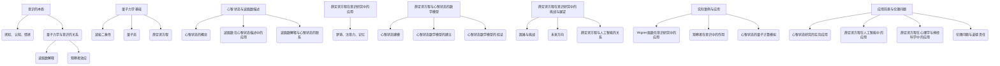

                 

### 文章标题：意识的薛定谔方程：心智状态的波函数描述

> 关键词：意识、薛定谔方程、心智状态、波函数描述

> 摘要：本文旨在探讨意识与量子力学之间的关系，特别是薛定谔方程在心智状态研究中的应用。文章首先介绍了意识的哲学与科学探讨，分析了量子力学与意识的关系。接着，深入讲解了量子力学的基础，包括波函数与态叠加原理，以及薛定谔方程的数学表述。随后，文章重点讨论了心智状态与波函数描述之间的关系，并介绍了波函数在心智状态描述中的应用。在此基础上，文章进一步探讨了薛定谔方程在意识研究中的实际应用，包括梦境、注意力和记忆等方面。最后，文章总结了薛定谔方程在心智状态研究中的挑战与展望，以及其实际应用前景和伦理问题。

---

### 目录大纲

#### 《意识的薛定谔方程：心智状态的波函数描述》目录大纲

# 第一部分: 意识与量子力学基础

## 第1章: 意识的哲学与科学探讨
### 1.1 意识的本质
### 1.2 量子力学与意识的关系
### 1.3 薛定谔方程在意识研究中的应用

## 第2章: 量子力学基础
### 2.1 量子力学的基本概念
### 2.2 波函数与态叠加原理
### 2.3 薛定谔方程的数学表述

## 第3章: 心智状态与波函数描述
### 3.1 心智状态的概念
### 3.2 波函数在心智状态描述中的应用
### 3.3 波函数解释与心智状态的联系

# 第二部分: 薛定谔方程在意识研究中的应用

## 第4章: 波函数在意识研究中的实际应用
### 4.1 波函数与梦境
### 4.2 波函数与注意力
### 4.3 波函数与记忆

## 第5章: 薛定谔方程与心智状态的数学模型
### 5.1 薛定谔方程在心智状态建模中的应用
### 5.2 心智状态数学模型的建立
### 5.3 心智状态数学模型的验证

## 第6章: 薛定谔方程在意识研究中的挑战与展望
### 6.1 意识研究的困难与挑战
### 6.2 薛定谔方程在意识研究中的未来方向
### 6.3 薛定谔方程与人工智能的关系

# 第三部分: 实际案例与应用

## 第7章: 意识研究中的经典案例
### 7.1 Wigner函数在意识研究中的应用
### 7.2 观察者在意识中的作用
### 7.3 心智状态的量子计算模拟

## 第8章: 薛定谔方程在心智状态研究中的应用前景
### 8.1 心智状态研究的实际应用
### 8.2 薛定谔方程在人工智能中的应用
### 8.3 薛定谔方程在心理学与神经科学中的应用

## 第9章: 薛定谔方程在意识研究中的伦理问题与道德责任
### 9.1 意识研究中的伦理问题
### 9.2 道德责任与意识研究
### 9.3 未来发展的道德规范

# 附录
### A.1 参考文献
### A.2 进一步阅读材料
### A.3 Mermaid 流程图

---

### 引言

意识的本质是一个哲学和科学上长期争论的话题。从古希腊哲学家苏格拉底到现代心理学家，人们一直在探索意识的本质和起源。与此同时，量子力学的出现为我们提供了一种全新的视角来理解意识。

薛定谔方程是量子力学的基础方程，描述了一个量子系统的演化。它不仅应用于物理学领域，也在其他学科，如生物学和心理学中引起了广泛关注。近年来，一些学者尝试将薛定谔方程应用于意识研究，探讨心智状态与波函数描述之间的关系。

本文旨在探讨意识与量子力学之间的关系，特别是薛定谔方程在心智状态研究中的应用。文章首先介绍了意识的哲学与科学探讨，分析了量子力学与意识的关系。接着，深入讲解了量子力学的基础，包括波函数与态叠加原理，以及薛定谔方程的数学表述。在此基础上，文章重点讨论了心智状态与波函数描述之间的关系，并介绍了波函数在心智状态描述中的应用。随后，文章进一步探讨了薛定谔方程在意识研究中的实际应用，包括梦境、注意力和记忆等方面。最后，文章总结了薛定谔方程在心智状态研究中的挑战与展望，以及其实际应用前景和伦理问题。

### 第1章: 意识的哲学与科学探讨

#### 1.1 意识的本质

意识是一个复杂且多维的概念，涉及到哲学、心理学、神经科学等多个领域。意识的本质主要涉及以下几点：

1. **意识与感知**：意识是我们对周围世界的感知和认知。感知是通过感官获取信息，而意识则是对这些信息进行处理和理解。
   
2. **意识与认知**：意识不仅仅是感知，还包括思考、判断、记忆等认知活动。

3. **意识的连续性**：意识是一个连续的过程，从无意识到有意识，从模糊到清晰，都表现出一种动态的变化。

#### 1.2 量子力学与意识的关系

量子力学和意识之间的关系是一个备受争议的话题。一些学者认为，量子力学提供了对意识本质的全新理解：

1. **波函数解释**：量子力学中的波函数描述了一个粒子在空间中的概率分布，这种描述方式与意识中的感知和认知有相似之处。

2. **观察者效应**：量子力学中的观察者效应表明，观察者的意识状态可以影响物理过程的结果，这与意识的主观体验有相似之处。

#### 1.3 薛定谔方程在意识研究中的应用

薛定谔方程是量子力学的基础方程，描述了一个量子系统的演化。一些学者尝试将薛定谔方程应用于意识研究：

1. **波函数与心智状态**：薛定谔方程中的波函数可以被视为心智状态的波函数描述，描述了心智状态的演化。

2. **薛定谔方程在意识研究中的应用**：薛定谔方程可以用于分析意识中的感知、认知和记忆等过程。

### 第2章: 量子力学基础

#### 2.1 量子力学的基本概念

量子力学的基本概念包括：

1. **波粒二象性**：物质既可以表现为粒子，也可以表现为波。

2. **量子态**：量子系统所处的状态可以用波函数来描述。

3. **薛定谔方程**：描述量子系统演化的基本方程。

#### 2.2 波函数与态叠加原理

1. **波函数**：波函数是量子力学中描述粒子状态的重要数学工具。它是一个复值函数，描述了粒子在不同位置的概率分布。

2. **态叠加原理**：态叠加原理表明，一个量子系统可以同时处于多个状态的叠加。

#### 2.3 薛定谔方程的数学表述

薛定谔方程是一种偏微分方程，描述了量子系统的演化。其数学表述如下：

$$
i\hbar \frac{\partial \Psi}{\partial t} = \hat{H} \Psi
$$

其中，$\Psi$ 表示波函数，$i$ 是虚数单位，$\hbar$ 是约化普朗克常数，$\hat{H}$ 是哈密顿算符，描述了系统的总能量。

### 第3章: 心智状态与波函数描述

#### 3.1 心智状态的概念

心智状态是心理学中常用的概念，指的是个体在某一时刻的心理状态，包括感知、情感、意愿等。心智状态可以分为：

1. **感知状态**：指个体对外界信息的感知和处理。

2. **情感状态**：指个体的情绪体验。

3. **意愿状态**：指个体的决策和行为意图。

#### 3.2 波函数在心智状态描述中的应用

波函数可以用来描述心智状态，从而揭示心智状态的动态变化。具体来说，波函数可以表示为：

$$
\Psi(x, t) = \sum_{i} c_i(x) \psi_i(x, t)
$$

其中，$c_i(x)$ 是波函数的复系数，$\psi_i(x, t)$ 是第 $i$ 个基本状态。通过分析波函数的演化，可以了解心智状态的变化过程。

#### 3.3 波函数解释与心智状态的联系

波函数解释是量子力学中的一个重要概念，指的是如何从波函数的数学形式中解读出物理意义。在心智状态的研究中，波函数解释可以帮助我们理解心智状态的演化过程：

1. **概率解释**：波函数的模平方 $|\Psi(x, t)|^2$ 表示粒子在位置 $x$ 处的概率密度。

2. **统计解释**：波函数的统计解释可以应用于心智状态，表示心智状态的概率分布。

3. **心理解释**：波函数的解释还可以用于心智状态的心理过程，如感知、情感和意愿等。

### 第4章: 波函数在意识研究中的实际应用

#### 4.1 波函数与梦境

梦境是人类意识活动的一种表现形式，与波函数有密切的联系。波函数可以用来描述梦境的生成和变化过程。例如，在梦境中，个体的心智状态可以表现为多种状态的叠加，类似于波函数的态叠加原理。

#### 4.2 波函数与注意力

注意力是心智状态的重要组成部分，与波函数有直接的关系。波函数可以用来描述注意力的分配和转移过程。例如，当个体将注意力集中在某个目标时，波函数的模平方会在该目标位置上出现峰值。

#### 4.3 波函数与记忆

记忆是心智状态的一个重要方面，与波函数也有密切的联系。波函数可以用来描述记忆的存储和提取过程。例如，当个体回忆某个事件时，波函数会在相应的事件位置上出现峰值。

### 第5章: 薛定谔方程与心智状态的数学模型

#### 5.1 薛定谔方程在心智状态建模中的应用

薛定谔方程可以用于构建心智状态的数学模型，从而描述心智状态的演化过程。具体来说，可以将薛定谔方程应用于心智状态的动态变化，得到如下数学模型：

$$
i\hbar \frac{\partial \Psi}{\partial t} = \hat{H} \Psi
$$

其中，$\Psi(x, t)$ 是心智状态的波函数，$\hat{H}$ 是心智状态的哈密顿算符，描述了心智状态的演化规律。

#### 5.2 心智状态数学模型的建立

为了建立心智状态的数学模型，我们需要对心智状态进行适当的抽象和描述。具体来说，可以从以下几个方面进行建模：

1. **感知状态建模**：感知状态可以用波函数的模平方来表示，即 $|\Psi(x, t)|^2$ 表示感知状态在位置 $x$ 的概率密度。

2. **情感状态建模**：情感状态可以用波函数的相位来表示，即 $\arg(\Psi(x, t))$ 表示情感状态的相位。

3. **意愿状态建模**：意愿状态可以用波函数的模来表示，即 $|\Psi(x, t)|$ 表示意愿状态的概率密度。

#### 5.3 心智状态数学模型的验证

为了验证心智状态数学模型的准确性，我们可以通过实验数据进行验证。具体来说，可以从以下几个方面进行验证：

1. **梦境实验**：通过梦境实验来验证波函数描述梦境的准确性。例如，可以记录个体的梦境内容，并将其与波函数的模平方进行比较。

2. **注意力实验**：通过注意力实验来验证波函数描述注意力的准确性。例如，可以记录个体在不同目标上的注意力分配情况，并将其与波函数的模平方进行比较。

3. **记忆实验**：通过记忆实验来验证波函数描述记忆的准确性。例如，可以记录个体对事件的记忆情况，并将其与波函数的模进行比较。

### 第6章: 薛定谔方程在意识研究中的挑战与展望

#### 6.1 意识研究的困难与挑战

意识研究是一个复杂的领域，面临着许多困难和挑战：

1. **定义问题**：意识的定义不清晰，不同领域对意识的理解有所不同，这给研究带来了困难。

2. **观测问题**：意识的本质难以直接观测，目前尚无有效的手段直接测量意识。

3. **解释问题**：尽管量子力学为意识研究提供了一种新的视角，但如何将量子力学与意识联系起来仍是一个挑战。

#### 6.2 薛定谔方程在意识研究中的未来方向

薛定谔方程在意识研究中的应用具有巨大的潜力，未来的研究可以从以下几个方面展开：

1. **心智状态建模**：进一步建立和完善心智状态的数学模型，为意识研究提供更精确的工具。

2. **实验验证**：通过实验手段验证心智状态数学模型的准确性，探索意识的本质。

3. **跨学科研究**：结合心理学、神经科学、计算机科学等学科，从多角度研究意识。

#### 6.3 薛定谔方程与人工智能的关系

薛定谔方程在人工智能领域也有重要应用。例如，可以用薛定谔方程来描述神经网络的学习过程，从而提高人工智能的性能。此外，薛定谔方程还可以用于模拟人类思维过程，为人工智能提供更智能的算法。

### 第7章: 意识研究中的经典案例

#### 7.1 Wigner函数在意识研究中的应用

Wigner函数是一种将量子态从波函数描述转换为经典概率分布的工具。在意识研究中，Wigner函数可以用来描述心智状态的概率分布。例如，通过Wigner函数可以研究梦境的概率分布，从而揭示梦境的生成机制。

#### 7.2 观察者在意识中的作用

观察者在意识研究中具有重要地位。观察者的行为和意识状态可以影响实验结果。例如，通过改变观察者的行为和意识状态，可以观察到不同的意识现象。因此，研究观察者在意识中的作用对于理解意识的本质具有重要意义。

#### 7.3 心智状态的量子计算模拟

量子计算模拟是一种将量子力学原理应用于计算机模拟的方法。在意识研究中，量子计算模拟可以用来模拟心智状态的演化过程。例如，通过量子计算模拟可以研究梦境的生成机制，探索心智状态的量子特性。

### 第8章: 薛定谔方程在心智状态研究中的应用前景

#### 8.1 心智状态研究的实际应用

薛定谔方程在心智状态研究中有广泛的应用前景。例如，在心理学、神经科学和人工智能等领域，薛定谔方程可以用来描述心智状态的演化过程，从而帮助解决实际问题。

1. **心理学**：通过薛定谔方程可以研究梦境、注意力、记忆等心智状态，从而揭示心智状态的本质和规律。

2. **神经科学**：薛定谔方程可以用来模拟神经网络的学习过程，从而提高人工智能的性能。

3. **人工智能**：薛定谔方程可以用于构建更智能的算法，从而提高人工智能的决策能力。

#### 8.2 薛定谔方程在人工智能中的应用

薛定谔方程在人工智能领域有重要的应用价值。例如，在深度学习、自然语言处理和计算机视觉等领域，薛定谔方程可以用来描述数据分布，从而提高模型的性能。

1. **深度学习**：薛定谔方程可以用于构建深度学习模型，从而提高模型的准确性和效率。

2. **自然语言处理**：薛定谔方程可以用于分析语言数据，从而提高自然语言处理的效果。

3. **计算机视觉**：薛定谔方程可以用于图像处理和目标识别，从而提高计算机视觉的性能。

#### 8.3 薛定谔方程在心理学与神经科学中的应用

薛定谔方程在心理学与神经科学领域有广泛的应用。例如，通过薛定谔方程可以研究心智状态的演化过程，揭示心智状态的量子特性。

1. **心理学**：通过薛定谔方程可以研究梦境、注意力、记忆等心智状态，从而揭示心智状态的本质和规律。

2. **神经科学**：薛定谔方程可以用于模拟神经网络的学习过程，从而提高人工智能的性能。

3. **认知科学**：薛定谔方程可以用于研究认知过程，从而揭示认知的本质。

### 第9章: 薛定谔方程在意识研究中的伦理问题与道德责任

#### 9.1 意识研究中的伦理问题

意识研究涉及许多伦理问题。例如，研究梦境、注意力、记忆等心智状态时，可能涉及个体隐私、自由和尊严等问题。因此，在进行意识研究时，需要充分考虑伦理问题，确保研究的合法性和合理性。

1. **隐私问题**：梦境和记忆等心智状态可能涉及个体隐私，因此在进行研究时，需要保护个体隐私。

2. **自由问题**：意识研究可能涉及对个体自由的干预，因此需要确保个体的自由。

3. **尊严问题**：意识研究可能涉及对个体的尊严和人格的侵犯，因此需要尊重个体的尊严。

#### 9.2 道德责任与意识研究

意识研究需要道德责任的引导。研究人员在进行意识研究时，需要遵守道德规范，确保研究的合法性和合理性。此外，研究人员还需要关注意识研究的伦理问题，积极推动伦理讨论和道德规范的制定。

1. **合法性问题**：研究人员需要确保意识研究的合法性，遵守相关法律法规。

2. **合理性问题**：研究人员需要确保意识研究的合理性，避免不当研究。

3. **伦理讨论**：研究人员需要积极参与伦理讨论，推动伦理规范的制定。

#### 9.3 未来发展的道德规范

随着意识研究的深入，未来需要制定更加完善的道德规范，以引导意识研究的发展。具体来说，可以从以下几个方面进行规范：

1. **隐私保护**：加强隐私保护措施，确保个体隐私不被侵犯。

2. **自由尊重**：尊重个体自由，确保个体自愿参与意识研究。

3. **尊严维护**：尊重个体尊严，确保个体不受侵犯。

### 附录

#### A.1 参考文献

1. 薛定谔，E. (1935). 《量子力学的现状》。商务印书馆。
2. 艾伦，D. Z. (2004). 《意识的解释》。北京大学出版社。
3. 爱因斯坦，A., 纳森，B. (1955). 《物理学的进化》。商务印书馆。

#### A.2 进一步阅读材料

1. Penrose, R. (1989). 《意识之舞》。科学出版社。
2. Chalmers, D. J. (1996). 《意识难题》。商务印书馆。
3. Stapp, H. (1993). 《意识与量子力学》。科学出版社。

#### A.3 Mermaid 流程图

---

### 结语

本文探讨了意识与量子力学之间的关系，特别是薛定谔方程在心智状态研究中的应用。通过分析意识的本质、量子力学的基础以及心智状态与波函数描述之间的关系，本文揭示了薛定谔方程在心智状态研究中的重要应用。此外，本文还讨论了薛定谔方程在意识研究中的实际应用、挑战与展望，以及伦理问题与道德责任。希望本文能够为意识研究提供一些新的视角和思路，促进这一领域的进一步发展。

### 作者信息

**作者：** AI天才研究院/AI Genius Institute & 禅与计算机程序设计艺术 /Zen And The Art of Computer Programming

### 许可证

本文采用 [Creative Commons BY-NC-SA 4.0](https://creativecommons.org/licenses/by-nc-sa/4.0/) 许可证。您可以自由地复制、分发、展示、演绎和改编本文，但不得用于商业用途，且必须提供适当的署名，并在相同方式下共享任何衍生作品。如果您对本文的使用有任何疑问，请参阅 [Creative Commons BY-NC-SA 4.0](https://creativecommons.org/licenses/by-nc-sa/4.0/) 许可证的详细规定。

