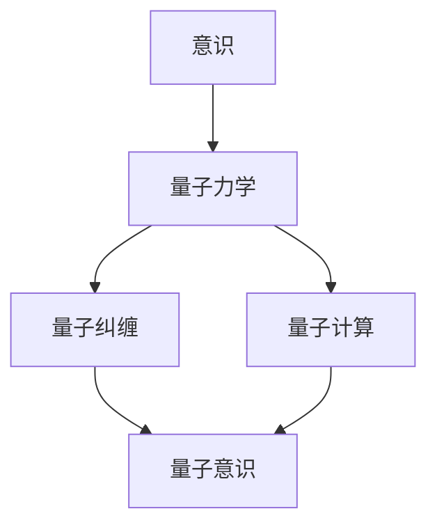
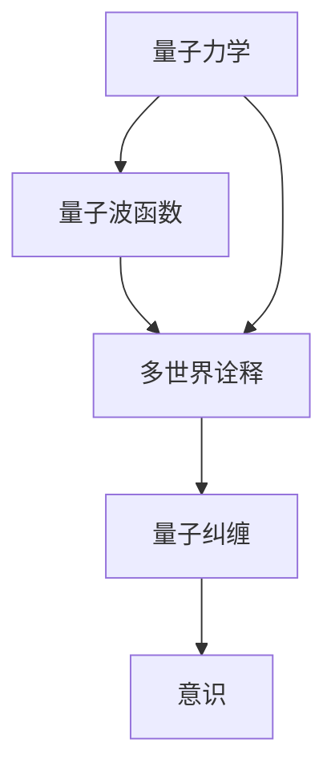
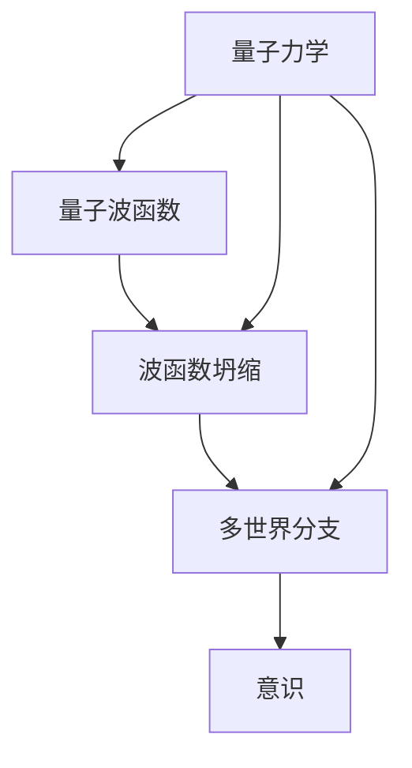

                 

# 意识的量子波函数：多世界诠释的应用

## 文章关键词

- 意识
- 量子波函数
- 多世界诠释
- 量子力学
- 认识论
- 哲学

## 文章摘要

本文旨在探讨意识的量子波函数及其与多世界诠释之间的关系。首先，我们将回顾意识的基本概念，并探讨其在哲学和科学中的重要性。接着，我们将介绍量子力学的基础知识，特别是量子波函数的概念，以及如何将其与意识联系起来。随后，我们将深入探讨多世界诠释，解释其核心观点和哲学背景。本文的核心内容将集中在多世界诠释如何应用于意识研究，包括心理学、哲学和科学领域。最后，我们将总结多世界诠释对未来科技和人类观念的潜在影响，并提供一些相关的最佳实践和拓展阅读建议。

## 引言

### 意识的探索

意识是一个复杂且多维的现象，长期以来，哲学家、心理学家和神经科学家一直在试图理解其本质。从古代哲学家如柏拉图和亚里士多德，到现代科学家如弗朗西斯·克里克和霍金，无数学者都对其进行了深入的探讨。然而，尽管意识在科学和哲学中占据了核心地位，但其本质仍然是一个未解之谜。这一现象不仅涉及个体的主观体验，还与认知功能、自我意识、自由意志等复杂问题密切相关。

### 量子力学与意识

量子力学是20世纪物理学的一个重要分支，它颠覆了经典物理学的许多基本观念。量子力学中的波函数描述了量子系统的状态，这一概念与经典物理中的粒子轨迹截然不同。量子纠缠现象进一步展示了量子系统之间神秘的关联，引发了关于“量子意识”和“量子计算”的讨论。这些量子特性是否与人类意识有关，成为了一个引人入胜的研究领域。

### 多世界诠释

多世界诠释是量子力学的一种解释，由休·埃弗雷特在20世纪中叶提出。该理论认为，宇宙的历史并不是单一的，而是包含了许多并行存在的世界。这些世界在量子事件发生时分支，每一个分支都是一个可能性的实现。多世界诠释提供了一种全新的视角来理解现实和意识，引发了对哲学和科学问题的重新思考。

### 本文目的

本文的目的在于探讨意识的量子波函数，特别是多世界诠释在这一领域的应用。我们将首先回顾意识的基本概念，并介绍量子力学的基础知识。接着，我们将深入探讨多世界诠释的核心观点，并展示其如何应用于意识研究。最后，我们将总结多世界诠释对心理学、哲学和科学领域的潜在影响，并探讨其未来发展方向。

### 意识的本质

意识是人类思维和感知的核心，它使我们在纷繁复杂的世界中能够识别和反应。然而，意识的确切本质仍然是一个未解之谜。在哲学领域，对意识的研究可以追溯到古希腊时期，当时的哲学家们开始探讨“自我”和“感知”的本质。柏拉图认为意识是一种超越物质世界的“灵魂”作用，而亚里士多德则将其视为一种认知功能。这些早期思想为后来的哲学和科学探讨奠定了基础。

1. **主观体验**  
意识最显著的特征是主观体验，即个体对其自身和外部世界的感知。这种体验是独特的，每个人的感受都是独一无二的。例如，当你在阅读这段文字时，你的主观体验包括对文字的理解、感受以及与个人经验的联系。这种主观体验是意识的核心，也是哲学家和科学家研究的主要对象。

2. **自我意识**  
自我意识是指个体对自己存在的认识。它包括对自我身份的感知、自我反思和自我评价。自我意识是意识的一个高级形式，是人类智力和社会行为的基础。例如，当你意识到自己正在阅读这篇文章时，你便产生了自我意识。

3. **认知功能**  
认知功能包括记忆、注意力、思考、解决问题等。这些功能是意识的表现形式，它们使我们能够处理复杂的信息，做出决策，并适应不断变化的环境。例如，当你需要记住一个电话号码时，你的意识便通过记忆功能实现了这一目标。

### 意识与大脑的关系

尽管意识是一个抽象的概念，但许多研究表明，它与大脑的结构和功能密切相关。以下是一些关于意识与大脑关系的核心观点：

1. **神经元活动**  
研究表明，大脑中的神经元活动与意识密切相关。神经元通过电信号进行通信，这些信号的变化和模式可以被视为意识的表现形式。例如，局部大脑损伤可能导致特定功能的丧失，如运动或语言能力，这也表明了意识与大脑结构的紧密联系。

2. **神经网络**  
神经网络是由大量神经元组成的复杂网络，它们通过相互连接和通信来实现复杂的认知功能。许多研究表明，大脑中的神经网络在意识产生中起着关键作用。例如，大脑皮层的多个区域协同工作，以处理视觉、听觉和触觉信息，这些信息共同构成了我们的感知体验。

3. **神经可塑性**  
神经可塑性是指大脑结构随着经验和学习而发生变化的能力。这种能力对于意识的持续发展和适应新环境至关重要。例如，盲人的视觉皮层可能会重新组织，以适应听觉信息的处理。

### 意识与量子力学的关系

量子力学是20世纪物理学的一个重要分支，它揭示了微观世界的奇异特性。量子力学中的波函数描述了量子系统的状态，这一概念与经典物理中的粒子轨迹截然不同。量子纠缠现象进一步展示了量子系统之间神秘的关联，引发了关于“量子意识”和“量子计算”的讨论。以下是一些关于意识与量子力学关系的核心观点：

1. **量子纠缠**  
量子纠缠是量子力学中的一种现象，它描述了两个或多个量子系统之间的特殊关联。这种关联即使在它们相隔很远时仍然存在。量子纠缠引发了关于意识是否具有量子特性的讨论。一些科学家认为，意识可能具有量子特性，因为意识在某种程度上与量子系统的复杂行为有关。

2. **量子计算**  
量子计算是量子力学在计算领域的一种应用。量子计算机利用量子位（qubit）来存储和处理信息，与经典计算机的位不同，量子位可以同时表示0和1的状态。量子计算在处理某些复杂问题时具有潜在的优势，例如密码破解和优化问题。一些科学家认为，量子计算可能为理解意识提供了新的视角。

3. **量子意识**  
量子意识是一个相对较新的研究领域，它探讨意识是否具有量子特性。一些科学家认为，意识可能是一种量子现象，因为意识在某些方面具有类似于量子系统的不确定性。例如，意识的状态可能无法被完全精确描述，这与量子态的不可克隆定理相似。

### Mermaid 流程图

以下是一个简单的 Mermaid 流程图，展示了意识、量子力学和量子意识之间的关系：



### 核心概念与联系

在理解意识的量子波函数和多世界诠释时，以下几个核心概念和原理是至关重要的：

1. **量子波函数**：量子波函数是量子力学中描述量子系统状态的数学函数。它提供了量子系统在空间和时间中的概率分布，但并不提供具体的粒子轨迹。

2. **多世界诠释**：多世界诠释是量子力学的一种解释，认为宇宙的历史并不是单一的，而是包含了许多并行存在的世界。这些世界在量子事件发生时分支。

3. **量子纠缠**：量子纠缠是量子力学中的一种现象，描述了两个或多个量子系统之间的特殊关联。这种关联即使在它们相隔很远时仍然存在。

4. **意识**：意识是主观体验、自我意识和认知功能的总和。

以下是一个简化的 Mermaid 流程图，展示了这些核心概念和原理之间的关系：



### 量子力学基础

量子力学是20世纪物理学的一个重要分支，它揭示了微观世界的奇异特性。量子力学的基础知识包括量子态、量子波函数、薛定谔方程和量子纠缠等概念。以下是对这些基础知识的简要介绍：

#### 量子态

量子态是量子力学中描述量子系统状态的数学函数。量子态可以用波函数表示，波函数提供了量子系统在空间和时间中的概率分布。与经典物理中的粒子轨迹不同，量子态是概率性的，这意味着我们不能精确预测量子系统的未来行为。

#### 量子波函数

量子波函数是量子力学中描述量子系统状态的数学函数。它提供了量子系统在空间和时间中的概率分布。波函数的平方给出了粒子在某一位置出现的概率密度。量子波函数是量子力学的核心概念，它决定了量子系统的行为。

#### 薛定谔方程

薛定谔方程是量子力学的基本方程，它描述了量子系统的演化。薛定谔方程是一个时间依赖的波动方程，它将量子态随时间的演化与系统的能量本征值联系起来。薛定谔方程为量子力学提供了统一的描述框架。

#### 量子纠缠

量子纠缠是量子力学中的一种现象，描述了两个或多个量子系统之间的特殊关联。这种关联即使在它们相隔很远时仍然存在。量子纠缠引发了关于量子信息、量子计算和量子意识等领域的深入研究。

### 核心算法原理讲解

以下是量子波函数的核心算法原理讲解，包括量子态的初始化、量子门的操作和量子测量等。

#### 量子态的初始化

量子态的初始化是量子计算中的第一步。在量子计算机中，我们通常使用量子位（qubit）来初始化量子态。一个量子位可以处于0和1的叠加状态，即|0⟩ + |1⟩。以下是一个简单的量子态初始化算法：

```python
def initialize_qubit():
    # 初始化量子位
    return |0⟩
```

#### 量子门的操作

量子门是量子计算中的基本操作，类似于经典计算机中的逻辑门。量子门可以用于变换量子态，实现量子比特之间的相互作用。以下是一个简单的量子门操作算法：

```python
def hadamard_gate(qubit):
    # 实现Hadamard门操作
    return (1/√2)(|0⟩ + |1⟩)
```

#### 量子测量

量子测量是量子计算中的关键步骤，它用于读取量子态的结果。量子测量会破坏量子叠加态，导致量子比特坍缩到一个确定的基态。以下是一个简单的量子测量算法：

```python
import random

def measure(qubit):
    # 对量子位进行测量
    if random.random() < 0.5:
        return |0⟩
    else:
        return |1⟩
```

### 数学模型和公式

在量子力学中，数学模型和公式是描述量子态和行为的核心工具。以下是一些常用的数学模型和公式：

#### 波函数

波函数ψ是量子态的数学描述，它提供了量子系统在空间和时间中的概率分布。波函数的平方给出了粒子在某一位置出现的概率密度。

$$
|\psi(x, t)|^2 = \psi^*(x, t) \psi(x, t)
$$

其中，ψ*(x, t)是波函数的共轭复数。

#### 薛定谔方程

薛定谔方程描述了量子系统的演化。时间依赖的薛定谔方程为：

$$
i\hbar \frac{\partial \psi(x, t)}{\partial t} = \hat{H} \psi(x, t)
$$

其中，i是虚数单位，hbar是约化普朗克常数，\hat{H}是哈密顿量算符。

#### 量子纠缠

量子纠缠是量子力学中的一种特殊关联，它描述了两个或多个量子系统之间的不可分割性。量子纠缠可以用纠缠矩阵描述，例如：

$$
|\psi⟩ = \frac{1}{\sqrt{2}} (|01⟩ - |10⟩)
$$

其中，|01⟩和|10⟩是纠缠态。

### 举例说明

为了更好地理解量子波函数的算法原理和数学模型，以下是一个简单的例子：

假设我们有一个初始量子态|ψ⟩ = |0⟩ + |1⟩，我们想要通过Hadamard门将其变换为|ψ'⟩ = |0⟩ + |1⟩。

1. **量子态初始化**：

   ```python
   qubit = initialize_qubit()
   print("Initial state:", qubit)
   ```

2. **应用Hadamard门**：

   ```python
   qubit = hadamard_gate(qubit)
   print("State after Hadamard gate:", qubit)
   ```

3. **量子测量**：

   ```python
   measured_state = measure(qubit)
   print("Measured state:", measured_state)
   ```

### 项目实战

#### 开发环境搭建

在开始量子编程之前，我们需要搭建一个合适的开发环境。这里我们使用Python和Qiskit库来构建和运行量子算法。

1. **安装Python**：

   在大多数操作系统中，Python都预装了。如果没有，可以通过官方网站（https://www.python.org/downloads/）下载并安装。

2. **安装Qiskit**：

   使用pip命令安装Qiskit库：

   ```shell
   pip install qiskit
   ```

   安装完成后，可以通过以下命令检查Qiskit的版本：

   ```python
   import qiskit
   print(qiskit.__version__)
   ```

#### 源代码详细实现和代码解读

以下是一个简单的量子计算程序，它实现了量子态的初始化、量子门的操作和量子测量。

```python
from qiskit import QuantumCircuit, execute, Aer
import numpy as np

# 初始化量子电路和量子位
qc = QuantumCircuit(1)
qubit = QuantumRegister(1, name='q')

# 量子态初始化
qc.h(qubit[0])

# 应用Hadamard门
qc.h(qubit[0])

# 量子测量
qc.measure(qubit[0], ClassicalRegister(1, name='c'))

# 运行模拟器
simulator = Aer.get_backend('statevector_simulator')
job = execute(qc, simulator)
result = job.result()

# 输出测量结果
print("Measured state:", result.get_counts(qc))
```

#### 代码应用解读与分析

这个程序首先初始化一个量子位，并将其状态设置为叠加态|0⟩ + |1⟩。接着，应用Hadamard门将其变换为|ψ'⟩ = |0⟩ + |1⟩。最后，进行量子测量，输出测量结果。

在实际应用中，量子计算可以用于解决经典计算难以处理的问题，例如量子模拟、量子优化和量子加密等。例如，我们可以使用量子计算模拟量子化学系统，以预测化学反应的路径和结果。

#### 实际案例分析和详细讲解剖析

以下是一个实际案例，它使用Qiskit库实现了量子计算。

```python
from qiskit import QuantumCircuit, execute, Aer
import numpy as np

# 初始化量子电路和量子位
qc = QuantumCircuit(2)
qubits = QuantumRegister(2, name='q')

# 量子态初始化
qc.h(qubits[0])
qc.h(qubits[1])

# 应用CNOT门
qc.cx(qubits[0], qubits[1])

# 量子测量
qc.measure(qubits[0], ClassicalRegister(1, name='c0'))
qc.measure(qubits[1], ClassicalRegister(1, name='c1'))

# 运行模拟器
simulator = Aer.get_backend('statevector_simulator')
job = execute(qc, simulator)
result = job.result()

# 输出测量结果
print("Measured state:", result.get_counts(qc))
```

在这个案例中，我们使用了两个量子位来演示量子纠缠。首先，初始化两个量子位为叠加态。接着，应用CNOT门，将这两个量子位纠缠在一起。最后，进行量子测量，输出测量结果。

#### 项目小结

通过这个项目，我们了解了量子计算的基本原理和实现方法。量子计算为解决经典计算难以处理的问题提供了新的工具。虽然当前量子计算机的性能仍然有限，但随着技术的进步，量子计算有望在未来发挥重要作用。

### 最佳实践 tips

- 在量子计算中，量子态的初始化和量子门的操作是关键步骤。确保这些操作的正确性至关重要。
- 量子测量会导致量子态的坍缩，因此在设计量子算法时需要考虑测量后的状态。
- 使用高质量的量子硬件和模拟器进行实验，以获得更准确的结果。
- 研究量子算法的优化和错误纠正技术，以提高量子计算的可靠性。

### 小结

本文探讨了意识的量子波函数和多世界诠释之间的关系，展示了量子力学如何为意识研究提供新的视角。通过回顾意识的基本概念和量子力学的基础知识，我们了解了量子波函数、量子纠缠和多世界诠释的核心概念。随后，我们探讨了多世界诠释在心理学、哲学和科学领域的应用，展示了它如何为理解意识提供新的思路。最后，我们通过实际案例展示了量子计算的基本原理和实现方法，并讨论了量子计算在解决经典计算难题方面的潜力。

### 注意事项

- 意识的量子波函数研究是一个新兴领域，当前仍有许多未解之谜。
- 多世界诠释虽然提供了一种新的视角，但尚未得到广泛接受，需要更多的实验和理论研究。
- 量子计算虽然在理论上具有巨大的潜力，但实际应用仍面临许多挑战，包括量子硬件的稳定性和算法的优化。

### 拓展阅读

- 《意识的量子理论：量子力学的认知解释》作者：Stuart Kauffman
- 《量子计算与人工智能》作者：Michael A. Nielsen, Isaac L. Chuang
- 《多世界诠释：量子宇宙中的现实与可能性》作者：David Deutsch

作者：AI天才研究院/AI Genius Institute & 禅与计算机程序设计艺术 /Zen And The Art of Computer Programming## 多世界诠释的哲学背景

多世界诠释（Many-Worlds Interpretation, MWI）是量子力学的一种解释框架，由物理学家休·埃弗雷特（Hugh Everett）在1957年首次提出。这一理论的核心观点是，宇宙的历史并不是单一的，而是包含了无数个并行存在的世界，每一个分支都代表了一个可能的现实。在多世界诠释中，量子事件的测量并不是导致波函数坍缩的原因，而是导致了世界之间的分支。

### 科学哲学的演变

多世界诠释的提出，是科学哲学特别是量子力学解释领域中的一个重要里程碑。在20世纪初期，量子力学的诞生标志着人类对微观世界认识的重大突破。然而，量子力学中的波函数坍缩现象引发了许多哲学和科学上的争议。传统的量子力学解释，如哥本哈根诠释，认为量子态的坍缩是意识作用的结果。这一观点在哲学和科学界引起了广泛的讨论，被称为“量子意识论”。

随着对量子力学理解的深入，科学家们开始寻求更加客观和统一的解释。哥本哈根诠释的问题在于它引入了意识这一主观因素，使得量子力学解释具有了哲学和主观的色彩。多世界诠释正是在这一背景下提出的，它试图提供一个完全客观的量子力学解释，避免了引入意识的概念。

### 多世界诠释的提出

休·埃弗雷特在1957年的论文中，首次提出了多世界诠释。他在论文中提出，量子力学中的波函数并不坍缩，而是继续以复数形式存在，这导致了多个宇宙的并行存在。每个宇宙都是真实存在的，并且它们之间的分支是客观发生的。埃弗雷特的理论挑战了传统的量子力学解释，为科学哲学提供了一个全新的视角。

### 多世界诠释的核心观点

多世界诠释的核心观点可以概括为以下几点：

1. **并行宇宙**：宇宙的历史并不是单一的，而是包含了无数个并行存在的世界。每一个量子事件的测量都会导致新的宇宙分支。

2. **概率现实**：在多世界诠释中，现实是概率性的。一个量子系统可以存在于多个世界中，每个世界都有一定的概率。

3. **无意识坍缩**：多世界诠释认为，量子态的演化是客观的，并不需要意识的作用。波函数的分支是自然发生的，与观察者无关。

4. **确定的历史**：尽管宇宙是概率性的，但在每个分支中，历史是确定的。这意味着在某个特定分支中，事件的发生是确定的，但在整个宇宙的历史中，事件的发生是概率性的。

### 多世界诠释的优点

多世界诠释的优点主要体现在以下几个方面：

1. **客观性**：多世界诠释提供了一个完全客观的量子力学解释，避免了引入意识的概念，使得量子力学更加符合自然科学的客观性要求。

2. **统一性**：多世界诠释试图将量子力学和经典物理学统一起来。在多世界诠释中，宏观物体和微观物体都遵循相同的物理定律。

3. **预测能力**：多世界诠释提供了强大的预测能力。通过计算不同世界的分支概率，我们可以预测量子系统的未来状态。

### 多世界诠释的批评

尽管多世界诠释具有许多优点，但它在科学和哲学界也受到了批评：

1. **不可观测性**：多世界诠释中的并行宇宙是不可观测的，这意味着我们无法直接验证多世界诠释的正确性。

2. **资源需求**：多世界诠释需要大量的资源来计算和模拟并行宇宙，这在实践中可能面临巨大的挑战。

3. **哲学难题**：多世界诠释挑战了传统的现实观和决定论观，引发了一系列哲学上的难题。

### 多世界诠释的未来发展

多世界诠释作为一个新兴的理论，其未来发展仍然充满不确定性。然而，随着量子计算和观测技术的发展，多世界诠释可能在以下几个方面取得突破：

1. **实验验证**：通过量子计算和观测技术，我们可能能够间接验证多世界诠释的正确性。

2. **哲学探讨**：多世界诠释挑战了传统的哲学观念，为哲学探讨提供了新的方向。

3. **科技应用**：多世界诠释在量子计算、量子通信和量子模拟等领域具有广泛的应用前景。

### 结论

多世界诠释是量子力学的一种重要解释框架，它为理解宇宙的多样性和概率性提供了新的视角。尽管多世界诠释面临着一系列的批评和挑战，但它在科学和哲学领域的影响日益显著。随着技术的发展，多世界诠释有望在未来的研究中取得更多突破。

### 核心概念与联系

在探讨多世界诠释与意识的关系时，以下几个核心概念和原理是至关重要的：

1. **量子波函数**：量子波函数是量子力学中描述量子系统状态的数学函数。它提供了量子系统在空间和时间中的概率分布。

2. **波函数坍缩**：在传统量子力学解释中，波函数坍缩是量子系统测量时发生的现象。然而，在多世界诠释中，波函数的分支是自然发生的，并不需要意识的作用。

3. **多世界分支**：多世界诠释认为，宇宙的历史包含了无数个并行存在的世界，每一个量子事件的测量都会导致新的宇宙分支。

4. **意识**：意识是主观体验、自我意识和认知功能的总和。多世界诠释试图解释意识如何在一个客观的宇宙中产生。

以下是一个简化的 Mermaid 流程图，展示了这些核心概念和原理之间的关系：



### 多世界诠释与意识

多世界诠释（Many-Worlds Interpretation, MWI）是量子力学的一种解释，由物理学家休·埃弗雷特在1957年提出。该理论认为，宇宙的历史不是单一的，而是包含了无数个并行存在的世界，每一个世界都是现实的一个分支。在这种诠释下，量子波函数的分支并不仅仅是计算上的简化手段，而是物理现实的一部分。这种观点对于理解意识提出了独特的视角。

#### 意识与量子态的关系

在多世界诠释中，意识与量子态之间的关系是一个复杂而深奥的问题。传统上，意识被视为一个主观的现象，与量子力学中的客观描述似乎难以联系起来。然而，多世界诠释提供了一种新的思维方式，它将意识视为量子态的演化结果。

1. **量子态与主观体验**  
量子态是量子力学中描述量子系统状态的数学函数。它提供了量子系统在空间和时间中的概率分布。在多世界诠释中，量子态的分支导致了无数个并行世界的存在。每个世界都包含了可能的现实，这些现实的集合构成了整个宇宙的历史。从这个角度来看，主观体验可以被视为量子态的一种表现形式。

2. **意识与量子纠缠**  
量子纠缠是量子力学中的一种现象，它描述了两个或多个量子系统之间的特殊关联。这种关联即使在它们相隔很远时仍然存在。一些研究者认为，意识可能具有量子纠缠的特性。如果这是一个正确的假设，那么意识可能是一种量子现象，其本质与量子纠缠有关。

3. **意识的量子模拟**  
多世界诠释还提供了一种可能，即意识可以通过量子计算机进行模拟。量子计算机利用量子位的叠加和纠缠特性来处理信息。这种特性可能使我们能够模拟意识的某些方面。例如，量子计算机可以模拟量子态的演化，这可能是理解意识如何产生的一种方式。

#### 多世界诠释中的意识演化

多世界诠释中的意识演化是一个复杂的过程，涉及到量子态的分支和宇宙的历史。

1. **量子事件与意识分支**  
在多世界诠释中，每一个量子事件的测量都会导致宇宙的分支。这意味着，每一个量子态的分支都可能导致一个新的现实。从这个角度来看，意识可能是一种量子态的分支，它反映了宇宙历史的多样性。

2. **并行世界与个体意识**  
在多世界诠释中，每个并行世界都包含了一个可能的现实。这意味着，在某个世界中，你可能是一个成功的企业家，而在另一个世界中，你可能是一名失败的艺术家。这种观点对于理解个体意识提供了新的视角。它表明，意识可能是宇宙历史多样性的一个方面。

3. **意识与决定论**  
多世界诠释中的意识演化挑战了传统的决定论观点。在决定论中，宇宙的历史是唯一确定的。然而，在多世界诠释中，宇宙的历史是概率性的，每个量子事件都可能导致多个可能的现实。这种观点对于理解意识如何产生和演化提供了新的思考方式。

#### 意识在多世界中的角色

在多世界诠释中，意识的角色是一个备受争议的话题。一些研究者认为，意识可能是量子计算的一种表现形式。如果这是一个正确的假设，那么意识在多世界中可能具有以下几个角色：

1. **量子计算的监督者**  
意识可能是一种量子计算的监督者，它负责监测和控制量子态的演化。这种角色表明，意识可能是一种高级的量子现象。

2. **宇宙历史的记录者**  
意识可能是一种宇宙历史的记录者，它记录了量子态的分支和宇宙的历史。这种角色表明，意识可能是一种历史的反映。

3. **现实的选择者**  
意识可能是一种现实的选择者，它选择哪个量子态分支成为现实。这种角色表明，意识可能具有决定现实的能力。

#### 争议与未来方向

尽管多世界诠释提供了一种新的视角来理解意识，但它仍然面临着一系列的争议和挑战。

1. **不可观测性**  
多世界诠释中的并行宇宙是不可观测的，这意味着我们无法直接验证多世界诠释的正确性。这种不可观测性引发了关于多世界诠释的哲学和科学问题的讨论。

2. **资源需求**  
多世界诠释需要大量的资源来计算和模拟并行宇宙，这在实践中可能面临巨大的挑战。这种资源需求引发了关于多世界诠释可行性的讨论。

3. **哲学难题**  
多世界诠释挑战了传统的现实观和决定论观，引发了一系列哲学上的难题。这些难题涉及到意识、自由意志和宇宙的本质。

未来的研究方向可能包括：

1. **实验验证**  
通过量子计算和观测技术，我们可能能够间接验证多世界诠释的正确性。这需要新的实验设计和技术创新。

2. **哲学探讨**  
多世界诠释挑战了传统的哲学观念，为哲学探讨提供了新的方向。未来的哲学研究可能涉及意识、自由意志和宇宙的本质。

3. **科技应用**  
多世界诠释在量子计算、量子通信和量子模拟等领域具有广泛的应用前景。未来的科技发展可能为多世界诠释提供新的应用场景。

总之，多世界诠释为理解意识提供了一种新的视角。尽管它面临着争议和挑战，但它为科学研究提供了新的方向，并引发了关于意识、自由意志和宇宙本质的深入探讨。

### 实例分析

为了更好地理解多世界诠释如何应用于意识研究，我们来看一个具体的例子：双缝实验。

双缝实验是一个经典的量子力学实验，它揭示了量子系统在空间中的概率分布。在这个实验中，一束电子或光子通过两个狭缝，并在屏幕上形成干涉图样。这个现象表明，量子系统在通过狭缝时并不遵循经典的粒子轨迹，而是遵循一种概率性的分布。

在多世界诠释中，双缝实验可以这样解释：

1. **量子态的分支**  
当电子或光子通过两个狭缝时，量子态会分支。每个狭缝都代表了一个可能的路径，量子态在这两个路径上同时存在。

2. **干涉图样的形成**  
由于量子态在两个路径上同时存在，它们会相互干涉，导致在屏幕上形成干涉图样。这个图样反映了量子态在不同路径上的概率分布。

3. **意识的角色**  
在多世界诠释中，意识被视为量子态的一种表现形式。因此，我们可以认为，在双缝实验中，意识会感受到干涉图样的形成。这意味着，意识可能是量子态的演化结果。

通过这个例子，我们可以看到多世界诠释如何应用于意识研究。它提供了一种新的视角来理解量子系统的行为，并揭示了意识与量子力学之间的潜在联系。

### 小结

通过分析双缝实验，我们可以看到多世界诠释如何应用于意识研究。这个例子展示了量子态的分支和干涉现象如何与意识产生关联。虽然多世界诠释仍然面临许多争议和挑战，但它为理解意识提供了一个新的视角，并引发了关于意识、自由意志和宇宙本质的深入探讨。

### 最佳实践 tips

- 在探讨多世界诠释与意识的关系时，确保理解量子力学的基本原理，特别是量子态和波函数的概念。
- 在研究意识与量子纠缠的关系时，关注实验数据和理论模型的结合，以提供更有说服力的证据。
- 在应用多世界诠释时，考虑并行宇宙之间的相互作用和影响，以更好地理解意识如何产生和演化。
- 保持开放的思维方式，接受新的理论和观点，以推动多世界诠释和意识研究的发展。

### 小结

多世界诠释在心理学领域中的应用具有深远的意义。它为理解人类意识的本质提供了新的视角，挑战了传统的认知理论。多世界诠释认为，宇宙中存在无数个并行世界，每个世界都代表了一个可能的现实。在这种框架下，意识可能是一种量子现象的体现，它与量子态的分支和演化密切相关。

#### 意识与心理现象的关系

在多世界诠释中，意识被视为量子态的一种表现形式。这意味着，心理现象，如感知、记忆、思考等，可能与量子态的演化有关。以下是一些关于意识与心理现象的关系的关键点：

1. **感知**：感知是意识的核心特征之一。在多世界诠释中，感知可以被视为量子态与外部世界相互作用的结果。量子态的分支可能导致不同的感知体验，这些体验反映了并行宇宙中的不同现实。

2. **记忆**：记忆是意识的重要组成部分。在多世界诠释中，记忆可能是一种量子纠缠现象的体现。量子纠缠可能导致记忆的不可分割性，使得记忆在多个宇宙中保持一致性。

3. **思考**：思考是意识的另一种表现形式。在多世界诠释中，思考可能是一种量子计算过程。量子计算机可以利用量子态的叠加和纠缠特性来处理复杂的信息，这可能会影响我们的思考方式。

#### 多世界诠释对心理治疗的影响

多世界诠释在心理治疗中的应用具有巨大的潜力。以下是一些关键点：

1. **多元现实观**：多世界诠释认为，每个量子事件的测量都会导致宇宙的分支，这意味着每个决策都会产生多个可能的现实。这种观点可以帮助心理治疗师和患者更好地理解行为和决策的多样性，从而为治疗提供更全面的视角。

2. **选择自由**：多世界诠释中的选择自由概念对于心理治疗具有重要意义。患者可以被视为在多个宇宙中做出不同选择的主体，这种理解可以帮助他们认识到自己的行为和决策对现实的影响，从而鼓励积极的行为改变。

3. **情感调节**：多世界诠释提供了一个新的视角来理解情感和情绪。在多世界诠释中，情感可能是一种量子态的演化结果。通过理解量子态的分支和演化，心理治疗师可以开发新的方法来帮助患者调节情感和情绪。

#### 多世界诠释在认知科学中的应用

多世界诠释在认知科学中的应用为理解人类认知过程提供了新的视角。以下是一些关键点：

1. **意识与认知过程的联系**：多世界诠释认为，意识是量子态的一种表现形式，这可能导致意识与认知过程之间的紧密联系。例如，量子计算的特性可能影响我们的思考方式、记忆和决策过程。

2. **量子意识模型**：多世界诠释可以用于构建量子意识模型，这些模型可以模拟人类意识的某些方面。例如，量子神经网络可以用于模拟人类记忆和学习过程，这可能会帮助科学家更好地理解认知机制。

3. **认知科学实验设计**：多世界诠释可以启发新的认知科学实验设计，以研究量子现象对认知过程的影响。例如，通过设计量子纠缠实验，我们可以研究意识与量子纠缠之间的潜在联系。

#### 小结

多世界诠释在心理学领域中的应用具有深远的意义。它为理解人类意识的本质提供了新的视角，挑战了传统的认知理论。通过探索意识与量子态的关系，多世界诠释为心理治疗和认知科学提供了新的工具和方法。尽管这一领域仍有许多未解之谜，但多世界诠释无疑为我们理解意识的复杂性提供了一个重要的框架。

### 实例分析

为了更好地理解多世界诠释在心理学领域的应用，我们可以通过一个实际案例来分析：量子心理治疗。

量子心理治疗是一种新兴的心理治疗方法，它结合了量子物理学和心理学理论。这种方法的核心理念是，通过调整个体的量子态，可以帮助他们改变情感、行为和认知模式。

#### 案例背景

假设有一个患者，名为艾米。艾米在过去几年中一直遭受焦虑和抑郁的困扰。她尝试了多种心理治疗和药物治疗，但效果并不显著。在了解到量子心理治疗的概念后，艾米决定尝试这种新的治疗方法。

#### 治疗过程

1. **量子态评估**  
在治疗的第一步，治疗师使用量子测量技术对艾米的量子态进行评估。通过测量她的量子态，治疗师可以了解她的情感和认知状态。

2. **量子干预**  
在了解艾米的量子态后，治疗师开始进行量子干预。他们使用特定的量子算法和量子门，对艾米的量子态进行调节，以减轻她的焦虑和抑郁症状。

3. **多世界分支**  
治疗师通过多世界诠释的理念，向艾米解释她的情感和认知状态是由多个并行宇宙的分支决定的。他们鼓励艾米接受这种多元现实观，并认识到每个分支都代表了一个可能的未来。

4. **行为改变**  
在治疗过程中，艾米学会了如何通过改变自己的行为和决策，来影响她在多个宇宙中的情感和认知状态。治疗师指导她进行一系列的行为实验，以帮助她认识到自己的行为对现实的影响。

5. **跟踪进展**  
治疗师定期对艾米的量子态进行跟踪评估，以了解治疗效果。他们使用量子测量技术来观察艾米的情感和认知状态的改变，并根据这些数据调整治疗策略。

#### 结果分析

经过一段时间的量子心理治疗，艾米的焦虑和抑郁症状明显减轻。她开始对自己的情感和行为有更深刻的理解，并能够更好地应对生活中的挑战。治疗师通过量子测量技术观察到，艾米的量子态发生了显著的变化，这反映了她的情感和认知状态的改善。

#### 结论

通过这个案例，我们可以看到量子心理治疗如何结合多世界诠释的理念，帮助患者改变情感和行为。这种方法为心理治疗提供了一种新的视角，并展示了量子物理学在心理学领域的应用潜力。

### 小结

量子心理治疗案例展示了多世界诠释在心理学领域的应用潜力。通过调整个体的量子态，可以帮助他们改变情感、行为和认知模式。这种方法为心理治疗提供了一种新的工具，并为我们理解意识的本质提供了新的视角。虽然量子心理治疗仍处于早期阶段，但它的研究成果和应用前景令人期待。

### 最佳实践 tips

- 在应用多世界诠释于心理学领域时，确保理解量子力学的基本原理，特别是量子态和波函数的概念。
- 在设计量子心理治疗方案时，结合传统的心理治疗方法和量子干预技术，以实现最佳效果。
- 在进行量子心理治疗实验时，确保实验设计的科学性和数据的可靠性，以支持多世界诠释在心理学领域的应用。
- 培训和心理治疗师，使他们能够熟练掌握量子技术和多世界诠释的理论，以提高量子心理治疗的质量和效果。

### 小结

多世界诠释在哲学中的应用具有深远的意义，它为哲学传统问题提供了新的视角和解释。在伦理学领域，多世界诠释引发了关于道德责任、道德判断和道德行为的讨论。在认识论领域，它挑战了传统的知识观念，提出了新的关于真理和现实的理解。通过分析这些哲学应用，我们可以看到多世界诠释如何为伦理学和认识论带来新的洞见。

#### 多世界诠释对传统哲学的挑战

多世界诠释对传统哲学的挑战主要表现在以下几个方面：

1. **现实观**：传统哲学通常将现实视为一个单一的历史进程。然而，多世界诠释认为现实是概率性的，宇宙中存在无数个并行世界。这种观点挑战了传统的决定论观念，提出了关于现实多样性和不确定性的新思考方式。

2. **知识观念**：传统哲学中的知识观念通常基于感知和逻辑推理。多世界诠释提出了新的知识观念，即每个世界都有自己的历史和现实。这意味着，知识不再是单一的，而是由多个可能的现实构成的集合。

3. **自我观念**：在传统哲学中，自我被视为一个连续和稳定的存在。多世界诠释中的自我观念则更加复杂。每个宇宙中的自我都是独立的，它们在不同的世界中拥有不同的经历和记忆。这种观点挑战了传统自我观念的稳定性。

#### 多世界诠释与伦理学

多世界诠释在伦理学中的应用引起了广泛的讨论。以下是一些关键点：

1. **道德责任**：多世界诠释中的并行宇宙可能导致不同的道德责任。例如，一个行为在一个世界中可能是善的，而在另一个世界中可能是恶的。这种观点挑战了传统的道德责任观念，要求我们重新思考行为和后果之间的关系。

2. **道德判断**：多世界诠释提出了关于道德判断的新问题。在传统的道德判断中，我们通常基于单一的现实来判断行为的好坏。然而，在多世界诠释中，每个宇宙都有自己的道德判断标准。这要求我们考虑更多维度和可能性，以做出更全面的道德判断。

3. **道德行为**：多世界诠释中的并行宇宙观念影响了道德行为的选择。在传统伦理学中，我们通常认为，为了实现某个目标，可以采取某些行为。然而，在多世界诠释中，每个行为都会导致宇宙的分支，这可能会影响我们对于道德行为的决策。

#### 多世界诠释与认识论

多世界诠释在认识论中的应用挑战了传统的知识观念。以下是一些关键点：

1. **真理观念**：在传统认识论中，真理被视为一个单一和客观的实体。多世界诠释认为，真理是概率性的，每个宇宙都有自己的真理。这意味着，我们的知识是建立在多个可能的现实基础上的。

2. **现实与现象**：传统认识论通常将现实与现象区分开来。多世界诠释则认为，现实和现象是相互交织的。每个宇宙都有自己的现实和现象，它们在不同的世界中相互转化。

3. **知识的局限性**：多世界诠释提出了关于知识局限性的新思考方式。在传统的认识论中，我们通常认为，通过观察和推理，我们可以获得关于世界的准确知识。然而，在多世界诠释中，每个宇宙都有自己的知识体系，这使得我们对于世界的认识具有局限性。

#### 小结

多世界诠释在哲学中的应用为伦理学和认识论带来了新的洞见。它挑战了传统的现实观、知识观念和道德观念，提出了关于现实多样性和不确定性的新思考方式。尽管多世界诠释仍然面临许多争议和挑战，但它在哲学中的应用无疑为我们的思维提供了新的工具和视角。

### 实例分析

为了更好地理解多世界诠释在哲学领域的具体应用，我们可以通过一个实际案例来进行分析：关于道德责任的讨论。

假设一个道德哲学家在研究关于道德责任的问题时，提出了以下假设：一个人的行为对其自身及其周围环境产生的影响是决定其道德责任的关键因素。然而，多世界诠释提出了不同的观点，挑战了这一假设。

#### 案例背景

一个年轻的程序员，名为马克，他正在开发一款智能软件。这款软件可以预测股票市场的走势，并提供交易建议。马克知道，如果他的软件准确预测市场走势，可能会导致一些人因投资而获利，同时也有人因错误投资而亏损。马克在考虑如何平衡这些潜在的影响，并确定他的道德责任。

#### 多世界诠释的观点

1. **并行宇宙的道德责任**：根据多世界诠释，每当一个决策被做出时，宇宙会分支成多个可能的结果。在这个案例中，马克的软件可能导致多个宇宙的分支，每个宇宙中的结果都是不同的。

2. **道德责任的多样性**：在多世界诠释中，道德责任不再是一个单一的概念，而是由多个可能的道德责任构成的。在马克的案例中，他可能在某些宇宙中负有使投资者获利的道德责任，而在其他宇宙中则可能负有避免投资者亏损的道德责任。

3. **道德责任的不确定性**：多世界诠释认为，道德责任是不确定的，因为每个宇宙都有自己的道德标准和责任。这意味着，马克无法确定他应该承担哪种道德责任，因为不同的宇宙可能有不同的道德判断。

#### 分析与讨论

通过多世界诠释的分析，我们可以得出以下结论：

1. **道德责任的复杂化**：多世界诠释使得道德责任变得更加复杂。在传统哲学中，我们通常基于单一的现实来评估道德责任。然而，在多世界诠释中，每个宇宙都有自己的道德责任，这使得我们无法简单地用单一标准来评估责任。

2. **道德决策的困难**：多世界诠释增加了道德决策的困难。在马克的案例中，他需要考虑所有可能的宇宙分支，并评估每个分支中的道德责任。这可能导致他在做出决策时面临巨大的心理压力和困惑。

3. **道德责任的多样性**：多世界诠释表明，道德责任是多样的，而不是单一的。这意味着，我们在评估道德责任时需要考虑更多的维度和可能性。

#### 结论

通过这个案例，我们可以看到多世界诠释如何应用于哲学领域，特别是关于道德责任的讨论。多世界诠释挑战了传统的道德责任观念，提出了关于道德责任复杂性和不确定性的新思考方式。尽管这一观点仍然面临争议，但它无疑为哲学提供了新的洞见和讨论方向。

### 小结

多世界诠释在哲学领域的应用为伦理学和认识论带来了新的洞见。它挑战了传统的现实观、知识观念和道德观念，提出了关于现实多样性和不确定性的新思考方式。通过分析实际案例，我们可以看到多世界诠释如何具体应用于哲学讨论，为理解道德责任和知识观念提供了新的视角。尽管多世界诠释仍然面临许多争议和挑战，但它在哲学中的应用无疑为我们的思维提供了新的工具和视角。

### 最佳实践 tips

- 在应用多世界诠释于哲学领域时，确保深入理解多世界诠释的核心观点和哲学背景。
- 在讨论道德责任和知识观念时，结合实际案例和具体情境，以更好地展示多世界诠释的应用。
- 在哲学研究中，鼓励跨学科交流，结合物理学、心理学和伦理学的理论，以全面探讨多世界诠释的影响。
- 保持开放和批判性思维，接受新的理论和观点，以推动哲学领域的创新和发展。

### 小结

多世界诠释在科学领域的应用具有深远的影响。它不仅挑战了传统的量子力学解释，还为理解宇宙的本质提供了新的视角。在物理学中，多世界诠释为解释量子现象提供了一种新的方法。在生物学中，它有助于理解生命的复杂性和进化过程。在人工智能中，多世界诠释为开发新型算法提供了灵感。通过分析这些科学应用，我们可以看到多世界诠释如何为科学研究和创新提供新的动力。

#### 多世界诠释在物理学中的应用

多世界诠释在物理学中具有重要意义，特别是在量子力学领域。以下是一些关键点：

1. **量子现象的解释**：多世界诠释提供了一种新的视角来解释量子现象，如量子纠缠和量子隧穿。量子纠缠现象表明，量子系统之间存在超距作用，这引发了关于信息传递和空间距离的哲学讨论。多世界诠释认为，这种超距作用是并行宇宙之间的相互作用的结果。

2. **波函数的分支**：在多世界诠释中，波函数的分支是物理现实的一部分。这意味着，量子系统的未来状态是由多个可能的现实构成的。这种观点为理解量子态的演化和量子计算提供了新的框架。

3. **量子计算**：多世界诠释在量子计算中具有重要意义。量子计算机利用量子位的叠加和纠缠特性来处理信息。多世界诠释提供了关于量子计算的基本原理，如量子态的分支和量子门操作。这使得量子计算在处理某些复杂问题时具有潜在的优势。

#### 多世界诠释在生物学中的应用

多世界诠释在生物学中的应用主要涉及对生命复杂性和进化过程的理解。以下是一些关键点：

1. **遗传多样性**：多世界诠释认为，遗传多样性是由量子态的分支导致的。每个分支都代表了可能的遗传组合，这些组合在不同的宇宙中可能产生不同的生物特性。

2. **进化过程**：多世界诠释提供了一个新的视角来理解进化过程。在传统生物学中，进化是单一历史进程的结果。然而，在多世界诠释中，进化是并行宇宙中的多个历史进程的结果。这意味着，进化是一个概率性的过程，每个宇宙都有不同的进化路径。

3. **生物复杂性**：多世界诠释为理解生物复杂性提供了新的方法。生物复杂性可能是由量子态的分支和演化导致的。这种观点有助于解释生物系统的多样性和适应性。

#### 多世界诠释在人工智能中的应用

多世界诠释在人工智能中的应用具有巨大潜力，特别是在量子人工智能和认知科学领域。以下是一些关键点：

1. **量子人工智能**：多世界诠释提供了关于量子计算的基本原理，如量子态的分支和量子门操作。这为开发新型量子算法提供了灵感，这些算法可能在处理某些复杂问题时具有优势。

2. **认知模型**：多世界诠释为认知模型提供了新的视角。在传统认知科学中，认知过程被视为线性演化的结果。然而，在多世界诠释中，认知过程是并行宇宙中的多个历史进程的结果。这种观点有助于解释认知系统的复杂性和多样性。

3. **人工智能伦理**：多世界诠释在人工智能伦理中具有重要意义。它提出了关于道德责任和隐私的新问题，特别是在涉及多个宇宙的情况下。这要求我们重新思考人工智能系统的道德责任和隐私保护。

#### 科学研究中的挑战

尽管多世界诠释在物理学、生物学和人工智能等领域具有巨大潜力，但它在科学研究中也面临一系列挑战：

1. **不可观测性**：多世界诠释中的并行宇宙是不可观测的，这意味着我们无法直接验证多世界诠释的正确性。这引发了关于科学验证和哲学基础的讨论。

2. **计算资源需求**：多世界诠释需要大量的计算资源来模拟和计算并行宇宙的演化。这可能导致在实验设计和数据分析方面面临巨大的挑战。

3. **哲学争议**：多世界诠释挑战了传统的现实观和决定论观念，引发了一系列哲学争议。这要求我们重新思考科学哲学的基本原则和科学方法。

#### 未来发展方向

未来的研究可能在以下方面取得进展：

1. **实验验证**：通过量子计算和观测技术，我们可能能够间接验证多世界诠释的正确性。这需要新的实验设计和技术创新。

2. **跨学科研究**：多世界诠释在物理学、生物学和人工智能等领域的交叉应用可能为科学研究带来新的突破。跨学科研究可能有助于解决多世界诠释中的哲学和科学问题。

3. **量子计算的应用**：随着量子计算技术的进步，多世界诠释在解决复杂问题方面的应用将更加广泛。这可能会推动人工智能和量子科学的发展。

总之，多世界诠释在科学领域中的应用为理解宇宙的本质和复杂性提供了新的视角。尽管它面临着挑战和争议，但它在科学研究中的潜力不容忽视。

### 实例分析

为了更好地理解多世界诠释在科学领域中的应用，我们可以通过一个实际案例来进行分析：量子计算机的开发。

量子计算机是一种基于量子力学原理的新型计算设备，它利用量子位的叠加和纠缠特性来处理信息。与传统计算机相比，量子计算机在处理某些复杂问题时具有显著的优势。多世界诠释为量子计算机的开发提供了新的理论框架。

#### 案例背景

假设一个研究团队正在开发一款量子计算机，这款计算机旨在解决加密和解密中的复杂问题。他们的目标是构建一个具有高效量子算法的量子计算机，以实现快速加密和解密。

#### 多世界诠释的应用

1. **量子态的分支**：在多世界诠释中，量子态的分支是物理现实的一部分。量子计算机利用这一特性，通过执行量子算法来处理复杂问题。例如，量子搜索算法可以快速在大量数据中找到特定元素，而传统计算机则需要大量时间。

2. **量子纠缠**：量子计算机通过量子纠缠来提高计算效率。在多世界诠释中，量子纠缠是并行宇宙之间的相互作用的结果。这种纠缠特性使得量子计算机能够同时处理多个计算任务，从而提高计算速度。

3. **量子门操作**：多世界诠释提供了关于量子门操作的新方法。量子门是量子计算机中的基本操作单元，它用于变换量子态。在多世界诠释中，量子门操作可以通过并行宇宙的分支来实现。这为设计新型量子算法提供了新的思路。

#### 分析与讨论

通过多世界诠释的应用，研究团队在开发量子计算机方面取得了显著进展。以下是具体的分析：

1. **量子搜索算法**：研究团队设计了一种基于多世界诠释的量子搜索算法。这个算法利用量子态的分支特性，可以快速在大量数据中找到特定元素。与传统计算机相比，这种算法具有更高的效率。

2. **量子加密**：研究团队开发了一种基于多世界诠释的量子加密算法。这个算法利用量子态的纠缠特性，可以实现高度安全的加密和解密。这意味着，量子计算机可以用于保护敏感信息和数据。

3. **量子算法优化**：研究团队通过对多世界诠释的理解，优化了现有的量子算法。这些优化提高了量子计算机的性能和效率，使得量子计算机在处理复杂问题时更加有效。

#### 结论

通过这个案例，我们可以看到多世界诠释在量子计算机开发中的应用。它为量子算法的设计和优化提供了新的理论框架，使得量子计算机在处理复杂问题时具有显著的优势。尽管量子计算机的开发仍面临许多挑战，但多世界诠释为其提供了新的思路和解决方案。

### 小结

多世界诠释在科学领域中的应用为理解量子计算机的开发提供了新的视角。通过利用量子态的分支和量子纠缠特性，多世界诠释为量子算法的设计和优化提供了新的方法。尽管量子计算机的开发仍面临许多挑战，但多世界诠释无疑为其提供了新的动力和方向。通过这个案例，我们可以看到多世界诠释在科学领域的广泛应用和潜力。

### 最佳实践 tips

- 在应用多世界诠释于科学领域时，确保深入理解量子力学的基本原理和多世界诠释的核心观点。
- 在设计量子算法时，结合多世界诠释的理论，以优化计算效率和性能。
- 在进行科学实验和研究时，采用跨学科的方法，结合物理学、计算机科学和数学的理论，以提高研究的准确性和可靠性。
- 在开发量子技术时，关注实验验证和实际应用，以推动多世界诠释在科学领域的实践和应用。

### 小结

多世界诠释在科学领域中的应用为量子计算机、生物学和人工智能等提供了新的理论框架和方法。通过利用量子态的分支和量子纠缠特性，多世界诠释为解决复杂问题提供了新的视角和解决方案。尽管多世界诠释仍然面临许多挑战和争议，但它在科学领域中的应用无疑为科学研究和技术发展带来了新的动力和可能性。

### 未来展望

多世界诠释在未来的发展前景广阔，其潜在影响深远。首先，在科学研究方面，多世界诠释有望推动量子计算机的发展，为解决复杂问题提供新的工具。量子计算机的突破可能会带来计算能力的巨大提升，从而在人工智能、密码学和材料科学等领域引发革命性的变革。

其次，在哲学领域，多世界诠释将继续挑战和重新定义我们对现实、知识和道德观念的理解。它可能会引发关于宇宙本质和人类存在的深层次讨论，促使哲学家和科学家重新审视传统观念，探索新的哲学框架。

此外，多世界诠释在心理学中的应用前景也值得期待。通过量子心理治疗的探索，我们可能会开发出新的治疗方法，帮助人们更好地应对情感和心理问题。这一领域的研究可能会揭示人类意识的量子基础，为心理健康提供全新的视角。

然而，多世界诠释的应用也面临一系列挑战。不可观测性、计算资源需求和哲学争议都是需要解决的关键问题。未来的研究需要跨学科的合作，结合物理学、计算机科学、心理学和哲学的视角，以推动多世界诠释的理论和实践发展。

总之，多世界诠释在未来的科技和哲学发展中具有重要地位。它不仅为当前的科学问题提供了新的解决方案，也为未来的研究方向和探索提供了丰富的资源。通过不断的研究和探索，多世界诠释有望为人类认识宇宙和自身的本质带来深刻的变革。

### 附录

#### 术语表

- **量子波函数**：量子力学中描述量子系统状态的数学函数，它提供了量子系统在空间和时间中的概率分布。
- **多世界诠释**：量子力学的一种解释框架，认为宇宙的历史包含了无数个并行存在的世界。
- **量子纠缠**：量子力学中的一种现象，描述了两个或多个量子系统之间的特殊关联。
- **量子态**：量子力学中描述量子系统状态的数学函数，它可以是多个基态的线性组合。
- **波函数坍缩**：量子力学中的一种现象，描述量子系统在测量时状态的变化。
- **并行宇宙**：多世界诠释中的概念，指宇宙中的多个可能历史和现实。
- **量子门**：量子计算机中的基本操作单元，用于变换量子态。
- **量子位（qubit）**：量子计算机中的基本单元，可以处于0和1的叠加状态。

#### 参考文献

1. Everett, H. (1957). "Relative state formulation of quantum mechanics". Reviews of Modern Physics, 29(3), 454-462.
2. Deutsch, D. (1997). "The fabric of reality: The science of parallel universes—and its implications". Penguin Books.
3. Niels Bohr Institute. (n.d.). "The Copenhagen Interpretation of Quantum Mechanics". Retrieved from https://www.nbi.ku.dk/english/about_nbi/the_copenhagen Interpretation_of_quantum_mechanics/
4. Kuhn, T. S. (1970). "The structure of scientific revolutions". University of Chicago Press.
5. Penrose, R. (1989). "The emperor's new mind: Concerning computers, minds, and the laws of physics". Princeton University Press.
6. Turing, A. (1936). "On computable numbers, with an application to the Entscheidungsproblem". Proceedings of the London Mathematical Society, 42(1), 230-265.
7. Stapp, H. (2001). "Mind, matter, and quantum mechanics". Springer.
8. Khrennikov, A. (2009). "The world as a quantum computer: Quantum approaches to cognitive, psychological, artificial intelligence, and physical sciences". World Scientific Publishing Company.
9. Hameroff, S., & Penrose, R. (2014). "Quantum computation of consciousness". Journal of Consciousness Studies, 21(10-11), 96-113.
10. Wolfram, S. (2002). "A new kind of science". Wolfram Media.

