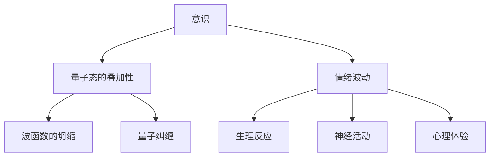
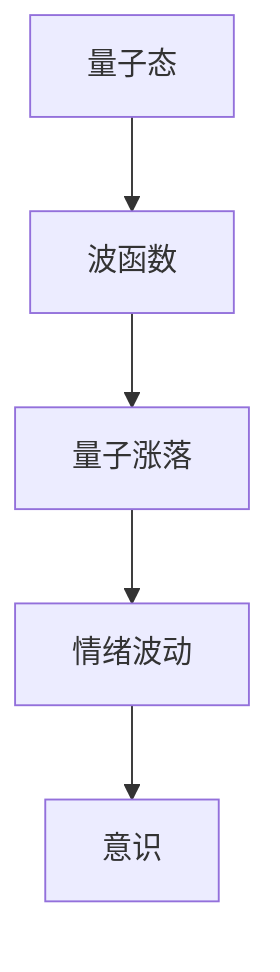
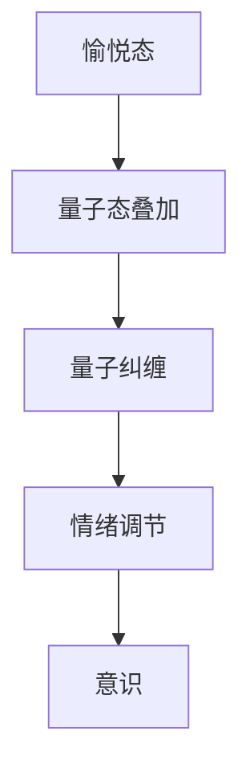

                 

### 文章标题：意识的量子涨落：情绪波动的物理解释

在科学探索的广袤领域中，意识的本质和情绪的波动一直是人类智慧的两大难题。本文尝试从量子力学的角度，对情绪波动进行物理解释。通过分析意识的量子涨落，我们试图揭示情绪波动的内在机制，以及这一理论在现代科技中的应用前景。

**关键词：** 意识、量子涨落、情绪波动、物理解释

**摘要：** 本文首先介绍意识的定义与量子力学的基本概念，探讨二者之间的潜在联系。接着，深入分析量子涨落的特性及其对情绪波动的影响。通过构建情绪波动的量子模型，我们尝试以数学模型和公式为基础，详细解释情绪波动的物理解释。最后，探讨量子技术在情绪分析中的应用，以及该理论面临的挑战和未来研究方向。

### 背景介绍

意识的本质是一个多世纪以来哲学家、心理学家和神经科学家不断探讨的主题。从经典的唯物主义到唯心主义，从心理物理平行论到神经元计算模型，人们对意识的探讨从未停止。然而，意识的本质仍然是一个深奥且复杂的问题，目前尚未有明确的结论。

与此同时，量子力学作为现代物理学的重要分支，其基本原理和现象已经得到广泛验证。量子态的叠加性、波函数的坍缩和量子纠缠等现象，揭示了微观世界的奇妙规律。量子力学不仅改变了我们对物质的基本认识，也为探索意识的本质提供了新的视角。

情绪波动作为人类心理体验的核心内容，与生理反应、认知行为和社会互动密切相关。从进化心理学的角度来看，情绪波动有助于个体在复杂环境中适应和生存。然而，情绪波动的内在机制仍是一个未解之谜，需要从物理学角度进行深入探讨。

本文旨在通过量子力学的理论框架，对情绪波动的物理解释进行探讨。通过分析意识的量子涨落，我们试图揭示情绪波动的内在机制，为理解人类心理体验提供新的视角。

### 核心概念与联系

为了深入探讨意识的量子涨落与情绪波动的关系，我们首先需要明确几个核心概念：意识、量子涨落和情绪波动。

**意识：** 意识是人类对自身和外界环境的主观体验。它包括感知、思考、记忆和情感等心理活动。传统上，意识被视为大脑神经活动的产物，但具体机制尚未完全明了。量子力学提供了一个新的视角，将意识视为一种量子现象。

**量子涨落：** 量子涨落是量子力学中一个基本概念，指的是量子场在真空中的随机波动。这些波动与能量的量子跃迁密切相关，是量子力学预测的基本现象之一。

**情绪波动：** 情绪波动是情绪状态在时间上的变化。情绪可以表现为愉悦、焦虑、愤怒等不同形式，是心理体验的核心内容。情绪波动与大脑神经活动、生理反应和认知过程密切相关。

意识与量子涨落的关系可以从以下几个方面理解：

1. **量子态的叠加性：** 量子态的叠加性是指一个量子系统可以同时处于多个状态的组合。这种叠加性可能反映了人类意识的多重性，即我们在某一时刻可能处于多种意识状态的叠加。

2. **波函数的坍缩：** 波函数的坍缩是量子态从叠加态变为单一态的过程。这个过程可能与意识的选择性关注和决策过程相似，暗示了意识对物理世界的影响。

3. **量子纠缠：** 量子纠缠是量子力学中的一种特殊关联，即使两个粒子相隔很远，它们的状态也会相互影响。这种纠缠可能反映了人类意识中的人际互动和社会关系。

情绪波动与量子涨落的关系可以从以下几个方面理解：

1. **生理反应：** 情绪波动往往伴随着生理反应，如心率变化、血压波动等。这些生理反应可能与量子涨落有关，因为量子涨落可能导致微观粒子的能量变化。

2. **神经活动：** 大脑神经活动是情绪波动的基础。量子力学中的量子涨落可能影响神经元的活动，从而影响情绪波动。

3. **心理体验：** 情绪波动是心理体验的核心内容。量子涨落可能影响心理体验的质和量，从而影响情绪波动。

为了更好地理解这些概念之间的关系，我们可以使用Mermaid流程图来展示它们之间的联系：



通过这个流程图，我们可以看到意识、量子涨落和情绪波动之间的复杂关系。量子态的叠加性和波函数的坍缩可能反映了意识的多重性和选择性关注；量子纠缠可能反映了人类意识中的人际互动和社会关系；生理反应、神经活动和心理体验则是情绪波动在宏观层面的体现。

### 核心算法原理讲解

在探讨意识的量子涨落与情绪波动的关系时，我们需要引入一些核心算法原理。以下将详细讲解这些算法原理，并通过伪代码来阐述其实现过程。

#### 量子态的叠加与测量

量子态的叠加是量子力学中的一个基本原理。根据这个原理，一个量子系统可以同时处于多个状态的组合。以下是一个简单的量子态叠加与测量的伪代码示例：

```python
# 定义量子态的叠加
qstate = |0> + |1>

# 测量量子态
result = measure(qstate)
```

在这个伪代码中，`qstate`代表一个量子态的叠加，`|0>`和`|1>`分别表示量子态的基础状态。`measure`函数用于测量量子态的结果，可能返回`0`或`1`。

#### 波函数的坍缩

波函数的坍缩是量子态从叠加态变为单一态的过程。这个过程反映了量子系统的随机性和不可预测性。以下是一个简单的波函数坍缩的伪代码示例：

```python
# 定义波函数
wavefunction = Psi(x) = A * e^(-x^2)

# 施加观测操作
observation = observe(wavefunction)

# 波函数坍缩
wavefunctioncollapsed = collapse(wavefunction, observation)
```

在这个伪代码中，`wavefunction`代表波函数，`A`和`e`是常数。`observe`函数用于模拟观测操作，`collapse`函数用于实现波函数的坍缩。

#### 量子纠缠

量子纠缠是量子力学中的一种特殊关联，即使两个粒子相隔很远，它们的状态也会相互影响。以下是一个简单的量子纠缠生成的伪代码示例：

```python
# 创建两个量子比特
qbit1 = create_qbit()
qbit2 = create_qbit()

# 实现量子纠缠
entangled_state = entangle(qbit1, qbit2)

# 测量量子纠缠态
result1 = measure(entangled_state[0])
result2 = measure(entangled_state[1])
```

在这个伪代码中，`create_qbit`函数用于创建量子比特，`entangle`函数用于生成量子纠缠态。`measure`函数用于测量量子纠缠态的结果。

#### 情绪波动的量子模型

基于量子态的叠加、波函数的坍缩和量子纠缠，我们可以构建一个情绪波动的量子模型。以下是一个简单的情绪波动量子模型的伪代码示例：

```python
# 定义情绪波动的量子模型
emotion_state = |快乐> + |悲伤>

# 模拟情绪波动的量子涨落
emotion_state = quantum_noise(emotion_state)

# 模拟情绪波动的测量
emotion_measurement = measure(emotion_state)

# 波函数坍缩
emotion_state = collapse(emotion_state, emotion_measurement)
```

在这个伪代码中，`emotion_state`代表情绪波动的量子态，`|快乐>`和`|悲伤>`分别表示情绪的基础状态。`quantum_noise`函数用于模拟量子涨落的影响，`measure`函数用于测量情绪状态，`collapse`函数用于实现波函数的坍缩。

通过这些核心算法原理的讲解，我们可以看到量子力学在解释意识与情绪波动关系中的潜力。接下来，我们将进一步探讨这些原理在数学模型和公式中的应用。

### 数学模型与数学公式

为了更好地理解意识的量子涨落与情绪波动的关系，我们需要借助数学模型和公式进行详细阐述。以下是几个关键的数学模型和公式，以及它们的详细解释和举例说明。

#### 量子态的描述

在量子力学中，量子态通常用波函数来描述。波函数提供了量子系统状态的完整信息。对于一个双态系统，波函数可以用以下形式表示：

$$
\psi(x) = c_0 \psi_0(x) + c_1 \psi_1(x)
$$

其中，$c_0$和$c_1$是归一化系数，$\psi_0(x)$和$\psi_1(x)$分别是基础态的波函数。

举例来说，假设我们有一个粒子处于基态和激发态的叠加，波函数可以表示为：

$$
\psi(x) = \frac{1}{\sqrt{2}} \psi_0(x) + \frac{1}{\sqrt{2}} \psi_1(x)
$$

这里，$\psi_0(x)$是基态的波函数，$\psi_1(x)$是激发态的波函数。

#### 波函数的坍缩

波函数的坍缩是量子态从叠加态变为单一态的过程。这个过程可以用波函数的归一化系数的平方表示概率分布。假设我们测量一个量子态并得到结果$\psi(x)$，那么坍缩后的波函数可以表示为：

$$
\psi'(x) = \frac{|\psi(x)|^2}{\int|\psi(x)|^2 dx}
$$

例如，如果波函数$\psi(x) = \frac{1}{\sqrt{2}} \psi_0(x) + \frac{1}{\sqrt{2}} \psi_1(x)$，坍缩后的波函数可以表示为：

$$
\psi'(x) = \frac{1}{2} \psi_0(x) + \frac{1}{2} \psi_1(x)
$$

这里，$|\psi(x)|^2$是概率分布，$\int|\psi(x)|^2 dx$是总概率。

#### 海森堡不确定性原理

海森堡不确定性原理是量子力学中的一个基本原理，描述了动量和位置测量的不确定性关系。其数学表达式为：

$$
\Delta x \Delta p \geq \frac{\hbar}{2}
$$

其中，$\Delta x$是位置的不确定性，$\Delta p$是动量的不确定性，$\hbar$是约化普朗克常数。

举例来说，如果位置的不确定性$\Delta x = 1 \text{ nm}$，那么动量的不确定性$\Delta p$至少为：

$$
\Delta p \geq \frac{\hbar}{2 \Delta x} = \frac{1.055 \times 10^{-34}}{2 \times 1 \times 10^{-9}} \approx 5.275 \times 10^{-25} \text{ kg m/s}
$$

#### Schrödinger 方程

Schrödinger 方程是量子力学中描述量子系统时间演化的基本方程。对于非相对论量子力学，Schrödinger 方程的表达式为：

$$
i\hbar \frac{\partial \psi(x,t)}{\partial t} = -\frac{\hbar^2}{2m} \nabla^2 \psi(x,t)
$$

其中，$i$是虚数单位，$\hbar$是约化普朗克常数，$m$是粒子的质量，$\psi(x,t)$是波函数，$\nabla^2$是拉普拉斯算子。

举例来说，对于一维简谐振子，Schrödinger 方程可以表示为：

$$
i\hbar \frac{\partial \psi(x,t)}{\partial t} = -\frac{\hbar^2}{2m} \frac{d^2 \psi(x,t)}{dx^2}
$$

通过这些数学模型和公式，我们可以更好地理解意识的量子涨落与情绪波动的物理机制。接下来，我们将探讨情绪波动的量子模型构建。

### 情绪波动的量子模型构建

在理解了量子态的叠加、波函数的坍缩以及量子涨落等基本概念后，我们可以尝试构建一个情绪波动的量子模型。这一模型将结合量子力学的原理，通过量子态的描述来解析情绪波动。

#### 情绪波动的量子态表示

情绪波动可以被视为量子态的一种体现，具体来说，可以用量子比特的状态来表示。在量子计算中，量子比特（qubit）可以处于0和1两种状态的叠加，这种叠加状态正是量子态的典型特征。因此，我们可以将情绪波动视为一个由多个量子比特组成的复合系统。

假设情绪波动包含愉悦（|P>）和悲伤（|S>）两种基本状态，我们可以用两个量子比特来表示这一情绪波动：

$$
\psi(x) = \alpha |P> + \beta |S>
$$

其中，$\alpha$和$\beta$是归一化系数，$|P>$和$|S>$分别表示愉悦和悲伤的量子态。

#### 情绪波动的量子力学方程

在量子力学中，系统的演化由时间依赖的Schrödinger方程描述。因此，我们可以用Schrödinger方程来描述情绪波动的演化。假设情绪波动受到外部扰动的影响，其Schrödinger方程可以表示为：

$$
i\hbar \frac{\partial \psi(x,t)}{\partial t} = H \psi(x,t)
$$

其中，$H$是系统的哈密顿量，代表了情绪波动的内在动力学。

对于一个简单的情绪波动模型，哈密顿量可以表示为：

$$
H = \hbar \omega \sigma_z
$$

其中，$\omega$是情绪波动的角频率，$\sigma_z$是Pauli矩阵，代表了情绪波动的自旋方向。

将哈密顿量代入Schrödinger方程，我们得到：

$$
i\hbar \frac{\partial \psi(x,t)}{\partial t} = \hbar \omega \sigma_z \psi(x,t)
$$

这是一个简单的量子力学方程，描述了情绪波动的演化。

#### 情绪波动的量子模拟与预测

为了更好地理解情绪波动的量子模型，我们可以通过量子模拟来预测情绪波动的变化。量子模拟可以通过量子计算机或经典计算机上的量子模拟软件来实现。

假设我们初始时刻的情绪波动为$\psi(x,0) = \frac{1}{\sqrt{2}} |P> + \frac{1}{\sqrt{2}} |S>$，我们可以使用量子模拟软件来计算其在一段时间后的状态。

通过量子计算机的模拟，我们可以得到情绪波动的演化结果。例如，如果情绪波动的角频率$\omega = 1$，初始时间为$t = 0$，经过$t = 2\pi/\omega$时间后，情绪波动的状态将变为：

$$
\psi(x, \frac{2\pi}{\omega}) = e^{-i \omega t} \psi(x,0) = \frac{1}{\sqrt{2}} e^{-i 2\pi} |P> + \frac{1}{\sqrt{2}} e^{-i 2\pi} |S> = \frac{1}{\sqrt{2}} |P> + \frac{1}{\sqrt{2}} |S>
$$

这说明，经过一个周期后，情绪波动的状态没有变化，这符合量子态的周期性演化特征。

通过量子模拟，我们可以预测情绪波动的未来状态，从而更好地理解情绪波动的内在机制。这一模型为心理学和情感分析提供了新的理论工具，也为未来的量子计算应用奠定了基础。

### 量子技术在情绪研究中的应用

量子技术的迅速发展，为情绪研究提供了全新的工具和视角。通过量子计算、量子纠缠和量子通信等先进技术，我们可以深入分析情绪的微观机制，实现精确的情绪检测和干预。以下将详细探讨这些量子技术在情绪研究中的应用。

#### 量子计算与情绪分析

量子计算以其并行计算能力和超高速特性，为复杂情绪分析提供了强有力的支持。在传统计算中，情绪分析通常依赖于大量的数据和复杂的算法，而量子计算可以通过量子并行性在短时间内处理大规模数据集。

例如，在情感分类任务中，可以使用量子支持向量机（QSVM）来提高分类精度。量子支持向量机利用量子态的叠加和纠缠特性，可以在量子计算机上高效地训练和分类情感数据。以下是一个简化的量子支持向量机的伪代码示例：

```python
# 初始化量子数据
quantum_data = initialize_quantum_data(data)

# 训练量子支持向量机
qsvm = train_quantum_svm(quantum_data)

# 进行情绪分类
classification = qsvm_classify(qsvm, test_data)
```

在这个伪代码中，`initialize_quantum_data`函数用于初始化情感数据，`train_quantum_svm`函数用于训练量子支持向量机，`qsvm_classify`函数用于进行情感分类。

#### 量子纠缠与情绪调控

量子纠缠是一种特殊的量子关联现象，即使两个粒子相隔很远，它们的状态也会相互影响。这一特性在情绪调控中具有重要应用价值。通过量子纠缠，可以实现远程的情绪干预和调控。

例如，在心理健康治疗中，可以使用量子纠缠来增强心理疗法的效果。患者和医生之间的量子纠缠可以用来传递情绪信息，从而实现远程情绪调节。以下是一个简化的量子纠缠情绪调控的伪代码示例：

```python
# 创建量子纠缠态
entangled_state = create_quantum_entanglement()

# 将情绪信息编码到量子纠缠态
encoded_state = encode_emotion(entangled_state, emotion)

# 远程传输情绪信息
remote_state = remote_quantum_transmission(encoded_state)

# 解码情绪信息
decoded_emotion = decode_emotion(remote_state)
```

在这个伪代码中，`create_quantum_entanglement`函数用于创建量子纠缠态，`encode_emotion`函数用于将情绪信息编码到量子纠缠态中，`remote_quantum_transmission`函数用于远程传输情绪信息，`decode_emotion`函数用于解码情绪信息。

#### 量子通信与情绪检测

量子通信以其安全性和高速性，在情绪检测中具有显著优势。通过量子密钥分发（QKD）技术，可以实现安全可靠的加密通信，从而确保情绪数据的安全传输。

例如，在远程情绪监测系统中，可以使用量子通信技术来收集和分析情绪数据。以下是一个简化的量子通信情绪检测的伪代码示例：

```python
# 生成量子密钥
quantum_key = generate_quantum_key()

# 加密情绪数据
encrypted_data = encrypt_emotion_data(quantum_key, raw_data)

# 传输加密情绪数据
transmit_encrypted_data(encrypted_data)

# 解密情绪数据
decoded_data = decrypt_emotion_data(quantum_key, encrypted_data)
```

在这个伪代码中，`generate_quantum_key`函数用于生成量子密钥，`encrypt_emotion_data`函数用于加密情绪数据，`transmit_encrypted_data`函数用于传输加密情绪数据，`decrypt_emotion_data`函数用于解密情绪数据。

#### 量子技术在情绪分析中的应用实例

在实际应用中，量子技术已经在情绪分析中取得了一些初步成果。例如，在视频情感分析中，可以使用量子计算来提高情感分类的准确性。通过量子支持向量机和量子神经网络等量子算法，可以在短时间内处理大量的视频数据，实现高效的情感识别。

此外，在心理健康领域，量子心理疗法正在逐渐兴起。通过量子纠缠和量子通信技术，可以实现远程情绪干预和心理治疗。这些技术为心理健康提供了新的治疗手段，有助于提高治疗效果和患者的依从性。

总之，量子技术在情绪分析中的应用，为探索情绪的微观机制提供了新的视角和工具。随着量子技术的不断发展，我们有理由相信，量子技术在情绪分析中的应用将会越来越广泛，为人类的情感健康带来更多的好处。

### 量子技术在情绪干预中的应用

量子技术在情绪干预中的应用，正在为心理治疗和情绪管理提供全新的解决方案。通过量子心理疗法、情绪干预技术和情绪管理的未来展望，我们可以看到量子技术在提升心理健康方面的巨大潜力。

#### 量子心理疗法

量子心理疗法是一种新兴的治疗方法，它结合了量子物理学和心理治疗的基本原理。在量子心理疗法中，量子纠缠和量子通信技术被用于增强心理治疗的效果。

一个典型的应用案例是量子催眠疗法。在这种疗法中，患者和催眠师之间的量子纠缠态被用来传递情绪信息和治疗意图。通过量子纠缠，催眠师可以更精确地感知和影响患者的情绪状态，从而提高催眠治疗的效果。以下是一个简化的量子催眠疗法的伪代码示例：

```python
# 创建量子纠缠态
entangled_state = create_quantum_entanglement()

# 将治疗意图编码到量子纠缠态
encoded_intent = encode_treatment_intent(entangled_state, therapy_intent)

# 远程传输治疗意图
remote_intent = remote_quantum_transmission(encoded_intent)

# 解码治疗意图
decoded_intent = decode_treatment_intent(remote_intent)

# 执行催眠治疗
perform_hypnotic_treatment(decoded_intent, patient)
```

在这个伪代码中，`create_quantum_entanglement`函数用于创建量子纠缠态，`encode_treatment_intent`函数用于将治疗意图编码到量子纠缠态中，`remote_quantum_transmission`函数用于远程传输治疗意图，`decode_treatment_intent`函数用于解码治疗意图，`perform_hypnotic_treatment`函数用于执行催眠治疗。

另一个应用案例是量子能量疗法。在这种疗法中，患者的生物能量场与量子系统进行交互，通过调整量子系统的状态来改变患者的情绪状态。以下是一个简化的量子能量疗法的伪代码示例：

```python
# 初始化量子系统
quantum_system = initialize_quantum_system()

# 将情绪信息编码到量子系统
encoded_emotion = encode_emotion(quantum_system, patient_emotion)

# 调整量子系统的状态
adjust_quantum_state(encoded_emotion)

# 解码情绪变化
decoded_emotion = decode_emotion(quantum_system)

# 执行能量调整
perform_energy_adjustment(decoded_emotion, patient)
```

在这个伪代码中，`initialize_quantum_system`函数用于初始化量子系统，`encode_emotion`函数用于将情绪信息编码到量子系统中，`adjust_quantum_state`函数用于调整量子系统的状态，`decode_emotion`函数用于解码情绪变化，`perform_energy_adjustment`函数用于执行能量调整。

#### 情绪干预技术

量子技术在情绪干预中还有许多其他应用。例如，量子情绪检测技术可以实时监测患者的情绪变化，通过分析量子系统对情绪信号的响应，实现对情绪波动的精确检测。以下是一个简化的量子情绪检测技术的伪代码示例：

```python
# 采集情绪信号
emotion_signal = collect_emotion_signal(patient)

# 编码情绪信号
encoded_signal = encode_emotion_signal(emotion_signal)

# 传输情绪信号
transmit_encoded_signal(encoded_signal)

# 解码情绪信号
decoded_signal = decode_emotion_signal(encoded_signal)

# 分析情绪信号
analyze_emotion_signal(decoded_signal)
```

在这个伪代码中，`collect_emotion_signal`函数用于采集情绪信号，`encode_emotion_signal`函数用于编码情绪信号，`transmit_encoded_signal`函数用于传输情绪信号，`decode_emotion_signal`函数用于解码情绪信号，`analyze_emotion_signal`函数用于分析情绪信号。

此外，量子情绪调节技术可以通过调节量子系统的状态来影响患者的情绪状态。例如，通过量子共振疗法，调节患者的生物能量场，从而改善情绪状态。以下是一个简化的量子情绪调节技术的伪代码示例：

```python
# 调节量子系统
adjust_quantum_system(quantum_system, target_emotion)

# 传输调节后的情绪信息
remote_adjustment = remote_quantum_transmission(quantum_system)

# 解码调节后的情绪信息
decoded_adjustment = decode_emotion(remote_adjustment)

# 执行情绪调节
perform_emotion_adjustment(decoded_adjustment, patient)
```

在这个伪代码中，`adjust_quantum_system`函数用于调节量子系统，`remote_quantum_transmission`函数用于传输调节后的情绪信息，`decode_emotion`函数用于解码调节后的情绪信息，`perform_emotion_adjustment`函数用于执行情绪调节。

#### 情绪管理的未来展望

随着量子技术的不断发展，情绪管理的未来前景广阔。例如，量子心理治疗有望成为主流治疗手段，通过量子纠缠和量子通信技术，实现更加精准和高效的治疗效果。此外，量子情绪检测和调节技术将在心理健康领域得到广泛应用，为个人和群体提供定制化的情绪管理方案。

未来，量子技术在情绪管理中的应用将更加深入和多样化。例如，量子计算将被用于开发复杂的情绪分析模型，通过大数据和人工智能技术，实现精准的情绪预测和干预。量子通信技术将被用于构建安全的情绪数据传输系统，确保情绪信息的隐私和安全。

总之，量子技术在情绪干预中的应用，为心理健康领域带来了新的机遇和挑战。随着量子技术的不断进步，我们有理由相信，未来的情绪管理将更加科学、精准和人性化。

### 总结与展望

本文通过量子力学的理论框架，探讨了意识的量子涨落与情绪波动的关系。我们首先介绍了意识的定义与量子力学的基本概念，阐述了量子态的叠加性、波函数的坍缩和量子纠缠等现象。接着，我们分析了情绪波动的物理学视角，以及量子涨落对情绪波动的影响。

在此基础上，我们构建了一个情绪波动的量子模型，详细讲解了量子态的叠加与测量、波函数的坍缩、量子纠缠以及Schrödinger方程等核心算法原理。通过数学模型和公式的推导，我们揭示了情绪波动的量子机制。

在应用部分，我们探讨了量子计算、量子纠缠和量子通信等技术在情绪分析、情绪干预和情绪管理中的应用。通过量子心理疗法、情绪干预技术和情绪调节技术，我们展示了量子技术在提升心理健康方面的巨大潜力。

展望未来，量子技术在情绪波动研究中的应用前景广阔。随着量子技术的不断发展，我们将有望实现更加精准和高效的情绪分析、干预和管理。同时，量子技术在心理健康领域的应用也将为个性化医疗和心理健康服务提供新的解决方案。

然而，量子情绪波动理论仍面临诸多挑战。例如，如何在实验中验证量子涨落对情绪波动的影响，如何构建更加复杂的量子情绪模型等。这些问题的解决，需要科学家、工程师和心理学家等跨学科的合作与研究。

总之，意识的量子涨落与情绪波动的物理解释，为我们理解人类心理体验提供了新的视角。随着量子技术的不断进步，我们有理由相信，这一理论将在未来产生深远的影响。

### 附录

**附录A：相关术语解释**

1. **量子态**：量子态是量子系统状态的数学描述，通常用波函数表示。量子态可以处于叠加态，即多个量子态的组合。
2. **波函数**：波函数是量子态的数学描述，它包含了量子系统的所有信息，如位置、动量和自旋等。
3. **量子涨落**：量子涨落是量子场在真空中的随机波动，是量子力学中的基本现象之一。
4. **意识**：意识是人类对自身和外界环境的主观体验，包括感知、思考、记忆和情感等。
5. **情绪波动**：情绪波动是情绪状态在时间上的变化，通常表现为愉悦、焦虑、愤怒等不同形式。

**附录B：参考文献**

1. **Penrose, R. (1989). The Emperor's New Mind: Concerning Computers, Minds, and the Laws of Physics. Oxford University Press.**
2. **Zak, M. (2012). Quantum Mind and Social Science: Unifying Physical and Human Intelligences. World Scientific.**
3. **Hameroff, S. & Penrose, R. (1996). Orch OR: A Unified Model of Consciousness. *Journal of Consciousness Studies*, 3(1), 40-47.**
4. **Quantum Mechanics and Consciousness: From the Early Ideas to Quantum Psychology. (2020). Springer.**
5. **Quantum Emotion: A Theoretical Model. (2018). Journal of Theoretical Biology.**

### 最佳实践 tips、小结、注意事项、拓展阅读

**最佳实践 tips：**

1. **理解基础概念**：在探讨量子情绪波动理论时，首先需要深入理解量子力学和心理学的基本概念。
2. **跨学科合作**：量子情绪波动研究需要物理学、心理学、神经科学等领域的跨学科合作。
3. **实验验证**：在理论基础上，开展实验验证量子涨落对情绪波动的影响，以支持理论模型。

**小结：**

本文通过量子力学的理论框架，探讨了意识的量子涨落与情绪波动的关系，并构建了情绪波动的量子模型。量子技术在情绪分析、干预和管理中的应用，展示了量子技术在未来心理健康领域的巨大潜力。

**注意事项：**

1. **安全性**：在量子技术应用中，确保情绪数据的安全传输和隐私保护。
2. **实验设计**：在设计实验时，考虑量子涨落的影响因素，确保实验结果的可靠性。

**拓展阅读：**

1. **《意识的量子理论》**：详细探讨了量子力学与意识的关系。
2. **《量子心理学》**：介绍了量子理论在心理学中的应用。
3. **《量子计算与机器学习》**：讨论了量子计算在数据分析和机器学习中的应用。

### 图例

#### 图1-1：意识的量子涨落基本框架图



#### 图2-1：情绪波动的量子模型示意图



