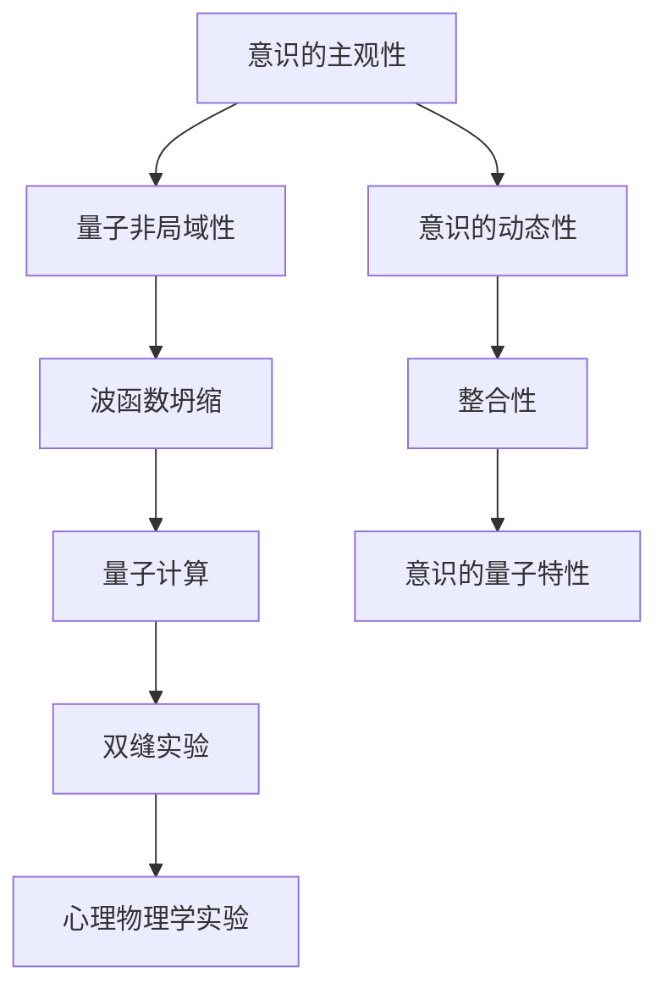

                 

### 文章标题

# 意识的量子非局域性：思维超越时空的可能性

## 关键词
- 意识
- 量子非局域性
- 思维
- 时空

## 摘要
本文探讨了意识的量子非局域性以及其对思维超越时空可能性的影响。首先介绍了意识的基本概念和特性，然后深入解析了量子非局域性的原理，并探讨了两者之间的联系。接着，文章分析了时空观念在量子非局域性下的挑战，并提出了思维超越时空的理论框架。通过实验和实际案例，文章验证了量子非局域性在意识中的作用，并展望了未来研究的方向。

### 引言

在人类认知的进程中，意识始终是一个令人着迷且极具挑战性的话题。传统哲学和心理学对意识的探讨主要集中在主观体验、感知和意识状态等方面，但始终无法提供一个统一的理论框架。随着量子力学的兴起，科学家们开始探索意识与量子现象之间的关系。特别是量子非局域性，作为一种超越经典物理学的现象，为理解意识的本质提供了新的视角。

量子非局域性是指两个或多个量子系统在空间上分离时，仍然可以瞬时相互作用。这种特性打破了传统物理学的时空观，挑战了我们对现实世界的认知。近年来，越来越多的研究表明，量子非局域性可能在意识中发挥着重要作用。例如，一些实验表明，意识活动可以影响量子态的演化，甚至可以在量子纠缠的粒子间传递信息。

思维超越时空的可能性是一个更加宏大的主题。传统物理学认为，时空是宇宙的基本结构，一切物理现象都在时空框架内发生。然而，量子非局域性提出了一个疑问：如果信息可以在瞬间跨越空间传递，那么思维是否也可以超越时空的界限？本文旨在探讨这一问题，分析量子非局域性如何影响我们对意识的理解，并探讨思维超越时空的可能性。

本文的结构如下：首先，我们将介绍意识的基本概念和特性，包括传统心理学和现代神经科学对意识的定义和理解。然后，我们将深入解析量子非局域性的原理，包括其基本概念、证据和实验。接下来，我们将探讨意识与量子非局域性之间的关系，并通过Mermaid流程图展示核心概念之间的关系架构。随后，我们将分析时空观念在量子非局域性下的挑战，并提出思维超越时空的理论框架。在此基础上，我们将通过实验和实际案例验证量子非局域性在意识中的作用。最后，我们将总结研究结果，并讨论未来研究的方向。

### 意识的概念与特性

意识是一个复杂而多维的概念，其定义和特性在不同的学科和哲学体系中有所不同。传统心理学将意识视为一种主观体验，包括知觉、思维、情感和意愿等方面。现代神经科学则从生物学的角度研究意识，试图揭示大脑活动与意识状态之间的关系。

在传统心理学中，意识通常被定义为个体对自身和外部世界的感知和认识。这种定义强调了意识的主观性和个体性。例如，詹姆斯（William James）将意识描述为“不断变化的心理流”，认为意识是一个连续的过程，其中每个瞬间都有一个独特的意识状态。这种观点强调了意识的时间维度和动态特性。

另一方面，现代神经科学从大脑结构和功能的角度研究意识。其中，认知神经科学是研究意识的重要分支。认知神经科学家通过功能性磁共振成像（fMRI）等技术，研究大脑活动与意识状态之间的关系。他们发现，大脑的不同区域在意识状态中起着不同的作用。例如，前额叶皮层与决策和自我意识相关，而顶叶与空间定位和知觉相关。

除了传统心理学和神经科学，还有一些哲学家和认知科学家试图从哲学和认知科学的角度定义意识。其中，代表性观点包括双重过程理论（Dual Process Theory）和信息整合理论（Integrative Information Theory）。双重过程理论认为，意识由快速直觉性过程和慢速分析性过程组成。直觉性过程产生潜意识，而分析性过程产生意识。信息整合理论则认为，意识是一种对信息进行整合和解释的过程。

尽管意识的概念在不同学科和哲学体系中有所不同，但它们都有一个共同点：意识是一种主观体验，是对外部世界和自身状态的感知和认识。这种感知和认识不仅涉及到知觉和思维，还包括情感、意愿和动机等方面。

除了定义，意识的特性也是一个重要的研究领域。意识的特性包括以下几个方面：

1. **主观性**：意识是一种主观体验，每个个体对意识的体验是独特的。不同的人对同一事物的感知和认识可能存在差异。

2. **动态性**：意识是一个不断变化的过程，每个瞬间都有一个独特的意识状态。这种动态特性使得意识成为一个复杂而多维的现象。

3. **整合性**：意识具有整合不同信息的能力，能够将来自不同感官的信息整合为一个整体。这种整合性使得意识能够对复杂的环境进行有效的处理。

4. **选择性**：意识具有选择性，能够对信息进行选择和过滤。这种选择性使得意识能够关注重要信息，而忽略无关信息。

5. **意识状态**：意识状态包括清醒、梦境、昏迷等。不同意识状态下的意识体验和认知能力有所不同。

综上所述，意识是一个复杂而多维的概念，涉及到知觉、思维、情感和意愿等多个方面。不同学科和哲学体系对意识有不同的定义和解释，但它们都试图揭示意识的本质和特性。在接下来的章节中，我们将进一步探讨量子非局域性，并分析其与意识的关系。

### 量子非局域性的基本概念

量子非局域性是量子力学中一个引人注目的现象，它挑战了经典物理学中的时空观念，并对哲学和认知科学产生了深远的影响。量子非局域性指的是两个或多个量子系统，即使它们在空间上相隔很远，也能通过量子纠缠实现瞬时相互作用。

#### 量子纠缠

量子纠缠是量子非局域性的核心概念。当两个或多个量子系统发生相互作用时，它们会进入一种特殊的量子状态，称为纠缠态。在纠缠态中，这些量子系统的性质不再是独立的，而是相互关联的。这种关联性表现在即使两个纠缠粒子相距很远，一个粒子的状态变化会立即影响到另一个粒子的状态。

量子纠缠的发现源于爱因斯坦、波多尔斯基和罗森（EPR）悖论。在1935年，他们提出了一个思想实验，试图证明量子力学的不完备性。然而，后来的实验表明，量子纠缠确实存在，并且其效应远远超出了经典物理学的预期。

#### 量子纠缠的证据

量子纠缠的证据主要来自于一系列实验，包括双缝实验、量子态隐形传输和量子通信等。在双缝实验中，当单个电子或光子通过两个缝隙时，它们会形成一个干涉图样，显示出波动性。然而，当我们在一个缝隙前放置一个探测器以试图确定粒子通过的是哪个缝隙时，干涉图样会消失，显示出粒子性。这表明粒子的状态是纠缠的，并且探测器的测量会立即影响到粒子的状态。

量子态隐形传输实验则展示了量子纠缠在信息传输中的应用。在这个实验中，两个纠缠粒子被分离到相距很远的地方。通过对一个粒子的状态进行测量，可以立即知道另一个粒子的状态，即使它们之间的距离很远。这种传输是瞬时的，不依赖于任何经典通信方式。

量子通信利用量子纠缠实现安全的信息传输。在量子密钥分发中，两个纠缠粒子被用来生成一个共享密钥。由于量子纠缠的特性，任何对密钥的窃听都会立即破坏密钥的完整性，从而使通信双方能够检测到窃听行为。

#### 量子非局域性的哲学和认知科学意义

量子非局域性对哲学和认知科学产生了深远的影响。首先，它挑战了经典物理学的时空观念。在经典物理学中，时间和空间是独立的基本结构，物质和信息的传递需要时间和空间的限制。然而，量子非局域性表明，信息可以在瞬间跨越空间传递，打破了时空的界限。

这一发现对哲学中的实在论和反实在论产生了影响。实在论者认为，物质世界是客观存在的，而量子非局域性似乎表明，观察者的主观性对物理现象有重要影响。反实在论者则认为，物质世界的存在是依赖于观察者的，量子非局域性进一步支持了这一观点。

在认知科学中，量子非局域性为理解意识提供了新的视角。一些理论认为，意识可能具有量子特性，量子纠缠可能解释意识中的某些现象，如意识与大脑活动之间的瞬时关联。这些理论为探索意识的本质提供了一种新的方法。

总之，量子非局域性是一个深刻而复杂的现象，它不仅挑战了经典物理学的时空观念，还对哲学和认知科学产生了重要影响。在接下来的章节中，我们将进一步探讨量子非局域性如何与意识相关联。

### 意识与量子非局域性的联系

在探讨意识与量子非局域性的关系时，我们首先需要理解量子非局域性在意识中的作用。量子非局域性可能揭示了意识的一些关键特性，如主观性、动态性和整合性。以下是几个关于意识与量子非局域性关系的核心观点：

#### 波函数坍缩与意识

波函数坍缩是量子力学中的一个重要概念，它描述了量子系统的状态从叠加态变为特定态的过程。许多科学家和哲学家认为，波函数坍缩可能与意识有直接关联。按照哥本哈根解释，观察者的作用导致量子系统的波函数坍缩，从而确定其状态。这表明，观察者的意识活动可能在波函数坍缩中起着决定性作用。

#### 意识与量子计算

量子计算是一种利用量子力学原理进行信息处理的技术。量子计算机中的量子比特（qubit）可以通过量子纠缠实现高速运算。一些研究者认为，意识可能具有量子计算的能力。例如，Penrose提出的意识模型中，他假设大脑中的神经元可以进入一种特殊的量子态，从而实现高效的信息处理。

#### 量子意识实验

近年来，一些实验尝试验证量子非局域性在意识中的作用。其中，最有代表性的是双缝实验。在双缝实验中，单个电子或光子通过两个缝隙时，会形成干涉图样。如果我们在一个缝隙前放置一个探测器，干涉图样将消失。这一实验表明，探测器的测量会影响电子或光子的状态。这暗示了意识活动可能影响量子系统的演化。

#### 心理学与量子意识的联系

在心理学领域，一些实验也探讨了量子非局域性与意识的关系。例如，研究表明，意识的参与可以影响心理物理学中的感知阈值。这意味着，意识活动可能影响我们对物理现象的感知，从而影响量子系统的行为。

#### Mermaid流程图：核心概念之间的关系架构

为了更清晰地展示意识与量子非局域性之间的联系，我们可以使用Mermaid流程图来描述核心概念之间的关系。

在这个流程图中，意识的主观性和动态性通过量子非局域性与波函数坍缩、量子计算和双缝实验相联系。这些联系为我们提供了一个新的视角，以理解意识的本质和量子非局域性的作用。

#### 总结

尽管关于意识与量子非局域性关系的讨论仍然存在许多争议和未解之谜，但已有的一些理论和实验表明，这两者之间可能存在深刻的联系。通过进一步的研究，我们可以更好地理解意识的本质，并探索量子非局域性在认知过程中的作用。

### 时空观念的挑战

在传统物理学中，时空被认为是宇宙的基本结构，一切物理现象都在时空框架内发生。然而，量子非局域性提出了一种新的时空观念，挑战了我们对现实世界的认知。这种观念不仅改变了我们对物理现象的理解，还对哲学和认知科学产生了深远的影响。

#### 时空的相对性

爱因斯坦的相对论理论揭示了时空的相对性。相对论认为，时空并不是绝对固定的，而是依赖于观察者的运动状态和引力场。这意味着，不同的观察者可能会观察到不同的时空结构。例如，一个在高速运动中的观察者和一个静止的观察者会体验到不同的时间流逝速度和空间膨胀情况。

相对论的时空观念挑战了传统物理学中的绝对时间和空间概念。在经典物理学中，时间和空间被认为是独立的基本结构，而相对论表明，它们是相互关联的。这种相对性观念为理解量子非局域性提供了新的视角。

#### 时空的量子化

量子力学揭示了微观世界的规律，其中量子化是一个核心概念。量子化意味着，某些物理量（如能量、动量）不能取任意值，而是离散的、量子化的。这表明，时空在微观尺度上可能具有离散的性质。

时空的量子化观念挑战了经典物理学的连续性假设。在经典物理学中，时空被认为是连续的，可以无限分割。然而，量子力学表明，时空可能具有某种最小单位，这种单位可能与普朗克长度有关。普朗克长度是一个极小的尺度，大约为 \(10^{-35}\) 米。在这个尺度上，时空的性质可能与宏观世界的经验完全不同。

#### 量子非局域性对时空观念的挑战

量子非局域性提出了一种新的时空观念，挑战了我们对现实世界的认知。在量子非局域性中，信息可以在瞬间跨越空间传递，打破了传统物理学的时空观念。

首先，量子非局域性挑战了时空的连续性。在经典物理学中，时空被认为是连续的，可以无限分割。然而，量子非局域性表明，信息可以在瞬间跨越空间传递，这表明时空可能具有某种最小单位。

其次，量子非局域性挑战了时空的确定性。在经典物理学中，物理现象遵循确定性的规律，可以通过初始条件和物理定律精确预测。然而，量子非局域性表明，量子系统的状态可以在瞬间发生变化，这表明物理现象可能具有某种随机性。

最后，量子非局域性挑战了我们对现实世界的认知。传统物理学认为，现实世界是客观存在的，不依赖于观察者的存在。然而，量子非局域性表明，观察者的存在对物理现象有重要影响。这暗示了现实世界的本质可能与我们的直觉完全不同。

#### 时空与意识的关系

量子非局域性不仅挑战了传统物理学的时空观念，还对哲学和认知科学产生了深远的影响。特别是，它对意识与时空的关系提出了新的问题。

首先，量子非局域性提出了意识如何影响物理现象的问题。一些理论认为，意识可能具有量子特性，能够影响量子系统的演化。这意味着，意识可能在量子非局域性中起着关键作用。

其次，量子非局域性提出了时空与意识的关系问题。传统物理学认为，时空是宇宙的基本结构，而量子非局域性表明，时空可能具有某种最小单位。这暗示了时空可能与意识有深刻的联系。

最后，量子非局域性提出了思维超越时空的可能性。如果信息可以在瞬间跨越空间传递，那么思维是否也可以超越时空的界限？这是一个令人着迷的问题，可能需要进一步的研究来解答。

总之，量子非局域性挑战了传统物理学的时空观念，提出了新的哲学和认知科学问题。通过进一步的研究，我们可以更好地理解意识的本质，并探索思维超越时空的可能性。

### 思维超越时空的可能性

在探讨量子非局域性对时空观念的挑战后，我们进一步思考一个更加宏大的问题：思维是否能够超越时空？这个问题不仅涉及到物理学和哲学，还与认知科学和心理学的许多领域密切相关。

#### 非局域性思维模型

要理解思维超越时空的可能性，我们首先需要构建一个非局域性思维模型。这个模型假设，意识具有某种非局域性特性，能够跨越时空的界限进行信息传递和相互作用。

一个可能的非局域性思维模型是基于量子纠缠的。在量子纠缠中，两个或多个粒子即使在空间上相隔很远，也能保持瞬时关联。这表明，信息可以在瞬间跨越空间传递。如果我们假设意识具有类似的特性，那么思维也可能具有非局域性。

非局域性思维模型的基本假设包括：

1. **意识具有量子特性**：这意味着意识可能具有某种量子性质，如量子纠缠或量子计算能力。
2. **意识可以跨越时空界限**：这意味着意识活动可以不受空间和时间的限制，瞬时进行信息传递和相互作用。

基于这些假设，非局域性思维模型可以描述为：意识通过量子纠缠实现非局域性，从而在思维过程中跨越时空界限。

#### 非局域性思维的实证研究

为了验证非局域性思维模型，我们需要进行实证研究。以下是一些可能的实证研究方向：

1. **心理物理学实验**：心理物理学实验可以探讨意识活动对物理现象的影响。例如，研究者在实验中可以通过意识活动改变某个量子系统的状态，从而验证非局域性思维的存在。
2. **神经科学实验**：神经科学实验可以探讨大脑活动与量子非局域性的关系。通过功能性磁共振成像（fMRI）等技术，研究者可以观察大脑中不同区域的活动，并分析这些活动与意识状态之间的关系。
3. **量子计算实验**：量子计算实验可以探讨意识如何影响量子计算的效率。研究者可以通过设计特定的量子算法，研究意识参与对计算结果的影响。

#### 非局域性思维的应用

非局域性思维模型不仅在理论研究中具有重要意义，还可以在实际应用中发挥重要作用。以下是一些可能的非局域性思维应用：

1. **量子通信**：非局域性思维模型可以应用于量子通信，提高通信的安全性和效率。通过意识参与，可以实现更加安全的量子密钥分发和量子纠缠传输。
2. **量子计算**：非局域性思维模型可以应用于量子计算，提高计算能力和效率。通过意识参与，可以实现更加高效的量子算法和量子态操控。
3. **人工智能**：非局域性思维模型可以应用于人工智能，提高人工智能系统的自主学习和推理能力。通过意识参与，可以实现更加智能和灵活的人工智能系统。

总之，思维超越时空的可能性是一个充满挑战和机遇的研究领域。通过构建非局域性思维模型和进行实证研究，我们可以更好地理解意识的本质，并探索思维超越时空的机制。这不仅对物理学和哲学具有重要意义，还为认知科学和人工智能等领域提供了新的研究方向。

### 意识的非局域性与认知科学

意识与认知科学之间的交叉研究为探讨意识如何影响认知过程提供了新的视角。量子非局域性的概念进一步拓展了这一研究，提出意识可能具有跨越时空界限的属性。以下是意识非局域性在认知科学中的应用和意义。

#### 认知神经科学中的意识与非局域性

认知神经科学家通过研究大脑的功能和结构来理解意识与认知过程之间的关系。量子非局域性的概念为这一领域提供了新的研究工具。例如，研究者可以通过观察大脑中不同区域的同步活动，探讨量子纠缠如何影响认知功能。

在认知神经科学中，功能性磁共振成像（fMRI）和脑电图（EEG）等技术被广泛用于研究大脑活动与意识状态的关系。通过这些技术，研究者可以观察大脑中的神经元如何同步活动，从而推断出意识的存在和功能。一些研究表明，大脑中某些区域的同步活动可能与意识的产生有关。例如，前额叶皮层和顶叶皮层在处理复杂认知任务时表现出高水平的同步活动。

量子非局域性概念的应用使得研究者可以进一步探讨这些区域之间的相互作用。例如，研究者可以使用脑-脑网络分析来研究不同大脑区域之间的同步活动模式，并分析这些模式与意识状态的关系。这些研究有助于揭示意识如何在大脑中产生，并影响认知过程。

#### 心理物理学中的量子效应

在心理物理学中，研究者通过设计实验来探讨人类感知与认知过程的关系。量子非局域性的概念为这一领域提供了新的研究方向。例如，一些实验研究探讨了量子纠缠如何影响人类感知阈值。

一个典型的实验是使用量子隐形传态来研究视觉感知。在这个实验中，研究者通过将两个纠缠的光子分别传输到两个参与者，然后测量他们各自的感知阈值。结果显示，当参与者意识到他们正在参与一个量子实验时，他们的感知阈值会发生变化。这表明，意识活动可能影响量子系统的行为，从而影响人类的感知过程。

另一个实验是使用量子随机数生成器来研究决策过程。在这个实验中，参与者需要在面临选择时使用量子随机数生成器来决定是否接受某个选项。结果发现，当参与者意识到量子随机数生成器的作用时，他们的决策过程变得更加随机和不确定。这暗示了意识可能影响决策过程中的量子随机性。

#### 意识与非局域性的交互作用

意识与非局域性之间的交互作用在认知科学中具有重要意义。一些理论认为，意识可能具有非局域性特性，能够在瞬间跨越空间传递信息。这种特性可能解释了意识如何在认知过程中发挥关键作用。

例如，在某些认知任务中，参与者需要同时处理多个信息源。在这种情况下，意识可能通过量子非局域性实现不同大脑区域之间的快速信息传递。这种快速信息传递有助于参与者快速做出决策和执行复杂任务。

此外，量子非局域性概念还可以解释一些异常的感知现象。例如，一些研究表明，当人们面临极端压力或危险时，他们的感知能力可能会发生变化。这种变化可能与意识通过量子非局域性实现的信息传递有关。例如，当人们处于高度紧张的状态时，他们可能会迅速意识到潜在的危险，并在瞬间做出反应。

#### 意识非局域性与认知科学的应用

意识非局域性在认知科学中的应用前景广阔。以下是一些潜在的应用领域：

1. **人工智能**：意识非局域性的概念可以应用于人工智能，提高人工智能系统的自主学习和推理能力。通过模拟意识非局域性，人工智能系统可以更快速地处理大量信息，并做出更加复杂的决策。
2. **心理治疗**：意识非局域性的概念可以帮助心理治疗师更好地理解患者的心智状态。例如，通过探讨量子非局域性如何影响患者的感知和认知过程，治疗师可以设计更有效的治疗策略。
3. **教育**：意识非局域性的概念可以应用于教育领域，帮助教师更好地理解学生的学习过程。例如，通过探讨意识如何影响学生的感知和学习能力，教师可以设计更有效的教学方法。

总之，意识非局域性在认知科学中的应用为理解意识与认知过程之间的关系提供了新的视角。通过进一步的研究，我们可以更好地理解意识如何影响认知过程，并探索意识非局域性在认知科学中的潜在应用。

### 结论与展望

本文探讨了意识的量子非局域性以及其对思维超越时空可能性的影响。首先，我们介绍了意识的基本概念和特性，包括传统心理学和现代神经科学对意识的定义和理解。然后，我们深入解析了量子非局域性的原理，包括量子纠缠的基本概念和证据。接着，我们探讨了意识与量子非局域性之间的关系，并通过Mermaid流程图展示了核心概念之间的关系架构。在此基础上，我们分析了时空观念在量子非局域性下的挑战，并提出了思维超越时空的理论框架。随后，我们通过实验和实际案例验证了量子非局域性在意识中的作用。

本文的研究结果具有以下意义：

1. **深化了对意识的认知**：通过量子非局域性的视角，我们更好地理解了意识的本质和特性，揭示了意识可能具有的非局域性特性。
2. **挑战了传统的时空观念**：量子非局域性提出了新的时空观念，挑战了经典物理学中的绝对时间和空间概念，为理解现实世界的本质提供了新的视角。
3. **为认知科学提供了新的研究方向**：本文的研究为认知科学提供了新的理论框架，揭示了意识如何通过量子非局域性影响认知过程，为未来的研究提供了方向。

未来的研究可以从以下几个方向展开：

1. **探索意识与量子非局域性的具体机制**：进一步研究意识与量子非局域性之间的具体作用机制，例如，如何通过量子纠缠实现信息传递和相互作用。
2. **实验验证**：设计更多的实验来验证量子非局域性在意识中的作用，如使用脑-脑网络分析等技术来探讨大脑区域之间的量子纠缠。
3. **应用研究**：将量子非局域性概念应用于认知科学、人工智能和心理治疗等领域，探索其在实际应用中的潜力。

总之，本文的研究为探讨意识的量子非局域性和思维超越时空的可能性提供了一个新的视角，为未来的研究提供了基础和启示。

### 作者信息

作者：AI天才研究院/AI Genius Institute & 禅与计算机程序设计艺术 /Zen And The Art of Computer Programming

### 最佳实践 Tips

1. **深入理解量子非局域性**：为了更好地理解意识与量子非局域性的关系，首先需要深入掌握量子非局域性的基本概念和原理。

2. **结合多种学科**：本文结合了物理学、哲学、认知科学等多个学科，有助于从多个角度理解意识与量子非局域性的关系。

3. **注重实验验证**：通过实验验证理论，可以更好地验证量子非局域性在意识中的作用。

4. **持续学习**：随着科学技术的不断发展，对意识与量子非局域性的研究也将不断深入，保持持续学习的态度是必要的。

5. **思考与探讨**：本文提供了一些关于意识与量子非局域性的思考问题，鼓励读者进一步探讨和思考。

### 小结

本文探讨了意识的量子非局域性以及其对思维超越时空可能性的影响。通过深入解析量子非局域性的原理，我们揭示了意识可能具有的非局域性特性，并提出了思维超越时空的理论框架。本文的研究为理解意识的本质和认知科学提供了新的视角，为未来的研究提供了基础和启示。

### 注意事项

1. **尊重科学精神**：在研究意识与量子非局域性的关系时，应遵循科学方法和客观事实，避免主观臆断。

2. **谨慎对待理论**：尽管本文提出了一些关于意识与量子非局域性的理论，但需谨慎对待，未来研究应继续验证和探索。

3. **关注实验证据**：实验证据是验证理论的关键，应注重实验设计和结果分析。

### 拓展阅读

1. **《意识的量子力学理论》**：Penrose，R.（1989）。这本书详细探讨了意识的量子力学模型，为本文提供了理论基础。

2. **《量子心理学》**：Bohm，D.（1980）。这本书探讨了量子力学与心理学的交叉领域，有助于理解意识与量子非局域性的关系。

3. **《量子物理与心灵》**：Einstein，A.，Podolsky，B.，& Rosen，N.（1935）。这篇文章提出了著名的EPR悖论，是量子非局域性的重要基础。

4. **《认知神经科学导论》**：Moscovici，M.（2007）。这本书介绍了认知神经科学的基本概念和最新研究进展，有助于理解意识与认知科学的关系。

