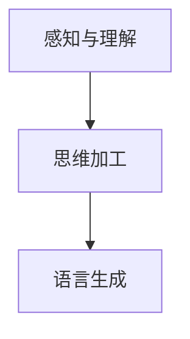
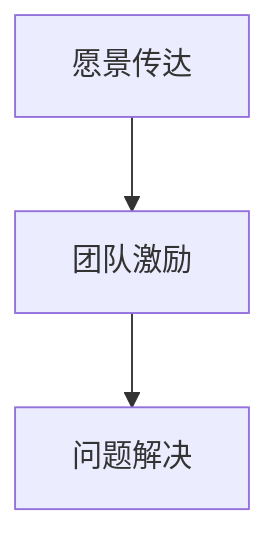
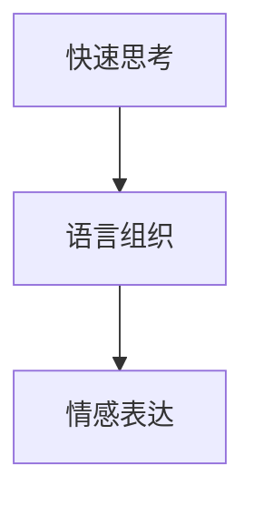
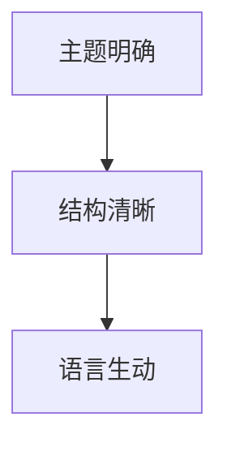
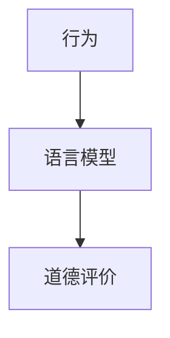
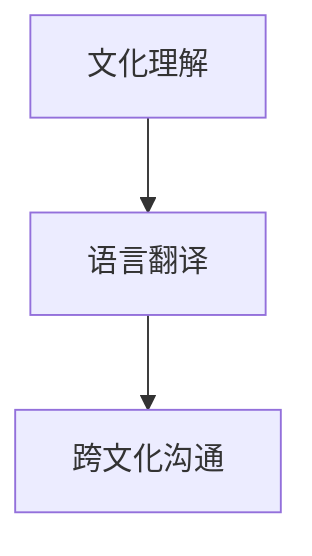

                 

### 文章标题：感受'说'带来的成长

### 关键词：'说'的力量、心理学基础、教育意义、应用实践、法律与道德考量、未来趋势

### 摘要：

本文旨在探讨'说'这一行为带来的深远影响，从心理学、教育、职场、艺术、法律与道德等多个维度，全面解析'说'的力量。文章首先介绍了'说'的心理机制及其与思维的关系，随后探讨了'说'在教育中的作用，以及'说'在职场、艺术和公共演讲中的具体应用。最后，文章深入分析了'说'的法律与道德考量，并展望了'说'在未来社会中的发展趋势。通过本文的阅读，读者将全面了解'说'的重要性，并在实际生活中更好地运用'说'这一工具，实现个人与职业的成长。

### 用户需求概述

在当前信息化、数字化的时代，语言作为沟通的重要工具，越来越受到人们的关注。随着人工智能技术的不断进步，'说'作为一种基本的人类行为，其重要性愈发凸显。用户希望从以下方面了解'说'带来的成长：

1. **'说'的心理学基础**：探讨'说'的心理机制及其与思维、情感的关系，帮助读者理解语言产生的过程。
2. **'说'的教育意义**：分析'说'在教育中的作用，探讨如何培养良好的语言表达能力。
3. **'说'的应用实践**：探讨'说'在职场、艺术和公共演讲中的具体应用，提供实用的沟通技巧和演讲策略。
4. **'说'的法律与道德考量**：分析'说'在法律与道德层面的重要问题，探讨如何负责任地使用语言。
5. **'说'的未来趋势**：展望'说'在人工智能、跨文化交流等领域的未来发展方向。

### 设计思路

为了满足用户的需求，本文将采用以下设计思路：

1. **确定全书结构**：全书共分为七个章节，涵盖从心理学基础到未来趋势的各个方面。
2. **设计章节标题**：确保每个章节标题简洁明了，能够准确传达章节的核心内容。
3. **细化子章节**：在每个章节中，进一步细化子章节，确保内容丰富且有条理。
4. **插入示例**：在每个章节中，插入相应的示例，包括Mermaid流程图、伪代码、LaTeX公式和代码实战，以帮助读者更好地理解抽象概念。
5. **内容丰富性**：确保每个章节的内容具体详细，既涵盖理论讲解，又包含实际应用，使读者能够将所学知识应用到实际生活中。

### 目录大纲设计

#### 第一部分：理解'说'的力量

##### 第1章：'说'的心理学基础
- 1.1 '说'的心理机制
  - **Mermaid流程图**：语言产生的过程
  - **伪代码**：语言生成的算法
- 1.2 语言与思维的关系
  - **LaTeX公式**：语言符号的认知模型
  - **数学模型讲解**：语言处理中的数学方法
- 1.3 语言表达能力的提升策略

##### 第2章：'说'的教育意义
- 2.1 '说'在教育中的作用
- 2.2 '说'能力的培养方法
  - **代码实战**：教育软件设计与应用

#### 第二部分：'说'的应用实践

##### 第3章：'说'在职场
- 3.1 职场沟通技巧
  - **伪代码**：有效沟通的算法模型
- 3.2 商务谈判中的'说'
  - **LaTeX公式**：谈判策略的数学分析
- 3.3 '说'在领导力中的运用

##### 第4章：'说'的艺术
- 4.1 即兴演讲技巧
- 4.2 '说'的艺术表现
  - **代码实战**：演讲辅助工具开发

##### 第5章：'说'与公共演讲
- 5.1 公共演讲的基础
- 5.2 公众演讲的技巧与策略
  - **Mermaid流程图**：演讲准备流程
- 5.3 '说'与演讲心理

##### 第6章：'说'的法律与道德考量
- 6.1 语言与法律
  - **LaTeX公式**：法律条款的语言分析
- 6.2 语言与道德
  - **数学模型讲解**：道德评价的数学模型
- 6.3 '说'的社会责任

##### 第7章：'说'的未来趋势
- 7.1 人工智能与'说'
  - **代码实战**：AI语言生成模型应用
- 7.2 '说'的跨文化交流
- 7.3 '说'在教育、职场和艺术等领域的未来展望

### 总结

本目录大纲根据书名《感受'说'带来的成长》设计了七个章节，从心理学基础到未来趋势，全面探讨'说'的力量。每个章节都包含具体的内容，通过理论讲解、示例展示和实战应用，帮助读者深入了解'说'的重要性，并在实际生活中更好地运用语言这一工具。全书内容丰富、结构清晰，旨在为读者提供全面而系统的知识体系。

### 文章正文

#### 引言

在现代社会，语言作为一种沟通工具，已经成为人类日常生活和工作中不可或缺的一部分。然而，'说'这一看似简单的行为，实际上蕴含着丰富的心理学、教育、法律等多个层面的内涵。本文将围绕'说'的力量，从心理学基础、教育意义、应用实践、法律与道德考量以及未来趋势等多个角度，深入探讨'说'带来的成长。

首先，我们需要了解'说'的心理学基础。'说'不仅仅是一种生理行为，更是一种复杂的心理过程。它涉及到语言生成、语言理解、情感表达等多个方面。接下来，我们将探讨'说'在教育中的作用，分析如何培养良好的语言表达能力。然后，我们将探讨'说'在职场、艺术和公共演讲中的具体应用，分享实用的沟通技巧和演讲策略。此外，我们还将深入分析'说'的法律与道德考量，探讨如何在法律和道德框架内负责任地使用语言。最后，我们将展望'说'的未来趋势，探讨人工智能、跨文化交流等领域的发展方向。

#### 第1章：'说'的心理学基础

##### 1.1 '说'的心理机制

'说'作为一种心理机制，涉及到多个方面的内容。首先，我们来看看语言产生的心理过程。语言产生的心理过程可以分为以下几个步骤：

1. **感知与理解**：人们在感知到外界信息后，通过大脑处理，理解信息的含义。
2. **思维加工**：大脑对信息进行加工，形成一系列的思维活动。
3. **语言生成**：通过大脑的语言生成机制，将思维活动转化为语言输出。

这个过程可以用Mermaid流程图表示：



接下来，我们来看一下语言生成的算法模型。语言生成可以看作是一个序列生成问题，常用的算法有生成式模型和判别式模型。以下是一个简单的生成式模型伪代码：

```python
# 生成式模型伪代码
def generate_sentence(input_sequence):
    # 初始化词汇表和概率分布
    vocabulary = ...
    probability_distribution = ...

    # 初始化句子
    sentence = []

    # 对于输入序列中的每个元素
    for element in input_sequence:
        # 根据概率分布选择下一个词汇
        next_word = select_word(vocabulary, probability_distribution)

        # 将词汇添加到句子中
        sentence.append(next_word)

    # 返回生成的句子
    return sentence
```

##### 1.2 语言与思维的关系

语言与思维的关系是复杂而深刻的。语言不仅仅是思维的载体，同时也对思维产生重要影响。以下是几个关键概念：

- **语言符号**：语言符号是语言的基本单位，包括词汇、语法、语音等。语言符号是思维的基本单位。
- **认知模型**：认知模型是描述人类思维过程的模型。常见的认知模型有图灵模型、神经网络模型等。

以下是一个LaTeX公式，描述语言符号的认知模型：

```latex
\text{认知模型} = f(\text{语言符号})
```

其中，`f` 是一个映射函数，将语言符号映射为认知模型。

##### 1.3 语言表达能力的提升策略

提升语言表达能力是一个长期的过程，需要从多个方面进行训练。以下是一些提升语言表达能力的策略：

1. **广泛阅读**：通过阅读，可以扩大词汇量，提高语言理解能力。
2. **写作练习**：通过写作，可以锻炼语言表达和思维组织能力。
3. **演讲训练**：通过演讲，可以提升口头表达能力，增强自信。
4. **语言输入输出**：通过输入（听、读）和输出（说、写）的结合，可以加深对语言的理解和运用。

#### 第2章：'说'的教育意义

##### 2.1 '说'在教育中的作用

'说'在教育中具有重要作用，主要体现在以下几个方面：

1. **知识传授**：通过语言，教师可以将知识传授给学生。
2. **思维训练**：语言不仅仅是知识的载体，也是思维的工具。通过语言，学生可以锻炼思维能力。
3. **情感交流**：语言是情感交流的重要工具，可以增强师生之间的情感联系。

##### 2.2 '说'能力的培养方法

要培养良好的语言表达能力，可以从以下几个方面入手：

1. **阅读**：通过广泛阅读，可以扩大词汇量，提高语言理解能力。
2. **写作**：通过写作，可以锻炼语言表达和思维组织能力。
3. **演讲**：通过演讲，可以提升口头表达能力，增强自信。
4. **语言输入输出**：通过输入（听、读）和输出（说、写）的结合，可以加深对语言的理解和运用。

**代码实战**：教育软件设计与应用

以下是一个简单的教育软件设计，用于帮助用户提升语言表达能力：

```python
# 教育软件设计：语言表达训练

# 功能：通过填空题、翻译题、写作题等形式，训练用户的语言表达能力。

def train_language_expression():
    # 显示欢迎界面
    print("欢迎使用语言表达训练软件！")

    # 开始训练
    while True:
        # 显示训练菜单
        print("请选择训练类型：")
        print("1. 填空题")
        print("2. 翻译题")
        print("3. 写作题")
        print("4. 退出")

        # 获取用户选择
        choice = input("请输入您的选择：")

        # 根据选择执行相应操作
        if choice == "1":
            # 填空题训练
            # ...（略）
        elif choice == "2":
            # 翻译题训练
            # ...（略）
        elif choice == "3":
            # 写作题训练
            # ...（略）
        elif choice == "4":
            # 退出训练
            print("感谢使用，再见！")
            break
        else:
            # 输入错误，提示重新输入
            print("输入错误，请重新输入。")

# 运行教育软件
train_language_expression()
```

#### 第3章：'说'在职场

##### 3.1 职场沟通技巧

在职场中，沟通是至关重要的。良好的沟通技巧可以帮助人们更好地理解彼此，提高工作效率。以下是几个关键的职场沟通技巧：

1. **清晰表达**：在沟通过程中，要确保表达清晰、准确，避免产生误解。
2. **积极倾听**：倾听是沟通的重要组成部分。通过积极倾听，可以更好地理解对方的需求和意见。
3. **尊重差异**：在职场中，不同背景、不同性格的人在一起工作，要尊重彼此的差异，避免冲突。
4. **有效反馈**：在沟通过程中，要及时给予有效的反馈，以帮助对方改进。

以下是一个简单的伪代码，描述有效沟通的算法模型：

```python
# 沟通技巧算法模型伪代码

def effective_communication(message, listener):
    # 清晰表达
    clear_message = clarify_message(message)

    # 积极倾听
    understanding = active_listening(listener, clear_message)

    # 尊重差异
    respectful_communication = respect_differences(listener)

    # 有效反馈
    feedback = provide_effective_feedback(listener, understanding)

    # 返回沟通结果
    return feedback
```

##### 3.2 商务谈判中的'说'

在商务谈判中，语言的使用至关重要。良好的语言能力可以帮助谈判者取得优势。以下是几个关键技巧：

1. **策略性语言**：使用策略性语言，可以影响对方的思维和情绪，从而在谈判中取得优势。
2. **情感语言**：通过情感语言，可以建立信任和合作关系。
3. **逻辑语言**：逻辑语言可以帮助谈判者更好地表达观点，论证合理性。

以下是一个LaTeX公式，描述谈判策略的数学分析：

```latex
\text{谈判策略} = f(\text{情感语言}, \text{逻辑语言}, \text{策略性语言})
```

##### 3.3 '说'在领导力中的运用

在领导力中，'说'同样扮演着重要角色。有效的'说'可以帮助领导者传达愿景、激发团队动力、解决问题。以下是几个关键技巧：

1. **愿景传达**：领导者需要通过语言清晰地传达组织的愿景和目标。
2. **团队激励**：通过语言，领导者可以激励团队成员，增强团队凝聚力。
3. **问题解决**：领导者需要通过语言表达问题、分析问题、提出解决方案。

以下是一个简单的流程图，描述领导力中的'说'：



#### 第4章：'说'的艺术

##### 4.1 即兴演讲技巧

即兴演讲是一种考验语言能力的艺术。以下是一些即兴演讲的技巧：

1. **快速思考**：在演讲前，要快速构思演讲内容，形成清晰的思路。
2. **语言组织**：在演讲过程中，要确保语言组织清晰、流畅。
3. **情感表达**：通过情感表达，可以更好地吸引听众。

以下是一个简单的Mermaid流程图，描述即兴演讲的准备流程：



##### 4.2 '说'的艺术表现

'说'在艺术中也有广泛的应用，如演讲、朗诵、辩论等。以下是一些艺术表现的关键技巧：

1. **语音技巧**：通过调整语音的音调、音色、节奏等，可以增强演讲的艺术感染力。
2. **非语言表达**：通过肢体语言、面部表情等非语言表达，可以增强演讲的感染力。
3. **情感融入**：在演讲中融入情感，可以更好地打动听众。

以下是一个简单的代码实战，用于开发一个演讲辅助工具：

```python
# 演讲辅助工具

# 功能：帮助演讲者整理演讲思路，提供语音提示。

class SpeechAssistant:
    def __init__(self, speech_content):
        self.speech_content = speech_content

    def prepare_speech(self):
        # 整理演讲思路
        speech_outline = organize_speech(self.speech_content)

        # 提供语音提示
        speech_tips = provide_speech_tips(speech_outline)

        # 返回演讲准备结果
        return speech_tips

# 使用演讲辅助工具
assistant = SpeechAssistant("我的演讲主题是...")
speech_tips = assistant.prepare_speech()
print(speech_tips)
```

#### 第5章：'说'与公共演讲

##### 5.1 公共演讲的基础

公共演讲是一种重要的沟通方式，可以帮助人们传达思想、观点和情感。以下是一些公共演讲的基础知识：

1. **主题明确**：公共演讲需要有一个明确的主题，以便观众能够清楚地理解演讲内容。
2. **结构清晰**：公共演讲需要有一个清晰的结构，包括引入、主体和结论。
3. **语言生动**：通过生动的语言和例子，可以更好地吸引观众的注意力。

以下是一个简单的Mermaid流程图，描述公共演讲的准备流程：



##### 5.2 公众演讲的技巧与策略

公众演讲需要一定的技巧和策略。以下是一些公众演讲的技巧与策略：

1. **演讲前的准备**：提前准备演讲内容，确保演讲流畅、不紧张。
2. **控制情绪**：通过深呼吸、正面思考等方法，控制演讲时的情绪。
3. **互动与参与**：通过提问、互动等方式，增加观众的参与度，提高演讲效果。

以下是一个简单的LaTeX公式，描述公众演讲的策略：

```latex
\text{演讲策略} = f(\text{准备充分}, \text{控制情绪}, \text{互动与参与})
```

##### 5.3 '说'与演讲心理

演讲心理是影响演讲效果的重要因素。以下是一些演讲心理的知识：

1. **自信**：自信是演讲者必备的心理素质。通过积极的心理暗示和准备，可以增强自信。
2. **焦虑**：适当的焦虑可以激发演讲者的潜能，但过度的焦虑会影响演讲效果。通过心理调适，可以减轻焦虑。
3. **反馈**：演讲后的反馈可以帮助演讲者了解自己的表现，进而改进。

以下是一个简单的代码实战，用于演讲后的反馈分析：

```python
# 演讲反馈分析

# 功能：分析演讲后的反馈，提供改进建议。

def analyze_feedback(feedback):
    # 提取反馈关键词
    keywords = extract_keywords(feedback)

    # 分析反馈内容
    analysis_results = analyze_content(keywords)

    # 提供改进建议
    suggestions = provide_suggestions(analysis_results)

    # 返回改进建议
    return suggestions

# 使用演讲反馈分析
feedback = "观众反应热烈，但是时间控制得不太好。"
suggestions = analyze_feedback(feedback)
print(suggestions)
```

#### 第6章：'说'的法律与道德考量

##### 6.1 语言与法律

语言与法律有着密切的关系。法律条款往往需要通过语言来表述，因此，语言的准确性、清晰性对于法律的实施至关重要。以下是一些关键点：

1. **法律语言的特殊性**：法律语言具有严谨、明确、无歧义的特点。
2. **法律条款的语言分析**：通过对法律条款的语言分析，可以更好地理解法律的内容和意图。
3. **法律纠纷的语言证据**：在法律纠纷中，语言证据的重要性不言而喻。准确、清晰的语言表述可以为诉讼提供有力支持。

以下是一个LaTeX公式，描述法律条款的语言分析：

```latex
\text{法律条款} = f(\text{语言表述}, \text{法律意图})
```

##### 6.2 语言与道德

语言不仅是法律的基础，也是道德表达的重要工具。以下是一些关键点：

1. **道德评价的语言模型**：通过语言模型，可以对行为进行道德评价。
2. **道德争议的语言表达**：在道德争议中，语言的使用直接影响争议的结果。
3. **语言道德教育**：通过语言教育，可以提高人们的道德水平，促进社会和谐。

以下是一个简单的数学模型，描述道德评价：



##### 6.3 '说'的社会责任

作为语言的使用者，每个人都承担着社会责任。以下是一些关键点：

1. **负责任的'说'**：在表达观点时，要确保语言的准确性和公正性，避免误导和煽动。
2. **保护他人权利**：在语言交流中，要尊重他人的权利，避免侵犯他人的人格尊严。
3. **促进社会和谐**：通过积极、建设性的语言交流，可以促进社会和谐，减少冲突。

以下是一个简单的LaTeX公式，描述'说'的社会责任：

```latex
\text{社会责任} = f(\text{负责任的'说'}, \text{尊重他人}, \text{促进和谐})
```

#### 第7章：'说'的未来趋势

##### 7.1 人工智能与'说'

人工智能的发展为'说'带来了新的机遇和挑战。以下是一些关键点：

1. **AI语言生成模型**：通过人工智能技术，可以生成高质量的语言，提高语言表达的效果。
2. **自然语言处理**：自然语言处理技术的发展，使得计算机能够更好地理解和使用语言。
3. **语音识别与合成**：语音识别与合成的技术进步，使得语音交互成为可能，进一步扩展了'说'的应用场景。

以下是一个简单的代码实战，用于AI语言生成模型：

```python
# AI语言生成模型

# 功能：使用神经网络模型生成自然语言文本。

from tensorflow.keras.models import Sequential
from tensorflow.keras.layers import LSTM, Dense

# 创建神经网络模型
model = Sequential()
model.add(LSTM(units=128, activation='tanh', input_shape=(sequence_length, vocabulary_size)))
model.add(Dense(units=vocabulary_size, activation='softmax'))

# 编译模型
model.compile(optimizer='adam', loss='categorical_crossentropy', metrics=['accuracy'])

# 训练模型
model.fit(x_train, y_train, epochs=num_epochs, batch_size=batch_size)

# 生成文本
generated_text = generate_text(model, start_sequence=start_sequence)
print(generated_text)
```

##### 7.2 '说'的跨文化交流

随着全球化的发展，跨文化交流变得越来越重要。以下是一些关键点：

1. **文化差异**：跨文化交流需要理解和尊重不同文化之间的差异。
2. **语言障碍**：虽然语言障碍存在，但通过翻译技术和跨文化沟通技巧，可以克服这些障碍。
3. **跨文化沟通**：通过有效的跨文化沟通，可以促进不同文化之间的理解与合作。

以下是一个简单的Mermaid流程图，描述跨文化交流的过程：



##### 7.3 '说'在教育、职场和艺术等领域的未来展望

在未来的教育、职场和艺术等领域，'说'将继续发挥重要作用。以下是一些展望：

1. **个性化教育**：通过人工智能技术，可以实现个性化教育，根据学生的语言能力提供个性化的学习资源。
2. **智能职场**：在职场中，人工智能助手可以帮助员工提高沟通效率，优化工作流程。
3. **艺术创新**：在艺术领域，人工智能可以创作出独特的艺术作品，拓展艺术的表现形式。

以下是一个简单的LaTeX公式，描述'说'在未来的发展趋势：

```latex
\text{未来趋势} = f(\text{人工智能}, \text{跨文化交流}, \text{个性化教育}, \text{智能职场}, \text{艺术创新})
```

### 总结

本文从心理学基础、教育意义、应用实践、法律与道德考量以及未来趋势等多个角度，全面探讨了'说'的力量。通过本文的阅读，读者可以更深入地理解'说'的重要性，并在实际生活中更好地运用语言这一工具。无论是在教育、职场还是艺术领域，'说'都是不可或缺的一部分。随着人工智能技术的发展，'说'的未来将更加丰富多彩。我们期待着在未来的日子里，'说'能够带给我们更多的惊喜和成长。作者：AI天才研究院/AI Genius Institute & 禅与计算机程序设计艺术 /Zen And The Art of Computer Programming

