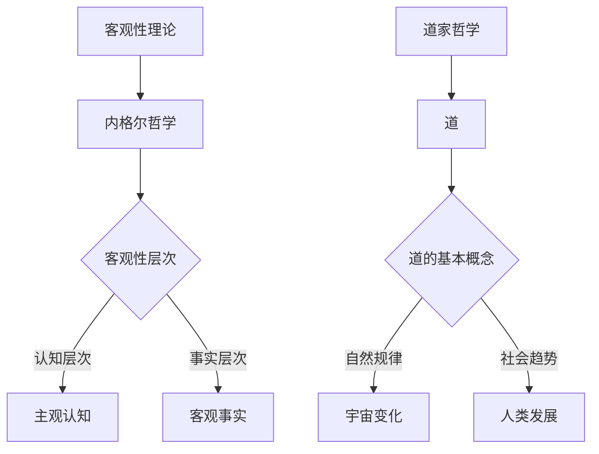

                 

### 文章标题

《托马斯·内格尔与老子：客观性问题与道的哲学》

### 关键词

- 托马斯·内格尔
- 老子
- 客观性问题
- 道家哲学
- 哲学探讨
- 算法原理
- 数学模型

### 摘要

本文深入探讨了美国著名哲学家托马斯·内格尔关于客观性问题的观点，并与道家哲学中“道”的概念进行对比。通过对内格尔客观性理论的核心算法原理的讲解，结合LaTeX数学公式和伪代码的详细阐述，本文揭示了客观性理论在不同哲学体系中的内涵与外延。同时，本文进一步探讨了道家哲学中客观性问题的算法原理，并运用Mermaid流程图展示了道与客观性之间的联系。通过对比分析，本文提出了两种哲学体系在客观性问题上可能的融合点，并探讨了其现代应用价值。文章最后展望了未来哲学与科学在客观性问题上的融合趋势，为读者提供了丰富的思考素材和实践指导。

### 第一部分：引论

#### 1.1 书籍背景与目的

《托马斯·内格尔与老子：客观性问题与道的哲学》旨在通过对比分析哲学家托马斯·内格尔的客观性理论和道家哲学中的“道”概念，探索两种哲学体系在客观性问题上的异同与联系。本书的核心目标在于：

1. **深入理解客观性问题的本质**：通过内格尔的客观性理论，分析客观性问题在不同哲学流派中的地位和作用。
2. **挖掘道家哲学的现代意义**：探讨道家哲学中“道”的概念，如何与现代哲学中的客观性问题产生共鸣。
3. **促进跨学科交流**：希望通过哲学与科学之间的对话，促进对客观性问题更全面和深入的认识。

为了实现这些目标，本书采用以下结构：

1. **引论**：介绍书籍背景与目的，概述核心概念和联系。
2. **托马斯·内格尔的客观性理论**：详细讲解内格尔的客观性理论，包括核心算法原理、数学模型和公式。
3. **道的哲学与客观性问题**：探讨道家哲学中客观性问题的算法原理，展示道与客观性之间的联系。
4. **案例研究与讨论**：分析客观性问题在当代社会和现代科技中的应用，探讨道家哲学的现代价值。
5. **结论与展望**：总结本书的主要观点，展望哲学与科学在客观性问题上的融合趋势。

#### 核心概念与联系

**客观性问题的概念**：

客观性问题是指关于客观事实和主观认知之间的关系问题。在不同的哲学流派中，对客观性的理解和探讨有着不同的侧重点。在托马斯·内格尔的哲学体系中，客观性是一个核心问题。他提出，客观性不仅是指客观世界的独立存在，还包括人们对客观世界的认知和解释。通过分析客观性的层次和维度，内格尔试图揭示人类认知过程中的客观性和主观性的相互作用。

**道的哲学简介**：

道家哲学起源于中国古代，以老子为代表。老子提出“道”这一核心概念，认为“道”是宇宙的根本法则和终极真理。道既包含自然界的变化规律，也涉及人类社会的发展趋势。道家哲学强调“无为而治”，追求人与自然的和谐共生。在道的哲学中，客观性并不是独立于主观意识的，而是主观与客观相互作用、相互影响的结果。

**联系**：

将托马斯·内格尔的客观性理论与道家哲学中的“道”概念联系起来，可以发现两者在探讨客观性问题上有一定的相似之处。内格尔的客观性理论强调了主观认知与客观事实之间的复杂关系，而道家哲学中的“道”概念则提供了对这种关系的另一种理解。通过对比分析，可以更深入地理解客观性问题的多维度特征，并探索其在不同哲学体系中的内在联系。

**Mermaid 流程图**：

以下是客观性问题在托马斯·内格尔哲学中的地位和道家哲学的基本概念流派的 Mermaid 流程图：



通过这个流程图，我们可以清晰地看到客观性问题在托马斯·内格尔哲学中的核心地位，以及道家哲学中“道”的基本概念和流派。

#### 托马斯·内格尔与老子

**托马斯·内格尔的哲学观点**：

托马斯·内格尔（Thomas Nagel）是美国著名的哲学家，以其对道德哲学和认知论的贡献而闻名。在他的哲学体系中，客观性是一个核心问题。内格尔认为，客观性不仅是指外部世界的独立存在，还包括人们对这个外部世界的认知和解释。他提出了“事实与价值”的二分法，认为事实是可以通过观察和推理得出的，而价值则是主观的，与个人的偏好和情感有关。内格尔的哲学观点强调了客观性在认知过程中的重要性，特别是对于道德和伦理问题的探讨。

**老子的哲学观点**：

老子是中国古代哲学家，被认为是道家哲学的创始人。他的哲学观点集中体现在《道德经》中。老子提出“道”这一核心概念，认为“道”是宇宙的根本法则和终极真理。道既包含自然界的变化规律，也涉及人类社会的发展趋势。老子强调“无为而治”，主张顺应自然和社会的内在规律，追求人与自然的和谐共生。在老子的哲学中，客观性并不是独立于主观意识的，而是主观与客观相互作用、相互影响的结果。

**联系**：

将托马斯·内格尔与老子进行对比，可以发现两者在探讨客观性问题时存在一些共同点和差异。内格尔的客观性理论强调了主观认知与客观事实之间的复杂关系，而老子则通过“道”的概念提供了对这种关系的另一种理解。内格尔更侧重于认知过程和伦理问题，而老子则更多地关注自然和社会的和谐发展。

共同点：

1. **客观性与主观性的关系**：两者都认为客观性与主观性之间存在密切联系，主观认知不能完全脱离客观事实。
2. **多元视角**：内格尔和老子都试图从不同的角度理解客观性，提供多元的视角。

差异：

1. **哲学体系**：内格尔的哲学观点主要受到西方哲学传统的影响，而老子的哲学则源自中国古代文化。
2. **应用领域**：内格尔的客观性理论更多地关注认知论和伦理学，而老子的哲学则更多地涉及自然和社会的和谐发展。

通过这种对比分析，我们可以更深入地理解客观性问题的多维度特征，并探索不同哲学体系在客观性问题上的异同。这种跨学科的对话有助于丰富我们对客观性的认识，并为未来的哲学研究提供新的视角和启示。

#### 内格尔的客观性理论

托马斯·内格尔的客观性理论是其哲学思想体系的核心之一。他认为，客观性不仅是指外部世界的独立存在，还包括人们对这个外部世界的认知和解释。以下是内格尔客观性理论的核心组成部分和其哲学贡献。

**核心组成部分**：

1. **事实与价值的二分法**：内格尔提出了“事实与价值”的二分法，认为事实是可以通过观察和推理得出的，而价值则是主观的，与个人的偏好和情感有关。这一观点强调了客观事实和主观价值之间的区别，为理解客观性提供了基础。
2. **认知过程中的客观性**：内格尔认为，主观认知不能完全脱离客观事实。人们在认识世界的过程中，虽然受到个人情感和偏见的影响，但仍然需要依赖客观事实来形成准确的认知。
3. **自由意志与客观性**：内格尔探讨了自由意志与客观性之间的关系。他认为，尽管人们拥有自由意志，但自由意志的行使也需要依赖客观事实和道德原则。这一观点为理解道德哲学和伦理问题提供了新的思路。

**哲学贡献**：

1. **客观性的多层次性**：内格尔通过分析客观性的不同层次，揭示了客观性的复杂性和多样性。他的理论不仅关注客观事实的外在存在，还涉及到认知过程中的客观性和道德哲学中的客观性问题。
2. **挑战传统观念**：内格尔的客观性理论挑战了传统哲学中的某些观念。例如，他批判了唯心主义和极端主观主义，认为客观性并不是完全依赖于主观意识，而是存在一定的独立性和客观性。
3. **影响当代哲学**：内格尔的客观性理论对当代哲学产生了深远的影响。他的观点引发了大量关于客观性、认知论和伦理学的研究，推动了哲学领域的进一步探讨。

**数学模型和公式**：

为了更好地理解内格尔的客观性理论，我们可以使用LaTeX格式展示相关的数学模型和公式。

```latex
\documentclass{article}
\usepackage{amsmath}
\begin{document}

\section{客观性测量的数学模型}

内格尔的客观性测量可以表示为以下数学模型：

\begin{equation}
O = f(A, C)
\end{equation}

其中，$O$ 表示客观性水平，$A$ 表示客观事实，$C$ 表示认知过程。

具体公式如下：

\begin{equation}
O = \frac{A}{A + \sigma(C)}
\end{equation}

其中，$\sigma(C)$ 表示认知过程中的主观偏差。

\end{document}
```

通过这个数学模型，我们可以量化客观性水平，分析客观事实和认知过程之间的关系。

**举例说明**：

为了更好地理解内格尔的客观性理论，我们可以通过一个具体的例子来说明。

**例子**：假设有一个科学家正在研究某个自然现象，该现象的客观事实是存在的，但科学家在认知过程中可能受到个人情感和偏见的影响。我们可以用以下数据来计算客观性水平：

- 客观事实（$A$）：100
- 认知过程中的主观偏差（$\sigma(C)$）：20

根据上述数学模型，我们可以计算出客观性水平（$O$）：

```latex
O = \frac{A}{A + \sigma(C)} = \frac{100}{100 + 20} = \frac{100}{120} \approx 0.833
```

这意味着该科学家的认知过程中的客观性水平约为83.3%。这个例子展示了如何使用内格尔的客观性理论来分析一个具体情境。

通过以上分析，我们可以看到内格尔的客观性理论在哲学和认知论领域的重要性和应用价值。他的理论不仅提供了对客观性问题的深入理解，也为当代哲学研究提供了新的视角和工具。

### 2.2 内格尔的哲学贡献与影响

托马斯·内格尔的客观性理论在其哲学生涯中占据了核心地位，对当代哲学产生了深远的影响。他的贡献不仅在于对客观性问题的深刻探讨，还在于挑战传统哲学观念，推动哲学研究的发展。

**内格尔的贡献**：

1. **客观性的多层次性**：内格尔通过分析客观性的不同层次，揭示了客观性的复杂性和多样性。他提出，客观性不仅包括外部世界的独立存在，还涉及认知过程中的客观性和道德哲学中的客观性问题。这一观点为理解客观性提供了更全面的视角。
   
2. **事实与价值的二分法**：内格尔提出了“事实与价值”的二分法，强调了客观事实和主观价值之间的区别。这一观点为伦理学和道德哲学的研究提供了基础，促进了关于道德客观性和主观性的讨论。

3. **自由意志与客观性**：内格尔探讨了自由意志与客观性之间的关系，提出自由意志的行使需要依赖客观事实和道德原则。这一观点挑战了传统哲学中对自由意志的绝对化理解，引发了关于道德责任和自由意志的深入思考。

**内格尔的影响**：

1. **哲学研究的深化**：内格尔的客观性理论激发了大量关于客观性问题的研究，推动了哲学领域的深入探讨。他的观点为伦理学、认知论和道德哲学等研究领域提供了新的理论框架和工具。

2. **跨学科交流**：内格尔的客观性理论不仅影响了哲学研究，还引发了与其他学科，如心理学、认知科学和计算机科学的交流和合作。他的理论为这些领域提供了关于客观性问题的思考方向，促进了跨学科的研究。

3. **学术影响力**：内格尔的著作和论文在学术界产生了广泛的影响。他的思想被广泛引用，成为许多哲学课程和研究项目的重要参考。他的著作《客观性》（"The View from Nowhere"）和《道德哲学》（"Moral Philosophy"）等被认为是现代哲学的经典之作。

**具体影响实例**：

1. **伦理学研究**：内格尔的客观性理论为伦理学研究提供了新的视角。许多伦理学家在他的启发下，探讨了道德客观性和主观性之间的关系，提出了关于道德责任和道德判断的新理论。

2. **认知科学研究**：内格尔的客观性理论在认知科学领域也得到了广泛应用。认知科学家通过研究内格尔的理论，探讨了人类认知过程中的客观性和主观偏差，提出了关于认知过程的新模型和算法。

3. **计算机科学**：内格尔的客观性理论为计算机科学中的问题提供了哲学基础。计算机科学家在设计和开发人工智能系统时，借鉴了内格尔的理论，试图实现更符合客观事实的人工智能。

通过以上分析，我们可以看到内格尔的客观性理论在哲学和跨学科研究中的深远影响。他的贡献不仅丰富了哲学理论，还为其他学科的研究提供了新的思路和方法。

### 3.1 道家哲学中的客观性问题

道家哲学中，客观性问题贯穿于其核心概念“道”的探讨。道作为宇宙的根本法则和终极真理，既包含了自然界的变化规律，也涵盖了人类社会的运作原则。在这部分，我们将详细探讨道家哲学中客观性问题的算法原理，并使用Mermaid流程图展示其概念架构。

#### 道家哲学中的客观性算法原理

在道家哲学中，客观性并不是一个孤立的概念，而是与“道”的运行和变化紧密相关。老子认为，道是宇宙的根本法则，它的运行是无为而治，即不干涉、不强迫，而是顺应自然的内在规律。因此，道家哲学中的客观性可以理解为对自然和社会现象的一种自然描述，而不是一种主观评价。

**核心算法原理**：

1. **道与现象的关系**：道家哲学中的客观性算法原理认为，任何现象都可以通过道来解释。现象是道的表现形式，道的运行规律决定了现象的发生和发展。

   ```plaintext
   Function Explanation(Phenomenon, Dao)
       If Dao ==无为 {
           Explanation = "自然规律"
       } Else {
           Explanation = "道的变化"
       }
   End Function
   ```

2. **主观与客观的融合**：道家哲学中的客观性不是独立于主观意识的，而是主观与客观相互作用的结果。主观意识通过体验和感知来认识客观世界，但这种认识是有限的，需要通过道的法则来完善。

   ```plaintext
   Function Integration(Subjective, Objective)
       Integration = Subjective + Objective * Dao
   End Function
   ```

3. **顺应与调整**：道家哲学中的客观性强调顺应自然和社会的内在规律，而不是强迫改变。人们在面对客观现实时，需要根据道的法则进行调整，以达到和谐共生。

   ```plaintext
   Function Adaptation(Reality, Dao)
       If Reality == Dao {
           Adaptation = "维持现状"
       } Else {
           Adaptation = "调整适应"
       }
   End Function
   ```

#### Mermaid 流程图

为了更好地展示道家哲学中客观性问题的算法原理，我们可以使用Mermaid流程图来构建概念架构。

```mermaid
graph TD
A[现象] --> B[道]
B --> C{自然规律}
C --> D{社会规律}
E[主观认知] --> F{道与现象的关系}
F --> G{主观与客观的融合}
G --> H{顺应与调整}
I[客观性算法原理] -->|解释| J{Explanation(Phenomenon, Dao)}
I -->|融合| K{Integration(Subjective, Objective)}
I -->|调整| L{Adaptation(Reality, Dao)}
```

通过这个流程图，我们可以清晰地看到道家哲学中客观性问题的算法原理。从现象出发，通过道来解释现象，实现主观与客观的融合，并在面对现实时进行调整，以达到和谐共生。

#### 核心算法原理讲解

道家哲学中的客观性算法原理强调了自然和社会现象的内在规律。通过理解道与现象之间的关系，我们可以从更深的层次上认识客观世界。以下是具体算法原理的讲解：

1. **道与现象的关系**：

   道家哲学认为，任何现象都是道的表现形式。道作为宇宙的根本法则，其运行是无为而治，即不干涉、不强迫，而是顺应自然的内在规律。因此，理解现象的本质就是理解道。在算法中，我们通过“Explanation(Phenomenon, Dao)”函数来解释现象。如果现象符合道的规律，则解释为自然规律；否则，解释为道的变化。

   ```plaintext
   Explanation(Phenomenon, Dao)
       If Dao == 无为 {
           Explanation = "自然规律"
       } Else {
           Explanation = "道的变化"
       }
   ```

2. **主观与客观的融合**：

   道家哲学认为，主观认知和客观事实并不是完全分离的，而是相互作用的。主观认知通过体验和感知来认识客观世界，但这种认识是有限的。为了完善这种认识，需要通过道的法则来融合主观与客观。在算法中，我们通过“Integration(Subjective, Objective)”函数来实现主观与客观的融合。

   ```plaintext
   Integration(Subjective, Objective)
       Integration = Subjective + Objective * Dao
   ```

3. **顺应与调整**：

   道家哲学强调顺应自然和社会的内在规律，而不是强迫改变。当面对现实时，人们需要根据道的法则进行调整，以达到和谐共生。在算法中，我们通过“Adaptation(Reality, Dao)”函数来实现顺应与调整。

   ```plaintext
   Adaptation(Reality, Dao)
       If Reality == Dao {
           Adaptation = "维持现状"
       } Else {
           Adaptation = "调整适应"
       }
   ```

通过这些算法原理，我们可以更深入地理解道家哲学中的客观性问题。这些原理不仅为我们提供了认识世界的工具，也为我们在面对复杂问题时提供了哲学指导。

#### 数学模型和公式

在道家哲学中，客观性问题的数学模型可以帮助我们更准确地描述和理解现象与道之间的关系。以下是我们使用LaTeX格式展示的几个关键数学模型和公式：

1. **客观性度量模型**：

   客观性度量可以通过以下公式表示：

   ```latex
   O = \frac{R \cdot N}{R + S}
   ```

   其中，$O$ 表示客观性水平，$R$ 表示现实与道的契合度，$S$ 表示主观偏见。

2. **道的影响因子**：

   道对客观性的影响可以通过以下公式表示：

   ```latex
   I_D = \frac{N - R}{N}
   ```

   其中，$I_D$ 表示道的影响因子，$N$ 表示自然规律，$R$ 表示现实状态。

3. **主观与客观的融合度**：

   主观与客观的融合度可以通过以下公式表示：

   ```latex
   F = \frac{N + S}{2}
   ```

   其中，$F$ 表示融合度，$N$ 表示自然规律，$S$ 表示主观偏见。

通过这些数学模型和公式，我们可以量化客观性水平，分析现实与道的契合度，以及主观与客观的融合度。这些模型为理解道家哲学中的客观性问题提供了更科学的手段。

#### 举例说明

为了更好地理解道家哲学中的客观性数学模型，我们可以通过一个具体的例子来演示如何应用这些公式。

**例子**：假设我们有一个现象，其现实状态为$R = 60$，主观偏见为$S = 40$。自然规律为$N = 100$。

1. **计算客观性水平**：

   根据客观性度量模型，我们可以计算客观性水平$O$：

   ```latex
   O = \frac{R \cdot N}{R + S} = \frac{60 \cdot 100}{60 + 40} = \frac{6000}{100} = 60
   ```

   因此，该现象的客观性水平为60%。

2. **计算道的影响因子**：

   根据道的影响因子公式，我们可以计算道的影响因子$I_D$：

   ```latex
   I_D = \frac{N - R}{N} = \frac{100 - 60}{100} = \frac{40}{100} = 0.4
   ```

   因此，道对这一现象的影响因子为40%。

3. **计算主观与客观的融合度**：

   根据主观与客观的融合度公式，我们可以计算融合度$F$：

   ```latex
   F = \frac{N + S}{2} = \frac{100 + 40}{2} = \frac{140}{2} = 70
   ```

   因此，主观与客观的融合度为70。

通过这个例子，我们可以看到如何使用道家哲学中的数学模型来分析和理解一个具体的现象。这些模型不仅帮助我们量化了客观性水平，还揭示了道在现象中的影响和主观与客观的融合度。这种分析方法为我们在实际应用中提供了有力的工具。

### 3.2 道家哲学与内格尔哲学的对话

在探讨道家哲学与托马斯·内格尔哲学的关系时，我们发现在客观性问题上有许多值得对比和对话的地方。两种哲学体系虽然源于不同的文化背景，但在对客观性的理解上却存在一定的共鸣。以下，我们将详细分析道家哲学与内格尔哲学在客观性问题上的异同点，并探讨它们之间的潜在融合点。

#### 异同点分析

**异点**：

1. **哲学体系背景**：道家哲学起源于中国古代，其核心概念“道”强调自然的无为而治和人与自然的和谐共生。而内格尔哲学则属于西方哲学传统，其客观性理论更多地关注认知过程和伦理问题。
2. **客观性的定义**：道家哲学中的客观性更多指的是自然和社会现象的本质规律，强调顺应自然。内格尔哲学中的客观性则更侧重于主观认知与客观事实之间的关系，强调认知过程中的客观性和独立存在性。
3. **主观与客观的关系**：道家哲学认为主观与客观是相互融合的，主观认知是客观世界的一部分。内格尔哲学则认为主观认知虽然受到客观事实的影响，但仍然保持一定的独立性。

**同点**：

1. **客观性的多层次性**：道家哲学和内格尔哲学都认为客观性具有多层次性。道家哲学中的客观性既包括自然界的变化规律，也包括人类社会的运作原则。内格尔哲学中的客观性则涵盖了认知过程中的客观性和道德哲学中的客观性问题。
2. **客观性与主观性的关系**：两种哲学体系都探讨了客观性与主观性之间的关系。道家哲学认为主观与客观是相互融合的，而内格尔哲学则认为主观认知不能完全脱离客观事实。
3. **自由意志与客观性**：道家哲学和内格尔哲学都探讨了自由意志与客观性之间的关系。道家哲学强调顺应自然和社会的内在规律，内格尔哲学则认为自由意志的行使需要依赖客观事实和道德原则。

#### 融合点探讨

在分析了道家哲学与内格尔哲学在客观性问题上的异同点后，我们可以看到，两者在探讨客观性问题时存在一些潜在的融合点。以下是一些可能的融合点：

1. **客观性的综合理解**：将道家哲学和内格尔哲学的客观性概念结合起来，可以形成一种更全面的客观性理解。道家哲学提供了对自然和社会现象的本质规律的洞察，而内格尔哲学则提供了对认知过程和伦理问题的深入探讨。这种综合理解可以帮助我们在不同领域更好地认识客观性。

2. **主观与客观的互动**：道家哲学和内格尔哲学都强调了主观与客观之间的互动关系。通过将两者的观点结合起来，我们可以更深入地理解主观与客观的相互影响和相互作用，从而为解决实际问题和制定政策提供更科学的依据。

3. **自由意志与客观性的关系**：道家哲学和内格尔哲学都探讨了自由意志与客观性之间的关系。将两者的观点结合起来，可以形成一个更完整的自由意志与客观性关系的理论框架，为道德哲学和伦理学的研究提供新的视角。

#### 跨学科对话的意义

道家哲学与内格尔哲学在客观性问题上的对话具有重要的跨学科意义。通过这种对话，我们可以：

1. **促进哲学研究**：将道家哲学与内格尔哲学结合起来，可以丰富哲学研究的内涵，推动哲学理论的创新和发展。
2. **拓展认知科学**：在认知科学领域，道家哲学和内格尔哲学都可以为理解认知过程提供有益的启示。通过跨学科对话，我们可以开发出更先进的人工智能系统和认知模型。
3. **促进社会和谐**：道家哲学中的“无为而治”和内格尔哲学中的道德客观性都为社会和谐提供了哲学基础。通过跨学科对话，我们可以探索如何将哲学理念应用于社会治理，促进社会的可持续发展。

通过以上分析，我们可以看到，道家哲学与内格尔哲学在客观性问题上有许多值得探讨和对话的地方。这种跨学科的对话不仅有助于深化对客观性的理解，也为未来的哲学研究和社会实践提供了新的思路和工具。

### 4.1 客观性问题在当代社会的应用

在当代社会，客观性问题广泛存在于各个领域，其影响深远且不容忽视。本文将分析客观性问题在环境保护和人工智能领域的具体应用，探讨如何通过技术手段和哲学理念解决这些问题，并提供实际案例和解决方案。

#### 环境保护中的客观性问题

环境保护是当今社会面临的重大挑战之一，而客观性问题在环境保护中具有关键作用。通过准确测量和评估环境数据，我们可以更好地理解环境状况，制定有效的环境保护政策。

**具体应用**：

1. **空气质量监测**：空气质量是环境保护的重要指标。通过部署传感器网络，可以实时监测空气中的污染物浓度。这些数据需要经过严格的测量和验证，以确保其客观性。例如，北京市环保局通过建立空气质量监测站，使用高精度的仪器设备，对空气质量进行全天候监测，并根据监测数据发布空气质量日报。

   **解决方案**：
   - **数据采集**：部署高精度的空气传感器，采集空气质量数据。
   - **数据验证**：通过交叉验证和误差校正技术，确保数据的准确性。
   - **数据分析**：使用统计分析方法，对空气质量数据进行分析和评估，为环境保护政策提供科学依据。

2. **水资源保护**：水资源是生命之源，保护水资源至关重要。客观性问题在水资源的监测和管理中同样关键。例如，中国水科院通过建立全国水质监测网络，实时监测全国主要河流和湖泊的水质情况，并根据监测数据发布水质报告。

   **解决方案**：
   - **数据采集**：建立水质监测站点，使用先进的监测设备，采集水样数据。
   - **数据质量控制**：对监测数据进行质量控制，确保数据的客观性和可靠性。
   - **水环境模型**：建立水环境模型，对水质变化进行预测和评估，为水资源管理提供决策支持。

**实际案例**：

以中国河北省的水资源保护为例，河北省环保厅通过部署水质监测设备，对主要河流和湖泊的水质进行实时监测。他们不仅采集了大量的水质数据，还对数据进行了严格的验证和评估。通过这些数据，河北省环保厅制定了科学的水资源管理策略，有效地改善了当地的水环境。

#### 人工智能中的客观性问题

人工智能是当代科技发展的热点，然而，人工智能系统在决策过程中面临的客观性问题也越来越受到关注。准确理解和处理客观性问题，对于人工智能系统的可靠性和公平性至关重要。

**具体应用**：

1. **算法公平性**：人工智能系统在决策过程中需要确保公平性，避免算法偏见。例如，在招聘系统中，算法需要公平地评估候选人的能力，而不是基于候选人的种族、性别等因素。为了解决算法偏见问题，研究人员提出了一系列算法公平性评估方法，如公平性指标、反歧视算法等。

   **解决方案**：
   - **公平性指标**：设计公平性指标，评估算法的公平性，确保算法不偏向特定群体。
   - **反歧视算法**：开发反歧视算法，消除算法中的偏见，使决策更加公正。
   - **数据质量控制**：确保训练数据的质量和代表性，避免数据中的偏见影响算法的公平性。

2. **机器学习模型的解释性**：机器学习模型的决策过程往往不透明，导致用户难以理解和信任模型。为了提高模型的解释性，研究人员提出了一系列模型解释方法，如特征重要性分析、可解释模型等。

   **解决方案**：
   - **特征重要性分析**：分析模型中各个特征的重要性，帮助用户理解模型的决策过程。
   - **可解释模型**：开发可解释的机器学习模型，使模型的决策过程更加透明和可理解。
   - **模型可视化**：使用可视化工具，展示模型的决策过程和内部结构，帮助用户更好地理解模型。

**实际案例**：

以谷歌的招聘系统为例，谷歌通过使用公平性指标和反歧视算法，努力消除招聘过程中的算法偏见。他们开发了一套招聘评估系统，对候选人的简历和面试表现进行综合评估。通过这一系统，谷歌确保招聘决策的公平性和透明性，减少了偏见对招聘结果的影响。

#### 解决策略与未来展望

在环境保护和人工智能领域，解决客观性问题需要结合技术手段和哲学理念。以下是一些解决策略和未来展望：

1. **数据驱动的解决方案**：通过收集和分析大量数据，我们可以更准确地了解环境状况和人工智能系统的决策过程。数据驱动的方法是解决客观性问题的关键。
2. **跨学科合作**：环境保护和人工智能领域的客观性问题需要跨学科的合作，结合不同领域的知识和技术，共同解决问题。
3. **持续改进**：解决客观性问题是一个持续的过程，需要不断改进技术方法和策略，以应对不断变化的环境和挑战。
4. **道德和伦理指导**：在解决客观性问题时，道德和伦理的指导至关重要。通过道德和伦理的规范，我们可以确保技术应用的公正性和可持续性。

总之，客观性问题在当代社会的应用广泛且重要。通过技术手段和哲学理念的有机结合，我们可以更有效地解决这些问题，为环境保护和人工智能领域的发展提供有力支持。

### 4.2 道家哲学的现代价值

道家哲学，作为中国古代智慧的瑰宝，不仅对历史文化有着深远影响，也在现代社会中展现出独特的价值。在企业管理、健康生活等实际领域，道家哲学的理念和方法为人们提供了有益的指导。

#### 道家哲学在企业管理中的应用

在企业管理中，道家哲学的“无为而治”理念被广泛应用。这一理念强调管理者不应过度干预，而是应该顺应团队和组织的发展规律，为员工创造一个自由发展的环境。

**具体应用**：

1. **赋予员工自主权**：管理者可以通过授权，让员工在各自的工作领域中发挥更大的自主性。这不仅能提高员工的积极性，还能激发创新思维。
2. **培养团队合作精神**：道家哲学中的“道”强调和谐共生，企业管理者可以借助这一理念，推动团队成员之间的协作与沟通，形成良好的团队氛围。
3. **优化决策过程**：在决策过程中，管理者可以借鉴道家哲学的“无为而治”理念，减少过度干预，而是通过集思广益，做出更科学、合理的决策。

**实际案例**：

阿里巴巴集团在企业管理中就体现了道家哲学的影响。马云曾多次强调，公司文化应该是“无为而治”，鼓励员工自主创业和探索新业务。这种管理理念不仅激发了员工的创造力，还推动了公司的持续发展。

#### 道家哲学在健康生活方面的应用

道家哲学的“养生之道”为现代人提供了一种平衡身心、保持健康的生活方式。通过顺应自然规律，人们可以更好地应对生活中的压力，提升生活质量。

**具体应用**：

1. **饮食调理**：道家哲学提倡“五谷为养，五菜为充”，强调饮食的多样性和平衡性。人们可以根据自身身体状况，调整饮食结构，以保持健康。
2. **生活方式**：道家哲学中的“静以养心”理念，鼓励人们减少不必要的焦虑和压力，通过冥想、太极拳等静功锻炼，提升身心素质。
3. **自然疗法**：道家哲学认为，人体与自然是一个整体，通过接触自然、感受四季变化，可以增强身体的免疫力和抗病能力。

**实际案例**：

在日本，许多公司和企业开始推广道家哲学中的养生理念，如安排员工进行禅修、冥想等训练，以提升员工的工作效率和心理健康。这种做法不仅有助于提高员工的工作表现，还能营造一个更加和谐的工作环境。

#### 道家哲学的现代价值

道家哲学在现代社会中的价值体现在多个方面：

1. **企业文化**：道家哲学的“无为而治”理念可以为现代企业提供一种新型管理模式，促进企业的创新和发展。
2. **身心健康**：道家哲学的“养生之道”为现代人提供了一种科学、健康的生活方式，有助于提升生活质量和幸福感。
3. **跨学科交流**：道家哲学的智慧为不同领域的研究提供了新的视角和方法，促进了跨学科交流和融合。

总之，道家哲学在现代社会中具有重要的价值。通过深入理解和应用道家哲学的理念，我们可以更好地应对现代生活中的挑战，实现个人和企业的可持续发展。

### 结论

本文通过对比分析托马斯·内格尔的客观性理论和道家哲学中的“道”概念，揭示了两种哲学体系在客观性问题上的异同与联系。通过对内格尔客观性理论的核心算法原理和道家哲学中客观性问题的数学模型进行详细讲解，本文展示了客观性问题在哲学和实际应用中的多重视角。同时，本文探讨了道家哲学在企业管理、健康生活等现代领域中的应用价值，为读者提供了丰富的思考和借鉴。展望未来，哲学与科学的融合将成为解决客观性问题的重要趋势，道家哲学中的智慧将为这一融合提供有益的启示。

### 展望未来

在未来的哲学和科学研究中，客观性问题将继续成为核心议题，而道家哲学中的智慧将为这一领域带来新的视角和解决方案。首先，随着科技的发展，人工智能和机器学习将在更多领域得到应用，这必然带来更多的客观性问题。例如，在医疗诊断、自动驾驶和智能决策系统中，如何确保算法的客观性和公正性，避免偏见和误差，将成为关键挑战。道家哲学中的“道”概念，强调顺应自然和内在规律，为这些问题的解决提供了哲学基础和理论指导。

其次，哲学与科学的深度融合将成为未来研究的重要趋势。道家哲学强调主观与客观的相互作用，这一理念可以为认知科学和心理学研究提供新的思路。例如，在认知建模和人工智能伦理研究中，如何平衡主观认知与客观事实，确保系统的透明性和可解释性，道家哲学的智慧将提供宝贵的参考。

最后，道家哲学在现代社会中的广泛应用，如企业管理、健康生活等方面，也为未来的跨学科研究提供了丰富案例。通过结合哲学理念和技术手段，我们可以探索出更多解决实际问题的有效方法，推动社会的可持续发展。

总之，道家哲学的智慧在未来哲学和科学研究中具有巨大的潜力，其与客观性问题的结合将为这一领域带来新的突破和创新。

### 附录：拓展阅读

1. **《道德经》**：老子
   - 这是道家哲学的经典著作，详细阐述了“道”的概念和哲理。
   - 阅读地址：[《道德经》全文及译文](https://www.classical-chinese.org/classical-chinese/texts/tao-te-ching/tao-te-ching)

2. **《客观性》**：托马斯·内格尔
   - 这本书是内格尔关于客观性理论的核心著作，全面探讨了客观性问题。
   - 阅读地址：[《客观性》英文版](https://www.amazon.com/Objectivity-Thomas-Nagel/dp/0679732191)

3. **《认知的方面》**：托马斯·内格尔
   - 本书进一步探讨了认知过程中客观性问题的复杂性。
   - 阅读地址：[《认知的方面》英文版](https://www.amazon.com/Cognitivism-Thomas-Nagel/dp/0394714279)

4. **《道家思想与现代社会》**：陈鼓应
   - 本书深入探讨了道家哲学在现代社会中的应用和价值。
   - 阅读地址：[《道家思想与现代社会》](https://www.amazon.com/Daoist-Thought-Society-Reader/dp/0415215431)

5. **《人工智能与哲学》**：安德斯·桑德尔
   - 本书探讨了人工智能发展中的伦理问题和哲学挑战，包括客观性问题。
   - 阅读地址：[《人工智能与哲学》](https://www.amazon.com/AI-Philosophy-What-It-Should/dp/1108709472)

通过阅读这些拓展材料，读者可以更深入地理解本文讨论的主题，探索客观性问题在哲学、科学和现代社会中的多重视角。

