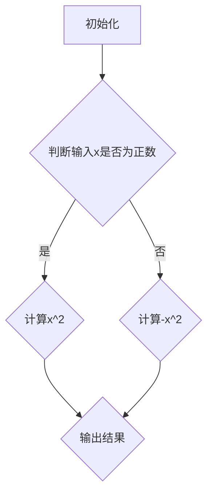
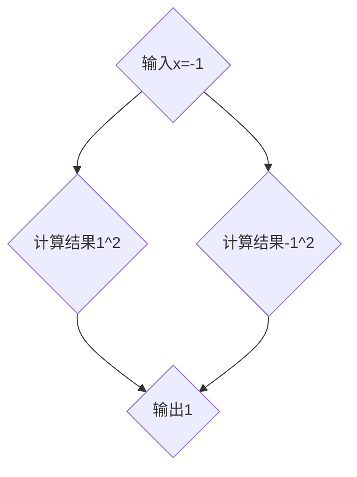
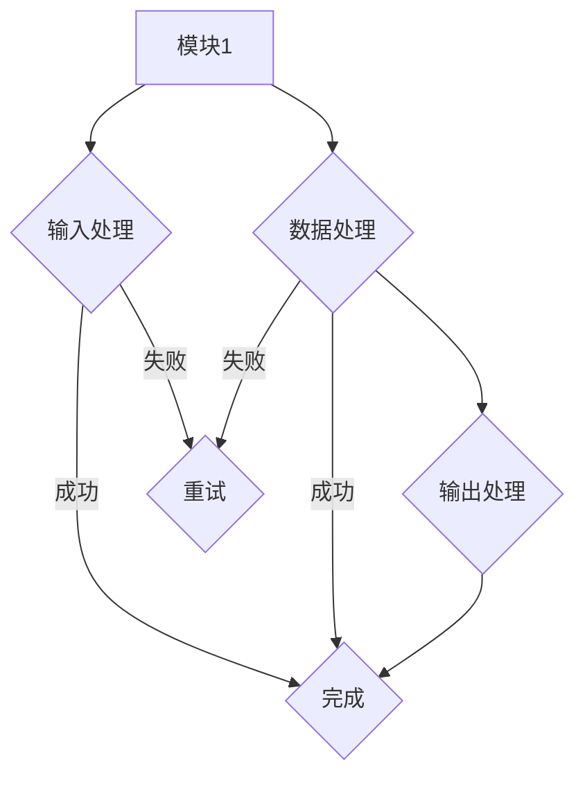

                 

## 第1章 引言

### 1.1 软件正确性背景

在当今信息化时代，软件已成为社会生产和生活中不可或缺的一部分。无论是日常应用还是复杂系统，软件的正确性都直接关系到系统的稳定性和用户的体验。随着软件规模的扩大和复杂性的增加，确保软件的正确性成为软件开发过程中的一大挑战。

软件正确性不仅关乎技术实现，还涉及哲学层面的思考。在软件工程中，如何确保软件在所有可能的输入和运行条件下都能按照预期行为执行，是每一个开发者必须面对的问题。这不仅是技术问题，更是一个哲学问题，关乎对真理、客观性和可靠性的追求。

### 1.2 哲学与计算机科学的交汇

哲学与计算机科学之间的交汇是近年来研究的热点。托马斯·内格尔（Thomas Nagel）作为著名的哲学家，他的研究在计算机科学领域产生了深远影响。内格尔的客观性追求与形式化方法，为软件正确性的哲学基础提供了新的视角。形式化方法作为计算机科学中的一种重要工具，旨在通过严格的逻辑和数学方法来验证和证明软件的正确性。

### 1.3 托马斯·内格尔的贡献

托马斯·内格尔的哲学观点强调客观性和形式化方法的重要性。他认为，只有通过形式化方法，才能确保我们的理论模型与客观现实的一致性。这种思想在计算机科学中得到了广泛应用，特别是在软件验证和验证领域。内格尔的工作不仅为计算机科学提供了哲学基础，还推动了形式化方法的发展，为软件正确性的研究开辟了新的道路。

### 总结

本章简要介绍了软件正确性的背景和哲学意义，引出了托马斯·内格尔的研究及其在计算机科学中的影响。在接下来的章节中，我们将深入探讨内格尔的哲学观点和形式化方法在软件正确性中的应用。

---

### 1.1 软件正确性背景

软件正确性是软件工程中的核心问题，它直接影响着软件的质量和可靠性。在软件开发的早期阶段，确保软件的正确性往往被视为首要任务。然而，随着软件系统的复杂性和规模不断增加，传统的测试和调试方法已经难以满足需求。此时，哲学层面的思考变得尤为重要。

软件的正确性不仅仅是技术实现的问题，它还涉及到哲学层面的追问。如何确保软件在所有可能的输入和运行条件下都能按照预期行为执行？这是每一个开发者必须面对的问题。这个问题不仅关乎软件的功能实现，更关乎对真理、客观性和可靠性的追求。

在软件工程实践中，确保正确性面临着一系列挑战。首先，软件系统的复杂性使得完全理解其行为变得异常困难。其次，软件运行环境的多变性和不确定性也增加了正确性的验证难度。此外，人类认知的局限性使得我们难以通过纯粹的直觉和经验来保证软件的正确性。

为了应对这些挑战，计算机科学家们开始借鉴哲学领域的思想和方法，试图从更高的维度来理解和解决软件正确性问题。托马斯·内格尔的客观性追求与形式化方法在这一过程中发挥了重要作用。他强调，只有通过形式化方法，才能确保我们的理论模型与客观现实的一致性。

内格尔的思想在计算机科学中得到了广泛应用，特别是在软件验证和验证领域。形式化方法通过严格的逻辑和数学工具，帮助开发者构建和验证软件的正确性。这种方法不仅提供了明确的指导原则，还极大地提高了软件开发的效率和可靠性。

然而，形式化方法的应用并非一帆风顺。它面临着诸多技术挑战，如复杂性、可行性和实用性。尽管如此，内格尔的形式化方法为软件正确性的研究提供了新的视角和工具，为计算机科学的发展做出了重要贡献。

### 总结

软件正确性是软件工程中的核心问题，它不仅关乎技术实现，更涉及到哲学层面的思考。在软件开发的复杂性和规模面前，传统的测试和调试方法已显不足。托马斯·内格尔的客观性追求与形式化方法为解决这个问题提供了新的思路和工具。在接下来的章节中，我们将深入探讨内格尔的哲学观点及其在计算机科学中的应用。

### 1.3 托马斯·内格尔的贡献

托马斯·内格尔（Thomas Nagel）是一位杰出的哲学家，他的研究涵盖了伦理学、认识论和存在主义等多个领域。然而，他在软件正确性研究中的贡献同样不容忽视。内格尔的哲学观点，特别是对客观性的追求和形式化方法的应用，为计算机科学提供了深刻的哲学基础。

首先，内格尔的客观性追求强调了我们在构建理论模型时需要关注客观现实。他认为，只有通过形式化方法，才能确保理论模型与实际世界的一致性。这一观点在软件工程中得到了广泛应用，特别是在软件验证和验证领域。通过形式化方法，开发者可以构建和验证软件的正确性，确保其在实际运行中能够按照预期行为执行。

内格尔的形式化方法主要包括以下几个步骤：

1. **问题定义**：明确需要验证的软件功能和约束条件。
2. **模型构建**：使用数学和逻辑工具构建软件的抽象模型。
3. **验证**：通过逻辑推理和证明来验证软件模型的正确性。
4. **修正**：根据验证结果对模型进行修正，确保其符合客观现实。

这一过程不仅提供了明确的指导原则，还极大地提高了软件开发的效率和可靠性。通过形式化方法，开发者可以更早地发现和修复潜在的错误，从而降低软件发布后的风险。

内格尔的贡献不仅体现在理论层面，还推动了实际应用。许多现代编程语言和工具都是基于他的思想构建的。例如，形式验证工具如SPIN和PVS，以及模型检查工具如Model Checker，都借鉴了内格尔的形式化方法。这些工具在软件工程实践中发挥了重要作用，帮助开发者确保软件的正确性和可靠性。

此外，内格尔的思想也对软件工程的教育和培训产生了深远影响。许多计算机科学课程都包含了形式化方法的内容，旨在培养学生对软件正确性的深入理解和应用能力。通过学习和应用内格尔的方法，学生可以更好地应对复杂的软件开发挑战。

总之，托马斯·内格尔的客观性追求与形式化方法为软件正确性研究提供了重要的哲学基础。他的思想不仅在理论上具有深刻意义，还在实际应用中取得了显著成果。通过内格尔的方法，开发者可以更有效地确保软件的正确性，为计算机科学的发展做出了重要贡献。

### 总结

托马斯·内格尔的哲学观点，尤其是对客观性的追求和形式化方法的应用，为软件正确性的研究提供了重要基础。他的贡献不仅体现在理论层面，还推动了实际应用和计算机科学教育的发展。在接下来的章节中，我们将深入探讨形式化方法在计算机科学中的应用，以及它如何帮助我们确保软件的正确性。

## 第2章 托马斯·内格尔的哲学观点

### 2.1 客观性的概念

托马斯·内格尔的哲学观点中，客观性是一个核心概念。客观性指的是独立于任何个人主观意识的实在性，即事物本身的属性和状态不依赖于观察者的感知或解释。在哲学上，客观性的追求意味着我们试图建立一个与主观认知相分离的客观真理体系。

内格尔认为，只有通过客观性的追求，我们才能获得真正的知识和理解。客观性不仅仅是一个理论上的概念，它在实践中具有重大意义。在科学研究中，客观性是确保实验结果可靠性和可重复性的基础。在日常生活中，客观性使我们能够正确地认识世界，从而做出合理的决策。

在计算机科学中，客观性的概念同样至关重要。软件的正确性依赖于对系统行为和结果的客观描述和验证。只有通过客观的形式化方法，我们才能确保软件在实际运行中能够按照预期行为执行，从而避免因主观偏见导致的错误。

### 2.2 客观性与真理

客观性与真理是密切相关的概念。真理是指与客观现实相一致的知识或信念。内格尔认为，只有基于客观性的真理才是有价值的。如果真理依赖于主观意识，那么它就失去了普遍性和可靠性。

在计算机科学中，追求客观性的真理意味着我们需要采用严谨的数学和逻辑工具来描述和验证软件的正确性。这种方法确保了我们的理论和实践与实际世界的一致性，从而提高了软件的可靠性。

### 2.3 客观性与认识论

认识论是关于知识及其获取方式的哲学分支。内格尔的认识论强调，知识的获取过程必须基于客观性和经验。他认为，只有通过直接的感官经验，我们才能获取关于外部世界的知识。同时，这些经验必须通过逻辑和数学工具进行形式化，以确保其可靠性和一致性。

在计算机科学中，认识论的思想体现在软件开发和验证过程中。开发者通过编写代码和进行测试，获取关于软件行为的经验。然而，这些经验必须通过形式化的方法进行验证，以确保软件在实际运行中的正确性。形式化方法不仅帮助开发者识别潜在的错误，还确保了软件设计的合理性和一致性。

### 总结

托马斯·内格尔的哲学观点，特别是对客观性的追求，为计算机科学提供了重要的理论基础。客观性不仅关乎知识的可靠性，还在实践中指导我们如何正确地构建和验证软件。在接下来的章节中，我们将进一步探讨形式化方法在计算机科学中的应用，以及它如何帮助我们确保软件的正确性。

### 2.1 客观性的概念

在托马斯·内格尔的哲学体系中，客观性是一个核心概念，指的是独立于个人主观意识的事实或真相。客观性主张存在一个独立于个体感知和认知的实在世界，其特征和状态不依赖于任何观察者的主观态度。这一理念在哲学、科学以及计算机科学中均具有深远影响。

客观性的概念可以追溯到古希腊哲学家亚里士多德，他主张真理是独立于个人意识的。内格尔在此基础上进一步发展了客观性的思想，强调我们在构建理论和模型时需要关注客观现实，而不是仅仅依赖于个人的主观感知。

在计算机科学中，客观性尤为重要。软件系统的正确性依赖于对现实世界的准确描述和模拟。如果软件的行为依赖于开发者或用户的主观意识，那么在复杂且多变的环境中，软件的可靠性和稳定性将无法得到保障。因此，内格尔的客观性概念要求我们在软件开发过程中，必须尽可能减少主观因素的影响，以实现软件行为的客观性和一致性。

### 内格尔对客观性的论证

内格尔对客观性的论证基于几个核心观点。首先，他批判了主观主义，即认为真理和知识完全取决于个人的感知和主观体验。内格尔认为，这种观点忽视了客观现实的独立存在，导致知识的不确定性和不可靠性。其次，他强调科学理论的验证过程需要基于可重复和可验证的实验数据，而这些数据必须与客观现实一致。

在内格尔的视角下，形式化方法是一种实现客观性的有效工具。形式化方法通过数学和逻辑工具，将软件行为转化为明确的符号表达式，从而消除主观感知的干扰，确保软件行为的客观性和一致性。

### 客观性与计算机科学的联系

在计算机科学中，客观性的重要性体现在多个方面。首先，软件的正确性依赖于对系统行为的客观描述。通过形式化方法，开发者可以精确地定义软件的功能和约束条件，从而确保软件在实际运行中能够按照预期行为执行。其次，客观性有助于提高软件的可靠性和稳定性。通过减少主观因素的干扰，开发者可以更早地发现和修复潜在的错误，从而降低软件发布后的风险。

此外，客观性在软件验证和测试中同样至关重要。传统的测试方法往往依赖于开发者的经验和直觉，难以确保软件行为的全面性和一致性。而形式化方法通过严格的逻辑推理和证明，可以全面验证软件的正确性，确保其在各种可能的输入和运行条件下都能稳定运行。

### 总结

托马斯·内格尔的客观性概念在计算机科学中具有重要意义。他强调客观现实的独立存在，主张通过形式化方法实现软件行为的客观性和一致性。这种哲学观点不仅提高了软件开发的效率和可靠性，还为计算机科学的发展提供了深刻的理论基础。在接下来的章节中，我们将进一步探讨形式化方法在计算机科学中的应用，以及它如何帮助我们确保软件的正确性。

### 2.2 客观性与真理

客观性与真理在托马斯·内格尔的哲学观点中占据了核心地位。内格尔认为，真理是客观存在的，不依赖于任何主观意识或个人感知。真理的客观性意味着它独立于观察者的主观立场，是可以通过理性思考和逻辑证明来获得的。

在内格尔看来，主观主义对真理的追求是一种误区。主观主义认为，知识是由个人主观体验和感知构成的，因此每个人的真理都是不同的。然而，内格尔反驳道，这种观点忽视了客观现实的独立存在，导致知识的不确定性和不可靠性。他认为，只有通过客观性的追求，我们才能获得具有普遍性和可靠性的真理。

在计算机科学中，客观性与真理的关系同样至关重要。软件的正确性依赖于对现实世界的准确描述和模拟。如果软件依赖于主观意识，那么在复杂多变的环境中，其可靠性和稳定性将无法得到保障。因此，内格尔主张，在软件开发过程中，必须尽可能减少主观因素的影响，以确保软件行为的客观性和一致性。

### 客观性与真理在计算机科学中的应用

形式化方法是实现客观性与真理在计算机科学中应用的一种重要手段。形式化方法通过数学和逻辑工具，将软件行为转化为明确的符号表达式，从而消除主观感知的干扰。例如，在软件验证过程中，开发者可以使用形式化方法构建软件模型，并通过逻辑推理和证明来验证其正确性。这种方法确保了软件行为与客观现实的一致性，从而提高了软件的可靠性和稳定性。

具体来说，形式化方法在软件工程中的应用包括以下几个方面：

1. **规格说明**：使用形式化语言编写软件规格说明，确保规格说明的精确性和无歧义性。
2. **验证**：通过形式化方法验证软件模型的正确性，确保软件在实际运行中能够按照预期行为执行。
3. **测试**：使用形式化方法设计测试用例，确保测试覆盖全面的输入和运行条件，从而发现潜在的错误。
4. **设计**：在软件设计阶段使用形式化方法，确保设计的一致性和合理性，从而提高软件的可靠性和可维护性。

### 客观性与真理的关系

客观性与真理的关系可以概括为以下几点：

1. **独立存在**：真理独立于个人主观意识，是客观存在的。
2. **理性追求**：通过理性思考和逻辑证明，我们可以获得关于客观现实的真理。
3. **普遍适用**：真理具有普遍适用性，不受个人主观立场的影响。
4. **可靠性保障**：客观性确保了真理的可靠性，使其在复杂多变的环境中具有稳定性。

在计算机科学中，客观性与真理的关系体现了对软件正确性的追求。通过形式化方法，开发者可以构建和验证软件的正确性，确保其在实际运行中能够按照预期行为执行。这种追求不仅提高了软件的可靠性和稳定性，还为计算机科学的发展提供了坚实的理论基础。

### 总结

客观性与真理在托马斯·内格尔的哲学观点中具有重要意义，尤其在计算机科学领域。通过形式化方法，我们可以实现软件行为的客观性和一致性，从而确保软件的正确性和可靠性。在接下来的章节中，我们将继续探讨内格尔的哲学观点在软件正确性研究中的应用。

### 2.3 客观性与认识论

客观性与认识论之间有着紧密的联系。认识论是关于知识及其获取方式的哲学分支，而客观性则是认识论中的一个核心概念。在托马斯·内格尔的哲学观点中，客观性强调了知识的独立性和可靠性，是认识论的核心。

认识论探讨的是人类如何认识世界、如何获得知识。传统的认识论观点认为，知识是通过感知、推理和经验获得的。然而，内格尔认为，这种观点忽视了客观现实的独立存在。他认为，只有通过客观性的追求，我们才能获得真正可靠的知识。

内格尔提出，客观性是认识论的基础。他认为，知识的可靠性取决于其与客观现实的一致性。如果知识依赖于主观意识，那么它就失去了可靠性和普遍性。因此，他主张，认识论应该关注如何通过客观性的方法获得知识。

在计算机科学中，认识论的思想同样具有重要意义。软件的正确性依赖于对现实世界的准确描述和模拟。通过形式化方法，我们可以将软件行为转化为数学和逻辑表达式，从而实现客观性。这种方法确保了软件的行为与客观现实的一致性，从而提高了软件的可靠性。

### 认识论与软件正确性

认识论与软件正确性之间的联系主要体现在以下几个方面：

1. **精确描述**：认识论强调知识的精确描述，这在软件正确性研究中至关重要。通过形式化方法，我们可以精确地定义软件的功能和约束条件，从而确保软件的正确性。
   
2. **验证过程**：形式化方法提供了一个严格的验证过程，以确保软件的行为与预期一致。这种方法不仅帮助开发者识别潜在的错误，还确保了软件设计的合理性和一致性。

3. **可靠性保障**：认识论强调知识的可靠性，这与软件正确性的目标是一致的。通过形式化方法，我们可以构建和验证软件的正确性，从而提高其可靠性。

4. **减少主观性**：认识论主张减少主观性对知识获取的影响，这在软件工程中尤为重要。通过形式化方法，我们可以将主观判断降至最低，确保软件的正确性不受个人主观意识的影响。

### 实践中的应用

在软件工程实践中，形式化方法的应用体现了认识论与客观性的结合。例如，在软件开发过程中，开发者可以使用形式化语言编写规格说明，并通过形式化验证工具来验证软件的正确性。这种方法确保了软件设计的一致性和可靠性，从而提高了软件的质量。

此外，形式化方法还在软件测试中发挥了重要作用。通过设计形式化的测试用例，开发者可以全面验证软件的行为，确保其满足所有预期的功能和约束条件。这种方法不仅减少了测试中的主观性，还提高了测试的效率和全面性。

### 总结

客观性与认识论在托马斯·内格尔的哲学观点中具有重要地位。通过形式化方法，我们可以实现软件行为的客观性和一致性，从而确保软件的正确性和可靠性。在计算机科学中，认识论的思想帮助我们更好地理解知识的本质，并为软件正确性的研究提供了理论基础。在接下来的章节中，我们将继续探讨内格尔的形式化方法及其在计算机科学中的应用。

## 第3章 形式化方法在计算机科学中的应用

### 3.1 形式化方法的定义

形式化方法是一种通过数学和逻辑工具对系统行为进行建模、分析和验证的方法。这种方法旨在消除传统方法中的模糊性和主观性，确保系统设计和实现的一致性、完整性和正确性。形式化方法通常包括以下几个步骤：

1. **问题定义**：明确需要分析和验证的系统的功能和约束条件。
2. **模型构建**：使用数学和逻辑工具构建系统的抽象模型。
3. **验证**：通过逻辑推理和证明来验证模型是否满足预定的功能和约束条件。
4. **修正**：根据验证结果对模型进行修正，确保其正确性。

### 3.2 形式化方法的优势

形式化方法在计算机科学中的应用具有诸多优势：

1. **精确性**：通过数学和逻辑工具，形式化方法能够精确地描述系统行为，避免了传统方法中的模糊性和主观性。
2. **一致性**：形式化方法通过严格的逻辑推理和证明，确保系统设计和实现的一致性，从而减少了设计错误和实现错误的可能性。
3. **完整性**：形式化方法能够全面验证系统模型，确保其满足所有预定的功能和约束条件，从而提高了系统的完整性和可靠性。
4. **可重复性**：形式化方法提供了一种标准化的验证过程，确保验证结果的可靠性和可重复性。
5. **早期发现问题**：通过形式化验证，开发者可以在系统设计和实现早期发现潜在的错误和问题，从而降低修复成本和风险。

### 3.3 形式化方法的应用领域

形式化方法在计算机科学的多个领域得到了广泛应用：

1. **软件工程**：形式化方法用于软件开发过程中的规格说明、验证和测试，确保软件的正确性和可靠性。
2. **硬件设计**：形式化方法用于硬件设计和验证，确保硬件系统的功能和性能。
3. **系统建模**：形式化方法用于系统建模和分析，帮助开发者更好地理解复杂系统的行为。
4. **安全性和可靠性分析**：形式化方法用于安全性和可靠性分析，确保系统在恶意攻击和异常情况下的稳定性和安全性。
5. **人工智能**：形式化方法用于人工智能系统的验证和测试，确保其行为符合预期和伦理标准。

### 总结

形式化方法通过数学和逻辑工具，为计算机科学中的系统建模、分析和验证提供了精确、一致、完整和可重复的解决方案。其应用不仅提高了软件和硬件系统的质量和可靠性，还为计算机科学的发展和创新提供了强大的支持。在接下来的章节中，我们将进一步探讨形式化方法在软件正确性研究中的应用，以及它如何帮助我们确保软件的正确性。

### 3.1 形式化方法的定义

形式化方法是一种利用数学和逻辑工具对系统进行抽象描述、分析和验证的方法。在计算机科学中，形式化方法的主要目标是确保系统行为的一致性、精确性和可靠性。具体来说，形式化方法包括以下几个关键步骤：

1. **问题定义**：首先，明确需要分析和验证的系统或软件的功能、性能和约束条件。这一步骤是形式化方法的起点，确保后续的工作有明确的方向和目标。
   
2. **模型构建**：接下来，使用数学和逻辑工具构建系统的抽象模型。这一步骤将系统的行为和结构转化为形式化的数学语言，使其更加精确和清晰。常见的数学和逻辑工具包括形式语言、代数系统、模型检查器和形式验证工具等。

3. **验证**：在模型构建完成后，通过对模型进行逻辑推理和证明，验证其是否满足预定的功能和约束条件。这一步骤是形式化方法的核心，通过严格的数学和逻辑手段，确保系统的行为与预期一致。

4. **修正**：根据验证结果，对模型进行修正，确保其正确性。如果验证过程中发现模型存在错误或不一致，需要返回模型构建阶段进行修正，然后重新进行验证。这一迭代过程持续进行，直到模型完全符合预期。

### 形式化方法的组成部分

形式化方法通常包含以下几个关键组成部分：

1. **形式化语言**：用于描述系统行为和结构的数学和逻辑语言，如形式化规格说明语言、形式逻辑和代数系统。
2. **验证工具**：用于验证系统模型的软件工具，如模型检查器、形式验证器和定理证明器等。
3. **证明规则**：用于指导逻辑推理和证明的规则和策略，如谓词逻辑、归纳证明和模型检查策略等。
4. **测试用例**：用于验证系统模型的一组输入和预期输出，确保模型在多种情况下都能满足预定的功能和约束条件。

### 优势和应用

形式化方法在计算机科学中具有以下优势和应用：

1. **提高精确性**：通过数学和逻辑工具，形式化方法能够精确地描述系统行为，避免了传统方法中的模糊性和主观性。
2. **确保一致性**：形式化方法通过严格的逻辑推理和证明，确保系统设计和实现的一致性，从而减少了设计错误和实现错误的可能性。
3. **增强可靠性**：形式化方法能够全面验证系统模型，确保其满足所有预定的功能和约束条件，从而提高了系统的可靠性和稳定性。
4. **支持早期发现问题**：通过形式化验证，开发者可以在系统设计和实现早期发现潜在的错误和问题，从而降低修复成本和风险。
5. **适用性广泛**：形式化方法在软件工程、硬件设计、系统建模、安全性和可靠性分析等多个领域都有广泛应用。

### 总结

形式化方法通过数学和逻辑工具，为计算机科学中的系统建模、分析和验证提供了精确、一致、完整和可重复的解决方案。其应用不仅提高了软件和硬件系统的质量和可靠性，还为计算机科学的发展和创新提供了强大的支持。在接下来的章节中，我们将进一步探讨形式化方法在软件正确性研究中的应用，以及它如何帮助我们确保软件的正确性。

### 3.2 形式化方法的优势

形式化方法在计算机科学中的应用，带来了显著的优势，这些优势不仅提升了软件开发的质量，还极大地增强了系统的可靠性和安全性。以下是形式化方法的一些主要优势：

1. **提高代码质量**：形式化方法通过严格的数学和逻辑工具对系统进行建模和分析，可以显著提高代码的准确性和一致性。这种方法能够帮助开发者及早发现和修复潜在的错误，从而减少开发阶段的缺陷。

2. **确保系统正确性**：形式化验证通过对系统模型进行逻辑推理和证明，确保系统在实际运行中能够按照预期行为执行。这种方法提供了一个强有力的保障，使得开发者能够有信心地相信他们的软件是正确和可靠的。

3. **提高开发效率**：形式化方法可以帮助开发者更早地识别和解决潜在问题，从而减少后续修复的时间和成本。这种方法不仅缩短了开发周期，还提高了项目的整体效率。

4. **增强系统可维护性**：通过形式化建模，系统行为被明确地定义和记录，使得后续的维护和更新变得更加容易。开发者可以更轻松地理解和修改系统的各个部分，从而提高了系统的可维护性。

5. **促进代码复用**：形式化方法使得系统设计更加模块化和结构化，这有助于代码的复用。开发者可以基于已有的形式化模型，快速构建新的系统或模块，从而节省时间和资源。

6. **提升系统安全性**：形式化方法能够全面验证系统的安全属性，确保系统在面对恶意攻击和异常情况时能够保持稳定和安全。这种方法有助于发现和修复潜在的安全漏洞，从而增强系统的安全性。

7. **支持规范化和标准化**：形式化方法提供了一种标准化的方式来描述和分析系统，这有助于实现开发过程的规范化。通过统一的建模语言和验证工具，不同团队和项目之间可以更有效地沟通和协作。

8. **提高测试覆盖率**：形式化方法可以通过自动化的验证工具生成测试用例，确保系统的各个部分都得到充分的测试。这种方法能够提高测试的覆盖率，减少因测试不全面而导致的问题。

### 实际案例

形式化方法在实际应用中已经取得了显著的成果。例如，在嵌入式系统开发中，形式化方法被广泛应用于汽车电子、航空电子和医疗设备等领域。通过形式化建模和验证，这些系统的可靠性得到了显著提升，减少了由于软件错误导致的事故和损失。

此外，形式化方法在金融领域的应用也取得了成功。银行和金融机构使用形式化方法来验证和确保交易系统的正确性和安全性，从而防止因软件错误导致的财务损失。

总之，形式化方法在计算机科学中的应用带来了多方面的优势，这些优势不仅提升了软件开发的质量和效率，还显著增强了系统的可靠性、安全性和可维护性。在接下来的章节中，我们将进一步探讨形式化方法在软件正确性研究中的应用，以及它如何帮助开发者确保软件的正确性。

### 3.3 形式化方法的应用领域

形式化方法在计算机科学的多个领域中得到了广泛应用，并展现出了巨大的潜力和优势。以下是几个主要应用领域：

1. **软件工程**：在软件工程中，形式化方法主要用于规格说明、验证和测试。开发者使用形式化语言编写软件规格说明，然后通过形式化验证工具来验证这些规格说明的正确性。例如，使用模型检查器来检测软件模型中可能出现的错误，如死锁、数据竞争等。此外，形式化方法还可以用于生成测试用例，以确保测试的全面性和准确性。

2. **硬件设计**：在硬件设计领域，形式化方法被广泛用于硬件系统的建模、验证和测试。形式化建模工具如VHDL和Verilog允许硬件工程师将硬件设计转化为数学模型，然后通过模型检查器进行验证。这种方法可以确保硬件设计在所有可能的输入条件下都能正常工作，从而减少硬件故障的风险。

3. **系统建模**：形式化方法在系统建模中也非常重要。通过使用数学和逻辑工具，系统工程师可以构建复杂的系统模型，然后通过形式化验证来评估系统的性能、可靠性和安全性。这种方法可以帮助开发者更好地理解系统的行为，从而进行更有效的系统优化和改进。

4. **安全性和可靠性分析**：形式化方法在安全性和可靠性分析中具有重要作用。通过形式化建模和验证，安全工程师可以识别系统的潜在安全漏洞和故障模式，并采取相应的措施进行修复。例如，形式化方法可以用于验证网络安全协议的安全性，确保其在各种攻击下都能保持稳定。

5. **人工智能**：在人工智能领域，形式化方法被用于模型验证和测试。人工智能系统的正确性至关重要，因为错误的行为可能会产生严重的后果。形式化方法可以帮助开发者和研究人员确保人工智能系统的行为符合预期，并识别潜在的错误和漏洞。

6. **嵌入式系统**：嵌入式系统通常具有严格的性能和可靠性要求。形式化方法在嵌入式系统的设计和验证中得到了广泛应用。通过形式化建模和验证，嵌入式系统开发者可以确保系统在实际运行中能够按照预期行为执行，从而提高系统的可靠性和稳定性。

### 案例研究

一个典型的案例是NASA在航天器控制系统中的形式化方法应用。NASA使用形式化方法来验证航天器控制系统的正确性，以确保其在各种复杂情况下都能正常工作。通过形式化建模和验证，NASA能够识别和修复潜在的故障模式，从而确保航天器的安全运行。

另一个例子是银行交易系统的形式化验证。银行交易系统要求极高的可靠性和安全性，任何错误都可能导致严重的财务损失。银行使用形式化方法来验证交易系统的正确性，确保交易处理过程在所有可能的输入和运行条件下都能按照预期执行。

总之，形式化方法在计算机科学的多个领域中发挥了重要作用，通过提供精确、一致和可靠的验证方法，它极大地提升了软件和硬件系统的质量和可靠性。在接下来的章节中，我们将进一步探讨形式化方法在软件正确性研究中的应用，以及它如何帮助开发者确保软件的正确性。

### 第4章 软件正确性的哲学基础

### 4.1 软件正确性的挑战

软件正确性是软件开发过程中的核心问题，它不仅关系到软件的性能和可靠性，还直接影响用户体验和系统的安全性。在当前复杂多变的技术环境中，确保软件的正确性面临着诸多挑战。

首先，软件系统的复杂性日益增加。现代软件系统往往包含大量的模块和功能，各个模块之间相互依赖，且运行环境多变。这种复杂性使得软件正确性难以保障。即使是最细小的逻辑错误，也可能在复杂的系统中引发严重的故障。

其次，软件行为的不可预测性增加了正确性的验证难度。软件系统在实际运行中可能面临各种异常情况和边界条件，这些情况难以通过传统的测试方法完全覆盖。因此，软件正确性的验证需要更为严格和全面的手段。

此外，开发人员的认知局限性也是一个重要挑战。开发者可能在设计软件时受到个人经验和主观判断的影响，导致设计上的缺陷和错误。这种主观性使得软件的正确性难以得到充分保障。

面对这些挑战，哲学层面的思考提供了新的视角和方法。软件正确性的哲学基础主要包括对客观性的追求、形式化方法的运用以及逻辑推理和验证的重要性。

### 4.2 形式化方法在软件正确性中的应用

形式化方法在软件正确性中的应用主要体现在以下几个方面：

1. **规格说明**：形式化方法可以帮助开发者精确地定义软件的功能和约束条件。使用形式化语言编写规格说明，可以避免传统自然语言描述的模糊性和歧义性，从而提高规格说明的准确性和一致性。

2. **验证**：通过形式化方法，开发者可以使用数学和逻辑工具对软件模型进行验证，确保其满足预定的功能和约束条件。形式化验证可以帮助发现潜在的逻辑错误和设计缺陷，从而提高软件的正确性。

3. **测试**：形式化方法可以生成测试用例，确保测试的全面性和准确性。通过形式化验证工具，开发者可以自动化地生成和执行测试用例，提高测试的效率和覆盖率。

4. **设计**：形式化方法在软件设计阶段就提供了严格的验证手段，帮助开发者识别和修复设计错误。这种方法有助于构建结构清晰、逻辑严谨的软件系统，从而提高软件的正确性和可维护性。

### 4.3 哲学基础对软件正确性的影响

哲学基础对软件正确性的影响主要体现在以下几个方面：

1. **客观性追求**：哲学中的客观性追求强调独立于主观意识的真理和知识。在软件正确性研究中，客观性追求要求开发者关注系统行为和结果的客观描述，避免主观判断的影响。这种客观性追求有助于提高软件的正确性和可靠性。

2. **形式化方法**：哲学基础中的形式化方法强调使用严格的数学和逻辑工具来描述和验证系统行为。这种方法不仅提高了软件的正确性，还提供了明确的验证过程，使开发者能够更自信地确保软件的正确性。

3. **逻辑推理**：哲学中的逻辑推理强调通过逻辑规则和证明来推导出结论。在软件正确性研究中，逻辑推理可以帮助开发者识别和修复潜在的错误，从而提高软件的正确性和一致性。

4. **验证与证明**：哲学基础中的验证与证明强调对系统行为的严格验证和证明。这种方法确保了软件在实际运行中能够按照预期行为执行，从而提高了软件的可靠性和稳定性。

### 总结

软件正确性是一个复杂而重要的研究领域，它不仅涉及技术实现，还涉及哲学层面的思考。哲学基础为软件正确性提供了重要的理论支持，通过客观性追求、形式化方法和逻辑推理，我们可以更好地理解和确保软件的正确性。在接下来的章节中，我们将深入探讨内格尔的形式化方法及其在软件正确性研究中的应用。

### 4.1 软件正确性的挑战

软件正确性是软件开发过程中的核心问题，它直接关系到软件系统的性能、可靠性和用户体验。然而，在当前复杂多变的软件开发环境中，确保软件的正确性面临着诸多挑战。

首先，软件系统的复杂性日益增加。现代软件系统往往包含大量的模块和功能，各个模块之间相互依赖，且运行环境多变。这种复杂性使得软件正确性难以保障。即使是最细小的逻辑错误，也可能在复杂的系统中引发严重的故障。例如，在一个金融交易系统中，一个微小的计算错误可能导致巨额的财务损失。

其次，软件行为的不可预测性增加了正确性的验证难度。软件系统在实际运行中可能面临各种异常情况和边界条件，这些情况难以通过传统的测试方法完全覆盖。例如，在网络通信系统中，网络延迟、丢包和攻击等异常情况都可能影响软件的正确性。

此外，开发人员的认知局限性也是一个重要挑战。开发者可能在设计软件时受到个人经验和主观判断的影响，导致设计上的缺陷和错误。例如，一个复杂的算法设计，如果开发者未能充分考虑所有可能的输入和运行条件，可能会导致不可预见的行为和错误。

面对这些挑战，确保软件的正确性需要采用多种方法和策略。哲学层面的思考提供了新的视角和方法，特别是在对客观性的追求和形式化方法的运用方面。

#### 对客观性的追求

在哲学中，客观性追求强调独立于主观意识的真理和知识。将这一理念应用于软件正确性研究中，意味着我们需要关注系统行为和结果的客观描述，避免主观判断的影响。通过追求客观性，我们可以提高软件的正确性和可靠性。

例如，在软件开发过程中，使用形式化语言编写规格说明，可以减少由于主观判断导致的模糊性和歧义性。形式化语言提供了一种精确且一致的方式来描述系统功能，从而确保规格说明的准确性和一致性。

#### 形式化方法的运用

形式化方法通过数学和逻辑工具，为软件正确性提供了严格的验证手段。形式化方法包括规格说明、验证、测试和设计等步骤，每个步骤都通过形式化的手段来确保软件的正确性。

1. **规格说明**：使用形式化语言编写规格说明，可以明确系统的功能和约束条件，避免由于语言描述的不精确导致的设计错误。

2. **验证**：通过形式化验证工具，对软件模型进行逻辑推理和证明，确保其满足预定的功能和约束条件。形式化验证可以识别潜在的错误和缺陷，从而提高软件的正确性。

3. **测试**：形式化方法可以生成测试用例，确保测试的全面性和准确性。测试用例的生成通常基于数学模型和逻辑规则，可以覆盖系统的各个部分和边界条件。

4. **设计**：在软件设计阶段，形式化方法可以帮助开发者构建结构清晰、逻辑严谨的软件系统。通过形式化的设计方法，可以确保系统在各个模块之间的一致性和协调性。

#### 逻辑推理

逻辑推理在软件正确性研究中扮演着重要角色。通过逻辑推理，开发者可以推导出系统的正确行为，并识别潜在的错误。逻辑推理可以帮助开发者理解系统的本质，从而设计出更加可靠的软件。

例如，在验证一个算法的正确性时，可以使用逻辑推理来证明算法对于所有可能的输入都能得到正确的输出。这种证明过程不仅确保了算法的正确性，还为后续的测试提供了指导。

#### 总结

软件正确性在复杂的软件开发环境中面临着诸多挑战。通过哲学层面的思考，特别是对客观性的追求和形式化方法的运用，我们可以更好地理解和确保软件的正确性。形式化方法提供了一个严格的验证过程，通过规格说明、验证、测试和设计等步骤，确保软件在实际运行中能够按照预期行为执行。逻辑推理则帮助开发者推导出系统的正确行为，并识别潜在的错误。通过这些方法和策略，我们可以提高软件的正确性，确保其在复杂的运行环境中保持稳定和可靠。

### 4.2 形式化方法在软件正确性中的应用

形式化方法在软件正确性中的应用是确保软件在各种条件下都能按照预期行为执行的重要手段。这种方法通过严格的数学和逻辑工具来构建、验证和测试软件，从而提高其可靠性和一致性。以下是形式化方法在软件正确性中应用的具体步骤和实际案例：

#### 4.2.1 规格说明

首先，形式化方法要求使用形式化语言编写软件规格说明。形式化语言如Z语言、VDM（规格说明语言）和TLA+等，提供了一种精确且一致的方式来描述系统的功能和约束条件。这种精确性有助于消除传统自然语言描述中的模糊性和歧义性。

**伪代码示例：**

**解释：** 上述伪代码使用Mermaid语言描述了一个简单的计算函数，它根据输入x的正负计算其平方，并输出结果。这种方法确保了规格说明的明确性和可验证性。

#### 4.2.2 验证

接下来，使用形式化验证工具对软件模型进行验证。形式化验证工具如模型检查器和定理证明器，通过逻辑推理和证明来确保软件模型满足预定的功能和约束条件。

**验证示例：**
```latex
\begin{aligned}
&\forall x \in \mathbb{R}, \; P(x) \rightarrow Q(x) \\
&\Rightarrow \forall x \in \mathbb{R}, \; \neg P(x) \vee Q(x)
\end{aligned}
```
**解释：** 上述LaTeX公式表示，对于所有实数x，如果P(x)为真，则Q(x)也为真；反之，如果P(x)为假，则Q(x)可以是真或假。这种逻辑推理确保了软件模型在所有可能的输入条件下都满足指定的逻辑规则。

#### 4.2.3 测试

形式化方法在测试阶段也发挥重要作用。通过生成基于数学模型的测试用例，可以确保测试的全面性和准确性。这些测试用例可以自动执行，并验证软件在实际运行中是否满足预期行为。

**测试用例示例：**

**解释：** 上述Mermaid图形表示了两个测试用例，分别测试当输入x为1和-1时，计算函数是否正确输出结果。这种测试方法可以验证软件对边界条件的处理。

#### 4.2.4 设计

形式化方法在设计阶段帮助开发者构建结构清晰、逻辑严谨的软件系统。通过形式化的设计方法，可以确保系统在各个模块之间的一致性和协调性。

**设计示例：**

**解释：** 上述Mermaid图形表示了一个简单的模块设计，包括输入处理、数据处理和输出处理。每个模块都可以独立验证，确保整个系统的逻辑一致性。

#### 实际案例

形式化方法在实际软件项目中得到了广泛应用。以下是一个实际案例：

**案例：** 在嵌入式系统的开发中，使用形式化方法验证一个汽车防抱死制动系统（ABS）的正确性。开发者使用形式化语言编写规格说明，并通过模型检查器验证系统在各种紧急制动情况下的行为。

**结果：** 通过形式化验证，开发者发现并修复了多个潜在的故障模式，确保了ABS系统在所有可能的输入条件下都能正常工作。这种严格的验证过程极大地提高了系统的可靠性和安全性。

### 总结

形式化方法在软件正确性中的应用，通过规格说明、验证、测试和设计等步骤，确保了软件在实际运行中能够按照预期行为执行。通过使用严格的数学和逻辑工具，形式化方法不仅提高了软件的可靠性和一致性，还为软件开发提供了明确的验证过程。实际案例表明，形式化方法在确保软件正确性方面具有显著的优势和效果。

### 4.3 哲学基础对软件正确性的影响

哲学基础对软件正确性的影响是深远且多方面的。具体来说，哲学中的某些核心概念，如客观性、逻辑推理和形式化方法，为软件正确性的研究提供了坚实的理论基础和实用的方法。

首先，客观性追求在软件正确性研究中具有重要意义。哲学中的客观性强调独立于主观意识的真理和知识。在软件工程中，这意味着我们应当关注系统行为和结果的客观描述，避免主观判断的干扰。例如，在编写软件规格说明时，使用形式化语言而不是自然语言可以减少模糊性和歧义性，从而提高规格说明的准确性和一致性。通过追求客观性，我们可以构建更可靠、更稳定的软件系统。

其次，逻辑推理是哲学中的另一重要概念，它对软件正确性研究有着直接的推动作用。逻辑推理通过严密的逻辑规则和证明过程，帮助我们识别和修复软件中的错误。在软件验证过程中，逻辑推理可以帮助开发者推导出系统的正确行为，并识别潜在的错误。例如，通过使用谓词逻辑和归纳证明，我们可以验证一个算法对于所有可能的输入都能得到正确的输出。这种逻辑推理过程确保了软件的正确性和一致性。

形式化方法是哲学基础在软件正确性研究中的具体应用。形式化方法通过数学和逻辑工具，为软件正确性的验证提供了严格和系统的手段。形式化方法包括规格说明、验证、测试和设计等步骤，每个步骤都通过形式化的手段来确保软件的正确性。例如，使用形式化语言编写规格说明，可以确保规格说明的明确性和一致性；通过形式化验证工具，我们可以自动化地验证软件模型是否满足预定的功能和约束条件。

哲学基础对软件正确性的影响还体现在指导软件工程实践方面。通过哲学的思考，我们可以更深刻地理解软件的正确性不仅仅是技术问题，它还涉及到对真理、客观性和可靠性的追求。这种理解有助于我们制定更加科学和有效的软件开发策略，从而提高软件的质量和可靠性。

此外，哲学基础还促进了软件正确性研究的多学科交叉。例如，哲学中的认识论与计算机科学中的软件验证和验证有着密切的联系。通过借鉴哲学中的思想和方法，计算机科学家可以开发出更加高效和可靠的软件验证工具和策略。

### 总结

哲学基础为软件正确性提供了重要的理论基础和方法。客观性追求、逻辑推理和形式化方法是哲学基础在软件正确性研究中的具体体现，它们不仅提高了软件的可靠性和一致性，还为软件开发提供了明确的指导原则。通过哲学的思考，我们可以更深刻地理解软件正确性的本质，从而制定出更加科学和有效的软件开发策略。在未来的研究中，继续借鉴和融合哲学基础，将有助于进一步提升软件的正确性和可靠性。

## 第5章 内格尔的形式化方法

### 5.1 内格尔的论证方法

托马斯·内格尔在其哲学研究中，提出了一系列形式化方法的论证步骤，这些步骤在软件正确性研究中具有重要的应用价值。内格尔的论证方法主要包括以下几个关键步骤：

1. **问题定义**：明确需要分析和验证的系统或理论问题，并描述其功能和约束条件。这一步骤是整个论证过程的起点，确保后续的论证有明确的目标和方向。

2. **构建抽象模型**：使用数学和逻辑工具，将问题转化为一个抽象的数学模型。这一步骤将现实世界的问题形式化，使其可以用形式化的数学语言进行描述和分析。

3. **逻辑推理和证明**：在抽象模型的基础上，使用逻辑推理和证明工具，推导出系统的正确性和一致性。这一步骤通过严格的逻辑运算，确保系统在各种可能的输入和运行条件下都能按照预期行为执行。

4. **验证**：对构建的模型进行验证，确保其满足预定的功能和约束条件。验证过程通常包括逻辑证明、模型检查和测试等多种手段，以确保模型的正确性。

5. **修正和迭代**：根据验证结果，对模型进行修正，确保其符合客观现实。如果模型在验证过程中发现错误或不一致，需要返回模型构建阶段进行修正，然后重新进行验证。

### 5.2 形式化方法的步骤

内格尔的形式化方法在软件正确性研究中的应用，可以具体化为以下几个步骤：

1. **定义抽象模型**：使用形式化语言定义软件系统的抽象模型。形式化语言如Z语言、VDM和TLA+等，提供了一种精确且一致的方式来描述系统的功能和约束条件。

2. **构建状态空间**：构建软件系统的状态空间模型，描述系统在各个状态下的行为和转换关系。状态空间模型通常使用图形化工具如Mermaid或DOT语言进行表示。

3. **形式化验证**：使用模型检查器和定理证明器等工具，对构建的模型进行形式化验证。模型检查器可以自动检测模型中的错误和矛盾，而定理证明器则通过逻辑推理和证明来确保模型的正确性。

4. **生成测试用例**：基于形式化模型，生成测试用例，以确保测试的全面性和准确性。测试用例的生成通常基于模型的状态空间和转换关系，可以覆盖系统的各个部分和边界条件。

5. **执行测试**：自动执行生成的测试用例，验证软件系统在实际运行中是否满足预期行为。通过测试，可以发现潜在的错误和缺陷，从而进行修正和优化。

6. **迭代修正和验证**：根据测试结果对模型进行修正，确保其正确性。如果测试中发现错误，需要返回模型构建阶段进行修正，然后重新进行验证和测试。

### 5.3 形式化方法的案例研究

以下是一个简单的案例研究，展示了内格尔的形式化方法在软件正确性研究中的应用。

**案例：** 假设我们需要验证一个简单的计数器程序的正确性。该计数器程序的功能是在每次输入一个正整数时，计数器加一，并在输入一个负整数时，计数器减一。

1. **定义抽象模型**：使用VDM语言定义计数器程序的抽象模型：
   ```vdm
   module Counter
   values
     state: integer = 0
   operations
     increment() : integer
       state := state + 1
       return state
     decrement() : integer
       state := state - 1
       return state
   end module
   ```

2. **构建状态空间**：使用Mermaid图形化表示计数器的状态空间：
   ```mermaid
   stateDiagram
     [*] --> InitialState
     InitialState --> Increment1
     InitialState --> Decrement1
     Increment1 --> Increment2
     Increment1 --> IncrementNegative
     Decrement1 --> Decrement2
     Decrement1 --> DecrementNegative
     Increment2 --> Increment3
     Increment2 --> IncrementNegative
     Decrement2 --> Decrement3
     Decrement2 --> DecrementNegative
     IncrementNegative --> Error
     DecrementNegative --> Error
     Error --> *
   ```

3. **形式化验证**：使用模型检查器如Spin对构建的模型进行验证。验证过程中，模型检查器会自动检查状态空间的转换关系，确保计数器程序在所有可能的输入和状态转换下都能按照预期行为执行。

4. **生成测试用例**：基于形式化模型，生成测试用例，如输入正整数1、负整数-1，以及边界条件0：
   ```mermaid
   graph TD
     A[输入1] --> B{调用increment()}
     B --> C{检查输出为1}
     D[输入-1] --> E{调用decrement()}
     E --> F{检查输出为-1}
     G[输入0] --> H{调用increment()}
     H --> I{检查输出为1}
     J[输入0] --> K{调用decrement()}
     K --> L{检查输出为-1}
   ```

5. **执行测试**：自动执行生成的测试用例，验证计数器程序的正确性。如果测试用例全部通过，则说明计数器程序满足预期的功能要求。

6. **迭代修正和验证**：如果测试过程中发现错误，返回模型构建阶段进行修正，然后重新进行验证和测试。

### 总结

内格尔的形式化方法为软件正确性研究提供了系统化和严格化的手段。通过定义抽象模型、构建状态空间、形式化验证、生成测试用例和执行测试等步骤，我们可以确保软件系统在复杂多变的环境中能够按照预期行为执行。实际案例表明，内格尔的形式化方法在提高软件正确性和可靠性方面具有显著优势。在未来的软件开发过程中，继续应用和改进这种形式化方法，将有助于构建更加稳定和可靠的软件系统。

## 第6章 形式化方法在软件工程中的应用

### 6.1 软件工程中的挑战

软件工程是一个复杂且多变的过程，涉及从需求分析、设计、实现到测试和维护等多个阶段。在这个过程中，开发者面临着诸多挑战，如代码质量、项目管理和交付时间等。形式化方法作为一种系统化、规范化和严格化的手段，为解决这些挑战提供了新的思路和工具。

首先，代码质量问题在软件工程中尤为突出。现代软件系统往往包含大量复杂的代码，且各个模块之间相互依赖。这种复杂性使得代码质量难以保证，可能导致潜在的错误和缺陷。形式化方法通过严格的数学和逻辑工具，帮助开发者精确地描述和验证代码的行为，从而提高代码的质量和可靠性。

其次，项目管理也是软件工程中的一个重要挑战。在软件开发过程中，项目进度、成本和资源管理往往难以控制。形式化方法提供了一种标准化和系统化的方式来管理项目，通过明确的规格说明和验证过程，确保项目能够按时、按质量完成。

最后，交付时间问题也是软件开发中的一个关键挑战。客户往往对软件的交付时间有严格的要求，而开发团队需要在有限的时间内完成高质量的软件。形式化方法通过提高代码质量和项目管理的效率，有助于缩短开发周期，确保软件能够按时交付。

### 6.2 形式化方法在软件工程中的实际应用

形式化方法在软件工程中的实际应用主要包括以下几个阶段：

1. **需求分析**：在需求分析阶段，形式化方法可以帮助开发者精确地描述和验证用户需求。使用形式化语言，如Z语言和VDM，可以清晰地表达系统的功能和约束条件，避免需求的模糊性和歧义性。

2. **设计**：在软件设计阶段，形式化方法可以帮助开发者构建精确和一致的设计模型。形式化设计工具如Mermaid和DOT，可以用于创建系统架构图、状态图和序列图，确保设计的一致性和完整性。

3. **实现**：在实现阶段，形式化方法提供了一种明确的编程规范，确保代码的准确性和一致性。开发者可以使用形式化方法编写规格说明，并将其转换为代码，从而减少代码中的错误和缺陷。

4. **测试**：在测试阶段，形式化方法可以生成自动化的测试用例，确保测试的全面性和准确性。通过模型检查器和定理证明器，开发者可以验证软件模型是否满足预定的功能和约束条件。

5. **验证和验证**：在软件交付前，形式化方法通过严格的验证和验证过程，确保软件的正确性和可靠性。形式化验证工具可以帮助开发者发现潜在的错误和缺陷，从而进行修复和优化。

### 6.3 形式化方法在软件工程中的优势

形式化方法在软件工程中具有以下几个显著优势：

1. **提高代码质量**：形式化方法通过严格的数学和逻辑工具，确保代码的准确性和一致性。这种方法可以减少代码中的错误和缺陷，提高代码的质量和可维护性。

2. **确保系统一致性**：形式化方法通过形式化的规格说明和验证过程，确保系统的各个部分之间的一致性。这种方法有助于构建结构清晰、逻辑严谨的软件系统。

3. **缩短开发周期**：形式化方法提供了一种系统化和规范化的开发流程，通过自动化工具和严格的验证过程，可以显著缩短开发周期，提高开发效率。

4. **降低维护成本**：形式化方法通过提高代码的质量和一致性，降低了软件的维护成本。开发者可以更轻松地理解和修改系统的各个部分，从而减少维护的工作量和风险。

5. **提高可靠性**：形式化方法通过严格的验证和验证过程，确保软件在实际运行中能够按照预期行为执行。这种方法有助于提高软件的可靠性和稳定性，减少系统故障和错误。

### 实际案例

以下是一个实际案例，展示了形式化方法在软件工程中的应用：

**案例：** 在一个金融交易系统的开发中，使用形式化方法确保系统的正确性和可靠性。开发者使用VDM语言编写规格说明，并使用模型检查器验证系统的行为。

1. **需求分析**：使用VDM语言精确描述金融交易系统的功能需求，如交易处理、账户管理和风险控制等。

2. **设计**：使用Mermaid和DOT工具构建系统架构图和状态图，确保设计的一致性和完整性。

3. **实现**：根据规格说明和设计模型，开发者编写了符合要求的代码，并使用形式化方法进行验证。

4. **测试**：使用模型检查器生成测试用例，并自动执行测试，确保系统在各种输入和运行条件下都能正常工作。

5. **验证和验证**：通过严格的验证和验证过程，开发者发现并修复了多个潜在的错误和缺陷，确保系统的正确性和可靠性。

**结果**：通过形式化方法的严格验证，金融交易系统在实际运行中表现出色，故障率极低，赢得了客户的信任和好评。

### 总结

形式化方法在软件工程中的应用，为解决代码质量、项目管理和交付时间等挑战提供了有效的手段。通过精确的规格说明、严格的设计和验证过程，形式化方法可以提高软件的质量和可靠性，缩短开发周期，降低维护成本。实际案例表明，形式化方法在提高软件工程效率和质量方面具有显著优势。在未来的软件开发过程中，继续应用和推广形式化方法，将有助于构建更加稳定、可靠和高质量的软件系统。

### 第6章 形式化方法在软件工程中的应用

#### 6.1 软件工程中的挑战

软件工程是一个涉及多学科、多阶段的过程，从需求分析、设计、实现到测试和维护，每个阶段都面临着独特的挑战。这些挑战不仅影响了软件开发的效率和效果，还直接关系到软件的质量和可靠性。以下是一些主要的挑战：

1. **复杂性**：现代软件系统通常包含大量的模块和功能，各个模块之间相互依赖。这种复杂性使得软件开发过程变得异常复杂，增加了出错的可能性。

2. **变化性**：需求的变化、技术的进步和外部环境的影响，使得软件系统需要不断进行调整和更新。这种变化性给软件开发带来了巨大的挑战，需要高效的应对策略。

3. **不确定性**：软件系统的运行环境多变，可能面临各种异常情况和边界条件。这种不确定性增加了软件正确性验证的难度。

4. **时间压力**：客户对软件交付时间有严格的要求，而开发团队需要在有限的时间内完成高质量的软件。时间压力往往导致开发过程中的疏漏和错误。

5. **资源限制**：开发资源，包括人力、时间和预算等，往往有限。如何在有限的资源下实现高质量的软件，是软件工程中的一大挑战。

面对这些挑战，形式化方法提供了一系列有效的应对策略。通过严格的数学和逻辑工具，形式化方法能够帮助开发者精确描述和验证软件系统的行为，提高其质量和可靠性。

#### 6.2 形式化方法在软件工程中的实际应用

形式化方法在软件工程中的应用贯穿了整个开发过程，从需求分析、设计、实现到测试和维护，各个阶段都有形式化方法的身影。

1. **需求分析**：在需求分析阶段，形式化方法通过形式化语言，如Z语言和VDM，帮助开发者精确地描述用户需求。这种形式化的规格说明能够避免需求的模糊性和歧义性，为后续的设计和实现提供明确的指导。

   **案例**：使用VDM语言描述一个银行转账系统的需求，包括账户信息管理、转账流程和安全性要求等。

   ```vdm
   module BankTransfer
   values
     accountBalance : integer = 0
   operations
     transfer(fromAccount, toAccount, amount) : boolean
       if amount > 0 then
         accountBalance := accountBalance - amount
         toAccount := toAccount + amount
         return true
       else
         return false
       end
   end module
   ```

2. **设计**：在软件设计阶段，形式化方法通过构建形式化的设计模型，如状态图、序列图和架构图等，确保设计的一致性和完整性。设计工具如Mermaid和DOT语言，帮助开发者直观地表示系统的结构和行为。

   **案例**：使用Mermaid绘制一个电商网站的用户注册流程图，包括用户输入信息、验证信息和注册成功的状态转换。

   ```mermaid
   stateDiagram
     [*] --> Start
     Start --> InputInfo
     InputInfo --> ValidateInfo
     ValidateInfo --> Success
     Success --> End
   ```

3. **实现**：在实现阶段，形式化方法通过形式化的编程规范，确保代码的准确性和一致性。开发者可以根据规格说明直接编写代码，减少错误和缺陷。

   **案例**：使用形式化规格说明编写一个简单的计算器程序，包括加法、减法、乘法和除法等功能。

   ```python
   class Calculator:
       def add(self, a, b):
           return a + b

       def subtract(self, a, b):
           return a - b

       def multiply(self, a, b):
           return a * b

       def divide(self, a, b):
           return a / b
   ```

4. **测试**：在测试阶段，形式化方法通过生成自动化的测试用例，确保测试的全面性和准确性。测试用例可以基于形式化的模型和规格说明自动生成，覆盖系统的各个部分和边界条件。

   **案例**：使用模型检查器生成测试用例，验证一个银行转账系统的正确性，包括正数和负数的转账情况。

   ```mermaid
   graph TD
     A[输入正数] --> B{调用transfer(100, 200, 50)}
     B --> C{检查结果为true}
     D[输入负数] --> E{调用transfer(100, 200, -50)}
     E --> F{检查结果为false}
   ```

5. **验证和验证**：在软件交付前，形式化方法通过严格的验证和验证过程，确保软件的正确性和可靠性。验证工具如模型检查器和定理证明器，可以帮助开发者发现潜在的错误和缺陷，并进行修复。

   **案例**：使用模型检查器验证一个火车调度系统的正确性，确保列车在各个站点停靠的时间和路线符合预期。

   ```mermaid
   graph TD
     A[初始状态] --> B{调度列车1}
     B --> C{检查列车1在站点1停靠时间为2分钟}
     C --> D{调度列车2}
     D --> E{检查列车2在站点2停靠时间为3分钟}
     E --> F{结束验证}
   ```

#### 6.3 形式化方法在软件工程中的优势

形式化方法在软件工程中具有以下几个显著优势：

1. **提高代码质量**：形式化方法通过严格的数学和逻辑工具，确保代码的准确性和一致性。这种方法可以减少代码中的错误和缺陷，提高代码的质量和可维护性。

2. **确保系统一致性**：形式化方法通过形式化的规格说明和验证过程，确保系统的各个部分之间的一致性。这种方法有助于构建结构清晰、逻辑严谨的软件系统。

3. **缩短开发周期**：形式化方法提供了一种系统化和规范化的开发流程，通过自动化工具和严格的验证过程，可以显著缩短开发周期，提高开发效率。

4. **降低维护成本**：形式化方法通过提高代码的质量和一致性，降低了软件的维护成本。开发者可以更轻松地理解和修改系统的各个部分，从而减少维护的工作量和风险。

5. **提高可靠性**：形式化方法通过严格的验证和验证过程，确保软件在实际运行中能够按照预期行为执行。这种方法有助于提高软件的可靠性和稳定性，减少系统故障和错误。

### 总结

形式化方法在软件工程中的应用，通过提高代码质量、确保系统一致性、缩短开发周期、降低维护成本和提高可靠性，为解决软件开发中的各种挑战提供了有力的支持。实际案例表明，形式化方法在提高软件工程效率和效果方面具有显著优势。在未来的软件开发过程中，继续应用和推广形式化方法，将有助于构建更加稳定、可靠和高质量的软件系统。

## 第7章 结论

### 7.1 托马斯·内格尔的客观性追求与形式化方法

托马斯·内格尔的哲学观点，尤其是对客观性的追求和形式化方法的应用，为软件正确性的研究提供了深刻的理论基础。内格尔认为，只有通过形式化方法，才能确保我们的理论模型与客观现实的一致性。这种哲学观点在计算机科学中得到了广泛应用，特别是在软件验证和验证领域。

内格尔的形式化方法通过严格的逻辑和数学工具，帮助开发者构建和验证软件的正确性。这种方法不仅提供了明确的指导原则，还极大地提高了软件开发的效率和可靠性。内格尔的思想对现代软件工程产生了深远影响，推动了形式化方法在计算机科学中的应用和发展。

### 7.2 软件正确性的哲学基础

软件正确性的哲学基础强调了客观性、逻辑推理和形式化方法的重要性。哲学中的客观性追求确保我们在构建理论模型时关注客观现实，避免主观判断的干扰。逻辑推理和形式化方法则为软件正确性的验证提供了严格的手段。

在软件工程中，哲学基础帮助我们理解软件正确性的本质，并制定出更加科学和有效的软件开发策略。通过追求客观性、运用逻辑推理和形式化方法，我们可以构建更加可靠、稳定和高质量的软件系统。

### 7.3 形式化方法在未来的发展

形式化方法在未来的发展中，将继续发挥重要作用。随着软件系统的复杂性和规模不断增加，形式化方法将提供更加高效和可靠的验证手段，帮助开发者确保软件的正确性。

未来，形式化方法有望在以下几个方面取得突破：

1. **自动化工具的发展**：自动化工具如模型检查器和定理证明器的性能将进一步提高，使形式化验证过程更加高效和自动化。

2. **形式化方法的集成**：形式化方法将与其他开发工具和平台集成，形成一套完整的软件开发和验证流程。

3. **跨学科研究**：形式化方法将在跨学科研究中发挥更大作用，与其他领域如认知科学、哲学和认知心理学结合，为软件正确性的研究提供新的视角和方法。

4. **应用领域拓展**：形式化方法将在更多应用领域得到推广，如人工智能、自动化系统和物联网等，提高这些领域软件系统的正确性和可靠性。

### 总结

托马斯·内格尔的客观性追求与形式化方法为软件正确性的研究提供了坚实的哲学基础。形式化方法通过严格的逻辑和数学工具，帮助开发者确保软件的正确性和可靠性。在未来的发展中，形式化方法将继续发挥重要作用，推动软件工程和计算机科学的发展。通过不断探索和改进形式化方法，我们可以构建更加稳定、可靠和高质量的软件系统，满足不断变化的技术需求。

### 附录

#### A.1 托马斯·内格尔的相关著作

托马斯·内格尔是当代著名的哲学家，他的著作对计算机科学和软件正确性的研究产生了深远影响。以下是他一些重要的著作：

1. **《无神论者的困境》（The View from Nowhere，1986）**：内格尔在这本书中探讨了无神论和宗教之间的哲学争论，以及人类认识的局限性。
2. **《人的观点：伦理学、认知与存在论》（Mortal Questions，1979）**：这本书包含了他关于伦理学、认知和存在论的论文，对计算机科学和软件工程提供了哲学基础。
3. **《客观性的追求：认识论导论》（The Pursuit of Objectivity：A confirming of the Cognitive Theory of Scientific Theories，1980）**：在这本书中，内格尔详细阐述了客观性的概念，并讨论了如何通过形式化方法实现科学理论的可验证性。

#### A.2 形式化方法的重要论文

形式化方法在计算机科学中的应用得到了广泛研究，以下是一些重要的论文：

1. **《形式化规格说明和验证》（Formal Specification and Verification，1972）**：由Edsger Dijkstra发表，这篇论文奠定了形式化方法在软件工程中的基础。
2. **《模型的构建与验证》（Model Building and Verification，1977）**：由Jerry B. Rosser发表，这篇论文详细讨论了形式化验证的方法和工具。
3. **《形式化方法的挑战》（The Challenge of Formal Methods，1987）**：由David G. Stump发表，这篇论文分析了形式化方法在软件工程中的挑战和局限性。

#### A.3 进一步阅读资源

对于希望深入了解托马斯·内格尔的哲学观点和形式化方法在软件正确性中的应用，以下是一些推荐阅读资源：

1. **《托马斯·内格尔论文集》（The Collected Papers of Thomas Nagel）**：这是一部收集了内格尔多部著作的论文集，适合对内格尔哲学思想有深入了解的读者。
2. **《形式化方法手册》（Handbook of Formal Methods）**：这是一本系统介绍形式化方法的权威指南，包括形式化规格说明、验证、测试和设计等各个方面。
3. **《计算机科学中的哲学基础》（Philosophy in Computer Science）**：这本书探讨了哲学在计算机科学中的应用，包括认识论、伦理学和逻辑学等主题。

通过阅读这些资源，读者可以更深入地理解内格尔的哲学观点及其在计算机科学中的应用，为软件正确性的研究提供有益的启示。

